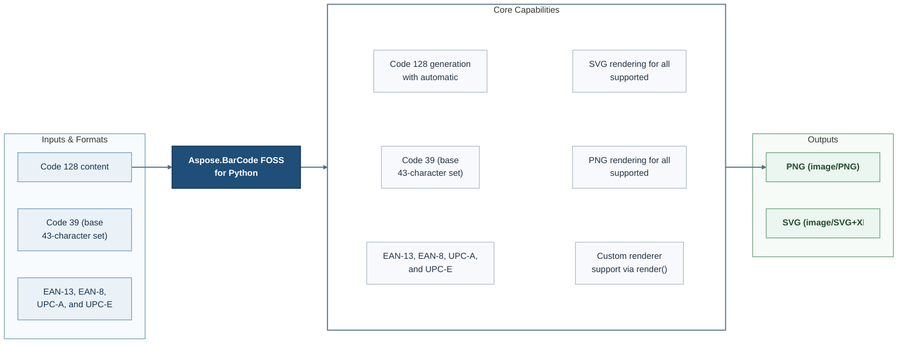

# Aspose.BarCode FOSS for Python

[](https://github.com/aspose-barcode-foss/Aspose.BarCode-FOSS-for-Python/tree/06eca5c01e13ed6d59a640f1cf330c1c5a57d151)   [](LICENSE) [](https://github.com/aspose-barcode-foss/Aspose.BarCode-FOSS-for-Python/graphs/contributors)


Aspose.BarCode FOSS for Python provides Code 128 generation with automatic optimal Code Set switching for developers using Python.

## Navigation

- [At a Glance](#at-a-glance)
- [Key Capabilities](#key-capabilities)
- [Installation](#installation)
- [Dependencies](#dependencies)
- [Quick Start](#quick-start)
- [Additional Examples](#additional-examples)
- [API Reference](#api-reference)
- [API Method Index](#api-method-index)
- [Documentation & Resources](#documentation-resources)
- [Scope and Limitations](#scope-and-limitations)
- [Development and Testing](#development-and-testing)
- [License](#license)

## At a Glance



## Key Capabilities

- **Work with Code 128 generation with automatic optimal Code Set switching** - Build the corresponding content through the public object model.
- **Work with Code 39 (base 43-character set) and Extended (full ASCII) generation** - Build the corresponding content through the public object model.
- **Work with EAN-13, EAN-8, UPC-A, and UPC-E generation with optional check digit input** - Build the corresponding content through the public object model.
- **Work with SVG rendering for all supported symbologies** - Produce supported output through the public API.
- **Work with PNG rendering for all supported symbologies** - Produce supported output through the public API.
- **Work with Custom renderer support via render() method** - Use the public `Renderer` API in application workflows.

## Installation

Install the package directly from its source repository:

```bash
git clone https://github.com/aspose-barcode-foss/Aspose.BarCode-FOSS-for-Python.git
cd Aspose.BarCode-FOSS-for-Python
git checkout --detach 06eca5c01e13ed6d59a640f1cf330c1c5a57d151
python -m pip install .
```

Use source installation for the `aspose-barcode-foss` distribution.

## Dependencies

### Required Package Dependencies

Required runtime dependencies declared in `pyproject.toml`: `Pillow>=10.1.0`.

### Development Dependencies

Development dependencies declared in `pyproject.toml`: `pytest>=8.0`, `ruff>=0.15.7`.

## Quick Start

```python
from aspose_barcode_foss import SvgRenderer

renderer = SvgRenderer()
```

## Additional Examples

Expand this section to view examples for exploring another repository workflow, exploring the QrOptions, QrErrorCorrectionLevel, and QrEncodeMode APIs, exploring the Code39Options APIs, exploring the RenderOptions APIs, and browsing repository example files, plus 1 more workflow.

<details>
<summary>View additional examples and results</summary>

### Explore Another Repository Workflow

```python
from aspose_barcode_foss import code128

barcode = code128("Hello-World")
svg = barcode.to_svg()
png = barcode.to_png()
```

### Explore Another Repository Workflow with Generate

```python
from aspose_barcode_foss import generate

barcode = generate("qr", "https://example.com")
png = barcode.to_png()
```

### Explore the QrOptions, QrErrorCorrectionLevel, and QrEncodeMode APIs

```python
from aspose_barcode_foss import qr, QrOptions, QrErrorCorrectionLevel, QrEncodeMode

barcode = qr(
    "PAYLOAD",
    encode=QrOptions(
        error_correction_level=QrErrorCorrectionLevel.H,
        encoding_mode=QrEncodeMode.AUTO,
    ),
)
```

### Explore the Code39Options APIs

```python
from aspose_barcode_foss import code39, Code39Options

barcode = code39("ABC-123", encode=Code39Options(add_check_digit=True))
```

### Explore the RenderOptions APIs

```python
from aspose_barcode_foss import code128, RenderOptions

barcode = code128("Hello-World")
svg = barcode.to_svg(options=RenderOptions(scale=2.0, show_text=True))
png = barcode.to_png(options=RenderOptions(dpi=300, module_width=3.0))
```

### Repository Example Files

- [`all_symbologies.py`](examples/all_symbologies.py)
- [`error_handling.py`](examples/error_handling.py)
- [`quickstart.py`](examples/quickstart.py)
- [`render_options.py`](examples/render_options.py)

</details>

## API Reference

The package documents 51 public types across 4 namespaces. Package namespaces include `aspose_barcode_foss`. See the complete API reference under Documentation & Resources for members, signatures, and inherited APIs.

<details>
<summary>View public API by namespace</summary>

### Aspose.Barcode Namespace (`aspose_barcode_foss`)

| Type | Description |
| --- | --- |
| `Barcode` | Represents a Barcode in the public aspose barcode FOSS API for Aspose.Barcode. Supports converting content to PDF, encoding page content as PNG, and converting content to SVG. |
| `BarcodeError` | Signals a barcode error condition; derives from `Exception`. |
| `Code128EncodeMode` | Enumerates code128 encode mode values. |
| `Code128Options` | Configures Code128 operations through the Aspose.Barcode API. Inherits from `EncodeOptions`. |
| `Code39EncodeMode` | Enumerates code39 encode mode values. |
| `Code39Options` | Configures Code39 operations through the Aspose.Barcode API. Inherits from `EncodeOptions`. |
| `Ean13Options` | Configures Ean13 operations through the Aspose.Barcode API. Inherits from `EncodeOptions`. |
| `Ean8Options` | Configures Ean8 operations through the Aspose.Barcode API. Inherits from `EncodeOptions`. |
| `EncodeOptions` | Configures Encode operations through the Aspose.Barcode API. |
| `EncodingError` | Represents an Encoding Error in the public aspose barcode FOSS API for Aspose.Barcode. Inherits from `BarcodeError`. |
| `InvalidInputError` | Represents an Invalid Input Error in the public aspose barcode FOSS API for Aspose.Barcode. Inherits from `BarcodeError`. |
| `PdfRenderer` | Renders PDF content through the Aspose.Barcode API. Inherits from `Renderer`. |
| `PngRenderer` | Renders PNG content through the Aspose.Barcode API. Inherits from `Renderer`. |
| `QrEncodeMode` | Enumerates qr encode mode values. |
| `QrErrorCorrectionLevel` | Enumerates qr error correction level values. |
| `QrOptions` | Configures Qr operations through the Aspose.Barcode API. Inherits from `EncodeOptions`. |
| `RenderOptions` | Configures Render operations through the Aspose.Barcode API. |
| `Renderer` | Renders barcode content through the Aspose.Barcode API. Inherits from `ABC`. |
| `RenderingError` | Represents a Rendering Error in the public aspose barcode FOSS API for Aspose.Barcode. Inherits from `BarcodeError`. |
| `ResolvedRenderOptions` | Configures Resolved Render operations through the Aspose.Barcode API. |
| `SvgRenderer` | Renders SVG content through the Aspose.Barcode API. Inherits from `Renderer`. |
| `SymbologyNotFoundError` | Represents a Symbology Not Found Error in the public aspose barcode FOSS API for Aspose.Barcode. Inherits from `BarcodeError`. |
| `UnsupportedCapabilityError` | Represents an Unsupported Capability Error in the public aspose barcode FOSS API for Aspose.Barcode. Inherits from `BarcodeError`. |
| `UnsupportedFeatureError` | Represents an Unsupported Feature Error in the public aspose barcode FOSS API for Aspose.Barcode. Inherits from `BarcodeError`. |
| `UpcaOptions` | Configures Upca operations through the Aspose.Barcode API. Inherits from `EncodeOptions`. |
| `UpceOptions` | Configures Upce operations through the Aspose.Barcode API. Inherits from `EncodeOptions`. |

### Aspose.Barcode.Exceptions Namespace (`aspose_barcode_foss.exceptions`)

| Type | Description |
| --- | --- |
| `BarcodeError` | The `aspose_barcode_foss.exceptions` namespace re-exports `BarcodeError` from the primary `aspose_barcode_foss` namespace. |
| `EncodingError` | The `aspose_barcode_foss.exceptions` namespace re-exports `EncodingError` from the primary `aspose_barcode_foss` namespace. |
| `InvalidInputError` | The `aspose_barcode_foss.exceptions` namespace re-exports `InvalidInputError` from the primary `aspose_barcode_foss` namespace. |
| `RenderingError` | The `aspose_barcode_foss.exceptions` namespace re-exports `RenderingError` from the primary `aspose_barcode_foss` namespace. |
| `SymbologyNotFoundError` | The `aspose_barcode_foss.exceptions` namespace re-exports `SymbologyNotFoundError` from the primary `aspose_barcode_foss` namespace. |
| `UnsupportedCapabilityError` | The `aspose_barcode_foss.exceptions` namespace re-exports `UnsupportedCapabilityError` from the primary `aspose_barcode_foss` namespace. |
| `UnsupportedFeatureError` | The `aspose_barcode_foss.exceptions` namespace re-exports `UnsupportedFeatureError` from the primary `aspose_barcode_foss` namespace. |

### Aspose.Barcode.Options Namespace (`aspose_barcode_foss.options`)

| Type | Description |
| --- | --- |
| `Code128EncodeMode` | The `aspose_barcode_foss.options` namespace re-exports `Code128EncodeMode` from the primary `aspose_barcode_foss` namespace. |
| `Code128Options` | The `aspose_barcode_foss.options` namespace re-exports `Code128Options` from the primary `aspose_barcode_foss` namespace. |
| `Code39EncodeMode` | The `aspose_barcode_foss.options` namespace re-exports `Code39EncodeMode` from the primary `aspose_barcode_foss` namespace. |
| `Code39Options` | The `aspose_barcode_foss.options` namespace re-exports `Code39Options` from the primary `aspose_barcode_foss` namespace. |
| `Ean13Options` | The `aspose_barcode_foss.options` namespace re-exports `Ean13Options` from the primary `aspose_barcode_foss` namespace. |
| `Ean8Options` | The `aspose_barcode_foss.options` namespace re-exports `Ean8Options` from the primary `aspose_barcode_foss` namespace. |
| `EncodeOptions` | The `aspose_barcode_foss.options` namespace re-exports `EncodeOptions` from the primary `aspose_barcode_foss` namespace. |
| `QrEncodeMode` | The `aspose_barcode_foss.options` namespace re-exports `QrEncodeMode` from the primary `aspose_barcode_foss` namespace. |
| `QrErrorCorrectionLevel` | The `aspose_barcode_foss.options` namespace re-exports `QrErrorCorrectionLevel` from the primary `aspose_barcode_foss` namespace. |
| `QrOptions` | The `aspose_barcode_foss.options` namespace re-exports `QrOptions` from the primary `aspose_barcode_foss` namespace. |
| `RenderOptions` | The `aspose_barcode_foss.options` namespace re-exports `RenderOptions` from the primary `aspose_barcode_foss` namespace. |
| `ResolvedRenderOptions` | The `aspose_barcode_foss.options` namespace re-exports `ResolvedRenderOptions` from the primary `aspose_barcode_foss` namespace. |
| `UpcaOptions` | The `aspose_barcode_foss.options` namespace re-exports `UpcaOptions` from the primary `aspose_barcode_foss` namespace. |
| `UpceOptions` | The `aspose_barcode_foss.options` namespace re-exports `UpceOptions` from the primary `aspose_barcode_foss` namespace. |

### Aspose.Barcode.Renderers Namespace (`aspose_barcode_foss.renderers`)

| Type | Description |
| --- | --- |
| `PdfRenderer` | The `aspose_barcode_foss.renderers` namespace re-exports `PdfRenderer` from the primary `aspose_barcode_foss` namespace. |
| `PngRenderer` | The `aspose_barcode_foss.renderers` namespace re-exports `PngRenderer` from the primary `aspose_barcode_foss` namespace. |
| `Renderer` | The `aspose_barcode_foss.renderers` namespace re-exports `Renderer` from the primary `aspose_barcode_foss` namespace. |
| `SvgRenderer` | The `aspose_barcode_foss.renderers` namespace re-exports `SvgRenderer` from the primary `aspose_barcode_foss` namespace. |

</details>

## API Method Index

<details>
<summary>View documented public members</summary>

| Type | Member | Description |
| --- | --- | --- |
| `Barcode` | `Barcode.render(renderer, options) -> RenderedArtifact` | Calls the `render` operation on `Barcode`. |
| `Barcode` | `Barcode.to_pdf(options) -> bytes` | Supports converting content to PDF through `Barcode`. |
| `Barcode` | `Barcode.to_png(options) -> bytes` | Supports encoding page content as PNG through `Barcode`. |
| `Barcode` | `Barcode.to_svg(options) -> str` | Supports converting content to SVG through `Barcode`. |
| `PdfRenderer` | `PdfRenderer.render(symbol, layout, options) -> RenderedArtifact` | Calls the `render` operation on `PdfRenderer`. |
| `PngRenderer` | `PngRenderer.render(symbol, layout, options) -> RenderedArtifact` | Calls the `render` operation on `PngRenderer`. |
| `Renderer` | `Renderer.render(symbol, layout, options) -> RenderedArtifact` | Calls the `render` operation on `Renderer`. |
| `SvgRenderer` | `SvgRenderer.render(symbol, layout, options) -> RenderedArtifact` | Calls the `render` operation on `SvgRenderer`. |

</details>

## Documentation & Resources

- **[Getting started guide](https://docs.aspose.org/barcode/python/)** - installation, walkthroughs, and feature guides for this library.
- **[How-to guides and FAQ](https://kb.aspose.org/barcode/python/)** - task-focused answers for common product questions.
- **[Full API reference](https://reference.aspose.org/barcode/python/)** - the complete browsable reference for the public API.
- Found a bug or have a feature request? [Open an issue](https://github.com/aspose-barcode-foss/Aspose.BarCode-FOSS-for-Python/issues) on GitHub.

## Scope and Limitations

The library targets the workflows listed above. Ten specific constraints are listed below.

- Explicit quiet_zone overrides can shrink below the Code 128 10X minimum; enforcement is not implemented yet.
- A fixed 3:1 wide:narrow ratio is used; the spec's configurable 2.0:1–3.0:1 range is not implemented.
- The nominal 1X inter-character gap is used; the spec's gap-widening allowances are not implemented.
- Explicit quiet_zone overrides can shrink below the Code 39 10X minimum; enforcement is not implemented.
- Bar/space compensation (ISO/IEC 15420:2009 4.3.6, Table 8) is not implemented.
- Text layout is not implemented for symbology.
- GS1, ECI, bytes / binary input, FNC handling, Code Set A/C, Shift, and code-set switching are unsupported.
- Only the SVG backend is implemented for Code 128.
- GS1, ECI, bytes / binary input, and structured append are unsupported.
- Only the SVG backend is implemented for Code 39.

The package manifest classifies this release as **Beta**. The distribution includes the [`src/aspose_barcode_foss/py.typed`](src/aspose_barcode_foss/py.typed) type marker.

For requirements beyond the FOSS scope described above, explore the [full-featured Aspose.BarCode Enterprise Edition](https://products.aspose.com/barcode/). It is a separate product, so features and APIs may differ.

## Development and Testing

The repository includes 48 test files.

### Tests

- [`tests/api/test_api_entrypoints.py`](tests/api/test_api_entrypoints.py)
- [`tests/api/test_barcode_service.py`](tests/api/test_barcode_service.py)
- [`tests/api/test_code128_api_success.py`](tests/api/test_code128_api_success.py)
- [`tests/api/test_symbology_registry.py`](tests/api/test_symbology_registry.py)
- [`tests/conftest.py`](tests/conftest.py)
- [`tests/encoding/test_code128_golden_vectors.py`](tests/encoding/test_code128_golden_vectors.py)
- [Browse all test files](tests)

### Focused Commands and Repository Scripts

```bash
python -m pip install -e .
```

## License

This project is available under the [MIT License](LICENSE). It permits use, modification, distribution, and commercial use when the license and copyright notice are retained.
