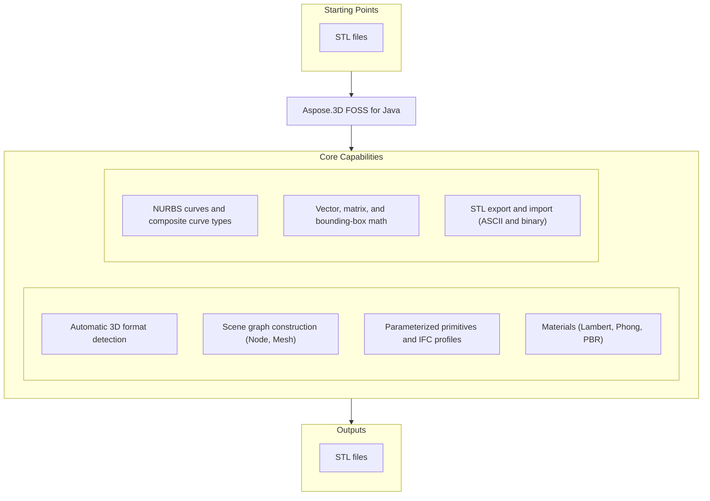

# Aspose.3D FOSS for Java

[](https://repo1.maven.org/maven2/org/aspose/aspose-3d-foss/) [](https://openjdk.org/projects/jdk/21/) [](LICENSE) [](https://github.com/aspose-3d-foss/Aspose.3D-FOSS-for-Java/graphs/contributors)

[](https://products.aspose.org/3d/java/)

Aspose.3D FOSS for Java is a free, open-source Java library for working with 3D scenes and
meshes through an Aspose.3D-compatible API. It builds and traverses a scene graph of nodes,
meshes, curves, and materials, detects 3D file formats automatically, and reads and writes
the formats implemented in this edition. It is a clean-room implementation, engineered
independently to the same public API design as the commercial Aspose.3D for Java library,
rather than a reduction of its proprietary source.

## Navigation

- [At a glance](#at-a-glance)
- [Key capabilities](#key-capabilities)
- [Installation](#installation)
- [Quick start](#quick-start)
- [Additional examples](#additional-examples)
- [API reference](#api-reference)
- [Documentation & resources](#documentation--resources)
- [Scope and limitations](#scope-and-limitations)
- [Development and testing](#development-and-testing)
- [License](#license)

## At a Glance



## Key Capabilities

- Detect a 3D file's format automatically, or resolve an explicit format from a file path or binary stream (`FileFormat.detect`, `FileFormat.getFormatByExtension`). Of the formats this edition can detect, only STL currently loads real scene content — see [Scope and limitations](#scope-and-limitations).
- Build a scene graph from scratch: `Scene`, `Node.createChildNode`, and `Mesh` with control points and polygons.
- Construct parameterized primitives such as `Box`, `Cylinder`, and `Dish`, and IFC-style profiles such as `CircleShape` and `EllipseShape`.
- Apply materials — `LambertMaterial`, `PhongMaterial`, and `PbrMaterial` — with configurable colors, transparency, and reflection.
- Work with `NurbsCurve` (degree, order, knot vectors, control points) and composite curve types.
- Use the `Vector2`/`Vector3`/`Vector4`, `Matrix4`, and `BoundingBox` math utilities that back the scene graph, and read or set each `Node`'s `Transform` (`getTransform().getTranslation()` / `setTranslation(...)`).
- Export to STL in ASCII or binary form (`StlSaveOptions`), and read STL back with `StlLoadOptions`.

## Installation

Add the dependency to your `pom.xml`:

```xml
<dependency>
  <groupId>org.aspose</groupId>
  <artifactId>aspose-3d-foss</artifactId>
  <version>26.5.0</version>
</dependency>
```

Gradle (Groovy DSL):

```groovy
implementation 'org.aspose:aspose-3d-foss:26.5.0'
```

The library targets Java 21 and has no third-party runtime dependencies.

## Quick Start

Load an STL file and re-save it in an explicit STL representation — format is detected
automatically for the load:

```java
import com.aspose.threed.FileFormat;
import com.aspose.threed.Scene;

Scene scene = Scene.fromFile("input/cube.stl");
scene.save("output.stl", FileFormat.STLASCII);
```

Build a scene from scratch and export it to STL:

```java
import com.aspose.threed.Mesh;
import com.aspose.threed.Node;
import com.aspose.threed.Scene;

Scene scene = new Scene();
Mesh mesh = new Mesh("TestMesh");

mesh.addControlPoint(0, 0, 0);
mesh.addControlPoint(1, 0, 0);
mesh.addControlPoint(0, 1, 0);
mesh.addControlPoint(0, 0, 1);

mesh.createPolygon(new int[]{0, 1, 2});
mesh.createPolygon(new int[]{0, 1, 3});
mesh.createPolygon(new int[]{0, 2, 3});
mesh.createPolygon(new int[]{1, 2, 3});

scene.getRootNode().createChildNode("TestNode", mesh);
scene.save("output.stl");
```

## Additional Examples

Every example below is exercised by the project's own test suite. See the
[`src/test/java/com/aspose/threed`](https://github.com/aspose-3d-foss/Aspose.3D-FOSS-for-Java/tree/master/src/test/java/com/aspose/threed)
tests for the full set.

### Save in an Explicit Format or With Save Options

```java
import com.aspose.threed.FileFormat;
import com.aspose.threed.Scene;
import com.aspose.threed.StlSaveOptions;

scene.save("output.stl", FileFormat.STLASCII);

// ...or with save options
scene.save("output.stl", new StlSaveOptions());
```

<details>
<summary>View Additional Examples</summary>

### Detect a Format From a Stream and Load It

```java
FileInputStream stream = new FileInputStream(new File("testdata/input/cube.stl"));
Scene scene = new Scene();
FileFormat format = FileFormat.getFormatByExtension(".stl");
scene.open(Stream.wrap(stream), format);
stream.close();

Node node = scene.getRootNode().getChildNodes().get(0);
Mesh mesh = (Mesh) node.getEntities().get(0);
System.out.println(mesh.getControlPoints().size());
System.out.println(mesh.getPolygonCount());
```

### Build and Inspect a Scene Graph

```java
Scene scene = new Scene();
Node node = scene.getRootNode().createChildNode("TestNode");
System.out.println(node.getName());
System.out.println(scene.getRootNode().getChildNodes().size());
```

### Read and Set a Node's Transform

```java
Node node = scene.getRootNode().createChildNode("TestNode");
Vector3 translation = node.getTransform().getTranslation();
node.getTransform().setTranslation(new Vector3(1, 2, 3));
```

### Create and Inspect Materials

```java
import com.aspose.threed.LambertMaterial;
import com.aspose.threed.Vector3;

LambertMaterial material = new LambertMaterial("Body");
material.setDiffuseColor(new Vector3(0.8, 0.2, 0.2));
material.setAmbientColor(new Vector3(0.1, 0.1, 0.1));
material.setTransparency(0.0);
```

```java
import com.aspose.threed.PbrMaterial;

PbrMaterial pbr = new PbrMaterial();
pbr.setAlbedo(new Vector3(1, 1, 1));
pbr.setMetallicFactor(0.5);
pbr.setRoughnessFactor(0.3);
```

### Construct a NURBS Curve

```java
import com.aspose.threed.CurveDimension;
import com.aspose.threed.NurbsCurve;
import com.aspose.threed.NurbsType;

NurbsCurve curve = new NurbsCurve();
curve.setOrder(4);
System.out.println(curve.getDegree());
System.out.println(curve.getDimension());
System.out.println(curve.getCurveType());
```

### Vector3 Math

```java
import com.aspose.threed.Vector3;

Vector3 a = new Vector3(1, 0, 0);
Vector3 b = new Vector3(0, 1, 0);
Vector3 sum = Vector3.add(a, b); // add is static; dot/cross below are instance methods
double dot = a.dot(b);
Vector3 cross = a.cross(b);
```

</details>

## API Reference

The public entry points are the scene graph (`Scene`, `Node`, `Entity`, `A3DObject`), the
primitive and mesh types (`Box`, `Cylinder`, `Dish`, `Mesh`, `Curve`, ...), the material system
(`LambertMaterial`, `PhongMaterial`, `PbrMaterial`), and one `LoadOptions`/`SaveOptions` pair
per file format, resolved through `FileFormat`. The library ships 195 public classes in total;
the sections below cover the ones used most often.

This library's public API is engineered to match Aspose.3D for Java's package structure
(`com.aspose.threed.*`), method signatures, and class names, within the capabilities this
edition implements. Because the API design is shared, the commercial edition's
[developer documentation](https://docs.aspose.com/3d/java/) and
[API reference](https://reference.aspose.com/3d/java/) are useful supplementary resources
within the supported feature set.

<details>
<summary>View the Supported Public API Surface</summary>

### Core API

| Class | Description |
|---|---|
| `A3DObject` | A3DObject.A3DObject creates an object with an empty name. |
| `AnimationClip` | AnimationClip.AnimationClip creates a new animation clip with an empty name. |
| `AssetInfo` | AssetInfo.AssetInfo creates a new AssetInfo instance with default values. |
| `AxisSystem` | AxisSystem.AxisSystem creates an AxisSystem with the given coordinate system, up axis, and front axis. |
| `BoundingBox` | BoundingBox.BoundingBox creates an empty bounding box with default minimum and maximum values. |
| `Camera` | Camera.Camera creates a new camera instance with default name and properties. |
| `Cancellation` | Cancellation.Cancellation creates a new cancellation token instance. |
| `CustomObject` | CustomObject.CustomObject(name:String) creates a new CustomObject with the specified name. |
| `Deformer` | Deformer.Deformer creates a new Deformer instance with default settings. |
| `Entity` | Entity.Entity creates a new Entity with no name. |
| `EntityRendererKey` | EntityRendererKey.EntityRendererKey creates a key with the specified rendering features and name. |
| `ExportException` | ExportException.ExportException creates an exception with a given error message. |
| `FVector3` | FVector3.FVector3 creates a vector with all components set to zero. |
| `FVector4` | FVector4.FVector4 creates a vector with all components initialized to zero. |
| `FbxExporter` | FbxExporter.canExport returns true if the exporter supports the specified FileFormat. |
| `FbxImporter` | FbxImporter.canImport returns true if the specified FileFormat is supported for import. |
| `FbxLoadOptions` | FbxLoadOptions.getFlipCoordinateSystem returns whether the coordinate system is flipped on load. |
| `FbxSaveOptions` | FbxSaveOptions.FbxSaveOptions creates a new instance with default FBX save settings. |
| `FileFormat` | Identifies a specific 3D file format variant (e.g. `FBX7400_BINARY`, `WAVEFRONTOBJ`, `GLTF2`) together with its version, content type (ASCII/binary), and file extension; also exposes `detect()`/`getFormatByExtension()` for format resolution. |
| `FileFormatType` | FileFormatType.getExtension() returns the associated file extension string. |
| `Geometry` | Geometry.Geometry creates a new Geometry with default name. |
| `GlobalTransform` | GlobalTransform.GlobalTransform creates a new GlobalTransform instance with default matrix, translation, rotation, and scale. |
| `GltfExporter` | Class with 2 methods. |
| `GltfImporter` | GltfImporter.canImport checks if the specified FileFormat is supported for import. |
| `GltfLoadOptions` | GltfLoadOptions.getFlipCoordinateSystem returns true if the loader flips the coordinate system. |
| `GltfSaveOptions` | GltfSaveOptions.GltfSaveOptions constructs a new instance with default settings. |
| `IOService` | IOService.detectFormat detects the file format of a stream, optionally using the file name. |
| `ImageRenderOptions` | `SaveOptions` for rendering a scene to a raster image — background color, shadow rendering, and asset-directory lookup paths. |
| `ImportException` | ImportException.ImportException creates an exception with a detail message. |
| `LoadOptions` | LoadOptions.LoadOptions creates a LoadOptions instance with default settings. |
| `Material` | Material.Material creates a new material instance with the specified name. |
| `Matrix4` | Matrix4.Matrix4 creates a new identity matrix. |
| `Mesh` | Mesh.Mesh creates an empty mesh with default name. |
| `Node` | Represents a node in the scene graph — holds a local `Transform`, child `Node`s, and the `Entity` objects (geometry, camera, light) attached to it. |
| `ObjExporter` | ObjExporter.canExport returns true when the exporter can handle the specified FileFormat. |
| `ObjImporter` | Class with 2 methods. |
| `ObjLoadOptions` | ObjLoadOptions.ObjLoadOptions creates a new ObjLoadOptions object with default option values. |
| `ObjSaveOptions` | ObjSaveOptions.getApplyUnitScale returns true if unit scaling is applied when saving. |
| `ParseException` | ParseException.ParseException creates an exception with the specified error message. |
| `PbrMaterial` | PbrMaterial.PbrMaterial() creates a new PbrMaterial with default values. |
| `Pose` | Stores the transformation matrices used when skinning a mesh's geometry — a set of `BonePose` entries, one per bone node. |
| `Property` | Property.Property creates a Property with the given name and value. |
| `PropertyCollection` | PropertyCollection.add adds the specified Property to the collection. |
| `Quaternion` | Quaternion.Quaternion creates a quaternion with default components (0,0,0,0). |
| `SaveOptions` | SaveOptions.SaveOptions initializes a new SaveOptions instance with default settings. |
| `Scene` | Represents a complete 3D scene — the root container for the node graph (`getRootNode()`), animation clips, and poses, and the entry point for loading and saving 3D files via `save()`/`FileFormat`. |
| `SceneObject` | SceneObject.SceneObject creates a new SceneObject with default settings. |
| `StlExporter` | Class with 2 methods. |
| `StlImporter` | StlImporter.canImport determines whether the given file format is supported for import. |
| `StlLoadOptions` | StlLoadOptions.StlLoadOptions initializes a new instance with the specified content type. |
| `StlSaveOptions` | StlSaveOptions.StlSaveOptions initializes a new instance using the specified FileContentType. |
| `Stream` | Stream.Stream creates a Stream wrapping the given InputStream. |
| `TextureData` | TextureData.TextureData creates a new instance of TextureData. |
| `Transform` | Represents a node's local transformation — translation, scaling, and rotation (plus pivot/offset controls) resolvable to a `Matrix4`. |
| `Vector2` | Vector2.Vector2 creates a vector with both components set to zero. |
| `Vector3` | Mutable 3D vector (`x`, `y`, `z` double fields) used throughout the API for positions, scaling, rotation, and colors. |
| `Vector4` | Vector4.Vector4 initializes a vector with the specified x, y, z, and w component values. |
| `Version` | Version.Version(major:int, minor:int) creates a version with specified major and minor numbers. |
| `VertexElement` | VertexElement.getType returns the element's data type. |
| `VertexElementBinormal` | VertexElementBinormal.VertexElementBinormal creates a binormal vertex element with specified mapping and reference modes. |
| `VertexElementMaterial` | VertexElementMaterial.VertexElementMaterial creates a material vertex element using the given mapping and reference modes. |
| `VertexElementNormal` | VertexElementNormal.VertexElementNormal constructs a vertex normal element using the given mapping and reference modes. |
| `VertexElementTangent` | VertexElementTangent.VertexElementTangent creates a tangent vertex element using the given mappingMode and referenceMode. |
| `VertexElementUV` | VertexElementUV.VertexElementUV creates a new instance with the given texture mapping, mapping mode, and reference mode. |
| `VertexElementVertexColor` | Per-vertex color data element (`VertexElementType.VERTEX_COLOR`) attached to a mesh's vertex buffer. |

#### Interfaces

| Interface | Description |
|---|---|
| `IExporter` | IExporter.canExport returns true when the exporter supports the specified FileFormat. |
| `IImporter` | IImporter.canImport determines whether the given FileFormat is supported for import. |
| `IMeshConvertible` | IMeshConvertible.toMesh converts the implementing object to a Mesh instance. |
| `INamedObject` | INamedObject.getName returns the object's current name. |
| `NodeVisitor` | NodeVisitor.visit processes the specified Node and returns true to continue traversal, false to stop. |
| `Struct` | Struct.clone returns a new instance that is a copy of this struct. |

#### Enumerations

| Enumeration | Description |
|---|---|
| `Axis` | Axis.X_AXIS represents the positive X axis direction. |
| `BooleanOperation` | BooleanOperation.UNION represents a boolean operation that combines two solids into their union. |
| `CoordinateSystem` | CoordinateSystem.RIGHT_HANDED represents a right‑handed coordinate system orientation. |
| `EntityRendererFeatures` | EntityRendererFeatures.None represents no rendering features enabled. |
| `FileContentType` | FileContentType.BINARY represents a binary file content type. |
| `MappingMode` | MappingMode.CONTROL_POINT represents mapping values per control point. |
| `ReferenceMode` | ReferenceMode.DIRECT represents a reference mode where vertex data is stored directly without indices. |
| `TextureMapping` | TextureMapping.AMBIENT represents the ambient texture mapping channel. |
| `VertexElementType` | VertexElementType.BINORMAL represents a vertex's binormal (bitangent) vector attribute. |

---

#### Detailed Member Reference

### Scene Graph

- `Scene`
  - `Scene()`, `fromFile(path) -> Scene`, `open(stream, format)`
  - `getRootNode() -> Node`
  - `save(path)`, `save(path, format)`, `save(path, options)`
  - `getName() -> String`
- `Node` (extends `A3DObject`)
  - `createChildNode(name)`, `createChildNode(name, entity)`
  - `getChildNodes() -> List<Node>`
  - `getEntities() -> List<Entity>`
  - `getTransform() -> Transform`
- `Mesh`
  - `addControlPoint(x, y, z)`
  - `createPolygon(indices)`
  - `getControlPoints() -> ...`, `getPolygonCount() -> int`

### Primitives and Profiles

- `Box`, `Cylinder`, `Dish` — parameterized solid primitives with `toMesh() -> Mesh`
- `CircleShape`, `EllipseShape` (extend `ParameterizedProfile`) — IFC-compatible 2D profiles
- `BooleanOperator`, `BooleanOperand`, `BooleanOperation` — mesh boolean add/subtract/intersect

### Materials

- `Material` (base)
- `LambertMaterial` — `getDiffuseColor/setDiffuseColor`, `getAmbientColor/setAmbientColor`, `getEmissiveColor/setEmissiveColor`, `getTransparency/setTransparency`
- `PhongMaterial` — adds `getSpecularColor/setSpecularColor`, `getShininess/setShininess`, `getReflectionFactor/setReflectionFactor`
- `PbrMaterial` — `getAlbedo/setAlbedo`, `getMetallicFactor/setMetallicFactor`, `getRoughnessFactor/setRoughnessFactor`, `getOcclusionFactor/setOcclusionFactor`, `fromMaterial(material) -> PbrMaterial`

### Curves

- `Curve` (abstract base), `Circle`, `Ellipse`, `CompositeCurve`
- `NurbsCurve` — `getDegree/setDegree`, `getOrder/setOrder`, `getControlPoints`, `getKnotVectors`, `getMultiplicity`, `getRational/setRational`, `getCurveType/setCurveType`

### Math and Geometry

- `Vector2`, `Vector3` — `add`, `dot`, `cross`, component accessors
- `Vector4` — plain `x`/`y`/`z`/`w` component fields only (no `add`/`dot`/`cross` methods)
- `Matrix4` — transform matrices
- `BoundingBox` — `getMinimum`, `getMaximum`, `getCenter`, `getSize`, `merge`, `contains`
- `BoundingBox2D` — `getMinimum`, `getMaximum`, `merge`
- `Transform` — `getTranslation/setTranslation`

### File I/O

- `FileFormat` — `detect(stream, fileName)`, `getFormatByExtension(path)`, `getCanImport()`, `getCanExport()`, format constants (`WAVEFRONTOBJ`, `STL_BINARY`, `STLASCII`, and others)
- `StlLoadOptions` — `getFlipCoordinateSystem/setFlipCoordinateSystem`, `getRecalculateNormal/setRecalculateNormal`
- `StlSaveOptions` — `getFlipCoordinateSystem/setFlipCoordinateSystem`, `getAxisSystem/setAxisSystem`
- `LoadOptions`, `SaveOptions` (bases for all format-specific options)

### Enums

- `Axis`, `CoordinateSystem`, `BoneLinkMode`, `BooleanOperation`, `DracoCompressionLevel`, `ApertureMode`, `BindPoint`

The full surface totals 195 public classes. See the [full API reference](#documentation--resources)
below for every type.

</details>

## Documentation & Resources

- **[Getting started guide](https://docs.aspose.org/3d/java/)** — installation, walkthroughs, and feature guides for this library.
- **[How-to guides & FAQ](https://kb.aspose.org/3d/java/)** — task-focused answers for common 3D-processing questions.
- **[Full API reference](https://reference.aspose.org/3d/java/)** — the complete, browsable reference for all 195 public classes.
- **[FILE_FORMATS.md](FILE_FORMATS.md)** — per-format support status in this repository.
- **[TODO.md](TODO.md)** — current porting progress and planned work.
- **[Contributor guide](AGENTS.md)** — architecture notes and conventions for contributors.
- **[Publishing guide](PUBLISHING.md)** — how this package is built and released.
- In-repo implementation notes: [API diff since 26.1.0](docs/api-diff-26.1.0.md),
  [directory structures](docs/directory-structures.md), and
  [project progress](docs/foss-java-progress.md).
- Found a bug or have a feature request? [Open an issue](https://github.com/aspose-3d-foss/Aspose.3D-FOSS-for-Java/issues) on GitHub.

## Scope and Limitations

- STL import and export (ASCII and binary) is the only fully functional read/write path in this
  edition.
- Wavefront OBJ import does not currently work, despite being format-detectable — see
  [upstream-issues.md](upstream-issues.md) for details.
- Save options classes exist for other formats (Collada, glTF, FBX-family, AMF, Draco, and more),
  but their encoders are not yet wired up in this FOSS build.
- Draco encoding and decoding, `Scene.render` (no rendering pipeline), and `Camera.moveForward`
  explicitly throw `UnsupportedOperationException`.
- Cryptographic and licensing/metering helpers — no licensing, trial, or DRM-related
  functionality — are not applicable to an open-source edition.
- `toMesh()` conversion is not implemented for a few parametric primitives (`Pyramid`, `Torus`,
  `RectangularTorus`, `RevolvedAreaSolid`, `LinearExtrusion`).

These limitations don't apply to
[Aspose.3D for Java — Enterprise Edition](https://products.aspose.com/3d/java/), which adds
rendering, the broader exchange-format set (FBX, glTF, USD, PDF, JT, and more), and advanced
mesh operations. Because this FOSS edition shares the same public API design, upgrading is a
package swap, not an API rewrite — your existing code continues to work unmodified.

## Development and Testing

This is a Maven project targeting Java 21. Build and test from source:

```bash
mvn clean package
mvn test
```

Releases are published via the
[Maven Central release workflow](.github/workflows/maven-central-release.yml).

## License

This project is licensed under the [MIT License](LICENSE). The MIT License permits use, copying,
modification, distribution, sublicensing, and commercial use, provided its copyright and
permission notice are retained. The software is provided without warranty.
