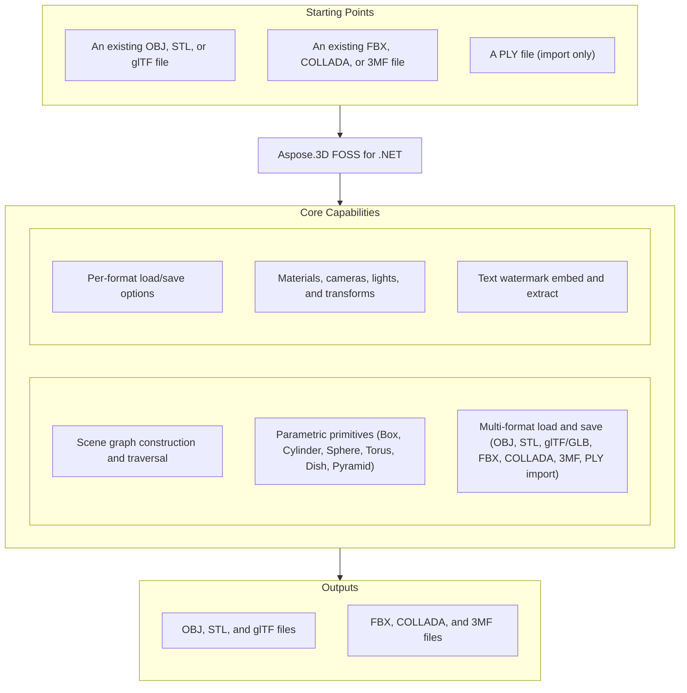

# Aspose.3D FOSS for .NET

[](https://www.nuget.org/packages/Aspose.3D.FOSS/) [](LICENSE) [](https://github.com/aspose-3d-foss/Aspose.3D-FOSS-for-.NET/graphs/contributors)

[](https://products.aspose.org/3d/net/)

Aspose.3D FOSS for .NET is a free, open-source, MIT-licensed .NET library for reading, building,
and exporting 3D scenes. It exposes an Aspose.3D-compatible scene-graph API — `Scene`, `Node`,
`Mesh`, `Camera`, `Transform` — and supports common interchange formats such as OBJ, STL, glTF/GLB,
FBX, COLLADA, 3MF, and PLY (import only), without requiring any native runtime, external SDK, or
third-party renderer. It is a clean-room implementation, engineered independently to the same
public API design as the commercial Aspose.3D for .NET library, rather than a reduction of its
proprietary source.

## Navigation

- [At a glance](#at-a-glance)
- [Key capabilities](#key-capabilities)
- [Installation](#installation)
- [Quick start](#quick-start)
- [Additional examples](#additional-examples)
- [API reference](#api-reference)
- [Documentation & resources](#documentation--resources)
- [Scope and limitations](#scope-and-limitations)
- [Development and testing](#development-and-testing)
- [License](#license)

## At a Glance



## Key Capabilities

- Build and traverse a scene graph with `Scene`, `Node`, `Group`, and `Entity` — nodes support
  child creation, merging, and global-transform evaluation.
- Create parametric primitives — `Box`, `Cylinder`, `Sphere`, `Torus`, `Dish`, `Pyramid` — and
  convert them to `Mesh` data for export.
- Load and save OBJ (with `.mtl` materials), STL (binary and ASCII), glTF 2.0 / GLB (PBR
  materials), FBX (import and export), COLLADA, and 3MF; PLY is import-only.
- Configure per-format behavior through dedicated load/save option classes, e.g.
  `ObjLoadOptions.FlipCoordinateSystem` / `NormalizeNormal` / `Scale`.
- Apply materials (`LambertMaterial`, `PhongMaterial`, `PbrMaterial`), cameras, lights, and
  `TransformBuilder`-composed transforms.

## Installation

Install the library from NuGet:

```bash
dotnet add package Aspose.3D.FOSS --version 26.1.0
```

The main library (`src/main/Aspose.ThreeD/Aspose.ThreeD.csproj`) multi-targets `net10.0`,
`net8.0`, `net6.0`, and `netcoreapp3.1` in Release builds (Debug builds target `net10.0` only).
The repository also contains a separate console conversion tool
(`src/converter/Converter.csproj`, package id `Aspose.3D.Converter`) that references the library
as a project — it is not published to NuGet.

## Quick Start

Load an OBJ scene and export it as glTF:

```csharp
using Aspose.ThreeD;

var scene = new Scene();
scene.Open("model.obj");
scene.Save("model.gltf");
```

Build a scene from a primitive and save it to OBJ:

```csharp
using Aspose.ThreeD;
using Aspose.ThreeD.Entities;

var scene = new Scene();
var box = new Box(2, 2, 2);
scene.RootNode.CreateChildNode("BoxNode", box);

scene.Save("box.obj");
```

## Additional Examples

Runnable examples and additional format coverage are collected below.

### Load OBJ With Options and Export as STL

```csharp
using Aspose.ThreeD;
using Aspose.ThreeD.Formats;

var scene = new Scene();
var opts = new ObjLoadOptions();
opts.FlipCoordinateSystem = true;
opts.NormalizeNormal = true;
scene.Open("mesh.obj", opts);

scene.Save("mesh.stl");
```

<details>
<summary>View Additional Examples</summary>

### Save a Scene to COLLADA Through a Stream

```csharp
using Aspose.ThreeD;
using Aspose.ThreeD.Entities;
using Aspose.ThreeD.Formats;

var scene = new Scene();
var box = new Box(2, 2, 2);
scene.RootNode.CreateChildNode("BoxNode", box);

using var stream = new MemoryStream();
var options = new ColladaSaveOptions();
scene.Save(stream, options);
```

### Handle an Unrecognized File Format

```csharp
using Aspose.ThreeD;

var scene = new Scene();
try
{
    scene.Open("unknown.xyz");
}
catch (ArgumentException)
{
    // No matching FileFormat could be resolved for the extension.
}
```

</details>

## API Reference

The public entry points are the scene graph (`Scene`, `Node`, `Entity`, `A3DObject`), the
primitive and mesh types (`Box`, `Cylinder`, `Mesh`, `Curve`, ...), the material system
(`LambertMaterial`, `PhongMaterial`, `PbrMaterial`), and one `LoadOptions`/`SaveOptions` pair per
file format, resolved through `FileFormat`. The library ships 193 public types in total; the
sections below cover the ones used most often.

This library's API surface is identical to Aspose.3D for .NET On-Premise for end users — code
that compiles against the commercial edition also compiles against this FOSS edition without
changes. Because the API design is shared, the commercial edition's
[developer documentation](https://docs.aspose.com/3d/net/) and
[API reference](https://reference.aspose.com/3d/net/) are useful supplementary resources within
the supported feature set.

<details>
<summary>View Selected API Surface</summary>

### Main

| Class | Description |
|---|---|
| `A3DObject` | The base class of all Aspose.ThreeD objects, all sub classes will support dynamic properties. |
| `A3dwSaveOptions` | Save options for A3DW format. |
| `AmfSaveOptions` | Save options for AMF. |
| `AnimationChannel` | AnimationChannel.AnimationChannel creates a new animation channel with no target specified. |
| `AnimationClip` | The Animation clip is a collection of animations. |
| `AnimationNode` | Aspose.3D's supports animation hierarchy, each animation can be composed by several animations and animation's key-frame definition. |
| `ArbitraryProfile` | This class allows you to construct a 2D profile directly from arbitrary curve. |
| `AssetInfo` | Information of asset. |
| `AxisSystem` | Axis system is an combination of coordinate system, up vector and front vector. |
| `BindPoint` | A BindPoint is usually created on an object's property, some property types contains multiple component fields(like a Vector3 field), will generate channel for each component field and connects the field to one or more keyframe sequence instance(s) through the channels. |
| `Bone` | A bone defines the subset of the geometry's control point, and defined blend weight for each control point. |
| `BonePose` | The contains the transformation matrix for a bone node. |
| `BooleanOperand` | This class encapsulates the transformed mesh as Boolean operation's operand. |
| `BooleanOperator` | Mesh boolean operations (add/subtract/intersect) between two entities. |
| `Box` | Box. |
| `CShape` | IFC compatible C-shape profile that defined by parameters. |
| `Camera` | The camera describes the eye point of the viewer looking at the scene. |
| `CenterLineProfile` | IFC compatible center line profile. |
| `Circle` | A curve consists of a set of points in the edge of the circle shape. |
| `CircleShape` | IFC compatible circle profile, which can be used to construct a mesh through. |
| `ClassType` | The class definitions . |
| `ColladaSaveOptions` | Save options for Collada format. |
| `CompositeCurve` | A is consisting of several curve segments. |
| `Curve` | The base class of all curve implementations. |
| `CustomObject` | Represents custom object data. |
| `Cylinder` | Parameterized Cylinder. |
| `Deformer` | Base class for and. |
| `DescriptorSetUpdater` | This class allows to update the in a chain operation. |
| `Discreet3dsLoadOptions` | Load options for 3DS file. |
| `Discreet3dsSaveOptions` | Save options for 3DS file. |
| `Dish` | Parameterized dish. |
| `DracoFormat` | Google Draco format. |
| `DracoSaveOptions` | Save options for Google draco files. |
| `DriverException` | The exception raised by internal rendering drivers. |
| `Ellipse` | An Ellipse defines a set of points that form the shape of ellipse. |
| `EllipseShape` | IFC compatible ellipse profile. |
| `Entity` | The base class of all entities. |
| `EntityRenderer` | Subclass this to implement rendering for different kind of entities. |
| `EntityRendererKey` | The key of registered entity renderer. |
| `EnumType` | Class with 3 methods and 2 properties. |
| `EnumValue` | Class with 2 methods and 2 properties. |
| `ExportException` | Export exception. |
| `Extrapolation` | Extrapolation.Type gets or sets the extrapolation mode using the ExtrapolationType enum. |
| `FbxLoadOptions` | Load options for FBX format. |
| `FbxSaveOptions` | Save options for FBX format. |
| `FileFormat` | File format definition. |
| `FileFormatType` | File format type. |
| `FileSystem` | File system encapsulation. |
| `FontFile` | Font file contains definitions for glyphs, this is used to create text profile. |
| `Frustum` | The base class of Camera and Light. |
| `GLSLSource` | The source code of shaders in GLSL. |
| `Geometry` | The base class of all renderable geometric objects (like Mesh, Box, Cylinder and etc.). |
| `GlobalTransform` | Global transform is similar to but it's immutable while it represents the final evaluated transformation. |
| `GltfLoadOptions` | Load options for glTF format. |
| `GltfSaveOptions` | Save options for glTF format. |
| `Group` | Group.Group(name:string) creates a Group with the specified name. |
| `HShape` | The provides the defining parameters of an 'H' or 'I' shape. |
| `HalfSpace` | represents a infinity space which is split by a plane, this can be used with. |
| `HollowCircleShape` | IFC compatible hollow circle profile. |
| `HollowRectangleShape` | IFC compatible hollow rectangular shape with both inner/outer rounding corners. |
| `Html5SaveOptions` | Save options for HTML5. |
| `IOConfig` | IO config for serialization/deserialization. |
| `IOExtension` | IOExtension.Write writes the Matrix4 value to the provided BinaryWriter. |
| `ImageRenderOptions` | Image render options. |
| `ImportException` | Import exception. |
| `InitializationException` | Initialization exception. |
| `JtLoadOptions` | Load options for Siemens JT. |
| `KeyFrame` | KeyFrame.KeyFrame creates a new empty key frame instance. |
| `KeyframeSequence` | KeyframeSequence.KeyframeSequence creates an empty keyframe sequence with no property name. |
| `LShape` | IFC compatible L-shape profile that defined by parameters. |
| `LambertMaterial` | Material for lambert shading model. |
| `License` | License management class (not available in FOSS version). |
| `Light` | The light illuminates the scene. |
| `Line` | A polyline is a path defined by a set of points with segments, and connected by edges, which means it can also be a set of connected line segments. |
| `LinearExtrusion` | Linear extrusion takes a 2D shape as input and extends the shape in the 3rd dimension. |
| `LoadOptions` | Base class of load options. |
| `Material` | Material defines the parameters necessary for visual appearance of geometry. |
| `MathUtils` | MathUtils.CalcNormal calculates the normal vector of a polygon defined by an array of Vector3 points. |
| `Mesh` | A mesh is made of many n-sided polygons. |
| `Metered` | Metered license management class (not available in FOSS version). |
| `Microsoft3MFFormat` | File format instance for Microsoft 3MF with 3MF related utilities. |
| `Microsoft3MFSaveOptions` | Save options for the 3MF format (compression and printable-geometry flags). |
| `MirroredProfile` | IFC compatible mirror profile. |
| `MorphTargetChannel` | A MorphTargetChannel is used by to organize the target geometries. |
| `MorphTargetDeformer` | MorphTargetDeformer provides per-vertex animation. |
| `Node` | Represents an element in the scene graph. |
| `NurbsCurve` | NURBS curve is a curve represented by NURBS(Non-uniform rational basis spline), A NURBS curve is defined by its control points, a set of weighted control points and a knot vector The w component in co. |
| `NurbsDirection` | A 3D surface has two direction, the U and V, the NurbsDirection defines data for each direction. |
| `NurbsSurface` | is a surface represented by NURBS(Non-uniform rational basis spline), A is defined by two and . |
| `ObjLoadOptions` | Load options for Wavefront OBJ format. |
| `ObjSaveOptions` | Save options for Wavefront OBJ format. |
| `ParameterizedProfile` | The base class of all parameterized profiles. |
| `ParseException` | ParseException.ParseException creates a new ParseException with the provided error message. |
| `Patch` | A is a parametric modeling surface, similar to , it's also defined by two , the and . |
| `PatchDirection` | Patch's U and V direction. |
| `PbrMaterial` | Material for physically based rendering based on albedo color/metallic/roughness. |
| `PbrSpecularMaterial` | Material for physically based rendering based on diffuse color/specular/glossiness. |
| `PdfFormat` | Adobe's Portable Document Format. |
| `PdfLoadOptions` | Options for PDF loading. |
| `PdfSaveOptions` | The save options in PDF exporting. |
| `PhongMaterial` | Material for blinn-phong shading model. |
| `PixelMapping` | Class with 1 method and 4 properties. |
| `Plane` | Parameterized plane. |
| `PlyFormat` | The PLY format. |
| `PlyLoadOptions` | PlyLoadOptions.PlyLoadOptions creates a new instance with default options for loading PLY files. |
| `PlySaveOptions` | PlySaveOptions.PlySaveOptions constructs a new instance with default PLY save settings. |
| `PointCloud` | The point cloud contains no topology information but only the control points and the vertex elements. |
| `PolygonBuilder` | A helper class to build polygon for. |
| `PolygonModifier` | PolygonModifier.Triangulate triangulates all faces of the supplied Mesh into triangles. |
| `Pose` | Pose. |
| `PostProcessing` | The post-processing effects. |
| `Primitive` | Base class for all primitives. |
| `Profile` | 2D Profile in xy plane. |
| `Property-GLTF` | Property objects expose GetExtra and SetExtra methods for storing arbitrary user data, and GetBindPoint for retrieving animation bind points. |
| `Property-ThreeD` | Class to hold user-defined properties. |
| `PropertyCollection` | The collection of properties. |
| `PropertyTable` | Class with 6 methods and 3 properties. |
| `PushConstant` | A utility to provide data to shader through push constant. |
| `Pyramid` | Parameterized pyramid. |
| `RectangleShape` | IFC compatible rectangular shape with rounding corners. |
| `RectangularTorus` | Parameterized rectangular torus. |
| `RenderFactory` | RenderFactory creates all resources that represented in rendering pipeline. |
| `RenderParameters` | Describe the parameters of the render target. |
| `RenderResource` | Render resource base class. |
| `RenderState` | Render state for building the pipeline The changes made on render state will not affect the created pipeline instances. |
| `Renderer` | The context about renderer. |
| `RendererVariableManager` | This class manages variables used in rendering. |
| `RevolvedAreaSolid` | This class represents a solid model by revolving a cross section provided by a profile about an axis. |
| `RvmFormat` | The RVM Format. |
| `RvmLoadOptions` | Load options for AVEVA Plant Design Management System's RVM file. |
| `RvmSaveOptions` | Save options for Aveva PDMS RVM file. |
| `SPIRVSource` | The compiled shader in SPIR-V format. |
| `SaveOptions` | Base class of save options. |
| `Scene` | A scene is a top-level object that contains the nodes, geometries, materials, textures, animation, poses, sub-scenes and etc. |
| `SceneObject` | The root class of objects that will be stored inside a scene. |
| `Segment` | A segment in composite curve. |
| `SemanticAttribute` | SemanticAttribute.SemanticAttribute creates a new attribute with the specified vertex field semantic. |
| `ShaderException` | Shader related exceptions. |
| `ShaderMaterial` | A shader material allows to describe the material by external rendering engine or shader language. |
| `ShaderProgram` | The shader program. |
| `ShaderSet` | Shader programs for each kind of materials. |
| `ShaderSource` | The source code of shader. |
| `ShaderTechnique` | A shader technique represents a concrete rendering implementation. |
| `ShaderVariable` | Shader variable. |
| `Shape` | The shape describes the deformation on a set of control points, which is similar to the cluster deformer in Maya. |
| `Skeleton` | The Skeleton is mainly used by CAD software to help designer to manipulate the transformation of skeletal structure, it's usually useless outside the CAD softwares. |
| `SkinDeformer` | A skin deformer contains multiple bones to work, each bone blends a part of the geometry by control point's weights. |
| `Sphere` | Parameterized sphere. |
| `StencilState` | Stencil states per face. |
| `StlLoadOptions` | Load options for STL format. |
| `StlSaveOptions` | Save options for STL format. |
| `StructuralMetadata` | This class provides support for EXT_structural_metadata, only used in glTF. |
| `SweptAreaSolid` | A SweptAreaSolid constructs a geometry by sweeping a profile along a directrix. |
| `TShape` | IFC compatible T-shape defined by parameters. |
| `Text` | Text profile, this profile describes contours using font and text. |
| `Texture` | This class defines the texture from an external file. |
| `TextureBase` | Base class for all concrete textures. |
| `TextureCodec` | Class to manage encoders and decoders for textures. |
| `TextureData` | This class contains the raw data and format definition of a texture. |
| `TextureSlot` | Texture slot in Material, can be enumerated through material instance. |
| `Torus` | Parameterized torus. |
| `Transform` | A transform contains information that allow access to object's translate/scale/rotation or transform matrix at minimum cost This is used by local transform. |
| `TransformBuilder` | **TransformBuilder** lets developers compose, prepend, or append transformation matrices with a selectable composition order, simplifying complex object placement. |
| `TransformedCurve` | A TransformedCurve gives a curve a placement by using a transformation matrix. |
| `TrapeziumShape` | IFC compatible Trapezium shape defined by parameters. |
| `TriMesh` | A TriMesh contains raw data that can be used by GPU directly. |
| `TrialException` | Trial exception. |
| `TrimmedCurve` | A bounded curve that trimmed the basis curve at both ends. |
| `U3dLoadOptions` | Load options for universal 3d. |
| `U3dSaveOptions` | Save options for universal 3d. |
| `UShape` | IFC compatible U-shape defined by parameters. |
| `UsdSaveOptions` | Save options for USD/USDZ formats. |
| `Vertex` | Vertex.ReadVector3(field) reads a 3‑component vector from the specified vertex field, enabling extraction of position data. |
| `VertexDeclaration` | VertexDeclaration.VertexDeclaration creates a new, empty vertex declaration instance. |
| `VertexElement` | Base class of vertex elements A vertex element type is identified by VertexElementType. |
| `VertexElementBinormal` | VertexElementBinormal.VertexElementBinormal() creates a new instance with default mapping and reference modes. |
| `VertexElementDoublesTemplate` | A helper class for defining concrete implementations. |
| `VertexElementEdgeCrease` | Defines the edge crease for specified components. |
| `VertexElementFVector` | A helper class for defining concrete implementations. |
| `VertexElementHole` | Defines if specified polygon is hole. |
| `VertexElementIntsTemplate` | A helper class for defining concrete implementations. |
| `VertexElementMaterial` | Vertex element with material index. |
| `VertexElementNormal` | VertexElementNormal.VertexElementNormal(mappingMode, referenceMode) creates a new VertexElementNormal using the given mapping and reference modes. |
| `VertexElementPolygonGroup` | Defines polygon group for specified components to group related polygons together. |
| `VertexElementSmoothingGroup` | A smoothing group is a group of polygons in a polygon mesh which should appear to form a smooth surface. |
| `VertexElementSpecular` | Defines specular color for specified components. |
| `VertexElementTangent` | VertexElementTangent.Tangents provides a list of Vector4 objects representing per‑vertex tangent data. |
| `VertexElementTemplate` | A helper class for defining concrete implementations. |
| `VertexElementUV` | Vertex element with UV coordinates. |
| `VertexElementUserData` | Defines custom user data for specified components. |
| `VertexElementVector4` | A helper class for defining concrete implementations. |
| `VertexElementVertexColor` | Vertex element with vector data (normals, tangents, etc.) /// /// Vertex element with color data. |
| `VertexElementVertexCrease` | Defines the vertex crease for specified components. |
| `VertexElementVisibility` | Defines if specified components is visible. |
| `VertexElementWeight` | Defines blend weight for specified components. |
| `VertexField` | VertexField class lets developers define a vertex field by specifying data type, semantic, index, alias, offset, and size, and provides hashing, equality, and comparison operations. |
| `Viewport` | A contains at least one viewport for rendering the scene. |
| `Watermark` | Watermark utilities enable embedding and extracting text watermarks in 3D files, with optional password protection and permanence. |
| `WindowHandle` | Encapsulated window handle for different platforms. |
| `XLoadOptions` | The Load options for DirectX X files. |
| `ZShape` | IFC compatible Z-shape profile that defined by parameters. |

#### Interfaces

| Interface | Description |
|---|---|
| `IArrayList` | Aspose.3D has its own highly optimized implementation of List{T} for better loading/saving performance Only this interface is exposed for user with IList{T} compatible and similar interfaces. |
| `IBuffer` | The base interface of all managed buffers used in rendering. |
| `ICommandList` | Encodes a sequence of commands which will be sent to GPU to render. |
| `IDescriptorSet` | The descriptor sets describes different resources that can be used to bind to the render pipeline like buffers, textures. |
| `IIndexBuffer` | The index buffer describes the geometry used in rendering pipeline. |
| `IIndexedVertexElement` | VertexElement with indices data. |
| `IMeshConvertible` | Entities that implemented this interface can be converted to mesh. |
| `INamedObject` | Object that has a name. |
| `IOrientable` | Orientable entities shall implement this interface. |
| `IPipeline` | Pipeline interface. |
| `IRenderQueue` | Entity renderer uses this queue to manage render tasks. |
| `IRenderTarget` | The base interface of render target. |
| `IRenderTexture` | The interface of render texture. |
| `IRenderWindow` | Render window interface. |
| `ITexture1D` | 1D texture. |
| `ITexture2D` | 2D texture. |
| `ITextureCodec` | Codec for textures. |
| `ITextureCubemap` | Cube map texture. |
| `ITextureDecoder` | External texture decoder should implement this interface for decoding. |
| `ITextureEncoder` | External texture encoder should implement this interface for encoding. |
| `ITextureUnit` | represents a texture in the memory that shared between GPU and CPU and can be sampled by the shader, where the only represents a reference to an external file. |
| `IVertexBuffer` | The vertex buffer holds the polygon vertex data that will be sent to rendering pipeline. |

#### Structs

| Struct | Description |
|---|---|
| `BoundingBox` | The axis-aligned bounding box. |
| `BoundingBox2D` | BoundingBox2D.BoundingBox2D initializes a new 2‑D bounding box with the specified minimum and maximum vectors. |
| `CubeFaceData` | Data for each face of the cube map texture. |
| `EndPoint` | The end point to trim the curve, can be a parameter value or a Cartesian point. |
| `FMatrix4` | FMatrix4.FMatrix4 creates a matrix from 16 float values representing each element. |
| `FVector2` | FVector2.FVector2 creates a 2‑D vector with the given x and y float components. |
| `FVector3` | Represents a 3D vector. |
| `FVector4` | FVector4.FVector4(x:float, y:float, z:float, w:float) creates a 4‑D vector with given x, y, z, w values. |
| `Matrix4` | Matrix4.Matrix4 constructs a 4x4 matrix from the 16 supplied float components. |
| `Quaternion` | A quaternion is usually used to represent a rotation in 3D space. |
| `Rect` | Rect represents a rectangle with position and size, offering a Contains method to test whether a point lies inside it. |
| `RelativeRectangle` | RelativeRectangle.RelativeRectangle creates a rectangle with given left, top, width, height offsets. |
| `Vector2` | Vector2.Vector2 creates a vector with both components set to the given scalar. |
| `Vector3` | The Vector3 class supplies full 3‑D vector mathematics, including dot product, cross product, normalization, and angle calculations between directions. |
| `Vector4` | Vector4.Vector4 creates a vector from a Vector3 and a double w component. |

#### Enumerations

| Enumeration | Description |
|---|---|
| `AlphaSource` | Defines whether the texture contains the alpha channel. |
| `ApertureMode` | Camera aperture modes. |
| `Axis` | Axis. |
| `BlendFactor` | Blend factor specify pixel arithmetic. |
| `BoneLinkMode` | A bone's link mode refers to the way in which a bone is connected or linked to its parent bone within a hierarchical structure. |
| `BooleanOperation` | Mesh's Boolean operation. |
| `BoundingBoxExtent` | The extent of the bounding box. |
| `ColladaTransformStyle` | The node's transformation style of node. |
| `CompareFunction` | Compare function for depth/stencil testing. |
| `ComposeOrder` | The order to compose transform matrix. |
| `CoordinateSystem` | Coordinate system. |
| `CubeFace` | Cube face selection. |
| `CullFaceMode` | Cull face mode. |
| `CurveDimension` | The dimension of the curves. |
| `DracoCompressionLevel` | Compression level for draco file. |
| `DrawOperation` | The primitive types to render. |
| `EntityRendererFeatures` | The extra features that the entity renderer will provide. |
| `ExtrapolationType` | Extrapolation type. |
| `FileContentType` | File content type. |
| `FrontFace` | Front face winding. |
| `GltfEmbeddedImageFormat` | How glTF exporter will embed the textures during the exporting. |
| `IndexDataType` | The data type of the elements in. |
| `Interpolation` | The key frame's interpolation type. |
| `LightType` | Light types. |
| `MappingMode` | Mapping mode. |
| `NurbsType` | NURBS types. |
| `PatchDirectionType` | Patch direction's types. |
| `PdfLightingScheme` | LightingScheme specifies the lighting to apply to 3D artwork. |
| `PdfRenderMode` | Render mode specifies the style in which the 3D artwork is rendered. |
| `PixelFormat` | The pixel's format used in texture unit. |
| `PixelMapMode` | Enum with 3 members. |
| `PolygonMode` | Polygon mode. |
| `PoseType` | Pose type. |
| `PresetShaders` | This defines the preset internal shaders used by the renderer. |
| `ProjectionType` | Camera's projection types. |
| `PropertyFlags` | Property flags. |
| `ReferenceMode` | Reference mode. |
| `RenderQueueGroupId` | The group id of render queue. |
| `RenderStage` | The render stage. |
| `RotationMode` | The frustum's rotation mode. |
| `RotationOrder` | The order controls which rx ry rz are applied in the transformation matrix. |
| `ShaderStage` | Shader stage. |
| `SkeletonType` | Skeleton type. |
| `SplitMeshPolicy` | Split mesh policy. |
| `StencilAction` | Stencil action. |
| `StepMode` | StepMode.PREVIOUS_VALUE represents stepping to the previous value in a sequence. |
| `TextureFilter` | Filter options during texture sampling. |
| `TextureMapping` | Texture mapping. |
| `TextureType` | The type of the. |
| `VertexElementType` | Vertex element type. |
| `VertexFieldDataType` | Vertex field's data type. |
| `VertexFieldSemantic` | The semantic of the vertex field. |
| `WeightedMode` | WeightedMode enum describes how vertex weights are applied, supporting None, OutWeight, NextInWeight, and Both. |
| `WrapMode` | Texture's wrap mode. |

---

#### Detailed Member Reference

### Scene Graph

- `Scene` — top-level container; `Open`/`FromFile`/`FromStream`, `Save`, `RootNode`,
  `SubScenes`, `AnimationClips`, `Poses`.
- `Node` — `CreateChildNode`, `AddChildNode`, `Merge`, `EvaluateGlobalTransform`.
- `Entity` (abstract) — base of all scene-graph content; `Geometry`, `Frustum` extend it.
- `A3DObject` — base of all Aspose.3D objects; dynamic `Properties` via `GetProperty`/`SetProperty`.
- `Group` — logical grouping of nodes.

### Primitives and Geometry

- `Box`, `Cylinder`, `Sphere`, `Torus`, `Dish`, `Pyramid`, `RectangularTorus` — parameterized
  primitives; `ToMesh()`, `GetBoundingBox()`.
- `Mesh` — polygon mesh; `TriMesh` — GPU-ready raw vertex/index data.
- `Curve`, `Circle`, `Ellipse`, `CompositeCurve`, `NurbsCurve`, `NurbsSurface`.
- `BooleanOperator` / `BooleanOperand` — mesh boolean operations (Add/Sub/Intersect).

### Materials, Cameras, and Lights

- `Material` (abstract), `LambertMaterial`, `PhongMaterial`, `PbrMaterial`.
- `Camera`, `Light`, `Frustum` (shared base of Camera/Light).
- `Texture`, `TextureSlot`, `TextureBase`.

### File Formats and Options

- `FileFormat` — format registry (`Detect`, `GetFormatByExtension`, and per-format static members
  such as `WavefrontOBJ`, `STLBinary`, `GLTF2`, `Collada`, `Discreet3DS`, `Microsoft3MF`).
- Per-format `LoadOptions`/`SaveOptions` pairs: `ObjLoadOptions`/`ObjSaveOptions`,
  `StlLoadOptions`/`StlSaveOptions`, `GltfLoadOptions`/`GltfSaveOptions`,
  `FbxLoadOptions`/`FbxSaveOptions`, `ColladaSaveOptions`, `Discreet3dsLoadOptions`/
  `Discreet3dsSaveOptions`, `DracoSaveOptions`, `AmfSaveOptions`, `A3dwSaveOptions`,
  `Html5SaveOptions`.

### Math, Structs, and Utilities

- `Vector2`/`Vector3`/`Vector4`, `FVector2`/`FVector3`/`FVector4`, `Matrix4`/`FMatrix4`,
  `Quaternion`, `BoundingBox`/`BoundingBox2D`, `Rect`.
- `TransformBuilder` — compose/prepend/append transformation matrices with a selectable order.
- `AssetInfo` — document metadata (author, coordinate system, unit scale).

### Exceptions

- `ExportException`, `ImportException`, `ParseException`, `DriverException`, `TrialException`.

</details>

## Documentation & Resources

- **[Getting started guide](https://docs.aspose.org/3d/net/)** — installation, walkthroughs, and feature guides for this library.
- **[How-to guides & FAQ](https://kb.aspose.org/3d/net/)** — task-focused answers for common 3D-processing questions.
- **[Full API reference](https://reference.aspose.org/3d/net/)** — the complete, browsable reference for all 193 public types.
- **[AGENTS.md](AGENTS.md)** — implementation status and development guidelines for contributors.
- In-repo implementation notes: [project progress](docs/foss-net-progress.md) and
  [release 26.2.0 notes](docs/release-26.2.0.md).
- Found a bug or have a feature request? [Open an issue](https://github.com/aspose-3d-foss/Aspose.3D-FOSS-for-.NET/issues) on GitHub.

## Scope and Limitations

- This is a work-in-progress FOSS implementation focused on the most widely used open 3D
  formats.
- Several members exist on the public API surface but throw `NotImplementedException` in this
  edition: Draco decode/encode (`DracoFormat`), PDF scene extraction (`PdfFormat`), PLY encoding
  (`PlyFormat.Encode` — PLY is import-only), Microsoft 3MF buildable/object-type accessors, RVM
  attribute loading, ZIP-backed file systems, NURBS curve evaluation, and mesh
  boolean/triangulate operations on `PolygonModifier`.
- `Watermark.EncodeWatermark`/`DecodeWatermark` are documented stubs — every overload throws
  `NotImplementedException` in this edition.
- License and trial-management APIs (`License`, `Metered`) are intentionally not implemented,
  since they don't apply to an open-source project.
- Rendering (`Scene.Render`) is not implemented in this edition.

These limitations don't apply to
[Aspose.3D for .NET — Enterprise Edition](https://products.aspose.com/3d/net/), which adds
proprietary formats (A3DW, PDF, USD, JT), rendering, working text watermarking, and advanced
mesh operations. Because this FOSS edition shares an identical API surface, upgrading is a
package swap, not an API rewrite — your existing code continues to work unmodified.

## Development and Testing

Build the library and run the xUnit test suite from the repository root:

```bash
dotnet build src/main/Aspose.ThreeD/Aspose.ThreeD.csproj
dotnet test src/test/Aspose.ThreeD.Tests/Aspose.ThreeD.Tests.csproj
```

The console converter tool builds separately as a project reference to the library:

```bash
dotnet build src/converter/Converter.csproj
```

## License

This project is licensed under the [MIT License](LICENSE). The MIT License permits use, copying,
modification, distribution, sublicensing, and commercial use, provided its copyright and
permission notice are retained. The software is provided without warranty.
