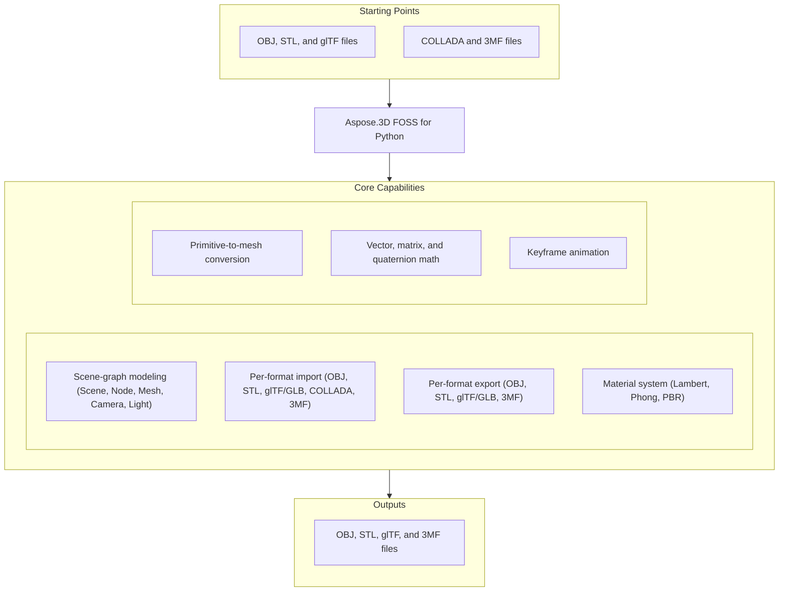

# Aspose.3D FOSS for Python

[](LICENSE) [](setup.py) [](https://github.com/aspose-3d-foss/Aspose.3D-FOSS-for-Python/graphs/contributors)

[](https://products.aspose.org/3d/python/)

Aspose.3D FOSS for Python is a free, open-source, pure-Python library for building, reading, and
writing 3D scenes through an Aspose.3D-compatible API. It models a scene graph of nodes, meshes,
cameras, lights, and materials, and moves that graph in and out of OBJ, STL, glTF, COLLADA, and
3MF files with no native dependencies to compile or install.

## Navigation

- [At a glance](#at-a-glance)
- [Key capabilities](#key-capabilities)
- [Installation](#installation)
- [Quick start](#quick-start)
- [Additional examples](#additional-examples)
- [API reference](#api-reference)
- [Documentation & resources](#documentation--resources)
- [Scope and limitations](#scope-and-limitations)
- [Development and testing](#development-and-testing)
- [License](#license)

## At a Glance



## Key Capabilities

- Build 3D scenes programmatically with `Scene`, `Node`, `Mesh`, `Camera`, and `Light` in a
  hierarchical node graph.
- Import OBJ (with `.mtl` materials), STL (binary and ASCII), glTF 2.0 / GLB, COLLADA (`.dae`),
  and 3MF files into a common `Scene` model with `Scene.open(...)`.
- Export the same `Scene` model back out to OBJ, STL, glTF/GLB, or 3MF with `Scene.save(...)`
  (COLLADA import is supported; COLLADA export is not currently reachable through the public
  API — see [Scope and limitations](#scope-and-limitations)).
- Assign Lambert, Phong, or PBR (metallic-roughness) materials to nodes, including glTF material
  properties such as `albedo`, `metallic_factor`, and `roughness_factor`, plus PBR texture slots
  (`albedo_texture`, `normal_texture`, `occlusion_texture`, `emissive_texture`) for texturing
  meshes.
- Convert built-in parametric primitives (`Box`, `Cylinder`, `Sphere`, `Torus`, `Pyramid`,
  `Dish`, ...) into triangulated `Mesh` objects with `to_mesh()`.
- Work with `Vector2`/`Vector3`/`Vector4`, `Matrix4`, `Quaternion`, and `BoundingBox` utilities
  for transforms and spatial queries.
- Animate scene properties with keyframe sequences (`AnimationClip`, `KeyframeSequence.add(time,
  value, interpolation)`, `KeyFrame`) bound to node/material properties via
  `AnimationNode`/`BindPoint`.

## Installation

A PyPI package has not been published yet. Install directly from a local clone:

```bash
git clone https://github.com/aspose-3d-foss/Aspose.3D-FOSS-for-Python.git
cd Aspose.3D-FOSS-for-Python
pip install -e .
```

The package declares support for Python 3.7 through 3.12 and has no required third-party
dependencies.

## Quick Start

Load an OBJ scene and inspect its meshes:

```python
from aspose.threed import Scene
from aspose.threed.formats.obj import ObjLoadOptions

scene = Scene()
options = ObjLoadOptions()
options.enable_materials = True
scene.open("model.obj", options)

for node in scene.root_node.child_nodes:
    if node.entity:
        mesh = node.entity
        print(f"Mesh: {node.name}")
        print(f"  Vertices: {len(mesh.control_points)}")
        print(f"  Polygons: {mesh.polygon_count}")
```

Convert the same kind of scene to a binary glTF (GLB):

```python
from aspose.threed import Scene
from aspose.threed.formats.gltf import GltfSaveOptions

scene = Scene()
scene.open("mesh.stl")

options = GltfSaveOptions()
options.binary_mode = True
scene.save("mesh.glb", options)
```

## Additional Examples

The snippets below cover building meshes from scratch, applying materials, and working with
additional formats, without cluttering the primary quick-start path above.

### Build a Mesh and Export It to STL

```python
import io
from aspose.threed import Scene, FileFormat
from aspose.threed.entities import Mesh
from aspose.threed.utilities import Vector4

scene = Scene()
mesh = Mesh("triangle")
mesh.control_points.add(Vector4(0.0, 0.0, 0.0, 1.0))
mesh.control_points.add(Vector4(1.0, 0.0, 0.0, 1.0))
mesh.control_points.add(Vector4(1.0, 1.0, 0.0, 1.0))
mesh.create_polygon(0, 1, 2)

node = scene.root_node.create_child_node("triangle_node")
node.entity = mesh

stream = io.StringIO()
# Use FileFormat.get_format_by_extension(...).create_save_options() rather than
# StlSaveOptions() directly: a default-constructed options object has no
# file_format set, and scene.save() cannot infer the format from a bare stream
# (only filename-based saves fall back to extension detection).
options = FileFormat.get_format_by_extension(".stl").create_save_options()
options.binary_mode = False
scene.save(stream, options)
print(stream.getvalue())
```

<details>
<summary>View Additional Examples</summary>

### Assign a PBR Material and Export to GLTF

```python
import io
import json
from aspose.threed import Scene, FileFormat
from aspose.threed.entities import Mesh
from aspose.threed.utilities import Vector3, Vector4
from aspose.threed.formats.gltf import GltfSaveOptions
from aspose.threed.shading import PbrMaterial

scene = Scene()
mesh = Mesh("TestMesh")
mesh.control_points.add(Vector4(0.0, 0.0, 0.0, 1.0))
mesh.control_points.add(Vector4(1.0, 0.0, 0.0, 1.0))
mesh.control_points.add(Vector4(0.0, 1.0, 0.0, 1.0))
mesh.create_polygon(0, 1, 2)

albedo = Vector3(0.8, 0.2, 0.3)
material = PbrMaterial("RedMaterial", albedo)
material.metallic_factor = 0.5
material.roughness_factor = 0.7

node = scene.root_node.create_child_node("TestNode")
node.entity = mesh
node.material = material

stream = io.BytesIO()
# Pass the detected FileFormat into the constructor explicitly: unlike
# StlFormat, GltfFormat.create_save_options() does not set file_format on the
# options it returns, and a bare stream (no filename) gives scene.save()
# nothing else to detect the format from.
options = GltfSaveOptions(FileFormat.get_format_by_extension(".gltf"))
options.binary_mode = False
scene.save(stream, options)

stream.seek(0)
gltf_data = json.loads(stream.read().decode("utf-8"))
print(gltf_data["materials"][0]["pbrMetallicRoughness"])
```

### Import a COLLADA File

```python
from aspose.threed import Scene
from aspose.threed.formats.collada.ColladaLoadOptions import ColladaLoadOptions

scene = Scene()
options = ColladaLoadOptions()
scene.open("model.dae", options)

print(f"Child nodes: {len(scene.root_node.child_nodes)}")
```

### Convert a Parametric Primitive to a Mesh

```python
from aspose.threed.entities import Box

box = Box(10, 20, 30)
mesh = box.to_mesh()
print(f"Control points: {len(mesh.control_points)}")
```

### Build a Cube and Export It to 3MF

```python
import io
from aspose.threed import Scene
from aspose.threed.entities import Mesh
from aspose.threed.utilities import Vector4
from aspose.threed.formats import ThreeMfSaveOptions

scene = Scene()
mesh = Mesh("cube")
for point in [
    Vector4(0, 0, 0, 1), Vector4(1, 0, 0, 1), Vector4(1, 1, 0, 1), Vector4(0, 1, 0, 1),
    Vector4(0, 0, 1, 1), Vector4(1, 0, 1, 1), Vector4(1, 1, 1, 1), Vector4(0, 1, 1, 1),
]:
    mesh.control_points.add(point)

mesh.create_polygon(0, 1, 2)
mesh.create_polygon(0, 2, 3)
mesh.create_polygon(4, 7, 6)
mesh.create_polygon(4, 6, 5)
mesh.create_polygon(0, 4, 5)
mesh.create_polygon(0, 5, 1)
mesh.create_polygon(2, 6, 7)
mesh.create_polygon(2, 7, 3)
mesh.create_polygon(0, 3, 7)
mesh.create_polygon(0, 7, 4)
mesh.create_polygon(1, 5, 6)
mesh.create_polygon(1, 6, 2)

node = scene.root_node.create_child_node("cube")
node.entity = mesh

stream = io.BytesIO()
options = ThreeMfSaveOptions()
options.enable_compression = False
scene.save(stream, options)
```

</details>

## API Reference

The public entry points are the scene graph (`Scene`, `Node`, `Entity`, `A3DObject`), the mesh
and primitive types (`Mesh`, `Box`, `Cylinder`, `Curve`, ...), and the material system
(`LambertMaterial`, `PhongMaterial`, `PbrMaterial`) — organized under `aspose.threed`,
`aspose.threed.entities`, and `aspose.threed.shading` respectively, with math utilities under
`aspose.threed.utilities`. Format-specific importer and exporter classes (`ObjImporter`,
`ColladaExporter`, `GltfExporter`, ...) live in internal per-format submodules such as
`aspose.threed.formats.gltf`; the documented way to move data in and out of a scene is
`Scene.open()` / `Scene.save()` with the matching `*LoadOptions` / `*SaveOptions` class, resolved
through `FileFormat`. The library ships 303 public types in total; the sections below cover the
ones used most often.

Import format options from their real submodules (`aspose.threed.formats.obj`, `.stl`, `.gltf`,
`.collada`), not the top-level `aspose.threed.formats` package — the pattern this README's own
Quick Start already follows. `ThreeMfLoadOptions`/`ThreeMfSaveOptions` and `FbxLoadOptions`/
`FbxSaveOptions` are unaffected and work fine imported from the top-level package. See
[upstream-issues.md](upstream-issues.md) for why the submodule import is required.

This library's public interface is engineered to the same API design as the commercial Aspose.3D
product line. Because the API design is shared, the commercial edition's
[developer documentation](https://docs.aspose.com/3d/python-net/) and
[API reference](https://reference.aspose.com/3d/python-net/) are useful supplementary resources
within the supported feature set.

<details>
<summary>View the Supported Public API Surface</summary>

### Core API

| Class | Description |
|---|---|
| `A3DObject` | A3DObject.find_property returns the property object matching the given name if it exists. |
| `A3dwSaveOptions` | Save options for A3DW. |
| `AlphaSource` | Source of alpha channel for textures. |
| `AmfSaveOptions` | Save options for AMF. |
| `AnimationChannel` | AnimationChannel.component_type specifies the data type of the animated component. |
| `AnimationClip` | AnimationClip.create_animation_node creates a new AnimationNode for the given node name. |
| `AnimationNode` | AnimationNode.find_bind_point returns the BindPoint matching the given target object and name. |
| `ApertureMode` | Camera aperture modes. |
| `ArbitraryProfile` | This class allows you to construct a 2D profile directly from arbitrary curve. |
| `ArrayListAdapter` | Adapter class that wraps List[T] and implements IArrayList[T]. |
| `AssetInfo` | AssetInfo.title stores the title of the 3D asset. |
| `Axis` | The coordinate axis. |
| `AxisSystem` | Axis system is an combination of coordinate system, up vector and front vector. |
| `BasicLoadOptions` | Simple LoadOptions subclass for basic loading options. |
| `BinaryTokenizer` | BinaryTokenizer.tokenize() parses the binary data stream and advances the cursor accordingly. |
| `BindPoint` | BindPoint.add_channel adds a new animation channel with the specified name, value and type, returning True on success. |
| `BlendFactor` | Blend factor specify pixel arithmetic. |
| `Bone` | Bone objects expose weight management via get_weight and set_weight methods, enabling skinning calculations. |
| `BoneLinkMode` | Class with 3 members. |
| `BonePose` | Stores a single bone's transform (`node`, `matrix`, `is_local`) for use in a skeletal animation `Pose`. |
| `BooleanOperand` | This class encapsulates the transformed mesh as Boolean operation's operand. |
| `BooleanOperation` | BooleanOperation.ADD represents a union boolean operation that adds geometry. |
| `BooleanOperator` | Boolean operator allows you to apply Boolean operation on two IMeshConvertible instances. |
| `BoundingBox` | BoundingBox.merge() can combine multiple bounding boxes or geometry to expand the box to include all elements. |
| `BoundingBox2D` | The axis-aligned bounding box for Vector2. |
| `BoundingBoxExtent` | The extent of the bounding box. |
| `Box` | Parameterized box primitive with configurable `length`, `width`, `height`, and per-axis segment counts. |
| `CShape` | IFC compatible C-shape profile that defined by parameters. |
| `Camera` | Camera properties near_plane and far_plane define the depth range for the view frustum calculations. |
| `CenterLineProfile` | IFC compatible center line profile. |
| `Circle` | Parameterized circle primitive with configurable `radius`, `segments`, and start/sweep angles (`theta_start`, `theta_length`). |
| `CircleShape` | IFC compatible circle profile. |
| `ColladaExporter` | ColladaExporter.supports_format returns true if the exporter can handle the given file format. |
| `ColladaFormat` | ColladaFormat.create_load_options creates and returns a Collada load options object for importing. |
| `ColladaFormatDetector` | ColladaFormatDetector.detect determines the 3D file format of a stream, optionally using the file name. |
| `ColladaImporter` | ColladaImporter.supports_format returns True if the specified file format is supported by this importer. |
| `ColladaLoadOptions` | ColladaLoadOptions.flip_coordinate_system determines whether the Y and Z axes are swapped during import. |
| `ColladaPlugin` | ColladaPlugin supplies factory methods to obtain the ColladaFormat, its importer, exporter, and format detector for seamless integration. |
| `ColladaSaveOptions` | ColladaSaveOptions.flip_coordinate_system determines whether the Y and Z axes are swapped when saving. |
| `ColladaTransformStyle` | The node's transformation style of node. |
| `CompareFunction` | Compare function for depth/stencil testing. |
| `ComposeOrder` | The order to compose transform matrix. |
| `CompositeCurve` | A CompositeCurve is consisting of several curve segments. |
| `CoordinateSystem` | The left handed or right handed coordinate system. |
| `CubeFace` | Cube face enumeration. |
| `CullFaceMode` | Cull face mode for face culling. |
| `Curve` | Base class for curve entities, exposing a `color` property used when rendering the curve. |
| `CurveDimension` | Class with 2 members. |
| `CustomObject` | A minimal, empty `A3DObject` subclass usable as a generic named custom data container. |
| `Cylinder` | Cylinder.to_mesh() converts the cylinder primitive into a Mesh object for further processing. |
| `Deformer` | Base class for mesh deformers, exposing the owning `Geometry` via the `owner` property. |
| `DescriptorSetUpdater` | Descriptor set updater for shader resources. |
| `Discreet3dsLoadOptions` | Load options for Discreet 3DS. |
| `Discreet3dsSaveOptions` | Save options for Discreet 3DS. |
| `Dish` | Dish.to_mesh() creates a Mesh from a dish primitive, and its radius and height properties control its size. |
| `DracoCompressionLevel` | Compression level for draco file. |
| `DracoFormat` | Google Draco format. |
| `DracoSaveOptions` | Save options for Draco. |
| `DrawOperation` | Draw operation type. |
| `DriverException` | Exception thrown when rendering driver fails. |
| `Ellipse` | Ellipse.to_mesh() converts an ellipse primitive into a Mesh object that can be added to a scene. |
| `EllipseShape` | IFC compatible ellipse profile. |
| `EndPoint` | The end point to trim the curve, can be a parameter value or a Cartesian point. |
| `Entity` | Entity objects expose get_bounding_box() for spatial queries and a full set of property‑management methods (find_property, get_property, set_property, remove_property). |
| `EntityRenderer` | Base class for rendering entities. |
| `EntityRendererFeatures` | Features supported by an entity renderer. |
| `EntityRendererKey` | The key of registered entity renderer. |
| `ExportException` | Exceptions when Aspose.3D failed to export the scene to file. |
| `Exporter` | Exporter objects let you verify format support with supports_format() before calling export() to write a scene to a stream. |
| `Extrapolation` | Extrapolation.type represents the extrapolation mode applied to animation curves. |
| `FMatrix4` | Matrix 4x4 with all component in float type. |
| `FVector2` | FVector2.normalize returns a new FVector2 with the same direction and unit length. |
| `FVector3` | FVector3.zero returns a vector with all components set to 0. |
| `FVector4` | FVector4.x represents the X component of the 4‑dimensional vector. |
| `FbxElement` | FbxElement.add_token adds the given token to the element's token collection. |
| `FbxExporter` | FbxExporter.save saves the given Scene to a file path using specified FbxSaveOptions. |
| `FbxFormat` | FbxFormat.detect(stream, file_name) returns the detected file format, enabling dynamic handling of unknown input files. |
| `FbxFormatDetector` | FbxFormatDetector.detect determines the FBX format of the provided stream, optionally using the file name. |
| `FbxImporter` | FbxImporter.supports_format returns True if the given file format is supported for import. |
| `FbxLoadOptions` | FbxLoadOptions exposes properties such as keep_builtin_global_settings, compatible_mode, file_format, encoding, file_system, lookup_paths, and file_name to customize FBX import behavior. |
| `FbxParser` | FbxParser.parse_value parses the provided token and returns its evaluated value. |
| `FbxPlugin` | FbxPlugin.get_file_format returns the identifier or name of the FBX file format handled by the plugin. |
| `FbxSaveOptions` | FbxSaveOptions provides export_textures, embed_textures, export_legacy_material_properties, and other flags to control how FBX files are written. |
| `FbxScope` | FbxScope.add_element(element) adds a new element to the scope, and get_elements(key) retrieves all elements of the specified type. |
| `FbxTokenizer` | FbxTokenizer.tokenize() returns a list of internal lexical-token objects representing the elements of an FBX file. |
| `FileContentType` | File content type. |
| `FileFormat` | Class with 9 methods and 8 properties and 49 members. |
| `FileFormatType` | File format type. |
| `FileSystem` | File system encapsulation. |
| `FontFile` | Font file contains definitions for glyphs, this is used to create text profile. |
| `FormatDetector` | FormatDetector.detect detects the file format of the provided stream, using the optional file name, and returns a FileFormat. |
| `FrontFace` | Front face winding order. |
| `Frustum` | Frustum.to_mesh() generates a Mesh representation of a viewing frustum, useful for visual debugging of camera volumes. |
| `GLSLSource` | GLSL shader source. |
| `Geometry` | Geometry.create_element creates a VertexElement of the given type, mapping and reference modes. |
| `GlobalTransform` | The GlobalTransform class exposes translation, scale, euler_angles, rotation, and transform_matrix properties for direct manipulation of an entity’s world transform. |
| `GltfEmbeddedImageFormat` | Embedded image format for GLTF. |
| `GltfExporter` | GltfExporter can export a scene to the glTF format and first checks support with supports_format(file_format). |
| `GltfFormat` | GltfFormat.create_load_options creates a GLTF-specific load options object for importing scenes. |
| `GltfFormatDetector` | GltfFormatDetector.detect determines the FileFormat of the provided stream, optionally using the file name. |
| `GltfImporter` | GltfImporter.supports_format returns true when the specified file format can be imported. |
| `GltfLoadOptions` | GltfLoadOptions.flip_tex_coord_v indicates whether to invert the V component of texture coordinates during GLTF import. |
| `GltfPlugin` | GltfPlugin.get_file_format returns the GltfFormat object representing the GLTF file format. |
| `GltfSaveOptions` | GltfSaveOptions.file_format specifies the output file format for saving, using the FileFormat enum. |
| `Group` | A Group represents the logical relationships of Node. |
| `HShape` | IFC compatible H-shape profile. |
| `HalfSpace` | HalfSpace represents a infinity space which is split by a plane, this can be used with BooleanOperator. |
| `HollowCircleShape` | IFC compatible hollow circle profile. |
| `HollowRectangleShape` | IFC compatible hollow rectangular shape with both inner/outer rounding corners. |
| `Html5SaveOptions` | Save options for HTML5. |
| `ImageRenderOptions` | ImageRenderOptions lets you configure rendering parameters such as background_color, enable_shadows, and asset_directories before passing the options to a renderer. |
| `ImportException` | Exception when Aspose.3D failed to open the specified source. |
| `Importer` | Importer.supports_format(file_format) returns true when the specified FileFormat is supported for import. |
| `IndexDataType` | Data type for indices. |
| `InitializationException` | Exception thrown when rendering initialization fails. |
| `InvalidOperationException` | Class extending Exception. |
| `JtLoadOptions` | Load options for JT. |
| `KeyFrame` | KeyFrame.time represents the timestamp of the keyframe in seconds. |
| `KeyframeSequence` | KeyframeSequence lets developers create animation curves with per‑keyframe interpolation and tangent control. |
| `LShape` | IFC compatible L-shape profile that defined by parameters. |
| `LambertMaterial` | The LambertMaterial class provides a full material system, allowing you to set emissive, ambient, diffuse, and transparent colors, as well as assign textures to predefined slots such as MAP_DIFFUSE and MAP_NORMAL. |
| `Light` | The Light class lets you configure lighting parameters such as near_plane, far_plane, aspect, ortho_height, and up direction for scene illumination. |
| `LightType` | Light types. |
| `Line` | A polyline is a path defined by a set of points with control_points, and connected by segments. |
| `LinearExtrusion` | Extrudes a 2D `Profile` along a `direction` vector, with `height`, `slices`, `twist`, and `center` shape parameters. |
| `LoadOptions` | Base class for format-specific load options, adding an `encoding` setting on top of `IOConfig`. |
| `MappingMode` | MappingMode.CONTROL_POINT represents mapping based on each mesh control point individually. |
| `Material` | Material class lets you manage texture maps and custom properties, supporting specular, diffuse, emissive, ambient, and normal maps. |
| `MathUtils` | A set of useful mathematical utilities. |
| `Matrix4` | Matrix4.get_identity() returns a new identity Matrix4 instance that can be used as a starting point for building transformation chains. |
| `Mesh` | Mesh.create_polygon creates a new polygon and returns its index. |
| `Microsoft3MFFormat` | Microsoft 3MF format. |
| `Microsoft3MFSaveOptions` | Save options for Microsoft 3MF. |
| `MirroredProfile` | IFC compatible mirror profile. |
| `MorphTargetChannel` | MorphTargetChannel.get_weight(target) returns the current weight for the specified morph target, and set_weight(target, weight) updates it. |
| `MorphTargetDeformer` | Deformer subclass managing a list of `MorphTargetChannel` blend shapes, with indexed access to each channel's weight. |
| `Node` | Node.add_entity adds the given Entity to this node's entity collection. |
| `NurbsCurve` | Curve subclass describing a NURBS curve via control points, knot vectors, multiplicity, and order/degree/rational settings. |
| `NurbsDirection` | Holds one direction's NURBS surface parameters: knot vectors, multiplicity, `order`, `degree`, `divisions`, and `type`. |
| `NurbsSurface` | Geometry subclass representing a NURBS surface as a pair of `NurbsDirection` objects (`u` and `v`). |
| `NurbsType` | Class with 3 members. |
| `ObjExporter` | Exporter that serializes a Scene's nodes, materials, and mesh geometry to Wavefront OBJ/MTL text output. |
| `ObjFormat` | ObjFormat.create_load_options creates and returns an ObjLoadOptions instance for importing OBJ files. |
| `ObjFormatDetector` | Detects the OBJ format from a `.obj` file name extension, or by sniffing the stream's leading bytes for OBJ markers. |
| `ObjImporter` | ObjImporter.import_scene loads OBJ data from a stream into a Scene using ObjLoadOptions. |
| `ObjLoadOptions` | ObjLoadOptions.flip_coordinate_system swaps the Y and Z axes when loading an OBJ file. |
| `ObjPlugin` | ObjPlugin.get_file_format returns the ObjFormat object representing the OBJ file format. |
| `ObjSaveOptions` | ObjSaveOptions.apply_unit_scale applies the scene's unit scaling when saving to OBJ. |
| `ParameterizedProfile` | The base class of all parameterized profiles. |
| `ParseException` | Exception when Aspose.3D failed to parse the input. |
| `Patch` | Patch objects allow creation of custom vertex elements via create_element and create_element_uv methods. |
| `PatchDirection` | Holds one direction's patch-surface parameters: `type`, `divisions`, `control_points` count, and `closed` flag. |
| `PatchDirectionType` | Class with 5 members. |
| `PbrMaterial` | PbrMaterial supplies a full physically based rendering workflow with albedo, metallic, roughness, occlusion, and emissive textures. |
| `PbrSpecularMaterial` | Material for physically based rendering based on diffuse color/specular/glossiness. |
| `PdfFormat` | Adobe's Portable Document Format. |
| `PdfLightingScheme` | Lighting scheme for PDF export. |
| `PdfLoadOptions` | Load options for PDF. |
| `PdfRenderMode` | Render mode for PDF export. |
| `PdfSaveOptions` | Save options for PDF. |
| `PhongMaterial` | PhongMaterial.specular_color defines the RGB color of the specular highlight. |
| `PixelFormat` | Pixel format for render targets. |
| `PixelMapMode` | Pixel mapping mode. |
| `PixelMapping` | Pixel mapping configuration. |
| `Plane` | The Plane class can be converted to a Mesh by calling its to_mesh() method, enabling further mesh processing. |
| `Plugin` | Plugin.get_exporter() returns an Exporter object that can be used to write supported 3D formats. |
| `PlyFormat` | PLY format. |
| `PlyLoadOptions` | Load options for PLY. |
| `PlySaveOptions` | Save options for PLY. |
| `PointCloud` | Geometry subclass representing a point cloud, exposing a `dimension` property describing its point layout. |
| `PolygonBuilder` | The PolygonBuilder class lets you construct polygon vertex indices by calling begin(), add_vertex(index) for each vertex, and end() to finalize the polygon. |
| `PolygonMode` | Polygon rendering mode. |
| `PolygonModifier` | PolygonModifier.triangulate can return None, a Mesh object, or a list of triangle index arrays, giving developers flexibility in handling polygon data. |
| `Pose` | Pose.add_bone_pose(node, matrix, local_matrix) records a bone transformation for skeletal animation within a Pose object. |
| `PostProcessing` | Post-processing effect. |
| `PresetShaders` | Predefined shaders. |
| `Primitive` | Base class for parametric mesh primitives (`Box`, `Sphere`, `Circle`, etc.), exposing `cast_shadows`/`receive_shadows` flags. |
| `Profile` | 2D Profile in xy plane. |
| `ProjectionType` | Camera's projection types. |
| `Property` | Property.get_extra returns the extra attribute identified by the given name. |
| `PropertyCollection` | PropertyCollection.find_property returns the property object matching the given name or None. |
| `PropertyFlags` | Property's flags. |
| `PushConstant` | Push constant for shaders. |
| `Pyramid` | Parameterized pyramid. |
| `Quaternion` | Quaternion.slerp(t, v1, v2) returns an interpolated quaternion for smooth rotation animations. |
| `Rect` | A class to represent the rectangle. |
| `RectangleShape` | IFC compatible rectangle profile. |
| `RectangularTorus` | Parameterized rectangular torus entity. |
| `ReferenceMode` | ReferenceMode.DIRECT represents a reference mode where vertex data is stored directly without indexing. |
| `RelativeRectangle` | Relative rectangle The formula between relative component to absolute value is: Scale * (Reference Width) + offset So if we want it to represent an absolute value, leave all scale fields zero, and use offset fields instead. |
| `RenderFactory` | RenderFactory creates all resources that represented in rendering pipeline. |
| `RenderParameters` | Parameters for rendering. |
| `RenderQueueGroupId` | Render queue group ID. |
| `RenderResource` | Base class for render resources. |
| `RenderStage` | Render stage in the pipeline. |
| `RenderState` | Render state configuration. |
| `Renderer` | The context about renderer. |
| `RendererVariableManager` | Manages renderer variables. |
| `RevolvedAreaSolid` | RevolvedAreaSolid entity. |
| `RotationMode` | The frustum's rotation mode. |
| `RotationOrder` | The order controls which rx ry rz are applied in the transformation matrix. |
| `RvmFormat` | RVM format. |
| `RvmLoadOptions` | Load options for RVM. |
| `RvmSaveOptions` | Save options for RVM. |
| `SPIRVSource` | SPIRV shader source. |
| `SaveOptions` | SaveOptions.export_textures determines if textures are included in the exported file. |
| `Scene` | The Scene class provides a high‑level API for loading, saving, rendering, and animating 3D content. |
| `SceneObject` | SceneObject provides find_property, get_property, and set_property methods to manage custom metadata attached to any scene object. |
| `SemanticAttribute` | Allow user to use their own structure for static declaration of VertexDeclaration. |
| `ShaderException` | Exception thrown when shader compilation/linking fails. |
| `ShaderMaterial` | A shader material allows to describe the material by external rendering engine or shader language. |
| `ShaderProgram` | Shader program. |
| `ShaderSet` | Set of shaders for rendering. |
| `ShaderSource` | Shader source code. |
| `ShaderStage` | Shader stage. |
| `ShaderTechnique` | A technique in shader material describes the concrete rendering details. |
| `ShaderVariable` | Shader variable. |
| `Shape` | Base class for all shape entities. |
| `Skeleton` | The Skeleton is mainly used by CAD software to help designer to manipulate the transformation of skeletal structure, it's usually useless outside the CAD softwares. |
| `SkeletonType` | Skeleton type enum. |
| `SkinDeformer` | Deformer subclass managing the list of `Bone` objects used for skeletal (skinning) deformation. |
| `Sphere` | Parameterized sphere primitive with configurable `radius`, segment counts, and phi/theta angles; `to_mesh()` triangulates it into a UV sphere `Mesh`. |
| `SplitMeshPolicy` | Share vertex/control point data between sub-meshes or each sub-mesh has its own compacted data. |
| `StencilAction` | Stencil action. |
| `StencilState` | Stencil state configuration. |
| `StlExporter` | StlExporter.supports_format returns True if the given file format is supported for STL export. |
| `StlFormat` | StlFormat.create_load_options creates an STL-specific load options object. |
| `StlFormatDetector` | StlFormatDetector.detect returns the detected FileFormat for a stream (optional file name) or None. |
| `StlImporter` | StlImporter.supports_format returns true when the specified file format can be handled by this importer. |
| `StlLoadOptions` | LoadOptions subclass for STL import, adding `flip_coordinate_system` and `scale` settings. |
| `StlPlugin` | StlPlugin.get_file_format returns the StlFormat object representing the STL file format. |
| `StlSaveOptions` | StlSaveOptions.scale specifies a uniform scaling factor applied to all coordinates during STL export. |
| `SweptAreaSolid` | SweptAreaSolid entity. |
| `TShape` | IFC compatible T-shape defined by parameters. |
| `Text` | Text profile, this profile describes contours using font and text. |
| `Texture` | This class defines the texture from an external file. |
| `TextureBase` | Base class for all texture types. |
| `TextureCodec` | Texture codec. |
| `TextureData` | Texture data. |
| `TextureFilter` | Texture filter type. |
| `TextureMapping` | TextureMapping.AMBIENT represents the ambient texture mapping channel. |
| `TextureSlot` | Texture slot name. |
| `TextureType` | Texture type. |
| `ThreeMfExporter` | ThreeMfExporter.export writes the provided Scene to the given stream using optional export settings. |
| `ThreeMfFormat` | ThreeMfFormat.is_buildable(node) returns a boolean indicating whether a node can be used as a printable build object. |
| `ThreeMfFormatDetector` | ThreeMfFormatDetector.detect determines the 3MF file format from a stream and optional file name, returning a FileFormat. |
| `ThreeMfImporter` | ThreeMfImporter.import_scene(scene, stream, options) reads a 3MF file from a stream and populates the given Scene instance. |
| `ThreeMfLoadOptions` | ThreeMfLoadOptions.flip_coordinate_system swaps Y and Z coordinates when loading a 3MF file. |
| `ThreeMfPlugin` | ThreeMfPlugin.get_file_format returns the ThreeMfFormat object that identifies the 3MF file format. |
| `ThreeMfSaveOptions` | ThreeMfSaveOptions.enable_compression enables compression of the exported 3MF file. |
| `Torus` | Parameterized torus entity. |
| `Transform` | Transform.set_translation sets the translation components (tx, ty, tz) and returns the Transform. |
| `TransformBuilder` | The TransformBuilder is used to build transform matrix by a chain of transformations. |
| `TransformedCurve` | TransformedCurve entity. |
| `TrapeziumShape` | IFC compatible Trapezium shape defined by parameters. |
| `TriMesh` | TriMesh is a triangle mesh that stores triangles. |
| `TrialException` | This is raised in Scene.Open/Scene.Save when no licenses are applied. |
| `TrimmedCurve` | TrimmedCurve entity. |
| `U3dLoadOptions` | Load options for U3D. |
| `U3dSaveOptions` | Save options for U3D. |
| `UShape` | IFC compatible U-shape defined by parameters. |
| `UsdSaveOptions` | Save options for USD. |
| `Vector2` | Vector2.set sets the vector's x and y components to the provided float values. |
| `Vector3` | Vector3 offers dot product, cross product, normalization, angle calculation, and component‑wise trigonometric functions. |
| `Vector4` | Vector4.set assigns new component values to the vector's x, y, z, and w fields. |
| `Vertex` | Vertex reference, used to access the raw vertex in TriMesh. |
| `VertexDeclaration` | The declaration of a custom defined vertex's structure. |
| `VertexElement` | VertexElement.set_indices sets the element's index list to the provided integer list. |
| `VertexElementBinormal` | Per-vertex binormal-vector element, a `VertexElementFVector` specialization typed `BINORMAL`. |
| `VertexElementDoublesTemplate` | A helper class for defining concrete implementations. |
| `VertexElementEdgeCrease` | Defines the edge crease values for specified components. |
| `VertexElementFVector` | VertexElementFVector.set_data replaces the element's data list with the provided FVector4 collection. |
| `VertexElementHole` | Defines the hole information for specified components. |
| `VertexElementIntsTemplate` | A helper class for defining concrete implementations with int data. |
| `VertexElementMaterial` | Defines the material for specified components. |
| `VertexElementNormal` | Per-vertex normal-vector element, a `VertexElementFVector` specialization typed `NORMAL`. |
| `VertexElementPolygonGroup` | Defines the polygon group for specified components. |
| `VertexElementSmoothingGroup` | Per-vertex smoothing-group element, a `VertexElementIntsTemplate` specialization typed `SMOOTHING_GROUP`. |
| `VertexElementSpecular` | Defines the specular color for specified components. |
| `VertexElementTangent` | VertexElementTangent.set_data(data) assigns tangent vectors to the specified vertices, while set_indices() can map them to polygon vertices when needed. |
| `VertexElementTemplate` | A helper class for defining concrete implementations of vertex elements with typed data. |
| `VertexElementType` | VertexElementType.BINORMAL represents the per-vertex binormal vector used for tangent space calculations. |
| `VertexElementUV` | VertexElementUV.texture_mapping gets or sets the texture mapping mode for the UV element. |
| `VertexElementUserData` | Defines the user data for specified components. |
| `VertexElementVector4` | Defines the vector4 data for specified components. |
| `VertexElementVertexColor` | Per-vertex color element, a `VertexElementFVector` specialization typed `VERTEX_COLOR`. |
| `VertexElementVertexCrease` | Defines the vertex crease values for specified components. |
| `VertexElementVisibility` | Defines the visibility for specified components. |
| `VertexElementWeight` | Defines the weight for specified components. |
| `VertexField` | Vertex's field memory layout description. |
| `VertexFieldDataType` | Vertex field's data type. |
| `VertexFieldSemantic` | The semantic of the vertex field. |
| `Viewport` | Viewport for rendering. |
| `Watermark` | Utility to encode/decode blind watermark to/from a mesh. |
| `WindowHandle` | Window handle for render window. |
| `WrapMode` | Wrap mode for texture coordinates. |
| `XLoadOptions` | Load options for X format. |
| `ZShape` | IFC compatible Z-shape profile that defined by parameters. |

#### Enumerations

| Enumeration | Description |
|---|---|
| `ExtrapolationType` | ExtrapolationType.CONSTANT represents a constant extrapolation that holds the last keyframe value. |
| `Interpolation` | Interpolation.CONSTANT represents a constant interpolation where values do not change over time. |
| `PoseType` | Enum with 2 members. |
| `StepMode` | StepMode.PREVIOUS_VALUE represents a step mode that selects the previous value in a sequence. |
| `WeightedMode` | WeightedMode enum values NONE, OUT_WEIGHT, NEXT_IN_WEIGHT, and BOTH let developers specify how vertex weights are applied during mesh processing. |

---

#### Detailed Member Reference

### Scene Graph

*(`aspose.threed`)*

- `Scene`
  - `open(file_or_stream, options)`, `save(file_or_stream, format_or_options)`, `from_file(file_name)`
  - `root_node`, `sub_scenes`, `asset_info`, `animation_clips`
  - `create_animation_clip(name)`, `clear()`
- `Node`
  - `create_child_node(node_name, entity, material) -> 'Node'`
  - `add_entity(entity)`, `add_child_node(node)`, `merge(node)`
  - `entity`, `entities`, `material`, `materials`, `child_nodes`, `parent_node`
  - `transform`, `global_transform`, `visible`, `excluded`
  - `evaluate_global_transform(with_geometric_transform)`, `get_bounding_box()`
- `Entity` (base of `Mesh` and the primitive shapes)
  - `get_bounding_box()`, `parent_node`, `parent_nodes`, `excluded`, `name`
- `Transform` (mutable; owned by `Node.transform`)
  - `translation`, `scaling`, `rotation`, `euler_angles`, `transform_matrix`
  - `set_translation(tx, ty, tz)`, `set_scale(sx, sy, sz)`, `set_rotation(rw, rx, ry, rz)`
- `GlobalTransform` (read-only; returned by `Node.global_transform`/`evaluate_global_transform()`)
  - `translation`, `scale`, `rotation`, `euler_angles`, `transform_matrix`

### Meshes and Primitives

*(`aspose.threed.entities`)*

- `Mesh(name)`
  - `control_points: ArrayListAdapter[Vector4]`, `polygon_count`, `polygons`
  - `create_polygon(*indices)`, `triangulate()`, `get_bounding_box()`
- `Box`, `Cylinder`, `Sphere`, `Torus`, `Pyramid`, `Dish`, `Circle`, `Ellipse`, `Frustum`
  - each exposes `to_mesh() -> 'Mesh'` to convert the parameterized primitive into a concrete mesh
- `Camera`, `Light`
  - `near_plane`, `far_plane`, `field_of_view`, `direction`, `target`, `up`

### Materials

*(`aspose.threed.shading`)*

- `Material` (base) — `get_texture(slot_name)`, `set_texture(slot_name, texture)`
- `LambertMaterial` — `emissive_color`, `ambient_color`, `diffuse_color`, `transparent_color`, `transparency`
- `PhongMaterial(LambertMaterial)` — adds `specular_color`, `specular_factor`, `shininess`, `reflection_color`
- `PbrMaterial` — `albedo`, `metallic_factor`, `roughness_factor`, `albedo_texture`, `normal_texture`, `occlusion_texture`, `emissive_texture`, `emissive_color`

### Format Load/Save Options

*(`aspose.threed.formats`)*

- `ObjLoadOptions` — `flip_coordinate_system`, `enable_materials`, `scale`, `normalize_normal`.
  The OBJ importer itself parses vertices (`v`), texture coordinates (`vt`), vertex normals
  (`vn`), faces (`f`, including multiple index formats), object/group/smoothing-group markers
  (`o`/`g`/`s`), and `usemtl`/`mtllib` material references.
- `ObjSaveOptions` — `apply_unit_scale`, `point_cloud`, `verbose`, `serialize_w`,
  `enable_materials`, `flip_coordinate_system`, `axis_system`
- `StlLoadOptions` / `StlSaveOptions` — `binary_mode` (save only), `scale`, `flip_coordinate_system`
- `GltfLoadOptions` / `GltfSaveOptions` — `binary_mode` (save only), `flip_tex_coord_v`
- `ColladaLoadOptions` / `ColladaSaveOptions` — `flip_coordinate_system`, `enable_materials`
  (save only), `indented` (save only)
- `ThreeMfLoadOptions` / `ThreeMfSaveOptions` — `flip_coordinate_system`, `enable_compression`
  (save only), `build_all` (save only), `pretty_print` (save only), `unit` (save only)
- `FbxLoadOptions` / `FbxSaveOptions` — `compatible_mode`, `export_textures`, `embed_textures` (see [Scope and limitations](#scope-and-limitations))
- `FileFormat` — `detect(stream, file_name)`, `get_format_by_extension(extension_name)`, `can_import`, `can_export`

### Math Utilities

*(`aspose.threed.utilities`)*

- `Vector2`, `Vector3`, `Vector4` — `x`/`y`/`z`/`w`, `length`, `normalize()`, `dot()`, `cross()`
- `Matrix4` — `translate()`, `scale()`, `rotate()`, `decompose()`, `inverse()`, `get_identity()`
- `Quaternion` — `slerp(t, v1, v2)`, `to_matrix()`, `from_euler_angle()`, `from_angle_axis()`
- `BoundingBox` — `minimum`, `maximum`, `center`, `size`, `merge()`, `contains()`

### Animation

*(`aspose.threed.animation`)*

- `AnimationClip` — `create_animation_node(name) -> AnimationNode`, `animations`, `start`, `stop`
- `AnimationNode` — `create_bind_point(obj, prop_name)`, `get_keyframe_sequence(target, prop_name,
  channel_name, create)`, `bind_points`, `sub_animations`
- `AnimationChannel` (extends `KeyframeSequence`) — `component_type`, `default_value`,
  `keyframe_sequence`
- `KeyframeSequence` — `add(time, value, interpolation)`, `key_frames`, `pre_behavior`/
  `post_behavior` (`Extrapolation`)
- `KeyFrame` — `time`, `value`, `interpolation` (`Interpolation`), tangent/weight fields
  (`tangent_weight_mode`, `step_mode`, `tension`, `continuity`, `bias`)
- `BindPoint`, `Interpolation`, `Extrapolation`/`ExtrapolationType`, `StepMode`, `WeightedMode`

### Exceptions

- `ImportException`, `ExportException`, `ParseException`, `InvalidOperationException`

</details>

## Documentation & Resources

- **[Getting started guide](https://docs.aspose.org/3d/python/)** — installation, key capabilities,
  and links to detailed developer guides for this library.
- **[How-to guides & FAQ](https://kb.aspose.org/3d/python/)** — task-focused how-to guides for
  loading, converting, and manipulating 3D files with the pip-installable library.
- **[Full API reference](https://reference.aspose.org/3d/python/)** — the complete, browsable
  reference for all 303 public types (the [API reference](#api-reference) section above covers
  the essentials).
- **[Contributor guide](AGENTS.md)** — architecture notes and conventions for contributors.
- In-repo implementation notes: [FBX](docs/FBX_IMPLEMENTATION_SUMMARY.md),
  [general](docs/IMPLEMENTATION_SUMMARY.md), [OBJ importer](docs/OBJ_IMPORTER_IMPLEMENTATION.md),
  [STL import](docs/STL_IMPORT_IMPLEMENTATION.md), [PyPI readiness](docs/PYPI_READINESS.md), and
  [project progress](docs/foss-python-progress.md).
- Found a bug or have a feature request? [Open an issue](https://github.com/aspose-3d-foss/Aspose.3D-FOSS-for-Python/issues) on GitHub.

## Scope and Limitations

- This library focuses on scene-graph modeling and the OBJ, STL, glTF, COLLADA, and 3MF format
  pipelines.
- The `aspose.threed.render` module (`Renderer`, `IRenderWindow`, `IBuffer`, `ICommandList`,
  `ITexture2D`, and related classes) is not implemented — this library reads, builds, and writes
  3D scene data; it does not render or rasterize scenes.
- `Mesh` boolean operations (`union`, `difference`, `intersect`, `do_boolean`) and NURBS
  curve/surface evaluation (`NurbsCurve.evaluate`, `NurbsSurface.to_mesh`) raise
  `NotImplementedError`.
- FBX support is experimental: `FbxExporter.save()` and `FbxExporter.save_to_stream()` raise
  `NotImplementedError`, and full round-trip FBX import/export is not covered by the bundled
  tests the way OBJ, STL, glTF, COLLADA, and 3MF are — prefer the other formats when round-trip
  fidelity matters.
- COLLADA import works, but COLLADA export is not currently reachable through the public
  `Scene.save()` API — see [upstream-issues.md](upstream-issues.md) for details.

These limitations don't apply to
[Aspose.3D for Python — Enterprise Edition](https://products.aspose.com/3d/python-net/),
which adds broader format support — scene rendering, complete FBX read/write support, and
additional formats such as PDF, USD, JT, and RVM. This FOSS edition's own API is deliberately
built to match a fixed, versioned interface specification, so code written against it is
designed to remain portable when you upgrade — no API rewrite required.

## Development and Testing

Install the repository in editable mode and run the test suite:

```bash
git clone https://github.com/aspose-3d-foss/Aspose.3D-FOSS-for-Python.git
cd Aspose.3D-FOSS-for-Python
pip install -e .
python -m unittest discover tests/
```

Run a single test file:

```bash
python -m unittest tests.test_obj_importer
```

The optional `dev` extra (`pip install -e ".[dev]"`) installs `pytest`, though the bundled test
suite itself is written against the standard-library `unittest` framework.

## License

This project is licensed under the [MIT License](LICENSE). The MIT License permits use, copying,
modification, distribution, sublicensing, and commercial use, provided its copyright and
permission notice are retained. The software is provided without warranty.
