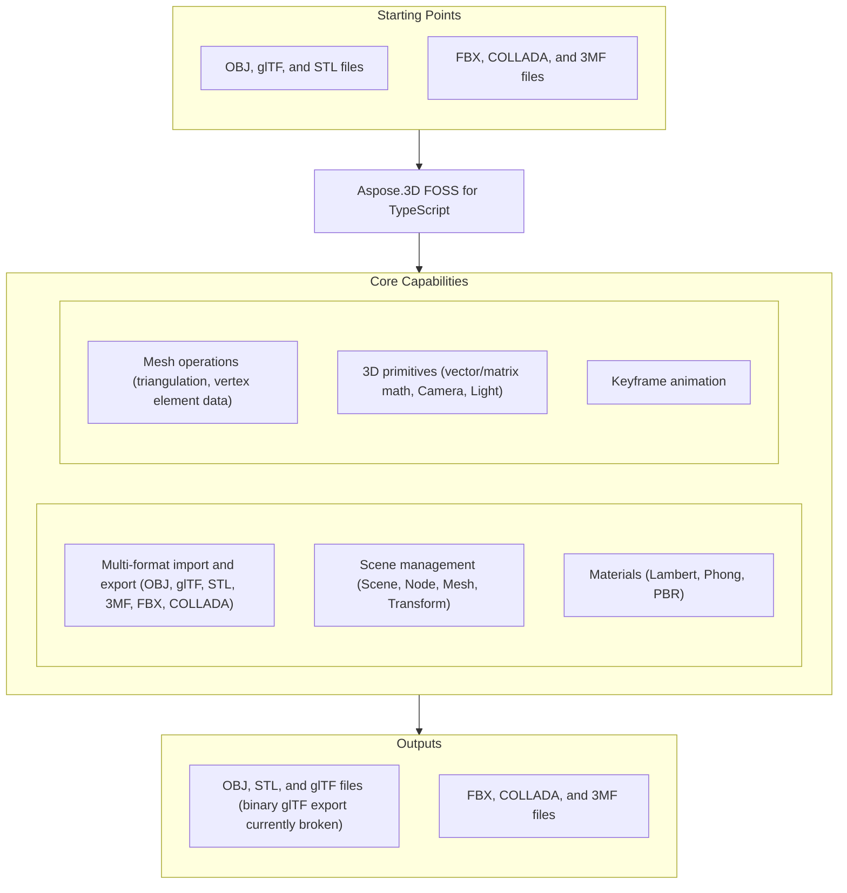

# Aspose.3D FOSS for TypeScript

 [](https://github.com/aspose-3d-foss/Aspose.3D-FOSS-for-TypeScript/graphs/contributors)

[](https://products.aspose.org/3d/typescript/)

Aspose.3D FOSS for TypeScript is a free, open-source, MIT-licensed library for building, loading,
and exporting 3D scenes in Node.js and TypeScript. It exposes a strongly-typed scene-graph API —
`Scene`, `Node`, `Entity`, `Mesh`, `Camera`, `Light`, and `Transform` — together with importers and
exporters for OBJ, glTF 2.0/GLB, STL, 3MF, FBX, and COLLADA.

## Navigation

- [At a glance](#at-a-glance)
- [Key capabilities](#key-capabilities)
- [Installation](#installation)
- [Quick start](#quick-start)
- [Additional examples](#additional-examples)
- [API reference](#api-reference)
- [Documentation & resources](#documentation--resources)
- [Scope and limitations](#scope-and-limitations)
- [Development and testing](#development-and-testing)
- [License](#license)

## At a Glance



## Key Capabilities

**Format support** — `scene.save()`/`scene.open()` pick the format from the target extension or an
explicit format object; every format below supports both directions except where noted:

| Format | Import | Export |
|---|---|---|
| OBJ (with `.mtl` materials) | ✅ | ✅ |
| glTF 2.0 / GLB | ✅ | JSON/ASCII ✅ — binary (`.glb`) currently broken, see [Scope and limitations](#scope-and-limitations) |
| STL (ASCII and binary) | ✅ | ✅ |
| 3MF | ✅ | ✅ |
| FBX | ✅ | ✅ |
| COLLADA (.dae) | ✅ | ✅ |

**Scene management**
- Build 3D scenes from scratch with `Scene`, `Node`, `Mesh`, and `Transform`, or load existing files
  with `Scene.open()` / `Scene.openFromBuffer()`.
- Hierarchical node structure via `Node.childNodes`/`parentNode`, with entity and material
  attachment per node.

**Materials**
- Apply `LambertMaterial`, `PhongMaterial`, and `PbrMaterial` materials, including glTF-style
  metallic/roughness PBR channels.

**Mesh operations**
- Triangulate arbitrary polygons with `Mesh.triangulate()` or the standalone
  `PolygonModifier.triangulate()`.
- Manage per-vertex data through the typed `VertexElement` subclasses (normals, UVs, vertex
  colors, smoothing groups).

**3D primitives**
- Vector/matrix math — `Vector2`, `Vector3`, `Vector4`, `Matrix4`, `Quaternion`, `BoundingBox`,
  `BoundingBox2D`.
- `Camera` and `Light` scene objects.

**Animation**
- Keyframe animation types — `AnimationClip`, `KeyframeSequence`, `Interpolation`.

Fully typed API compiled under strict TypeScript settings (`noImplicitAny`, `strictNullChecks`).

## Installation

An npm package has not been published yet. Install from source:

```bash
git clone https://github.com/aspose-3d-foss/Aspose.3D-FOSS-for-TypeScript.git
cd Aspose.3D-FOSS-for-TypeScript
npm install
npm run build
```

`npm run build` compiles `src/` to `dist/` with `tsc`, mirroring the source layout — the scene-graph
API ends up at `dist/aspose/threed`, and each format module at `dist/aspose/threed/formats/<format>`
(for example `dist/aspose/threed/formats/obj`).

Built and tested against TypeScript `^5.8.3` (`tsconfig.json` targets `ES2020`, output `commonjs`).
`package.json` declares no minimum Node.js version; development uses `@types/node` `^22.15.17`.
This is a Node.js library — it reads files via the `fs` module directly, so consuming it in a
browser would need a bundler and has not been verified there.

## Quick Start

Load an OBJ file and inspect the imported scene:

```typescript
import { Scene } from './dist/aspose/threed';
import { ObjLoadOptions } from './dist/aspose/threed/formats/obj';

const scene = new Scene();
const options = new ObjLoadOptions();
options.enableMaterials = true;
scene.open('model.obj', options);

for (const node of scene.rootNode.childNodes) {
  if (node.entity) {
    console.log(`Node: ${node.name}`);
  }
}
```

Save the same scene as binary STL:

```typescript
scene.save('model.stl', 'stl');
```

## Additional Examples

Every example below is exercised by the project's own test suite. See the [`tests`](tests/)
directory for the full set (there is no separate `examples/` directory). The most common
operations are collected below.

### Build a Mesh From Scratch and Export to STL

```typescript
import { Scene, Node } from './dist/aspose/threed';
import { Mesh } from './dist/aspose/threed/entities';
import { Vector4 } from './dist/aspose/threed/utilities';

const scene = new Scene();
const mesh = new Mesh('triangle');
mesh.controlPoints = [
  new Vector4(0.0, 0.0, 0.0, 1.0),
  new Vector4(1.0, 0.0, 0.0, 1.0),
  new Vector4(1.0, 1.0, 0.0, 1.0),
];
mesh.createPolygon(0, 1, 2);

const node = new Node('triangle_node');
node.entity = mesh;
node.parentNode = scene.rootNode;

scene.save('triangle.stl');
```

<details>
<summary>View Additional Examples</summary>

### Apply a PBR Material

```typescript
import { Scene } from './dist/aspose/threed';
import { Mesh } from './dist/aspose/threed/entities';
import { PbrMaterial } from './dist/aspose/threed/shading';
import { Vector3, Vector4 } from './dist/aspose/threed/utilities';

const scene = new Scene();
const material = new PbrMaterial('red_metal');
material.albedo = new Vector3(1.0, 0.0, 0.0);
material.metallicFactor = 0.8;
material.roughnessFactor = 0.3;

const mesh = new Mesh('cube');
mesh.controlPoints = [
  new Vector4(0, 0, 0, 1), new Vector4(1, 0, 0, 1),
  new Vector4(1, 1, 0, 1), new Vector4(0, 1, 0, 1),
];
mesh.createPolygon(0, 1, 2, 3);

const node = scene.rootNode.createChildNode('cube');
node.entity = mesh;
node.material = material;
```

### Triangulate Polygons Directly With PolygonModifier

```typescript
import { PolygonModifier } from './dist/aspose/threed/entities';
import { Vector4 } from './dist/aspose/threed/utilities';

const controlPoints = [
  new Vector4(0, 0, 0, 1),
  new Vector4(1, 0, 0, 1),
  new Vector4(0, 1, 0, 1),
  new Vector4(1, 1, 0, 1),
];
const quad = [0, 1, 3, 2];

const triangles = PolygonModifier.triangulate(controlPoints, [quad]);
console.log(triangles.length); // 2
```

### Export to COLLADA With a Phong Material

```typescript
import { Scene } from './dist/aspose/threed';
import { Mesh } from './dist/aspose/threed/entities';
import { Vector3, Vector4 } from './dist/aspose/threed/utilities';
import { PhongMaterial } from './dist/aspose/threed/shading';

const scene = new Scene();
const mesh = new Mesh('TestMesh');
mesh.controlPoints.push(new Vector4(0.0, 0.0, 0.0, 1.0));
mesh.controlPoints.push(new Vector4(1.0, 0.0, 0.0, 1.0));
mesh.controlPoints.push(new Vector4(0.0, 1.0, 0.0, 1.0));
mesh.createPolygon(0, 1, 2);

const material = new PhongMaterial('RedMaterial');
material.diffuseColor = new Vector3(1.0, 0.0, 0.0);
material.specularColor = new Vector3(1.0, 1.0, 1.0);
material.shininess = 32.0;

const node = scene.rootNode.createChildNode('TestNode');
node.entity = mesh;
node.material = material;

scene.save('scene.dae');
```

### Convert STL to GLTF

```typescript
import { Scene } from './dist/aspose/threed';
import { GltfSaveOptions } from './dist/aspose/threed/formats/gltf';

const scene = new Scene();
scene.open('mesh.stl');

const opts = new GltfSaveOptions();
opts.binaryMode = false;
scene.save('mesh.gltf', opts);
```

Binary glTF (`.glb`, `binaryMode = true`) currently throws a `RangeError` for any
non-empty mesh — see [Scope and limitations](#scope-and-limitations). Use the
JSON/ASCII form (`binaryMode = false`, the default) shown above until that is
fixed upstream.

### Inspect a PBR Material Imported From GLTF

```typescript
import { Scene } from './dist/aspose/threed';
import { GltfLoadOptions } from './dist/aspose/threed/formats/gltf';
import { PbrMaterial } from './dist/aspose/threed/shading';
import * as fs from 'fs';

const scene = new Scene();
const options = new GltfLoadOptions();
const buffer = fs.readFileSync('model.gltf');
scene.openFromBuffer(buffer, options);

const node = scene.rootNode.childNodes[0];
if (node.material instanceof PbrMaterial) {
  console.log(node.material.name, node.material.metallicFactor, node.material.roughnessFactor);
}
```

### Vector and Quaternion Math

```typescript
import { Vector3, Quaternion, Matrix4 } from './dist/aspose/threed/utilities';

const v = new Vector3(1.0, 2.0, 3.0);
const q = new Quaternion(1.0, 0.0, 0.0, 0.0);
const m = new Matrix4();

console.log(v.length, q.length, m.determinant);
```

</details>

## API Reference

The public entry points are the scene-graph module (`Scene`, `Node`, `Entity`, `Mesh`, `Transform`,
…) and one submodule per format (`formats/obj`, `formats/gltf`, `formats/stl`, `formats/threemf`,
`formats/fbx`, `formats/collada`) plus `entities`, `animation`, `shading`, and `utilities`. This
library exposes 142 public classes and enums in total; the sections below cover the classes most
applications interact with directly.

<details>
<summary>View the Supported Public API Surface</summary>

### Core Scene Graph

| Class | Description |
|---|---|
| `Scene` | The root container for a 3D scene. Call `scene.open()` or `scene.openFromBuffer()` to load a file, and `scene.save()` to write output. Exposes `scene.rootNode` as the entry point to the node hierarchy. |
| `Node` | A named node in the scene tree. Holds a `Transform`, an optional `entity` (mesh, camera, light, or other `SceneObject`), and zero or more child nodes accessible via `childNodes`. |
| `Entity` | Base class for all objects that can be attached to a `Node` as its primary entity. Subclassed by `Mesh`, `Camera`, `Light`, and others. |
| `SceneObject` | Abstract base for named objects that belong to a scene. Provides the `name` property and scene-membership tracking shared by nodes, entities, and asset-level objects. |
| `A3DObject` | Root base class for Aspose.3D objects. Provides the property system (`getProperty`, `setProperty`) and the `name` field shared across the class hierarchy. |

### Geometry and Mesh

| Class | Description |
|---|---|
| `Mesh` | Represents a polygon mesh. Contains a `controlPoints` array of `Vector4` vertices and polygon definitions created via `createPolygon()`. Call `triangulate()` to convert all polygons to triangles before export. |
| `Geometry` | Base class for all geometry types. Holds `controlPoints` and the collection of vertex elements (normals, UVs, colors) attached to the geometry. |
| `VertexElement` | Base class for per-vertex attribute channels attached to a `Geometry`. Subclasses carry typed data arrays and `mappingMode` / `referenceMode` metadata. |
| `VertexElementNormal` | A `VertexElement` subclass that stores surface normals. Data is stored internally as `FVector4[]` (inherited from `VertexElementFVector`). Required by most renderers for correct lighting. |
| `VertexElementUV` | A `VertexElement` subclass that stores 2D texture coordinates. A single mesh may have multiple UV sets for different texture layers. |
| `VertexElementVertexColor` | A `VertexElement` subclass that stores per-vertex RGBA color values. |
| `VertexElementType` | Enumeration of the attribute channel types that a `VertexElement` can represent (e.g., `NORMAL`, `UV`, `VERTEX_COLOR`, `TANGENT`, `BINORMAL`). |
| `MappingMode` | Enumeration controlling how element data maps onto geometry: `CONTROL_POINT`, `POLYGON_VERTEX`, `POLYGON`, `EDGE`, or `ALL_SAME`. |
| `ReferenceMode` | Enumeration controlling how element indices reference data: `DIRECT` (one-to-one) or `INDEX_TO_DIRECT` (via an index array). |
| `TextureMapping` | Enumeration of texture channel semantics: `DIFFUSE`, `SPECULAR`, `NORMAL`, `EMISSIVE`, `BUMP`, and more. |

### Transform and Spatial

| Class | Description |
|---|---|
| `Transform` | Holds the local position (`translation`), rotation (`rotation` as `Quaternion`), and scale (`scaling`) of a `Node`. Changes here affect the node and all its children. |
| `GlobalTransform` | Read-only view of a node's world-space transform, computed by accumulating all ancestor `Transform` values. Access via `node.globalTransform`. |
| `BoundingBox` | An axis-aligned bounding box defined by a `minimum` and `maximum` `Vector3` corner. Used to describe the spatial extent of a mesh or scene. |

### Materials

| Class | Description |
|---|---|
| `Material` | Material is the abstract base class for all material types. Three concrete implementations are available: |
| `LambertMaterial` | Material is the abstract base class for all material types. Three concrete implementations are available: |
| `PhongMaterial` | Material is the abstract base class for all material types. Three concrete implementations are available: |
| `PbrMaterial` | Material is the abstract base class for all material types. Three concrete implementations are available: |

### Camera and Lighting

| Class | Description |
|---|---|
| `Camera` | A viewpoint node entity with projection type, field of view, near/far clip distances, and aspect ratio properties. |
| `Light` | A light-source node entity. Type is controlled by the `LightType` enumeration. |
| `LightType` | Enumeration of supported light kinds: `POINT`, `DIRECTIONAL`, `SPOT`, `AREA`, `VOLUME`. |
| `ProjectionType` | Enumeration of camera projection modes: `PERSPECTIVE` and `ORTHOGRAPHIC`. |

### Math Utilities

| Class | Description |
|---|---|
| `Vector3` | A three-component floating-point vector with `x`, `y`, `z` fields and common arithmetic methods (`dot`, `cross`, `normalize`, `minus`, `times`). Exported from `@aspose/3d/utilities`. |
| `Vector4` | A four-component floating-point vector with `x`, `y`, `z`, `w` fields. Used as the type of entries in `Mesh.controlPoints`. |
| `Vector2` | A two-component double-precision vector with `x` and `y` fields. Used for UV texture coordinates. |
| `FVector3` | A compact three-component single-precision float vector used in vertex element data arrays for normals and tangents. |
| `Matrix4` | A 4×4 transformation matrix. Supports concatenation, inversion, transposition, and decomposition into translation, rotation, and scale components. Exported from `@aspose/3d/utilities`. |
| `Quaternion` | A unit quaternion for representing rotations without gimbal lock. Provides `slerp()` for smooth interpolation and conversion to/from Euler angles and `Matrix4`. Exported from `@aspose/3d/utilities`. |

### Animation

| Class | Description |
|---|---|
| `AnimationClip` | A named, time-bounded collection of `AnimationNode` tracks. The primary container for keyframe animation data loaded from FBX or COLLADA files. |
| `AnimationNode` | A named animation track that targets a specific property path on a scene object. Contains one or more `AnimationChannel` objects. |
| `AnimationChannel` | A single animated property channel within an `AnimationNode`. Holds a `KeyframeSequence` of time/value pairs. |
| `KeyFrame` | A single time/value sample in a `KeyframeSequence`. Carries the time stamp (in seconds), the value, and tangent information for interpolation. |
| `KeyframeSequence` | An ordered list of `KeyFrame` samples for one property channel, along with the `Interpolation` and `Extrapolation` settings that govern playback. |
| `Interpolation` | Enumeration of keyframe interpolation modes. Known members include `LINEAR` and `CONSTANT`. Additional members such as `BEZIER` may be available. |
| `Extrapolation` | Defines behavior outside the keyframe range (before the first key and after the last key). Controlled by `ExtrapolationType`. |
| `StepMode` | Enumeration controlling how stepped (constant) interpolation is applied at boundaries. |
| `WeightedMode` | Enumeration for Bezier tangent weight handling in keyframe animation. |
| `ExtrapolationType` | Enumeration of out-of-range behaviors: `CONSTANT`, `GRADIENT`, `CYCLE`, `CYCLE_RELATIVE`, and `OSCILLATE`. |

### Format I/O

| Class | Description |
|---|---|
| `FileFormat` | Base descriptor for a 3D file format. Each supported format provides a concrete singleton via `getInstance()`. |
| `Importer` | Base class for format-specific import implementations. Not instantiated directly; invoked internally by `scene.open()`. |
| `Exporter` | Base class for format-specific export implementations. Not instantiated directly; invoked internally by `scene.save()`. |
| `LoadOptions` | Base class for format-specific load option objects. Pass a subclass instance to `scene.open()` or `scene.openFromBuffer()`. |
| `SaveOptions` | Base class for format-specific save option objects. Pass a subclass instance to `scene.save()`. |
| `IOService` | Internal service interface that abstracts file-system and buffer I/O for importers and exporters. |

### OBJ Format

| Class | Description |
|---|---|
| `ObjImporter` | Internal importer that reads Wavefront OBJ files, resolves `.mtl` material libraries, and populates a `Scene`. Invoked automatically when `ObjLoadOptions` is passed to `scene.open()`. |
| `ObjExporter` | Internal exporter that writes Wavefront OBJ files. A companion `.mtl` material library is written automatically. Invoked when `scene.save()` targets an `.obj` path. |
| `ObjLoadOptions` | Load options for OBJ files. Key properties: `enableMaterials` (boolean, default `true`), `flipCoordinateSystem` (boolean), `normalizeNormal` (boolean, default `true`), `scale` (number). See [Format Load and Save Options](ObjLoadOptions/) for full details. |
| `ObjSaveOptions` | Save options for OBJ export. Pass to `scene.save()` to control OBJ output behavior. See [Format Load and Save Options](ObjLoadOptions/) for full details. |
| `ObjFormat` | Format descriptor singleton for OBJ. Both `canImport` and `canExport` are `true`. |

### GLTF Format

| Class | Description |
|---|---|
| `GltfImporter` | Reads glTF 2.0 JSON (`.gltf`) and binary GLB (`.glb`) files. Handles embedded and external buffer references, PBR materials, skins, and animation clips. |
| `GltfExporter` | Writes glTF 2.0 output. When `GltfSaveOptions.binaryMode` is `true`, produces a self-contained GLB; otherwise writes a JSON `.gltf` with a companion `.bin` buffer. |
| `GltfLoadOptions` | Load options for glTF/GLB files. Controls buffer resolution and texture loading behavior. |
| `GltfSaveOptions` | Save options for glTF/GLB export. Notable properties: `binaryMode` (boolean, `true` → GLB, default `false`), `flipTexCoordV` (boolean, flips UV vertical axis, default `true`). See [Format Load and Save Options](ObjLoadOptions/) for full details. |
| `GltfFormat` | Format descriptor singleton. Obtain via `GltfFormat.getInstance()` and pass to `scene.save()` as the second argument. |

### STL Format

| Class | Description |
|---|---|
| `StlImporter` | Reads both ASCII and binary STL files into a `Scene` containing a single `Mesh` entity. |
| `StlExporter` | Writes binary STL. The output contains the triangulated mesh from the scene; non-triangle polygons are triangulated automatically. |
| `StlLoadOptions` | Load options for STL. Controls whether the importer flips normals during import. |
| `StlSaveOptions` | Save options for STL export. Key property: `binaryMode` (boolean, default `false`). Controls whether the output is ASCII or binary STL. See [Format Load and Save Options](ObjLoadOptions/) for full details. |
| `StlFormat` | Format descriptor singleton. Obtain via `StlFormat.getInstance()`. |

### 3MF Format

| Class | Description |
|---|---|
| `ThreeMfImporter` | Reads Open Packaging Convention 3MF archives and populates a `Scene` with mesh objects, colors, and material properties. |
| `ThreeMfExporter` | Writes a valid 3MF archive from the current scene. Suitable for 3D printing workflows. |
| `ThreeMfLoadOptions` | Load options for 3MF files. |
| `ThreeMfSaveOptions` | Save options for 3MF export. |
| `ThreeMfFormat` | Format descriptor singleton. Obtain via `ThreeMfFormat.getInstance()`. |

### FBX Format

| Class | Description |
|---|---|
| `FbxImporter` | Reads ASCII FBX files including geometry, materials, and animation clips. |
| `FbxExporter` | Writes ASCII FBX output from the current scene. |
| `FbxLoadOptions` | Load options for FBX. Key property: `keepBuiltInGlobalSettings`. |
| `FbxSaveOptions` | Save options for FBX export. Key property: `embedTextures` (boolean, default `false`). See [Format Load and Save Options](ObjLoadOptions/) for full details. |
| `FbxFormat` | Format descriptor singleton. Obtain via `FbxFormat.getInstance()`. |

### COLLADA Format

| Class | Description |
|---|---|
| `ColladaImporter` | Reads COLLADA (`.dae`) XML files using `xmldom`. Handles geometry, materials, cameras, lights, and animation. |
| `ColladaExporter` | Writes COLLADA XML output from the current scene. Suitable for interchange with DCC tools (Blender, Maya, etc.). |
| `ColladaFormat` | Format descriptor singleton. Obtain via `ColladaFormat.getInstance()`. |

### Properties System

| Class | Description |
|---|---|
| `Property` | A typed name/value pair that can be attached to any `A3DObject`. Supports scalar and vector value types. |
| `PropertyCollection` | An ordered container of `Property` objects. Accessible on any `A3DObject` via the `properties` accessor. |
| `CustomObject` | A free-form property bag that extends `A3DObject`. Used to store arbitrary metadata that does not map to a standard class. |

### Asset Info

| Class | Description |
|---|---|
| `AssetInfo` | Carries scene-level metadata loaded from the source file: author, application name, creation date, unit scale, and coordinate axis information. |
| `ImageRenderOptions` | Options controlling how textures and images are resolved and encoded when saving to formats that embed image data (e.g., GLB with `binaryMode: true`). |

---

#### Detailed Member Reference

### Core Scene Graph

- `Scene` (extends `SceneObject`)
  - `open(fileOrStream, options?) -> void` — accepts a file path (read via `fs`) or a readable stream
  - `openFromBuffer(buffer, options?) -> void` — detects format from magic bytes/content
  - `save(fileOrStream, formatOrOptions?, options?) -> void`
  - `saveToBuffer(format?, options?) -> Buffer`
  - `static fromFile(fileName) -> Scene`
  - `clear() -> void`
  - `createAnimationClip(name) -> AnimationClip`, `getAnimationClip(name) -> AnimationClip | null`
  - Properties: `rootNode: Node`, `subScenes: Scene[]`, `library: CustomObject[]`,
    `assetInfo: AssetInfo`, `animationClips: AnimationClip[]`, `currentAnimationClip`
- `Node` (extends `SceneObject`)
  - `addEntity(entity)`, `removeEntity(entity)`, `clearEntities()`
  - `addChildNode(node)`, `createChildNode(nodeName, entity?, material?) -> Node`
  - `getChild(indexOrName) -> Node | null`, `merge(node)`
  - `evaluateGlobalTransform(withGeometricTransform) -> Matrix4`
  - `getBoundingBox() -> BoundingBox`
  - Properties: `parentNode`, `childNodes: Node[]`, `entities: Entity[]`, `entity`,
    `materials: Material[]`, `material`, `transform: Transform`, `globalTransform`, `visible`,
    `excluded`
- `Entity` (extends `SceneObject`) — base for `Mesh`, `Camera`, `Light`; `getBoundingBox()`,
  `parentNodes`, `excluded`
- `SceneObject` (extends `A3DObject`) — adds `scene: Scene | null`
- `A3DObject` (implements `INamedObject`) — `findProperty`, `getProperty`, `setProperty`,
  `removeProperty`, `name`, `properties: PropertyCollection`
- `Transform` (extends `A3DObject`) — `setTranslation`, `setScale`, `setEulerAngles`,
  `setRotation`, `setPreRotation`/`setPostRotation`, `setGeometricTranslation`/`Scaling`/`Rotation`;
  properties `translation`, `scaling`, `rotation`, `eulerAngles`, `transformMatrix`
- `GlobalTransform` — read-only `translation`, `scale`, `eulerAngles`, `rotation`,
  `transformMatrix`, built from `constructor(matrix)`

### Geometry and Mesh

- `Geometry` (extends `Entity`) — `addControlPoint`, `createElement`, `createElementUV`,
  `addElement`, `getElement`, `getVertexElementOfUV`; properties `vertexElements`, `controlPoints`
- `Mesh` (extends `Geometry`) — `createPolygon(...)` (variadic: 3 or 4 indices, or an index array),
  `getPolygonSize(index)`, `triangulate() -> Mesh`, `getBoundingBox()`; properties `edges`,
  `polygonCount`, `polygons: number[][]`
- `VertexElement`, `VertexElementFVector`, `VertexElementIntsTemplate` and the typed subclasses
  `VertexElementNormal`, `VertexElementTangent`, `VertexElementBinormal`, `VertexElementUV`,
  `VertexElementVertexColor`, `VertexElementSmoothingGroup` — `setData`, `setIndices`, `clear`,
  `copyTo`
- `PolygonModifier.triangulate(arg1, arg2, arg3?, arg4?) -> any` — standalone triangulation utility
- `VertexDeclaration`, `VertexField`, `Vertex` — vertex-buffer layout and per-vertex field access
  (`readVector3`, `readFVector4`, `readFloat`, …)

### Materials

- `Material` (extends `A3DObject`) — `getTexture(slotName)`, `setTexture(slotName, texture)`
- `LambertMaterial` (extends `Material`) — `emissiveColor`, `ambientColor`, `diffuseColor`,
  `transparentColor`, `transparency`
- `PhongMaterial` (extends `LambertMaterial`) — adds `specularColor`, `specularFactor`,
  `shininess`, `reflectionColor`, `reflectionFactor`
- `PbrMaterial` (extends `Material`) — `constructor(name?, albedo?)`, `static fromMaterial(material)`;
  properties `albedo`, `albedoTexture`, `normalTexture`, `metallicFactor`, `roughnessFactor`,
  `metallicRoughness`, `occlusionTexture`, `occlusionFactor`, `emissiveTexture`, `emissiveColor`,
  `transparency`
- `TextureBase` (extends `A3DObject`) — `content`

### Camera and Lighting

- `Camera` (extends `Entity`) — `moveForward`, `getBoundingBox`; properties `nearPlane`, `farPlane`,
  `aspect`, `orthoHeight`, `fieldOfView`, `fieldOfViewX/Y`, `projectionType`, `apertureMode`
- `Light` (extends `Camera`) — adds `lightType: string`
- `ProjectionType` — `PERSPECTIVE`, `ORTHOGRAPHIC`
- `LightType` — `POINT`, `DIRECTIONAL`, `SPOT`, `AREA`, `VOLUME`

### Math Utilities

- `Vector2(x, y)` — `equals`, `parse(input)`, index accessors. `Vector3(x, y, z)` — `dot`, `cross`,
  `normalize`, `equals`, `parse(input)`, index accessors — the only one of the three with `dot`,
  `cross`, or `normalize`. `Vector4(x, y, z, w)` — `equals` and index accessors only (no `dot`,
  `normalize`, or `parse`)
- `FVector2` — single-precision counterpart with arithmetic `add`, `sub`, `mul`, `div`, plus `dot`,
  `length`, `normalize`, static `parse(input)`. `FVector3` — `normalize`, static
  `zero`/`one`/`unitX`/`unitY`/`unitZ`, index accessors (no arithmetic operators). `FVector4` —
  field accessors and `equals` only
- `Matrix4()` / `Matrix4(matrix)` — `transpose`, `concatenate`, `inverse`, `decompose`, `setTRS`,
  `translate`, `scale`, `rotateFromEuler`, `rotate`, `toArray`; `identity()`
- `Quaternion(w, x, y, z)` — `normalize`, `conjugate`, `inverse`, `dot`, `concat`, `eulerAngles`,
  `fromEulerAngle`, `fromAngleAxis`, `fromRotation`, `slerp`, `toMatrix`
- `BoundingBox` — `merge`, `contains`, `overlapsWith`, static `null`/`infinite`; properties
  `minimum`, `maximum`, `center`, `size`, `extent`. `BoundingBox2D` — `merge`, `overlapsWith`
  (no `contains`), static `null`/`infinite`; `getCenter()`, `getSize()`. `BoundingBoxExtent` — a
  plain value holder (`extentX`, `extentY`, `extentZ`, static `null`/`finite`/`infinite`); no
  `merge`, `contains`, or `overlapsWith`
- `MathUtils` — `toDegree`, `toRadian`, `calcNormal`, `findIntersection`, `pointInsideTriangle`,
  `rayIntersect`, `clamp`
- `TransformBuilder` — fluent composition of `scale`, `rotateDegree`/`rotateRadian`, `translate`,
  `append`/`prepend`, producing a `Matrix4`

### Animation

- `AnimationClip` (extends `SceneObject`) — `createAnimationNode(nodeName)`; `animations`,
  `description`, `start`, `stop`
- `AnimationNode` (extends `A3DObject`) — `findBindPoint`, `getBindPoint`, `createBindPoint`,
  `getKeyframeSequence`; `bindPoints`, `subAnimations`
- `AnimationChannel` (extends `KeyframeSequence`) — `componentType`, `defaultValue`,
  `keyframeSequence`
- `BindPoint` (extends `A3DObject`) — `addChannel`, `getKeyframeSequence`, `createKeyframeSequence`,
  `bindKeyframeSequence`, `getChannel`, `resetChannels`
- `KeyframeSequence` (extends `A3DObject`) — `reset`, `add(time, value, interpolation)`,
  `setBindPoint`; `keyFrames`, `postBehavior`, `preBehavior`
- `KeyFrame` — `time`, `value`, `interpolation`, `tangentWeightMode`, `stepMode`, tangent fields
- `Interpolation` — `CONSTANT`, `LINEAR`, `BEZIER`, `B_SPLINE`, `CARDINAL_SPLINE`, `TCB_SPLINE`
- `Extrapolation` / `ExtrapolationType` — `CONSTANT`, `GRADIENT`, `CYCLE`, `CYCLE_RELATIVE`,
  `OSCILLATE`
- `StepMode` — `PREVIOUS_VALUE`, `NEXT_VALUE`; `WeightedMode` — `NONE`, `OUT_WEIGHT`,
  `NEXT_IN_WEIGHT`, `BOTH`

### Format I/O

Base classes shared by every format: `FileFormat`, `Importer`, `Exporter`, `LoadOptions`,
`SaveOptions`, `FormatDetector`, `Plugin`, `IOConfig`, `IOService`.

Each of the six formats below follows the same `<Format>Format` / `<Format>Importer` /
`<Format>Exporter` / `<Format>LoadOptions` / `<Format>SaveOptions` / `<Format>FormatDetector` /
`<Format>Plugin` pattern, obtained through a singleton `getInstance()`:

- **OBJ** (`formats/obj`) — `ObjLoadOptions`: `flipCoordinateSystem`, `enableMaterials`, `scale`,
  `normalizeNormal`. `ObjSaveOptions`: `applyUnitScale`, `pointCloud`, `verbose`, `serializeW`,
  `enableMaterials`, `flipCoordinateSystem`, `axisSystem`. The OBJ importer itself parses
  vertices (`v`), texture coordinates (`vt`), vertex normals (`vn`), faces (`f`, including
  multiple index formats), object/group/smoothing-group markers (`o`/`g`/`s`), and
  `usemtl`/`mtllib` material references.
- **glTF** (`formats/gltf`) — `GltfLoadOptions`: `flipTexCoordV`. `GltfSaveOptions`: `binaryMode`,
  `flipTexCoordV`.
- **STL** (`formats/stl`) — `StlLoadOptions`: `flipCoordinateSystem`, `scale`. `StlSaveOptions`:
  `flipCoordinateSystem`, `scale`, `binaryMode`.
- **3MF** (`formats/threemf`) — `ThreeMfLoadOptions`: `flipCoordinateSystem`. `ThreeMfFormat` adds
  `isBuildable`, `getTransformForBuild`, `setBuildable`, `setObjectType`, `getObjectType`.
  `ThreeMfSaveOptions`: `enableCompression`, `buildAll`, `flipCoordinateSystem`, `unit`,
  `prettyPrint`.
- **FBX** (`formats/fbx`) — `FbxLoadOptions`: `keepBuiltinGlobalSettings`. `FbxSaveOptions`:
  `embedTextures`.
- **COLLADA** (`formats/collada`) — `ColladaLoadOptions`: `flipCoordinateSystem`,
  `enableMaterials`, `scale`, `normalizeNormal`. `ColladaSaveOptions`: `flipCoordinateSystem`,
  `enableMaterials`, `indented`. `ColladaTransformStyle`: `COMPONENTS`, `MATRIX`.

### Properties and Metadata

- `Property(name, value)` — `getExtra`, `setExtra`
- `PropertyCollection` — `findProperty`, `get`, `removeProperty`, iterable, `count`, `length`
- `CustomObject` (extends `A3DObject`) — free-form property bag
- `AssetInfo` (extends `A3DObject`) — scene-level metadata container
- `ImageRenderOptions` — `width`, `height`

</details>

## Documentation & Resources

- **[Getting started guide](https://docs.aspose.org/3d/typescript/)** — installation, walkthroughs, and feature guides for this library.
- **[How-to guides & FAQ](https://kb.aspose.org/3d/typescript/)** — task-focused answers for common 3D-processing questions.
- **[Full API reference](https://reference.aspose.org/3d/typescript/)** — the complete, browsable reference for all 142 public types (the [API reference](#api-reference) section above covers the essentials).
- **[Contributor guide](AGENTS.md)** — architecture notes and conventions for contributors.
- Found a bug or have a feature request? [Open an issue](https://github.com/aspose-3d-foss/Aspose.3D-FOSS-for-TypeScript/issues) on GitHub.

## Scope and Limitations

- This is a from-scratch TypeScript port of the Aspose.3D scene-graph model, not a native
  binding — there are no compiled add-ons to install.
- A number of methods are present in the public API surface but currently throw `not
  implemented` errors rather than performing the operation: mesh boolean operations
  (`Mesh.union()`, `Mesh.difference()`, `Mesh.intersect()`, `Mesh.doBoolean()`,
  `Mesh.optimize()`, `Mesh.isManifold()`), `Watermark.encodeWatermark()`/
  `Watermark.decodeWatermark()`, path-based scene queries
  (`Node.selectSingleObject()`/`Node.selectObjects()`), `Scene.render()`, and the standalone
  `FileSystem` helpers (`createZipFileSystem`, `readFile`, `writeFile`,
  `createLocalFileSystem`, `createDummyFileSystem`).
- 3MF import/export (`ThreeMfImporter`/`ThreeMfExporter`) requires the `adm-zip` package at
  runtime — see [upstream-issues.md](upstream-issues.md) for a real packaging gap that affects
  consumers of the published package.
- Binary glTF export (`binaryMode: true`) currently fails — JSON/ASCII glTF export (the
  default) is unaffected. See [upstream-issues.md](upstream-issues.md) for details.
- Re-importing a glTF file this library exported can produce extra, duplicate top-level nodes
  not present in the original scene — see [upstream-issues.md](upstream-issues.md) for details.
  Importing glTF files produced by other tools is unaffected.

These limitations don't apply to
[Aspose.3D — Enterprise Edition](https://products.aspose.com/3d/), which adds rendering,
additional exchange formats, and full production feature completeness.

## Development and Testing

Install dependencies and build:

```bash
npm install
npm run build
```

<details>
<summary>Full Test and Type-Check Commands</summary>

Run the test suite (Jest via `ts-jest`, covering `tests/**/*.test.ts`):

```bash
npm run test
```

Type-check without emitting output:

```bash
npm run typecheck
```

</details>

## License

This project is licensed under the MIT License. The MIT License permits use, copying,
modification, distribution, sublicensing, and commercial use, provided its copyright and
permission notice are retained. The software is provided without warranty.
