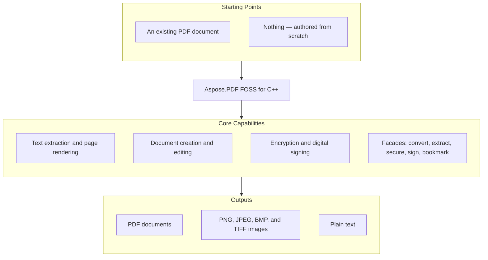

<!-- REVIEW VARIANT — Option 3: minimal 2-line "Starting Points" container kept for products with two structurally different starting points. Not a real candidate, not pushed anywhere. Only the ## At a glance section differs from reports/repo-presenter/pdf/cpp/readme.md. -->
# Aspose.PDF FOSS for C++

[](https://github.com/aspose-pdf-foss/Aspose.PDF-FOSS-for-Cpp/actions/workflows/ci.yml) [](https://opensource.org/licenses/MIT) [](https://en.cppreference.com/w/cpp/20) [](https://cmake.org/)

A free, open-source PDF library for modern C++ — open and save PDFs, extract text, render pages
to raster images, build documents from scratch (text, images, tables, vector graphics,
annotations, AcroForm fields, bookmarks), encrypt with RC4-40 / RC4-128 / AES-128 / AES-256, and
digitally sign with a detached PKCS#7 signature. No runtime dependency on any commercial PDF
stack — the library links against nothing but the C++ standard library; every primitive,
including the TIFF/JPEG/PNG codecs and the rasteriser, is implemented from scratch. The public
API is a strict subset of the public API of the commercial Aspose.PDF for .NET library, mirroring
class and method names where natural for migrants. Spec references throughout
follow ISO 32000-1 (PDF 1.7) and ISO 32000-2 (PDF 2.0).

## Navigation

- [At a glance](#at-a-glance)
- [Key capabilities](#key-capabilities)
- [Installation](#installation)
- [Quick start](#quick-start)
- [Additional examples](#additional-examples)
- [API reference](#api-reference)
- [Documentation & resources](#documentation--resources)
- [Scope and limitations](#scope-and-limitations)
- [Development and testing](#development-and-testing)
- [Third-party notices](#third-party-notices)
- [License](#license)

## At a glance



## Key capabilities

- **Open & save** — open existing PDFs; save with byte-verbatim round-trip, or edit `/Info`
  metadata via an incremental update that preserves the original bytes.
- **Open encrypted PDFs** — supply the user or owner password to `Document(path, password)`;
  `IsEncrypted()` reports the state.
- **Text extraction** — `Text::TextAbsorber` walks a whole `Document` or a single `Page`;
  `Text::TextFragmentAbsorber` returns positioned fragments with font, size, and colour.
- **Render to image** — rasterise pages through `PngDevice`, `JpegDevice`, and `BmpDevice`
  (single page per call), or `TiffDevice` (single page, or a full multi-page document range in
  one call). TIFF supports 1/4/8/24-bpp output with median-cut palette quantisation; a custom
  `IIndexBitmapConverter` can be supplied for caller-controlled palettes.
- **Encryption** — `Document::Encrypt(user, owner, permissions, algorithm)` with RC4-40,
  RC4-128, AES-128, or AES-256 (PDF 2.0, R=6); granular viewer permissions via `Permissions`.
- **Digital signatures** — `Facades::PdfFileSignature` adds a detached PKCS#7
  (`adbe.pkcs7.detached`) signature with a byte-exact `/ByteRange`.
- **Create from scratch** — positioned/word-wrapped text (`Text::TextBuilder`/`TextFragment`),
  images (`Page::AddImage`), `Table`/`Row`/`Cell`, vector graphics (`Drawing::Graph`),
  watermarks (`WatermarkArtifact`), annotations, AcroForm fields, and outline (bookmark) trees.
- **Extract text via a device** — `Devices::TextDevice` writes a page's text to a stream with a
  selectable output charset (`Encoding`: utf-8, utf-16-le, utf-16-be, latin-1, windows-1252).
- **Named destinations** — define reusable navigation targets via
  `Annotations::NamedDestination`/`NamedDestinationCollection`.
- **Aspose.Pdf.Facades** — the classic facade surface, with `PdfConverter`, `PdfExtractor`,
  `PdfFileSecurity`, `PdfFileSignature`, and `PdfBookmarkEditor` wired to the real engine.

## Installation

No NuGet package has been published for this library yet — it builds as a static library you link
into your project. (C++ isn't registry-less in general: [Aspose.Cells FOSS for
C++](https://www.nuget.org/packages/Aspose.Cells.Cpp.FOSS/) does publish there.)

```cmake
add_subdirectory(aspose.pdf-foss-for-cpp)
target_link_libraries(your_app PRIVATE aspose_pdf_foss)
```

Or build standalone:

```bash
cmake -S . -B build
cmake --build build
```

This is an out-of-source build under `build/`; the static library lands at
`build/libaspose_pdf_foss.a` (or `aspose_pdf_foss.lib` on MSVC). For a release build:

```bash
cmake -S . -B build -DCMAKE_BUILD_TYPE=Release
cmake --build build
```

`CMakePresets.json` carries host-conditional Windows-MSVC presets, e.g.
`cmake --preset windows-msvc-debug`. Sources with non-ASCII bytes need `/utf-8` under MSVC.

**Requirements**: a C++20 compiler (clang ≥ 16, gcc ≥ 13, MSVC 2022 ≥ 17.5), CMake ≥ 3.22, and
Python 3 at build time only (a generator step embeds the bundled font outlines into a generated
source file). Runtime dependencies: none — the test suite alone fetches GoogleTest v1.14.0 via
CMake `FetchContent` at configure time; it is not needed to build or consume the library itself.

## Quick start

```cpp
#include <aspose/pdf/document.hpp>
#include <aspose/pdf/page_collection.hpp>
#include <aspose/pdf/text_absorber.hpp>
#include <aspose/pdf/png_device.hpp>
#include <aspose/pdf/resolution.hpp>
#include <fstream>
#include <iostream>

int main() {
    // Open a PDF and count its pages
    Aspose::Pdf::Document doc("input.pdf");
    std::cout << "Pages: " << doc.Pages().Count() << "\n";

    // Extract text
    Aspose::Pdf::Text::TextAbsorber absorber;
    absorber.Visit(doc);
    std::cout << absorber.Text() << "\n";

    // Render page 1 to PNG at 150 DPI
    Aspose::Pdf::Devices::PngDevice png(Aspose::Pdf::Devices::Resolution(150));
    std::ofstream out("page1.png", std::ios::binary);
    png.Process(doc.Pages()[1], out);
}
```

## Additional examples

12 runnable examples live in the [`examples/`](examples/) directory —
after `cmake --build build`, executables land at `build/examples/<name>`. They are numbered to
build on one another; run them in order. See [`examples/README.md`](examples/README.md) for the
full tour.

| Example | Shows |
|---|---|
| `01_pages` | open a PDF, count pages, iterate the 1-based indexer |
| `02_read_metadata` / `03_write_metadata` | read `DocumentInfo`; edit + incremental-update save |
| `04_text_extraction` | `TextAbsorber::Visit(Document)` |
| `05_save_roundtrip` | byte-verbatim save |
| `06_devices_surface` | construct + round-trip device properties |
| `07_render_png` | end-to-end `PngDevice::Process(Page, ostream)` |
| `08_render_tiff` | multi-page TIFF via `TiffDevice::Process(Document, …)` |
| `09_indexed_tiff` | 8-bpp palettised TIFF (median-cut) |
| `10_render_text_pdf` | render a page with an embedded TrueType font |
| `11_render_standard14` | render `/Helvetica` with no embedded font (fallback path) |
| `12_create_features` | from-scratch 10-page showcase: text, image, tables, graphics, annotations, AcroForm fields, bookmarks |

### Encrypt a document with AES-256

```cpp
#include <aspose/pdf/document.hpp>
#include <aspose/pdf/crypto_algorithm.hpp>
#include <aspose/pdf/permissions.hpp>

using Aspose::Pdf::CryptoAlgorithm;
using Aspose::Pdf::Permissions;

Aspose::Pdf::Document doc("input.pdf");
doc.Encrypt("userpass", "ownerpass",
            Permissions::PrintDocument | Permissions::FillForm,
            CryptoAlgorithm::AESx128);
doc.Save("encrypted.pdf");                   // encryption applied on Save

// AES-256, PDF 2.0 (R=6): pass usePdf20 = true
doc.Encrypt("userpass", "ownerpass",
            Permissions::PrintDocument,
            CryptoAlgorithm::AESx256, /*usePdf20=*/true);

// Re-open with the password
Aspose::Pdf::Document reopened("encrypted.pdf", "userpass");
```

`CryptoAlgorithm` covers `RC4x40`, `RC4x128`, `AESx128`, and `AESx256`. `Permissions` is a
`[Flags]` enum (ISO 32000-1 §7.6.3.2 Table 22).

<details>
<summary>View additional code examples</summary>

### Read and update document metadata

```cpp
#include <aspose/pdf/document_info.hpp>

Aspose::Pdf::Document doc("input.pdf");
std::cout << doc.Info().Title() << " / " << doc.Info().Author() << "\n";

doc.SetTitle("My Title");
doc.Info().Author("Demo author");
doc.Info().Add("Custom-Key", "Custom value");
doc.Save("output.pdf");
```

> The incremental-update writer patches an existing `/Info` object; a from-scratch document has
> no `/Info` to patch, so setting metadata on one and saving throws.

### Build a page from scratch (text, table, vector graphics)

```cpp
#include <aspose/pdf/document.hpp>
#include <aspose/pdf/page_collection.hpp>
#include <aspose/pdf/text_builder.hpp>
#include <aspose/pdf/text_fragment.hpp>
#include <aspose/pdf/font_repository.hpp>
#include <aspose/pdf/position.hpp>
#include <aspose/pdf/table.hpp>
#include <aspose/pdf/border_info.hpp>
#include <aspose/pdf/paragraphs.hpp>

namespace pdf = Aspose::Pdf;
namespace txt = Aspose::Pdf::Text;

pdf::Document doc;
pdf::Page page = doc.Pages().Add();
page.SetPageSize(595.0, 842.0);

txt::TextFragment frag("Hello from Aspose.PDF FOSS for C++");
frag.TextState().Font(txt::FontRepository::FindFont("Helvetica"));
frag.TextState().FontSize(18.0f);
frag.Position(txt::Position(60.0, 760.0));
txt::TextBuilder{page}.AppendText(frag);

pdf::Table table;                                    // keep alive until doc.Save()
table.ColumnWidths("250 120 120");
table.Border(pdf::BorderInfo(pdf::BorderSide::All, 0.5f));
pdf::Row& header = table.Rows().Add();
header.Cells().Add("Item"); header.Cells().Add("Qty"); header.Cells().Add("Price");
page.Paragraphs().Add(table);                        // stored by reference

doc.Save("scratch.pdf");
```

> **Lifetime rule for creation.** `Paragraphs`, `Annotations`, `Form`, `Artifacts`, and
> `Outlines` store the object **by reference**, so every table, graph, annotation, field,
> watermark, and outline item must outlive `Save()`.

### Digital signatures

```cpp
#include <aspose/pdf/document.hpp>
#include <aspose/pdf/facades/pdf_file_signature.hpp>

Aspose::Pdf::Facades::PdfFileSignature sig{"input.pdf", "signed.pdf"};
// configure the signature (certificate + key), then sign and save —
// a detached PKCS#7 (adbe.pkcs7.detached) signature with a byte-exact
// /ByteRange, verifiable with the OpenSSL CLI.
```

See `tests/facades_pdf_file_signature_smoke_test.cpp` for the full signing flow.

</details>

## API reference

The core API is built around the `Document` class and its `Pages()` collection
(`PageCollection`).

<details>
<summary>View the core API surface</summary>

### Document and pages

- `Document`
  - `Document(path)` / `Document(path, password)`
  - `IsEncrypted() -> bool`
  - `Pages() -> PageCollection`
  - `Info() -> DocumentInfo`
  - `SetTitle(value)`
  - `Encrypt(user, owner, permissions, algorithm, usePdf20 = false)`
  - `Decrypt()`
  - `Optimize()` / `OptimizeResources()`
  - `Outlines()`, `Form()`, `EmbeddedFiles()`, `Metadata()` (XMP)
  - `Save(path)`
- `PageCollection` (1-based)
  - `Count() -> int`
  - `operator[](index) -> Page&`
  - `Add()`, `Insert()`, `Delete()`
- `Page`
  - `Number()`, `SetPageSize(width, height)`
  - `AddImage(bytes, rectangle)` (PNG or JPEG byte streams)
  - `Paragraphs()`, `Annotations()`, `Artifacts()`
- `DocumentInfo` — typed accessors: `Title()`, `Author()`, `Subject()`, `Keywords()`,
  `Creator()`, `Producer()`, `Trapped()`; `Add()` / `Remove()` / `ClearCustomData()` for custom
  entries

### Text

- `Text::TextAbsorber` — `Visit(document)` / `Visit(page)`, `Text() -> std::string`
- `Text::TextFragmentAbsorber` — `TextFragments()` (positioned fragments with font, size, colour)
- `Text::TextBuilder` — `AppendText(fragment)`
- `Text::TextFragment`, `Text::TextParagraph` — positioned/word-wrapped text
- `Text::FontRepository::FindFont(name)`

### Rendering devices

- `Devices::PngDevice`, `Devices::JpegDevice`, `Devices::BmpDevice` — `Process(page, ostream)`
  (single page only)
- `Devices::TiffDevice` — `Process(page, ostream)` / `Process(document, startPage, endPage,
  ostream)` (single page or a multi-page document range)
- `Devices::Resolution`, `Devices::TiffSettings`, `Devices::ColorDepth`
- `IIndexBitmapConverter` — pluggable palette quantisation (`Get1BppImage`/`Get4BppImage`/
  `Get8BppImage`)
- `Devices::TextDevice` — `Process(page, ostream)`; `GetEncoding()`/`SetEncoding(Encoding)`

### Security

- `Document::Encrypt(user, owner, permissions, algorithm, usePdf20)`
- `CryptoAlgorithm`: `RC4x40`, `RC4x128`, `AESx128`, `AESx256`
- `Permissions` (`[Flags]`): print, modify, extract, annotate, fill form, accessibility,
  assemble, high-res print

### Creation building blocks

- `Table` / `Row` / `Cell` — `ColumnWidths`, `Border`/`BorderInfo`, `BackgroundColor`,
  `Cell::ColSpan`
- `Drawing::Graph` with `Line`, `Rectangle`, `Circle`, `Ellipse`
- `WatermarkArtifact`
- `Annotations::*` — `Highlight`, `Underline`, `Squiggly`, `StrikeOut`, `Square`, `Circle`,
  `Line`, `Ink`, `Text`, `FreeText`, `Stamp`, `Link` (`GoToAction`/`GoToURIAction`),
  `FileAttachment`
- `Forms::*` — `TextBoxField`, `CheckboxField`, `RadioButtonField`, `ComboBoxField`,
  `ListBoxField`, `ButtonField`; `Form::Add()`, `Form::Flatten()`
- `OutlineCollection` / `OutlineItemCollection` with `XYZExplicitDestination`
- `Annotations::NamedDestination` / `NamedDestinationCollection` — reusable named navigation
  targets

### Facades (`Aspose::Pdf::Facades`)

- `PdfConverter` — rasterise a PDF to multi-page TIFF or per-page PNG
- `PdfExtractor` — text extraction honouring `StartPage`/`EndPage`
- `PdfFileSecurity` — encrypt / decrypt / change passwords
- `PdfFileSignature` — detached PKCS#7 signing
- `PdfBookmarkEditor` — create / extract bookmarks

</details>

## Documentation & resources

- **[Getting started guide](https://docs.aspose.org/pdf/cpp/)** — installation, walkthroughs, and feature guides for this library.
- **[How-to guides & FAQ](https://kb.aspose.org/pdf/cpp/)** — task-focused answers for common PDF-processing questions.
- **[Full API reference](https://reference.aspose.org/pdf/cpp/)** — the complete, browsable reference for the public API surface (the [API reference](#api-reference) section above covers the essentials).
- Found a bug or have a feature request? [Open an issue](https://github.com/aspose-pdf-foss/Aspose.PDF-FOSS-for-Cpp/issues) on GitHub.

## Scope and limitations

This is a v1 release and a deliberate subset of Aspose.PDF for .NET. Some facade methods (e.g.
`PdfFileEditor` concatenate/split, `PdfFileStamp` header/footer stamping) ship their public
surface but are not yet wired to the engine — the feature list above reflects what is exercised
by the examples and the test suite. A few `XmpValue` type-checking helpers (`IsDateTime`,
`IsField`, `IsNamedValue`, `IsRaw`, `IsNamedValues`, `IsStructure`) are stubs that always return
`false`; use `IsString`/`IsInteger`/`IsDouble`/`IsArray` instead. Standard-14 font fallback
currently covers 12 of the 14 standard fonts (Helvetica, Times-Roman, Courier × 4 styles each).

For workflows that require the full Aspose.PDF facade surface, broader format coverage, or
commercial support, see [Aspose.PDF for C++ — Enterprise Product](https://products.aspose.com/pdf/cpp/).

## Development and testing

```bash
cmake -S . -B build
cmake --build build
cd build && ctest
```

A GoogleTest suite covers both the public-API surface and the foundation primitives. GoogleTest
is fetched via CMake `FetchContent` at configure time and is the only test-time dependency.

## Third-party notices

The compiled library links against nothing but the C++ standard library, and all codecs (TIFF,
JPEG, PNG, …) are implemented from scratch within the library. It bundles the **Liberation**
font family, licensed under the SIL Open Font License 1.1, which permits bundling with software
under any license — see
[`src/internal/standard14_outlines.fonts/OFL.txt`](src/internal/standard14_outlines.fonts/OFL.txt),
to provide metrically-compatible substitutes for the Standard-14 PDF fonts. **GoogleTest**
(BSD 3-Clause) is fetched via CMake `FetchContent` for the test suite only and is not part of the
shipped library. Full detail: [THIRD_PARTY_NOTICES.md](THIRD_PARTY_NOTICES.md).

## License

This project is licensed under the [MIT License](LICENSE). It bundles the Liberation fonts
under the SIL Open Font License 1.1 (SPDX: `MIT AND OFL-1.1` for the distribution as a whole).
The MIT license covers the library's own code.
