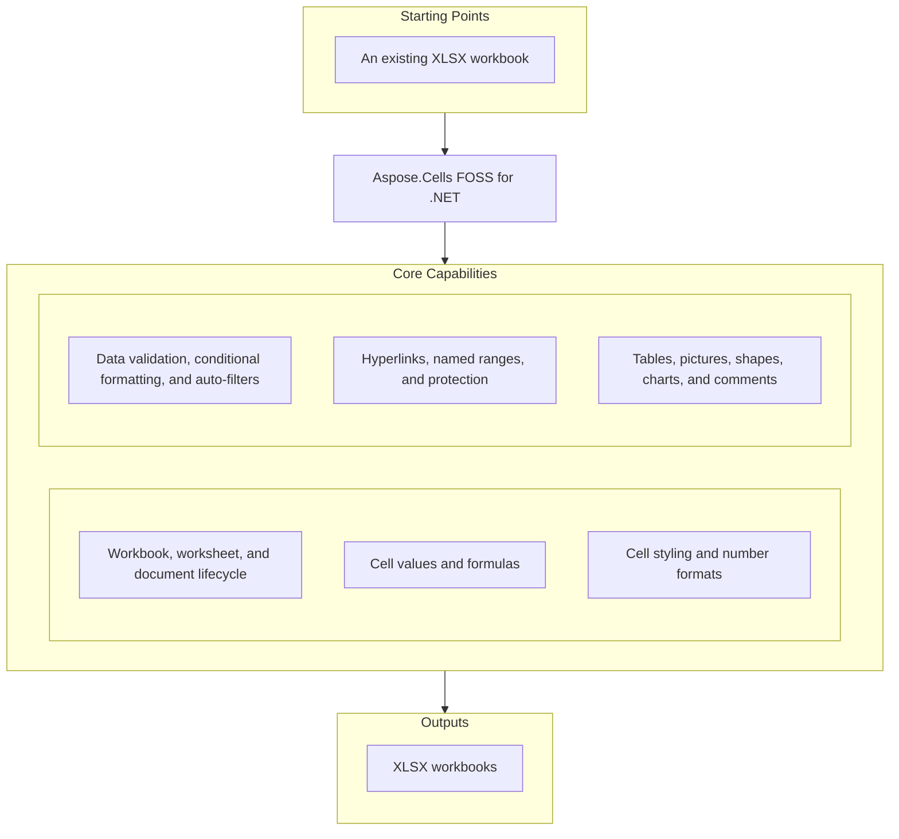

# Aspose.Cells FOSS for .NET

[](https://www.nuget.org/packages/Aspose.Cells.FOSS/) [](https://github.com/aspose-cells-foss/Aspose.Cells-FOSS-for-.NET/blob/master/License/LICENSE.txt) [](https://github.com/aspose-cells-foss/Aspose.Cells-FOSS-for-.NET/graphs/contributors) [](https://github.com/aspose-cells-foss/Aspose.Cells-FOSS-for-.NET/issues)

[](https://products.aspose.org/cells/net/)

Aspose.Cells FOSS for .NET is a free, open-source, MIT-licensed .NET library for creating, loading, editing, and saving Excel `.xlsx` workbooks, with no dependency on Microsoft Excel or any other native Office library. It exposes an Aspose.Cells-compatible API surface built around `Workbook`, `Worksheet`, `Cells`, and `Cell` — the objects a spreadsheet developer already expects. The library is pure managed code, multi-targeting `netstandard2.0` and `net8.0`, so the same package runs unmodified on Windows, Linux, and macOS, including containerized and serverless environments such as Azure Functions and AWS Lambda.

## Navigation

- [At a Glance](#at-a-glance)
- [Key Capabilities](#key-capabilities)
- [Installation](#installation)
- [Quick Start](#quick-start)
- [Additional Examples](#additional-examples)
- [API Reference](#api-reference)
- [Documentation & Resources](#documentation--resources)
- [Scope and Limitations](#scope-and-limitations)
- [Development and Testing](#development-and-testing)
- [License](#license)

## At a Glance



## Key Capabilities

- Create a new workbook or load an existing `.xlsx` file with `Workbook()` / `Workbook(fileName)` / `Workbook(stream)`, and save it with `Save(fileName)`; navigate sheets through `Workbook.Worksheets`.
- Recover from malformed input instead of failing outright: `LoadOptions.TryRepairPackage`/`TryRepairXml`/`StrictMode` control the repair behavior, and `LoadDiagnostics` reports repair and data-loss-risk diagnostics through `HasRepairs`/`HasDataLossRisk`, plus warning callbacks delivered through an `IWarningCallback`.
- Configure worksheet-level display and print settings — zoom, gridlines, right-to-left (RTL) layout, visibility, and page/print layout through `Worksheet.PageSetup` — plus workbook and document metadata via `WorkbookProperties` and `CoreDocumentProperties`.
- Read and write cell values of multiple types (`string`, `int`, `bool`, `decimal`, `DateTime`) with `Cell.PutValue(value)`, and read them back with `Cell.StringValue`/`Cell.Value`; store formulas as strings via `Cell.Formula` — evaluated by the application that opens the file, not computed by the library itself.
- Apply fonts, fills, borders, and alignment through `Cell.GetStyle()`/`SetStyle()` and the `Style`/`Font`/`Borders`/`FillPattern` types, with `StyleFlag` controlling which formatting properties a given style application actually touches; assign custom per-cell number formats.
- Add whole-number, decimal, list, and date validation rules with `ValidationCollection.Add()`, `ValidationType`, and `OperatorType`; highlight data with conditional formatting — `FormatConditionType.CellValue`, `Expression`, `ColorScale`, `DataBar`, `IconSet` — via `Worksheet.ConditionalFormattings`; filter columns with `AutoFilter`/`FilterColumn`.
- Add hyperlinks — external URLs, internal cell references, and mailto links — through `HyperlinkCollection.Add()`; create global and sheet-scoped defined names with `DefinedNameCollection.Add()`; lock a workbook's structure with `WorkbookProtection` or an individual sheet with `Worksheet.Protect()`.
- Build structured Excel tables through `Worksheet.ListObjects` (`ListObjectCollection.Add()`, `ListObject`/`ListColumn`), including built-in table styles (`TableStyleType`) and totals-row aggregation (`TotalsCalculation`); anchor pictures (`PictureCollection`) and drawing shapes (`ShapeCollection`, `AutoShapeType`) to a worksheet.
- Create and configure charts through `ChartCollection.Add()` and `Chart`/`ChartType`; attach legacy cell comments with `CommentCollection.Add()`.

## Installation

```bash
dotnet add package Aspose.Cells.FOSS
```

```xml
<PackageReference Include="Aspose.Cells.FOSS" Version="26.6.0.0" />
```

The library multi-targets `netstandard2.0` and `net8.0`. Because it targets `netstandard2.0`, it can also be consumed by any compatible runtime, including .NET Framework 4.6.1 and later alongside modern .NET — the same package works unmodified on Windows, Linux, and macOS with no native dependencies. The public namespace is `Aspose.Cells_FOSS` (with an underscore) — distinct from the NuGet package id `Aspose.Cells.FOSS` (with dots).

## Quick Start

Create a workbook, write and format cells, and save it:

```csharp
using Aspose.Cells_FOSS;

var workbook = new Workbook();
var sheet = workbook.Worksheets[0];

sheet.Name = "Products";
sheet.Cells["A1"].PutValue("Product");
sheet.Cells["B1"].PutValue("Price");
sheet.Cells["A2"].PutValue("Apple");
sheet.Cells["B2"].PutValue(2.99m);
sheet.Cells["A3"].PutValue("Orange");
sheet.Cells["B3"].PutValue(1.99m);
sheet.Cells["B4"].Formula = "=SUM(B2:B3)";

var headerStyle = sheet.Cells["A1"].GetStyle();
headerStyle.Font.IsBold = true;
headerStyle.Pattern = FillPattern.Solid;
headerStyle.ForegroundColor = Color.FromArgb(255, 34, 120, 212);
sheet.Cells["A1"].SetStyle(headerStyle);
sheet.Cells["B1"].SetStyle(headerStyle);

workbook.Save("products.xlsx");
```

Load a workbook with recovery diagnostics:

```csharp
using System;
using Aspose.Cells_FOSS;

var loadOptions = new LoadOptions
{
    TryRepairPackage = true,
    TryRepairXml = true,
    StrictMode = false
};

var workbook = new Workbook("input.xlsx", loadOptions);

if (workbook.LoadDiagnostics.HasDataLossRisk)
{
    Console.WriteLine("Potential data loss risk detected during load.");
}

workbook.Worksheets[0].Cells["A1"].PutValue("Updated");
workbook.Save("updated.xlsx");
```

## Additional Examples

More real, runnable snippets — adapted from the sample projects under [`samples/`](samples/README.md) — are collected below.

### Build a Table With Totals

```csharp
var workbook = new Workbook();
var sheet = workbook.Worksheets[0];

sheet.Cells["A1"].PutValue("Product");
sheet.Cells["B1"].PutValue("Category");
sheet.Cells["C1"].PutValue("Price");
sheet.Cells["A2"].PutValue("Laptop");
sheet.Cells["B2"].PutValue("Electronics");
sheet.Cells["C2"].PutValue(999.99);
sheet.Cells["A3"].PutValue("Mouse");
sheet.Cells["B3"].PutValue("Electronics");
sheet.Cells["C3"].PutValue(29.99);

var tableIndex = sheet.ListObjects.Add("A1", "C3", true);
var table = sheet.ListObjects[tableIndex];
table.DisplayName = "Products";
table.TableStyleType = TableStyleType.TableStyleMedium2;
table.ShowTotals = true;

workbook.Save("products-table.xlsx");
```

<details>
<summary>View Additional Examples</summary>

### Validate Cell Input

```csharp
var workbook = new Workbook();
var sheet = workbook.Worksheets[0];

sheet.Cells["A1"].PutValue("Open");

var listValidationIndex = sheet.Validations.Add(CellArea.CreateCellArea("A1", "A3"));
var listValidation = sheet.Validations[listValidationIndex];
listValidation.Type = ValidationType.List;
listValidation.Formula1 = "\"Open,Closed\"";
listValidation.InCellDropDown = true;
listValidation.ShowError = true;
listValidation.ErrorTitle = "Invalid";
listValidation.ErrorMessage = "Choose from the list";

workbook.Save("validations-sample.xlsx");
```

### Highlight Data With Conditional Formatting

```csharp
var workbook = new Workbook();
var sheet = workbook.Worksheets[0];

for (var index = 0; index < 10; index++)
{
    sheet.Cells[index, 0].PutValue(index + 1);
}

var rules = sheet.ConditionalFormattings[sheet.ConditionalFormattings.Add()];
rules.AddArea(CellArea.CreateCellArea("A1", "A10"));
var rule = rules[rules.AddCondition(FormatConditionType.CellValue, OperatorType.Between, "3", "7")];
rule.Style.Pattern = FillPattern.Solid;
rule.Style.ForegroundColor = Color.FromArgb(255, 255, 199, 206);

workbook.Save("conditional-formatting-sample.xlsx");
```

### Add Hyperlinks and Named Ranges

```csharp
var workbook = new Workbook();
var sheet = workbook.Worksheets[0];

sheet.Cells["A1"].PutValue("Docs");
var link = sheet.Hyperlinks[sheet.Hyperlinks.Add("A1", 1, 1, "https://example.com/docs")];
link.TextToDisplay = "Docs";

var name = workbook.DefinedNames[workbook.DefinedNames.Add("GlobalRange", "='Sheet1'!$A$1:$D$5")];
name.Comment = "Primary sample range";

workbook.Save("hyperlinks-and-names-sample.xlsx");
```

### Create a Chart

```csharp
var workbook = new Workbook();
var sheet = workbook.Worksheets[0];
sheet.Name = "Charts";

for (var month = 1; month <= 12; month++)
{
    sheet.Cells[month, 0].PutValue("Month " + month);
    sheet.Cells[month, 1].PutValue(month * 1000);
}

var chartIndex = sheet.Charts.Add(ChartType.Column, "Charts!$B$1:$B$13", 0, 4, 18, 8);
var chart = sheet.Charts[chartIndex];

workbook.Save("charts-sample.xlsx");
```

</details>

## API Reference

The public API is exposed under the `Aspose.Cells_FOSS` namespace, with `Workbook` as the root object and `Worksheet`/`Cells`/`Cell` as the objects developers interact with day to day. The library ships 96 public types, summarized in the module-grouped table below (mirrors [reference.aspose.org's own class index](https://reference.aspose.org/cells/net/)).

<details>
<summary>View the Supported Public API Surface</summary>

### Core API

| Class | Description |
|---|---|
| `AutoFilter` | Represents auto filter. |
| `AutoFilterColorFilter` | Represents auto filter color filter. |
| `AutoFilterCustomFilter` | Represents auto filter custom filter. |
| `AutoFilterCustomFilterCollection` | Represents a collection of auto filter custom filter objects. |
| `AutoFilterDynamicFilter` | Represents auto filter dynamic filter. |
| `AutoFilterSortCondition` | Represents auto filter sort condition. |
| `AutoFilterSortConditionCollection` | Represents a collection of auto filter sort condition objects. |
| `AutoFilterSortState` | Represents auto filter sort state. |
| `AutoFilterTop10` | Represents auto filter top10. |
| `Border` | Represents border. |
| `Borders` | Represents borders. |
| `CalculationProperties` | Represents calculation properties. |
| `Cell` | Represents a single worksheet cell and exposes value, formula, and style operations. |
| `Cells` | Provides access to worksheet cells, rows, columns, and merged ranges. |
| `CellsException` | Represents an error that occurs during cells. |
| `Chart` | Charts provide visual representation of data and can be created programmatically or loaded from existing XLSX files. |
| `ChartCollection` | Represents collection of charts on a worksheet. |
| `Column` | Represents column. |
| `ColumnCollection` | Represents a collection of column objects. |
| `Comment` | Represents a worksheet comment (legacy note) anchored to a single cell. |
| `CommentCollection` | Represents the collection of comments (legacy notes) on a worksheet. |
| `ConditionalFormattingCollection` | Represents a collection of conditional formatting objects. |
| `CoreDocumentProperties` | Represents core document properties. |
| `DefinedName` | Represents defined name. |
| `DefinedNameCollection` | Represents a collection of defined name objects. |
| `DocumentProperties` | Represents document properties. |
| `ExtendedDocumentProperties` | Represents extended document properties. |
| `FilterColumn` | Represents filter column. |
| `FilterColumnCollection` | Represents a collection of filter column objects. |
| `FilterValueCollection` | Represents a collection of filter value objects. |
| `Font` | Represents font. |
| `FormatCondition` | Represents format condition. |
| `FormatConditionCollection` | Represents a collection of format condition objects. |
| `FormulaException` | Represents an error that occurs during formula. |
| `Hyperlink` | Represents hyperlink. |
| `HyperlinkCollection` | Encapsulates the hyperlinks defined for a worksheet. |
| `InvalidFileFormatException` | Represents an error that occurs during invalid file format. |
| `ListColumn` | Represents a single column in an Excel table. |
| `ListColumnCollection` | Represents the ordered collection of columns in an Excel table. |
| `ListObject` | Represents an Excel table (structured reference / ListObject). |
| `ListObjectCollection` | Represents the collection of Excel tables on a worksheet. |
| `LoadDiagnostics` | Represents load diagnostics. |
| `LoadIssue` | Represents load issue. |
| `LoadOptions` | Specifies how a workbook should be loaded. |
| `NumberFormat` | Provides number format operations. |
| `PageSetup` | Represents worksheet print and page-layout settings. |
| `Picture` | Represents a picture (image) anchored to a worksheet. |
| `PictureCollection` | Represents collection of pictures anchored to a worksheet. |
| `Row` | Represents row. |
| `RowCollection` | Represents a collection of row objects. |
| `SaveOptions` | Specifies how a workbook should be saved. |
| `Shape` | Represents a drawing object (auto shape) anchored to a worksheet. |
| `ShapeCollection` | Represents collection of drawing objects (shapes) on a worksheet. |
| `Style` | Represents a mutable cell style facade that can be applied to one or more cells. |
| `StyleException` | Represents an error that occurs during style. |
| `StyleFlag` | Represents flags which indicate applied formatting properties. |
| `UnsupportedFeatureException` | Represents an error that occurs during unsupported feature. |
| `Validation` | Represents validation. |
| `ValidationCollection` | Represents a collection of validation objects. |
| `WarningInfo` | Represents warning info. |
| `Workbook` | Represents the root spreadsheet object used to create, load, modify, and save an XLSX workbook. |
| `WorkbookLoadException` | Represents an error that occurs during workbook load. |
| `WorkbookProperties` | Represents workbook properties. |
| `WorkbookProtection` | Represents workbook protection. |
| `WorkbookSaveException` | Represents an error that occurs during workbook save. |
| `WorkbookSettings` | Represents workbook-level settings that affect date handling and display formatting. |
| `WorkbookView` | Represents workbook view. |
| `Worksheet` | Encapsulates a single worksheet and its supported v0.1 worksheet features. |
| `WorksheetCollection` | Encapsulates the workbook's worksheets and active-sheet state. |
| `WorksheetProtection` | Represents worksheet protection. |

#### Interfaces

| Interface | Description |
|---|---|
| `IWarningCallback` | Defines a callback that receives load warnings. |

#### Structs

| Struct | Description |
|---|---|
| `CellArea` | Represents cell area. |
| `Color` | Represents color. |

#### Enumerations

| Enumeration | Description |
|---|---|
| `AutoShapeType` | Specifies the type of an auto shape (preset geometry). |
| `BorderStyleType` | Specifies border style type. |
| `CellValueType` | Specifies cell value type. |
| `ChartType` | Specifies the chart type. |
| `DiagnosticSeverity` | Specifies diagnostic severity. |
| `FillPattern` | Specifies fill pattern. |
| `FilterOperatorType` | Specifies filter operator type. |
| `FontUnderlineType` | Enumerates font underline types. |
| `FormatConditionType` | Specifies format condition type. |
| `HorizontalAlignmentType` | Specifies horizontal alignment type. |
| `ImageType` | Represents the format of an image stored in a worksheet. |
| `LoadFormat` | Specifies load format. |
| `OperatorType` | Specifies operator type. |
| `PageOrientationType` | Specifies page orientation type. |
| `PaperSizeType` | Specifies paper size type. |
| `SaveFormat` | Specifies save format. |
| `TableStyleType` | Represents the built-in Excel table style types. |
| `TargetModeType` | Specifies target mode type. |
| `TotalsCalculation` | Represents the aggregation function shown in a table totals row cell. |
| `ValidationAlertType` | Specifies validation alert type. |
| `ValidationType` | Specifies validation type. |
| `VerticalAlignmentType` | Specifies vertical alignment type. |
| `VisibilityType` | Specifies visibility type. |

---

#### Detailed Member Reference

### Workbook and Worksheets

- `Workbook`
  - Constructors: `Workbook()`, `Workbook(fileName)`, `Workbook(stream)`, `Workbook(fileName, options)`, `Workbook(stream, options)`
  - `Save(fileName)`, `Save(fileName, format)`, `Save(fileName, options)`, `Save(stream, format)`, `Save(stream, options)`, `Dispose()`
  - Properties: `Worksheets: WorksheetCollection`, `Settings: WorkbookSettings`, `Properties: WorkbookProperties`, `DocumentProperties: DocumentProperties`, `DefinedNames: DefinedNameCollection`, `LoadDiagnostics: LoadDiagnostics`
- `Worksheet`
  - `Protect()`, `Unprotect()`
  - Properties: `Name: string`, `VisibilityType: VisibilityType`, `ShowGridlines: bool`, `RightToLeft: bool`, `Zoom: int`, `Cells: Cells`, `Hyperlinks: HyperlinkCollection`, `Validations: ValidationCollection`, `ConditionalFormattings: ConditionalFormattingCollection`, `PageSetup: PageSetup`, `Protection: WorksheetProtection`, `AutoFilter: AutoFilter`, `ListObjects: ListObjectCollection`, `Pictures: PictureCollection`, `Shapes: ShapeCollection`, `Charts: ChartCollection`, `Comments: CommentCollection`
- `LoadOptions` / `LoadDiagnostics`
  - Properties: `StrictMode: bool`, `TryRepairPackage: bool`, `TryRepairXml: bool`, `WarningCallback: IWarningCallback`, `Issues: IReadOnlyList<LoadIssue>`, `HasRepairs: bool`, `HasDataLossRisk: bool`

### Cells, Values, and Styling

- `Cell`
  - `PutValue(value)`, `PutValue(value, isConverted)`, `PutValue(value, isConverted, setStyle)`, `GetStyle()`, `GetStyle(checkBorders)`, `SetStyle(style)`, `SetStyle(style, explicitFlag)`, `SetStyle(style, flag)`
  - Properties: `Value: object`, `StringValue: string`, `DisplayStringValue: string`, `Formula: string`, `Type: CellValueType`
- `Cells`
  - `Merge(firstRow, firstColumn, totalRows, totalColumns)`
  - Properties: `Rows: RowCollection`, `Style: Style`, `Columns: ColumnCollection`, `MergedCells: IReadOnlyList<CellArea>`
- `Style`
  - `Copy(source)`, `Equals(obj)`, `GetHashCode()`
  - Properties: `Font: Font`, `Borders: Borders`, `Pattern: FillPattern`, `ForegroundColor: Color`, `BackgroundColor: Color`, `NumberFormat: string`, `HorizontalAlignment: HorizontalAlignmentType`, `VerticalAlignment: VerticalAlignmentType`, `WrapText: bool`, `IsLocked: bool`, `IsHidden: bool`

### Validation, Conditional Formatting, and Tables

- `ValidationCollection`
  - `Add(area)`, `GetValidationInCell(row, column)`, `RemoveACell(row, column)`, `RemoveArea(cellArea)`
  - Properties: `Count: int`
- `Validation`
  - `AddArea(area)`, `RemoveArea(area)`
  - Properties: `Areas: IReadOnlyList<CellArea>`, `Type: ValidationType`, `Operator: OperatorType`, `Formula1: string`, `Formula2: string`, `AlertStyle: ValidationAlertType`, `InCellDropDown: bool`
- `ConditionalFormattingCollection`
  - `Add()`, `RemoveAt(index)`, `RemoveArea(startRow, startColumn, totalRows, totalColumns)`
  - Properties: `Count: int`
- `FormatConditionCollection`
  - `Add(area, type, operatorType, formula1, formula2)`, `AddCondition(type)`, `AddCondition(type, operatorType, formula1, formula2)`, `AddArea(area)`, `GetCellArea(index)`, `RemoveArea(index)`, `RemoveCondition(index)`
  - Properties: `Count: int`, `RangeCount: int`
- `ListObjectCollection`
  - `Add(startRow, startColumn, endRow, endColumn, hasHeaders)`, `Add(startCellName, endCellName, hasHeaders)`, `RemoveAt(index)`
  - Properties: `Count: int`
- `ListObject`
  - `Resize(startRow, startColumn, endRow, endColumn, hasHeaders)`, `ShowAutoFilter()`, `RemoveAutoFilter()`, `ConvertToRange()`
  - Properties: `DisplayName: string`, `TableStyleType: TableStyleType`, `ShowTotals: bool`, `ListColumns: ListColumnCollection`

### Links, Names, and Drawing Objects

- `HyperlinkCollection`
  - `Add(cellName, totalRows, totalColumns, address)`, `Add(firstRow, firstColumn, totalRows, totalColumns, address)`, `Add(startCellName, endCellName, address, textToDisplay, screenTip)`, `RemoveAt(index)`, `Clear()`
  - Properties: `Count: int`
- `DefinedNameCollection`
  - `Add(name, formula)`, `Add(name, formula, localSheetIndex)`, `RemoveAt(index)`
  - Properties: `Count: int`
- `ChartCollection`
  - `Add(type, dataRange, upperLeftRow, upperLeftColumn, lowerRightRow, lowerRightColumn)`
  - Properties: `Count: int`
- `Chart`
  - Properties: `Name: string`, `ChartType: ChartType`, `UpperLeftRow: int`, `UpperLeftColumn: int`, `LowerRightRow: int`, `LowerRightColumn: int`, `ExtentCx: long`, `ExtentCy: long`

### Exceptions

- `CellsException` — base type for the library's exceptions
- `WorkbookLoadException` / `WorkbookSaveException` — raised for a failed load or save
- `InvalidFileFormatException` — the input is not a recognized XLSX package
- `StyleException` / `FormulaException` / `UnsupportedFeatureException`

</details>

## Documentation & Resources

- **[Getting started guide](https://docs.aspose.org/cells/net/)** — installation, walkthroughs, and feature guides for this library.
- **[How-to guides & FAQ](https://kb.aspose.org/cells/net/)** — task-focused answers for common spreadsheet questions.
- **[Full API reference](https://reference.aspose.org/cells/net/)** — the complete, browsable reference for all public types (the [API reference](#api-reference) section above covers the essentials).
- **[Contributor guide](agents.md)** — repository layout, build/verification commands, and conventions for agents and contributors working in this checkout.
- Found a bug or have a feature request? [Open an issue](https://github.com/aspose-cells-foss/Aspose.Cells-FOSS-for-.NET/issues) on GitHub.

## Scope and Limitations

- **Single format.** Only XLSX is supported for both load and save (`LoadFormat` and `SaveFormat` each expose just one real format); legacy XLS (binary), ODS, CSV, and other spreadsheet formats are not read or written.
- **No formula calculation engine.** `Cell.Formula` stores the formula as a string verbatim; the library does not parse, evaluate, or recalculate it — results come from whatever the application that opens the file computes.
- **No rendering, conversion, or printing.** There is no PDF/image/HTML export and no print execution — output is always an XLSX workbook; `PageSetup`'s print-layout properties (page breaks via `AddHorizontalPageBreak`/`AddVerticalPageBreak`, orientation, paper size) configure how a real spreadsheet application would print the file, but the library itself never rasterizes a page.
- **No macros or VBA.** The public API has no VBA-project or macro-related types, so a macro-enabled workbook round-trips only its non-macro content.
- **No pivot tables.** Structured tables (`ListObject`) and charts (`Chart`) are supported; pivot tables are not part of the public API surface.
- Charts are created and embedded as real chart objects (`Chart`/`ChartCollection`) with series data and anchoring, but the library does not rasterize a chart to an image — that rendering happens in whatever application opens the workbook.

For workflows that need broader spreadsheet functionality — additional formats (XLS, ODS, CSV), a formula calculation engine, pivot tables, and rendering to PDF or images — see [Aspose.Cells for .NET — Enterprise Edition](https://products.aspose.com/cells/net/), the commercial product this FOSS edition's core is derived from.

## Development and Testing

This checkout has no dedicated test project (`tests/` is absent) — the `samples/` console projects are the verification surface; run the relevant one after touching a related area of the library.

Clone the repository and build the library from the repository root:

```bash
git clone https://github.com/aspose-cells-foss/Aspose.Cells-FOSS-for-.NET.git
cd Aspose.Cells-FOSS-for-.NET
dotnet build src\Aspose.Cells_FOSS\Aspose.Cells_FOSS.csproj -c Debug
```

Run any sample from the repository root, for example:

```bash
dotnet run --project samples\Aspose.Cells_FOSS.Samples.Basic\Aspose.Cells_FOSS.Samples.Basic.csproj
```

<details>
<summary>View All Sample Projects</summary>

The [`samples/`](samples/README.md) directory has one runnable console project per feature area:

- `Aspose.Cells_FOSS.Samples.Basic`
- `Aspose.Cells_FOSS.Samples.Loading`
- `Aspose.Cells_FOSS.Samples.Styles`
- `Aspose.Cells_FOSS.Samples.WorksheetSettings`
- `Aspose.Cells_FOSS.Samples.Validations`
- `Aspose.Cells_FOSS.Samples.ConditionalFormatting`
- `Aspose.Cells_FOSS.Samples.HyperlinksAndNames`
- `Aspose.Cells_FOSS.Samples.PageSetup`
- `Aspose.Cells_FOSS.Samples.Shapes`
- `Aspose.Cells_FOSS.Samples.Charts`
- `Aspose.Cells_FOSS.Samples.Comments`
- `Aspose.Cells_FOSS.Samples.DocumentProperties`
- `Aspose.Cells_FOSS.Samples.ListObjects`
- `Aspose.Cells_FOSS.Samples.Pictures`

</details>

## License

This project is licensed under the [MIT License](License/LICENSE.txt). The MIT License permits use, copying, modification, distribution, sublicensing, and commercial use, provided its copyright and permission notice are retained. The software is provided without warranty.
