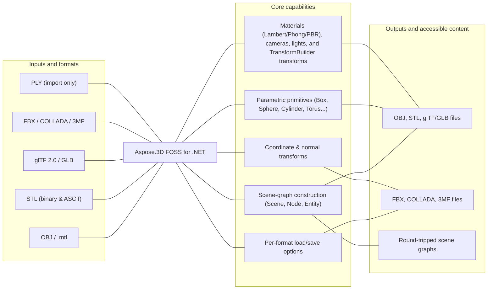

# Aspose.3D FOSS for .NET

[](https://www.nuget.org/packages/Aspose.3D.FOSS/) [](LICENSE) [](https://github.com/aspose-3d-foss/Aspose.3D-FOSS-for-.NET/graphs/contributors)

Aspose.3D FOSS for .NET is a free, open-source, MIT-licensed .NET library for reading, building,
and exporting 3D scenes. It exposes an Aspose.3D-compatible scene-graph API — `Scene`, `Node`,
`Mesh`, `Camera`, `Transform` — and supports common interchange formats such as OBJ, STL, glTF/GLB,
FBX, COLLADA, 3MF, and PLY (import only), without requiring any native runtime, external SDK, or
third-party renderer.

## Navigation

- [At a glance](#at-a-glance)
- [Key capabilities](#key-capabilities)
- [Installation](#installation)
- [Quick start](#quick-start)
- [Additional examples](#additional-examples)
- [API reference](#api-reference)
- [Documentation & resources](#documentation--resources)
- [Scope and limitations](#scope-and-limitations)
- [Development and testing](#development-and-testing)
- [License](#license)

## At a glance



## Key capabilities

- Build and traverse a scene graph with `Scene`, `Node`, `Group`, and `Entity` — nodes support
  child creation, merging, and global-transform evaluation.
- Create parametric primitives — `Box`, `Cylinder`, `Sphere`, `Torus`, `Dish`, `Pyramid` — and
  convert them to `Mesh` data for export.
- Load and save OBJ (with `.mtl` materials), STL (binary and ASCII), glTF 2.0 / GLB (PBR
  materials), FBX (import and export), COLLADA, and 3MF; PLY is import-only.
- Configure per-format behavior through dedicated load/save option classes, e.g.
  `ObjLoadOptions.FlipCoordinateSystem` / `NormalizeNormal` / `Scale`.
- Apply materials (`LambertMaterial`, `PhongMaterial`, `PbrMaterial`), cameras, lights, and
  `TransformBuilder`-composed transforms.
- Embed or extract text watermarks in 3D files via the `Watermark` utility class.

## Installation

Install the library from NuGet:

```bash
dotnet add package Aspose.3D.FOSS --version 26.1.0
```

The main library (`src/main/Aspose.ThreeD/Aspose.ThreeD.csproj`) multi-targets `net10.0`,
`net8.0`, `net6.0`, and `netcoreapp3.1` in Release builds (Debug builds target `net10.0` only).
The repository also contains a separate console conversion tool
(`src/converter/Converter.csproj`, package id `Aspose.3D.Converter`) that references the library
as a project — it is not published to NuGet.

## Quick start

Load an OBJ scene and export it as glTF:

```csharp
using Aspose.ThreeD;

var scene = new Scene();
scene.Open("model.obj");
scene.Save("model.gltf");
```

Build a scene from a primitive and save it to OBJ:

```csharp
using Aspose.ThreeD;
using Aspose.ThreeD.Entities;

var scene = new Scene();
var box = new Box(2, 2, 2);
scene.RootNode.CreateChildNode("BoxNode", box);

scene.Save("box.obj");
```

## Additional examples

Runnable examples and additional format coverage are collected below.

### Load OBJ with options and export as STL

```csharp
using Aspose.ThreeD;
using Aspose.ThreeD.Formats;

var scene = new Scene();
var opts = new ObjLoadOptions();
opts.FlipCoordinateSystem = true;
opts.NormalizeNormal = true;
scene.Open("mesh.obj", opts);

scene.Save("mesh.stl");
```

<details>
<summary>View additional examples</summary>

### Save a scene to COLLADA through a stream

```csharp
using Aspose.ThreeD;
using Aspose.ThreeD.Entities;
using Aspose.ThreeD.Formats;

var scene = new Scene();
var box = new Box(2, 2, 2);
scene.RootNode.CreateChildNode("BoxNode", box);

using var stream = new MemoryStream();
var options = new ColladaSaveOptions();
scene.Save(stream, options);
```

### Handle an unrecognized file format

```csharp
using Aspose.ThreeD;

var scene = new Scene();
try
{
    scene.Open("unknown.xyz");
}
catch (ArgumentException)
{
    // No matching FileFormat could be resolved for the extension.
}
```

</details>

## API reference

The library ships 193 public types. Selected entry points:

<details>
<summary>View selected API surface</summary>

### Scene graph

- `Scene` — top-level container; `Open`/`FromFile`/`FromStream`, `Save`, `RootNode`,
  `SubScenes`, `AnimationClips`, `Poses`.
- `Node` — `CreateChildNode`, `AddChildNode`, `Merge`, `EvaluateGlobalTransform`.
- `Entity` (abstract) — base of all scene-graph content; `Geometry`, `Frustum` extend it.
- `A3DObject` — base of all Aspose.3D objects; dynamic `Properties` via `GetProperty`/`SetProperty`.
- `Group` — logical grouping of nodes.

### Primitives and geometry

- `Box`, `Cylinder`, `Sphere`, `Torus`, `Dish`, `Pyramid`, `RectangularTorus` — parameterized
  primitives; `ToMesh()`, `GetBoundingBox()`.
- `Mesh` — polygon mesh; `TriMesh` — GPU-ready raw vertex/index data.
- `Curve`, `Circle`, `Ellipse`, `CompositeCurve`, `NurbsCurve`, `NurbsSurface`.
- `BooleanOperator` / `BooleanOperand` — mesh boolean operations (Add/Sub/Intersect).

### Materials, cameras, and lights

- `Material` (abstract), `LambertMaterial`, `PhongMaterial`, `PbrMaterial`.
- `Camera`, `Light`, `Frustum` (shared base of Camera/Light).
- `Texture`, `TextureSlot`, `TextureBase`.

### File formats and options

- `FileFormat` — format registry (`Detect`, `GetFormatByExtension`, and per-format static members
  such as `WavefrontOBJ`, `STLBinary`, `GLTF2`, `Collada`, `Discreet3DS`, `Microsoft3MF`).
- Per-format `LoadOptions`/`SaveOptions` pairs: `ObjLoadOptions`/`ObjSaveOptions`,
  `StlLoadOptions`/`StlSaveOptions`, `GltfLoadOptions`/`GltfSaveOptions`,
  `FbxLoadOptions`/`FbxSaveOptions`, `ColladaSaveOptions`, `Discreet3dsLoadOptions`/
  `Discreet3dsSaveOptions`, `DracoSaveOptions`, `AmfSaveOptions`, `A3dwSaveOptions`,
  `Html5SaveOptions`.

### Math, structs, and utilities

- `Vector2`/`Vector3`/`Vector4`, `FVector2`/`FVector3`/`FVector4`, `Matrix4`/`FMatrix4`,
  `Quaternion`, `BoundingBox`/`BoundingBox2D`, `Rect`.
- `TransformBuilder` — compose/prepend/append transformation matrices with a selectable order.
- `Watermark` — text-watermark embed/decode utilities.
- `AssetInfo` — document metadata (author, coordinate system, unit scale).

### Exceptions

- `ExportException`, `ImportException`, `ParseException`, `DriverException`, `TrialException`.

</details>

## Documentation & resources

- **[Getting started guide](https://docs.aspose.org/3d/net/)** — installation, walkthroughs, and feature guides for this library.
- **[How-to guides & FAQ](https://kb.aspose.org/3d/net/)** — task-focused answers for common 3D-processing questions.
- **[Full API reference](https://reference.aspose.org/3d/net/)** — the complete, browsable reference for all 193 public types.
- **[AGENTS.md](AGENTS.md)** — implementation status and development guidelines for contributors.
- Found a bug or have a feature request? [Open an issue](https://github.com/aspose-3d-foss/Aspose.3D-FOSS-for-.NET/issues) on GitHub.

## Scope and limitations

This is a work-in-progress FOSS implementation focused on the most widely used open 3D formats.
Several members exist on the public API surface but throw `NotImplementedException` in this
edition, including: Draco decode/encode (`DracoFormat`), PDF scene extraction (`PdfFormat`), PLY
encoding (`PlyFormat.Encode` — PLY is import-only), Microsoft 3MF buildable/object-type accessors,
RVM attribute loading, ZIP-backed file systems, NURBS curve evaluation, mesh boolean/triangulate
operations on `PolygonModifier`, and text-watermark encode/decode. License and trial-management
APIs (`License`, `Metered`) are intentionally not implemented, since they don't apply to an
open-source project. Rendering (`Scene.Render`) is also not implemented in this edition.

For proprietary formats (A3DW, PDF, USD, JT), rendering, and advanced mesh operations, see
[Aspose.3D for .NET — Enterprise Edition](https://products.aspose.com/3d/net/).

## Development and testing

Build the library and run the xUnit test suite from the repository root:

```bash
dotnet build src/main/Aspose.ThreeD/Aspose.ThreeD.csproj
dotnet test src/test/Aspose.ThreeD.Tests/Aspose.ThreeD.Tests.csproj
```

The console converter tool builds separately as a project reference to the library:

```bash
dotnet build src/converter/Converter.csproj
```

## License

This project is licensed under the [MIT License](LICENSE). The MIT License permits use, copying,
modification, distribution, sublicensing, and commercial use, provided its copyright and
permission notice are retained. The software is provided without warranty.
