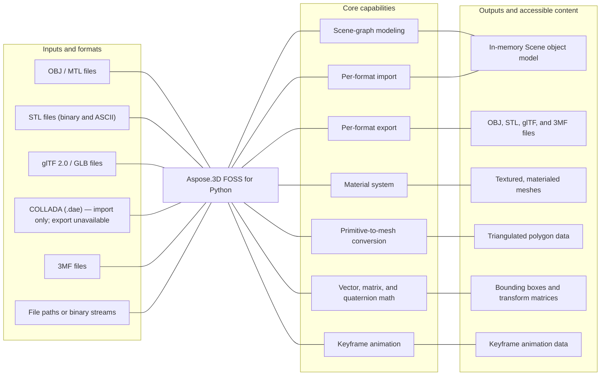

# Aspose.3D FOSS for Python

[](LICENSE) [](setup.py) [](https://github.com/aspose-3d-foss/Aspose.3D-FOSS-for-Python/graphs/contributors)

Aspose.3D FOSS for Python is a free, open-source, pure-Python library for building, reading, and
writing 3D scenes through an Aspose.3D-compatible API. It models a scene graph of nodes, meshes,
cameras, lights, and materials, and moves that graph in and out of OBJ, STL, glTF, COLLADA, and
3MF files with no native dependencies to compile or install.

## Navigation

- [At a glance](#at-a-glance)
- [Key capabilities](#key-capabilities)
- [Installation](#installation)
- [Quick start](#quick-start)
- [Additional examples](#additional-examples)
- [API reference](#api-reference)
- [Documentation & resources](#documentation--resources)
- [Scope and limitations](#scope-and-limitations)
- [Development and testing](#development-and-testing)
- [License](#license)

## At a glance



## Key capabilities

- Build 3D scenes programmatically with `Scene`, `Node`, `Mesh`, `Camera`, and `Light` in a
  hierarchical node graph.
- Import OBJ (with `.mtl` materials), STL (binary and ASCII), glTF 2.0 / GLB, COLLADA (`.dae`),
  and 3MF files into a common `Scene` model with `Scene.open(...)`.
- Export the same `Scene` model back out to OBJ, STL, glTF/GLB, or 3MF with `Scene.save(...)`
  (COLLADA import is supported; COLLADA export is not currently reachable through the public
  API — see [Scope and limitations](#scope-and-limitations)).
- Assign Lambert, Phong, or PBR (metallic-roughness) materials to nodes, including glTF material
  properties such as `albedo`, `metallic_factor`, and `roughness_factor`.
- Convert built-in parametric primitives (`Box`, `Cylinder`, `Sphere`, `Torus`, `Pyramid`,
  `Dish`, ...) into triangulated `Mesh` objects with `to_mesh()`.
- Work with `Vector2`/`Vector3`/`Vector4`, `Matrix4`, `Quaternion`, and `BoundingBox` utilities
  for transforms and spatial queries.
- Animate scene properties with keyframe sequences (`AnimationClip`, `KeyframeSequence.add(time,
  value, interpolation)`, `KeyFrame`) bound to node/material properties via
  `AnimationNode`/`BindPoint`.

## Installation

A PyPI package has not been published yet. Install directly from a local clone:

```bash
git clone https://github.com/aspose-3d-foss/Aspose.3D-FOSS-for-Python.git
cd Aspose.3D-FOSS-for-Python
pip install -e .
```

The package declares support for Python 3.7 through 3.12 and has no required third-party
dependencies.

## Quick start

Load an OBJ scene and inspect its meshes:

```python
from aspose.threed import Scene
from aspose.threed.formats.obj import ObjLoadOptions

scene = Scene()
options = ObjLoadOptions()
options.enable_materials = True
scene.open("model.obj", options)

for node in scene.root_node.child_nodes:
    if node.entity:
        mesh = node.entity
        print(f"Mesh: {node.name}")
        print(f"  Vertices: {len(mesh.control_points)}")
        print(f"  Polygons: {mesh.polygon_count}")
```

Convert the same kind of scene to a binary glTF (GLB):

```python
from aspose.threed import Scene
from aspose.threed.formats.gltf import GltfSaveOptions

scene = Scene()
scene.open("mesh.stl")

options = GltfSaveOptions()
options.binary_mode = True
scene.save("mesh.glb", options)
```

## Additional examples

The snippets below cover building meshes from scratch, applying materials, and working with
additional formats, without cluttering the primary quick-start path above.

### Build a mesh and export it to STL

```python
import io
from aspose.threed import Scene, FileFormat
from aspose.threed.entities import Mesh
from aspose.threed.utilities import Vector4

scene = Scene()
mesh = Mesh("triangle")
mesh.control_points.add(Vector4(0.0, 0.0, 0.0, 1.0))
mesh.control_points.add(Vector4(1.0, 0.0, 0.0, 1.0))
mesh.control_points.add(Vector4(1.0, 1.0, 0.0, 1.0))
mesh.create_polygon(0, 1, 2)

node = scene.root_node.create_child_node("triangle_node")
node.entity = mesh

stream = io.StringIO()
# Use FileFormat.get_format_by_extension(...).create_save_options() rather than
# StlSaveOptions() directly: a default-constructed options object has no
# file_format set, and scene.save() cannot infer the format from a bare stream
# (only filename-based saves fall back to extension detection).
options = FileFormat.get_format_by_extension(".stl").create_save_options()
options.binary_mode = False
scene.save(stream, options)
print(stream.getvalue())
```

<details>
<summary>View additional examples</summary>

### Assign a PBR material and export to glTF

```python
import io
import json
from aspose.threed import Scene, FileFormat
from aspose.threed.entities import Mesh
from aspose.threed.utilities import Vector3, Vector4
from aspose.threed.formats.gltf import GltfSaveOptions
from aspose.threed.shading import PbrMaterial

scene = Scene()
mesh = Mesh("TestMesh")
mesh.control_points.add(Vector4(0.0, 0.0, 0.0, 1.0))
mesh.control_points.add(Vector4(1.0, 0.0, 0.0, 1.0))
mesh.control_points.add(Vector4(0.0, 1.0, 0.0, 1.0))
mesh.create_polygon(0, 1, 2)

albedo = Vector3(0.8, 0.2, 0.3)
material = PbrMaterial("RedMaterial", albedo)
material.metallic_factor = 0.5
material.roughness_factor = 0.7

node = scene.root_node.create_child_node("TestNode")
node.entity = mesh
node.material = material

stream = io.BytesIO()
# Pass the detected FileFormat into the constructor explicitly: unlike
# StlFormat, GltfFormat.create_save_options() does not set file_format on the
# options it returns, and a bare stream (no filename) gives scene.save()
# nothing else to detect the format from.
options = GltfSaveOptions(FileFormat.get_format_by_extension(".gltf"))
options.binary_mode = False
scene.save(stream, options)

stream.seek(0)
gltf_data = json.loads(stream.read().decode("utf-8"))
print(gltf_data["materials"][0]["pbrMetallicRoughness"])
```

### Import a COLLADA file

```python
from aspose.threed import Scene
from aspose.threed.formats.collada.ColladaLoadOptions import ColladaLoadOptions

scene = Scene()
options = ColladaLoadOptions()
scene.open("model.dae", options)

print(f"Child nodes: {len(scene.root_node.child_nodes)}")
```

### Convert a parametric primitive to a mesh

```python
from aspose.threed.entities import Box

box = Box(10, 20, 30)
mesh = box.to_mesh()
print(f"Control points: {len(mesh.control_points)}")
```

### Build a cube and export it to 3MF

```python
import io
from aspose.threed import Scene
from aspose.threed.entities import Mesh
from aspose.threed.utilities import Vector4
from aspose.threed.formats import ThreeMfSaveOptions

scene = Scene()
mesh = Mesh("cube")
for point in [
    Vector4(0, 0, 0, 1), Vector4(1, 0, 0, 1), Vector4(1, 1, 0, 1), Vector4(0, 1, 0, 1),
    Vector4(0, 0, 1, 1), Vector4(1, 0, 1, 1), Vector4(1, 1, 1, 1), Vector4(0, 1, 1, 1),
]:
    mesh.control_points.add(point)

mesh.create_polygon(0, 1, 2)
mesh.create_polygon(0, 2, 3)
mesh.create_polygon(4, 7, 6)
mesh.create_polygon(4, 6, 5)
mesh.create_polygon(0, 4, 5)
mesh.create_polygon(0, 5, 1)
mesh.create_polygon(2, 6, 7)
mesh.create_polygon(2, 7, 3)
mesh.create_polygon(0, 3, 7)
mesh.create_polygon(0, 7, 4)
mesh.create_polygon(1, 5, 6)
mesh.create_polygon(1, 6, 2)

node = scene.root_node.create_child_node("cube")
node.entity = mesh

stream = io.BytesIO()
options = ThreeMfSaveOptions()
options.enable_compression = False
scene.save(stream, options)
```

</details>

## API reference

The public entry points are organized under `aspose.threed` (core scene graph),
`aspose.threed.entities` (meshes, primitives, cameras, lights), `aspose.threed.shading`
(materials), `aspose.threed.formats` (load/save options, format detection, and the plugin
registry), and `aspose.threed.utilities` (vector, matrix, and quaternion math). Format-specific
importer and exporter classes (`ObjImporter`, `ColladaExporter`, `GltfExporter`, ...) live in
internal per-format submodules such as `aspose.threed.formats.gltf`; the documented way to move
data in and out of a scene is `Scene.open()` / `Scene.save()` with the matching `*LoadOptions` /
`*SaveOptions` class.

> **Import from the format submodule, not the top-level package.** `aspose.threed.formats`
> re-exports `ObjLoadOptions`/`ObjSaveOptions`, `StlLoadOptions`/`StlSaveOptions`,
> `GltfLoadOptions`/`GltfSaveOptions`, and `ColladaLoadOptions`/`ColladaSaveOptions`, but those
> top-level names resolve to stub classes that don't inherit from the base `LoadOptions` /
> `SaveOptions` types, so `Scene.open()`/`Scene.save()` silently ignore them (for loading) or raise
> `AttributeError` (for saving). Import from the submodule instead — `from aspose.threed.formats.obj
> import ObjLoadOptions`, `from aspose.threed.formats.gltf import GltfSaveOptions`, and so on — which
> is also what this project's own Quick Start does. `ColladaLoadOptions`/`ColladaSaveOptions` need a
> fully-qualified import (`from aspose.threed.formats.collada.ColladaLoadOptions import
> ColladaLoadOptions`) because the `collada` submodule has no `__init__.py`. `ThreeMfLoadOptions` /
> `ThreeMfSaveOptions` and `FbxLoadOptions`/`FbxSaveOptions` are unaffected and work fine imported
> from the top-level package as shown elsewhere in this README.

<details>
<summary>View the supported public API surface</summary>

### Scene graph (`aspose.threed`)

- `Scene`
  - `open(file_or_stream, options)`, `save(file_or_stream, format_or_options)`, `from_file(file_name)`
  - `root_node`, `sub_scenes`, `asset_info`, `animation_clips`
  - `create_animation_clip(name)`, `clear()`
- `Node`
  - `create_child_node(node_name, entity, material) -> 'Node'`
  - `add_entity(entity)`, `add_child_node(node)`, `merge(node)`
  - `entity`, `entities`, `material`, `materials`, `child_nodes`, `parent_node`
  - `transform`, `global_transform`, `visible`, `excluded`
  - `evaluate_global_transform(with_geometric_transform)`, `get_bounding_box()`
- `Entity` (base of `Mesh` and the primitive shapes)
  - `get_bounding_box()`, `parent_node`, `parent_nodes`, `excluded`, `name`
- `Transform` / `GlobalTransform`
  - `translation`, `scaling`, `rotation`, `euler_angles`, `transform_matrix`
  - `set_translation(tx, ty, tz)`, `set_scale(sx, sy, sz)`, `set_rotation(rw, rx, ry, rz)`

### Meshes and primitives (`aspose.threed.entities`)

- `Mesh(name)`
  - `control_points: ArrayListAdapter[Vector4]`, `polygon_count`, `polygons`
  - `create_polygon(*indices)`, `triangulate()`, `get_bounding_box()`
- `Box`, `Cylinder`, `Sphere`, `Torus`, `Pyramid`, `Dish`, `Circle`, `Ellipse`, `Frustum`
  - each exposes `to_mesh() -> 'Mesh'` to convert the parameterized primitive into a concrete mesh
- `Camera`, `Light`
  - `near_plane`, `far_plane`, `field_of_view`, `direction`, `target`, `up`

### Materials (`aspose.threed.shading`)

- `Material` (base) — `get_texture(slot_name)`, `set_texture(slot_name, texture)`
- `LambertMaterial` — `emissive_color`, `ambient_color`, `diffuse_color`, `transparent_color`, `transparency`
- `PhongMaterial(LambertMaterial)` — adds `specular_color`, `specular_factor`, `shininess`, `reflection_color`
- `PbrMaterial` — `albedo`, `metallic_factor`, `roughness_factor`, `albedo_texture`, `normal_texture`, `occlusion_texture`, `emissive_texture`, `emissive_color`

### Format load/save options (`aspose.threed.formats`)

- `ObjLoadOptions` — `flip_coordinate_system`, `enable_materials`, `scale`, `normalize_normal`
- `ObjSaveOptions` — `apply_unit_scale`, `point_cloud`, `verbose`, `serialize_w`,
  `enable_materials`, `flip_coordinate_system`, `axis_system`
- `StlLoadOptions` / `StlSaveOptions` — `binary_mode` (save only), `scale`, `flip_coordinate_system`
- `GltfLoadOptions` / `GltfSaveOptions` — `binary_mode` (save only), `flip_tex_coord_v`
- `ColladaLoadOptions` / `ColladaSaveOptions` — `flip_coordinate_system`, `enable_materials`
  (save only), `indented` (save only)
- `ThreeMfLoadOptions` / `ThreeMfSaveOptions` — `flip_coordinate_system`, `enable_compression`
  (save only), `build_all` (save only), `pretty_print` (save only), `unit` (save only)
- `FbxLoadOptions` / `FbxSaveOptions` — `compatible_mode`, `export_textures`, `embed_textures` (see [Scope and limitations](#scope-and-limitations))
- `FileFormat` — `detect(stream, file_name)`, `get_format_by_extension(extension_name)`, `can_import`, `can_export`

### Math utilities (`aspose.threed.utilities`)

- `Vector2`, `Vector3`, `Vector4` — `x`/`y`/`z`/`w`, `length`, `normalize()`, `dot()`, `cross()`
- `Matrix4` — `translate()`, `scale()`, `rotate()`, `decompose()`, `inverse()`, `get_identity()`
- `Quaternion` — `slerp(t, v1, v2)`, `to_matrix()`, `from_euler_angle()`, `from_angle_axis()`
- `BoundingBox` — `minimum`, `maximum`, `center`, `size`, `merge()`, `contains()`

### Animation (`aspose.threed.animation`)

- `AnimationClip` — `create_animation_node(name) -> AnimationNode`, `animations`, `start`, `stop`
- `AnimationNode` — `create_bind_point(obj, prop_name)`, `get_keyframe_sequence(target, prop_name,
  channel_name, create)`, `bind_points`, `sub_animations`
- `AnimationChannel` (extends `KeyframeSequence`) — `component_type`, `default_value`,
  `keyframe_sequence`
- `KeyframeSequence` — `add(time, value, interpolation)`, `key_frames`, `pre_behavior`/
  `post_behavior` (`Extrapolation`)
- `KeyFrame` — `time`, `value`, `interpolation` (`Interpolation`), tangent/weight fields
  (`tangent_weight_mode`, `step_mode`, `tension`, `continuity`, `bias`)
- `BindPoint`, `Interpolation`, `Extrapolation`/`ExtrapolationType`, `StepMode`, `WeightedMode`

### Exceptions

- `ImportException`, `ExportException`, `ParseException`, `InvalidOperationException`

</details>

## Documentation & resources

- **[Getting started guide](https://docs.aspose.org/3d/python/)** — installation, key capabilities,
  and links to detailed developer guides for this library.
- **[How-to guides & FAQ](https://kb.aspose.org/3d/python/)** — task-focused how-to guides for
  loading, converting, and manipulating 3D files with the pip-installable library.
- **[Full API reference](https://reference.aspose.org/3d/python/)** — the complete, browsable
  reference for all 303 public types (the [API reference](#api-reference) section above covers
  the essentials).
- Found a bug or have a feature request? [Open an issue](https://github.com/aspose-3d-foss/Aspose.3D-FOSS-for-Python/issues) on GitHub.

## Scope and limitations

This project focuses on scene-graph modeling and the OBJ, STL, glTF, COLLADA, and 3MF format
pipelines. The `aspose.threed.render` module (`Renderer`, `IRenderWindow`, `IBuffer`,
`ICommandList`, `ITexture2D`, and related classes) is not implemented — this library reads,
builds, and writes 3D scene data, it does not render or rasterize scenes. `Mesh` boolean
operations (`union`, `difference`, `intersect`, `do_boolean`) and NURBS curve/surface evaluation
(`NurbsCurve.evaluate`, `NurbsSurface.to_mesh`) also raise `NotImplementedError`.

FBX support is more limited than the other formats: the FBX tokenizer and parser are exercised by
the test suite, but `FbxExporter.save()` and `FbxExporter.save_to_stream()` raise
`NotImplementedError`, and full round-trip FBX import/export is not covered by the bundled tests
the way OBJ, STL, glTF, COLLADA, and 3MF are. Treat FBX as experimental and prefer the other
formats when round-trip fidelity matters.

COLLADA import works, but COLLADA export is not currently reachable through the public
`Scene.save()` API — the exporter dispatcher registers `FbxExporter` ahead of the Collada plugin
and raises `NotImplementedError` before the real Collada exporter is ever reached, even though a
working implementation exists in the source tree.

For workflows that need scene rendering, complete FBX read/write support, or additional formats
such as PDF, USD, JT, or RVM, see
[Aspose.3D for Python — Enterprise Edition](https://products.aspose.com/3d/python-net/).

## Development and testing

Install the repository in editable mode and run the test suite:

```bash
git clone https://github.com/aspose-3d-foss/Aspose.3D-FOSS-for-Python.git
cd Aspose.3D-FOSS-for-Python
pip install -e .
python -m unittest discover tests/
```

Run a single test file:

```bash
python -m unittest tests.test_obj_importer
```

The optional `dev` extra (`pip install -e ".[dev]"`) installs `pytest`, though the bundled test
suite itself is written against the standard-library `unittest` framework.

## License

This project is licensed under the [MIT License](LICENSE). The MIT License permits use, copying,
modification, distribution, sublicensing, and commercial use, provided its copyright and
permission notice are retained. The software is provided without warranty.
