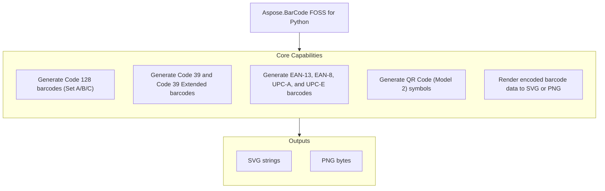

# Aspose.BarCode FOSS for Python

[](LICENSE) [](https://github.com/aspose-barcode-foss/Aspose.BarCode-FOSS-for-Python/graphs/contributors)

[](https://products.aspose.org/barcode/python/)

Aspose.BarCode FOSS for Python is a free, open-source, pure-Python library for generating
standards-compliant linear and 2D barcodes. It encodes Code 128, Code 39, EAN-13, EAN-8,
UPC-A, UPC-E, and QR Code symbols and renders them to SVG or PNG, with no native or
system dependencies.

## Navigation

- [At a Glance](#at-a-glance)
- [Key Capabilities](#key-capabilities)
- [Installation](#installation)
- [Quick Start](#quick-start)
- [Additional Examples](#additional-examples)
- [API Reference](#api-reference)
- [Documentation & Resources](#documentation--resources)
- [Scope and Limitations](#scope-and-limitations)
- [Development and Testing](#development-and-testing)
- [License](#license)

## At a Glance



## Key Capabilities

- Generate linear (1D) barcodes across Code 128 (automatic or explicit Code Set A/B/C selection via `Code128Options.encode_mode`), Code 39 and Code 39 Extended (full ASCII, two-character shift encoding, optional modulo-43 check digit), and the EAN-13/EAN-8/UPC-A/UPC-E family (automatic or explicit check-digit validation via `allow_check_digit_input`).
- Generate QR Code (Model 2, versions 1-40) symbols with selectable error correction level, version, mask, and encoding mode.
- Render every symbology to SVG or PNG through `Barcode.to_svg()` / `Barcode.to_png()`, or through an explicit `Renderer` (`SvgRenderer`, `PngRenderer`).
- Style output with `RenderOptions`: scale, DPI, module width/height, quiet zone, foreground/background color, transparent background, and human-readable text (font family and size); any field left as `None` falls back to the symbology's own default.
- Select any symbology by canonical name or alias through the generic `generate()` function.
- Validate input before encoding with typed exceptions (`InvalidInputError`, `SymbologyNotFoundError`, `UnsupportedCapabilityError`, and more).
- Fully typed (ships a `py.typed` marker) for static type checkers.

## Installation

A PyPI package has not been published yet. Install it from a source checkout (run from
the repository root, where `pyproject.toml` lives):

```bash
git clone https://github.com/aspose-barcode-foss/Aspose.BarCode-FOSS-for-Python.git
cd Aspose.BarCode-FOSS-for-Python
pip install .
```

The distribution is named `aspose-barcode-foss`; the import package is `aspose_barcode_foss`.
The package requires Python 3.12 or later and depends only on [Pillow](https://python-pillow.org/) >= 10.1.0 (used for PNG output).

## Quick Start

Generate a Code 128 barcode and a QR Code, then save them as SVG and PNG:

```python
from aspose_barcode_foss import code128, qr

svg = code128("ABC-12345").to_svg()
with open("code128.svg", "w", encoding="utf-8") as f:
    f.write(svg)

png = qr("https://example.com").to_png()
with open("qr.png", "wb") as f:
    f.write(png)
```

Any symbology can also be selected by name through the generic `generate()` function:

```python
from aspose_barcode_foss import generate

barcode = generate("code128", "ABC-123")
barcode = generate("qr", "https://example.com")
```

## Additional Examples

Runnable scripts are available in the [`examples`](examples/) directory. The most common
operations are collected below.

### Generate Every Supported Symbology

```python
from aspose_barcode_foss import code128, code39, code39ext, ean8, ean13, qr, upca, upce

SAMPLES = [
    ("Code 128", code128, "ABC-12345"),
    ("Code 39", code39, "ABC-123"),
    ("Code 39 Extended", code39ext, "Item #42"),
    ("EAN-13", ean13, "590123412345"),
    ("EAN-8", ean8, "1234567"),
    ("UPC-A", upca, "01234567890"),
    ("UPC-E", upce, "01234500005"),
    ("QR Code", qr, "https://example.com"),
]

for label, factory, data in SAMPLES:
    matrix = factory(data).symbol.matrix
    print(f"{label:18} {data!r:18} -> {matrix.width}x{matrix.height} modules")
```

<details>
<summary>View Additional Examples</summary>

### Style Output With RenderOptions

```python
from aspose_barcode_foss import RenderOptions, SvgRenderer, code128

barcode = code128("Hello-World")

options = RenderOptions(
    scale=2.0,
    foreground_color="#224466",
    background_color="#fff8f0",
    show_text=True,
    font_size=9.0,
)

# to_svg() is a convenience wrapper around render(SvgRenderer(), ...).
svg = barcode.to_svg(options=options)
artifact = barcode.render(SvgRenderer(), options=options)
assert artifact.data == svg
```

### Configure Code 128 Encode Mode

```python
from aspose_barcode_foss import code128, Code128Options, Code128EncodeMode

# AUTO (default) selects the optimal Code Set sequence.
barcode = code128("Mixed123ABC", encode=Code128Options(encode_mode=Code128EncodeMode.AUTO))

# Force a specific Code Set.
barcode = code128("12345678", encode=Code128Options(encode_mode=Code128EncodeMode.CODE_C))
```

### Configure QR Code Options

```python
from aspose_barcode_foss import qr, QrOptions, QrErrorCorrectionLevel, QrEncodeMode

barcode = qr(
    "PAYLOAD",
    encode=QrOptions(
        error_correction_level=QrErrorCorrectionLevel.H,  # L / M / Q / H
        version=None,                                      # 1-40, or None to auto-fit
        mask=None,                                         # 0-7, or None to auto-select
        encoding_mode=QrEncodeMode.AUTO,                   # AUTO / NUMERIC / ALPHANUMERIC / BYTE / KANJI
    ),
)
```

### Configure Code 39 and EAN/UPC Check Digits

```python
from aspose_barcode_foss import code39, code39ext, Code39Options

# Optional modulo-43 check character.
barcode = code39("ABC-123", encode=Code39Options(add_check_digit=True))

# code39ext() encodes the full ASCII set.
barcode = code39ext("Item #42")
```

```python
from aspose_barcode_foss import ean13, Ean13Options

# Pass 12 digits and let the check digit be computed.
barcode = ean13("590123412345")

# Or pass all 13 digits and opt in to validating the supplied check digit.
barcode = ean13("5901234123457", encode=Ean13Options(allow_check_digit_input=True))
```

The same `allow_check_digit_input` option is available for `ean8()`, `upca()`, and `upce()`.

### Handle Typed Exceptions

```python
from aspose_barcode_foss import InvalidInputError, SymbologyNotFoundError, code128, ean13, generate

try:
    code128("")  # empty input
except InvalidInputError as error:
    print(f"InvalidInputError: {error}")

try:
    ean13("123")  # wrong number of digits
except InvalidInputError as error:
    print(f"InvalidInputError: {error}")

try:
    generate("datamatrix", "data")  # unknown symbology
except SymbologyNotFoundError as error:
    print(f"SymbologyNotFoundError: {error}")
```

</details>

## API Reference

The supported public entry point is the top-level `aspose_barcode_foss` package. Everything
under `aspose_barcode_foss._internal` is an implementation detail and may change. The primary
entry points are the symbology helper functions and `generate()`, which return a `Barcode`
object exposing `to_svg()`, `to_png()`, and `render()`.

<details>
<summary>View the Supported Public API Surface</summary>

### Core API

| Class | Description |
|---|---|
| `Barcode` | Public barcode object returned by the high-level API. |

### Internal

| Class | Description |
|---|---|
| `BarcodeError` | Base exception for the barcode library. |
| `Code128Options` | Encoding options for Code 128. |
| `Code39Options` | Encoding options for Code 39. |
| `Ean13Options` | Encoding options for EAN-13. |
| `Ean8Options` | Encoding options for EAN-8. |
| `EncodeOptions` | Base type for symbology-specific encoding options. |
| `EncodingError` | Raised when encoding fails. |
| `InvalidInputError` | Raised when the provided input is technically invalid. |
| `PdfRenderer` | Render a barcode into PDF or another vector-friendly artifact. |
| `PngRenderer` | Render a barcode into PNG output. |
| `QrOptions` | Encoding options for QR Code. |
| `RenderOptions` | User-supplied rendering options. |
| `Renderer` | Abstract renderer interface. |
| `RenderingError` | Raised when rendering fails. |
| `ResolvedRenderOptions` | Resolved rendering configuration. |
| `SvgRenderer` | Render a barcode into SVG output. |
| `SymbologyNotFoundError` | Raised when a requested symbology is not registered. |
| `UnsupportedCapabilityError` | Raised when a symbology does not support a requested capability. |
| `UnsupportedFeatureError` | Raised when a requested feature is not supported by the library. |
| `UpcaOptions` | Encoding options for UPC-A. |
| `UpceOptions` | Encoding options for UPC-E. |

#### Enumerations

| Enumeration | Description |
|---|---|
| `Code128EncodeMode` | Supported public Code 128 encode-mode requests. |
| `Code39EncodeMode` | Supported Code 39 encode modes. |
| `QrEncodeMode` | Supported public QR Code encode-mode requests. |
| `QrErrorCorrectionLevel` | Supported QR Code error correction levels. |

---

#### Detailed Member Reference

### Top-Level Functions

- `generate(symbology, data, *, encode=None, render=None) -> Barcode`
- `code128(data, *, encode=None, render=None) -> Barcode`
- `code39(data, *, encode=None, render=None) -> Barcode`
- `code39ext(data, *, encode=None, render=None) -> Barcode`
- `ean13(data, *, encode=None, render=None) -> Barcode`
- `ean8(data, *, encode=None, render=None) -> Barcode`
- `upca(data, *, encode=None, render=None) -> Barcode`
- `upce(data, *, encode=None, render=None) -> Barcode`
- `qr(data, *, encode=None, render=None) -> Barcode`

### Accepted Input by Symbology

| Symbology | Function | Accepted Input |
|---|---|---|
| Code 128 | `code128()` | Printable ASCII; Code Sets A/B/C with automatic optimal switching |
| Code 39 | `code39()` | The 43-character set: digits, `A`–`Z`, space, and `- . $ / + %` |
| Code 39 (Extended) | `code39ext()` | Full ASCII (128 characters) via two-character shift encoding |
| EAN-13 | `ean13()` | 12 digits (check digit computed), or 13 with `allow_check_digit_input=True` |
| EAN-8 | `ean8()` | 7 digits (check digit computed), or 8 with `allow_check_digit_input=True` |
| UPC-A | `upca()` | 11 digits (check digit computed), or 12 with `allow_check_digit_input=True` |
| UPC-E | `upce()` | An 11- or 12-digit number-system-0 GTIN-12, zero-suppressed to UPC-E |
| QR Code | `qr()` | Text in numeric, alphanumeric, byte (Latin-1), or Kanji mode; Model 2, versions 1–40 |

### Barcode Result

- `Barcode` — public barcode object returned by the high-level API
  - `symbol: EncodedSymbol`
  - `profile: SymbologyProfile`
  - `default_render_options: RenderOptions | None`
  - `render(renderer, *, options=None) -> RenderedArtifact`
  - `to_svg(*, options=None) -> str`
  - `to_png(*, options=None) -> bytes`
  - `to_pdf(*, options=None) -> bytes` — not implemented, raises `NotImplementedError`

### Rendering

- `Renderer` (abstract base) — `render(symbol, layout, options) -> RenderedArtifact`
- `SvgRenderer(Renderer)` — renders to SVG
- `PngRenderer(Renderer)` — renders to PNG
- `PdfRenderer(Renderer)` — not implemented, `render()` raises `NotImplementedError`
- `RenderOptions`
  - `scale`, `dpi`, `module_width`, `module_height`, `quiet_zone`
  - `foreground_color`, `background_color`, `transparent_background`
  - `show_text`, `font_family`, `font_size`
- `ResolvedRenderOptions` — the fully resolved rendering configuration (same fields as `RenderOptions`, non-optional)

### Encoding Options

- `EncodeOptions` (base) — `gs1_enabled: bool | None`, `eci_assignment_number: int | None`
- `Code128Options(EncodeOptions)` — `encode_mode: Code128EncodeMode`
- `Code39Options(EncodeOptions)` — `full_ascii: bool | None`, `add_check_digit: bool | None`
- `Ean13Options(EncodeOptions)` — `allow_check_digit_input: bool | None`
- `Ean8Options(EncodeOptions)` — `allow_check_digit_input: bool | None`
- `UpcaOptions(EncodeOptions)` — `allow_check_digit_input: bool | None`
- `UpceOptions(EncodeOptions)` — `number_system: str | None`, `allow_check_digit_input: bool | None`
- `QrOptions(EncodeOptions)` — `error_correction_level`, `version`, `mask`, `encoding_mode`

### Enumerations

- `Code128EncodeMode`: `AUTO`, `CODE_A`, `CODE_B`, `CODE_C`, `CODE_AB`, `CODE_AC`, `CODE_BC`
- `Code39EncodeMode`: `BASE`, `FULL_ASCII`
- `QrEncodeMode`: `AUTO`, `NUMERIC`, `ALPHANUMERIC`, `BYTE`, `KANJI`
- `QrErrorCorrectionLevel`: `L`, `M`, `Q`, `H`

### Exceptions

All inherit from `BarcodeError`.

- `BarcodeError` — base class for all library exceptions
- `InvalidInputError` — input fails validation (bad characters, wrong length, etc.)
- `SymbologyNotFoundError` — unknown symbology name passed to `generate()`
- `UnsupportedFeatureError` — feature exists in the spec but is not yet implemented
- `UnsupportedCapabilityError` — unsupported feature combination for a symbology
- `EncodingError` — encoder-level failure
- `RenderingError` — renderer-level failure

</details>

## Documentation & Resources

- **[Getting started guide](https://docs.aspose.org/barcode/python/)** — installation, walkthroughs, and feature guides for this library.
- **[How-to guides & FAQ](https://kb.aspose.org/barcode/python/)** — task-focused answers for common barcode-generation questions.
- **[Full API reference](https://reference.aspose.org/barcode/python/)** — the complete, browsable reference for all 26 public types (the [API reference](#api-reference) section above covers the essentials).
- Found a bug or have a feature request? [Open an issue](https://github.com/aspose-barcode-foss/Aspose.BarCode-FOSS-for-Python/issues) on GitHub.

## Scope and Limitations

- This project focuses on generating and rendering barcodes from validated Python input; it does
  not read or decode existing barcode images for any symbology.
- `Barcode.to_pdf()` / `PdfRenderer.render()` is present in the API but not yet implemented and
  currently raises `NotImplementedError` — SVG and PNG are the only implemented output formats.
- ECI designator normalization/validation (`EciHelper`) is present in the option surface
  (`eci_assignment_number`) but not yet implemented.
- GS1 application-identifier parsing/validation (`Gs1Helper`) is present in the option surface
  (`gs1_enabled`) but not yet implemented.

These limitations don't apply to
[Aspose.BarCode for Python — Enterprise Edition](https://products.aspose.com/barcode/python-net/),
which adds broader format support — PDF output, full ECI/GS1 compliance, barcode reading and
recognition, and additional symbology coverage.

## Development and Testing

Install the repository in editable mode along with its declared dev dependency group
(`pytest`, `ruff`), then run the test suite:

```bash
pip install -e .
pip install pytest ruff
python -m pytest
```

Lint with ruff:

```bash
ruff check .
```

Runnable example scripts have their own setup and usage notes in
[`examples/README.md`](examples/README.md).

## License

This project is licensed under the [MIT License](LICENSE). The MIT License permits use, copying,
modification, distribution, sublicensing, and commercial use, provided its copyright and
permission notice are retained. The software is provided without warranty.
