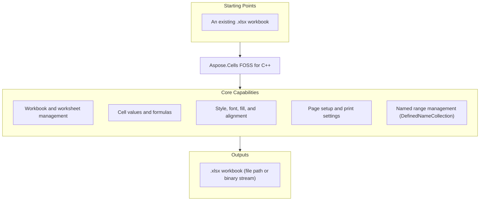

# Aspose.Cells FOSS for C++

[](https://www.nuget.org/packages/Aspose.Cells.Cpp.FOSS/) [](License/LICENSE.txt) [](CMakeLists.txt)

[](https://products.aspose.org/cells/cpp/)

Aspose.Cells FOSS for C++ is a free, open-source C++ library for creating, loading, editing,
and saving Excel `.xlsx` workbooks without requiring Microsoft Excel or any COM interop. It
exposes an Aspose.Cells-compatible native API that integrates directly into CMake-based build
systems with no external runtime dependencies.

## Navigation

- [At a Glance](#at-a-glance)
- [Key Capabilities](#key-capabilities)
- [Installation](#installation)
- [Quick Start](#quick-start)
- [API Reference](#api-reference)
- [Documentation & Resources](#documentation--resources)
- [Scope and Limitations](#scope-and-limitations)
- [Development and Testing](#development-and-testing)
- [License](#license)

## At a Glance



## Key Capabilities

- Create a new `Workbook` or load an existing `.xlsx` file from a file path or a binary buffer.
- Manage worksheets through `WorksheetCollection` (`Add`, `RemoveAt`, active-sheet state) and
  `Worksheet` (name, visibility, gridlines, zoom, right-to-left/RTL, tab color, and protection
  via `Protect()` / `Unprotect()`).
- Read and write cell values with `Cell.PutValue()` / `Cell.GetValue()`, and enter formulas with
  `Cell.SetFormula()`.
- Merge cell ranges and inspect existing merges via `Cells.Merge()` and `Cells.GetMergedCells()`.
- Apply cell styling through `Style`, `Font`, `Color`, and fill patterns, including borders,
  alignment, and number formats (`Style.SetNumberFormat()`, `DisplayTextFormatter`).
- Configure worksheet print and page setup settings via `PageSetup` (paper size, orientation,
  scale, fit-to-page).
- Manage named ranges through `Workbook.GetDefinedNames()` / `DefinedNameCollection`.
- Manage hyperlinks and enforce data-validation rules through `Worksheet.GetHyperlinks()` /
  `HyperlinkCollection` and `Worksheet.GetValidations()` / `ValidationCollection`, alongside the
  defined names and worksheet protection support described above.
- Save workbooks back to `.xlsx`, to a file path or a stream, via `Workbook.Save()`.

## Installation

This library publishes prebuilt binaries to NuGet as
[`Aspose.Cells.Cpp.FOSS`](https://www.nuget.org/packages/Aspose.Cells.Cpp.FOSS/) — but **Windows
only, MSVC v140+ toolset**. The package's own MSBuild integration explicitly rejects any other
toolset, and it ships no Linux/macOS binaries. If you're on Linux/macOS, or building with
MinGW/Clang on Windows, use "Build from source" below instead.

### Prebuilt Binaries via NuGet (Windows, MSVC Only)

```bash
nuget install Aspose.Cells.Cpp.FOSS -Version 26.4.1 -OutputDirectory packages
```

In a Visual Studio / MSBuild project, `Install-Package Aspose.Cells.Cpp.FOSS` (or the equivalent
`<PackageReference Include="Aspose.Cells.Cpp.FOSS" Version="26.4.1" />`) wires up include paths
and the correct `x86`/`x64` × `Debug`/`Release` `.lib` automatically via the package's own bundled
`.targets` file — no manual path configuration needed.

In a CMake project targeting MSVC, point at the package's own bundled CMake package config
instead (`aspose.cells.cpp.foss-config.cmake`, which defines an `Aspose.Cells.Cpp.FOSS` imported
target):

```cmake
set(aspose.cells.cpp.foss_DIR "path/to/packages/Aspose.Cells.Cpp.FOSS.26.4.1/build/native/Aspose.Cells.Cpp.FOSS")
find_package(aspose.cells.cpp.foss CONFIG REQUIRED)
target_link_libraries(your_target PRIVATE Aspose.Cells.Cpp.FOSS)
```

### Build From Source (All Platforms)

Build the bundled samples project:

```bash
cd samples
mkdir build
cd build
cmake ..
cmake --build .
```

This builds the `samples` project, which pulls in the `aspose_cells_foss` static library via
`add_subdirectory("../Aspose.Cells.Foss.Cpp")` in `samples/CMakeLists.txt`. To consume the
library directly in your own CMake project, add the `Aspose.Cells.Foss.Cpp` directory the same
way:

```cmake
add_subdirectory(path/to/Aspose.Cells.Foss.Cpp)
target_link_libraries(your_target PRIVATE aspose_cells_foss)
target_include_directories(your_target PRIVATE path/to/Aspose.Cells.Foss.Cpp/include)
```

Requires a C++17 compiler and CMake 3.16+ (`CMAKE_CXX_STANDARD 17` is set in
`Aspose.Cells.Foss.Cpp/CMakeLists.txt`).

## Quick Start

Create a workbook, populate cells with values and a formula, apply header styling, and save:

```cpp
#include "aspose/cells_foss/Workbook.h"
#include "aspose/cells_foss/WorksheetCollection.h"
#include "aspose/cells_foss/Worksheet.h"
#include "aspose/cells_foss/Cell.h"
#include "aspose/cells_foss/Style.h"
#include "aspose/cells_foss/Color.h"
#include "aspose/cells_foss/Font.h"

using namespace Aspose::Cells_FOSS;

int main() {
    Workbook workbook;
    Worksheet& sheet = workbook.GetWorksheets()[0];

    sheet.SetName("Products");
    sheet.GetCells()["A1"].PutValue("Product");
    sheet.GetCells()["B1"].PutValue("Price");
    sheet.GetCells()["A2"].PutValue("Apple");
    sheet.GetCells()["B2"].PutValue(2.99);
    sheet.GetCells()["A3"].PutValue("Orange");
    sheet.GetCells()["B3"].PutValue(1.99);
    sheet.GetCells()["B4"].SetFormula("=SUM(B2:B3)");

    Style headerStyle = sheet.GetCells()["A1"].GetStyle();
    Font font;
    font.SetBold(true);
    font.SetColor(Color::FromArgb(255, 255, 255, 255));
    headerStyle.SetFont(font);
    headerStyle.SetPattern(FillPattern::Solid);
    headerStyle.SetForegroundColor(Color::FromArgb(255, 34, 120, 212));
    sheet.GetCells()["A1"].SetStyle(headerStyle);
    sheet.GetCells()["B1"].SetStyle(headerStyle);

    workbook.Save("products.xlsx");
    return 0;
}
```

A workbook can also be loaded from an existing file path or from an in-memory byte buffer:

```cpp
Workbook fromFile(path.string());
Workbook fromStream(bytes);
```

## API Reference

The primary entry point is `Workbook`, which owns a `WorksheetCollection` of `Worksheet` objects.
Each `Worksheet` exposes its cells through `Worksheet.GetCells()`, returning a `Cells` accessor
used for individual `Cell` access, row/column collections, and merged ranges.

<details>
<summary>View the Core API Surface</summary>

### Core API

| Class | Description |
|---|---|
| `AlignmentValue` | Represents alignment value. |
| `AutoFilter` | Represents auto filter. |
| `AutoFilterColorFilter` | Represents auto filter color filter. |
| `AutoFilterColorFilterModel` | Represents auto filter color filter model. |
| `AutoFilterCustomFilter` | Represents auto filter custom filter. |
| `AutoFilterCustomFilterCollection` | Represents a collection of auto filter custom filter objects. |
| `AutoFilterCustomFilterCollection_Iterator` | Forward iterator over an `AutoFilterCustomFilterCollection`. |
| `AutoFilterCustomFilterModel` | Represents auto filter custom filter model. |
| `AutoFilterDynamicFilter` | Represents auto filter dynamic filter. |
| `AutoFilterDynamicFilterModel` | Represents auto filter dynamic filter model. |
| `AutoFilterModel` | Represents auto filter model. |
| `AutoFilterSortCondition` | Represents auto filter sort condition. |
| `AutoFilterSortConditionCollection` | Represents a collection of auto filter sort condition objects. |
| `AutoFilterSortConditionCollection_Iterator` | Forward iterator over an `AutoFilterSortConditionCollection`. |
| `AutoFilterSortConditionModel` | Represents auto filter sort condition model. |
| `AutoFilterSortState` | Represents auto filter sort state. |
| `AutoFilterSortStateModel` | Represents auto filter sort state model. |
| `AutoFilterSupport` | Internal helper methods for auto-filter operations. |
| `AutoFilterTop10` | Represents auto filter top10. |
| `AutoFilterTop10Model` | Represents auto filter top10 model. |
| `BitReader` | Internal bit-level reader used by the minimal DEFLATE (RFC 1951) decompressor. |
| `Border` | Represents border. |
| `BorderSideValue` | Represents border side value. |
| `Borders` | Represents borders. |
| `BordersValue` | Represents borders value. |
| `CalculationProperties` | Represents calculation properties. |
| `CalculationPropertiesModel` | Represents calculation properties model. |
| `Cell` | Represents a single worksheet cell and exposes value, formula, and style operations. |
| `CellAddress` | Represents cell address. |
| `CellArea` | Represents cell area. |
| `CellFormatValue` | Represents cell format value. |
| `CellRecord` | Represents cell record. |
| `CellValue` | A tagged-union cell value holding an integer, double, bool, string, or `DateTime`, with `Is*`/`As*` accessors. |
| `Cells` | Provides access to worksheet cells, rows, columns, and merged ranges. |
| `CellsException` | Represents an error that occurs during cells. |
| `Column` | Represents column. |
| `ColumnCollection` | Represents a collection of column objects. |
| `ColumnRangeModel` | Represents column range model. |
| `ConditionalFormattingCollection` | Represents a collection of conditional formatting objects. |
| `ConditionalFormattingModel` | Represents conditional formatting model. |
| `CoreDocumentProperties` | Represents core document properties. |
| `CoreDocumentPropertiesModel` | Represents core document properties model. |
| `DateSerialConverter` | Provides date serial converter operations. |
| `DateTime` | A lightweight, tick-based date/time value with calendar accessors and comparison operators. |
| `DefinedName` | Represents defined name. |
| `DefinedNameCollection` | Represents a collection of defined name objects. |
| `DefinedNameModel` | Represents defined name model. |
| `DefinedNameUtility` | Provides normalization and validation helpers for defined names. |
| `DiagnosticBag` | Represents diagnostic bag. |
| `DiagnosticEntry` | Represents diagnostic entry. |
| `DisplayFormatSectionInfo` | Represents display format section info. |
| `DisplayTextDateFormatSupport` | Internal helper methods for formatting date/time display text. |
| `DisplayTextFormatter` | Internal static helper for formatting display text of cell values. |
| `DisplayTextFormatterSupport` | Internal helper methods for display-text formatting of numeric, text, and date/time values. |
| `DisplayTextLocaleSupport` | Internal helper for parsing and applying locale directives (e.g. `[$-0409]`, `[$-F800]`) embedded in Excel format strings. |
| `DocumentProperties` | Represents document properties. |
| `DocumentPropertiesModel` | Represents document properties model. |
| `ExtendedDocumentProperties` | Represents extended document properties. |
| `ExtendedDocumentPropertiesModel` | Represents extended document properties model. |
| `FillValue` | Represents fill value. |
| `FilterColumn` | Represents filter column. |
| `FilterColumnCollection` | Represents a collection of filter column objects. |
| `FilterColumnCollection_Iterator` | Forward iterator over a `FilterColumnCollection`. |
| `FilterColumnModel` | Represents filter column model. |
| `FilterValueCollection` | Represents a collection of filter value objects. |
| `Font` | Represents font. |
| `FontValue` | Represents font value. |
| `FormatCondition` | Represents format condition. |
| `FormatConditionCollection` | Represents a collection of format condition objects. |
| `FormatConditionModel` | Represents format condition model. |
| `FormulaException` | Represents an error that occurs during formula. |
| `HeaderFooterModel` | Represents header footer model. |
| `Hyperlink` | Represents hyperlink. |
| `HyperlinkCollection` | Encapsulates the hyperlinks defined for a worksheet. |
| `HyperlinkModel` | Represents hyperlink model. |
| `InvalidFileFormatException` | Represents an error that occurs during invalid file format. |
| `LoadDiagnostics` | Represents load diagnostics. |
| `LoadIssue` | Represents load issue. |
| `LoadOptions` | Specifies how a workbook should be loaded. |
| `MergeRegion` | Represents merge region. |
| `MissingPartException` | Represents an error that occurs during missing part. |
| `NumberFormat` | Provides number format operations. |
| `NumberFormatValue` | Represents number format value. |
| `PackageLoadContext` | Represents package load context. |
| `PackageModel` | Represents package model. |
| `PackagePartDescriptor` | Represents package part descriptor. |
| `PackageStructureException` | Represents an error that occurs during package structure. |
| `PackagingConventions` | Provides packaging conventions operations. |
| `PageMarginsModel` | Represents page margins model. |
| `PageSetup` | Represents worksheet print and page-layout settings. |
| `PageSetupModel` | Represents page setup model. |
| `PrintOptionsModel` | Represents print options model. |
| `ProtectionValue` | Represents protection value. |
| `RelationshipDescriptor` | Represents relationship descriptor. |
| `RelationshipResolutionException` | Represents an error that occurs during relationship resolution. |
| `Row` | Represents row. |
| `RowCollection` | Represents a collection of row objects. |
| `RowModel` | Represents row model. |
| `SaveOptions` | Specifies how a workbook should be saved. |
| `SharedStringRepository` | Represents shared string repository. |
| `SharedStringTableXmlMapper` | Represents shared string table XML mapper. |
| `Style` | Represents a mutable cell style facade that can be applied to one or more cells. |
| `StyleException` | Represents an error that occurs during style. |
| `StyleRepository` | Represents style repository. |
| `StyleValue` | Represents style value. |
| `StyleValueSanitizer` | Provides normalization helpers for style integer values. |
| `StylesheetLoadContext` | Internal context used during stylesheet loading to accumulate cell formats, differential formats, date style indexes, and the default cell style. |
| `StylesheetSaveContext` | Internal context used during stylesheet saving to hold the built stylesheet document together with style index maps and format counts. |
| `StylesheetXmlMapper` | Represents stylesheet XML mapper. |
| `UnsupportedFeatureException` | Represents an error that occurs during unsupported feature. |
| `Validation` | Represents validation. |
| `ValidationCollection` | Represents a collection of validation objects. |
| `ValidationMessage` | Represents validation message. |
| `ValidationModel` | Represents validation model. |
| `WarningInfo` | Represents warning info. |
| `Workbook` | Represents the root spreadsheet object used to create, load, modify, and save an XLSX workbook. |
| `WorkbookLoadException` | Represents an error that occurs during workbook load. |
| `WorkbookModel` | Represents workbook model. |
| `WorkbookProperties` | Represents workbook properties. |
| `WorkbookPropertiesModel` | Represents workbook properties model. |
| `WorkbookPropertySupport` | Internal helpers that normalize workbook-level property strings to their canonical XML attribute values, throwing CellsException on unsupported input. |
| `WorkbookProtection` | Represents workbook protection. |
| `WorkbookProtectionModel` | Represents workbook protection model. |
| `WorkbookSaveException` | Represents an error that occurs during workbook save. |
| `WorkbookSettings` | Represents workbook-level settings that affect date handling and display formatting. |
| `WorkbookSettingsModel` | Represents workbook settings model. |
| `WorkbookValidator` | Represents workbook validator. |
| `WorkbookView` | Represents workbook view. |
| `WorkbookViewModel` | Represents workbook view model. |
| `WorkbookXmlMapper` | Represents workbook XML mapper. |
| `Worksheet` | Encapsulates a single worksheet and its supported v0.1 worksheet features. |
| `WorksheetCollection` | Encapsulates the workbook's worksheets and active-sheet state. |
| `WorksheetDefinedNamesState` | Stores the defined names state for a worksheet (print area, title rows, title columns). |
| `WorksheetModel` | Represents worksheet model. |
| `WorksheetProtection` | Represents worksheet protection. |
| `WorksheetProtectionModel` | Represents worksheet protection model. |
| `WorksheetViewModel` | Represents worksheet view model. |
| `WorksheetXmlMapper` | Represents worksheet XML mapper. |
| `XNamespace` | Represents an XML namespace, used to construct qualified element names. |
| `XlsxDocumentProperties` | Provides static methods for building and loading XLSX document properties (core and extended) from/to a ZIP archive. |
| `XlsxWorkbookArchiveHelpers` | Internal helper methods for reading XLSX workbook parts from a ZIP archive. |
| `XlsxWorkbookAutoFilter` | Provides static methods for building and loading auto-filter XML elements. |
| `XlsxWorkbookConditionalFormatting` | Provides static methods for building and loading conditional formatting XML elements. |
| `XlsxWorkbookDefinedNames` | Provides static methods for building and loading workbook-level defined names. |
| `XlsxWorkbookHyperlinks` | Provides static methods for building and loading worksheet hyperlink data. |
| `XlsxWorkbookPageSetup` | Provides static methods for building and loading page-setup XML elements. |
| `XlsxWorkbookProperties` | Provides static methods for building and loading workbook-level metadata. |
| `XlsxWorkbookSerializer` | Serializes and deserializes workbook models in XLSX format. |
| `XlsxWorkbookSerializerCommon` | Constants and helpers shared across the XLSX workbook serializer. |
| `XlsxWorkbookStyles` | Provides static methods for building and loading workbook stylesheets. |
| `XlsxWorkbookStylesValueHelpers` | Provides helper methods for workbook style value conversions and comparisons. |
| `XlsxWorkbookStylesXml` | Provides XML read/write methods for the workbook styles part. |
| `XlsxWorkbookValidations` | Provides static methods for building and loading worksheet data validation elements in the XLSX workbook serializer. |
| `XlsxWorkbookWorksheetProtection` | Provides static methods for building and loading worksheet-protection XML elements. |
| `XlsxWorkbookWorksheetViews` | Provides static methods for building and loading worksheet view settings (sheet properties, sheet views) in the XLSX workbook serializer. |
| `XmlAttribute` | Lightweight handle to an XML attribute. |
| `XmlDocument` | Represents a parsed XML document. |
| `XmlElement` | Lightweight handle to an XML element. |
| `XmlParser` | Internal recursive-descent XML parser that builds an `XmlNodeData` document tree. |
| `XmlParsingException` | Represents an error that occurs during XML parsing. |
| `ZipArchive` | In-memory representation of a ZIP archive, used to read and write the XLSX package's constituent parts. |
| `ZipArchiveEntry` | Represents an entry in a ZipArchive. |

#### Structs

| Struct | Description |
|---|---|
| `CaseInsensitiveEqual` | Case-insensitive string equality comparator used as a hash-map key comparator. |
| `CaseInsensitiveHash` | Case-insensitive string hash functor, paired with `CaseInsensitiveEqual` for case-insensitive lookups. |
| `Color` | Represents color. |
| `ColorValue` | Represents color value. |
| `HuffmanTable` | Canonical Huffman decoding lookup table used by the internal DEFLATE decompressor. |
| `ParsedNumericFormat` | Internal parsed representation of a .NET-style numeric format pattern (percent, scientific, integer, and fraction digit placeholders). |
| `Workbook_Impl` | `Workbook`'s private implementation struct (pimpl) holding its internal state. |
| `XmlNodeData` | Internal node representation shared between XML types. |

#### Enumerations

| Enumeration | Description |
|---|---|
| `BorderStyle` | Specifies border style. |
| `BorderStyleType` | Specifies border style type. |
| `CellValueKind` | Specifies cell value kind. |
| `CellValueType` | Specifies cell value type. |
| `DateSystem` | Specifies date system. |
| `DiagnosticSeverity-Aspose_Cells_FOSS` | Specifies diagnostic severity for `Aspose::Cells_FOSS` public-API diagnostics (Warning, Recoverable, LossyRecoverable, Fatal). |
| `DiagnosticSeverity-Aspose_Cells_FOSS_Core` | Specifies diagnostic severity for `Aspose::Cells_FOSS::Core`'s internal engine diagnostics (same four levels, a distinct enum in the core layer). |
| `FillPattern` | Specifies fill pattern. |
| `FillPatternKind` | Specifies fill pattern kind. |
| `FilterOperatorType` | Specifies filter operator type. |
| `FormatConditionType` | Specifies format condition type. |
| `HorizontalAlignment` | Specifies horizontal alignment. |
| `HorizontalAlignmentType` | Specifies horizontal alignment type. |
| `LoadFormat` | Specifies load format. |
| `OperatorType` | Specifies operator type. |
| `PageOrientation` | Specifies page orientation. |
| `PageOrientationType` | Specifies page orientation type. |
| `PaperSizeType` | Specifies paper size type. |
| `SaveFormat` | Specifies save format. |
| `SheetVisibility` | Specifies sheet visibility. |
| `TargetModeType` | Specifies target mode type. |
| `ValidationAlertType` | Specifies validation alert type. |
| `ValidationMessageSeverity` | Specifies validation message severity. |
| `ValidationType` | Specifies validation type. |
| `VerticalAlignment` | Specifies vertical alignment. |
| `VerticalAlignmentType` | Specifies vertical alignment type. |
| `VisibilityType` | Specifies visibility type. |

---

#### Detailed Member Reference

### Workbook and Worksheets

- `Workbook`
  - `GetWorksheets() -> WorksheetCollection`
  - `GetSettings() -> WorkbookSettings`
  - `GetProperties() -> WorkbookProperties`
  - `GetDocumentProperties() -> DocumentProperties`
  - `GetDefinedNames() -> DefinedNameCollection`
  - `GetLoadDiagnostics() -> LoadDiagnostics`
  - `Save(fileName)` / `Save(fileName, format)` / `Save(fileName, options)`
  - `Save(stream, format)` / `Save(stream, options)`
- `WorksheetCollection`
  - `GetCount() -> int`
  - `GetActiveSheetIndex() -> int` / `SetActiveSheetIndex(value)`
  - `Add() -> int` / `Add(sheetName) -> int`
  - `RemoveAt(index)` / `RemoveAt(sheetName)`
  - iteration via `begin()` / `end()`
- `Worksheet`
  - `GetName() -> std::string` / `SetName(value)`
  - `GetVisibilityType()` / `SetVisibilityType(value)`
  - `GetTabColor()` / `SetTabColor(value)`
  - `GetShowGridlines()`, `GetShowRowColumnHeaders()`, `GetShowZeros()`, `GetRightToLeft()`, `GetZoom()`
  - `GetCells() -> Cells`
  - `GetHyperlinks() -> HyperlinkCollection`
  - `GetValidations() -> ValidationCollection`
  - `GetConditionalFormattings() -> ConditionalFormattingCollection`
  - `GetPageSetup() -> PageSetup`
  - `GetProtection() -> WorksheetProtection`
  - `GetAutoFilter() -> AutoFilter`
  - `Protect()` / `Unprotect()`

### Cells, Values, and Formulas

- `Cells`
  - `GetRows() -> RowCollection`
  - `GetColumns() -> ColumnCollection`
  - `GetMergedCells() -> std::vector<CellArea>`
  - `Merge(firstRow, firstColumn, totalRows, totalColumns)`
- `Cell`
  - `GetValue() -> CellValue` / `SetValue(value)`
  - `GetStringValue()`, `GetDisplayStringValue()`
  - `GetFormula() -> std::string` / `SetFormula(value)`
  - `GetType() -> CellValueType`
  - `PutValue(value)` (overloaded for common value types)
  - `GetStyle() -> Style` / `SetStyle(style)`

### Styling

- `Style`
  - `GetFont() -> Font` / `SetFont(value)`
  - `GetBorders() -> Borders` / `SetBorders(value)`
  - `GetPattern() -> FillPattern` / `SetPattern(value)`
  - `GetForegroundColor()` / `SetForegroundColor(value)`
  - `GetBackgroundColor()` / `SetBackgroundColor(value)`
  - `GetNumberFormat() -> std::string` / `SetNumberFormat(value)`
  - `GetHorizontalAlignment()` / `SetHorizontalAlignment(value)`
- `Font`
  - `GetName()` / `SetName(value)`
  - `GetSize()` / `SetSize(value)`
  - `GetBold()` / `SetBold(value)`
  - `GetItalic()` / `SetItalic(value)`
  - `GetUnderline()` / `SetUnderline(value)`
- `Color`
  - `FromArgb(a, r, g, b) -> Color`
  - `GetA()`, `GetR()`, `GetG()`, `GetB()`
  - `Empty() -> Color`
- `PageSetup`
  - `GetPaperSize()` / `SetPaperSize(value)`
  - `GetOrientation()` / `SetOrientation(value)`
  - `GetScale()`, `GetFitToPagesWide()`, `GetFitToPagesTall()`

### Load and Save Options

- `LoadOptions`
  - `GetLoadFormat() -> LoadFormat` / `SetLoadFormat(value)`
  - `GetStrictMode()`, `GetTryRepairPackage()`, `GetTryRepairXml()`, `GetPreserveUnsupportedParts()`
  - `GetWarningCallback() -> std::shared_ptr<IWarningCallback>`
- `SaveOptions`
  - `GetSaveFormat() -> SaveFormat` / `SetSaveFormat(value)`
  - `GetUseSharedStrings()`, `GetValidateBeforeSave()`, `GetCompactStyles()`, `GetPreserveRecoveryMetadata()`

### Enums

- `LoadFormat`: `Auto`, `Xlsx`
- `SaveFormat`: `Xlsx`
- `CellValueType`: `Blank`, `String`, `Number`, ...
- `FillPattern`: `None`, `Solid`, `MediumGray`, ...
- `HorizontalAlignmentType`: `General`, `Left`, `Center`, ...

### Exceptions

- `WorkbookLoadException`
- `WorkbookSaveException`
- `CellsException`
- `FormulaException`
- `StyleException`

</details>

## Documentation & Resources

- **[Getting started guide](https://docs.aspose.org/cells/cpp/)** — installation, walkthroughs, and feature guides for this library.
- **[How-to guides & FAQ](https://kb.aspose.org/cells/cpp/)** — task-focused answers for common spreadsheet-processing questions.
- **[Full API reference](https://reference.aspose.org/cells/cpp/)** — the complete, browsable reference for the public API surface (the [API reference](#api-reference) section above covers the essentials).
- **[Contributor guide](AGENTS.md)** — architecture notes and conventions for contributors.
- Found a bug or have a feature request? [Open an issue](https://github.com/aspose-cells-foss/Aspose.Cells-FOSS-for-Cpp/issues) on GitHub.

## Scope and Limitations

- This release focuses on `.xlsx` load and save; both directions are supported for the XLSX
  format only (`LoadFormat`/`SaveFormat` currently expose only `Xlsx`).

These limitations don't apply to
[Aspose.Cells for C++ — Enterprise Edition](https://products.aspose.com/cells/cpp/), which
adds broader format coverage, full feature completeness, and commercial support.

## Development and Testing

The library ships two test setups. A minimal smoke test lives alongside the library itself and
runs via the library's own `CMakeLists.txt` (`enable_testing()` + `add_subdirectory(tests)`
building the `porter_smoke` executable). The full test suite lives in
`Aspose.Cells.Foss.Cpp.Tests`, which fetches GoogleTest via CMake `FetchContent` (or uses an
installed GTest with `-DASPOSE_CELLS_FOSS_TESTS_USE_SYSTEM_GTEST=ON`):

```bash
cd Aspose.Cells.Foss.Cpp.Tests
mkdir build
cd build
cmake ..
cmake --build .
ctest -C Debug
```

See [`Aspose.Cells.Foss.Cpp.Tests/README.md`](Aspose.Cells.Foss.Cpp.Tests/README.md) for more on
the full test suite.

## License

This project is licensed under the [MIT License](License/LICENSE.txt). The MIT License permits
use, copying, modification, distribution, sublicensing, and commercial use, provided its
copyright and permission notice are retained. The software is provided without warranty.
