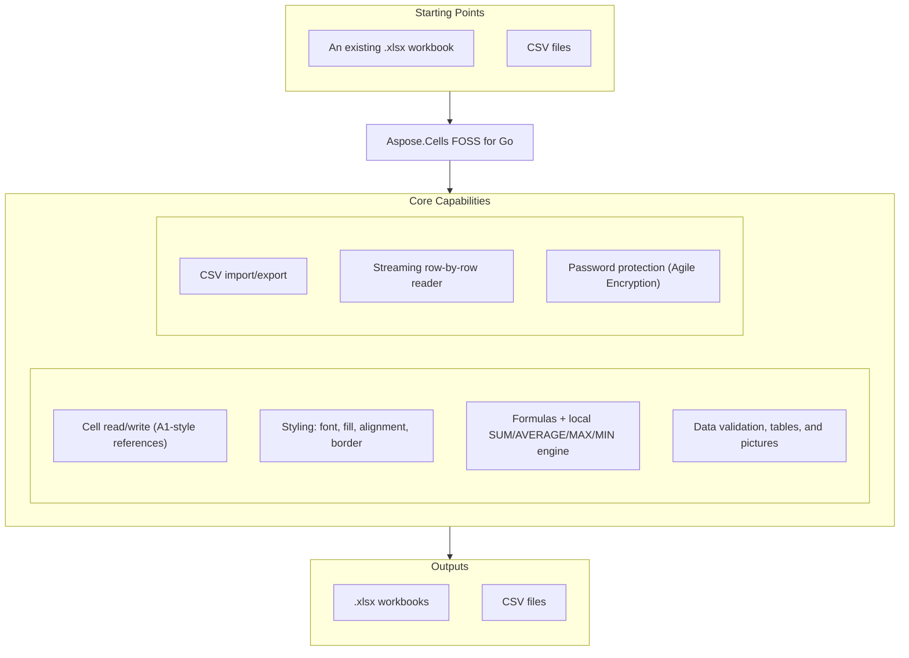

# Aspose.Cells FOSS for Go

[](https://pkg.go.dev/github.com/aspose-cells-foss/Aspose.Cells-FOSS-for-Go/v26) [](https://go.dev/dl/) [](LICENSE) [](https://github.com/aspose-cells-foss/Aspose.Cells-FOSS-for-Go/graphs/contributors)

[](https://products.aspose.org/cells/go/)

Aspose.Cells FOSS for Go is a free, open-source, pure-Go library for creating,
reading, and modifying Excel `.xlsx` spreadsheets (ECMA-376 Office Open XML). It exposes a compact API built
around `Workbook`, `Worksheet`, `Cells`, and `Cell`, with support for styling,
formulas, data validation, structured tables, picture embedding, CSV interop, and
row-by-row streaming for large files — all without a Microsoft Office dependency.

## Navigation

- [At a Glance](#at-a-glance)
- [Key Capabilities](#key-capabilities)
- [Installation](#installation)
- [Quick Start](#quick-start)
- [Additional Examples](#additional-examples)
- [API Reference](#api-reference)
- [Documentation & Resources](#documentation--resources)
- [Scope and Limitations](#scope-and-limitations)
- [Development and Testing](#development-and-testing)
- [License](#license)

## At a Glance



## Key Capabilities

- Create, load, and save `.xlsx` workbooks with `Workbook`/`Worksheet`, addressing cells through A1-style references via `Cells().Get`/`Set`/`Remove`, with cell values stored as `string`, `float64`, `int`, or `bool`.
- Group formatting into reusable `Style` objects built from `Font` (name, size, bold, italic, color), `Fill`, `Alignment` (horizontal, vertical, wrap text), and `Border` — identical styles are automatically deduplicated when the workbook is saved.
- Write Excel formulas with `Cell.SetFormula`/`GetFormula` — stored in the cell and evaluated by Excel/LibreOffice on open — and evaluate `SUM`/`AVERAGE`/`MAX`/`MIN` locally with the built-in `CalculateFormula` engine.
- Attach `DataValidation` rules (dropdown lists, whole-number, or decimal-number ranges) with a custom error title, message, and error style.
- Build structured `Table` ranges with an optional header row — which also adds Excel auto-filters — and a named table style via `Worksheet.AddTable`/`GetTable`.
- Embed `Picture` images (PNG/JPEG) with `SetAnchor(row, col)` positioning.
- Import and export CSV with configurable delimiters via `Workbook.ImportFromCSV`/`ExportToCSV` and `Worksheet.FromCSV`/`ToCSV`.
- Perform row-by-row streaming processing of large workbooks via `StreamingReader.ProcessRows`, with peak memory proportional to a row's width rather than the file's size — suitable for files with hundreds of thousands of rows without loading the entire sheet into memory.
- Protect and verify workbook passwords with `Workbook.SetPassword`/`VerifyPassword` (ECMA-376 Agile Encryption: SHA-512 + AES-256-CBC).
- Zero third-party runtime dependencies — built entirely on the Go standard library.

## Installation

```bash
go get github.com/aspose-cells-foss/Aspose.Cells-FOSS-for-Go/v26@v26.7.1
```

Requires Go 1.24.5 or later (per `go.mod`). The module path carries a `/v26`
major-version suffix, so the import matches the `go get` target:

```go
import cells_foss "github.com/aspose-cells-foss/Aspose.Cells-FOSS-for-Go/v26/aspose/cells_foss"
```

## Quick Start

```go
package main

import cells_foss "github.com/aspose-cells-foss/Aspose.Cells-FOSS-for-Go/v26/aspose/cells_foss"

func main() {
    // Create.
    wb := cells_foss.NewWorkbook()
    ws := wb.Worksheets[0]

    // Write.
    ws.Cells().Set("A1", "Hello, World!")
    ws.Cells().Set("B1", 42)

    // Save.
    wb.Save("hello.xlsx")
}
```

Run: `go run main.go` → produces `hello.xlsx`

## Additional Examples

Runnable example programs are available under [`examples/`](examples/) in the
source repository. The most common operations are collected below.

### Open and Modify an Existing File

```go
wb, _ := cells_foss.LoadWorkbook("input.xlsx")
ws := wb.Worksheets[0]

cell, _ := ws.Cells().Get("A1")
fmt.Println("Current value:", cell.Value)

ws.Cells().Set("A1", "Updated value")
wb.Save("output.xlsx")
```

<details>
<summary>View Additional Examples</summary>

### Add Styles to a Report

```go
header := cells_foss.NewStyle()
header.Font.Bold = true
header.Font.Size = 14

cell, _ := ws.Cells().Get("A1")
cell.SetStyle(header)
```

### Use Formulas

```go
ws.Cells().Set("A1", float64(100))
ws.Cells().Set("A2", float64(200))

ws.Cells().Set("A3", nil)
cell, _ := ws.Cells().Get("A3")
cell.SetFormula("SUM(A1:A2)")

result, _ := cells_foss.CalculateFormula("SUM(A1:A2)", ws)
fmt.Println("Result:", result) // 300
```

### Process Large Files (Streaming)

```go
sr := cells_foss.NewStreamingReader("huge.xlsx")
sr.ProcessRows("Sheet1", func(rowIdx int, cells map[string]string) error {
    fmt.Printf("Row %d: %v\n", rowIdx, cells)
    return nil
})
```

### Data Validation (Dropdown + Numeric Range)

```go
func main() {
	wb := cells_foss.NewWorkbook()
	ws := wb.Worksheets[0]

	// Set up header and data cells.
	ws.Cells().Set("A1", "Fruit")
	ws.Cells().Set("A2", "Apple")
	ws.Cells().Set("A3", "Banana")

	// Create a list-type data validation.
	dv := &cells_foss.DataValidation{
		Type:             cells_foss.DataValidationTypeList,
		Formula1:         `"Apple,Banana,Cherry,Dragonfruit"`,
		AllowBlank:       true,
		ShowErrorMessage: true,
		ErrorTitle:       "Invalid Fruit",
		ErrorMessage:     "Please pick a fruit from the list.",
		ErrorStyle:       cells_foss.ErrorStyleStop,
	}

	if err := ws.AddDataValidation("A2:A10", dv); err != nil {
		fmt.Printf("Error: %v\n", err)
		return
	}
	fmt.Printf("Added %q validation on A2:A10\n", dv.Type)

	// Add a second validation — whole number range.
	dv2 := &cells_foss.DataValidation{
		Type:             cells_foss.DataValidationTypeWhole,
		Formula1:         "1",
		Formula2:         "100",
		ShowErrorMessage: true,
		ErrorTitle:       "Invalid Value",
		ErrorMessage:     "Enter a whole number between 1 and 100.",
		ErrorStyle:       cells_foss.ErrorStyleWarning,
	}
	ws.Cells().Set("B1", "Score (1-100)")
	ws.AddDataValidation("B2:B10", dv2)
	fmt.Println("Added whole-number validation on B2:B10 (1-100)")

	// Save writes to a relative path but never creates missing directories,
	// so create the output directory before saving into it.
	os.MkdirAll("outputfiles", 0755)
	wb.Save("outputfiles/data_validation.xlsx")
}
```

### Structured Tables

```go
// Populate a sales table (headers + rows) first, then:
lastRow := len(products) + 1
rangeRef := fmt.Sprintf("A1:F%d", lastRow)
tbl := ws.AddTable(rangeRef)
tbl.HasHeaderRow = true
tbl.StyleName = "TableStyleMedium6"

fmt.Printf("Created table %q covering %s\n", tbl.Name, tbl.Range)

// Save never creates missing directories, so create the output
// directory before saving into it.
os.MkdirAll("outputfiles", 0755)
wb.Save("outputfiles/table.xlsx")
```

### Embed a Picture

```go
pic := cells_foss.NewPicture(imageBytes, "png")
pic.Width = 100
pic.Height = 80
pic.SetAnchor(5, 1) // position at row 5, column B

if err := ws.AddPicture(pic); err != nil {
    fmt.Printf("Error adding picture: %v\n", err)
    return
}

// Save never creates missing directories, so create the output
// directory before saving into it.
os.MkdirAll("outputfiles", 0755)
wb.Save("outputfiles/picture.xlsx")
```

</details>

## API Reference

The library exposes 14 public types under `aspose/cells_foss`, centered on
`Workbook`/`Worksheet`/`Cells`/`Cell`.

<details>
<summary>View the Supported Public API Surface</summary>

### Cells Foss

| Class | Description |
|---|---|
| `Alignment` | Alignment controls how cell content is positioned within the cell bounds. |
| `Border` | Border defines which sides of a cell have a visible rule and the colour of those rules. |
| `Cell` | Cell represents a single cell in a worksheet grid. |
| `Cells` | Cells is a collection of Cell values indexed by A1-style string references (e.g. `"A1"`, `"B2"`, `"Z100"`). It is the primary API for reading and writing cell data within a worksheet. |
| `DataValidation` | DataValidation represents a single data-validation rule applied to a range of cells on a worksheet. |
| `Fill` | Fill describes the background appearance of a cell. |
| `Font` | Font describes the typographic properties applied to cell text. |
| `Picture` | Picture represents an image embedded in a worksheet. |
| `RowCallback` | RowCallback is invoked by StreamingReader.ProcessRows once for every row in the worksheet. |
| `StreamingReader` | StreamingReader reads an .xlsx workbook row by row without loading the entire sheet XML into memory. |
| `Style` | Style groups font, fill, alignment, and border settings into a named formatting record. |
| `Table` | Table represents a structured range of data (a "table" in Excel terminology) with optional header row and built-in auto-filter. |
| `Workbook` | Workbook is the top-level object representing an Excel workbook. |
| `Worksheet` | Worksheet represents a single sheet within a workbook. |

---

#### Detailed Member Reference

### Workbook and Worksheets

- `Workbook`
  - `Worksheets: []*Worksheet`
  - `SourceXML`, `StylesXML: []byte`
  - `Modified: bool`
  - `FilePath: string`
  - `ExportToCSV(sheetIndex, path, delimiter) -> error`
  - `ImportFromCSV(path, sheetName, delimiter) -> error`
  - `SetPassword(password) -> error`
  - `VerifyPassword(pw) -> bool`
  - `Save(path) -> error`
  - Constructors/loaders: `NewWorkbook()`, `Load(path)`, `LoadWorkbook(path)`, `LoadWithPassword(path, password)`
- `Worksheet`
  - `Name: string`
  - `Index: int`
  - `DataValidations: []*DataValidation`
  - `Tables: []*Table`
  - `Pictures: []*Picture`
  - `Cells() -> *Cells`
  - `ToCSV(delimiter) -> ([][]string, error)`
  - `FromCSV(data, delimiter) -> error`
  - `AddDataValidation(ref, dv) -> error`
  - `RemoveDataValidation(ref) -> error`
  - `AddPicture(pic) -> error`
  - `AddTable(rangeRef) -> *Table`
  - `GetTable(name) -> *Table`

### Cells

- `Cells` — collection of `Cell` values indexed by A1-style string references
  - `Get(ref) -> (*Cell, error)`
  - `Set(ref, value) -> error`
  - `Remove(ref) -> error`
  - `All() -> map[string]*Cell`
- `Cell`
  - `Value: any` (via `XMLName`/`Ref`/`StyleID`/`Value`/`Formula` XML fields)
  - `SetStyle(style) -> error`
  - `GetStyle() -> *Style`
  - `SetFormula(formula)`
  - `GetFormula() -> string`
- `CalculateFormula(formula, worksheet) -> (any, error)` — evaluates `SUM`/`AVERAGE`/`MAX`/`MIN`

### Styling

- `Style` — `Font: *Font`, `Fill: *Fill`, `Alignment: *Alignment`, `Border: *Border`
- `Font` — `Name: string`, `Size: float64`, `Bold: bool`, `Italic: bool`, `Color: string`
- `Fill` — `Type: string`, `Color: string`
- `Alignment` — `Horizontal: string`, `Vertical: string`, `WrapText: bool`
- `Border` — `Top/Bottom/Left/Right: bool`, `Color: string`

### Data, Tables, and Pictures

- `DataValidation` — `Type`, `Ref`, `Formula1`, `Formula2`, `AllowBlank`, `ShowErrorMessage`, `ErrorTitle`, `ErrorMessage`, `ErrorStyle`
- `Table` — `Name: string`, `Range: string`, `HasHeaderRow: bool`, `StyleName: string`
- `Picture` — `Data: []byte`, `Format: string`, `Row`/`Col: int`, `RowOff`/`ColOff: int64`, `Width`/`Height: int`, `Name: string`
  - `SetAnchor(row, col)`

### Streaming

- `StreamingReader` — reads an `.xlsx` workbook row by row without loading the whole sheet
  - `ProcessRows(sheetName, callback) -> error`
- `RowCallback` — invoked once per row by `StreamingReader.ProcessRows`

</details>

## Documentation & Resources

- **[Getting started guide](https://docs.aspose.org/cells/go/)** — installation, walkthroughs, and feature guides for this library.
- **[How-to guides & FAQ](https://kb.aspose.org/cells/go/)** — task-focused answers for common spreadsheet-processing questions.
- **[Full API reference](https://reference.aspose.org/cells/go/)** — the complete, browsable reference for all 14 public types (the [API reference](#api-reference) section above covers the essentials).
- **[In-repo usage guide](docs/usage.md)** — a detailed usage guide bundled in this repository, covering Workbook/Cell/Styles/Formulas/Data Validation/Tables/Pictures/CSV/Streaming/Encryption/API Reference.
- **[Contributor guide](AGENTS.md)** — architecture notes and conventions for contributors.
- Found a bug or have a feature request? [Open an issue](https://github.com/aspose-cells-foss/Aspose.Cells-FOSS-for-Go/issues) on GitHub.

## Scope and Limitations

- Targets the core `.xlsx` workflow: cell read/write, styling, formulas, data validation,
  tables, picture embedding, CSV interop, and streaming reads.
- Cell addressing is A1-style only (e.g. `"A1"`, `"B2"`) — tuple or array indices are not
  supported.
- `Cell.SetFormula`/`GetFormula` store a formula string in the cell for Excel/LibreOffice to
  evaluate on open; the library's own `CalculateFormula` engine evaluates only `SUM`,
  `AVERAGE`, `MAX`, and `MIN` locally.
- On save, unmodified XML parts are reused verbatim and only modified content is regenerated,
  preserving ECMA-376-compatible element ordering.

These limitations don't apply to
[Aspose.Cells for Go — Enterprise Edition](https://products.aspose.com/cells/go-cpp/),
which adds broader spreadsheet feature coverage, full formula evaluation, and dedicated
enterprise support.

## Development and Testing

```bash
# All tests (integration tests)
go test ./...

# Integration tests only (public API)
go test ./tests/ -v
```

Run the example programs:

```bash
cd examples
for d in */; do go run ./$d; done
```

If the example-runner loop above fails on a fresh checkout, edit `examples/go.mod`'s version to
a major-versioned pseudo-version before running — see
[upstream-issues.md](upstream-issues.md) for details.

The example programs write their output into `outputfiles/`; generated `.xlsx` files and the
`outputfiles/` directory itself should not be committed.

## License

This project is licensed under the [MIT License](LICENSE). The MIT License
permits use, copying, modification, distribution, sublicensing, and commercial
use, provided its copyright and permission notice are retained. The software is
provided without warranty.
