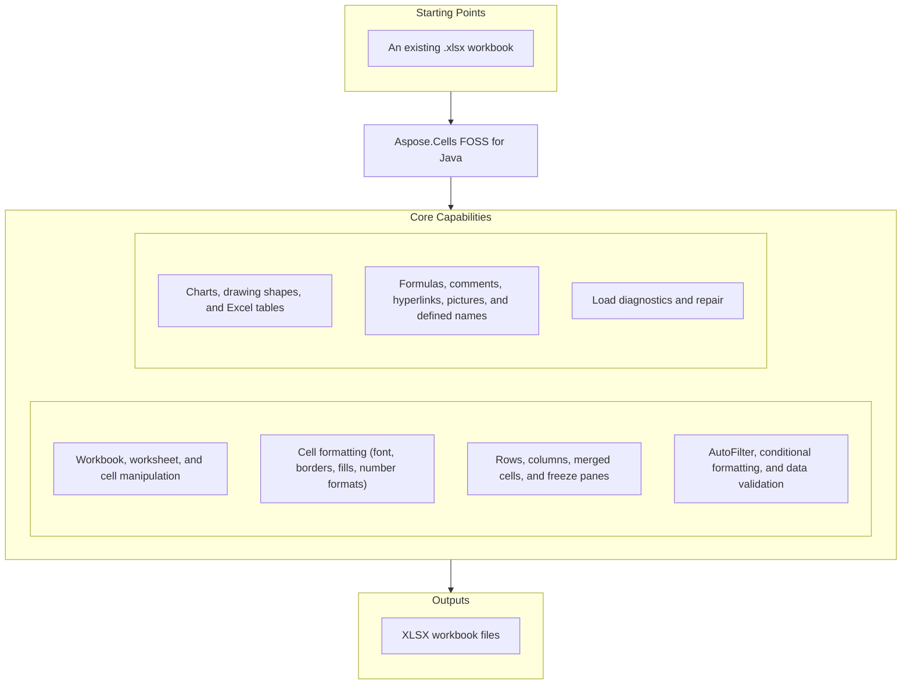

# Aspose.Cells FOSS for Java

[](https://repo1.maven.org/maven2/org/aspose/aspose-cells-foss/) [](https://openjdk.org/projects/jdk/17/) [](License/LICENSE.txt) [](https://github.com/aspose-cells-foss/Aspose.Cells-FOSS-for-Java/graphs/contributors)

[](https://products.aspose.org/cells/java/)

Aspose.Cells FOSS for Java is a free, open-source Java spreadsheet library for creating,
loading, modifying, and saving Excel `.xlsx` workbooks through an Aspose.Cells-compatible API.
It exposes a user-facing API in `com.aspose.cells_foss` and handles OOXML packaging, XML
mapping, and XLSX serialization internally.

## Navigation

- [At a Glance](#at-a-glance)
- [Key Capabilities](#key-capabilities)
- [Installation](#installation)
- [Quick Start](#quick-start)
- [Additional Examples](#additional-examples)
- [API Reference](#api-reference)
- [Documentation & Resources](#documentation--resources)
- [Scope and Limitations](#scope-and-limitations)
- [Development and Testing](#development-and-testing)
- [License](#license)

## At a Glance



## Key Capabilities

- Create, load, save, add/remove/rename worksheets, and control active sheet and visibility.
- Read and write cell values for strings, numbers, booleans, date/time values, formulas, and error
  values (`#N/A`, `#VALUE!`, `#REF!`, and others, saved with the correct `t="e"` cell type), with
  round-trip type preservation.
- Format cells — fonts, borders, fills, alignment, number formats, and protection — through `Style` and `Font`.
- Size and hide rows and columns — row/column sizing, hiding, and outline grouping with collapsed
  state — merge cells, and freeze panes by coordinate or cell name; inspect and clear the frozen
  state, and configure worksheet view settings (tab color, zoom, gridlines, row/column headers,
  zeros, and right-to-left mode).
- Configure `AutoFilter` with color filters, dynamic filters, top-10 filters, custom filters, and sort conditions.
- Work with embedded charts (25 standard chart types total; 18 creatable via `ChartCollection.add()`, with 7 ChartEx types round-tripped read-only), drawing shapes (38 preset geometries via `AutoShapeType`), and Excel tables (`ListObjectCollection`, Excel's ListObjects) that can be created, resized, styled, and removed.
- Add cell comments (with author, text, visibility, and size), embedded pictures — from bytes,
  streams, or file paths with two-cell anchor positioning and JPEG/PNG/GIF/BMP detection —
  hyperlinks, defined names, and data validation.
- Inspect load diagnostics and repair reporting when opening workbooks with `LoadOptions`.

## Installation

Add the dependency to your `pom.xml`:

```xml
<dependency>
  <groupId>org.aspose</groupId>
  <artifactId>aspose-cells-foss</artifactId>
  <version>26.5.0</version>
</dependency>
```

Gradle (Groovy DSL):

```groovy
implementation 'org.aspose:aspose-cells-foss:26.5.0'
```

The library targets Java 17. Apache POI is used only in test scope for compatibility checks —
it is not a runtime dependency.

## Quick Start

Create a workbook, write values, style a cell, and save it:

```java
import com.aspose.cells_foss.Cell;
import com.aspose.cells_foss.Style;
import com.aspose.cells_foss.Workbook;
import com.aspose.cells_foss.Worksheet;

try (Workbook workbook = new Workbook()) {
    Worksheet sheet = workbook.getWorksheets().get(0);
    sheet.setName("Report");

    sheet.getCells().get("A1").putValue("Revenue");
    sheet.getCells().get("B1").putValue(12500.75);

    Cell total = sheet.getCells().get("B1");
    Style style = total.getStyle();
    style.getFont().setBold(true);
    style.setCustom("#,##0.00");
    total.setStyle(style);

    sheet.getCells().getRows().get(0).setHeight(22.0);
    sheet.getCells().getColumns().get(1).setWidth(14.5);

    workbook.save("report.xlsx");
}
```

Load an existing workbook with repair-tolerant options and inspect diagnostics:

```java
import com.aspose.cells_foss.LoadIssue;
import com.aspose.cells_foss.LoadOptions;
import com.aspose.cells_foss.Workbook;

LoadOptions options = new LoadOptions();
options.setStrictMode(false);
options.setTryRepairPackage(true);
options.setTryRepairXml(true);

try (Workbook workbook = new Workbook("input.xlsx", options)) {
    if (workbook.getLoadDiagnostics().hasRepairs()) {
        for (LoadIssue issue : workbook.getLoadDiagnostics().getIssues()) {
            System.out.println(issue.getMessage());
        }
    }

    workbook.getDocumentProperties().setAuthor("cells-foss");
    workbook.save("output.xlsx");
}
```

## Additional Examples

### Round-Trip a String Value Through XLSX

```java
try (Workbook wb = new Workbook()) {
    wb.getWorksheets().get(0).getCells().get("A1").putValue("RoundTrip");
    wb.save("basic.xlsx");
}
Workbook loaded = new Workbook("basic.xlsx");
System.out.println(loaded.getWorksheets().get(0).getCells().get("A1").getValue());
```

<details>
<summary>View Additional Examples</summary>

### Work With Multiple Worksheets

```java
try (Workbook wb = new Workbook()) {
    wb.getWorksheets().get(0).setName("Sheet1");
    wb.getWorksheets().get(0).getCells().get("A1").putValue("Alpha");
    wb.getWorksheets().add("Sheet2");
    wb.getWorksheets().get(1).getCells().get("A1").putValue("Beta");
    wb.save("multi.xlsx");
}
```

### Set a Formula

```java
Workbook wb = new Workbook();
Cell cell = wb.getWorksheets().get(0).getCells().get("A1");
cell.setFormula("A1+B1");
System.out.println(cell.getFormula()); // "=A1+B1"
```

### Configure an AutoFilter Across Several Columns

```java
Workbook wb = new Workbook();
Worksheet ws = wb.getWorksheets().get(0);
ws.getCells().get("A2").putValue("Name");
ws.getCells().get("B2").putValue("Region");
ws.getCells().get("C2").putValue("Score");
ws.getCells().get("A3").putValue("Alice");
ws.getCells().get("B3").putValue("North");
ws.getCells().get("C3").putValue(90);

ws.getAutoFilter().setRange("A2:C2");
wb.save("autofilter.xlsx");
```

</details>

## API Reference

The primary entry point is `Workbook`, which owns a `WorksheetCollection` of `Worksheet` objects;
each `Worksheet` exposes a `Cells` collection of `Cell` objects for reading and writing values,
formulas, and styles. The classes below cover the most commonly used parts of the surface.

<details>
<summary>View the Supported Public API Surface</summary>

### Core API

| Class | Description |
|---|---|
| `AlignmentValue` | Represents alignment settings for a cell style. |
| `AutoFilter` | Represents an auto-filter in a worksheet. |
| `AutoFilterColorFilter` | Represents the AutoFilterColorFilter component. |
| `AutoFilterColorFilterModel` | Represents the AutoFilterColorFilterModel component. |
| `AutoFilterCriteria` | Represents auto-filter criteria for filtering data in a worksheet. |
| `AutoFilterCustomFilter` | Represents the AutoFilterCustomFilter component. |
| `AutoFilterCustomFilterCollection` | Represents the AutoFilterCustomFilterCollection component. |
| `AutoFilterCustomFilterModel` | Represents the AutoFilterCustomFilterModel component. |
| `AutoFilterDynamicFilter` | Represents the AutoFilterDynamicFilter component. |
| `AutoFilterDynamicFilterModel` | Represents the AutoFilterDynamicFilterModel component. |
| `AutoFilterModel` | Represents a model for auto-filter configuration in Excel. |
| `AutoFilterSortCondition` | Represents the AutoFilterSortCondition component. |
| `AutoFilterSortConditionCollection` | Represents the AutoFilterSortConditionCollection component. |
| `AutoFilterSortConditionModel` | Represents the AutoFilterSortConditionModel component. |
| `AutoFilterSortState` | Represents the AutoFilterSortState component. |
| `AutoFilterSortStateModel` | Represents the AutoFilterSortStateModel component. |
| `AutoFilterSupport` | Provides utility methods for auto-filter support. |
| `AutoFilterTop10` | Represents the AutoFilterTop10 component. |
| `AutoFilterTop10Model` | Represents the AutoFilterTop10Model component. |
| `Border` | Represents a border with line style and color. |
| `BorderSideValue` | Represents a border side value with style and color. |
| `Borders` | Represents the border properties for a cell or range in an Excel worksheet. |
| `BordersValue` | Represents the border values for a cell style, including left, right, top, bottom, and diagonal borders, as well as diagonal direction flags. |
| `CalculationProperties` | Represents workbook calculation settings. |
| `CalculationPropertiesModel` | Represents the CalculationPropertiesModel component. |
| `Cell` | Represents a cell in a worksheet. |
| `CellAddress` | Represents a cell address with row and column indices. |
| `CellArea` | Represents a cell area with row and column bounds. |
| `CellFormatValue` | Inner class representing cell format value. |
| `CellRecord` | Represents a cell record in the Excel file. |
| `Cells` | Represents a collection of cells in a worksheet. |
| `CellsException` | Represents an exception thrown by the Aspose.Cells library. |
| `Chart` | Represents an embedded chart in a worksheet (read-only; charts are round-tripped verbatim). |
| `ChartCollection` | Collection of embedded charts on a worksheet. |
| `ChartModel` | Internal model for an embedded chart. |
| `Color` | Represents an ARGB color value. |
| `ColorValue` | Represents a color value with alpha, red, green, and blue components. |
| `Column` | Represents a column in a worksheet. |
| `ColumnCollection` | Represents a collection of columns in a worksheet. |
| `ColumnRangeModel` | Represents a range of columns with formatting properties. |
| `Comment` | Represents a cell comment (note). |
| `CommentCollection` | Collection of cell comments on a worksheet. |
| `CommentModel` | Internal model for a cell comment (note). |
| `ConditionalFormattingCollection` | A collection of conditional formatting objects. |
| `ConditionalFormattingModel` | Represents the conditional formatting model for a worksheet. |
| `CoreDocumentPropertiesModel` | Represents the CoreDocumentPropertiesModel component. |
| `DateSerialConverter` | Converts between LocalDateTime values and Excel serial date numbers. |
| `DefinedName` | Represents a defined name in the workbook. |
| `DefinedNameCollection` | Represents a collection of defined names in a workbook. |
| `DefinedNameModel` | Represents a defined name model in the Excel file. |
| `DiagnosticBag` | Represents a bag of diagnostic entries. |
| `DiagnosticEntry` | Represents a diagnostic entry with details about a problem or warning. |
| `DisplayFormatSectionInfo` | Holds metadata about a single section of a number format code string. |
| `DisplayTextFormatterSupport` | Internal utility class for selecting and formatting display text sections. |
| `DocumentProperties` | Represents the document properties of a workbook (docProps/core.xml and docProps/app.xml). |
| `DocumentPropertiesModel` | Represents the document properties model for an Excel file. |
| `ExtendedDocumentPropertiesModel` | Represents the ExtendedDocumentPropertiesModel component. |
| `FillValue` | Inner class representing fill value. |
| `FilterColumn` | Represents the FilterColumn component. |
| `FilterColumnCollection` | Represents the FilterColumnCollection component. |
| `FilterColumnModel` | Represents the FilterColumnModel component. |
| `FilterValueCollection` | Represents the FilterValueCollection component. |
| `Font` | Represents a font with its properties. |
| `FontValue` | Represents a font value with its properties. |
| `FormatCondition` | Represents a conditional formatting rule. |
| `FormatConditionCollection` | Represents a collection of format conditions in Excel. |
| `FormatConditionModel` | Represents a format condition model used in Excel conditional formatting. |
| `FormulaException` | Represents an exception that occurs during formula processing. |
| `HeaderFooterModel` | Represents the header and footer model for a worksheet. |
| `Hyperlink` | Represents a hyperlink in a worksheet. |
| `HyperlinkCollection` | Represents a collection of hyperlinks in a worksheet. |
| `HyperlinkModel` | Represents a hyperlink model with its properties. |
| `InvalidFileFormatException` | Represents an exception thrown when an invalid file format is encountered. |
| `ListColumn` | Represents a column within an Excel table (ListObject). |
| `ListColumnCollection` | Ordered collection of columns in an Excel table. |
| `ListColumnModel` | Internal model for a table (ListObject) column. |
| `ListObject` | Represents an Excel table (structured reference / ListObject). |
| `ListObjectCollection` | Collection of Excel tables (ListObjects) on a worksheet. |
| `ListObjectModel` | Internal model for a table (ListObject / structured reference). |
| `LoadDiagnostics` | Represents diagnostics information during workbook loading. |
| `LoadIssue` | Represents an issue that occurred during workbook loading. |
| `LoadOptions` | Represents options for loading a workbook. |
| `MergeRegion` | Represents a merge region in an Excel worksheet. |
| `MissingPartException` | Thrown when a required part is missing from the package structure. |
| `NumberFormat` | Provides built-in number format functionality. |
| `NumberFormatValue` | Represents a number format value with its number format index and custom format string. |
| `PackageLoadContext` | Represents the context for loading a package. |
| `PackageModel` | Represents the model of a package (e.g., XLSX file structure) with parts, relationships, and unsupported parts. |
| `PackagePartDescriptor` | Represents a descriptor for a package part in the XLSX package. |
| `PackageStructureException` | Thrown when the package structure of the Excel file is invalid. |
| `PackagingConventions` | Defines constants for Open XML package part paths and relationship types. |
| `PageMarginsModel` | Represents page margins for a worksheet in an Excel file. |
| `PageSetup` | Represents page setup options for a worksheet. |
| `PageSetupModel` | Represents page setup model for an Excel worksheet. |
| `Picture` | Represents an embedded image in a worksheet. |
| `PictureCollection` | Collection of embedded pictures on a worksheet. |
| `PictureModel` | Internal model for an embedded picture/image. |
| `PrintOptionsModel` | Represents print options for a worksheet. |
| `ProtectionValue` | Represents protection settings for a cell or range. |
| `RelationshipDescriptor` | Represents a relationship descriptor in the XLSX package. |
| `RelationshipResolutionException` | Exception thrown when a relationship cannot be resolved in the package structure. |
| `Row` | Represents a row in a worksheet. |
| `RowCollection` | Represents a collection of rows in a worksheet. |
| `RowModel` | Represents a row model in the Excel file. |
| `SaveOptions` | Represents save options for workbook saving. |
| `Shape` | Represents a drawing object (auto shape) anchored to a worksheet. |
| `ShapeCollection` | Collection of drawing objects (shapes) on a worksheet. |
| `ShapeModel` | Internal model for a drawing object (auto shape) anchored to a worksheet. |
| `SharedStringRepository` | A repository that manages shared strings for Excel files. |
| `SharedStringTableXmlMapper` | Maps shared string tables to/from XML. |
| `Style` | Represents the full style of a cell: font, borders, alignment, fill, number format, and protection. |
| `StyleException` | Represents an exception that occurs during style processing. |
| `StyleRepository` | Represents a repository for style values. |
| `StyleValue` | Represents a style value with various formatting properties. |
| `StyleValueSanitizer` | Sanitizes style values to ensure they fall within valid ranges. |
| `StylesheetXmlMapper` | Maps style information to and from XML. |
| `UnsupportedFeatureException` | Thrown when an unsupported feature is encountered. |
| `Validation` | Represents a data validation rule applied to one or more cell areas. |
| `ValidationCollection` | Represents the collection of data validation rules for a worksheet. |
| `ValidationMessage` | Represents a validation message with code, severity, and message text. |
| `ValidationModel` | Represents a data validation model in the Excel file. |
| `WarningInfo` | Represents information about a warning that occurred during workbook operations. |
| `Workbook` | Represents an Excel workbook. |
| `WorkbookLoadException` | Represents an exception that occurs when loading a workbook. |
| `WorkbookModel` | Represents the top-level model of a workbook. |
| `WorkbookProperties` | Represents the properties of a workbook (workbookPr attributes). |
| `WorkbookPropertiesModel` | Represents the workbook properties model. |
| `WorkbookProtection` | Represents workbook-level protection settings (structure, windows, revision). |
| `WorkbookProtectionModel` | Represents the WorkbookProtectionModel component. |
| `WorkbookSaveException` | Represents an exception that occurs when saving a workbook. |
| `WorkbookSettings` | Represents workbook settings for an Excel file. |
| `WorkbookSettingsModel` | Represents workbook settings model. |
| `WorkbookValidator` | A validator for workbook models that produces validation messages. |
| `WorkbookView` | Represents the view / window settings stored in &lt;bookViews&gt;. |
| `WorkbookViewModel` | Represents the WorkbookViewModel component. |
| `WorkbookXmlMapper` | Maps workbook data to/from SpreadsheetML XML format. |
| `Worksheet` | Represents a worksheet in a workbook. |
| `WorksheetCollection` | Represents a collection of worksheets in a workbook. |
| `WorksheetModel` | Represents the model of a worksheet in the Excel file. |
| `WorksheetProtection` | Represents protection settings for a worksheet. |
| `WorksheetProtectionModel` | Represents the protection model for a worksheet in an Excel file. |
| `WorksheetViewModel` | Represents a view model for a worksheet with display settings. |
| `WorksheetXmlMapper` | Maps worksheet XML data. |
| `XlsxDocumentProperties` | Helper class for handling XLSX document properties (core and extended). |
| `XlsxWorkbookSerializer` | Serializer for XLSX workbook files — thin coordinator that delegates to helper classes. |
| `XlsxWorkbookStylesValueHelpers` | Provides helper methods for parsing and formatting workbook style values. |
| `XlsxWorkbookStylesXml` | Provides methods for reading and writing XLSX workbook styles XML. |
| `XmlParsingException` | Represents an exception that occurs during XML parsing. |

#### Interfaces

| Interface | Description |
|---|---|
| `IPackageReader` | Provides a reader interface for reading package models from streams. |
| `IPackageWriter` | Provides a contract for writing package models to a stream. |
| `IWarningCallback` | Provides a callback mechanism for reporting warnings during workbook operations. |

#### Enumerations

| Enumeration | Description |
|---|---|
| `AutoShapeType` | Specifies the type of an auto shape (preset DrawingML geometry). |
| `BorderStyle` | Represents the style of a border line in a cell. |
| `BorderStyleType` | Represents the style of a border. |
| `CellValueKind` | Represents the kind of a cell value. |
| `CellValueType` | Represents the type of a cell value. |
| `ChartType` | Identifies the type of an embedded chart. |
| `DateSystem` | Represents the date system used in Excel. |
| `DiagnosticSeverity` | Represents the severity level of a diagnostic message (public `com.aspose.cells_foss` API). |
| `DiagnosticSeverity-core` | Represents the severity of a diagnostic entry (internal `com.aspose.cells_foss.core` engine layer, a distinct enum). |
| `FillPattern` | Represents the fill pattern used in cell styling. |
| `FillPatternKind` | Represents the pattern used to fill a cell. |
| `FilterOperatorType` | Enumerates the supported FilterOperatorType values. |
| `FormatConditionType` | Represents the type of a format condition. |
| `HorizontalAlignment` | Represents horizontal alignment options for cell content in Excel. |
| `HorizontalAlignmentType` | Represents the type of horizontal alignment for cell content. |
| `ImageType` | Identifies the format of an embedded image. |
| `LoadFormat` | Specifies the format of the workbook to be loaded. |
| `OperatorType` | Represents the operator type used in conditional formatting and filtering. |
| `PageOrientation` | Represents the page orientation for a worksheet. |
| `PageOrientationType` | Represents the page orientation type for a worksheet. |
| `PaperSizeType` | Represents the paper size type for a worksheet. |
| `SaveFormat` | Specifies the format in which a workbook will be saved. |
| `SheetVisibility` | Represents the visibility state of a worksheet in an Excel workbook. |
| `TableStyleType` | Identifies a built-in Excel table style. |
| `TargetModeType` | Represents the target mode type for cell references. |
| `TotalsCalculation` | Aggregation function applied to a table's totals row. |
| `ValidationAlertType` | Represents the alert type for data validation. |
| `ValidationMessageSeverity` | Represents the severity level of a validation message. |
| `ValidationType` | Represents the type of cell validation. |
| `VerticalAlignment` | Represents vertical alignment options for cell content. |
| `VerticalAlignmentType` | Represents vertical alignment options for cell content. |
| `VisibilityType` | Represents the visibility type of a worksheet. |

---

#### Detailed Member Reference

### Workbook and Worksheets

- `Workbook`
  - `Workbook()`, `Workbook(fileName)`, `Workbook(stream)`, `Workbook(fileName, options)`, `Workbook(stream, options)`
  - `getWorksheets() -> WorksheetCollection`
  - `getSettings() -> WorkbookSettings`, `getProperties() -> WorkbookProperties`, `getDocumentProperties() -> DocumentProperties`
  - `getDefinedNames() -> DefinedNameCollection`
  - `getLoadDiagnostics() -> LoadDiagnostics`
  - `save(fileName)`, `save(fileName, format)`, `save(fileName, options)`, `save(stream, ...)`
- `WorksheetCollection` — `get(index)`, `get(name)`, `add()`, `add(sheetName)`, `removeAt(...)`, `getCount()`, iterable
- `Worksheet` — `getName/setName`, `getCells() -> Cells`, `getAutoFilter() -> AutoFilter`, `getPageSetup`, `getValidations`, `getHyperlinks`, `getConditionalFormattings`, `getComments`, `getPictures`, `getShapes`, `getCharts`, `getListObjects`, `freezePanes(...)`, `protect()/unprotect()`

### Cells and Values

- `Cells` — `get(cellName)`, `get(row, column)`, `getRows() -> RowCollection`, `getColumns() -> ColumnCollection`, `getMergedCells()`, `merge(...)`
- `Cell` — `getValue/setValue`, `putValue(value)` (overloaded for String/number/boolean/date), `getFormula/setFormula`, `getType() -> CellValueType`, `getStyle/setStyle`
- `Row`, `Column` — sizing, hiding, outline grouping
- `Style` — `getFont/setFont`, `getBorders/setBorders`, alignment, `getPattern/setPattern`, `getForegroundColor/getBackgroundColor`, `getNumberFormat/getCustom`; `Font` — `getName/setName`, `getSize/setSize`, `getBold/setBold`, `getItalic/setItalic`, `getUnderline/setUnderline`, `getStrikeThrough/setStrikeThrough`, `getColor/setColor`

### Filtering, Charts, Shapes, Tables

- `AutoFilter` — `getRange/setRange`, `getFilterColumns() -> FilterColumnCollection`, `getSortState()`, `clear()`
- `ChartCollection` / `Chart` — read-only embedded chart access; 25 standard chart types total, 18 creatable via `ChartCollection.add()` (the other 7 are ChartEx types that round-trip verbatim but cannot be created programmatically)
- `AutoShapeType` — 38 preset drawing-shape geometries
- `ListObjectCollection` — structured Excel tables with column definitions and totals rows
- `Comment`, `Picture` — cell comments and embedded pictures with anchor positioning

### Workbook Metadata

- `WorkbookProtection` — structure/window/revision locking with passwords (`getWorkbookPassword/setWorkbookPassword`, `getRevisionsPassword/setRevisionsPassword`); `WorksheetProtection` — fine-grained edit/format/insert/delete/sort/filter/pivot-table permission locking (`getAllowFormattingCell`, `getAllowInsertingRow`, `getAllowDeletingColumn`, `getAllowSorting`, `getAllowFiltering`, `getAllowUsingPivotTable`, and similar `getAllow*`/`setAllow*` pairs)
- `WorkbookView`, `CalculationProperties`, `NumberFormat` — window state, calculation mode, and built-in Excel format code lookup
- `LoadOptions`, `LoadIssue`, `LoadDiagnostics` — repair-tolerant loading and diagnostics

The full surface totals 157 public classes. See the [full API reference](#documentation--resources)
below for every type.

</details>

## Documentation & Resources

- **[Getting started guide](https://docs.aspose.org/cells/java/)** — installation, walkthroughs, and feature guides for this library.
- **[How-to guides & FAQ](https://kb.aspose.org/cells/java/)** — task-focused answers for common spreadsheet-processing questions.
- **[Full API reference](https://reference.aspose.org/cells/java/)** — the complete, browsable reference for all 157 public classes.
- **[Contributor guide](Agents.md)** — repository conventions to follow when changing supported behavior; if you change supported behavior, update README.md, Agents.md, and tests together.
- **[Publishing guide](PUBLISHING.md)** — how releases are built and published to Maven Central.
- Found a bug or have a feature request? [Open an issue](https://github.com/aspose-cells-foss/Aspose.Cells-FOSS-for-Java/issues) on GitHub.

## Scope and Limitations

- This edition currently loads and saves the `.xlsx` format only — the SpreadsheetML
  (`.xml`) reader/writer and worksheet/stylesheet/shared-string XML mappers explicitly
  throw `UnsupportedOperationException` and are not implemented.
- ChartEx types (Waterfall, Treemap, Sunburst, Histogram, Box and Whisker, Funnel, Map)
  cannot be created programmatically, though they round-trip verbatim if already present in
  a loaded file.
- This is not a full spreadsheet calculation engine: formulas are stored and round-tripped
  but not evaluated.
- Some APIs exist mainly to preserve OOXML metadata and package fidelity on round-trip rather
  than to provide full Excel feature parity.

These limitations don't apply to
[Aspose.Cells for Java — Enterprise Edition](https://products.aspose.com/cells/java/), which
adds a full calculation engine, additional save formats, programmatic ChartEx creation, and
broader Excel feature parity.

## Development and Testing

Requirements: JDK 17+ and Maven 3.9+. Test framework: JUnit 5.

```bash
mvn compile
mvn test
mvn clean package
mvn javadoc:javadoc   # generates docs/apidocs/index.html
```

Representative test coverage includes workbook and worksheet behavior; cell value handling and
error cell value round-tripping; style round-tripping and display text formatting; document and
workbook properties; page setup, hyperlinks, data validation, conditional formatting, and
auto filters; outline grouping; cell comments, embedded pictures, embedded charts, drawing shapes,
and Excel tables; freeze panes, workbook protection, workbook view, and calculation properties;
compatibility checks against generated XLSX output; and focused unit tests under
`src/test/java/com/aspose/cells_foss/unit/`.

Releases publish to Maven Central via
[`maven-central-release.yml`](.github/workflows/maven-central-release.yml) — see
[`PUBLISHING.md`](PUBLISHING.md) for the full release process.

## License

This project is licensed under the [MIT License](License/LICENSE.txt). The MIT License permits
use, copying, modification, distribution, sublicensing, and commercial use, provided its
copyright and permission notice are retained. The software is provided without warranty.
