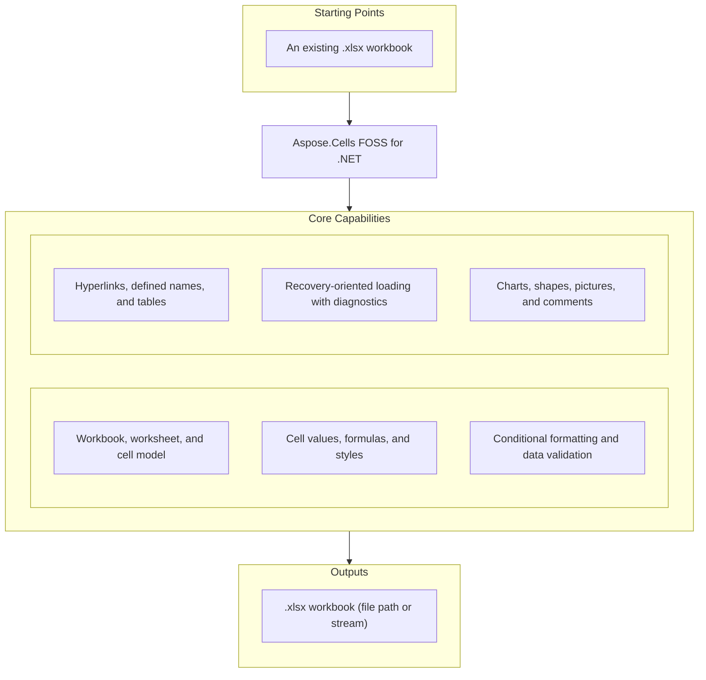

# Aspose.Cells FOSS for .NET

[](https://www.nuget.org/packages/Aspose.Cells.FOSS/) [](License/LICENSE.txt) [](https://github.com/aspose-cells-foss/Aspose.Cells-FOSS-for-.NET/graphs/contributors)

[](https://products.aspose.org/cells/net/)

Aspose.Cells FOSS for .NET is a free, open-source, MIT-licensed .NET library for creating,
loading, editing, and saving Excel `.xlsx` workbooks without requiring Microsoft Excel. It exposes
an Aspose.Cells-compatible API surface — `Workbook`, `Worksheet`, `Cells`, `Cell` — covering
values, formulas, styles, conditional formatting, data validation, hyperlinks, defined names,
tables, charts, shapes, and comments, as pure managed code with no native dependencies.

## Navigation

- [At a Glance](#at-a-glance)
- [Key Capabilities](#key-capabilities)
- [Installation](#installation)
- [Quick Start](#quick-start)
- [Additional Examples](#additional-examples)
- [API Reference](#api-reference)
- [Documentation & Resources](#documentation--resources)
- [Scope and Limitations](#scope-and-limitations)
- [Development and Testing](#development-and-testing)
- [License](#license)

## At a Glance



## Key Capabilities

- Create, load, and save `.xlsx` workbooks from a file path or stream with `Workbook`.
- Read and write cell values, string/display values, and formula strings through `Cell.PutValue`
  and `Cell.Formula`.
- Apply a full style model — font, fill pattern, borders, alignment, number formats — via
  `Cell.GetStyle()` / `SetStyle()`.
- Add conditional formatting (`CellValue`, `Expression`, `ColorScale`, `DataBar`, `IconSet`) through
  `Worksheet.ConditionalFormattings`.
- Add data validation (`WholeNumber`, `Decimal`, `List`, `Date`, `Custom`) through
  `Worksheet.Validations`.
- Work with Excel tables (`ListObject`), charts, shapes, pictures, legacy comments,
  hyperlinks (`HyperlinkCollection`), and workbook/sheet-scoped defined names
  (`DefinedNameCollection`).
- Read and write document properties — core (title, subject, creator, keywords) and extended —
  via `Workbook.DocumentProperties` (`DocumentProperties.Core` / `.Extended`).
- Configure worksheet view settings — tab color, zoom, gridlines, row/column headers, visibility,
  right-to-left (RTL) layout, and protection — via `Worksheet`.
- Recovery-oriented loading of malformed packages, with repair and diagnostics via
  `LoadOptions.TryRepairPackage` / `TryRepairXml`, `Workbook.LoadDiagnostics`, and warning
  callbacks via `LoadOptions.WarningCallback` (`IWarningCallback`).

## Installation

Install the library from NuGet:

```bash
dotnet add package Aspose.Cells.FOSS --version 26.7.0
```

The library (`src/Aspose.Cells_FOSS/Aspose.Cells_FOSS.csproj`) multi-targets `netstandard2.0` and
`net8.0`, so it can also be consumed by compatible runtimes such as .NET Framework 4.6.1+ in
addition to modern .NET.

## Quick Start

Create, style, and save a workbook:

```csharp
using Aspose.Cells_FOSS;

var workbook = new Workbook();
var sheet = workbook.Worksheets[0];

sheet.Name = "Products";
sheet.Cells["A1"].PutValue("Product");
sheet.Cells["B1"].PutValue("Price");
sheet.Cells["A2"].PutValue("Apple");
sheet.Cells["B2"].PutValue(2.99m);
sheet.Cells["A3"].PutValue("Orange");
sheet.Cells["B3"].PutValue(1.99m);
sheet.Cells["B4"].Formula = "=SUM(B2:B3)";

var headerStyle = sheet.Cells["A1"].GetStyle();
headerStyle.Font.IsBold = true;
headerStyle.Font.Color = Color.FromArgb(255, 255, 255, 255);
headerStyle.Pattern = FillPattern.Solid;
headerStyle.ForegroundColor = Color.FromArgb(255, 34, 120, 212);
sheet.Cells["A1"].SetStyle(headerStyle);
sheet.Cells["B1"].SetStyle(headerStyle);

workbook.Save("products.xlsx");
```

## Additional Examples

Runnable projects are available under [`samples/`](samples/): `Aspose.Cells_FOSS.Samples.Basic`,
`Aspose.Cells_FOSS.Samples.Loading`, `Aspose.Cells_FOSS.Samples.Styles`,
`Aspose.Cells_FOSS.Samples.WorksheetSettings`, `Aspose.Cells_FOSS.Samples.Validations`,
`Aspose.Cells_FOSS.Samples.ConditionalFormatting`, `Aspose.Cells_FOSS.Samples.HyperlinksAndNames`,
`Aspose.Cells_FOSS.Samples.PageSetup`, `Aspose.Cells_FOSS.Samples.Shapes`,
`Aspose.Cells_FOSS.Samples.Charts`, `Aspose.Cells_FOSS.Samples.Comments`,
`Aspose.Cells_FOSS.Samples.DocumentProperties`, `Aspose.Cells_FOSS.Samples.ListObjects`, and
`Aspose.Cells_FOSS.Samples.Pictures`. A few common operations are collected below.

### Load With Recovery Options and Diagnostics

```csharp
using System;
using Aspose.Cells_FOSS;

var loadOptions = new LoadOptions
{
    TryRepairPackage = true,
    TryRepairXml = true,
    StrictMode = false,
    WarningCallback = new ConsoleWarningCallback()
};

var workbook = new Workbook("input.xlsx", loadOptions);

if (workbook.LoadDiagnostics.HasRepairs)
    Console.WriteLine("Load repairs were applied.");

if (workbook.LoadDiagnostics.HasDataLossRisk)
    Console.WriteLine("Potential data loss risk detected during load.");

workbook.Worksheets[0].Cells["A1"].PutValue("Updated");
workbook.Save("updated.xlsx");

public sealed class ConsoleWarningCallback : IWarningCallback
{
    public void Warning(WarningInfo warningInfo)
    {
        Console.WriteLine("[{0}] {1}: {2}", warningInfo.Severity, warningInfo.Code, warningInfo.Message);
    }
}
```

<details>
<summary>View Additional Examples</summary>

### Apply Conditional Formatting

```csharp
using Aspose.Cells_FOSS;

var workbook = new Workbook();
var sheet = workbook.Worksheets[0];
sheet.Name = "Conditional Formatting";

for (var i = 0; i < 10; i++)
    sheet.Cells[i, 0].PutValue(i + 1);

var cfCol = sheet.ConditionalFormattings[sheet.ConditionalFormattings.Add()];
cfCol.AddArea(CellArea.CreateCellArea("A1", "A10"));
var rule = cfCol[cfCol.AddCondition(FormatConditionType.CellValue,
    OperatorType.Between, "3", "7")];
var style = rule.Style;
style.Pattern = FillPattern.Solid;
style.ForegroundColor = Color.FromArgb(255, 255, 199, 206);
style.Font.IsBold = true;
rule.Style = style;

workbook.Save("conditional-formatting.xlsx");
```

### Add Hyperlinks and Named Ranges

```csharp
using Aspose.Cells_FOSS;

var workbook = new Workbook();
var sheet = workbook.Worksheets[0];
sheet.Name = "Links";

sheet.Cells["A1"].PutValue("Docs");
var link = sheet.Hyperlinks[sheet.Hyperlinks.Add("A1", 1, 1, "https://example.com/docs")];
link.TextToDisplay = "Docs";
link.ScreenTip = "External docs";

var name = workbook.DefinedNames[workbook.DefinedNames.Add("GlobalRange", "='Links'!$A$1:$D$5")];
name.Comment = "Primary sample range";

workbook.Save("hyperlinks-and-names.xlsx");
```

</details>

## API Reference

The public surface centers on `Workbook`, which owns a `WorksheetCollection` of `Worksheet`
objects; each `Worksheet` exposes a `Cells` collection indexed to individual `Cell` instances for
reading and writing values, formulas, and styles. The library ships 96 public types in total; the
sections below cover the ones used most often.

<details>
<summary>View Selected API Surface</summary>

### Core API

| Class | Description |
|---|---|
| `AutoFilter` | Represents auto filter. |
| `AutoFilterColorFilter` | Represents auto filter color filter. |
| `AutoFilterCustomFilter` | Represents auto filter custom filter. |
| `AutoFilterCustomFilterCollection` | Represents a collection of auto filter custom filter objects. |
| `AutoFilterDynamicFilter` | Represents auto filter dynamic filter. |
| `AutoFilterSortCondition` | Represents auto filter sort condition. |
| `AutoFilterSortConditionCollection` | Represents a collection of auto filter sort condition objects. |
| `AutoFilterSortState` | Represents auto filter sort state. |
| `AutoFilterTop10` | Represents auto filter top10. |
| `Border` | Represents border. |
| `Borders` | Represents borders. |
| `CalculationProperties` | Represents calculation properties. |
| `Cell` | Represents a single worksheet cell and exposes value, formula, and style operations. |
| `Cells` | Provides access to worksheet cells, rows, columns, and merged ranges. |
| `CellsException` | Represents an error that occurs during cells. |
| `Chart` | Charts provide visual representation of data and can be created programmatically or loaded from existing XLSX files. |
| `ChartCollection` | Represents collection of charts on a worksheet. |
| `Column` | Represents column. |
| `ColumnCollection` | Represents a collection of column objects. |
| `Comment` | Represents a worksheet comment (legacy note) anchored to a single cell. |
| `CommentCollection` | Represents the collection of comments (legacy notes) on a worksheet. |
| `ConditionalFormattingCollection` | Represents a collection of conditional formatting objects. |
| `CoreDocumentProperties` | Represents core document properties. |
| `DefinedName` | Represents defined name. |
| `DefinedNameCollection` | Represents a collection of defined name objects. |
| `DocumentProperties` | Represents document properties. |
| `ExtendedDocumentProperties` | Represents extended document properties. |
| `FilterColumn` | Represents filter column. |
| `FilterColumnCollection` | Represents a collection of filter column objects. |
| `FilterValueCollection` | Represents a collection of filter value objects. |
| `Font` | Represents font. |
| `FormatCondition` | Represents format condition. |
| `FormatConditionCollection` | Represents a collection of format condition objects. |
| `FormulaException` | Represents an error that occurs during formula. |
| `Hyperlink` | Represents hyperlink. |
| `HyperlinkCollection` | Encapsulates the hyperlinks defined for a worksheet. |
| `InvalidFileFormatException` | Represents an error that occurs during invalid file format. |
| `ListColumn` | Represents a single column in an Excel table. |
| `ListColumnCollection` | Represents the ordered collection of columns in an Excel table. |
| `ListObject` | Represents an Excel table (structured reference / ListObject). |
| `ListObjectCollection` | Represents the collection of Excel tables on a worksheet. |
| `LoadDiagnostics` | Represents load diagnostics. |
| `LoadIssue` | Represents load issue. |
| `LoadOptions` | Specifies how a workbook should be loaded. |
| `NumberFormat` | Provides number format operations. |
| `PageSetup` | Represents worksheet print and page-layout settings. |
| `Picture` | Represents a picture (image) anchored to a worksheet. |
| `PictureCollection` | Represents collection of pictures anchored to a worksheet. |
| `Row` | Represents row. |
| `RowCollection` | Represents a collection of row objects. |
| `SaveOptions` | Specifies how a workbook should be saved. |
| `Shape` | Represents a drawing object (auto shape) anchored to a worksheet. |
| `ShapeCollection` | Represents collection of drawing objects (shapes) on a worksheet. |
| `Style` | Represents a mutable cell style facade that can be applied to one or more cells. |
| `StyleException` | Represents an error that occurs during style. |
| `StyleFlag` | Represents flags which indicate applied formatting properties. |
| `UnsupportedFeatureException` | Represents an error that occurs during unsupported feature. |
| `Validation` | Represents validation. |
| `ValidationCollection` | Represents a collection of validation objects. |
| `WarningInfo` | Represents warning info. |
| `Workbook` | Represents the root spreadsheet object used to create, load, modify, and save an XLSX workbook. |
| `WorkbookLoadException` | Represents an error that occurs during workbook load. |
| `WorkbookProperties` | Represents workbook properties. |
| `WorkbookProtection` | Represents workbook protection. |
| `WorkbookSaveException` | Represents an error that occurs during workbook save. |
| `WorkbookSettings` | Represents workbook-level settings that affect date handling and display formatting. |
| `WorkbookView` | Represents workbook view. |
| `Worksheet` | Encapsulates a single worksheet and its supported v0.1 worksheet features. |
| `WorksheetCollection` | Encapsulates the workbook's worksheets and active-sheet state. |
| `WorksheetProtection` | Represents worksheet protection. |

#### Interfaces

| Interface | Description |
|---|---|
| `IWarningCallback` | Defines a callback that receives load warnings. |

#### Structs

| Struct | Description |
|---|---|
| `CellArea` | Represents cell area. |
| `Color` | Represents color. |

#### Enumerations

| Enumeration | Description |
|---|---|
| `AutoShapeType` | Specifies the type of an auto shape (preset geometry). |
| `BorderStyleType` | Specifies border style type. |
| `CellValueType` | Specifies cell value type. |
| `ChartType` | Specifies the chart type. |
| `DiagnosticSeverity` | Specifies diagnostic severity. |
| `FillPattern` | Specifies fill pattern. |
| `FilterOperatorType` | Specifies filter operator type. |
| `FontUnderlineType` | Enumerates font underline types. |
| `FormatConditionType` | Specifies format condition type. |
| `HorizontalAlignmentType` | Specifies horizontal alignment type. |
| `ImageType` | Represents the format of an image stored in a worksheet. |
| `LoadFormat` | Specifies load format. |
| `OperatorType` | Specifies operator type. |
| `PageOrientationType` | Specifies page orientation type. |
| `PaperSizeType` | Specifies paper size type. |
| `SaveFormat` | Specifies save format. |
| `TableStyleType` | Represents the built-in Excel table style types. |
| `TargetModeType` | Specifies target mode type. |
| `TotalsCalculation` | Represents the aggregation function shown in a table totals row cell. |
| `ValidationAlertType` | Specifies validation alert type. |
| `ValidationType` | Specifies validation type. |
| `VerticalAlignmentType` | Specifies vertical alignment type. |
| `VisibilityType` | Specifies visibility type. |

---

#### Detailed Member Reference

### Workbook and Worksheets

- `Workbook` — `Workbook()` / `Workbook(fileName)` / `Workbook(stream)` (+ `LoadOptions`
  overloads); `Save(...)`; `Worksheets`, `Settings`, `Properties`, `DocumentProperties`,
  `DefinedNames`, `LoadDiagnostics`.
- `WorksheetCollection` — `Add()`, `Add(sheetName)`, `RemoveAt(...)`, `Count`, `ActiveSheetIndex`.
- `Worksheet` — `Cells`, `Hyperlinks`, `Validations`, `ConditionalFormattings`, `PageSetup`,
  `Protection`, `AutoFilter`, `ListObjects`, `Pictures`, `Shapes`, `Charts`, `Comments`;
  `Protect()` / `Unprotect()`.

### Cells, Rows, and Columns

- `Cells` — `Rows`, `Columns`, `Style`, `MergedCells`; `Merge(...)`.
- `Cell` — `Value`, `StringValue`, `DisplayStringValue`, `Formula`, `Type`; `PutValue(...)`
  overloads, `GetStyle()`/`SetStyle(...)`.
- `Row`, `Column`, `RowCollection`, `ColumnCollection`.

### Styling

- `Style` — `Font`, `Borders`, `Pattern`, `ForegroundColor`/`BackgroundColor`, `NumberFormat`,
  `HorizontalAlignment`/`VerticalAlignment`, `WrapText`, `IsLocked`/`IsHidden`.
- `Font`, `Border`/`Borders`, `StyleFlag`, `NumberFormat` (static built-in-format helpers).

### Conditional Formatting and Validation

- `FormatConditionCollection` — `Add(...)`, `AddCondition(...)`, `AddArea(...)`, `RemoveArea(...)`.
- `FormatCondition` — `Type`, `Operator`, `Formula1`/`Formula2`, color-scale/data-bar/icon-set
  properties, `Style`.
- `ValidationCollection` / `Validation` — `ValidationCollection.Add(area)`, `GetValidationInCell(row, column)`;
  `Validation.Areas`, `Type`, `Operator`, `Formula1`/`Formula2`.

### Hyperlinks, Names, and Tables

- `HyperlinkCollection` / `Hyperlink` — `Add(...)`, `Address`, `TextToDisplay`, `ScreenTip`.
- `DefinedNameCollection` / `DefinedName` — `DefinedNameCollection.Add(name, formula[, localSheetIndex])`;
  `DefinedName.Name`, `Formula`, `LocalSheetIndex`.
- `ListObjectCollection` / `ListObject` — Excel tables; `ListObjectCollection.Add(...)`, `RemoveAt(...)`;
  `ListObject.ListColumns`, `TableStyleType`, `ShowAutoFilter()`, `ConvertToRange()`.

### Charts, Shapes, Pictures, Comments

- `ChartCollection` / `Chart` — `Add(type, dataRange, ...)`, `ChartType`.
- `ShapeCollection` / `Shape` — `ShapeCollection.Add(...)`, `RemoveAt(...)`; `Shape.AutoShapeType`.
- `PictureCollection` / `Picture`.
- `CommentCollection` / `Comment` — legacy notes.

### Load, Save, and Diagnostics

- `LoadOptions` — `LoadFormat`, `StrictMode`, `TryRepairPackage`, `TryRepairXml`,
  `WarningCallback` (`IWarningCallback`).
- `SaveOptions` — `SaveFormat`, `UseSharedStrings`, `ValidateBeforeSave`, `CompactStyles`.
- `LoadDiagnostics` / `LoadIssue` / `WarningInfo` — `LoadDiagnostics.HasRepairs`, `HasDataLossRisk`, `Issues`;
  `LoadIssue`/`WarningInfo.Code`, `Severity`, `Message`.

### Exceptions

- `CellsException` (base), `FormulaException`, `InvalidFileFormatException`, `StyleException`,
  `UnsupportedFeatureException`, `WorkbookLoadException`, `WorkbookSaveException`.

</details>

## Documentation & Resources

- **[Getting started guide](https://docs.aspose.org/cells/net/)** — installation, walkthroughs, and feature guides for this library.
- **[How-to guides & FAQ](https://kb.aspose.org/cells/net/)** — task-focused answers for common spreadsheet-processing questions.
- **[Full API reference](https://reference.aspose.org/cells/net/)** — the complete, browsable reference for all 96 public types.
- **[Contributor notes](agents.md)** — architecture and conventions for contributors.
- Found a bug or have a feature request? [Open an issue](https://github.com/aspose-cells-foss/Aspose.Cells-FOSS-for-.NET/issues) on GitHub.

## Scope and Limitations

- `.xlsx` is the only supported read/write format — `.xls`, `.csv`, `.ods`, `.pdf`, `.html`, and
  image export are not available in this edition.
- Formula strings are stored and retrieved verbatim; the library does not perform server-side
  recalculation, so formulas are evaluated by Excel or a compatible viewer on open.

These limitations don't apply to [Aspose.Cells for .NET — Enterprise Edition](https://products.aspose.com/cells/net/),
which adds broader format support (XLS, CSV, ODS, PDF, HTML, and image export), server-side
formula recalculation, and additional spreadsheet features.

## Development and Testing

Build the library and a sample project from the repository root:

```bash
dotnet build src/Aspose.Cells_FOSS/Aspose.Cells_FOSS.csproj -c Debug
dotnet build samples/Aspose.Cells_FOSS.Samples.Basic/Aspose.Cells_FOSS.Samples.Basic.csproj -c Debug
```

## License

This project is licensed under the [MIT License](License/LICENSE.txt). The MIT License permits
use, copying, modification, distribution, sublicensing, and commercial use, provided its copyright
and permission notice are retained. The software is provided without warranty.
