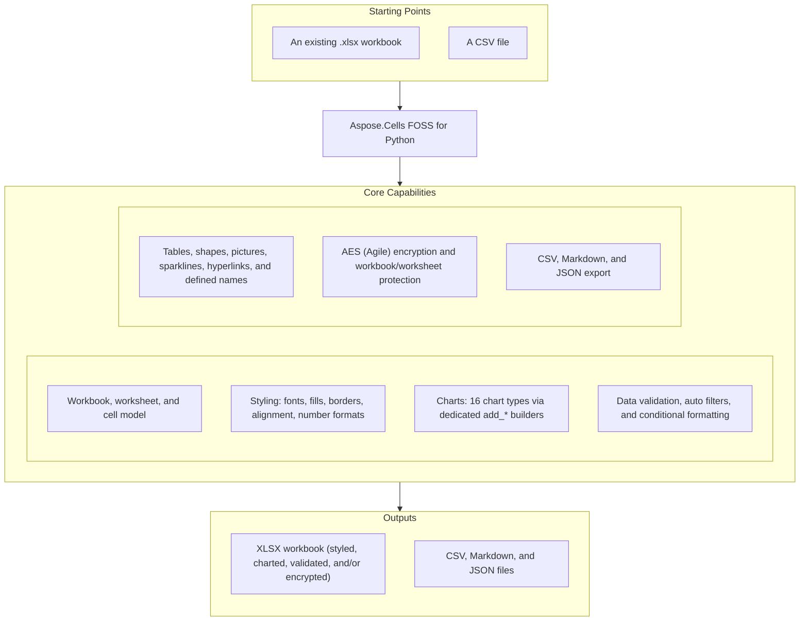

# Aspose.Cells FOSS for Python

[](https://pypi.org/project/aspose-cells-foss/) [](https://pypi.org/project/aspose-cells-foss/) [](License/LICENSE.txt) [](https://github.com/aspose-cells-foss/Aspose.Cells-FOSS-for-Python/graphs/contributors)

[](https://products.aspose.org/cells/python/)

Aspose.Cells FOSS for Python is a free, open-source Python library for creating, reading, and
modifying Microsoft Excel `.xlsx` spreadsheets without requiring Microsoft Excel or any Office
dependency. It exposes a Pythonic `Workbook` / `Worksheet` / `Cells` / `Cell` object model with
styling, charts, data validation, tables, AES encryption, and export to CSV, Markdown, and JSON.

## Navigation

- [At a Glance](#at-a-glance)
- [Key Capabilities](#key-capabilities)
- [Installation](#installation)
- [Quick Start](#quick-start)
- [Additional Examples](#additional-examples)
- [API Reference](#api-reference)
- [Documentation & Resources](#documentation--resources)
- [Scope and Limitations](#scope-and-limitations)
- [Development and Testing](#development-and-testing)
- [License](#license)

## At a Glance



## Key Capabilities

- Create, open, and save Excel `.xlsx` workbooks with round-trip fidelity via `Workbook`.
- Read and write cell values and formulas using A1-style bracket notation (`ws.cells["A1"].value = ...`).
- Apply fonts, fills, borders, alignment, and number formats through `Style`, `Font`, `Fill`, `Border`, and `Alignment`.
- Build all sixteen `ChartType` chart types (line, bar, pie, area, stock, scatter, combo, box-and-whisker, waterfall, surface, radar, treemap, sunburst, histogram, funnel, map) through dedicated `add_*()` methods on `ws.charts`.
- Add data validation rules, auto filters, and conditional formatting to worksheet ranges.
- Insert tables, shapes, pictures, and sparklines, and manage hyperlinks (to URLs, email
  addresses, files, or internal worksheet locations) and defined names.
- Add and manage cell comments (author, rich-text runs) via `Cell.set_comment()`,
  `get_comment()`, `has_comment()`, and `clear_comment()`.
- Protect workbooks and worksheets and encrypt/decrypt `.xlsx` files with AES (Agile Encryption) via a `password` argument.
- Export workbooks to CSV, Markdown, and JSON in addition to XLSX.
- Import tabular data from a CSV file directly into a workbook via `Workbook.load_csv()` (see `CSVLoadOptions`).

## Installation

Install the library from PyPI:

```bash
python -m pip install aspose-cells-foss
```

The package supports Python 3.7 and later. Its only runtime dependencies are `pycryptodome>=3.15.0`
(AES encryption) and `olefile>=0.46` (Compound File Binary handling for encrypted workbooks).

## Quick Start

Create a new workbook and write cell values:

```python
from aspose.cells_foss import Workbook

workbook = Workbook()
worksheet = workbook.worksheets[0]

worksheet.cells["A1"].value = "Product"
worksheet.cells["B1"].value = "Revenue"
worksheet.cells["A2"].value = "Widget"
worksheet.cells["B2"].value = 42000

workbook.save("report.xlsx")
```

Open an existing workbook and read cell values:

```python
from aspose.cells_foss import Workbook

workbook = Workbook("report.xlsx")
worksheet = workbook.worksheets[0]

value = worksheet.cells["A1"].value
print(f"Cell A1 contains: {value}")
```

## Additional Examples

Runnable, test-backed examples live in [`examples`](examples/). The most common operations are
collected below.

### Apply Cell Styling

```python
from aspose.cells_foss import Workbook

workbook = Workbook()
worksheet = workbook.worksheets[0]
cell = worksheet.cells["A1"]
cell.value = "Styled Text"

style = cell.get_style()
style.font.bold = True
style.font.color = "FFFF0000"
style.font.size = 14
cell.apply_style(style)

workbook.save("styled.xlsx")
```

<details>
<summary>View Additional Examples</summary>

### Add a Dropdown Data Validation

```python
from aspose.cells_foss import Workbook, DataValidationType

workbook = Workbook()
worksheet = workbook.worksheets[0]

validation = worksheet.data_validations.add("A1:A10")
validation.type = DataValidationType.LIST
validation.formula1 = '"Option1,Option2,Option3"'

workbook.save("validation.xlsx")
```

### Apply an Auto Filter

```python
from aspose.cells_foss import Workbook

workbook = Workbook()
worksheet = workbook.worksheets[0]

worksheet.cells["A1"].value = "Name"
worksheet.cells["B1"].value = "Age"
worksheet.cells["A2"].value = "Alice"
worksheet.cells["B2"].value = 30
worksheet.cells["A3"].value = "Bob"
worksheet.cells["B3"].value = 25

worksheet.auto_filter.range = "A1:B3"
worksheet.auto_filter.filter(0, ["Alice"])

workbook.save("filtered.xlsx")
```

### Build a Bar Chart

```python
from aspose.cells_foss import Workbook

workbook = Workbook()
worksheet = workbook.worksheets[0]

worksheet.cells["A1"].value = "Product"
worksheet.cells["B1"].value = "Q1"
worksheet.cells["A2"].value = "Widget"
worksheet.cells["B2"].value = 120

chart = worksheet.charts.add_bar(0, 3, 15, 10)
chart.title = "Quarterly Sales"
chart.category_data = "A2:A2"
chart.n_series.add("B2:B2", category_data="A2:A2", name="Q1")

workbook.save("chart.xlsx")
```

### Add a Conditional Formatting Rule

```python
from aspose.cells_foss import Workbook

workbook = Workbook()
worksheet = workbook.worksheets[0]

for i in range(1, 11):
    worksheet.cells[f"B{i}"].value = i * 100

rule = worksheet.conditional_formats.add()
rule.type = "cellValue"
rule.operator = "greaterThan"
rule.formula1 = "500"
rule.range = "B1:B10"
rule.font.bold = True
rule.font.color = "FFFF0000"

workbook.save("conditional.xlsx")
```

### Protect a Workbook With a Password

```python
from aspose.cells_foss import Workbook

workbook = Workbook()
worksheet = workbook.worksheets[0]
worksheet.cells["A1"].value = "Confidential Data"

workbook.save("protected.xlsx", password="mypassword")

reopened = Workbook("protected.xlsx", password="mypassword")
```

### Export a Workbook to CSV

```python
from aspose.cells_foss import Workbook

workbook = Workbook("report.xlsx")
workbook.save_as_csv("report.csv")
```

</details>

## API Reference

The supported public surface centers on `Workbook`, which owns a collection of `Worksheet`
objects; each worksheet exposes its `Cells`, `Style` family, `Chart`, `DataValidation`,
`AutoFilter`, `ConditionalFormat`, `Table`, `Shape`, `Picture`, and `Sparkline` collections.
Lower-level `*XMLLoader` / `*XMLSaver` and CFB/encryption-plumbing classes (`XMLLoader`,
`AutoFilterXMLWriter`, `CFBReader`, `PackageEncryption`, and similar) implement the ECMA-376 and
MS-CFB serialization behind these objects and are not typically instantiated directly.

<details>
<summary>View the Supported Public API Surface</summary>

### Core API

| Class | Description |
|---|---|
| `AgileEncryptionParameters` | Parameters for Agile Encryption (ECMA-376 Part 2, Section 4). |
| `Alignment` | Represents alignment settings for a cell or range of cells. |
| `AutoFilter` | Represents auto filters in a worksheet. |
| `AutoFilterXMLLoader` | Handles loading autofilter data from XML format for .xlsx files. |
| `AutoFilterXMLWriter` | Handles writing autofilter data to XML format for .xlsx files. |
| `Border` | Represents border settings for a single side of a cell or range of cells. |
| `Borders` | Represents border settings for all sides of a cell or range of cells. |
| `CFBReader` | Reads encrypted XLSX from CFB format. |
| `CFBWriter` | Writes CFB (Compound File Binary) files according to MS-CFB specification. |
| `CFBWriter-cfb_handler` | Writes encrypted XLSX to CFB format (a distinct `CFBWriter` class in `cfb_handler.py`, not the general-purpose one above). |
| `CSVHandler` | Handles CSV import and export operations for workbooks. |
| `CSVLoadOptions` | Options for loading CSV files. |
| `CSVSaveOptions` | Options for saving CSV files. |
| `CalculationProperties` | Represents calculation properties for the workbook. |
| `Cell` | Represents a single cell in a worksheet. |
| `CellValueHandler` | Handles cell value import and export operations according to ECMA-376 specification. |
| `Cells` | Represents a collection of cells in a worksheet. |
| `Chart` | Represents a chart in a worksheet. |
| `ChartAxis` | Represents a chart axis (category, value, or series). |
| `ChartCollection` | Collection of charts in a worksheet. |
| `ChartErrorBars` | Represents error bars attached to a chart series. |
| `ChartSeries` | Represents a single chart series. |
| `ChartView3D` | Represents chart-level 3D view settings. |
| `ChartXmlLoader` | Loads worksheet chart settings from drawing/chart XML parts. |
| `ChartXmlSaver` | Handles writing chart-related XLSX parts:. |
| `CommentXMLReader` | Handles reading comment data from XML format. |
| `CommentXMLWriter` | Handles writing comment data to XML format. |
| `ConditionalFormat` | Represents a single conditional formatting rule applied to a cell range. |
| `ConditionalFormatCollection` | Represents a collection of conditional formats for a worksheet. |
| `ConditionalFormatXMLLoader` | Handles loading conditional formatting data from XML format for .xlsx files. |
| `ConditionalFormatXMLWriter` | Handles writing conditional formatting data to XML format for .xlsx files. |
| `CoreProperties` | Represents core document properties stored in docProps/core.xml. |
| `DataValidation` | Represents data validation settings for a range of cells. |
| `DataValidationCollection` | Represents a collection of DataValidation objects for a worksheet. |
| `DataValidationXmlLoader` | Loads DataValidation objects from ECMA-376 SpreadsheetML XML format. |
| `DataValidationXmlSaver` | Saves DataValidation objects to ECMA-376 SpreadsheetML XML format. |
| `DefinedName` | Represents a defined name in the workbook. |
| `DefinedNameCollection` | Collection of defined names in the workbook. |
| `DocumentProperties` | Container for all document-level properties. |
| `EncryptionParameters` | Base class for encryption parameters. |
| `EncryptionVerifier` | Encryption verifier generation and validation. |
| `ExtendedProperties` | Represents extended/application properties stored in docProps/app.xml. |
| `FileVersion` | Represents file version information for the workbook. |
| `Fill` | Represents fill settings for a cell or range of cells. |
| `FilterColumn` | Represents a filter column in an auto filter. |
| `Font` | Represents font settings for a cell or range of cells. |
| `FormulaEvaluator` | Basic formula evaluator for XLSX cells without cached values. |
| `HeaderFooter` | Represents header and footer settings. |
| `HorizontalPageBreakCollection` | Collection of manual horizontal page breaks (row breaks). |
| `Hyperlink` | Represents a hyperlink in a worksheet. |
| `HyperlinkRelationshipWriter` | Writes hyperlink relationships to _rels files. |
| `HyperlinkXMLLoader` | Loads hyperlinks from worksheet XML and relationship files. |
| `HyperlinkXMLSaver` | Saves hyperlinks to worksheet XML and relationship files. |
| `Hyperlinks` | Collection of hyperlinks in a worksheet. |
| `JsonHandler` | Handles JSON export operations for workbooks. |
| `JsonSaveOptions` | Options for saving JSON files. |
| `MarkdownHandler` | Handles Markdown export operations for workbooks. |
| `MarkdownSaveOptions` | Options for saving Markdown files. |
| `MinimalCFBWriter` | Minimal CFB file writer for encrypted Office documents. |
| `MsoFillFormat` | Fill format properties for a shape. |
| `MsoLineFormat` | Border/outline format properties for a shape. |
| `NSeries` | Collection of series for a chart. |
| `NumberFormat` | Represents number format settings for a cell or range of cells. |
| `PackageEncryption` | Package data encryption and decryption. |
| `PageMargins` | Represents page margins. |
| `PageSetup` | Represents page setup settings. |
| `Pane` | Represents pane (freeze/split) settings. |
| `PasswordDerivation` | Password derivation helpers for Agile encryption. |
| `Picture` | Represents a worksheet picture anchored to cells. |
| `PictureCollection` | Collection of pictures in a worksheet. |
| `PictureXmlLoader` | Loads pictures from worksheet drawing parts. |
| `PictureXmlSaver` | Handles writing picture-related drawing/media XML payloads. |
| `PrintOptions` | Represents print options. |
| `Protection` | Represents protection settings for a cell or range of cells. |
| `Selection` | Represents cell selection in a sheet view. |
| `Shape` | Represents a drawing shape (rectangle, oval, text box, arrow, etc.) on a worksheet. |
| `ShapeCollection` | Collection of Shape objects on a worksheet. |
| `ShapeFont` | Font properties for text inside a shape. |
| `ShapeXmlLoader` | Loads xdr:sp shape elements from a drawing XML part. |
| `ShapeXmlSaver` | Generates drawing XML and relationship XML for worksheet shapes. |
| `SharedStringTable` | Manages the Shared String Table for XLSX files according to ECMA-376 specification. |
| `SheetFormatProperties` | Represents sheet format properties. |
| `SheetProtection` | Represents sheet protection settings. |
| `SheetProtectionDictWrapper` | Dictionary-like wrapper around SheetProtection for backward compatibility. |
| `SheetView` | Represents a sheet view configuration. |
| `Sparkline` | One sparkline: a data source range paired with the cell where it appears. |
| `SparklineGroup` | A group of sparklines that share the same visual style. |
| `SparklineGroupCollection` | Collection of SparklineGroup objects (ws.sparkline_groups). |
| `SparklineXmlLoader` | Loads sparkline group data from the in a worksheet XML root. |
| `SparklineXmlSaver` | Serialises SparklineGroupCollection to XML. |
| `StandardEncryptionParameters` | Parameters for Standard Encryption (ECMA-376 Part 2, Section 3). |
| `Style` | Represents formatting settings for a cell or range of cells. |
| `Table` | Represents an Excel structured table (ECMA-376 §18.5); equivalent to a ListObject in Excel VBA and the Aspose.Cells for .NET object model. |
| `TableCollection` | Collection of Table objects belonging to a worksheet (ws.tables). |
| `TableColumn` | Settings for a single table column. |
| `TableStyleInfo` | Visual style settings for an Excel table. |
| `TableXmlLoader` | Loads table definitions from an XLSX ZIP archive into a worksheet. |
| `TableXmlSaver` | Serialises Table objects to ECMA-376 table XML. |
| `VerticalPageBreakCollection` | Collection of manual vertical page breaks (column breaks). |
| `Workbook` | Represents an Excel workbook. |
| `WorkbookPr` | Represents workbook properties (workbookPr element). |
| `WorkbookProperties` | Container for all workbook-level properties. |
| `WorkbookPropertiesXMLLoader` | Handles loading workbook properties from XML format for .xlsx files. |
| `WorkbookPropertiesXMLWriter` | Handles writing workbook properties to XML format for .xlsx files. |
| `WorkbookProtection` | Represents workbook protection settings. |
| `WorkbookView` | Represents a workbook view configuration. |
| `Worksheet` | Represents a single worksheet in an Excel workbook. |
| `WorksheetProperties` | Container for all worksheet-level properties. |
| `WorksheetPropertiesXMLLoader` | Handles loading worksheet properties from XML format for .xlsx files. |
| `WorksheetPropertiesXMLWriter` | Handles writing worksheet properties to XML format for .xlsx files. |
| `XLSXDecryptor` | Handles decryption of XLSX files. |
| `XLSXEncryptor` | Handles encryption of XLSX files. |
| `XMLLoader` | Handles loading of Excel workbook XML files. |
| `XMLSaver` | Handles saving workbook data to XML format for .xlsx files. |

#### Enumerations

| Enumeration | Description |
|---|---|
| `ChartType` | Supported chart types. |
| `CipherAlgorithm` | Cipher algorithm enumeration. |
| `DataValidationAlertStyle` | Specifies the style of the error alert displayed when invalid data is entered. |
| `DataValidationImeMode` | Specifies the Input Method Editor (IME) mode for CJK language input. |
| `DataValidationOperator` | Specifies the comparison operator for data validation. |
| `DataValidationType` | Specifies the type of data validation. |
| `EncryptionType` | Encryption type enumeration. |
| `FillType` | Shape fill type (ECMA-376 a:spPr fill child elements). |
| `HashAlgorithm` | Hash algorithm enumeration. |
| `MsoDrawingType` | Shape preset geometry types (maps to ECMA-376 a:prstGeom prst attributes). |
| `MsoLineDashStyle` | Shape border/line dash style (ECMA-376 a:prstDash val attribute). |
| `SaveFormat` | Specifies the format for saving a workbook. |
| `SparklineEmptyCells` | SparklineEmptyCells.ZERO represents treating empty cells as zero values in a sparkline. |
| `SparklineType` | SparklineType.LINE represents a line sparkline type, displaying data as a continuous line. |
| `TextAlignmentType` | Horizontal text alignment inside a shape (ECMA-376 a:pPr algn attribute). |
| `TextAnchorType` | Vertical text anchor inside a shape (ECMA-376 a:bodyPr anchor attribute). |

---

#### Detailed Member Reference

### Workbook and Worksheets

- `Workbook(source=None)`
  - `worksheets`, `file_path`, `properties`, `document_properties`, `protection`
  - `add_worksheet(name)`, `get_worksheet(index_or_name)`, `remove_worksheet(index_or_name)`, `copy_worksheet(...)`
  - `get_active_worksheet()`, `set_active_worksheet(...)`
  - `protect(password, lock_structure, lock_windows)`, `unprotect(password)`, `is_protected()`
  - `save(file_path, save_format=None, options=None, password=None, encryption_params=None)`
  - `save_as_csv(file_path, options=None)`, `load_csv(file_path, options=None)`
  - `save_as_markdown(file_path, options=None)`, `save_as_json(file_path, options=None)`
- `Worksheet`
  - `name`, `cells`, `visible`, `tab_color`, `auto_filter`, `conditional_formats`, `data_validations`,
    `hyperlinks`, `charts`, `shapes`, `tables`, `sparkline_groups`, `pictures`, `protection`,
    `page_setup`, `page_margins`, `merged_cells`, `print_area`
  - `rename(new_name)`, `copy(name)`, `delete()`, `move(index)`, `select()`, `activate()`
  - `protect(password, format_cells, insert_rows, ...)`, `unprotect(password)`, `is_protected()`
  - `set_view(zoom, show_grid_lines, show_row_col_headers)`, `calculate_formula()`, `get_range(start_cell, end_cell)`

### Cells and Values

- `Cells`
  - `cell(row, column)`, `get_cell(row, column)` / `set_cell(row, column, value)`,
    `get_cell_by_name(cell_name)` / `set_cell_by_name(cell_name, value)`
  - `iter_rows(min_row, max_row, min_col, max_col, values_only)`, `iter_cols(...)`, `count()`, `clear()`
  - `get_range(...)` / `set_range(...)`, `merge(...)` / `unmerge(...)` / `merge_range(range_ref)`, `get_merged_cells()`
  - `set_row_height(row, height)`, `set_column_width(column, width)`, `hide_row(row)`, `hide_column(column)`
  - horizontal/vertical page-break helpers
- `Cell`
  - `value`, `formula`, `style`, `comment`, `data_type`
  - `is_empty()`, `has_formula()`, `is_numeric_value()`, `is_text_value()`, `is_boolean_value()`, `is_date_time_value()`
  - `set_comment(text, author, width, height)`, `get_comment()`, `has_comment()`, `clear_comment()`
  - `apply_style(style)`, `get_style()`, `clear_style()`

### Styling

- `Style`
  - `font`, `fill`, `borders`, `alignment`, `number_format`, `protection`
  - `set_fill_color(color)`, `set_fill_pattern(...)`, `set_no_fill()`
  - `set_border(side, line_style, color, weight)`, `set_diagonal_border(...)`
  - `set_horizontal_alignment(alignment)`, `set_vertical_alignment(alignment)`, `set_text_wrap(wrap)`, `set_shrink_to_fit(shrink)`
  - `set_indent(indent)`, `set_text_rotation(rotation)`, `set_number_format(format_code)`, `set_locked(locked)`, `set_formula_hidden(hidden)`
- `Font` — `name`, `size`, `color`, `bold`, `italic`, `underline`, `strikethrough`
- `Fill` — `pattern_type`, `foreground_color`, `background_color`; `set_solid_fill`, `set_gradient_fill`, `set_pattern_fill`, `set_no_fill`
- `Border` / `Borders` — `line_style`, `color`, `weight` per side (`top`, `bottom`, `left`, `right`, `diagonal`); `diagonal_up`/`diagonal_down` are separate booleans that toggle whether the diagonal border is drawn
- `Alignment` — `horizontal`, `vertical`, `wrap_text`, `indent`, `text_rotation`, `shrink_to_fit`, `reading_order`
- `Protection` — `locked`, `hidden`
- `NumberFormat` — `get_builtin_format(format_id)`, `is_builtin_format(format_code)`, `lookup_builtin_format(format_code)`

### Charts

- `Chart` — `type`, `title`, `category_data`, `show_legend`, `legend_position`, `is_3d`, `n_series`, `axes`;
  `add_series(values, category_data, name, chart_type, x_values)`, `add_axis(axis_type, axis_id)`
- `ChartCollection` — `add_line`, `add_bar`, `add_pie`, `add_area`, `add_stock`, `add_scatter`, `add_combo`,
  `add_waterfall`, `add_box_whisker`, `add_treemap`, `add_sunburst`, `add_histogram`, `add_funnel`, `add_map`,
  `add_radar`, `add_surface` (each takes `upper_left_row, upper_left_column, lower_right_row, lower_right_column`)
- `NSeries` / `ChartSeries` — `add(values, category_data, name, chart_type, x_values, ...)`, `error_bars`
- `ChartAxis` — `axis_id`, `axis_type`, `orientation`, `min_val`, `max_val`, `crosses`
- `ChartErrorBars` — `direction`, `bar_type`, `val_type`, `val`, `plus_formula`, `minus_formula`, `no_end_cap`, `line_color` (created via `ChartSeries.add_error_bars(...)`)
- `ChartView3D` — `rotation_x`, `rotation_y`, `perspective`, `right_angle_axes`, `height_percent`, `depth_percent`
- `ChartType` enum — `LINE`, `BAR`, `PIE`, `AREA`, `BOX_WHISKER`, `WATERFALL`, `COMBO`, `SCATTER`, `STOCK`,
  `SURFACE`, `RADAR`, `TREEMAP`, `SUNBURST`, `HISTOGRAM`, `FUNNEL`, `MAP`

### Data Validation, Filtering, and Conditional Formatting

- `DataValidationCollection` — `add(sqref, validation_type, operator, formula1, formula2)`, `get_validation(cell_ref)`
- `DataValidation` — `type`, `operator`, `formula1`, `formula2`, `alert_style`, `show_error_message`, `show_input_message`
- `DataValidationType` / `DataValidationOperator` / `DataValidationAlertStyle` / `DataValidationImeMode` enums
- `AutoFilter` — `range`, `filter(col_index, values)`, `custom_filter(col_index, operator, value)`,
  `filter_by_color(col_index, color, cell_color)`, `filter_top10(col_index, top, percent, val)`,
  `filter_dynamic(col_index, filter_type, value)`, `sort(col_index, ascending)`
- `ConditionalFormat` — `type`, `operator`, `formula1`, `formula2`, `range`,
  `font`, `fill`, `border`, plus color-scale (`min_color`, `mid_color`, `max_color`), data-bar (`bar_color`), and
  icon-set (`icon_set_type`) fields
- `ConditionalFormatCollection` — `add()`, `get_by_index(index)`, `get_by_range(range_str)`, `remove(cf)`, `clear()`

### Tables, Shapes, Pictures, and Sparklines

- `Table` / `TableCollection` — `add(start_row, start_col, end_row, end_col, has_headers, name)`, `columns`, `table_style_info`
- `Shape` / `ShapeCollection` — `add(drawing_type, upper_left_row, upper_left_column, lower_right_row, lower_right_column)`,
  `add_text_box(...)`, `fill`, `line`, `text`, `font`
- `Picture` / `PictureCollection` — `add(image_path, upper_left_row, upper_left_column, lower_right_row, lower_right_column)`, `image_bytes`, `hyperlink_url`
- `Sparkline` — `data_range`, `cell_reference`
- `SparklineGroup` — `add_sparkline(data_range, cell_reference)`, `sparklines`, `type`, `display_empty_cells_as`
- `SparklineGroupCollection` — `add(sparkline_type, data_range, is_vertical, location_range)`, `add_group(sparkline_type)`
- `Hyperlink` / `Hyperlinks` — `add(range_address, address, sub_address, text_to_display, screen_tip)`, `address`, `text_to_display`
- `DefinedName` — `name`, `refers_to`, `local_sheet_id`, `comment`, `description`, `hidden`
- `DefinedNameCollection` — `add(name_or_str, refers_to, local_sheet_id)`, `remove(name)`

### Document and Workbook Properties

- `DocumentProperties` / `CoreProperties` — `title`, `author`, `subject`, `keywords`, `created`, `modified`
- `ExtendedProperties` — `application`, `company`, `manager`
- `WorkbookProperties`, `WorkbookPr`, `WorkbookProtection`, `WorkbookView`, `CalculationProperties`, `PageSetup`, `PageMargins`

### Encryption and Protection

- `Workbook.save(..., password=..., encryption_params=...)` and `Workbook(source, password=...)` for reading encrypted files
- `XLSXEncryptor` / `XLSXDecryptor` — Agile Encryption only
- `AgileEncryptionParameters`, `CipherAlgorithm`, `HashAlgorithm`, `EncryptionType`

### Export Handlers

- `CSVHandler` / `CSVLoadOptions` / `CSVSaveOptions`
- `MarkdownHandler` / `MarkdownSaveOptions`
- `JsonHandler` / `JsonSaveOptions`
- `SaveFormat` enum — `AUTO`, `XLSX`, `CSV`, `TSV`, `MARKDOWN`, `JSON`; `SaveFormat.from_extension(file_path)`

</details>

## Documentation & Resources

- **[Getting started guide](https://docs.aspose.org/cells/python/)** — installation, worksheet and cell management, formulas, charts, and export to XLSX and CSV.
- **[How-to guides & FAQ](https://kb.aspose.org/cells/python/)** — task-focused guides covering XLSX creation, chart building, Markdown/JSON export, CSV handling, and styling.
- **[Full API reference](https://reference.aspose.org/cells/python/)** — the complete, browsable reference for all 130 public types (the [API reference](#api-reference) section above covers the essentials).
- **[Contributor guide](AGENTS.md)** — architecture notes and conventions for contributors.
- Found a bug or have a feature request? [Open an issue](https://github.com/aspose-cells-foss/Aspose.Cells-FOSS-for-Python/issues) on GitHub.

## Scope and Limitations

- The generic `ChartCollection.add(chart_type, ...)` dispatcher only routes `line`, `bar`,
  `pie`, `area`, and `stock` chart types; every other `ChartType` (box-and-whisker,
  waterfall, scatter, combo, surface, radar, treemap, sunburst, histogram, funnel, map) must
  be created through its dedicated `add_box_whisker()`, `add_waterfall()`, and similar
  `add_*()` method on `ws.charts` — calling the generic `add()` with one of those types
  raises `NotImplementedError`.
- Workbook and package encryption implements only Agile Encryption (ECMA-376 Part 2, §4);
  Standard Encryption is not implemented, so `.xlsx` files encrypted with the older Standard
  scheme cannot be decrypted.

These limitations don't apply to
[Aspose.Cells for Python — Enterprise Edition](https://products.aspose.com/cells/python-net/),
which adds broader enterprise functionality — a working generic chart-type dispatcher for every
`ChartType` and Standard Encryption support.

## Development and Testing

Install the repository with development dependencies:

```bash
python -m pip install -e ".[dev]"
```

<details>
<summary>View Full Test-Suite Details</summary>

`examples/` doubles as executable usage coverage and the project's regression suite. Run the
full suite:

```bash
python -m pytest examples -v
```

Run tests for a single feature area:

```bash
python -m pytest examples/test_encryption.py -v
```

</details>

## License

This project is licensed under the [MIT License](License/LICENSE.txt). The MIT License permits use,
copying, modification, distribution, sublicensing, and commercial use, provided its copyright and
permission notice are retained. The software is provided without warranty.
