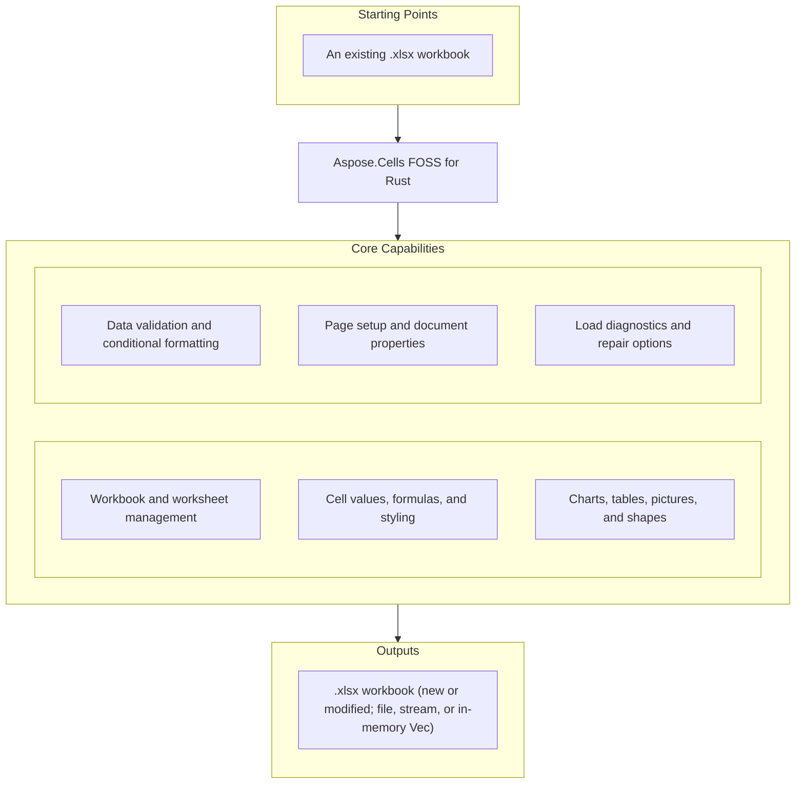

# Aspose.Cells FOSS for Rust

[](https://github.com/aspose-cells-foss/Aspose.Cells-FOSS-for-Rust/actions/workflows/ci.yml) [](LICENSE.txt) [](https://github.com/aspose-cells-foss/Aspose.Cells-FOSS-for-Rust/graphs/contributors)

[](https://products.aspose.org/cells/rust/)

Aspose.Cells FOSS for Rust is a free, open-source, **pure-Rust** spreadsheet library that
reads and writes Excel `.xlsx` (Office Open XML / SpreadsheetML) workbooks. It exposes an
API modeled after Aspose.Cells — the familiar
`Workbook` / `Worksheet` / `Cells` object model — with no proprietary runtime and no
external Aspose dependency.

## Navigation

- [At a Glance](#at-a-glance)
- [Key Capabilities](#key-capabilities)
- [Installation](#installation)
- [Quick Start](#quick-start)
- [Additional Examples](#additional-examples)
- [API Reference](#api-reference)
- [Documentation & Resources](#documentation--resources)
- [Scope and Limitations](#scope-and-limitations)
- [Development and Testing](#development-and-testing)
- [License](#license)

## At a Glance



## Key Capabilities

- Create workbooks from scratch with `Workbook::new()`, or load existing files with
  `Workbook::load_xlsx`, `load_xlsx_from_stream`, or `load_xlsx_from_bytes`.
- Manage worksheets through `get_worksheets_mut()` / `get_worksheets()` — add, rename,
  reorder, hide, and look sheets up by name or index.
- Read and write cell values with typed setters (`put_value_string`, `put_value_i32`,
  `put_value_bool`, `put_value_decimal`, `put_value_date_time`) and typed getters
  (`display_string_value`, `value_type`, `int_value`, `double_value`, ...), addressed by
  A1 notation (`cells.get("A1")`) or row/column index (`cells.get_by_index(row, col)`).
- Write formulas with cached results via `put_formula_with_cached_value`.
- Apply cell styling — fonts, fills, borders, number formats, and horizontal/vertical
  alignment — through `CellStyle` / `Style`, `Font`, `Fill`, and `Borders`.
- Size and manage rows and columns, and merge cell ranges.
- Configure data validation (`Validation`: list, decimal, custom rules) and conditional
  formatting (`FormatCondition`: cell-value, expression, color-scale, data-bar, icon-set).
- Add column and line charts (`Chart`, `ChartType`), Excel tables (`ListObject`), auto
  filters (`AutoFilter`), and sparklines (`SparklineGroup`).
- Add hyperlinks, workbook/sheet-scoped defined names, cell comments, embedded pictures,
  and auto-shapes.
- Configure page setup — margins, orientation, paper size, headers/footers, print area,
  and page breaks — plus core/extended document properties.
- Save to a path, stream, or in-memory `Vec<u8>` with `save`, `save_to_stream_with_format`,
  or `save_xlsx_to_bytes`.
- Inspect `LoadDiagnostics` and opt into repair (`try_repair_package`, `try_repair_xml`)
  when loading imperfect XLSX files.

## Installation

A crates.io package has not been published yet. Install directly from the git repository:

```toml
# Cargo.toml
[dependencies]
aspose-cells-foss-rust = { git = "https://github.com/aspose-cells-foss/Aspose.Cells-FOSS-for-Rust" }
```

When developing against a local clone instead, use a Cargo path dependency in place of the
git URL (`aspose-cells-foss-rust = { path = "../Aspose.Cells-FOSS-for-Rust" }`).

Requires a recent stable Rust toolchain (2021 edition). The `.xlsx` OOXML packaging is
implemented from scratch on top of a small set of general-purpose crates: `zip`, `roxmltree`,
`chrono`, `sha2`/`base64`/`getrandom`, and `serde_json`. The library is imported as
`aspose_cells_foss_rust`:

```rust
use aspose_cells_foss_rust::*;
```

## Quick Start

Create a workbook, write cell values and a formula, save it, then load it back:

```rust
use aspose_cells_foss_rust::{CellValue, Workbook};
use std::error::Error;

fn main() -> Result<(), Box<dyn Error>> {
    // Create a new workbook (starts with one sheet, "Sheet1").
    let mut workbook = Workbook::new();
    {
        let mut worksheets = workbook.get_worksheets_mut();
        let sheet = worksheets.get(0)?;
        let mut cells = sheet.get_cells_mut();

        cells.get("A1")?.put_value_string("Hello")?;
        cells.get("B1")?.put_value_i32(123)?;
        cells.get("C1")?.put_value_bool(true)?;
        cells.get("D1")?.put_value_decimal(12.5)?;
        cells.get("F1")?.put_value_i32(10)?;
        cells.get("G1")?
            .put_formula_with_cached_value("=F1*2", CellValue::Number(20.0))?;
    }
    workbook.save("hello.xlsx")?;

    // Load it back.
    let loaded = Workbook::load_xlsx("hello.xlsx")?;
    let sheet = loaded.worksheet("Sheet1")?;
    let cells = sheet.get_cells();
    println!("A1 = {}", cells.get("A1")?.display_string_value());

    Ok(())
}
```

## Additional Examples

Runnable, self-contained versions of these and more live in
[`samples/`](samples/) — see [samples/README.md](samples/README.md) for the full list.
Common operations are collected below.

### Load With Repair Options

```rust
use aspose_cells_foss_rust::{LoadOptions, Workbook};

let options = LoadOptions {
    try_repair_package: true,
    try_repair_xml: true,
    ..LoadOptions::default()
};

let loaded = Workbook::load_xlsx_with_options("workbook.xlsx", &options)?;
println!(
    "Loaded workbook with {} worksheet(s) and {} diagnostic issue(s).",
    loaded.get_worksheets().count(),
    loaded.get_load_diagnostics().issues().len()
);
```

<details>
<summary>View Additional Examples</summary>

### Charts

```rust
use aspose_cells_foss_rust::{ChartType, Workbook};

let mut workbook = Workbook::new();
let mut worksheets = workbook.get_worksheets_mut();
let sheet = worksheets.get(0)?;
sheet.set_name("Charts")?;

let mut charts = sheet.get_charts();
charts.add(ChartType::Column, "Charts!$B$1:$B$13".to_string(), 0, 4, 18, 8)?;
charts.add(ChartType::Line, "Charts!$C$1:$C$13".to_string(), 0, 9, 18, 13)?;
```

### Data Validation

```rust
use aspose_cells_foss_rust::{CellArea, ValidationType, Workbook};

let mut workbook = Workbook::new();
let mut worksheets = workbook.get_worksheets_mut();
let sheet = worksheets.get(0)?;
let mut validations = sheet.get_validations();

let list_index = validations.add(CellArea::create_cell_area_a1("A1", "A3")?)?;
let mut list_validation = validations.get(list_index).expect("validation should exist");
list_validation.set_type(ValidationType::List);
list_validation.set_formula1("\"Open,Closed\"");
list_validation.set_in_cell_drop_down(true);
list_validation.set_error_title("Invalid");
list_validation.set_error_message("Choose from the list");
```

### Conditional Formatting

```rust
use aspose_cells_foss_rust::{CellArea, FormatConditionType, OperatorType, Workbook};

let mut workbook = Workbook::new();
let mut worksheets = workbook.get_worksheets_mut();
let sheet = worksheets.get(0)?;
let mut collections = sheet.get_conditional_formattings();

let between_index = collections.add();
let mut between = collections.get(between_index).expect("collection should exist");
between.add_area(CellArea::create_cell_area_a1("A1", "A10")?)?;
let rule_index =
    between.add_condition_with_details(FormatConditionType::CellValue, OperatorType::Between, "3", "7");
let mut rule = between.get(rule_index).expect("rule should exist");
rule.set_priority(1)?;
rule.set_stop_if_true(true);
```

### Hyperlinks and Defined Names

```rust
use aspose_cells_foss_rust::Workbook;

let mut workbook = Workbook::new();
let mut worksheets = workbook.get_worksheets_mut();
let sheet = worksheets.get(0)?;
sheet.get_cells_mut().get("A1")?.put_value_string("Docs")?;

let mut hyperlinks = sheet.get_hyperlinks();
let index = hyperlinks.add("A1", 1, 1, "https://example.com/docs?q=1")?;
let mut link = hyperlinks.get(index).expect("hyperlink should exist");
link.set_text_to_display("Docs");
link.set_screen_tip("External docs");

let mut defined_names = workbook.get_defined_names();
defined_names.add("GlobalRange", "='Sheet1'!$A$1:$D$5")?;
```

### Cell Comments

```rust
use aspose_cells_foss_rust::Workbook;

let mut workbook = Workbook::new();
let mut worksheets = workbook.get_worksheets_mut();
let sheet = worksheets.get(0)?;

let mut comments = sheet.get_comments();
let index = comments.add_a1("A3")?;
let mut comment = comments.get(index).expect("comment should exist");
comment.set_author("Sarah");
comment.set_note("Waiting for database schema approval");
comment.set_is_visible(true);
comment.set_width(180.0)?;
comment.set_height(90.0)?;
```

### Excel Tables (List Objects)

```rust
use aspose_cells_foss_rust::{TableStyleType, TotalsCalculation, Workbook};

let mut workbook = Workbook::new();
let mut worksheets = workbook.get_worksheets_mut();
let sheet = worksheets.get(0)?;

let mut tables = sheet.get_list_objects();
let table_index = tables.add_a1("A1", "D5", true)?;
let mut table = tables.get(table_index as usize).expect("table should exist");
table.set_display_name("Products")?;
table.set_table_style_type(TableStyleType::TableStyleMedium2);
table.set_show_totals(true);

let mut columns = table.get_list_columns();
columns.get(3).expect("column should exist").set_totals_calculation(TotalsCalculation::Sum);
```

### Pictures and Shapes

```rust
use aspose_cells_foss_rust::{AutoShapeType, Workbook};

let mut workbook = Workbook::new();
let mut worksheets = workbook.get_worksheets_mut();
let sheet = worksheets.get(0)?;

// Raw bytes of a PNG, JPEG, GIF, or BMP image — typically loaded with
// `std::fs::read("logo.png")?` or `include_bytes!("logo.png")`. A minimal
// 1x1 PNG is inlined here so the snippet is self-contained.
let image_bytes: Vec<u8> = vec![
    0x89, 0x50, 0x4E, 0x47, 0x0D, 0x0A, 0x1A, 0x0A, 0x00, 0x00, 0x00, 0x0D, 0x49, 0x48, 0x44,
    0x52, 0x00, 0x00, 0x00, 0x01, 0x00, 0x00, 0x00, 0x01, 0x08, 0x06, 0x00, 0x00, 0x00, 0x1F,
    0x15, 0xC4, 0x89, 0x00, 0x00, 0x00, 0x0D, 0x49, 0x44, 0x41, 0x54, 0x78, 0xDA, 0x63, 0x64,
    0xF8, 0x0F, 0x00, 0x01, 0x05, 0x01, 0x01, 0x27, 0x18, 0xE3, 0x66, 0x00, 0x00, 0x00, 0x00,
    0x49, 0x45, 0x4E, 0x44, 0xAE, 0x42, 0x60, 0x82,
];

// Embed a picture from raw image bytes.
let mut pictures = sheet.get_pictures();
let picture_index = pictures.add(1, 4, 3, 6, image_bytes)?;
pictures.get(picture_index).expect("picture should exist").set_name("Product Logo");

// Draw an auto-shape.
let mut shapes = sheet.get_shapes();
let shape_index = shapes.add(0, 2, 2, 3, AutoShapeType::Rectangle)?;
shapes.get(shape_index).expect("shape should exist").set_name("Rectangle Box");
```

### Page Setup

```rust
use aspose_cells_foss_rust::{PageOrientationType, PaperSizeType, Workbook};

let mut workbook = Workbook::new();
let mut worksheets = workbook.get_worksheets_mut();
let sheet = worksheets.get(0)?;

let page_setup = sheet.get_page_setup_mut();
page_setup.set_orientation(PageOrientationType::Landscape);
page_setup.set_paper_size(PaperSizeType::PaperA4);
page_setup.set_print_area("$A$1:$C$10");
page_setup.set_fit_to_pages_wide(Some(1))?;
page_setup.set_fit_to_pages_tall(Some(2))?;
```

### Worksheet Visibility and Protection

```rust
use aspose_cells_foss_rust::{Color, VisibilityType, Workbook};

let mut workbook = Workbook::new();
let mut worksheets = workbook.get_worksheets_mut();
let sheet = worksheets.get(0)?;

sheet.set_visibility_type(VisibilityType::Hidden);
sheet.set_tab_color(Color::from_argb(255, 34, 68, 102));
sheet.set_zoom(85)?;
sheet.protect();

let protection = sheet.get_protection_mut();
protection.set_format_cells(true);
protection.set_select_locked_cells(true);
```

</details>

## API Reference

The library is imported as `aspose_cells_foss_rust`. The primary entry point is
`Workbook`, which creates, loads, and saves an XLSX workbook and exposes its worksheet
collection.

<details>
<summary>View the Core Public API Surface</summary>

### Core API

#### Structs

| Struct | Description |
|---|---|
| `AlignmentValue` | Internal, field-less value struct for cell alignment state; exposes only a `clone()` method (its fields are private to the crate's serialization layer). |
| `AutoFilter` | Represents auto filter. |
| `AutoFilterColorFilter` | Represents auto filter color filter. |
| `AutoFilterColorFilterModel` | Internal autofilter color-filter state model; exposes a `clear()` method to reset its (crate-private) filter fields. |
| `AutoFilterCustomFilter` | Represents auto filter custom filter. |
| `AutoFilterCustomFilterCollection` | Represents a collection of auto filter custom filter objects. |
| `AutoFilterCustomFilterModel` | Struct extending Default. |
| `AutoFilterDynamicFilter` | Represents auto filter dynamic filter. |
| `AutoFilterDynamicFilterModel` | Internal autofilter dynamic-filter (e.g. "above average") state model; exposes a `clear()` method to reset its filter value. |
| `AutoFilterModel` | Internal autofilter state model; exposes `clear()` and `has_stored_state()` to reset and query whether any filter criteria are set. |
| `AutoFilterSortCondition` | Represents auto filter sort condition. |
| `AutoFilterSortConditionCollection` | Represents a collection of auto filter sort condition objects. |
| `AutoFilterSortConditionModel` | Struct extending Default. |
| `AutoFilterSortState` | Represents auto filter sort state. |
| `AutoFilterSortStateModel` | Internal autofilter sort-state model; exposes `clear()` and `has_stored_state()` to reset and query the stored sort/filter fields. |
| `AutoFilterTop10` | Represents auto filter top10. |
| `AutoFilterTop10Model` | Internal autofilter "Top 10" filter state model; exposes a `clear()` method to reset its threshold/percent fields. |
| `Border` | Represents border. |
| `BorderSideValue` | Internal, field-less value struct for one cell-border side's style/color state; exposes only a `clone()` method. |
| `Borders` | Represents borders. |
| `BordersValue` | Internal, field-less value struct grouping the four `BorderSideValue`s of a cell format; exposes only a `clone()` method. |
| `CalculationProperties` | Represents calculation properties. |
| `CalculationPropertiesModel` | Internal workbook calculation-settings model (iterative calculation, calc mode, etc.); exposes `copy_from()` and `has_stored_state()`. |
| `Cell` | Represents a single worksheet cell and exposes value, formula, and style operations. |
| `CellArea` | Represents cell area. |
| `CellFormatValue` | Struct extending Default. |
| `CellMut` | Represents a single worksheet cell and exposes value, formula, and style operations. |
| `CellRange` | A rectangular range of cells, defined by `start` and `end` `CellRef` coordinates. |
| `CellRecord` | Struct extending Default. |
| `CellRef` | A zero-based `(row, column)` cell coordinate pair. |
| `CellStyle` | Represents a mutable cell style facade that can be applied to one or more cells. |
| `Cells` | Provides access to worksheet cells, rows, columns, and merged ranges. |
| `CellsException` | Represents an error that occurs during cells. |
| `CellsMut` | Provides access to worksheet cells, rows, columns, and merged ranges. |
| `Chart` | Represents a chart embedded in a worksheet. |
| `ChartCollection` | Represents collection of charts on a worksheet. |
| `ChartCompanionFile` | Struct extending Default. |
| `ChartModel` | Struct extending Default. |
| `ChartXmlTemplates` | Internal helper that builds the raw DrawingML/Chart XML (namespaces, header/footer, series, axes) used when serializing a `Chart` to XLSX. |
| `Color` | Represents color. |
| `ColorValue` | An RGBA color value (`a`, `r`, `g`, `b` byte fields) used throughout the styling model. |
| `Column` | Represents column. |
| `ColumnMut` | Represents column. |
| `ColumnProperties` | Encapsulates a single worksheet and its supported v0.1 worksheet features. |
| `ColumnRangeModel` | Struct extending Default. |
| `Columns` | Represents a collection of column objects. |
| `ColumnsMut` | Represents a collection of column objects. |
| `Comment` | Represents a worksheet comment (legacy note) anchored to a single cell. |
| `CommentCollection` | Represents the collection of comments (legacy notes) on a worksheet. |
| `CommentModel` | Struct extending Default. |
| `ConditionalFormattingCollection` | Represents a collection of conditional formatting objects. |
| `ConditionalFormattingModel` | Struct extending Debug. |
| `CoreDocumentProperties` | Represents core document properties. |
| `CoreDocumentPropertiesModel` | Internal core document-properties (title, author, etc.) state model; exposes `copy_from()` and `has_stored_state()`. |
| `DefinedName` | Represents defined name. |
| `DefinedNameCollection` | Represents a collection of defined name objects. |
| `DefinedNameModel` | Struct extending Default. |
| `DefinedNameUtility` | Utility for validating and normalizing defined names and formulas, including Excel's reserved `_xlnm.*` names (`PRINT_AREA_DEFINED_NAME`, etc.). |
| `DiagnosticBag` | Collects `DiagnosticEntry` load/save diagnostic messages via its `add()` method and `_entries` list. |
| `DiagnosticEntry` | Struct extending Default. |
| `DisplayFormatSectionInfo` | Struct extending Default. |
| `DisplayTextDateFormatSupport` | Internal helper for rendering a cell's date/time value into display text per an Excel date-time format code (year/month/day/AM-PM tokens). |
| `DisplayTextFormatter` | Internal helper that formats a cell's raw value (boolean, string, cached formula result) into its Excel display text. |
| `DisplayTextFormatterSupport` | Internal helper for selecting and evaluating the correct positive/negative/zero/text section of a multi-section Excel number format. |
| `DisplayTextLocaleSupport` | Internal helper for parsing and applying locale directives (e.g. `[$-0409]`, `[$-F800]`) embedded in Excel format strings. |
| `DocumentProperties` | Represents document properties. |
| `DocumentPropertiesModel` | Internal document-properties container combining core and extended property models; exposes `copy_from()` and `has_stored_state()`. |
| `ExtendedDocumentProperties` | Represents extended document properties. |
| `ExtendedDocumentPropertiesModel` | Internal extended document-properties (application, company, etc.) state model; exposes `copy_from()` and `has_stored_state()`. |
| `ExternalLinkModel` | Struct extending Default. |
| `Fill` | Represents a mutable cell style facade that can be applied to one or more cells. |
| `FillValue` | Struct extending Default. |
| `FilterColumn` | Represents filter column. |
| `FilterColumnCollection` | Represents a collection of filter column objects. |
| `FilterColumnModel` | Internal autofilter column state model; exposes `clear_criteria()` and `has_stored_state()`. |
| `FilterValueCollection` | Represents a collection of filter value objects. |
| `Font` | Represents font. |
| `FontValue` | Internal, field-less value struct for a font's style state; exposes only a `clone()` method. |
| `FormatCondition` | Represents format condition. |
| `FormatConditionCollection` | Represents a collection of format condition objects. |
| `FormatConditionModel` | Internal conditional-formatting rule model holding the condition type, operator, formulas, and color-scale/data-bar/icon-set fields for one rule. |
| `FormulaException` | Represents an error that occurs during formula. |
| `FreezePane` | Encapsulates a single worksheet and its supported v0.1 worksheet features. |
| `Hyperlink` | Represents hyperlink. |
| `HyperlinkCollection` | Encapsulates the hyperlinks defined for a worksheet. |
| `HyperlinkModel` | Struct extending Default. |
| `IListObjectOwner` | Struct extending Default. |
| `IPackageReader` | Struct extending Default. |
| `IPackageWriter` | Struct extending Default. |
| `InvalidFileFormatException` | Represents an error that occurs during invalid file format. |
| `ListColumn` | Represents a single column in an Excel table. |
| `ListColumnCollection` | Represents the ordered collection of columns in an Excel table. |
| `ListColumnModel` | Struct extending Default. |
| `ListObject` | Represents an Excel table (structured reference / ListObject). |
| `ListObjectCollection` | Represents the collection of Excel tables on a worksheet. |
| `ListObjectModel` | Struct extending Default. |
| `ListObjectSupport` | Internal validation helper for `ListObject` (Excel table) ranges and names -- range bounds, display-name uniqueness, and overlap checks. |
| `LoadDiagnostics` | Represents load diagnostics. |
| `LoadIssue` | Represents load issue. |
| `LoadOptions` | Specifies how a workbook should be loaded. |
| `MergeRegion` | Struct extending Default. |
| `MissingPartException` | Struct extending Default. |
| `NumberFormat` | Provides number format operations. |
| `NumberFormatValue` | Internal, field-less value struct for a number-format code's state; exposes only a `clone()` method. |
| `PackageLoadContext` | Struct extending Default. |
| `PackageModel` | Struct extending Default. |
| `PackagePartDescriptor` | Struct extending Default. |
| `PackageStructureException` | Struct extending Default. |
| `PackagingConventions` | Struct extending Default. |
| `PageSetup` | Represents worksheet print and page-layout settings. |
| `Picture` | Represents a picture (image) anchored to a worksheet. |
| `PictureCollection` | Represents collection of pictures anchored to a worksheet. |
| `PictureModel` | Struct extending Default. |
| `ProtectionValue` | Internal, field-less value struct for a cell's locked/hidden protection state; exposes only a `clone()` method. |
| `RelationshipDescriptor` | Struct extending Default. |
| `RelationshipResolutionException` | RelationshipResolutionException is thrown when the library cannot resolve a package relationship during load or save. |
| `Row` | Represents row. |
| `RowModel` | Struct extending Default. |
| `RowMut` | Represents row. |
| `RowProperties` | Encapsulates a single worksheet and its supported v0.1 worksheet features. |
| `Rows` | Represents a collection of row objects. |
| `RowsMut` | Represents a collection of row objects. |
| `SaveOptions` | Specifies how a workbook should be saved. |
| `Shape` | Represents a drawing object (auto shape) anchored to a worksheet. |
| `ShapeCollection` | Represents collection of drawing objects (shapes) on a worksheet. |
| `ShapeImageModel` | Struct extending Default. |
| `ShapeModel` | Struct extending Default. |
| `SharedStringRepository` | Interns and deduplicates shared strings for XLSX serialization, backed by real `_indices`/`_values` fields and `intern()`/`try_get_value()`/`clear()` methods. |
| `SharedStringTableXmlMapper` | Internal reader/writer for the XLSX shared-strings table (`sharedStrings.xml`) part. |
| `SparklineGroup` | A sparkline group contains sparkline items that share type and settings. |
| `SparklineGroupCollection` | Represents a collection of sparkline groups on a worksheet. |
| `StyleException` | Represents an error that occurs during style. |
| `StyleFlag` | Represents flags which indicate applied formatting properties. |
| `StyleRepository` | Internal style-deduplication helper; its `normalize()` method resolves a `StyleValue` to its canonical, deduplicated form. |
| `StyleValue` | Internal, field-less value struct for a cell format's combined style state; exposes only a `clone()` method. |
| `StyleValueSanitizer` | Internal helper that clamps/normalizes raw style values (indent level, text rotation, reading order) to their valid Excel ranges. |
| `StylesheetLoadContext` | Struct extending Default. |
| `StylesheetSaveContext` | Tracks style and differential-style index lookups (`_style_indices`, `_differential_style_indices`) while serializing the XLSX stylesheet part. |
| `StylesheetXmlMapper` | Internal reader/writer for the XLSX stylesheet (`styles.xml`) part. |
| `UnsupportedFeatureException` | Represents an error that occurs during unsupported feature. |
| `Validation` | Represents validation. |
| `ValidationCollection` | Represents a collection of validation objects. |
| `ValidationMessage` | Struct extending Default. |
| `ValidationModel` | Internal data-validation rule model with real fields for `areas`, `validation_type`, `alert_style`, `operator`, and the rule's formulas/messages. |
| `WarningInfo` | Represents warning info. |
| `Workbook` | Represents the root spreadsheet object used to create, load, modify, and save an XLSX workbook. |
| `WorkbookLoadException` | Represents an error that occurs during workbook load. |
| `WorkbookModel` | Struct extending Default. |
| `WorkbookProperties` | Represents workbook properties. |
| `WorkbookPropertiesModel` | Internal workbook-level properties (date1904, etc.) state model; exposes `copy_from()` and `has_workbook_properties_state()`. |
| `WorkbookProtection` | Represents workbook protection. |
| `WorkbookProtectionModel` | Internal workbook protection (structure/windows lock) state model; exposes `copy_from()` and `has_stored_state()`. |
| `WorkbookSaveException` | Represents an error that occurs during workbook save. |
| `WorkbookSettings` | Represents workbook-level settings that affect date handling and display formatting. |
| `WorkbookSettingsModel` | Struct extending Default. |
| `WorkbookValidator` | Validates a workbook model before save; `validate_for_save()` returns the list of `ValidationMessage`s found. |
| `WorkbookView` | Represents workbook view. |
| `WorkbookViewModel` | Internal workbook window-view state model (active sheet, tab selection, etc.); exposes `copy_from()` and `has_stored_state()`. |
| `WorkbookXmlMapper` | Internal reader/writer for the XLSX workbook (`workbook.xml`) part. |
| `Worksheet` | Encapsulates a single worksheet and its supported v0.1 worksheet features. |
| `WorksheetDefinedNamesState` | Struct extending Default. |
| `WorksheetModel` | Struct extending Default. |
| `WorksheetProtection` | Represents worksheet protection. |
| `WorksheetProtectionModel` | Internal worksheet protection state model; exposes `clear()` and `has_stored_state()`. |
| `WorksheetViewModel` | Struct extending Default. |
| `WorksheetXmlMapper` | Internal reader/writer for a worksheet's XLSX (`sheetN.xml`) part. |
| `Worksheets` | Encapsulates the workbook's worksheets and active-sheet state. |
| `WorksheetsMut` | Encapsulates the workbook's worksheets and active-sheet state. |
| `XlsxWorkbookCommentsLoader` | Internal loader for a worksheet's legacy VML/notes comments from its XLSX package parts (`load_comments()`, `load_vml_drawing()`). |
| `XlsxWorkbookDefinedNames` | Internal builder/loader for a workbook's defined names, including autofilter- and page-setup-derived names (`build_defined_names()`, `load_workbook_defined_names()`). |
| `XlsxWorkbookPicturesLoader` | Internal loader for worksheet pictures and shapes from XLSX drawing parts, covering both one-cell and two-cell anchor layouts. |
| `XlsxWorkbookProperties` | Internal builder/loader for workbook-level XML elements -- properties, protection, book views, and calculation settings. |
| `XlsxWorkbookStylesValueHelpers` | Internal helpers that convert between Excel style enum values (border style, alignment, color) and their XLSX XML string representations. |
| `XlsxWorkbookStylesXml` | Internal builder/reader for the XLSX stylesheet document -- fonts, fills, borders, cell formats, and differential formats. |
| `XlsxWorkbookWorksheetProtection` | Internal builder/loader for a worksheet's `<sheetProtection>` XML element. |
| `XlsxWorkbookWorksheetViews` | Internal builder/loader for a worksheet's sheet-properties and view/pane XML elements. |
| `XmlParsingException` | Struct extending Default. |

#### Enumerations

| Enumeration | Description |
|---|---|
| `AutoShapeType` | Specifies the type of an auto shape (preset geometry). |
| `BorderLineStyle` | Represents border. |
| `BorderStyle` | Enum with 14 members. |
| `BorderStyleType` | Specifies border style type. |
| `CellObjectValue` | Enum with 14 methods and 5 members. |
| `CellValue` | Enum with 8 methods and 7 members. |
| `CellValueKind` | Enum with 7 members. |
| `CellValueType` | Specifies cell value type. |
| `CellsError` | Enum with 9 methods and 10 members. |
| `ChartType` | Specifies the chart type. |
| `DateSystem` | Enum with 2 members. |
| `DiagnosticSeverity` | Enum with 4 members. |
| `FillPattern` | Specifies fill pattern. |
| `FillPatternKind` | Enum with 18 members. |
| `FilterOperatorType` | Represents FilterOperatorType. |
| `FontUnderlineType` | Enumerates font underline types. |
| `FormatConditionType` | Specifies format condition type. |
| `HorizontalAlignment` | Enum with 8 members. |
| `ImageType` | Represents the format of an image stored in a worksheet. |
| `LoadFormat` | Specifies load format. |
| `OperatorType` | Specifies operator type. |
| `PageOrientation` | Enum with 1 method and 3 members. |
| `PageOrientationType` | Specifies page orientation type. |
| `PaperSizeType` | Specifies paper size type. |
| `SaveFormat` | Specifies save format. |
| `SheetVisibility` | SheetVisibility enum defines three visibility states: Visible, Hidden, and VeryHidden. |
| `SparklineType` | Represents SparklineType. |
| `TableStyleType` | Represents the built-in Excel table style types. |
| `TargetModeType` | Specifies target mode type. |
| `TotalsCalculation` | Represents the aggregation function shown in a table totals row cell. |
| `ValidationAlertType` | Specifies validation alert type. |
| `ValidationMessageSeverity` | Enum with 3 members. |
| `ValidationType` | Specifies validation type. |
| `VerticalAlignment` | Enum with 5 members. |
| `VisibilityType` | Specifies visibility type. |

#### Traites

| Class | Description |
|---|---|
| `IWarningCallback` | Defines a callback that receives load warnings. |

---

#### Detailed Member Reference

### Workbook and Worksheets

- `Workbook`
  - `new() -> Self`
  - `load_xlsx(path)`, `load_xlsx_from_stream(stream)`, `load_xlsx_from_bytes(bytes)`,
    and `*_with_options` variants that accept `LoadOptions`
  - `add_worksheet(name)`, `worksheet(name)`, `worksheet_at(index)`
  - `get_worksheets() -> Worksheets`, `get_worksheets_mut() -> WorksheetsMut`
  - `save(path)`, `save_with_format(path, format)`, `save_xlsx_to_stream(stream)`,
    `save_xlsx_to_bytes() -> Result<Vec<u8>, CellsError>`
  - `get_document_properties()` / `_mut()`, `get_defined_names()`
  - `protect()`, `unprotect()`, `get_protection()` / `_mut()`
  - `get_load_diagnostics() -> &LoadDiagnostics`
- `Worksheet`
  - `get_name()`, `set_name(name)`, `get_visibility_type()`, `set_visibility_type(value)`
  - `get_cells() -> Cells`, `get_cells_mut() -> CellsMut`
  - `get_page_setup()` / `_mut()`, `get_auto_filter()`, `get_hyperlinks()`,
    `get_comments()`, `get_pictures()`, `get_shapes()`, `get_charts()`,
    `get_list_objects()`, `get_sparkline_groups()`, `get_validations()`,
    `get_conditional_formattings()`, `get_rows()` / `_mut()`, `get_columns()` / `_mut()`
  - `freeze_panes(row_split, column_split)`, `protect()`, `get_protection_mut()`

### Cells and Values

- `Cells` / `CellsMut`
  - `get(address) -> Cell` (A1 notation), `get_by_index(row, column) -> Cell`
  - `rows()`, `columns()`, `merged_cells() -> Vec<CellArea>`, `count()`
  - `CellsMut` additionally exposes `set_style(value)` and
    `merge(first_row, first_column, total_rows, total_columns)` to merge a
    rectangular cell region
- `Cell`
  - `value()`, `value_type()`, `int_value()`, `double_value()`, `bool_value()`,
    `date_time_value()`, `string_value()`, `display_string_value()`,
    `formatted_string_value()`, `get_style() -> Style`, `formula_cached_value()`
  - Mutating counterparts on `CellMut`: `put_value_string`, `put_value_i32`,
    `put_value_bool`, `put_value_decimal`, `put_value_date_time`,
    `put_formula_with_cached_value(formula, cached_value)`
- `CellValue` — `String`, `Number`, `Bool`, `DateTime`, `Formula`, `Error`, `Empty`
- `CellArea` — `create_cell_area(...)`, `create_cell_area_a1(start, end)`

### Styling

- `CellStyle` (alias `Style`) — number formats, `get_horizontal_alignment()` /
  `set_horizontal_alignment(value)`, `get_font_mut() -> &mut Font`,
  `get_fill()` / `set_fill(fill)`, `get_borders()` / `_mut()`
- `Font` — name, size, color, bold/italic/underline/strikethrough
- `Fill`, `FillPattern` — pattern fills and colors
- `Borders`, `Border`, `BorderLineStyle` — per-side border styling

### Charts, Tables, and Drawings

- `Chart`, `ChartType` (`Column`, `Line`, ...), `ChartCollection`
- `ListObject`, `ListColumn`, `TableStyleType`, `TotalsCalculation`
- `Picture`, `PictureCollection`; `Shape`, `AutoShapeType`, `ShapeCollection`
- `SparklineGroup`, `SparklineType`
- `AutoFilter`, `FilterColumn`, `FilterOperatorType`

### Validation and Formatting Rules

- `Validation`, `ValidationType`, `ValidationAlertType`, `ValidationCollection`
- `FormatCondition`, `FormatConditionType`, `FormatConditionCollection`

### Hyperlinks, Names, and Comments

- `Hyperlink`, `HyperlinkCollection`
- `DefinedName`, `DefinedNameCollection`
- `Comment`, `CommentCollection`

### Page Setup and Document Properties

- `PageSetup` — margins, `set_orientation(PageOrientationType)`,
  `set_paper_size(PaperSizeType)`, `set_print_area(range)`, page breaks
- `DocumentProperties`, `CoreDocumentProperties`, `ExtendedDocumentProperties`

### Load, Save, and Diagnostics

- `LoadOptions` — `load_format`, `strict_mode`, `try_repair_package`, `try_repair_xml`,
  `preserve_unsupported_parts`
- `LoadDiagnostics`, `LoadIssue`, `DiagnosticSeverity`
- `SaveOptions` — `save_format`, `use_shared_strings`, `validate_before_save`,
  `compact_styles`, `preserve_recovery_metadata`
- `LoadFormat` — `Auto` (default), `Xlsx`; `SaveFormat` — currently exposes only `Xlsx`

### Errors

- `CellsError` — `SheetNotFound`, `InvalidSheetName`, `InvalidCellReference`,
  `IndexOutOfRange`, `Io`, `OverlappingMergedRange`, `Unsupported`, and more
- `CellsException`, `WorkbookLoadException`, `WorkbookSaveException`,
  `InvalidFileFormatException`, `FormulaException`, `StyleException`,
  `UnsupportedFeatureException`

</details>

## Documentation & Resources

- **[Getting started guide](https://docs.aspose.org/cells/rust/)** — installation, walkthroughs, and feature guides for this library.
- **[How-to guides & FAQ](https://kb.aspose.org/cells/rust/)** — task-focused answers for common XLSX-processing questions.
- **[Full API reference](https://reference.aspose.org/cells/rust/)** — the complete, browsable reference for all 213 public types (the [API reference](#api-reference) section above covers the essentials).
- **[Contributor notes](AGENTS.md)** — architecture and conventions for contributors.
- Found a bug or have a feature request? [Open an issue](https://github.com/aspose-cells-foss/Aspose.Cells-FOSS-for-Rust/issues) on GitHub.

## Scope and Limitations

- This is an early-stage, evolving library: the public API surface is broad, but not
  everything Aspose.Cells supports is implemented, and some features are partial.
- Only the XLSX file format is supported for both loading and saving — `LoadFormat` and
  `SaveFormat` currently expose only an `Xlsx` variant, so other spreadsheet formats (XLS,
  XLSB, ODS, CSV) and non-spreadsheet export formats are out of scope.

These limitations don't apply to the commercial [Aspose.Cells — Enterprise Edition](https://products.aspose.com/cells/)
product family, which adds full XLS, XLSB, ODS, and CSV load/save support alongside XLSX,
additional export formats (PDF, HTML, and image formats), and complete coverage of Aspose.Cells'
formula engine and formatting feature set.

## Development and Testing

Build and check the crate from a local checkout:

```bash
cargo build
cargo check --all-targets
cargo fmt --all --check
cargo clippy --all-targets
```

<details>
<summary>Samples, CI, and API Docs</summary>

The repository currently has no unit/integration test suite — `cargo test --all-targets`
reports 0 tests. The [`samples/`](samples/) binaries are the de-facto verification suite:
each one creates a workbook, saves it, loads it back, and prints what it read. Generated
workbooks are written under `output/samples/` in the repository root. After a change that
touches the read/write path, run the relevant sample and confirm it still round-trips:

```bash
cargo run --bin sample_basic
cargo run --bin sample_loading
cargo run --bin sample_styles
```

CI ([`ci.yml`](.github/workflows/ci.yml)) runs `cargo fmt --all --check`, `cargo check
--all-targets`, `cargo clippy --all-targets`, `cargo test --all-targets`, three sample
smoke tests, and `cargo bench` on Linux x64, Windows x64, macOS ARM, and macOS x64.

Generate local API docs with:

```bash
cargo doc --no-deps --open
```

Published API docs are deployed by GitHub Pages through
[`pages.yml`](.github/workflows/pages.yml) — after enabling Settings → Pages → GitHub Actions in
the repository, pushes to `main`/`master` automatically rebuild and publish the rustdoc site.

</details>

## License

This project is licensed under the [MIT License](LICENSE.txt). The MIT License permits
use, copying, modification, distribution, sublicensing, and commercial use, provided its
copyright and permission notice are retained. The software is provided without warranty.
