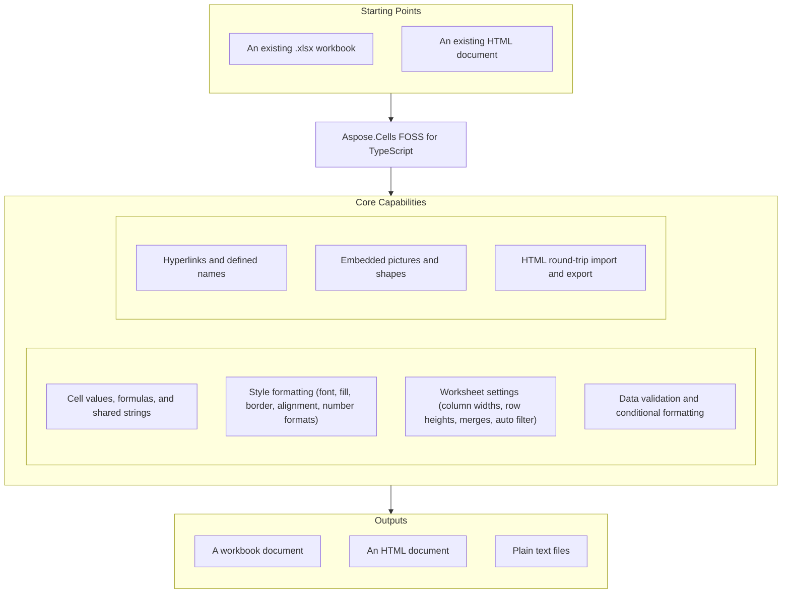

# Aspose.Cells FOSS for TypeScript

[](License/LICENSE.txt) [](https://github.com/aspose-cells-foss/Aspose.Cells-FOSS-for-TypeScript/graphs/contributors)

[](https://products.aspose.org/cells/typescript/)

Aspose.Cells FOSS for TypeScript is a free, open-source TypeScript library for creating,
loading, editing, and saving Excel `.xlsx` (Office Open XML / SpreadsheetML) workbooks
without requiring Microsoft Excel. It exposes an Aspose.Cells-compatible API surface —
`Workbook`, `Worksheet`, `Cell`, `Style` — and additionally reads and writes HTML, and
exports to CSV, JSON, and Markdown for reporting and data-interchange scenarios.

## Navigation

- [At a Glance](#at-a-glance)
- [Key Capabilities](#key-capabilities)
- [Installation](#installation)
- [Dependencies](#dependencies)
- [Quick Start](#quick-start)
- [Additional Examples](#additional-examples)
- [API Reference](#api-reference)
- [Documentation & Resources](#documentation--resources)
- [Scope and Limitations](#scope-and-limitations)
- [Development and Testing](#development-and-testing)
- [License](#license)

## At a Glance



## Key Capabilities

- Load and save `.xlsx` workbooks — `Workbook.load(filePath)` reads an existing file
  (auto-detecting HTML too), and `Workbook.save(filePath, options)` writes it back out.
- Read and write cell values, formulas, and shared strings via `Cell.putValue()`/
  `Cell.setFormula()`, with `Worksheet.getCell2()`/`getCell()` lookups by reference or
  coordinate.
- Apply full style formatting — font, fill, border, alignment, and number formats — through
  `Style`, `Font`, `Fill`, `Border`, and `Alignment`, set per cell via `Cell.setStyle()`.
- Configure worksheet-level settings: column widths, row heights, merged cells, auto filter,
  and hidden rows, all through `Worksheet` methods.
- Add hyperlinks and defined names, and apply data validation and conditional formatting
  rules to a range.
- Access embedded pictures and shapes through `Workbook.images` (`ImageInfo[]`) and
  `Worksheet.shapes` (`ShapeInfo[]`).
- Import and export HTML — `Workbook.load()` recognizes `.html`/`.htm` files and converts
  them into a workbook object, and `toHtml()` renders a workbook to a styled HTML document.
- Export a workbook as text — `toCsv()`, `toJson()`, and `toMarkdown()` each return the
  workbook's data as a string, ready to write to a file or hand to another process directly.

## Installation

A npm package has not been published yet. Install from source:

```bash
git clone https://github.com/aspose-cells-foss/Aspose.Cells-FOSS-for-TypeScript.git
cd Aspose.Cells-FOSS-for-TypeScript
npm install
```

## Dependencies

### Required Package Dependencies

- `@zip.js/zip.js` ^2.8.21 — reads and writes the XLSX ZIP container.
- `@xmldom/xmldom` ^0.8.10 — parses and serializes the OOXML part XML.
- `adm-zip` ^0.5.16 — used alongside `@zip.js/zip.js` for ZIP entry handling.

### Native and System Requirements

- Requires Node.js 18 or later and TypeScript 5 or later.

### Development Dependencies

- `@types/node` ^25.3.3, `typescript` ^5.9.3 — TypeScript compilation and type checking.
- `ts-node` ^10.9.2, `tsx` ^4.21.0 — running TypeScript examples/tests directly.

## Quick Start

Create a workbook, write typed values and a formula, style a header row, and save it as
XLSX:

```typescript
import { Workbook, Style } from "./aspose_cells";

const workbook = new Workbook();
const sheet = workbook.worksheets.get(0)!;

sheet.name = "Products";
sheet.putValue("A1", "Product");
sheet.putValue("B1", "Price");
sheet.putValue("A2", "Apple");
sheet.putValue("B2", 2.99);
sheet.putValue("A3", "Orange");
sheet.putValue("B3", 1.99);
const cellB4 = sheet.getCell2("B4");
cellB4.setFormula("=SUM(B2:B3)");

const headerStyle = new Style();
headerStyle.setBold(true);
headerStyle.setFontColor("FFFFFFFF");
headerStyle.setForegroundColor("FF2278D4");

sheet.getCell2("A1").setStyle(headerStyle);
sheet.getCell2("B1").setStyle(headerStyle);

await workbook.save("products.xlsx");
```

Load an existing workbook, update a cell, and save it back:

```typescript
import { Workbook } from "./aspose_cells";

const workbook = await Workbook.load("input.xlsx");
const sheet = workbook.worksheets.get(0)!;

sheet.getCell2("A1").putValue("Updated");

await workbook.save("updated.xlsx");
```

## Additional Examples

Runnable examples for every major feature area are collected in
[`examples/`](examples/), covering the full surface below.

### Export a Workbook to HTML

```typescript
import { Workbook } from "./aspose_cells";

const workbook = await Workbook.load("input.xlsx");
await workbook.save("output.html", { saveFormat: undefined });
```

<details>
<summary>View Additional Examples</summary>

| Example | Shows |
|---|---|
| `examples/cell_values.ts` | Reading and writing cell values and formulas |
| `examples/styles.ts` | Font, fill, border, and alignment styling |
| `examples/data_validation.ts` | Data validation rules on a range |
| `examples/auto_filter.ts` | Auto filter setup on a worksheet |
| `examples/hyperlinks.ts` | Adding hyperlinks to cells |
| `examples/worksheet_management.ts` | Creating, naming, and iterating worksheets |
| `examples/protection.ts` | Workbook and worksheet protection |
| `examples/export.ts` | CSV, JSON, and Markdown export via `toCsv()`/`toJson()`/`toMarkdown()` |
| `examples/html_export.ts` | HTML import and export |

</details>

## API Reference

The library ships a real class surface centered on `Workbook`, `Worksheet`, `Cell`, and
`Style` — `Workbook.worksheets` is a `WorksheetCollection` of `Worksheet` objects, each
exposing a `Cells` collection for reading and writing values, formulas, and styles.

<details>
<summary>View the Full API Surface</summary>

### Core API

| Class | Description |
|---|---|
| `AllConnectorShapeInfo` | Class in the Cells TYPESCRIPT API. |
| `AllShapeInfo` | Class in the Cells TYPESCRIPT API. |
| `ArrowShapeType` | Class in the Cells TYPESCRIPT API. |
| `AutoFilter` | Class with 5 methods and 2 properties. |
| `BasicShapeInfoType` | Class with 1 property. |
| `BasicShapeSubType` | Class in the Cells TYPESCRIPT API. |
| `BentConnectorShapeType` | Class in the Cells TYPESCRIPT API. |
| `BraceShapeType` | Class in the Cells TYPESCRIPT API. |
| `Cell` | A single cell — value, formula, style, and hyperlink. |
| `CellValue` | Class in the Cells TYPESCRIPT API. |
| `CellValue-util` | Class in the Cells TYPESCRIPT API. |
| `Cells` | Per-sheet collection for reading and writing cell values, formulas, and styles. |
| `Chart` | Class with 7 methods and 33 properties. |
| `ChartCollection` | Class with 11 methods and 2 properties. |
| `ChartLoader` | Class with 1 method and 7 properties. |
| `ChartRenderer` | Class with 1 method. |
| `ChartType` | Class in the Cells TYPESCRIPT API. |
| `CircleVariantShapeType` | Class in the Cells TYPESCRIPT API. |
| `Comment` | Class with 2 methods and 7 properties. |
| `CommentCollection` | Class with 6 methods and 1 property. |
| `ConditionalFormat` | Class with 5 methods. |
| `ConditionalFormatCollection` | Class with 5 methods and 1 property. |
| `CurvedConnectorShapeType` | Class in the Cells TYPESCRIPT API. |
| `DOMParser` | Class with 2 methods. |
| `DataRelationship` | Class with 3 methods and 1 property. |
| `DataValidation-validation` | Class with 3 methods and 12 properties. |
| `DataValidationCollection` | Class with 5 methods and 1 property. |
| `EllipseShapeType` | Class in the Cells TYPESCRIPT API. |
| `ExpDrawing` | Class with 9 methods. |
| `HtmlDocument` | Loads and represents an HTML document for conversion into a `Workbook`. |
| `HtmlExporter` | Renders a `Workbook` to a styled HTML document. |
| `HtmlReader` | Reads and parses raw HTML markup into a `HtmlDocument`. |
| `HtmlTable` | Class with 10 methods and 14 properties. |
| `HtmlWriter` | Serializes a `HtmlDocument` back to HTML markup. |
| `Hyperlink` | Class with 2 methods and 8 properties. |
| `HyperlinkCollection` | Class with 6 methods and 1 property. |
| `ImpDrawing` | Class with 1 method and 5 properties. |
| `LineShapeType` | Class in the Cells TYPESCRIPT API. |
| `MathSymbolShapeType` | Class in the Cells TYPESCRIPT API. |
| `PolygonShapeType` | Class in the Cells TYPESCRIPT API. |
| `QuadrilateralShapeType` | Class in the Cells TYPESCRIPT API. |
| `RectangleShapeType` | Class in the Cells TYPESCRIPT API. |
| `RectangleVariantShapeType` | Class in the Cells TYPESCRIPT API. |
| `SealShapeType` | Class in the Cells TYPESCRIPT API. |
| `Shape3DType` | Class in the Cells TYPESCRIPT API. |
| `SpecialShapeType` | Class in the Cells TYPESCRIPT API. |
| `StarShapeType` | Class in the Cells TYPESCRIPT API. |
| `StraightConnectorShapeType` | Class in the Cells TYPESCRIPT API. |
| `Style` | Font, fill, border, alignment, and number-format settings for a cell. |
| `TriangleShapeType` | Class in the Cells TYPESCRIPT API. |
| `Workbook` | The top-level container — `load()`/`save()`, `worksheets`, `images`, and `toHtml()`/`toCsv()`/`toJson()`/`toMarkdown()`. |
| `Worksheet` | A single sheet — cell access via `Cells`, styling, images/shapes, and layout settings. |
| `WorksheetCollection` | Iterable, array-like collection of `Worksheet` objects. |
| `Alignment` | Interface with 3 properties. |
| `ArrowShapeInfo` | Interface with 1 property. |
| `AxisInfo` | Interface with 8 properties. |
| `BentConnectorShapeInfo` | Interface with 3 properties. |
| `Border` | Interface with 4 properties. |
| `BorderLine` | Interface with 2 properties. |
| `BraceShapeInfo` | Interface with 1 property. |
| `CellCoordinates` | Interface with 2 properties. |
| `CellCoordinates-util` | Interface with 2 properties. |
| `CellRange` | Interface with 4 properties. |
| `CellRange-util` | Interface with 4 properties. |
| `CellStyle` | Interface with 23 properties. |
| `ChartArea` | Interface with 4 properties. |
| `ChartInfo` | Interface with 21 properties. |
| `ChartSeries` | Interface with 3 properties. |
| `CircleVariantShapeInfo` | Interface with 1 property. |
| `ColorScaleRule` | Interface with 3 properties. |
| `Comment-types` | Interface with 4 properties. |
| `ConditionalFormatRule` | Interface with 8 properties. |
| `CurvedConnectorShapeInfo` | Interface with 3 properties. |
| `DataBarRule` | Interface with 4 properties. |
| `DataValidation` | Interface with 12 properties. |
| `EllipseShapeInfo` | Interface with 1 property. |
| `Fill` | Interface with 3 properties. |
| `FilterColumn` | Interface with 3 properties. |
| `Font` | Interface with 7 properties. |
| `HtmlParseOptions` | Interface with 2 properties. |
| `HtmlSaveOptions` | Interface with 2 properties. |
| `Hyperlink-types` | Interface with 5 properties. |
| `IconSetRule` | Interface with 2 properties. |
| `ImageInfo` | Interface with 5 properties. |
| `LegendInfo` | Interface with 2 properties. |
| `LineShapeInfo` | Interface with 3 properties. |
| `MathSymbolShapeInfo` | Interface with 1 property. |
| `PictureInfo` | Interface with 9 properties. |
| `PictureShapeInfo` | Interface with 2 properties. |
| `PlotArea` | Interface with 4 properties. |
| `PolygonShapeInfo` | Interface with 1 property. |
| `Protection` | Interface with 2 properties. |
| `QuadrilateralShapeInfo` | Interface with 1 property. |
| `RectangleShapeInfo` | Interface with 1 property. |
| `RectangleVariantShapeInfo` | Interface with 1 property. |
| `SealShapeInfo` | Interface with 1 property. |
| `SeriesInfo` | Interface with 3 properties. |
| `Shape3DInfo` | Interface with 1 property. |
| `ShapeAnchor` | Interface with 10 properties. |
| `ShapeFill` | Interface with 10 properties. |
| `ShapeInfo` | Interface with 26 properties. |
| `SpecialShapeInfo` | Interface with 1 property. |
| `StarShapeInfo` | Interface with 1 property. |
| `StraightConnectorShapeInfo` | Interface with 3 properties. |
| `Style-types` | Interface with 6 properties. |
| `TriangleShapeInfo` | Interface with 1 property. |
| `EncryptionType` | Enum with 1 member. |
| `SaveFormat` | Enum with 5 members. |

</details>

## Documentation & Resources

- **[Getting started guide](https://docs.aspose.org/cells/typescript/)** — installation, walkthroughs, and feature guides for this library.
- **[How-to guides & FAQ](https://kb.aspose.org/cells/typescript/)** — task-focused answers for common spreadsheet-processing questions.
- **[Full API reference](https://reference.aspose.org/cells/typescript/)** — the complete, browsable reference for every public class.
- Found a bug or have a feature request? [Open an issue](https://github.com/aspose-cells-foss/Aspose.Cells-FOSS-for-TypeScript/issues) on GitHub.

## Scope and Limitations

- Text export is available as a returned string, not as a direct file-write helper — pass
  the result of `toCsv()`, `toJson()`, or `toMarkdown()` to your own file-writing code.
- Text export is one-way — there is no corresponding import path back into a `Workbook`.

These limitations do not apply to the commercial
[Aspose.Cells — Enterprise Edition](https://products.aspose.com/cells/) product family, which
adds a full commercial spreadsheet engine, broader format coverage, and active support beyond
this FOSS TypeScript edition's own scope.

## Development and Testing

Build and type-check from the repository root:

```bash
npm install
npx tsc --noEmit
```

See [AGENTS.md](agents.md) for contributor guidance.

## License

This project is licensed under the [MIT License](License/LICENSE.txt). The MIT License
permits use, copying, modification, distribution, sublicensing, and commercial use,
provided its copyright and permission notice are retained. The software is provided
without warranty.
