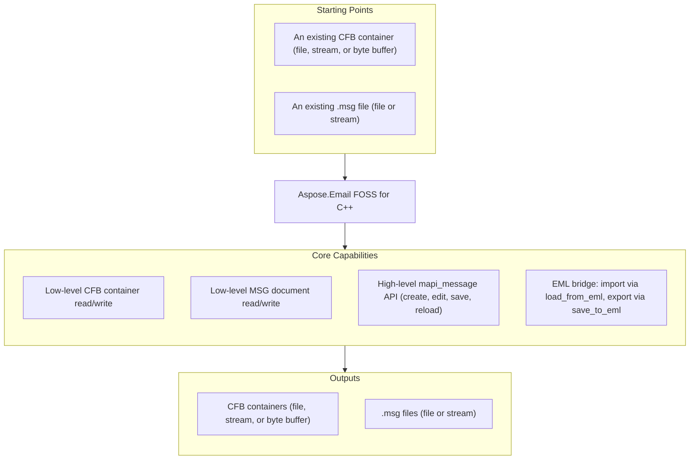

# Aspose.Email FOSS for C++

[](LICENSE) [](CMakeLists.txt)

[](https://products.aspose.org/email/cpp/)

Aspose.Email FOSS for C++ is a dependency-free C++17 library for deterministic binary email
container and message processing without external runtime dependencies. It reads and writes
Compound File Binary (CFB) containers, Outlook `.msg` files, and `.eml` (RFC 5322 / MIME)
messages — no Microsoft Outlook installation or COM interop required.

## Navigation

- [At a Glance](#at-a-glance)
- [Key Capabilities](#key-capabilities)
- [Installation](#installation)
- [Quick Start](#quick-start)
- [Additional Examples](#additional-examples)
- [API Reference](#api-reference)
- [Documentation & Resources](#documentation--resources)
- [Scope and Limitations](#scope-and-limitations)
- [Development and Testing](#development-and-testing)
- [License](#license)

## At a Glance



## Key Capabilities

Features are grouped below by processing layer, from low-level CFB container access up through the
high-level `mapi_message` API.

- Read CFB containers from file paths, streams, and in-memory byte buffers (`cfb_reader::from_file()`,
  `from_stream()`, `from_bytes()`, `from_buffer()`); traverse storages, streams, and the directory tree.
- Build and write CFB containers with `cfb_document` and `cfb_writer` (`to_bytes()`, `write_file()`,
  `write_stream()`).
- Read and write low-level MSG documents through `msg_reader`, `msg_document`, and `msg_writer`,
  including access to the underlying CFB structure via `msg_document::to_cfb_document()`.
- Create, edit, save, and reload high-level messages through `mapi_message` — subject, body,
  HTML body, sender, MAPI properties, recipients, and attachments.
- Work with regular attachments (`mapi_attachment::from_bytes()` / `from_stream()`) and embedded-
  message attachments (`is_embedded_message()`).
- Load `.eml` into `mapi_message` via an in-repository MIME engine (`mapi_message::load_from_eml()`)
  and save a `mapi_message` back to `.eml` (`save_to_eml()`) without external MIME libraries.

## Installation

No NuGet package has been published for this library yet — it ships as CMake source you build and
link directly.

```powershell
cmake --preset default
cmake --build --preset default
ctest --preset default
```

```powershell
cmake --install out\build\default --prefix out\install\default
```

The `default` CMake preset (`CMakePresets.json`) configures a Ninja build in
`out/build/default` with `CMAKE_BUILD_TYPE=RelWithDebInfo`. Requires a C++17 compiler and
CMake 3.26+. To consume the library in your own CMake project instead:

```cmake
add_subdirectory(path/to/Aspose.Email-FOSS-for-Cpp)
target_link_libraries(your_target PRIVATE AsposeEmailFoss::AsposeEmailFoss)
```

## Quick Start

Read a subject from an MSG file:

```cpp
#include <fstream>
#include <iostream>

#include "aspose/email/foss/msg/mapi_message.hpp"

int main()
{
    std::ifstream input("sample.msg", std::ios::binary);
    auto message = aspose::email::foss::msg::mapi_message::from_stream(input);
    std::cout << message.subject() << '\n';
}
```

Create a message and save both MSG and EML:

```cpp
#include <fstream>

#include "aspose/email/foss/msg/mapi_message.hpp"

int main()
{
    auto message = aspose::email::foss::msg::mapi_message::create("Hello", "Body");
    message.set_sender_name("Alice");
    message.set_sender_email_address("alice@example.com");
    message.add_recipient("bob@example.com", "Bob");
    message.add_attachment("note.txt", std::vector<std::uint8_t>{'a', 'b', 'c'}, "text/plain");

    std::ofstream msg_output("hello.msg", std::ios::binary);
    message.save(msg_output);

    std::ofstream eml_output("hello.eml", std::ios::binary);
    message.save_to_eml(eml_output);
}
```

## Additional Examples

Full runnable examples are available under `examples/` (build with
`-DASPOSE_EMAIL_FOSS_BUILD_EXAMPLES=ON`):

### Read a Message Summary Through the High-Level API

Open a `.msg` through `mapi_message` and print subject, sender, recipients, attachments, and a
body preview (excerpted from `examples/msg_summary.cpp`):

```cpp
const auto message = aspose::email::foss::msg::mapi_message::from_file(msg_path);

std::cout << "subject: " << message.subject() << '\n';
std::cout << "sender_name: " << message.sender_name() << '\n';
std::cout << "sender_email: " << message.sender_email_address() << '\n';
std::cout << "recipients_count: " << message.recipients().size() << '\n';
std::cout << "attachments_count: " << message.attachments().size() << '\n';

for (const auto& recipient : message.recipients()) {
    std::cout << "- name=" << recipient.display_name
               << " email=" << recipient.email_address
               << " type=" << recipient.recipient_type << '\n';
}
```

<details>
<summary>View Additional Examples</summary>

### Inspect Low-Level MSG/CFB Structure

Open a `.msg` through `msg_reader` and `msg_document` for raw container inspection (excerpted
from `examples/msg_reader.cpp`):

```cpp
const auto reader = aspose::email::foss::msg::msg_reader::from_file(msg_path);
const auto document = aspose::email::foss::msg::msg_document::from_reader(reader);
```

### Build a Message With Custom MAPI Properties

Set arbitrary MAPI properties (transport headers, display-to/cc/bcc) directly, in addition to the
convenience setters (excerpted from `examples/create_msg_and_eml.cpp`). The example uses a small
`to_underlying` helper (also defined in `examples/create_msg_and_eml.cpp`, requires `<type_traits>`)
to convert the property-id and property-type enums to the integer types `set_property` expects:

```cpp
template <typename Enum>
constexpr auto to_underlying(const Enum value) noexcept
{
    return static_cast<std::underlying_type_t<Enum>>(value);
}
```

```cpp
auto message = aspose::email::foss::msg::mapi_message::create(
    "Quarterly status update and rollout plan",
    "Hello team,\n\nPlease find the latest rollout summary attached.\n\nRegards,\nEngineering");

message.set_property(
    to_underlying(aspose::email::foss::msg::common_message_property_id::sender_name),
    to_underlying(aspose::email::foss::msg::property_type_code::ptyp_string),
    std::string("Build Agent"));

message.add_recipient("alice@example.com", "Alice Example");
message.add_recipient("carol@example.com", "Carol Example",
    aspose::email::foss::msg::mapi_message::recipient_type_cc);

message.add_attachment("hello.txt",
    std::vector<std::uint8_t>{'s', 'a', 'm', 'p', 'l', 'e'}, "text/plain");
message.save(std::filesystem::path(msg_path));

auto loaded_message = aspose::email::foss::msg::mapi_message::from_file(std::filesystem::path(msg_path));
loaded_message.save_to_eml(std::filesystem::path(eml_path));
```

</details>

## API Reference

The library exposes three stable public namespaces: `aspose::email::foss` (high-level
`mapi_message` API and EML bridge), `aspose::email::foss::cfb` (low-level CFB container access),
and `aspose::email::foss::msg` (low-level MSG document access built on CFB).

<details>
<summary>View the Core API Surface</summary>

### Foss

| Class | Description |
|---|---|
| `cfb_document` | Mutable Compound File Binary (CFB) document — holds the root `cfb_storage` tree and header fields (major/minor version, transaction signature number); built via `from_reader`/`from_file`/`from_stream`/`from_bytes`/`from_buffer`. |
| `cfb_exception` | Exception type thrown for malformed or unsupported Compound File Binary (CFB) content (a `std::runtime_error` subclass). |
| `cfb_node` | Abstract base class for CFB tree nodes (`cfb_storage` or `cfb_stream`) — carries name, CLSID, state bits, and creation/modified timestamps common to both. |
| `cfb_reader` | Reusable reader for parsed Compound File Binary (CFB) containers — exposes the header, FAT/mini-FAT/DIFAT chains, and directory entries, and resolves storage/stream data by ID or path. |
| `cfb_storage` | Mutable CFB storage node — a directory-like container of child nodes (nested storages and streams), built with `add_storage`/`add_stream`. |
| `cfb_stream` | Mutable CFB stream node holding a raw byte payload (`data()`). |
| `cfb_writer` | Static serializer that writes a `cfb_document` to bytes, a file, or an output stream (`to_bytes`/`write_file`/`write_stream`). |
| `mapi_attachment` | Mutable MAPI attachment — filename, raw `data`, MIME type, content ID, an optional embedded `mapi_message`, and its own MAPI `properties`; built via `from_bytes`/`from_stream`. |
| `mapi_message` | Mutable high-level MSG object — creates, loads (`from_file`/`from_stream`/`from_msg_document`/`load_from_eml`), edits, and saves Outlook `.msg` messages, with subject/body, recipients, attachments, and MAPI properties. |
| `mapi_property` | A single MAPI property — numeric `property_id`, `property_type`, `value`, and `flags`, combined into a `property_tag`. |
| `mapi_property_collection` | Ordered collection of `mapi_property` entries, keyed by (property ID, property type), with `set`/`add`/`get`/`remove` lookup. |
| `mapi_recipient` | Mutable MAPI recipient — display name, email address, recipient type, address type, and its own `mapi_property_collection`. |
| `msg_document` | Mutable MSG document model — wraps a `msg_storage` root plus version/transaction-signature fields, and converts to a `cfb_document` for CFB serialization via `to_cfb_document`. |
| `msg_exception` | Exception type thrown for malformed or unsupported MSG structures (a `std::runtime_error` subclass). |
| `msg_reader` | Reader for the MSG-specific container layout, built on top of a `cfb_reader` — validates the top-level MSG structure and records `validation_issues`. |
| `msg_storage` | Mutable MSG storage node — name, role (`msg_storage_role`), CLSID/timestamps, and child `msg_stream`/`msg_storage` collections, with `add_stream`/`add_storage`/`find_stream`/`find_storage`. |
| `msg_stream` | Mutable MSG stream node holding a name, raw byte payload, CLSID, and state/timestamp metadata. |
| `msg_writer` | Static serializer that writes a `msg_document` to bytes, a file, or an output stream (`to_bytes`/`write_file`/`write_stream`). |

#### Structs

| Struct | Description |
|---|---|
| `directory_entry` | One CFB directory record — name, object type, sibling/child links, CLSID, timestamps, and stream location/size; `is_storage()`/`is_stream()`/`is_root()` classify it. |
| `header` | The 512-byte CFB file header — signature, CLSID, version, sector-shift fields, and FAT/mini-FAT/DIFAT layout counters (`sector_size()`/`mini_sector_size()` derive sizes from the shift fields). |

#### Enumerations

| Enumeration | Description |
|---|---|
| `common_message_property_id` | Common MAPI property identifiers used by the MSG reader/writer for core message semantics (`message_class`, `subject`, `body`, `sender_email_address`, `attach_filename`, and more). |
| `directory_color_flag` | Red-black tree color used by a CFB directory entry's sibling links (`red`, `black`). |
| `directory_object_type` | Classifies a CFB directory entry's payload — `unknown_or_unallocated`, `storage_object`, `stream_object`, or `root_storage_object`. |
| `msg_storage_role` | Classifies an MSG storage node's role — `generic`, `message`, `recipient`, `attachment`, `embedded_message`, `named_property_mapping`, or `custom_attachment`. |
| `property_type_code` | MAPI property type codes used in MSG property tags (`ptyp_string`, `ptyp_binary`, `ptyp_integer32`, `ptyp_time`, and more, including their `ptyp_multiple_*` array variants). |
| `sector_marker` | Special FAT marker values reserved for sector allocation metadata (`difsect`, `fatsect`, `endofchain`, `freesect`). |

---

#### Detailed Member Reference

### High-Level Message API

- `mapi_message`
  - `create(subject, body, unicode_strings) -> mapi_message`
  - `from_file(path, strict)` / `from_stream(stream, strict)`
  - `from_msg_document(document)`
  - `load_from_eml(path)` / `load_from_eml(stream)`
  - `validation_issues() -> std::vector<std::string>`
  - `subject()` / `set_subject(value)`
  - `body()` / `set_body(value)`, `html_body()` / `set_html_body(value)`
  - `sender_name()` / `set_sender_name(value)`
  - `sender_email_address()` / `set_sender_email_address(value)`
  - `recipients() -> std::vector<mapi_recipient>`
  - `attachments() -> std::vector<mapi_attachment>`
  - `add_recipient(email_address, display_name, recipient_type)`
  - `add_attachment(filename, data, mime_type, content_id)`
  - `add_embedded_message_attachment(message, filename, mime_type)`
  - `set_property(property_id, property_type, value, flags)`
  - `get_property_value(property_id, property_type) -> std::any`
  - `to_msg_document() -> msg_document`
  - `save() -> std::vector<std::uint8_t>` / `save(path)` / `save(stream)`
  - `save_to_eml()` / `save_to_eml(path)` / `save_to_eml(stream)`
- `mapi_attachment`
  - `from_bytes(filename, data, mime_type, content_id)`
  - `from_stream(filename, stream, mime_type, content_id)`
  - `load_data(stream)`
  - `is_embedded_message() -> bool`
  - properties: `filename`, `data`, `mime_type`, `content_id`, `embedded_message`, `properties`
- `mapi_recipient` — properties: `display_name`, `email_address`, `recipient_type`, `address_type`,
  `properties`
- `mapi_property` — `property_id()`, `property_type()`, `value()`, `set_value(value)`,
  `flags()` / `set_flags(value)`, `property_tag()`
- `mapi_property_collection` — `set(property)`, `add(property_id, property_type, value, flags)`,
  `get(property_id, property_type)`, `remove(property_id, property_type)`, `items()`
- `common_message_property_id` (enum) — `subject`, `body`, `body_html`, `sender_name`,
  `sender_email_address`, `display_to`, `display_cc`, `display_bcc`, `internet_message_id`,
  `transport_message_headers`, `attach_filename`, `attach_mime_tag`, and more
- `property_type_code` (enum) — `ptyp_string`, `ptyp_binary`, `ptyp_boolean`, `ptyp_integer32`,
  `ptyp_time`, `ptyp_guid`, and other MAPI property type codes

### Low-Level MSG API

- `msg_reader`
  - `from_file(path, strict)` / `from_stream(stream, strict)`
  - `cfb() -> cfb::cfb_reader`
  - `strict() -> bool`
  - `validation_issues() -> std::vector<std::string>`
- `msg_writer`
  - `to_bytes(document)`, `write_file(document, path)`, `write_stream(document, stream)`
- `msg_document`
  - `from_reader(reader)`, `from_file(path, strict)`, `from_stream(stream, strict)`
  - `root() -> msg_storage`
  - `major_version()`, `minor_version()`, `strict()`
  - `to_cfb_document() -> cfb::cfb_document`
- `msg_storage` — `add_stream()`, `add_storage()`, `find_stream(name)`, `find_storage(name)`
- `msg_stream` — properties: `name`, `data`, `clsid`, `state_bits`, `creation_time`, `modified_time`

### Low-Level CFB API

- `cfb_reader`
  - `from_file(path)`, `from_stream(stream)`, `from_bytes(data)`, `from_buffer(data, size)`
  - `storage_ids()`, `stream_ids()`, `child_ids(storage_stream_id)`
  - `find_child_by_name(storage_stream_id, name)`, `resolve_path(names, start_stream_id)`
  - `get_entry(stream_id)`, `get_stream_data(stream_id)`
- `cfb_writer` — `to_bytes(document)`, `write_file(document, path)`, `write_stream(document, stream)`
- `cfb_document` — `root() -> cfb_storage`, `major_version()`, `minor_version()`,
  `from_reader/from_file/from_stream/from_bytes/from_buffer`
- `cfb_storage` — `children()`, `add_storage(storage)`, `add_stream(stream)`
- `cfb_node` — `is_storage()`, `is_stream()`, `name()`, `clsid()`, `state_bits()`, `creation_time()`,
  `modified_time()`
- `cfb_stream` — `data()`, `set_data(value)`
- `directory_entry` — `is_storage()`, `is_stream()`, `is_root()`, plus raw directory-entry fields
- `header` — CFB header fields (`sector_size()`, `mini_sector_size()`, FAT/DIFAT layout)

### Exceptions

- `cfb_exception`
- `msg_exception`

</details>

## Documentation & Resources

- **[Getting started guide](https://docs.aspose.org/email/cpp/)** — installation, walkthroughs, and feature guides for this library.
- **[How-to guides & FAQ](https://kb.aspose.org/email/cpp/)** — task-focused answers for common MSG/CFB/EML processing questions.
- **[Full API reference](https://reference.aspose.org/email/cpp/)** — the complete, browsable reference for the public API surface (the [API reference](#api-reference) section above covers the essentials).
- **[Stable API summary](PUBLIC_API.md)** — the maintained summary of the supported public surface.
- **[Changelog](CHANGELOG.md)** — release history.
- Found a bug or have a feature request? [Open an issue](https://github.com/aspose-email-foss/Aspose.Email-FOSS-for-Cpp/issues) on GitHub.

## Scope and Limitations

- This library reads and writes local CFB, MSG, and EML files only — it does not connect to mail
  servers (no IMAP, SMTP, or POP3 support).
- TNEF (Transport Neutral Encapsulation Format, `winmail.dat`) is not parsed or generated.
- There is no dedicated calendar/appointment API (calendar-specific MAPI properties can still be
  accessed generically through the property methods).
- The library is at its first public release (v0.1.0); API stability is expected to improve in
  subsequent versions.

These limitations don't apply to
[Aspose.Email for C++ — Enterprise Edition](https://products.aspose.com/email/cpp/), which adds
mail-server connectivity (IMAP/SMTP/POP3), TNEF parsing and generation, a dedicated
calendar/appointment API, and commercial support.

## Development and Testing

Tests build by default (`ASPOSE_EMAIL_FOSS_BUILD_TESTS=ON` in `CMakeLists.txt`) and run through
the `default` CMake preset:

```powershell
cmake --preset default
cmake --build --preset default
ctest --preset default
```

Full runnable examples are documented in [`examples/README.md`](examples/README.md) (build with
`-DASPOSE_EMAIL_FOSS_BUILD_EXAMPLES=ON`).

## License

This project is licensed under the [MIT License](LICENSE). The MIT License permits use, copying,
modification, distribution, sublicensing, and commercial use, provided its copyright and
permission notice are retained. The software is provided without warranty.
