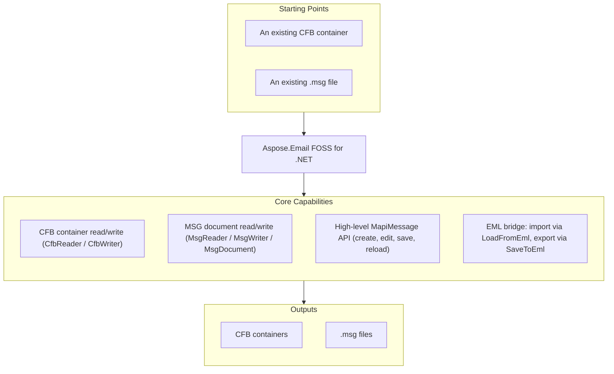

# Aspose.Email FOSS for .NET

[](https://www.nuget.org/packages/Aspose.Email.Foss/) [](LICENSE) [](https://github.com/aspose-email-foss/Aspose.Email-FOSS-for-.Net/graphs/contributors)

[](https://products.aspose.org/email/net/)

Aspose.Email FOSS for .NET is a free, open-source, MIT-licensed, dependency-free C# library for
deterministic binary and message processing — working with Compound File Binary (CFB) containers,
Outlook `.msg` files, and EML/MIME messages.
It provides low-level CFB and MSG readers/writers alongside a high-level, mutable `MapiMessage`
API for creating, editing, and converting messages — without installing Microsoft Outlook or any
proprietary runtime.

## Navigation

- [At a Glance](#at-a-glance)
- [Key Capabilities](#key-capabilities)
- [Installation](#installation)
- [Quick Start](#quick-start)
- [Additional Examples](#additional-examples)
- [API Reference](#api-reference)
- [Documentation & Resources](#documentation--resources)
- [Scope and Limitations](#scope-and-limitations)
- [Development and Testing](#development-and-testing)
- [License](#license)

## At a Glance



## Key Capabilities

- Read and write raw CFB containers with `CfbReader` / `CfbWriter`, traversing storages and
  streams via `IterStorages()`, `IterStreams()`, `IterChildren()`, `IterTree()`, and
  `ResolvePath(names)`.
- Read and write Outlook `.msg` documents at the MAPI level with `MsgReader`, `MsgWriter`, and
  `MsgDocument` — property streams, recipient tables, and attachment sub-storages.
- Create, edit, save, and reload high-level messages through `MapiMessage`: subject, body,
  HTML body, sender, recipients, and attachments (including embedded-message attachments).
- Load `.eml` (RFC 5322 / MIME) into a `MapiMessage` with `MapiMessage.LoadFromEml`, and save a
  `MapiMessage` back to `.eml` with `SaveToEml` — no `System.Net.Mail` dependency.
- Inspect and set arbitrary MAPI properties via `MapiPropertyCollection` and
  `MapiMessage.SetProperty` / `GetPropertyValue`.

## Installation

Install the library from NuGet:

```bash
dotnet add package Aspose.Email.Foss --version 26.7.0
```

The library (`src/Aspose.Email.Foss/Aspose.Email.Foss.csproj`) targets `net8.0` and has no
external runtime dependencies.

## Quick Start

Read a subject from an MSG file:

```csharp
using System.IO;
using Aspose.Email.Foss.Msg;

using var stream = File.OpenRead("sample.msg");
var message = MapiMessage.FromStream(stream);
Console.WriteLine(message.Subject);
```

Create and save a message:

```csharp
using System.IO;
using Aspose.Email.Foss.Msg;

var message = MapiMessage.Create("Hello", "Body");
message.SenderName = "Alice";
message.SenderEmailAddress = "alice@example.com";
message.AddRecipient("bob@example.com", "Bob");

using var attachmentStream = new MemoryStream("abc"u8.ToArray());
message.AddAttachment("note.txt", attachmentStream, "text/plain");

using var output = File.Create("hello.msg");
message.Save(output);
```

## Additional Examples

Runnable examples are available under [`examples/`](examples/): `create_msg_and_eml.cs`,
`msg_reader.cs`, and `msg_summary.cs`.

### Bridge Between EML and MSG

```csharp
using System.IO;
using Aspose.Email.Foss.Msg;

using var input = File.OpenRead("message.eml");
var message = MapiMessage.LoadFromEml(input);

using var msgOutput = File.Create("message.msg");
message.Save(msgOutput);

using var emlOutput = File.Create("roundtrip.eml");
message.SaveToEml(emlOutput);
```

<details>
<summary>View Additional Examples</summary>

### Create, Save to Bytes, and Reload a Message

```csharp
using System;
using System.IO;
using Aspose.Email.Foss.Msg;

var message = MapiMessage.Create("Hello", "Body");
message.SenderName = "Alice";
message.SenderEmailAddress = "alice@example.com";
message.InternetMessageId = "<hello@example.com>";
message.AddRecipient("bob@example.com", "Bob");
message.AddAttachment("note.txt", "abc"u8.ToArray(), "text/plain");

var bytes = message.Save();
var tempPath = Path.Combine(Path.GetTempPath(), $"{Guid.NewGuid():N}.msg");
File.WriteAllBytes(tempPath, bytes);

var loaded = MapiMessage.FromFile(tempPath);
Console.WriteLine($"{loaded.Subject} / {loaded.SenderEmailAddress} / {loaded.Recipients.Count} recipient(s)");
```

</details>

## API Reference

The primary entry point is `MapiMessage`, the high-level API for creating, editing, loading, and
saving messages (including EML bridging). Beneath it, `CfbReader`/`CfbWriter` provide low-level
CFB container access and `MsgReader`/`MsgWriter` provide low-level MSG document access built on
CFB. The library ships 29 public types in total; the sections below cover the ones used most
often. These types are organized under two stable namespaces: `Aspose.Email.Foss.Cfb` (low-level
CFB access) and `Aspose.Email.Foss.Msg` (MSG documents and the high-level `MapiMessage` API).

<details>
<summary>View Selected API Surface</summary>

### Aspose.Email.Foss

| Class | Description |
|---|---|
| `CfbConstants` | CfbConstants.ByteOrderLittleEndian identifies little-endian integer encoding in CFB files. |
| `CfbDocument` | CfbDocument can be instantiated directly, or created from existing data using CfbDocument.FromFile(path), FromStream(stream), or FromReader(reader). |
| `CfbException` | CfbException.CfbException creates an exception instance containing the provided error message. |
| `CfbNode` | CfbNode provides metadata for each entry in a CFB container, including Name, Clsid, CreationTime, and ModifiedTime. |
| `CfbReader` | CfbReader.FromFile(path) opens a CFB file and provides access to its header, FAT, MiniFAT, and directory entries via properties such as MajorVersion and SectorSize. |
| `CfbStorage` | CfbStorage.CfbStorage initializes a new storage node with the specified name. |
| `CfbStream` | CfbStream.CfbStream creates a new CfbStream with the specified name and optional byte array data. |
| `CfbWriter` | CfbWriter.WriteFile(document, path) serializes a CfbDocument to a file, while ToBytes(document) returns the binary representation as a byte array. |
| `DirectoryEntry` | DirectoryEntry methods IsStorage(), IsStream(), and IsRoot() let developers determine the type of a directory entry when traversing a CFB structure. |
| `DirectoryEntryNameComparer` | DirectoryEntryNameComparer.Compare compares two name strings and returns an int indicating sort order. |
| `Header` | Header.SectorSize represents the size of a regular sector in bytes. |
| `MapiAttachment` | MapiAttachment.FromBytes(filename, data, mimeType, contentId) creates an attachment object that can be added to a message; its properties Filename, MimeType, and Data expose the attachment metadata and content. |
| `MapiMessage` | MapiMessage.Create(subject, body, unicodeStrings) constructs a new mutable message with the given subject and body. |
| `MapiProperty` | MapiProperty.MapiProperty constructs a property with given id, type, value, and flags. |
| `MapiPropertyCollection` | MapiPropertyCollection.Set(property:MapiProperty) adds or updates the specified MapiProperty in the collection. |
| `MapiRecipient` | MapiRecipient.DisplayName gets or sets the recipient's display name. |
| `MsgConstants` | MsgConstants.PropertyStreamName provides the standard name of the top‑level property stream used in MSG files. |
| `MsgDocument` | MsgDocument.FromFile(path, strict) loads an MSG file into a MsgDocument object for inspection or modification. |
| `MsgException` | MsgException.MsgException creates a new exception with the given message. |
| `MsgReader` | MsgReader.FromFile(path, strict) creates a MsgReader that reads an Outlook MSG file from the specified file path. |
| `MsgStorage` | MsgStorage.AddStream(stream) adds a MsgStream to the storage, allowing custom binary data to be embedded in the MSG file. |
| `MsgStream` | MsgStream.MsgStream initializes a new stream with a name and optional data bytes. |
| `MsgWriter` | MsgWriter.WriteFile(document, path) writes a MsgDocument to the given file path in MSG format. |

#### Enumerations

| Enumeration | Description |
|---|---|
| `CommonMessagePropertyId` | Common MAPI property identifiers used by the MSG reader and writer for core message semantics, body fields, transport headers, and attachments. |
| `DirectoryColorFlag` | Stores the red-black tree color used by directory sibling links. |
| `DirectoryObjectType` | Classifies the directory entry payload as unallocated, storage, stream, or root storage. |
| `MsgStorageRole` | MsgStorageRole.Generic represents a generic storage role not specific to other categories. |
| `PropertyTypeCode` | MAPI property type codes that appear in property tags and stream names in MSG files. |
| `SectorMarker` | Special FAT marker values reserved for sector allocation metadata. |

---

#### Detailed Member Reference

### CFB (Compound File Binary)

- `CfbReader` — `FromFile(path)` / `FromStream(stream)` / `CfbReader(data)`; `Header`, `Difat`,
  `Fat`, `MiniFat`, `DirectoryEntries`, `RootEntry`; `IterStorages()`, `IterStreams()`,
  `IterChildren(storageStreamId)`, `IterTree(startStreamId)`, `ResolvePath(names, startStreamId)`.
- `CfbWriter` (static) — `ToBytes(document)`, `WriteFile(document, path)`.
- `CfbDocument` — `Root: CfbStorage`; `FromFile`/`FromStream`/`FromReader`.
- `CfbNode` (abstract base of `CfbStorage` / `CfbStream`) — `Name`, `Clsid`, `StateBits`,
  `CreationTime`, `ModifiedTime`. `CfbStorage` adds `Children`, `AddStorage(storage)`,
  `AddStream(stream)`; `CfbStream` adds `Data`.
- `DirectoryEntry` — `IsStorage()`, `IsStream()`, `IsRoot()`.
- `CfbException` — thrown on malformed or invalid CFB structures (e.g. duplicate sibling names).

### MSG (Outlook Message Format)

- `MsgReader` — `FromFile(path, strict)` / `FromStream(stream, strict)`; `ValidationIssues`.
- `MsgWriter` (static) — `ToBytes(document)`, `WriteFile(document, path)`.
- `MsgDocument` — `Root: MsgStorage`; `FromFile`/`FromStream`; `ToCfbDocument()`.
- `MsgStorage` — `Name`, `Role` (`MsgStorageRole`), `Streams`, `Storages`; `AddStream(stream)`,
  `AddStorage(storage)`, `FindStream(name)`, `FindStorage(name)`. `MsgStream` — `Name`, `Data`.
- `MsgException` — thrown on malformed or invalid MSG structures.

### High-Level Message API

- `MapiMessage` — `Create(subject, body, unicodeStrings)`, `FromFile(path, strict)`,
  `FromStream(stream, strict)`, `FromMsgDocument(document)`; `LoadFromEml(...)` /
  `SaveToEml(...)`; `AddRecipient(...)`, `AddAttachment(...)`,
  `AddEmbeddedMessageAttachment(...)`; `Save()` / `Save(path)` / `Save(stream)`; `Subject`,
  `Body`, `HtmlBody`, `SenderName`, `SenderEmailAddress`, `Recipients`, `Attachments`,
  `ValidationIssues`.
- `MapiAttachment` — `FromBytes(...)` / `FromStream(...)`; `Filename`, `MimeType`, `ContentId`,
  `Data`, `EmbeddedMessage`, `IsEmbeddedMessage`.
- `MapiRecipient` — `DisplayName`, `EmailAddress`, `RecipientType`, `AddressType`.
- `MapiProperty` — `PropertyId`, `PropertyType`, `Value`, `Flags`, `PropertyTag`.
  `MapiPropertyCollection` — `Set(property)`, `Add(...)`, `Get(...)`, `Remove(...)`, `IterProperties()`.

### Enumerations

- `CommonMessagePropertyId` — common MAPI property identifiers (Subject, Body, BodyHtml,
  SenderName, AttachFilename, InternetMessageId, and others).
- `PropertyTypeCode` — MAPI property type codes (`PtypString`, `PtypBinary`, `PtypInteger32`, …).
- `MsgStorageRole`, `DirectoryObjectType`, `DirectoryColorFlag`, `SectorMarker`.

</details>

## Documentation & Resources

- **[Getting started guide](https://docs.aspose.org/email/net/)** — installation, walkthroughs, and feature guides for this library.
- **[How-to guides & FAQ](https://kb.aspose.org/email/net/)** — task-focused answers for common CFB/MSG/EML-processing questions.
- **[Full API reference](https://reference.aspose.org/email/net/)** — the complete, browsable reference for all 29 public types.
- **[Public API surface](PUBLIC_API.md)** — the stable namespaces and types covered by this library's compatibility guarantees.
- **[Changelog](CHANGELOG.md)** — notable changes to this package by version.
- Found a bug or have a feature request? [Open an issue](https://github.com/aspose-email-foss/Aspose.Email-FOSS-for-.Net/issues) on GitHub.

## Scope and Limitations

- This library reads and writes local CFB / MSG / EML files only — it does not implement
  IMAP, SMTP, or POP3 and does not connect to mail servers.
- TNEF (`winmail.dat`) is not parsed or generated.
- There is no dedicated calendar or appointment API, though calendar-specific MAPI
  properties can be accessed generically via `SetProperty()` / `GetPropertyValue()`.
- The library requires .NET 8.0 or later; classic .NET Framework (4.x) is not supported.

These limitations don't apply to [Aspose.Email for .NET — Enterprise Edition](https://products.aspose.com/email/net/),
which adds IMAP/SMTP/POP3 connectivity, TNEF parsing, a dedicated calendar and appointment
API, and broader format coverage.

## Development and Testing

Build the library and run the xUnit test suite from the repository root:

```bash
dotnet build src/Aspose.Email.Foss/Aspose.Email.Foss.csproj -c Release
dotnet test tests/Aspose.Email.Foss.Tests/Aspose.Email.Foss.Tests.csproj -c Release
```

See [`examples/README.md`](examples/README.md) for a task-to-example-source-file index.

## License

This project is licensed under the [MIT License](LICENSE). The MIT License permits use, copying,
modification, distribution, sublicensing, and commercial use, provided its copyright and
permission notice are retained. The software is provided without warranty.
