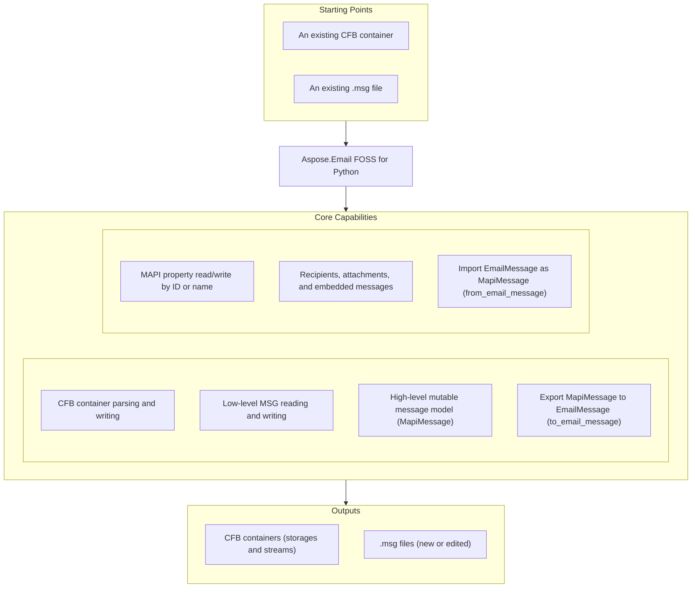

# Aspose.Email FOSS for Python

[](https://pypi.org/project/aspose-email-foss/) [](https://pypi.org/project/aspose-email-foss/) [](https://github.com/aspose-email-foss/Aspose.Email-FOSS-for-Python/actions/workflows/ci.yml) [](LICENSE) [](https://github.com/aspose-email-foss/Aspose.Email-FOSS-for-Python/graphs/contributors)

[](https://products.aspose.org/email/python/)

Aspose.Email FOSS for Python is a free, open-source, pure Python toolkit for reading and writing
Microsoft Outlook `.msg` files and the underlying Compound File Binary (CFB) container format. It
exposes a MAPI-style object model — `MapiMessage`, `MapiRecipient`, `MapiAttachment` — for
creating, editing, and inspecting messages, and converts between `.msg` and Python's built-in
[`email.message.EmailMessage`](https://docs.python.org/3/library/email.message.html#email.message.EmailMessage).

## Navigation

- [At a Glance](#at-a-glance)
- [Key Capabilities](#key-capabilities)
- [Compatibility](#compatibility)
- [Installation](#installation)
- [Quick Start](#quick-start)
- [Additional Examples](#additional-examples)
- [API Reference](#api-reference)
- [Documentation & Resources](#documentation--resources)
- [Scope and Limitations](#scope-and-limitations)
- [Development and Testing](#development-and-testing)
- [License](#license)

## At a Glance



## Key Capabilities

- Parse Compound File Binary (CFB) containers with `CFBReader`, and build new ones with
  `CFBStorage`, `CFBStream`, and `CFBWriter`.
- Read Outlook `.msg` files at the low level with `MsgReader`, and write them with `MsgWriter`
  through a mutable `MsgDocument` tree.
- Create, load, edit, and save messages with the high-level `MapiMessage` API (`create()`,
  `from_file()`, `save()`, `to_bytes()`).
- Read and write MAPI properties by numeric `PropertyId` / `CommonMessagePropertyId` or by named
  property (`MapiNamedProperty`).
- Manage recipients, file attachments, and embedded message attachments (`add_recipient`,
  `add_attachment`, `add_embedded_message_attachment`).
- Convert between `.msg` messages and Python's `email.message.EmailMessage` with
  `to_email_message()` and `from_email_message()`.

## Compatibility

**Main supported scenarios**
- Read Outlook `.msg` files
- Write Outlook `.msg` files
- Inspect Compound File Binary (CFB) containers, and build new ones with `CFBWriter`
- Convert `.msg` to `.eml` (`to_email_message()`)
- Convert `.eml` to `.msg` (`from_email_message()`)
- Manage recipients, attachments, and embedded message attachments

**API layers**
- High-level MSG API: `aspose.email_foss.msg`, centered on `MapiMessage`
- Low-level MSG API: `aspose.email_foss.msg`, centered on `MsgReader`, `MsgWriter`, `MsgDocument`
- CFB API: `aspose.email_foss.cfb`, centered on `CFBReader`, `CFBWriter`, `CFBDocument`

**Outlook-oriented behavior**
- Standard message creation, recipients, file attachments, embedded message attachments, and
  common message property defaults for practical Outlook interoperability

## Installation

Install the library from PyPI:

```bash
python -m pip install aspose-email-foss
```

The package supports Python 3.10 and later and has no third-party runtime dependencies.

## Quick Start

Create a message, save it as `.msg`, and reload it:

```python
from datetime import datetime, timezone

from aspose.email_foss import msg

message = msg.MapiMessage.create("Hello", "Body")
message.set_property(msg.PropertyId.SENDER_NAME, "Build Agent")
message.set_property(msg.PropertyId.SENDER_EMAIL_ADDRESS, "build.agent@example.com")
message.set_property(msg.PropertyId.MESSAGE_DELIVERY_TIME, datetime(2026, 3, 15, 10, 30, tzinfo=timezone.utc))
message.add_recipient("alice@example.com", display_name="Alice Example")
message.add_attachment("hello.txt", b"sample attachment\n", mime_type="text/plain")
message.save("example-message.msg")

with msg.MapiMessage.from_file("example-message.msg") as loaded:
    email_message = loaded.to_email_message()
    print(email_message["Subject"])
```

Convert the loaded message to `.eml`:

```python
from aspose.email_foss import msg

with msg.MapiMessage.from_file("example-message.msg") as message:
    email_message = message.to_email_message()

with open("example-message.eml", "wb") as target:
    target.write(email_message.as_bytes())
```

## Additional Examples

Runnable scripts are available in the [`examples`](examples/) directory:
[`create_msg_and_eml.py`](examples/create_msg_and_eml.py) for a full create → save → reload →
convert workflow, [`msg_reader.py`](examples/msg_reader.py) for low-level CFB/MSG inspection, and
[`msg_summary.py`](examples/msg_summary.py) for a high-level message summary. The most common
operations are collected below.

### Convert an EML File to MSG

```python
from email import policy
from email.parser import BytesParser

from aspose.email_foss import msg

with open("message.eml", "rb") as source:
    email_message = BytesParser(policy=policy.default).parse(source)

message = msg.MapiMessage.from_email_message(email_message)
message.save("message.msg")
```

<details>
<summary>View Additional Examples</summary>

### Read and Write MAPI Properties by Name

```python
from datetime import datetime, timezone

from aspose.email_foss import msg

message = msg.MapiMessage.create()
delivery_time = datetime(2026, 3, 15, 10, 30, tzinfo=timezone.utc)
message.set_property(msg.PropertyId.SUBJECT, "Typed subject")
message.set_property(msg.PropertyId.MESSAGE_DELIVERY_TIME, delivery_time)

print(message.get_property_value(msg.PropertyId.SUBJECT))
print(message.get_property_value(msg.PropertyId.MESSAGE_DELIVERY_TIME))
```

### Iterate Over Every Property on a Message

```python
from aspose.email_foss import msg

message = msg.MapiMessage.create("Report", "See attached data.")
message.set_property(msg.PropertyId.SENDER_NAME, "Ops Bot")

for prop in message.iter_properties():
    print(hex(prop.property_id), prop.property_type, prop.value)
```

### Add an Embedded Message Attachment

```python
from aspose.email_foss import msg

parent = msg.MapiMessage.create("Outer", "Parent body")
child = msg.MapiMessage.create("Inner", "Child body")
parent.add_embedded_message_attachment(child, filename="inner.msg")

data = parent.to_bytes()
print(parent.attachments[0].is_embedded_message)
```

### Build a Compound File Binary (CFB) Container From Scratch

```python
from aspose.email_foss import cfb

root = cfb.CFBStorage(cfb.ROOT_ENTRY_NAME)
root.add_stream(cfb.CFBStream("Small", b"mini-stream-payload"))
nested = root.add_storage(cfb.CFBStorage("Nested"))
nested.add_stream(cfb.CFBStream("Large", b"0123456789ABCDEF" * 400))

data = cfb.CFBWriter.to_bytes(cfb.CFBDocument(root=root, major_version=3))
reader = cfb.CFBReader(data)

small_entry = reader.resolve_path(["Small"])
large_entry = reader.resolve_path(["Nested", "Large"])
print(reader.get_stream_data(small_entry.stream_id))
print(len(reader.get_stream_data(large_entry.stream_id)))
```

### Round-Trip a Message and Inspect Outlook Compatibility Defaults

```python
from aspose.email_foss import msg, cfb

message = msg.MapiMessage.create("Hello", "Body")
message.set_property(msg.PropertyId.SENDER_EMAIL_ADDRESS, "sender@example.com")
message.add_recipient("alice@example.com", display_name="Alice")
message.add_recipient("bob@example.com", display_name="Bob", recipient_type=msg.RECIPIENT_TYPE_CC)
message.add_attachment("a.txt", b"abc", mime_type="text/plain")

reader = msg.MsgReader(cfb.CFBReader(message.to_bytes()))
document = msg.MsgDocument.from_reader(reader)
round_tripped = msg.MapiMessage.from_msg_document(document)

print(round_tripped.message_class)
print(round_tripped.get_property_value(msg.PropertyId.DISPLAY_TO))
print(round_tripped.get_property_value(msg.PropertyId.DISPLAY_CC))
```

### Inspect Low-Level MSG Structure With MsgReader

```python
from aspose.email_foss import msg, cfb

message = msg.MapiMessage.create("Hello", "Body")
message.add_recipient("alice@example.com", display_name="Alice")
message.add_attachment("a.txt", b"abc", mime_type="text/plain")

reader = msg.MsgReader(cfb.CFBReader(message.to_bytes()))

recipient_entry = next(reader.iter_recipient_storages())
attachment_entry = next(reader.iter_attachment_storages())
_, recipient_props = reader.parse_subobject_property_stream(recipient_entry.stream_id)
_, attachment_props = reader.parse_subobject_property_stream(attachment_entry.stream_id)

print("recipient properties:", len(recipient_props))
print("attachment properties:", len(attachment_props))
```

### Handle Malformed CFB or MSG Containers

```python
from aspose.email_foss import cfb

try:
    cfb.CFBReader(b"not a real CFB container")
except cfb.CFBError as exc:
    print("invalid CFB container:", exc)
```

`CFBReader` validates the CFB header signature and byte order before parsing, and `MsgReader`
similarly raises `msg.MsgError` for malformed or misaligned MSG property streams.

</details>

## API Reference

The supported public entry points are `aspose.email_foss.msg` and `aspose.email_foss.cfb`. The
primary entry point is `MapiMessage`, which creates, loads, edits, and saves Outlook `.msg`
messages and converts them to and from Python's `email.message.EmailMessage`.

<details>
<summary>View the Supported Public API Surface</summary>

### CFB Format (Compound File Binary)

| Class | Description |
|---|---|
| `CFBDocument` | Mutable Compound File Binary (CFB) document description. |
| `CFBError` | Raised for malformed or unsupported Compound File Binary (CFB) content. |
| `CFBReader` | Reusable reader for Compound File Binary (CFB) containers. |
| `CFBStorage` | Mutable storage node used by the CFB writer. |
| `CFBStream` | Mutable stream node used by the CFB writer. |
| `CFBWriter` | Deterministic serializer for Compound File Binary (CFB) containers. |
| `DirectoryEntry` | Fixed-size directory record for one storage/stream object and its tree links. |
| `Header` | Header record at file offset 0 defining Compound File Binary (CFB) geometry and allocation chain entry points. |

#### Enumerations

| Enumeration | Description |
|---|---|
| `DirectoryColorFlag` | Stores the red-black tree color used by directory sibling links. |
| `DirectoryObjectType` | Classifies the directory entry payload as unallocated, storage, stream, or root storage. |
| `SectorMarker` | Special FAT marker values reserved for sector allocation metadata. |

### MSG Format

| Class | Description |
|---|---|
| `MapiAttachment` | Mutable attachment object. |
| `MapiMessage` | Mutable high-level MSG object with MSG and EmailMessage conversion support. |
| `MapiNamedProperty` | Identifier for a named MAPI property. |
| `MapiProperty` | Logical MAPI property with optional named-property identity. |
| `MapiPropertyCollection` | MapiPropertyCollection.set adds or replaces a MapiProperty in the collection and returns it. |
| `MapiRecipient` | Mutable recipient object. |
| `MsgDocument` | Mutable MSG document model that can be serialized through the CFB writer. |
| `MsgError` | Raised for malformed or unsupported MSG structures. |
| `MsgReader` | Normative top-level MSG containment and stream requirements for container traversal. |
| `MsgStorage` | Mutable MSG storage node with role classification and parsed property-stream metadata. |
| `MsgStream` | Mutable MSG stream node with raw bytes and CFB metadata. |
| `MsgWriter` | Serializer that writes a MsgDocument into a CFB-backed .msg payload. |
| `PropertyEntryFixedLength` | Fixed-length property stream entry containing property tag, flags, and inline 8-byte value payload. |
| `PropertyStreamHeaderSubobject` | Property stream header used in recipient and attachment storages, containing only reserved bytes. |
| `PropertyStreamHeaderTopLevel` | Top-level property stream header containing next-id counters and counts for recipients and attachments. |
| `StorageLayout` | Naming and containment rules for recipient, attachment, embedded message, and nameid storages. |

#### Enumerations

| Enumeration | Description |
|---|---|
| `CommonMessagePropertyId` | Common MAPI property identifiers used by the MSG reader/writer for core message semantics. |
| `PropertyId` | Common property identifiers paired with their default MAPI property types. |
| `PropertyTypeCode` | MAPI property type codes used in MSG property tags and value stream names. |

---

#### Detailed Member Reference

### High-Level MSG API

Provided by the `aspose.email_foss.msg` module:

- `MapiMessage` — mutable high-level MSG object with MSG and EmailMessage conversion support
  - `create(subject, body, unicode_strings) -> "MapiMessage"`
  - `from_file(path, strict) -> "MapiMessage"`
  - `from_msg_document(document) -> "MapiMessage"`
  - `from_email_message(email_message, unicode_strings) -> "MapiMessage"`
  - `save(path) -> None`, `to_bytes() -> bytes`, `to_msg_document() -> MsgDocument`
  - `to_email_message() -> EmailMessage`, `to_email_bytes() -> bytes`, `to_email_string() -> str`
  - `set_property(...)`, `get_property(...)`, `get_property_value(...)`, `iter_properties()`,
    `iter_property_keys(storage_stream_id)`
  - `set_named_property(...)`, `get_named_property(...)`
  - `add_recipient(email_address, display_name, recipient_type) -> MapiRecipient`
  - `add_attachment(filename, data, mime_type, content_id) -> MapiAttachment`
  - `add_embedded_message_attachment(message, filename, mime_type) -> MapiAttachment`
  - `iter_attachments_info() -> Iterator[MapiAttachment]`, `close() -> None`
  - properties: `subject`, `body`, `body_html`, `message_class`, `recipients`, `attachments`,
    `properties`, `validation_issues`, `unicode_strings`, `major_version`, `minor_version`
- `MapiRecipient` — `display_name`, `email_address`, `recipient_type`, `address_type`, `properties`
  - `set_property(...)`
- `MapiAttachment` — `filename`, `data`, `mime_type`, `content_id`, `is_embedded_message`,
  `is_storage_attachment`, `embedded_message`, `properties`
  - `from_bytes(filename, data, mime_type, content_id) -> "MapiAttachment"`
  - `from_embedded_message(message, filename, mime_type) -> "MapiAttachment"`, `set_property(...)`
- `MapiProperty` — `property_tag`, `property_id`, `property_type`, `value`, `flags`, `named`
  - `clone()`, `clear_raw()`
- `MapiPropertyCollection` — `set(property)`, `add(...)`, `get(property_id, property_type)`,
  `remove(property_id, property_type)`, `iter_properties()`
- `MapiNamedProperty` — `string(name, property_set) -> "MapiNamedProperty"`,
  `numeric(lid, property_set) -> "MapiNamedProperty"`
  - properties: `property_set`, `kind`, `name`, `lid`, `property_id`
- Constants: `RECIPIENT_TYPE_TO`, `RECIPIENT_TYPE_CC`, `RECIPIENT_TYPE_BCC`,
  `ATTACH_METHOD_BY_VALUE`, `ATTACH_METHOD_EMBEDDED`, `ATTACH_METHOD_STORAGE`

### Low-Level MSG API

Also provided by the `aspose.email_foss.msg` module:

- `MsgReader` — normative top-level MSG containment and stream requirements for container
  traversal
  - `from_file(path, strict) -> "MsgReader"` (the constructor also accepts a `CFBReader` directly)
  - `iter_top_level_fixed_length_properties()`, `iter_recipient_storages()`,
    `iter_attachment_storages()`
  - `parse_message_property_stream(storage_stream_id)`,
    `parse_subobject_property_stream(storage_stream_id)`
  - `parse_top_level_property_stream(data)`, `parse_subobject_property_stream_data(data)`
  - properties: `cfb_reader`, `storage_layout`, `strict`, `validation_issues`
- `MsgWriter` — `to_bytes(document) -> bytes`, `write_file(document, path) -> None`
- `MsgDocument` — mutable MSG document model that can be serialized through the CFB writer
  - `from_reader(reader) -> "MsgDocument"`, `from_file(path, strict) -> "MsgDocument"`
  - `to_cfb_document() -> CFBDocument`
  - properties: `root`, `major_version`, `minor_version`, `transaction_signature_number`, `strict`
- `MsgStorage` / `MsgStream` — mutable MSG storage and stream nodes
  - `MsgStorage.add_stream(stream)`, `add_storage(storage)`, `iter_streams()`, `iter_storages()`,
    `find_stream(name)`, `find_storage(name)`
- `StorageLayout`, `PropertyStreamHeaderTopLevel`, `PropertyStreamHeaderSubobject`,
  `PropertyEntryFixedLength` — low-level structural types for MSG property streams
- `MsgError` — raised for malformed or unsupported MSG structures

### CFB API

Provided by the `aspose.email_foss.cfb` module:

- `CFBReader` — reusable reader for CFB containers; accepts a file path via `from_file(path)` or
  raw bytes via the constructor
  - `get_entry(stream_id)`, `get_stream_data(stream_id) -> bytes`
  - `iter_storages()`, `iter_streams()`, `iter_children(storage_stream_id)`,
    `iter_tree(start_stream_id)`
  - `find_child_by_name(storage_stream_id, name)`, `resolve_path(names, start_stream_id)`
  - properties: `header`, `directory_entries`, `root_entry`, `fat`, `mini_fat`, `difat`,
    `stream_data`, `file_size`, `sector_size`
- `CFBWriter` — `to_bytes(document) -> bytes`, `write_file(document, path) -> None`
- `CFBDocument`, `CFBStorage`, `CFBStream` — mutable tree used to build new containers
  - `CFBDocument(root=..., major_version=...)`, `from_reader(reader)`, `from_file(path)`
  - `CFBStorage.add_storage(storage)`, `add_stream(stream)`
- `CFBError` — raised for malformed or unsupported CFB content
- `DirectoryEntry`, `Header`, `DirectoryColorFlag`, `DirectoryObjectType`, `SectorMarker` —
  low-level structural types
- Constants: `ROOT_ENTRY_NAME`, `ROOT_STREAM_ID`, `MINI_STREAM_CUTOFF_SIZE`, `NOSTREAM`,
  `DIFSECT`, `FATSECT`, `ENDOFCHAIN`, `FREESECT`

### Enumerations

- `PropertyId` — common property identifiers paired with their default MAPI property types
  (`SUBJECT`, `BODY`, `SENDER_NAME`, `MESSAGE_DELIVERY_TIME`, `DISPLAY_TO`, `DISPLAY_CC`,
  `ATTACH_FILENAME`, and more)
- `CommonMessagePropertyId` — common MAPI property identifiers used by the MSG reader/writer for
  core message semantics
- `PropertyTypeCode` — MAPI property type codes (`PTYP_STRING`, `PTYP_STRING8`, `PTYP_BINARY`,
  `PTYP_TIME`, `PTYP_BOOLEAN`, `PTYP_INTEGER32`, and more)

</details>

## Documentation & Resources

- **[Getting started guide](https://docs.aspose.org/email/python/)** — installation, walkthroughs, and feature guides for this library.
- **[How-to guides & FAQ](https://kb.aspose.org/email/python/)** — task-focused answers for common Outlook MSG and email-conversion questions.
- **[Full API reference](https://reference.aspose.org/email/python/)** — the complete, browsable reference for all 30 public types (the [API reference](#api-reference) section above covers the essentials).
- **[Stable API summary](PUBLIC_API.md)** — the maintained summary of the supported public surface.
- **[Contributor guide](AGENTS.md)** — architecture notes and conventions for contributors.
- **[Contributing guide](CONTRIBUTING.md)** — how to set up and submit changes.
- **[Security policy](SECURITY.md)** — how to report a suspected security issue without
  posting details in a public issue first.
- **[Changelog](CHANGELOG.md)** — release history.
- Found a bug or have a feature request? [Open an issue](https://github.com/aspose-email-foss/Aspose.Email-FOSS-for-Python/issues) on GitHub.

## Scope and Limitations

- This project focuses on reading and writing Outlook `.msg` files and Compound File Binary
  (CFB) containers directly, plus MAPI-style property, recipient, and attachment manipulation
  through `MapiMessage`.
- EML support is provided only through conversion to and from Python's built-in
  `email.message.EmailMessage` object (`to_email_message()` / `from_email_message()`) — there is
  no built-in raw `.eml` file parser. To read a `.eml` file, first parse it with Python's
  `email.parser.BytesParser` (as shown in [Additional Examples](#additional-examples)) and pass
  the resulting `EmailMessage` to `MapiMessage.from_email_message()`.

These limitations don't apply to
[Aspose.Email for Python — Enterprise Edition](https://products.aspose.com/email/python-net/),
which adds broader format support — direct `.eml` file parsing, a wider range of supported
message formats — and enterprise integration features beyond this FOSS edition's MSG/CFB-focused
scope.

## Development and Testing

Install the repository in editable mode and run the test suite:

```bash
pip install -e .
python -m unittest discover -s tests -v
```

Build and validate distribution packages:

```bash
python -m build
python -m twine check --strict dist/*
```

CI runs the test suite on Python 3.10 through 3.13 and validates packaging on every push and pull
request to `master`. Releases are tagged `vYY.M` (for example `v26.3`) and published to PyPI
automatically by the [`Release`](.github/workflows/release.yml) GitHub Actions workflow.
Runnable example scripts are also documented in [`examples/README.md`](examples/README.md).

## License

This project is licensed under the [MIT License](LICENSE). The MIT License permits use, copying,
modification, distribution, sublicensing, and commercial use, provided its copyright and
permission notice are retained. The software is provided without warranty.
