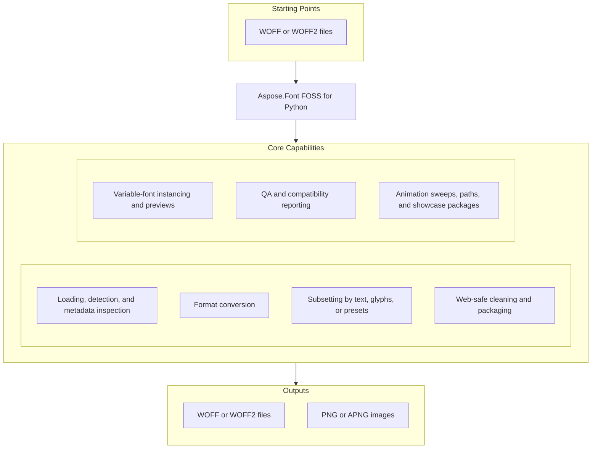

# Aspose.Font FOSS for Python

[](LICENSE.txt) [](pyproject.toml) [](https://github.com/aspose-font-foss/Aspose.Font-FOSS-for-Python/graphs/contributors)

[](https://products.aspose.org/font/python/)

Aspose.Font FOSS for Python is a free, open-source, pure-Python library for loading, inspecting,
converting, subsetting, and previewing fonts across the TrueType, OpenType, CFF, Type 1, WOFF,
WOFF2, and EOT formats. It runs on Python 3.10 or later with no native OS font-library
dependencies, and exposes the same capabilities through a Python API, a bundled `aspose-font`
command-line tool, and an optional MCP server.

## Navigation

- [At a Glance](#at-a-glance)
- [Key Capabilities](#key-capabilities)
- [Installation](#installation)
- [Quick Start](#quick-start)
- [Additional Examples](#additional-examples)
- [API Reference](#api-reference)
- [Documentation & Resources](#documentation--resources)
- [Scope and Limitations](#scope-and-limitations)
- [Development and Testing](#development-and-testing)
- [License](#license)

## At a Glance



## Key Capabilities

- Load TTF, OTF, CFF, Type 1, WOFF, WOFF2, and EOT fonts from a file path, bytes, or stream with `FontLoader.open()` / `FontLoader.load()`, with automatic format detection.
- Inspect font metadata, metrics, encoding, and glyph outlines through the common `Font` base class (`font_name`, `font_family`, `num_glyphs`, `metrics`, `glyph_accessor`).
- Convert a loaded font to another supported format with `Font.convert()`.
- Subset fonts by text, glyph IDs, codepoints, or named script presets (Latin, Cyrillic, Greek, Hebrew, Arabic, Devanagari, Thai) with `FontSubsetter`.
- Strip legacy metadata tables and Mac `name` records for web deployment with `FontCleaner.clean_for_web()`.
- Explore variable-font axes and named instances, and export static instances with `SmartInstancer` / `TtfFont.instantiate()`, with `HVAR`-aware width interpolation so exported static widths follow the source font's own horizontal metric variation data when present.
- Generate PNG/SVG previews and specimen sheets with `FontPreviewBuilder`.
- Build APNG animation sweeps, scripted animation paths, frame-sequence packages, review bundles, and showcase packages (bundling APNG, storyboard, landing HTML, and manifests) with `AnimationPreviewBuilder`.
- Produce WOFF2/WOFF web bundles with `WebFontBuilder`, and QA/compatibility reports with `FontQaReporter`, `CompatibilityChecker`, and `DeltaInspector` — all also available through the bundled `aspose-font` CLI or the optional MCP server, whose tools include `var_compat` for machine-readable variable-font compatibility reports plus single-bundle and shared-family web packaging.

## Installation

A PyPI package has not been published yet. Install from source:

```bash
git clone https://github.com/aspose-font-foss/Aspose.Font-FOSS-for-Python.git
cd Aspose.Font-FOSS-for-Python
python -m pip install -e .
```

Install with MCP server support:

```bash
python -m pip install -e ".[mcp]"
```

The `[mcp]` extra needs `mcp<2.0` — the current 2.x release of the `mcp` package removed
`mcp.server.fastmcp`, which the bundled MCP server imports.

The package supports Python 3.10 and later.

## Quick Start

Load a font and inspect its metadata:

```python
from aspose_font import FontLoader

font = FontLoader.open("Roboto-VariableFont_wdth,wght.ttf")
print(font.font_name)
print(font.font_family)
print(font.num_glyphs)
print(font.metrics.units_per_em, font.metrics.ascender, font.metrics.descender)
```

Convert a font to WOFF and save it:

```python
from aspose_font import FontLoader, FontType

font = FontLoader.open("Roboto-VariableFont_wdth,wght.ttf")
woff_font = font.convert(FontType.WOFF)
woff_font.save("Roboto-VariableFont.woff")
```

## Additional Examples

Runnable scripts live in the CLI test suite and the `aspose-font` command's own tests. The most
common operations are collected below.

### Example Output

The QA/compatibility reporter and family review board produce real visual artifacts, not just
text — for example:


### Inspect Font Info and Metrics From the CLI

```bash
aspose-font info Roboto-VariableFont_wdth,wght.ttf
aspose-font metrics Roboto-VariableFont_wdth,wght.ttf
```

<details>
<summary>View Additional Examples</summary>

### Convert a Font to EOT From the CLI

```bash
aspose-font convert Roboto-VariableFont_wdth,wght.ttf roboto.eot --to eot
```

### Load a CFF Font Directly

```python
from aspose_font import FontLoader

font = FontLoader.open("OpenSans-Regular.cff")
print(font.font_name)
print(font.num_glyphs)
print(font.charset.name_for(1))
```

### Clean a Font for Web Deployment

```python
from aspose_font import FontLoader, FontCleaner

font = FontLoader.open("Roboto-VariableFont_wdth,wght.ttf")
cleaned = FontCleaner.clean_for_web(font)
cleaned.save("Roboto-VariableFont-clean.ttf")
```

### Generate a PNG Preview

```bash
aspose-font preview Roboto-VariableFont_wdth,wght.ttf preview.png --text "Aspose Font"
```

### Generate an SVG Preview for a Named Instance

```bash
aspose-font preview Roboto-VariableFont_wdth,wght.ttf bold-preview.svg --instance-name Bold --format svg
```

### Generate a QA Report

```bash
aspose-font qa-report Roboto-VariableFont_wdth,wght.ttf --preset latin --text "QA" --json-output qa.json --html-output qa.html
```

### Check Variable-Font Compatibility Between Two Named Instances

```bash
aspose-font var-compat Roboto-VariableFont_wdth,wght.ttf --before-instance-name Regular --after-instance-name "Condensed Bold" --text Aspose
```

### Inspect Glyph Deltas for a Variable Instance

```bash
aspose-font var-delta Roboto-VariableFont_wdth,wght.ttf --instance-name Bold --char A --top-points 2
```

### Build a Variable-Font Axis-Sweep Animation

```python
from aspose_font import FontLoader, AnimationPreviewBuilder

font = FontLoader.open("Roboto-VariableFont_wdth,wght.ttf")
asset = AnimationPreviewBuilder.build_axis_sweep(
    font,
    axis_tag="wdth",
    start_val=75.0,
    end_val=100.0,
    frames=3,
    fps=10,
    text="A",
    size=10.0,
    bounce=True,
)
asset.write_to("roboto-sweep-wdth.png")
```

</details>

## API Reference

The primary public entry points are exported directly from the top-level `aspose_font` package
(see `__init__.py`'s `__all__`), implemented by the concrete format classes `TtfFont`, `CffFont`,
`Type1Font`, `WoffFont`, `Woff2Font`, and `EotFont`. Lower-level table access lives under
submodules such as `aspose_font.cff`, `aspose_font.ttf.tables`, and `aspose_font.type1`.
`FontConverter` lives in `aspose_font.converter` and is not re-exported at the top level — use the
`Font.convert()` instance method for straightforward conversions. The vendored Brotli codec
(`aspose_font._brotli`) and the CLI/token-reporting internals are implementation details and are
not part of the supported surface.

<details>
<summary>View the Supported Public API Surface</summary>

### Core API

| Class | Description |
|---|---|
| `ActiveTupleSummary` | ActiveTupleSummary.to_dict() returns a dictionary containing the tuple's index, scalar value, peak coordinates, start coordinates, and end coordinates. |
| `AnimationAsset` | AnimationAsset.write_to(path) writes the generated animation data to the given filesystem location, creates missing parent directories, and returns the Path of the written file. |
| `AnimationFramePackage` | AnimationFramePackage.write_to(path) writes the storyboard image, each frame image, and a JSON manifest describing fps and frame labels to the specified directory. |
| `AnimationPreset` | AnimationPreset.name stores the identifier of the animation preset. |
| `AnimationPreviewBuilder` | AnimationPreviewBuilder.available_presets returns a tuple of preset names for animation generation. |
| `AnimationReviewPackage` | AnimationReviewPackage.write_to saves the review package to the given filesystem path and returns the Path. |
| `AnimationShowcasePackage` | AnimationShowcasePackage.write_to writes the package to the given path and returns the resulting Path. |
| `AnimationStep` | AnimationStep.coordinates stores a mapping of axis names to float values defining the font instance. |
| `BinaryReader` | Wraps a byte source in seekable BytesIO for big-endian font binary parsing. |
| `BinaryWriter` | Accumulates bytes for binary font serialization. |
| `CffSerializer` | CffSerializer can serialize a fully populated CffFont into a byte array suitable for writing out as a CFF or OpenType font file. |
| `ClosePath` | Class extending PathCommand. |
| `CompatibilityChecker` | CompatibilityChecker.compare_fonts(before, after, before_label, after_label, codepoints, text) produces a CompatibilityReport that can be exported to JSON via report.to_json(indent=2, sort_keys=True). |
| `CompatibilityReport` | CompatibilityReport.to_json(indent, sort_keys) returns a JSON string of the report, and write_json(target, indent, sort_keys) writes that JSON directly to a file. |
| `CompletedTaskRecord` | CompletedTaskRecord.task_id uniquely identifies the completed task. |
| `CompositeComponentMovement` | CompositeComponentMovement.to_dict returns a dict of the object's numeric and boolean fields. |
| `CompositeGlyphComponent` | CompositeGlyphComponent.to_dict() returns a dict of the component's numeric attributes. |
| `CoverageGroup` | Coverage diagnostics for one request source such as a preset, text, or range. |
| `CurveAdapter` | CurveAdapter.quad_to_cubic converts a quadratic Bézier (p0, q, p3) to an equivalent cubic Bézier, returning four points. |
| `CurveTo` | CurveTo.x1 is the x‑coordinate of the first Bézier control point. |
| `DeltaInspector` | DeltaInspector enables detailed variable‑font delta analysis, generating GlyphDeltaReport and TextDeltaReport objects that highlight coordinate changes across instances. |
| `DeltaPoint` | DeltaPoint.to_dict returns a dictionary of the point's numeric components. |
| `DeltaTupleReport` | DeltaTupleReport.tuple_index is the zero‑based index of the delta tuple. |
| `EotSerializer` | EotSerializer.serialize(font) returns the complete binary representation of an EOT font ready for file output. |
| `FamilyReviewExportPackage` | FamilyReviewExportPackage.write_to(directory) creates a set of HTML, CSS, and manifest files for a font family, returning the list of generated file paths. |
| `Font` | Abstract base for all font format implementations. |
| `FontCleaner` | Font metadata and technical table cleaner. |
| `FontConversionException` | Raised when font format conversion fails or is not supported. |
| `FontConverter` | FontConverter.convert(font, target) produces a new Font object in the target format, raising FontConversionException if the conversion cannot be performed. |
| `FontEncoding` | Maps Unicode codepoints to glyph IDs. |
| `FontException` | Base class for all font library exceptions. |
| `FontLoader` | FontLoader.open(source, font_type, collection_index) returns a Font object representing the requested font type without fully loading the entire file into memory. |
| `FontMetrics` | FontMetrics exposes key typographic values such as units_per_em, ascender, descender, and line_gap for layout calculations. |
| `FontNotSupportedException` | Raised for valid but unsupported font features (e.g. Multiple Master, CFF2 blends). |
| `FontParseException` | Raised when binary font data cannot be parsed. |
| `FontPreviewBuilder` | FontPreviewBuilder.build(font, text, size, color, background, padding, antialias, file_stem, instance_coordinates, instance_name, output_format) generates a PreviewImage (PNG or SVG) of the supplied text rendered with the given font. |
| `FontSourceInfo` | Describe the origin of loaded bytes. |
| `FontSubsetter` | FontSubsetter.available_presets() returns a tuple of preset names that can be used for web‑oriented subsetting. |
| `Glyph` | Glyph.glyph_id identifies the glyph using its numeric GlyphId. |
| `GlyphAccessor` | Retrieves glyphs by ID or Unicode codepoint. |
| `GlyphCompatibilityIssue` | GlyphCompatibilityIssue.to_dict returns a dictionary representation of the issue. |
| `GlyphDeltaComparisonReport` | GlyphDeltaComparisonReport.moved_point_count is the count of points that moved between before and after. |
| `GlyphDeltaReport` | GlyphDeltaReport.to_dict returns a dictionary representation of the report's data. |
| `GlyphId` | GlyphId.value holds the integer identifier of a glyph. |
| `GlyphInterpolationIssue` | GlyphInterpolationIssue.codepoint is the integer Unicode codepoint of the affected glyph. |
| `GlyphLayout` | A single glyph positioned in world-space layout coordinates. |
| `GlyphNotFoundException` | Raised when a requested glyph ID or codepoint has no mapping in the font. |
| `GlyphOutlineStats` | GlyphOutlineStats.to_dict returns a dictionary representation of the outline statistics. |
| `GlyphPath` | Ordered sequence of PathCommand objects representing one glyph's outline. |
| `KernPair` | KernPair.left is the GlyphId of the left glyph in the kerning pair. |
| `LanguageProfile` | LanguageProfile.to_dict returns a dictionary representation of the language profile. |
| `LineTo` | LineTo.x represents the horizontal coordinate of the line endpoint. |
| `LoadedFont` | Friendly loader result that wraps a font plus source metadata. |
| `LocalizationCoverage` | LocalizationCoverage.to_dict returns a dictionary representation of the coverage data. |
| `LocalizationResolution` | LocalizationResolution.to_dict returns a dictionary representation of the resolution state. |
| `MoveTo` | MoveTo.x stores the horizontal coordinate for the move operation. |
| `PathCommand` | Abstract marker for all path command types. |
| `PreviewImage` | PreviewImage.write_to(path) saves the generated PNG or SVG preview to the specified filesystem location and returns the Path object. |
| `QuadraticTo` | QuadraticTo.x1 represents the x‑coordinate of the quadratic Bézier control point. |
| `Rasterizer` | Scanline rasterizer for GlyphPath outlines with pure-Python PNG export. |
| `RequestedLanguageHint` | RequestedLanguageHint.to_dict returns a dictionary representation of the hint object. |
| `ResolvedInstance` | ResolvedInstance.label is the human‑readable name of the resolved instance. |
| `SmartInstancer` | SmartInstancer.instantiate(coordinates, instance_name, naming_strategy, family_suffix, legacy_family_name, typographic_family_name, legacy_style_name, typographic_style_name, stat_policy) returns a TtfFont object representing a static instance of the variable font. |
| `SubsetCoverage` | Aggregate Unicode coverage diagnostics for a subsetting request. |
| `SubsetResult` | Subsetting output bundled with the coverage report used to produce it. |
| `TaskCompletionReceipt` | TaskCompletionReceipt.task_id identifies the task uniquely. |
| `TaskTokenEstimate` | TaskTokenEstimate.task_id is the unique identifier of the task. |
| `TextDeltaComparisonReport` | TextDeltaComparisonReport.to_dict() returns a dictionary containing all report fields. |
| `TextDeltaReport` | TextDeltaReport aggregates glyph‑level delta information, exposing glyph_count, active_glyph_count, and a collection of glyph_reports for QA inspection. |
| `TextLayout` | Result of a TextRenderer.layout() call. |
| `TextRenderer` | Lays out text using a font's glyph metrics and optional kern pairs. |
| `TtfSerializer` | TtfSerializer.serialize serializes the given font object to a byte array, optionally using the provided sfnt version. |
| `TupleScalarDelta` | TupleScalarDelta.to_dict() returns a dict with tuple_index, before_scalar and after_scalar values. |
| `Type1Serializer` | Type1Serializer.serialize_pfb converts a font object to PFB binary data. |
| `UnsupportedFontFormatException` | Raised by FontLoader when the file magic bytes are not recognized. |
| `VariableAxis` | VariableAxis.normalize(value) returns the normalized (0‑1) position of a raw axis coordinate according to the axis’s defined range. |
| `VariableAxisPreset` | VariableAxisPreset.to_presentation(axis) returns a dictionary of presentation metadata for the preset, suitable for UI rendering of preset controls. |
| `VariableInstance` | VariableInstance.css_variation_settings(axes) produces a tuple of CSS `font-variation-settings` strings for the given collection of axes. |
| `WebFontAsset` | WebFontAsset.filename stores the original font file name as a string. |
| `WebFontBuilder` | WebFontBuilder can generate complete web‑font families with CSS, HTML preview pages and manifest files ready for deployment. |
| `WebFontBundle` | WebFontBundle.write_to writes the bundle to a directory and returns the list of written file paths. |
| `WebFontFamilyPackage` | WebFontFamilyPackage.write_to(directory) creates a complete family package containing CSS, HTML, a manifest, and all bundled font assets for multiple style variants. |

#### Enumerations

| Enumeration | Description |
|---|---|
| `FontType` | FontType.TTF represents the TrueType font format. |

### CFF Font Handling

| Class | Description |
|---|---|
| `CffCharset` | CffCharset.standard(num_glyphs) creates a standard CFF charset for the given number of glyphs, and name_for(gid) returns the glyph name for a glyph ID. |
| `CffDict` | CffDict.from_bytes creates a CffDict instance from the given binary data. |
| `CffEncoding` | CffEncoding.unicode_to_gid(codepoint) returns the GlyphId for a Unicode codepoint according to the current CFF encoding. |
| `CffFont` | CffFont.get_kern_pairs() returns a list of KernPair objects representing the kerning adjustments defined in the font. |
| `CffIndex` | CffIndex.from_reader(r) creates a CffIndex instance by parsing data from a binary reader r. |
| `PrivateDict` | PrivateDict.from_dict(d) creates a PrivateDict instance from a dictionary containing private dict entries such as default_width_x and nominal_width_x. |
| `PrivateDictOp` | PrivateDictOp.BLUE_VALUES represents the BlueValues entry defining alignment zones for horizontal stems. |
| `TopDict` | TopDict.from_dict(d, string_index) creates a TopDict instance from a dictionary representation and a string‑index table, allowing programmatic reconstruction of font top‑level metadata. |
| `TopDictOp` | TopDictOp.VERSION represents the font's version number. |
| `Type2Interpreter` | Interprets Type 2 charstrings into GlyphPath commands. |

### EOT Font Handling

| Class | Description |
|---|---|
| `EotFont` | Embedded OpenType (EOT) wrapper over an inner TrueType/OpenType font. |
| `EotHeader` | EotHeader.eot_size is the total size of the EOT file in bytes. |

### TrueType Font Handling

| Class | Description |
|---|---|
| `AvarAxisMap` | AvarAxisMap.mapping stores a list of (float, float) tuples that define input‑output value mappings for a variable font axis. |
| `AvarTable` | AvarTable.from_reader(r, length) constructs an AvarTable from a binary reader, and map_normalized(axis_index, value) returns the mapped float for a normalized axis coordinate. |
| `AxisRecord` | AxisRecord.tag stores the four‑character axis tag identifier (e.g., 'wght'). |
| `CmapSubtable` | CmapSubtable.get_gid returns the glyph ID for a Unicode codepoint or None if unmapped. |
| `CmapTable` | CmapTable.from_reader(r, table_length) parses a cmap table from a font stream, and best_subtable() selects the most suitable CmapSubtable for Unicode lookups. |
| `DeltaSetIndex` | DeltaSetIndex.outer represents the outer index component of a delta set location. |
| `DeltaSetIndexMap` | DeltaSetIndexMap.from_reader(r) constructs a DeltaSetIndexMap from a binary reader, and get(gid) retrieves the corresponding DeltaSetIndex. |
| `FvarTable` | FvarTable.from_reader creates a new FvarTable by reading length bytes from a BinaryReader. |
| `GlyfTable` | GlyfTable.from_reader reads a GlyfTable from a BinaryReader using the specified length and returns a GlyfTable instance. |
| `GvarTable` | GvarTable.from_reader reads a GvarTable from a BinaryReader using the given length and axis tags. |
| `HMetric` | A single glyph's horizontal metrics record from the `hmtx` table: `advance_width` and left side bearing (`lsb`). |
| `HeadTable` | HeadTable.from_reader reads a BinaryReader and returns a populated HeadTable instance. |
| `HheaTable` | HheaTable.from_reader reads a BinaryReader and constructs a HheaTable object. |
| `HmtxTable` | HmtxTable.from_reader reads hmtx data from a BinaryReader and creates an HmtxTable instance. |
| `HvarTable` | HvarTable.advance_width_delta(gid, normalized_coordinates) returns the width adjustment for a glyph ID at the specified normalized axis coordinates. |
| `ItemVariationData` | ItemVariationData.from_reader creates an ItemVariationData instance by reading binary data from a BinaryReader. |
| `ItemVariationStore` | ItemVariationStore.evaluate(delta_set_index, coordinates) computes the delta adjustment for a variable‑font axis based on supplied normalized coordinates. |
| `KernTable` | KernTable.build_lookup() creates a dictionary mapping (left_gid, right_gid) tuples to kerning values for fast lookup. |
| `LocaTable` | LocaTable.glyph_offset(gid) returns the byte offset of the glyph data for the given glyph ID within the font’s glyf table. |
| `MaxpTable` | MaxpTable.to_bytes returns the binary encoding of the MaxpTable. |
| `NameRecord` | NameRecord.platform_id identifies the platform for which the name record applies. |
| `NameTable` | NameTable.language_key returns a language tag string for the given platform_id and language_id. |
| `NamedInstance` | NamedInstance.name_id is the integer identifier for the instance's name record. |
| `NamingPolicyPreview` | Dry-run result for generated static-instance name records. |
| `Os2Table` | Os2Table.from_reader(r, table_length) parses an OS/2 table from a binary reader and returns an Os2Table instance. |
| `PlatformNamingDiagnostics` | PlatformNamingDiagnostics provides boolean flags and length checks (e.g., postscript_name_safe, postscript_name_length) to help ensure generated names meet platform constraints. |
| `PostTable` | PostTable.version holds the version number of the post table. |
| `StatNamingDiagnostics` | StatNamingDiagnostics reports whether the source font contains STAT tables and recommends appropriate stat_policy settings for export. |
| `TtcFaceRecord` | TtcFaceRecord.offset represents the byte offset of this face record within the TTC file. |
| `TtfFont` | TtfFont.save(path) writes the current font instance to the supplied filesystem path in its native format. |
| `TtfGlyphParser` | TtfGlyphParser.parse parses the glyph identified by the given GlyphId and returns a Glyph object. |
| `TtfInstancer` | TtfInstancer.preview_naming_policy returns a naming preview for a variable font instance based on given coordinates and naming options. |
| `TtfTableSet` | TtfTableSet.get_raw returns the raw bytes of the table identified by the given tag, or None if absent. |
| `TupleVariation` | TupleVariation.peak_coords holds the axis coordinate values that define the variation peak. |
| `VariationRegion` | VariationRegion.scalar returns a scalar value for the region based on given coordinate mapping and axis tag order. |
| `VariationRegionAxis` | VariationRegionAxis.scalar(coordinate) returns the scalar float value for a given coordinate along the axis, using the axis's start, peak, and end properties. |

### Type1 Font Handling

| Class | Description |
|---|---|
| `AfmData` | AfmData.font_name is the PostScript name of the font extracted from the AFM file. |
| `AfmGlyphMetric` | AfmGlyphMetric properties expose glyph name, code point, advance width, and bounding box for a glyph defined in an AFM file. |
| `PfbSegment` | PfbSegment.seg_type represents the integer identifier of the segment type in a PFB file. |
| `Type1Font` | Type1Font.load_afm loads an AFM file from the given path into the Type1Font instance. |
| `Type1FontData` | Type1FontData.full_name is the full human‑readable name of the font. |
| `Type1Interpreter` | Type1Interpreter.interpret interprets a Type 1 charstring and returns a GlyphPath with the bytes consumed. |

### WOFF / WOFF2 Handling

| Class | Description |
|---|---|
| `Woff2Font` | Woff2Font.to_bytes(font_type) serializes the WOFF2 font into a bytes object for the specified font_type. |
| `WoffFont` | WoffFont.font_type returns the FontType enumeration value of this WOFF font. |

---

#### Detailed Member Reference

### Loading and Format Base

- `FontLoader`
  - `open(source, font_type=None, collection_index=None) -> Font`
  - `load(source, font_type=None, collection_index=None) -> LoadedFont`
- `LoadedFont`
  - `unwrap() -> Font`
  - `is_variable: bool`, `is_static: bool`, `font: Font`, `source: FontSourceInfo`
  - `detected_font_type: FontType`, `requested_font_type: FontType | None`
- `FontSourceInfo`
  - `is_path`, `is_bytes`, `is_stream`, `kind`, `label`, `size`, `path`, `stream_name`,
    `collection_index`, `collection_size`
- `Font` (abstract base for `TtfFont`, `CffFont`, `Type1Font`, `WoffFont`, `Woff2Font`, `EotFont`)
  - `font_type: FontType`, `font_name: str`, `font_family: str`, `font_style: str`
  - `num_glyphs: int`, `metrics: FontMetrics`, `encoding: FontEncoding`, `glyph_accessor: GlyphAccessor`
  - `save(path) -> None`, `to_bytes(font_type) -> bytes`, `save_to_format(font_type, path) -> None`
  - `get_kern_pairs() -> list[KernPair]`, `convert(target) -> Font`
- `FontMetrics`
  - `units_per_em`, `ascender`, `descender`, `line_gap`, `advance_width_max`,
    `underline_position`, `underline_thickness`
- `FontEncoding` (abstract, implemented per format)
  - `unicode_to_gid(codepoint) -> GlyphId`, `get_all_codepoints() -> list[int]`
- `GlyphAccessor` (abstract)
  - `get_glyph_by_id(gid) -> Glyph`, `get_glyph_by_unicode(codepoint) -> Glyph`
  - `get_glyphs_for_text(text) -> list[Glyph]`, `get_all_glyph_ids() -> list[GlyphId]`
- `Glyph`
  - `glyph_id`, `glyph_name`, `path: GlyphPath | None`, `advance_width`, `lsb`
- `GlyphPath` and path commands: `MoveTo`, `LineTo`, `QuadraticTo`, `CurveTo`, `ClosePath`
- `FontType` (enum): `TTF`, `OTF`, `CFF`, `TYPE1`, `TYPE1_PFA`, `WOFF`, `WOFF2`, `EOT`

### Conversion, Cleaning, and Subsetting

- `FontConverter` (`aspose_font.converter`)
  - `convert(font, target) -> Font`
- `FontCleaner`
  - `clean_for_web(font, drop_mac_names, drop_legacy_tables, drop_metadata_tables) -> Font`
- `FontSubsetter`
  - `available_presets() -> tuple[str, ...]`
  - `subset(font, codepoints) -> Font`, `subset_by_text(font, text) -> Font`,
    `subset_by_gids(font, gids) -> Font`, `subset_by_presets(font, presets) -> Font`
  - `subset_for_web(font, presets, text, codepoints, ranges) -> Font`
  - `subset_with_coverage(font, codepoints) -> SubsetResult`
  - `subset_for_web_with_coverage(font, presets, text, codepoints, ranges) -> SubsetResult`
  - `analyze_coverage(font, codepoints, groups) -> SubsetCoverage`
  - `analyze_web_coverage(font, presets, text, codepoints, ranges) -> SubsetCoverage`
- `SubsetCoverage` / `CoverageGroup` — requested/covered/missing codepoint counts and per-source breakdowns
- `SubsetResult`
  - `font: Font`, `coverage: SubsetCoverage`

### Previews and Animation

- `FontPreviewBuilder`
  - `build(font, text, size, color, background, padding, antialias, file_stem, instance_coordinates, instance_name, output_format) -> PreviewImage`
  - `compose_sheet(previews, columns, gap, ...) -> PreviewImage`
  - `compose_difference_preview(before, after, ...) -> PreviewImage`, `compose_overlay_preview(...) -> PreviewImage`
- `PreviewImage`
  - `filename: str`, `media_type: str`, `data: bytes`, `write_to(path) -> Path`
- `AnimationPreviewBuilder`
  - `available_presets() -> tuple[str, ...]`
  - `build_axis_sweep(font, axis_tag, start_val, end_val, text, frames, fps, ...) -> AnimationAsset`
  - `build_axis_sweep_package(...) -> AnimationFramePackage`
  - `build_path(font, steps, text, frames_per_segment, fps, ...) -> AnimationAsset`
  - `build_path_package(...) -> AnimationFramePackage`, `build_path_review_package(...) -> AnimationReviewPackage`
  - `build_path_showcase_package(...) -> AnimationShowcasePackage`
  - `build_named_instance_path(font, instance_names, ...) -> AnimationAsset`
- `AnimationAsset` / `AnimationFramePackage` / `AnimationReviewPackage` / `AnimationShowcasePackage`
  - each exposes `write_to(path) -> Path`; `AnimationAsset` and `AnimationFramePackage` also expose
    `fps` and `frame_labels` (`AnimationAsset` alone also exposes `frame_count`)
- `Rasterizer`
  - `draw_path(path, color, transform) -> None`, `to_png() -> bytes`
- `TextRenderer`
  - `layout(font, text, size, kern) -> TextLayout`, `render_png(...) -> bytes`, `render_svg(...) -> bytes`

### Variable Fonts

- `TtfFont` (variable-font members)
  - `is_variable: bool`, `axes: list[AxisRecord]`, `named_instances: list[NamedInstance]`
  - `variable_axes: list[VariableAxis]`, `variable_instances: list[VariableInstance]`, `smart_instancer`
  - `get_axis(tag) -> VariableAxis | None`
  - `get_named_instance(name, preferred_languages) -> VariableInstance | None`
  - `instantiate(coordinates, naming_strategy, family_suffix, legacy_family_name, typographic_family_name, legacy_style_name, typographic_style_name, stat_policy) -> TtfFont`
    - `naming_strategy` accepts `instance-family`, `preserve-family`, `qa-tagged`, `menu-safe`, or `ribbi-safe`
  - `variable_presentation(preferred_languages, include_suggested_values) -> dict[str, object]`
- `SmartInstancer`
  - `resolve(coordinates, instance_name) -> ResolvedInstance`
  - `instantiate(coordinates, instance_name, naming_strategy, ...) -> TtfFont`
  - `suggest_axis_values(axis_tag, include_default, include_bounds) -> list[float]`
  - `resolve_axis_grid(...) -> list[ResolvedInstance]`
  - `build_web_bundle(coordinates, instance_name) -> WebFontBundle`
  - `build_family_review_board(names, include_default, text, family_name, file_stem) -> PreviewImage`
  - `check_compatibility(before_coordinates, after_coordinates, ...) -> CompatibilityReport`
  - `inspect_deltas(glyph_id, codepoint, coordinates, instance_name, top_points) -> GlyphDeltaReport`
- `VariableAxis` / `VariableAxisPreset` / `VariableInstance`
  - `VariableAxis`: `name(language=...)`, `localized_labels(...)`, `normalize(value)`, `clamp(value)`, `describe_value(value)`,
    `css_variation_setting(value)`, `to_presentation(...)`, `range_summary`, `default_ratio`, `language_profiles(...)`
  - `VariableInstance`: `name(language=...)`, `localized_labels(...)`, `css_variation_settings(axes)`, `to_presentation(axes, ...)`, `format_coordinates(...)`, `language_profiles(...)`
  - `VariableAxisPreset`: `to_presentation(axis)`
- `CompatibilityChecker` / `CompatibilityReport` / `GlyphCompatibilityIssue` / `GlyphInterpolationIssue`
  - `compare_fonts(before, after, before_label, after_label, codepoints, text) -> CompatibilityReport`
  - `compare_variable_instances(font, before_coordinates, after_coordinates, ...) -> CompatibilityReport`
- `DeltaInspector` / `GlyphDeltaReport` / `TextDeltaReport` / `GlyphDeltaComparisonReport` / `TextDeltaComparisonReport`
  - `inspect_variable_glyph(font, glyph_id, codepoint, coordinates, instance_name, top_points) -> GlyphDeltaReport`
  - diagnostics are computed from the font's own `gvar` tuple-variation data, comparing the active glyph-variation tuples between the two compared instance states
  - `compare_variable_glyph(...) -> GlyphDeltaComparisonReport`
  - `inspect_variable_text(font, text, coordinates, instance_name, top_points) -> TextDeltaReport`
  - `compare_variable_text(...) -> TextDeltaComparisonReport`

### Web Packaging and QA

- `WebFontBuilder`
  - `build(font, file_stem, include_woff, font_display, preview_text, instance_coordinates, instance_name, presets, text, codepoints, ranges, specimen_template, variable_mode, naming_strategy, family_suffix, stat_policy) -> WebFontBundle`
    - `variable_mode` accepts `auto` (default), `live`, or `static`
  - `build_family_package(bundles, family_name, css_filename, html_filename, preview_text, specimen_template) -> WebFontFamilyPackage`
    - defaults to `family.html` and `family-manifest.json`
- `WebFontOptimizer`
  - `build(font, source_path, file_stem, include_woff, ...) -> WebFontOptimizerPackage`
- `WebFontBundle` / `WebFontFamilyPackage` / `WebFontOptimizerPackage` / `FamilyReviewExportPackage`
  - each exposes `write_to(directory) -> list[Path]` plus a `manifest: dict[str, object]` recording an `export_mode` (`static`, `static-instance`, `variable-live`, `static-subset-from-variable-default`, or `static-subset-from-instance`) and, for family packages, a per-bundle `review_label`
- `WebFontAsset`
  - `filename: str`, `media_type: str`, `data: bytes`
- `FontQaReporter`
  - `build(font, source_label, presets, text, codepoints, ranges, preferred_languages) -> FontQaReport`
  - `build_package(font, output_dir, source_label, presets, text, codepoints, ranges, preferred_languages, preview_text, preview_instance_name) -> FontQaPackage`
- `FontQaReport`
  - `to_dict() -> dict[str, object]`, `to_json(indent, sort_keys) -> str`
  - `write_json(path, indent, sort_keys) -> Path`, `write_html(path) -> Path`
- `FontQaPackage`
  - `report: FontQaReport`, `directory: Path`, `json_path: Path`, `html_path: Path`,
    `preview_path: Path`, `artifacts: list[dict[str, str]]`

### Format-Specific Handling

- **CFF**: `CffFont`, `CffCharset`, `CffDict`, `CffEncoding`, `CffIndex`, `CffSerializer`,
  `TopDict`, `PrivateDict`, `Type2Interpreter`
- **EOT**: `EotFont` (wraps an inner `TtfFont`), `EotHeader`, `EotSerializer`
- **TrueType tables**: `HeadTable`, `HheaTable`, `MaxpTable`, `Os2Table`, `NameTable` /
  `NameRecord`, `PostTable`, `CmapTable` / `CmapSubtable`, `LocaTable`, `HmtxTable`, `KernTable`,
  `GlyfTable`, `FvarTable` / `AxisRecord` / `NamedInstance`, `GvarTable`, `AvarTable`,
  `HvarTable`, `ItemVariationStore`
- **Type 1**: `Type1Font`, `Type1FontData`, `AfmData`, `AfmGlyphMetric`, `Type1Interpreter`,
  `Type1Serializer`
- **WOFF / WOFF2**: `WoffFont`, `Woff2Font` (each wraps an `inner_font: TtfFont` and exposes
  `metadata_xml`)

### Exceptions

- `FontException` (base)
- `FontParseException`
- `FontConversionException`
- `FontNotSupportedException`
- `GlyphNotFoundException`
- `UnsupportedFontFormatException`

</details>

## Documentation & Resources

- **[Getting started guide](https://docs.aspose.org/font/python/)** — Python documentation for Aspose.Font FOSS: loading, converting, subsetting, and inspecting font files.
- **[How-to guides & FAQ](https://kb.aspose.org/font/python/)** — Python knowledge base for Aspose.Font FOSS: how-to articles, FAQ, and troubleshooting guides.
- **[Full API reference](https://reference.aspose.org/font/python/)** — the complete, browsable reference for all 139 public types (the [API reference](#api-reference) section above covers the essentials).
- **[CHANGELOG.md](CHANGELOG.md)** — the full history of notable public changes to this project.
- Found a bug or have a feature request? [Open an issue](https://github.com/aspose-font-foss/Aspose.Font-FOSS-for-Python/issues) on GitHub.

## Scope and Limitations

- `Font.to_bytes()` is not implemented on the abstract `Font` base class — serialize a font with
  `Font.save(path)`, `Font.save_to_format(font_type, path)`, or a format-specific `convert()` /
  `to_bytes(font_type)` call on the concrete font object instead.
- No font hinting or instruction-editing support.
- No complex text shaping.
- No operating-system font installation.

This project focuses on programmatic font loading, inspection, conversion, subsetting, cleaning,
and preview/QA generation. These limitations don't apply to the commercial
[Aspose.Font — Enterprise Edition](https://products.aspose.com/font/) product family, which adds
broader feature coverage — font hinting and instruction editing, complex text shaping,
operating-system font installation — and dedicated enterprise support.

## Development and Testing

Install the package with development dependencies and run the test suite:

```bash
pip install -e ".[dev]"
make test
```

Or run the underlying commands directly:

```bash
uv run python -m pytest tests/ -v
uv run python -m ruff check src/
```

Build a wheel and sdist:

```bash
make build
```

<details>
<summary>All Makefile Targets</summary>

```bash
make install       # pip install -e ".[dev]"
make test          # uv run python -m pytest tests/ -v
make lint          # uv run python -m ruff check src/
make lint-fix      # uv run python -m ruff check src/ --fix
make build         # UV_CACHE_DIR=/tmp/uv-cache uv run --with build python -m build
make clean         # remove build artifacts and caches
make docs          # placeholder — open website/index.html
make serve-website # uv run python -m http.server 8000 --directory website
```

`make publish-test` and `make publish` upload `dist/*` to TestPyPI / PyPI via `twine` and are
maintainer-only steps for a package release.

</details>

## License

This project is licensed under the [MIT License](LICENSE.txt). The MIT License permits use,
copying, modification, distribution, sublicensing, and commercial use, provided its copyright and
permission notice are retained. The software is provided without warranty.
