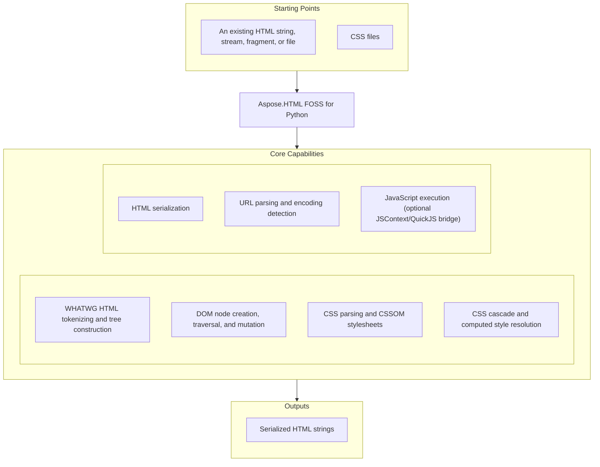

# Aspose.HTML FOSS for Python

[](pyproject.toml) [](LICENSE) [](https://github.com/aspose-html-foss/Aspose.HTML-FOSS-for-Python/graphs/contributors)

[](https://products.aspose.org/html/python/)

Aspose.HTML FOSS for Python is a free, open-source Python library for parsing HTML into a
standards-based DOM. It builds and mutates WHATWG-style document trees, parses and applies CSS
stylesheets and resolves the cascade, serializes documents back to markup, and parses URLs and
character encodings — all in pure Python with no browser engine or native dependencies.

## Navigation

- [At a Glance](#at-a-glance)
- [Key Capabilities](#key-capabilities)
- [Installation](#installation)
- [Quick Start](#quick-start)
- [Additional Examples](#additional-examples)
- [API Reference](#api-reference)
- [Documentation & Resources](#documentation--resources)
- [Scope and Limitations](#scope-and-limitations)
- [Development and Testing](#development-and-testing)
- [License](#license)

## At a Glance



## Key Capabilities

- Parse HTML strings, byte streams, fragments, and files into a DOM tree with `HTMLDocument`.
- Create, inspect, and mutate DOM nodes with `Document`, `Element`, `Node`, and the standard HTML element classes.
- Serialize DOM trees back to markup through the DOM-style `DOMParser` and `XMLSerializer` entry points, or the `serialise()` helper.
- Manage CSS stylesheets with `CSSStyleSheet`, individual CSSOM rule types, and `CSS.supports()`.
- Resolve the CSS cascade — specificity, `!important`, and inheritance — with `Element.get_computed_style()`.
- Detect and decode HTML byte-stream character encodings, and parse URLs and query strings with `URL` and `URLSearchParams`.
- Execute JavaScript against a parsed DOM through the optional QuickJS-backed `JSContext` bridge.

## Installation

A PyPI package has not been published yet, and `pip install` currently fails for this repository
at any source (local path or a direct `git+https` URL) — see
[upstream-issues.md](upstream-issues.md) for the root cause. Until that's fixed upstream, install
by putting the source tree on your Python path directly instead:

```bash
git clone https://github.com/aspose-html-foss/Aspose.HTML-FOSS-for-Python.git
cd Aspose.HTML-FOSS-for-Python
python -m pip install "skia-python>=87.0,<145"
export PYTHONPATH="$PWD/src:$PYTHONPATH"   # Windows: set PYTHONPATH=%cd%\src;%PYTHONPATH%
```

For JavaScript-bridge support, also install the optional `quickjs` dependency directly:

```bash
python -m pip install "quickjs>=1.19,<2"
```

The package supports Python 3.10 and later.

## Quick Start

Parse HTML and update the DOM:

```python
from aspose_html import HTMLDocument, serialise

document = HTMLDocument.parse("""
<!doctype html>
<html>
  <body>
    <main id="content">
      <h1>Hello HTML</h1>
    </main>
  </body>
</html>
""")

content = document.get_element_by_id("content")
paragraph = document.create_element("p")
paragraph.text_content = "Created with Aspose.HTML FOSS for Python."
content.append_child(paragraph)

print(serialise(content))
```

Build a document and resolve the CSS cascade:

```python
from aspose_html.cssom import CSSStyleSheet
from aspose_html.dom import Document

doc = Document()
el = doc.create_element("div")
doc.append_child(el)

sheet = CSSStyleSheet()
sheet.replace_sync("div { color: red }")
doc.attach_style_sheet(sheet)

el.style.set_property("color", "blue")

style = el.get_computed_style()
print(style.get_property_value("color"))  # "blue" — inline beats the author stylesheet rule
```

## Additional Examples

Runnable scripts are available in the [`examples`](examples/) directory. The patterns below are
adapted from the library's own test suite and cover encoding detection, CSS cascade and
inheritance resolution, and CSS feature support.

### Detect a Byte Stream's Encoding

```python
from aspose_html.encoding.detection import detect_encoding

result = detect_encoding(b"\xef\xbb\xbf<p>x</p>")
print(result.encoding)     # "utf-8"
print(result.confidence)   # "certain"
print(result.text)         # "<p>x</p>" — the BOM is stripped from the decoded text
```

<details>
<summary>View Additional Examples</summary>

### Resolve Inline-Only Styles Without a Stylesheet

```python
from aspose_html.dom import Document

doc = Document()
el = doc.create_element("div")
doc.append_child(el)
el.style.set_property("color", "green")

style = el.get_computed_style()
print(style.get_property_value("color"))  # "green"
```

### Read an Empty Computed Value When No Rule Matches

```python
from aspose_html.dom import Document

doc = Document()
el = doc.create_element("span")
doc.append_child(el)

style = el.get_computed_style()
print(repr(style.get_property_value("color")))  # ''
```

### Inherit a Property From Parent to Child

```python
from aspose_html.cssom import CSSStyleSheet
from aspose_html.dom import Document

doc = Document()
parent = doc.create_element("div")
child = parent.owner_document.create_element("span")
doc.append_child(parent)
parent.append_child(child)

sheet = CSSStyleSheet()
sheet.replace_sync("div { color: red }")
doc.attach_style_sheet(sheet)

child_style = child.get_computed_style()
print(child_style.get_property_value("color"))  # "red" — color is an inherited property
```

### Resolve the `Inherit` Keyword on a Root Element

```python
from aspose_html.dom import Document

doc = Document()
el = doc.create_element("div")
doc.append_child(el)
el.style.set_property("color", "inherit")

style = el.get_computed_style()
print(repr(style.get_property_value("color")))  # '' — no parent, so inherit resolves to initial
```

### Check CSS Property Support

```python
from aspose_html.cssom import CSS

print(CSS.supports("border-width", "1px"))   # True
print(CSS.supports("border-style", "solid")) # True
print(CSS.supports("border-color", "red"))   # True
```

### Expand a Border Shorthand Across All Four Sides

```python
from aspose_html.cssom import CSSStyleSheet
from aspose_html.dom import Document


def make_element(css: str):
    doc = Document()
    el = doc.create_element("div")
    doc.append_child(el)
    sheet = CSSStyleSheet()
    sheet.replace_sync(f"div {{ {css} }}")
    doc.attach_style_sheet(sheet)
    return el


el = make_element("border-width: 2px")
style = el.get_computed_style()
print(style.get_property_value("border-top-width"))     # "2px"
print(style.get_property_value("border-right-width"))   # "2px"
print(style.get_property_value("border-bottom-width"))  # "2px"
print(style.get_property_value("border-left-width"))    # "2px"
```

### Parse a URL and Edit Its Query Parameters

```python
from aspose_html import URL

url = URL("https://example.com/articles?category=html")
url.search_params.set("page", "2")

print(str(url))
```

</details>

## API Reference

The primary entry point is `HTMLDocument`, which parses HTML into a `Document` tree. From there,
`Document` and `Element` expose a WHATWG-style DOM for traversal and mutation, `CSSStyleSheet` and
`Element.get_computed_style()` cover CSS parsing and cascade resolution, and `URL` /
`URLSearchParams` cover URL handling. The full reference documents 243 public types.

<details>
<summary>View the Supported Public API Surface</summary>

### Core API

| Class | Description |
|---|---|
| `HTMLDocument` | Top-level entry point for parsing HTML into a Document tree. |

### Css

| Class | Description |
|---|---|
| `AttributeSelector` | Matches elements by attribute presence or value. |
| `ClassSelector` | Matches elements whose class_list contains class_name: ``.foo``. |
| `ComplexNotPseudoClass` | Matches elements that do NOT match any selector in the argument list. |
| `ComplexSelector` | A chain of CompoundSelectors joined by Combinators. |
| `CompoundSelector` | A sequence of simple selectors that all apply to the same element. |
| `HasPseudoClass` | Matches elements that have at least one relative match in their subtree. |
| `IsPseudoClass` | Matches elements that match any selector in a forgiving selector list. |
| `NthArgument` | Parsed An+B argument for :nth-child and related pseudo-classes. |
| `NthFilteredChildPseudoClass` | Matches elements at An+B position among siblings filtered by a selector. |
| `PseudoClassSelector` | A pseudo-class selector. |
| `SelectorList` | The root AST node. |
| `TypeSelector` | Matches elements by tag name: ``div``. |
| `UniversalSelector` | Matches any element: ``*``. |
| `WherePseudoClass` | Identical matching semantics to IsPseudoClass; always contributes 0 specificity. |

#### Enumerations

| Enumeration | Description |
|---|---|
| `AttributeOperator` | Attribute selector operator types (CSS Selectors Level 3). |
| `Combinator` | Selector combinator types (CSS Selectors Level 3). |

### Cssom

| Class | Description |
|---|---|
| `CSS` | Namespace class for CSS static utilities (CSS Conditional Rules §6). |
| `CSSCounterStyleRule` | A ``@counter-style`` rule (CSS Counter Styles Level 3 §3, CSSOM §5.4 type 11). |
| `CSSDeclarationBlock` | A small CSSStyleDeclaration-compatible declaration container. |
| `CSSFontFaceRule` | A ``@font-face`` rule holding font descriptor declarations (CSS Fonts §4.4). |
| `CSSImportRule` | An ``@import`` statement rule (CSSOM §6.7). |
| `CSSKeyframeRule` | A single keyframe descriptor within a ``@keyframes`` rule (CSSOM Animations §7). |
| `CSSKeyframesRule` | A ``@keyframes`` rule containing animation keyframe descriptors (CSSOM Animations §7). |
| `CSSLayerBlockRule` | A CSS ``@layer`` block rule assigning child rules to a named cascade layer. |
| `CSSLayerStatementRule` | A CSS ``@layer`` statement rule declaring cascade layer order. |
| `CSSMediaRule` | Media rule scaffold for nested style rules. |
| `CSSNamespaceRule` | A ``@namespace`` rule (CSSOM §6.6, type 10). |
| `CSSPageRule` | CSS ``@page`` rule (CSSOM §6.4). |
| `CSSPropertyRule` | CSS ``@property`` rule stub (CSS Properties and Values API §3). |
| `CSSRule` | Base class for CSSOM rules. |
| `CSSRuleList` | Ordered, live CSS rule collection. |
| `CSSStyleRule` | Style rule (``selector { declarations }``). |
| `CSSStyleSheet` | Minimal CSSOM stylesheet object (CSSOM §6.4). |
| `CSSSupportsRule` | A ``@supports`` rule with a condition and nested style rules (CSS Conditional Rules §2). |

### Dom

| Class | Description |
|---|---|
| `AbortController` | Controls cancellation of operations via an :class:`AbortSignal`. |
| `AbortSignal` | Represents the signal half of an AbortController pair. |
| `AbstractRange` | Read-only boundary-point contract shared by range-family APIs. |
| `Attr` | An attribute attached to an Element. |
| `BarProp` | Represents a browser toolbar object (WHATWG HTML §7.7.3). |
| `BroadcastChannel` | Deterministic same-runtime BroadcastChannel fan-out delivery. |
| `BrowsingContext` | Internal owner of navigation lifecycle/document state. |
| `CDATASection` | A CDATA section node (extends Text per WHATWG DOM Standard). |
| `CSSStyleDeclaration` | A live view of an element's inline style attribute. |
| `CharacterData` | Abstract base for Text, Comment, CDATASection, and ProcessingInstruction. |
| `Comment` | An HTML comment node. |
| `ComputedStyleDeclaration` | Read-only resolved style declarations for an element. |
| `Console` | A minimal `window.console`-style logging stub (`log`/`info`/`warn`/`error`) backed by Python's `logging`. |
| `Crypto` | Minimal stub for the Crypto interface (W3C Web Crypto API §10.1). |
| `CustomElementRegistry` | Registers custom element constructors for a `Document`, mirroring the WHATWG `window.customElements` API. |
| `CustomEvent` | An Event carrying an arbitrary detail payload. |
| `DOMConfiguration` | Baseline DOMConfiguration compatibility surface. |
| `DOMException` | Base for all DOM exceptions. |
| `DOMImplementation` | Legacy DOMImplementation compatibility surface. |
| `DOMParser` | Parse markup strings into DOM documents. |
| `DOMRect` | An axis-aligned bounding rectangle (CSSOM View §7.1). |
| `DOMRectList` | An immutable sequence of :class:`DOMRect` objects (CSSOM View §7.2). |
| `DOMStringMap` | A live dict-like view of an element's ``data-*`` custom attributes. |
| `DOMTokenList` | A live, mutable set of space-separated tokens backed by an element attribute. |
| `DataCloneError` | Raised when a value cannot be serialized by the structured clone algorithm. |
| `Document` | The root of a DOM tree. |
| `DocumentFragment` | A lightweight container for a sub-tree. |
| `DocumentPosition` | Named constants for the bitmask returned by ``Node.compare_document_position``. |
| `DocumentType` | A document type declaration node (`<!DOCTYPE html>`). |
| `Element` | An HTML or XML element node. |
| `ErrorEvent` | Script error event (WHATWG HTML §8.1.3.6). |
| `Event` | A DOM event object per WHATWG DOM §2.2. |
| `EventTarget` | Base class for objects that can receive DOM events. |
| `FocusEvent` | Focus transition event (WHATWG UI Events §5.4). |
| `FormData` | Snapshot collection of form control name/value pairs. |
| `HTMLAddressElement` | HTML `<address>` element. |
| `HTMLAnchorElement` | HTML `<a>` anchor element. |
| `HTMLAreaElement` | HTML `<area>` image-map hyperlink area. |
| `HTMLArticleElement` | HTML `<article>` element. |
| `HTMLAsideElement` | HTML `<aside>` element. |
| `HTMLAudioElement` | HTML `<audio>` element. |
| `HTMLBRElement` | HTML `<br>` line-break element (structural subclass). |
| `HTMLBaseElement` | HTML `<base>` element. |
| `HTMLBodyElement` | HTML `<body>` element (structural subclass). |
| `HTMLButtonElement` | HTML `<button>` element. |
| `HTMLCanvasElement` | HTML `<canvas>` element. |
| `HTMLCollection` | A live, ordered collection of Element-type children only. |
| `HTMLDListElement` | HTML `<dl>` definition list element. |
| `HTMLDataElement` | HTML `<data>` element. |
| `HTMLDataListElement` | HTML `<datalist>` element providing autocomplete suggestions. |
| `HTMLDetailsElement` | HTML `<details>` disclosure widget element. |
| `HTMLDialogElement` | HTML `<dialog>` modal/non-modal dialog element. |
| `HTMLDivElement` | HTML `<div>` block container element. |
| `HTMLElement` | Base class for all HTML-namespace element types. |
| `HTMLEmbedElement` | HTML `<embed>` element. |
| `HTMLFieldSetElement` | HTML `<fieldset>` element for grouping form controls. |
| `HTMLFigCaptionElement` | HTML `<figcaption>` element. |
| `HTMLFigureElement` | HTML `<figure>` element. |
| `HTMLFooterElement` | HTML `<footer>` element. |
| `HTMLFormElement` | HTML `<form>` element. |
| `HTMLHRElement` | HTML `<hr>` thematic-break element (structural subclass). |
| `HTMLHeadElement` | HTML `<head>` element (structural subclass). |
| `HTMLHeaderElement` | HTML `<header>` element. |
| `HTMLHeadingElement` | HTML heading element — covers `<h1>` through `<h6>`. |
| `HTMLHtmlElement` | HTML `<html>` document element (structural subclass). |
| `HTMLIFrameElement` | HTML `<iframe>` element. |
| `HTMLImageElement` | HTML `` image element. |
| `HTMLInputElement` | HTML `<input>` form control element. |
| `HTMLLIElement` | HTML `<li>` list item element. |
| `HTMLLabelElement` | HTML `<label>` element. |
| `HTMLLegendElement` | HTML `<legend>` element (WHATWG §4.10.4). |
| `HTMLLinkElement` | HTML `<link>` element. |
| `HTMLMainElement` | HTML `<main>` element. |
| `HTMLMapElement` | HTML `<map>` element. |
| `HTMLMarkElement` | HTML `<mark>` element. |
| `HTMLMediaElement` | Base class for HTML media elements (`<audio>` / `<video>`). |
| `HTMLMenuElement` | Represents an HTML `<menu>` element. |
| `HTMLMetaElement` | HTML `<meta>` element. |
| `HTMLMeterElement` | HTML `<meter>` element for displaying a scalar value in a range. |
| `HTMLModElement` | HTML `<ins>`/`<del>` modification element. |
| `HTMLNavElement` | HTML `<nav>` element. |
| `HTMLNoScriptElement` | HTML `<noscript>` element. |
| `HTMLOListElement` | HTML `<ol>` ordered list element. |
| `HTMLObjectElement` | HTML `<object>` element. |
| `HTMLOptGroupElement` | HTML `<optgroup>` element for grouping options in a select list. |
| `HTMLOptionElement` | HTML `<option>` element representing a choice in a select list. |
| `HTMLOptionsCollection` | Live collection of `<option>` elements for a `<select>`. |
| `HTMLOutputElement` | HTML `<output>` element for displaying calculation results. |
| `HTMLParagraphElement` | HTML `<p>` paragraph element. |
| `HTMLParamElement` | HTML `<param>` element. |
| `HTMLPictureElement` | HTML `<picture>` element (structural subclass). |
| `HTMLPreElement` | HTML `<pre>` preformatted text element (structural subclass). |
| `HTMLProgressElement` | HTML `<progress>` element showing task completion. |
| `HTMLQuoteElement` | HTML `<blockquote>`/`<q>` quote element. |
| `HTMLRubyElement` | HTML `<ruby>`/`<rt>`/`<rp>` element. |
| `HTMLScriptElement` | HTML `<script>` element. |
| `HTMLSectionElement` | HTML `<section>` element. |
| `HTMLSelectElement` | HTML `<select>` element. |
| `HTMLSmallElement` | HTML `<small>` element. |
| `HTMLSourceElement` | HTML `<source>` element. |
| `HTMLSpanElement` | HTML `<span>` inline container element. |
| `HTMLStyleElement` | HTML `<style>` element. |
| `HTMLSummaryElement` | Represents an HTML `<summary>` element. |
| `HTMLTableCaptionElement` | HTML `<caption>` element. |
| `HTMLTableCellElement` | HTML `<td>` or `<th>` element. |
| `HTMLTableColElement` | HTML `<col>` or `<colgroup>` element. |
| `HTMLTableElement` | HTML `<table>` element. |
| `HTMLTableRowElement` | HTML `<tr>` element. |
| `HTMLTableSectionElement` | HTML `<thead>`, `<tbody>`, or `<tfoot>` element. |
| `HTMLTemplateElement` | HTML `<template>` element holding inert content. |
| `HTMLTextAreaElement` | HTML `<textarea>` multi-line text input element. |
| `HTMLTimeElement` | HTML `<time>` element. |
| `HTMLTitleElement` | HTML `<title>` element. |
| `HTMLTrackElement` | HTML `<track>` element. |
| `HTMLUListElement` | HTML `<ul>` unordered list element. |
| `HTMLUnknownElement` | HTML unknown element interface (export-only, not registry-dispatched). |
| `HTMLVideoElement` | HTML `<video>` element. |
| `HTMLWBRElement` | HTML `<wbr>` element. |
| `HashChangeEvent` | Same-document fragment navigation event. |
| `HierarchyRequestError` | Raised when the tree hierarchy is violated. |
| `History` | In-memory session history for a Window. |
| `InUseAttributeError` | Raised when an Attr is already in use by another element. |
| `IndexSizeError` | Raised when an index or size is out of range. |
| `InputEvent` | Text-input event (WHATWG Input Events Level 2 / WHATWG UI Events §5.6). |
| `IntersectionObserver` | Headless IntersectionObserver API-shape stub. |
| `IntersectionObserverEntry` | Headless IntersectionObserver entry stub. |
| `InvalidCharacterError` | Raised when an invalid character is used. |
| `InvalidStateError` | Raised when an operation is performed in an invalid state. |
| `KeyboardEvent` | Keyboard event (WHATWG UI Events §5.3). |
| `Location` | A `window.location`-style stub exposing the owning `Window`'s current document URL (`href` and related properties). |
| `MediaQueryList` | MediaQueryList returned by :meth:`Window.match_media`. |
| `MessageChannel` | Pair of linked :class:`MessagePort` endpoints. |
| `MessagePort` | Deterministic same-runtime MessagePort queue baseline. |
| `MouseEvent` | Mouse or pointer event (WHATWG UI Events §5.2). |
| `MutationObserver` | Observe DOM mutations on a target node. |
| `MutationRecord` | One DOM mutation notification record. |
| `NamedNodeMap` | An ordered map of Attr objects keyed by attribute name. |
| `Navigator` | A minimal `window.navigator`-style stub exposing user-agent, platform, and language properties. |
| `NoModificationAllowedError` | Raised when a node cannot be modified in its current context. |
| `Node` | Abstract base class for all WHATWG DOM nodes. |
| `NodeFilter` | Constants for TreeWalker and NodeIterator filtering. |
| `NodeIterator` | Flat, stateful iteration over DOM nodes matching a filter. |
| `NodeList` | A live, ordered collection of Node objects. |
| `NodeType` | Integer constants for the ``node_type`` property of DOM nodes. |
| `NotFoundError` | Raised when a node is not found in the expected location. |
| `NotSupportedError` | Raised when an operation is not supported. |
| `ParseError` | A parse error recorded during tree construction. |
| `Performance` | Minimal stub for the Performance interface. |
| `PerformanceEntry` | A single performance timeline entry. |
| `PerformanceTiming` | Legacy Navigation Timing Level 1 interface stub. |
| `PopStateEvent` | History traversal event carrying the active entry state. |
| `ProcessingInstruction` | A processing instruction node (e.g. `<?xml version="1.0"?>`). |
| `Range` | A contiguous portion of a document tree (WHATWG DOM §5). |
| `ResizeObserver` | Headless ResizeObserver API-shape stub. |
| `ResizeObserverEntry` | Headless ResizeObserver entry stub. |
| `Screen` | Browser screen geometry — all values are stubs (server-side context). |
| `SecurityError` | Raised when an operation is blocked for security reasons. |
| `Selection` | Document-scoped selection with single-range semantics. |
| `StaticRange` | Immutable boundary-point range initialized from an init object. |
| `Storage` | Key-value store implementing the WHATWG HTML §12 Storage interface. |
| `StyleSheetList` | Live ordered stylesheet collection. |
| `SubtleCrypto` | Stub for the SubtleCrypto interface (W3C Web Crypto API §10). |
| `SyntaxError` | Raised when a string does not match the expected pattern or grammar. |
| `Text` | A text node. |
| `TreeWalker` | Cursor-style DOM traversal bounded to a root subtree. |
| `UIEvent` | Base class for user-interface events (WHATWG UI Events §5.1). |
| `ValidityState` | Constraint-validation flags for a form control. |
| `VisualViewport` | CSSOM View §9 VisualViewport — all values are headless stubs. |
| `Window` | Per-document window object with EventTarget behavior. |
| `WindowEventLoop` | Internal task-source scheduler used by ``Window``/``BrowsingContext``. |
| `WrongDocumentError` | Raised when a node belongs to a different document. |
| `XMLSerializer` | Serialise DOM nodes to strings. |

### Encoding

| Class | Description |
|---|---|
| `EncodingDetectionResult` | Result of encoding detection and decoding for an HTML byte stream. |
| `UnsupportedEncodingError` | Raised when the detected encoding has no Python codec. |

### Js

| Class | Description |
|---|---|
| `JSContext` | A JavaScript execution context backed by QuickJS, pre-wired to a DOM. |
| `JSEvaluationError` | Raised when a JavaScript expression throws an exception. |
| `ModuleLoadPolicy` | Constants governing how a JSContext resolves module specifiers. |
| `ModuleNotFoundError` | Raised when a module specifier has no registered source. |
| `ModuleRegistry` | Maps module specifiers to ES module source strings. |

### Layout

| Class | Description |
|---|---|
| `BlockFragment` | Geometry fragment for a block-level box. |
| `BoxNode` | Single box-tree node produced by :func:`build_box_tree`. |
| `BoxRoot` | Root wrapper returned by :func:`build_box_tree`. |
| `BreakHints` | CSS Fragmentation break/widow/orphan hints resolved for a box during pagination layout. |
| `ComputedStyle` | Immutable layout-facing snapshot of an element's resolved style. |
| `Display` | Resolved display triple per CSS Display L3 §2. |
| `EdgeSizes` | Logical edge sizes in CSS px units. |
| `FragmentRoot` | Root wrapper for block-layout fragment output. |
| `InlineTextFragment` | Positioned inline text fragment for a single shaped run. |
| `LineFragment` | Single inline formatting context line box. |
| `PageFragment` | Single paginated fragmentainer (page box) with ordered content. |
| `PageMarginBoxes` | Placeholder page-margin-box container for later paint stages. |
| `ShapedRun` | Shaped text-run payload with deterministic metrics. |

### Tokenizer

| Class | Description |
|---|---|
| `CharacterToken` | A character token carrying one or more Unicode characters. |
| `CommentToken` | A comment token, e.g. `<!-- text -->`. |
| `DoctypeToken` | A DOCTYPE token emitted by the WHATWG tokeniser. |
| `EndTagToken` | An end tag token, e.g. `</div>`. |
| `EofToken` | An end-of-file token. |
| `StartTagToken` | A start tag token, e.g. `<div class="x">`. |
| `Tokenizer` | WHATWG HTML tokeniser (§13.2.5). |

#### Enumerations

| Enumeration | Description |
|---|---|
| `TokenizerState` | All tokeniser states defined in WHATWG HTML Living Standard §13.2.5. |

### Tree

| Class | Description |
|---|---|
| `ActiveFormattingList` | The list of active formatting elements as defined in §13.2.4.3. |
| `StackOfOpenElements` | The stack of open elements as defined in §13.2.4.2. |
| `TemplateInsertionModeStack` | The template insertion mode stack per §13.2.4.1. |
| `TreeBuilder` | Drives the WHATWG tree construction algorithm. |

#### Enumerations

| Enumeration | Description |
|---|---|
| `InsertionMode` | The 23 WHATWG insertion modes (§13.2.6). |

### Url

| Class | Description |
|---|---|
| `URL` | A WHATWG URL parser and serializer, with a `parse()` factory that returns `None` on invalid input. |
| `URLParseError` | Raised when a string cannot be parsed as a URL. |
| `URLSearchParams` | Ordered query-string pairs with duplicate-key support. |

---

#### Detailed Member Reference

### HTML Documents

- `HTMLDocument.parse(html, encoding=None, base_url=None) -> Document`
- `HTMLDocument.parse_fragment(html, context_element=None, encoding=None) -> DocumentFragment`
- `HTMLDocument.load(path) -> Document`

### DOM Core

- `Document(Node)` — the root of a DOM tree
  - `create_element(tag_name) -> HTMLElement`, `create_text_node`, `create_comment`, `create_document_fragment`
  - `get_element_by_id(id) -> Element | None`
  - `get_elements_by_tag_name(name) -> HTMLCollection`, `get_elements_by_class_name(names) -> HTMLCollection`
  - `query_selector(selector) -> Element | None`, `query_selector_all(selector) -> NodeList`
  - `attach_style_sheet(sheet)`, `detach_style_sheet(sheet)`, `save(path, encoding=None)`
  - `document_element`, `head`, `body`, `title`, `style_sheets`, `forms`, `images`, `links`
- `Element(Node)` — an HTML or XML element node
  - `get_attribute(name)`, `set_attribute(name, value)`, `remove_attribute(name)`, `has_attribute(name)`
  - `matches(selector) -> bool`, `closest(selector) -> Element | None`
  - `query_selector`, `query_selector_all`, `get_elements_by_tag_name`, `get_elements_by_class_name`
  - `get_computed_style() -> ComputedStyleDeclaration`
  - `id`, `class_name`, `class_list`, `dataset`, `attributes`, `inner_html`, `outer_html`, `text_content`, `style`
- `Node` — abstract base for all DOM nodes: `append_child`, `insert_before`, `remove_child`, `replace_child`, `clone_node`, `contains`, `parent_node`, `child_nodes`, `first_child`, `last_child`
- HTML element classes covering the WHATWG element set, e.g. `HTMLAnchorElement`, `HTMLFormElement`, `HTMLInputElement`, `HTMLSelectElement`, `HTMLTableElement`, `HTMLImageElement`, and related table/list/text/media/form classes
- Collections: `NodeList`, `HTMLCollection`, `NamedNodeMap`, `HTMLOptionsCollection`
- Events: `Event`, `CustomEvent`, `MouseEvent`, `KeyboardEvent`, `FocusEvent`, `InputEvent`, `ErrorEvent`
- Traversal and ranges: `TreeWalker`, `NodeIterator`, `Range`, `StaticRange`, `Selection`
- DOM-style parsing and serialization:
  - `DOMParser.parse_from_string(string, type) -> Document`
  - `XMLSerializer.serialize_to_string(root) -> str`

### Serialization

- `serialise(node) -> str` — top-level helper to serialize a node or subtree back to HTML

### CSS and CSSOM

- `CSS.supports(property_or_condition, value=None) -> bool`
- `CSSStyleSheet`
  - `replace_sync(css_text)`, `insert_rule(rule_text, index)`, `delete_rule(index)`, `add_rule(selector, style, index)`
  - `css_rules`, `rules`, `href`, `title`, `media`, `disabled`
- Rule types: `CSSStyleRule`, `CSSMediaRule`, `CSSKeyframesRule`, `CSSKeyframeRule`, `CSSFontFaceRule`, `CSSImportRule`, `CSSNamespaceRule`, `CSSPageRule`, `CSSSupportsRule`, `CSSLayerBlockRule`, `CSSLayerStatementRule`, `CSSCounterStyleRule`, `CSSPropertyRule`, `CSSRule`, `CSSRuleList`
- `CSSStyleDeclaration` — the live inline `Element.style` declaration
- `ComputedStyleDeclaration` — read-only resolved style returned by `Element.get_computed_style()`
- Selector AST types used by the matcher: `TypeSelector`, `ClassSelector`, `AttributeSelector`, `PseudoClassSelector`, `CompoundSelector`, `ComplexSelector`, `SelectorList`, `UniversalSelector`

### URL

- `URL(input, base=None)`
  - `href`, `protocol`, `hostname`, `port`, `pathname`, `search`, `hash`, `origin`, `search_params`
  - `URL.parse(input, base=None) -> URL | None`, `URL.can_parse(input, base=None) -> bool`
- `URLSearchParams` — `append`, `delete`, `get`, `get_all`, `has`, `set`, `sort`, iteration via `keys`/`values`/`items`/`entries`
- `URLParseError` — raised when a string cannot be parsed as a URL

### Encoding

- `detect_encoding(data: bytes) -> EncodingDetectionResult` with `.encoding`, `.confidence`, `.text`
- `UnsupportedEncodingError` — raised when the detected encoding has no Python codec

### JavaScript Bridge (Requires the `[Js]` Extra)

- `JSContext` — a JavaScript execution context backed by QuickJS, pre-wired to a DOM
- `ModuleRegistry` — maps module specifiers to ES module source strings
- `ModuleLoadPolicy` — constants governing how a `JSContext` resolves module specifiers
- `JSEvaluationError` — raised when a JavaScript expression throws an exception

### Layout (Structural Geometry, Not Visual Rendering)

- `BoxNode`, `BoxRoot` — box-tree nodes produced by the internal box-building pass
- `BlockFragment`, `LineFragment`, `InlineTextFragment`, `PageFragment` — geometry fragments for block, inline, and paginated layout
- `ComputedStyle`, `Display`, `EdgeSizes` — layout-facing resolved style and box-model primitives

### Tokenizer and Tree Construction

- `Tokenizer` — the WHATWG HTML tokenizer (§13.2.5)
- `TreeBuilder` — drives the WHATWG tree construction algorithm
- Token types: `StartTagToken`, `EndTagToken`, `CharacterToken`, `CommentToken`, `DoctypeToken`, `EofToken`

</details>

## Documentation & Resources

- **[Getting started guide](https://docs.aspose.org/html/python/)** — installation and section guides for parsing HTML, building DOM trees, applying CSS, and computing styles.
- **[How-to guides & FAQ](https://kb.aspose.org/html/python/)** — task-focused answers for parsing HTML into a DOM, applying CSS, computing styles, and handling URLs and encodings.
- **[Full API reference](https://reference.aspose.org/html/python/)** — the complete, browsable reference for all 243 public types (the [API reference](#api-reference) section above covers the essentials).
- **[Contributing guide](CONTRIBUTING.md)** — development setup and how to submit changes.
- **[Security policy](SECURITY.md)** — report vulnerabilities through GitHub's private
  vulnerability reporting flow when available, or via the project issue tracker.
- **[Changelog](CHANGELOG.md)** — release history.
- **[Public API reference notes](PUBLIC_API.md)** — the maintainers' own notes on the public API surface.
- Found a bug or have a feature request? [Open an issue](https://github.com/aspose-html-foss/Aspose.HTML-FOSS-for-Python/issues) on GitHub.

## Scope and Limitations

This project focuses on HTML parsing, DOM construction and mutation, CSS parsing and cascade
resolution, serialization, and URL/encoding handling — headless and pure Python, with no visual
rendering or paint pipeline. A few specific gaps to be aware of:

- Stateful user-action CSS pseudo-classes such as `:focus-within` always evaluate to no-match, and
  other dynamic pseudo-classes outside the implemented selector grammar raise `NotImplementedError`
  — there is no live browser interaction model.
- Form constraint-validation state computation is not implemented (internal `ValidityState`
  resolution raises `NotImplementedError`).
- `HTMLImageElement.decode()` raises `NotImplementedError` — there is no image decode/paint pipeline
  in headless mode.
- JavaScript execution is opt-in through `JSContext` (requires the `[js]` extra), and dynamic
  `import()` inside evaluated scripts is not supported; use `JSContext.register_module()` plus
  `eval_module()` instead.
- The library does not render pages visually or convert HTML to other output formats such as PDF or
  images.

For workflows that need visual rendering, format conversion, or broader browser-compatible
behavior, see [Aspose.HTML for Python — Enterprise Edition](https://products.aspose.com/html/python-net/).

## Development and Testing

Install the test dependencies and run the test suite — the package itself needs no separate
install step for this, matching the [Installation](#installation) approach above:

```bash
python -m venv .venv
. .venv/bin/activate
python -m pip install "skia-python>=87.0,<145" "pytest>=8"
python -m pytest
```

Add JavaScript-bridge support to include the optional `quickjs`-backed tests and doctests:

```bash
python -m pip install "quickjs>=1.19,<2"
```

Without the `quickjs` package installed, `src/aspose_html/js/` is automatically skipped from
doctest collection and the JS-bridge tests under `tests/test_js/` skip via
`pytest.importorskip("quickjs")`.

## License

This project is licensed under the [MIT License](LICENSE). The MIT License permits use, copying,
modification, distribution, sublicensing, and commercial use, provided its copyright and
permission notice are retained. The software is provided without warranty.
