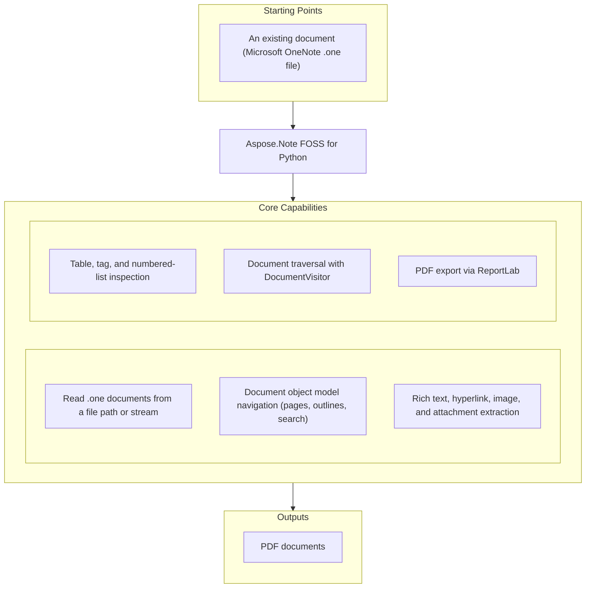

# Aspose.Note FOSS for Python

[](https://pypi.org/project/aspose-note/) [](https://pypi.org/project/aspose-note/) [](https://github.com/aspose-note-foss/Aspose.Note-FOSS-for-Python/actions/workflows/ci.yml) [](LICENSE) [](https://github.com/aspose-note-foss/Aspose.Note-FOSS-for-Python/graphs/contributors)

[](https://products.aspose.org/note/python/)

Aspose.Note FOSS for Python is an official, free and open-source Aspose Python library for
reading Microsoft OneNote `.one` files through an Aspose.Note-compatible API. It parses
MS-ONE/OneStore data into a traversable document object model, extracts structured content, and
exports documents to PDF.

## Navigation

- [At a glance](#at-a-glance)
- [Key capabilities](#key-capabilities)
- [Installation](#installation)
- [Quick start](#quick-start)
- [Additional examples](#additional-examples)
- [API reference](#api-reference)
- [Documentation & resources](#documentation--resources)
- [Scope and limitations](#scope-and-limitations)
- [Development and testing](#development-and-testing)
- [Third-party notices](#third-party-notices)
- [License](#license)

## At a Glance



## Key Capabilities

- Read `.one` documents from a file path or binary stream.
- Navigate an Aspose-style document object model with pages, outlines, and type-based search.
- Extract rich text, formatting runs, hyperlinks, images, attached files, and document metadata.
- Inspect tables, OneNote tags, numbered lists, and nested outline elements.
- Traverse documents with `DocumentVisitor`.
- Export documents to PDF through `Document.Save(..., SaveFormat.Pdf)` using ReportLab.

## Installation

Install the library from PyPI:

```bash
python -m pip install aspose-note
```

Install PDF export support:

```bash
python -m pip install "aspose-note[pdf]"
```

The package supports Python 3.10 and later.

## Quick Start

Load a OneNote document and inspect its pages:

```python
from aspose.note import Document

doc = Document("testfiles/SimpleTable.one")
print(doc.DisplayName)
pages = list(doc)
print(len(pages))

for page in pages:
    title = page.Title.TitleText.Text if page.Title and page.Title.TitleText else "(no title)"
    print(title)
```

Export a document to PDF:

```python
from aspose.note import Document, SaveFormat

doc = Document("testfiles/FormattedRichText.one")
doc.Save("out.pdf", SaveFormat.Pdf)
```

## Additional Examples

Runnable scripts and sample OneNote documents are available in the
[`examples`](examples/) directory. The most common operations are collected below without
obscuring the primary installation and quick-start path.

### Extract All Text

```python
from aspose.note import Document, RichText

doc = Document("testfiles/FormattedRichText.one")
texts = [rt.Text for rt in doc.GetChildNodes(RichText)]
print("\n".join(texts))
```

<details>
<summary>View Additional Examples</summary>

### Save All Images

```python
from aspose.note import Document, Image

doc = Document("testfiles/3ImagesWithDifferentAlignment.one")
for i, img in enumerate(doc.GetChildNodes(Image), start=1):
    name = img.FileName or f"image_{i}.bin"
    with open(name, "wb") as f:
        f.write(img.Bytes)
```

### Export With PDF Options

```python
from aspose.note import Document, SaveFormat
from aspose.note.saving import PdfSaveOptions

doc = Document("testfiles/TagSizes.one")
opts = PdfSaveOptions(
  JpegQuality=90,
)
doc.Save("out.pdf", opts)
```

### Load From a Binary Stream

```python
from pathlib import Path
from aspose.note import Document

one_path = Path("testfiles/SimpleTable.one")
with one_path.open("rb") as f:
  doc = Document(f)

print(doc.DisplayName)
print(len(list(doc)))
```

### Traverse the Document Structure

```python
from aspose.note import Document, Page, Outline, OutlineElement, RichText

doc = Document("testfiles/SimpleTable.one")

for page in doc.GetChildNodes(Page):
  title = page.Title.TitleText.Text if page.Title and page.Title.TitleText else "(no title)"
  print(f"# {title}")

  for outline in page.GetChildNodes(Outline):
    for oe in outline.GetChildNodes(OutlineElement):
      texts = [rt.Text for rt in oe.GetChildNodes(RichText)]
      if texts:
        print("-", " ".join(t.strip() for t in texts if t.strip()))
```

### Count Nodes With DocumentVisitor

```python
from aspose.note import Document, DocumentVisitor, Page, Image, RichText


class Counter(DocumentVisitor):
  def __init__(self) -> None:
    self.pages = 0
    self.rich_texts = 0
    self.images = 0

  def VisitPageStart(self, page: Page) -> None:
    self.pages += 1

  def VisitRichTextStart(self, rich_text: RichText) -> None:
    self.rich_texts += 1

  def VisitImageStart(self, image: Image) -> None:
    self.images += 1


doc = Document("testfiles/3ImagesWithDifferentAlignment.one")
counter = Counter()
doc.Accept(counter)
print(counter.pages, counter.rich_texts, counter.images)
```

### Extract Hyperlinks

```python
from aspose.note import Document, RichText

doc = Document("testfiles/FormattedRichText.one")
for rt in doc.GetChildNodes(RichText):
  for run in rt.TextRuns:
    if run.Style.IsHyperlink and run.Style.HyperlinkAddress:
      print(run.Text, "->", run.Style.HyperlinkAddress)
```

### Inspect OneNote Tags

```python
from aspose.note import Document, RichText, Image, Table

doc = Document("testfiles/TagSizes.one")


def dump_tags(kind: str, tags) -> None:
  for t in tags:
    print(kind, "tag:", t.Label, t.Icon)


for rt in doc.GetChildNodes(RichText):
  dump_tags("RichText", rt.Tags)

for img in doc.GetChildNodes(Image):
  dump_tags("Image", img.Tags)

for tbl in doc.GetChildNodes(Table):
  dump_tags("Table", tbl.Tags)
```

### Read Tables

```python
from aspose.note import Document, Table, TableRow, TableCell, RichText

doc = Document("testfiles/SimpleTable.one")

for table in doc.GetChildNodes(Table):
  print("Table columns:", [column.Width for column in table.Columns])
  for row_index, row in enumerate(table.GetChildNodes(TableRow), start=1):
    cells = row.GetChildNodes(TableCell)
    values: list[str] = []
    for cell in cells:
      cell_text = " ".join(rt.Text for rt in cell.GetChildNodes(RichText)).strip()
      values.append(cell_text)
    print(f"Row {row_index}:", values)
```

### Extract Attached Files

```python
from aspose.note import Document, AttachedFile

doc = Document("testfiles/OnePageWithFile.one")

for i, af in enumerate(doc.GetChildNodes(AttachedFile), start=1):
  name = af.FileName or f"attachment_{i}.bin"
  with open(name, "wb") as f:
    f.write(af.Bytes)
  print("saved:", name)
```

### Inspect Numbered Lists

```python
from aspose.note import Document, OutlineElement

doc = Document("testfiles/NumberedListWithTags.one")

for oe in doc.GetChildNodes(OutlineElement):
  nl = oe.NumberList
  if nl is None:
    continue
  print(
    "format=", nl.Format,
    "number_format=", nl.NumberFormat,
    "restart=", nl.Restart,
  )
```

</details>

## API Reference

`Document` is the primary entry point: it loads a `.one` file, exposes its page hierarchy as a
traversable node tree (`Page`, `Outline`, `OutlineElement`, `RichText`, `Image`, `Table`), and
saves to supported output formats via `Save()`. Traversal and type-based searches are supported
through `GetChildNodes()` and the `DocumentVisitor` pattern. The supported public surface spans
the `aspose.note` and `aspose.note.saving` modules; everything under `aspose.note._internal` is
implementation detail and may change without notice.

<details>
<summary>View the Supported Public API Surface</summary>

### Core API

| Class | Description |
|---|---|
| `AsposeNoteError` | Class extending Exception. |
| `AttachedFile` | AttachedFile.FileName holds the optional name of the attached file. |
| `CompositeNode` | CompositeNode.AppendChildLast appends the given node as the last child and returns the added node. |
| `Document` | Document.Save writes the document to a file, stream, or path using the given format or options. |
| `DocumentVisitor` | DocumentVisitor.VisitDocumentStart is invoked when traversal begins a Document node. |
| `FileCorruptedException` | Class extending AsposeNoteError. |
| `Image` | Image.Replace replaces the current image data with the provided Image instance. |
| `IncorrectDocumentStructureException` | Class extending AsposeNoteError. |
| `IncorrectPasswordException` | Class extending AsposeNoteError. |
| `License` | License.SetLicense loads a license from the given file path or binary stream. |
| `LoadOptions` | LoadOptions.DocumentPassword holds the password used to open encrypted documents, or None if not set. |
| `Metered` | Metered.SetMeteredKey stores the provided public and private keys for metered licensing. |
| `Node` | Node.Accept invokes the visitor on this node for traversal or processing. |
| `NoteTag` | NoteTag.CreateYellowStar creates a yellow‑star tag, optionally assigning a label. |
| `NumberList` | NumberList.GetNumberedListHeader returns the header string for the specified list number. |
| `Outline` | Outline.HorizontalOffset represents the horizontal offset of the outline within its container. |
| `OutlineElement` | OutlineElement.NumberList represents the numbered list applied to this outline element, or None if absent. |
| `Page` | Page.Clone creates a copy of the page; if cloneHistory is true the page's revision history is also copied. |
| `PageHistory` | PageHistory.Add adds the specified Page to the collection. |
| `ParagraphStyle` | ParagraphStyle.Default returns a ParagraphStyle instance initialized with default formatting values. |
| `RichText` | RichText.Append appends the given text with optional style to the end of the rich text. |
| `Table` | Table.Tags provides the collection of NoteTag objects attached to the table. |
| `TableCell` | A single cell within a `TableRow`, holding its own child content nodes. |
| `TableColumn` | TableColumn.Width represents the column width in points, or None if not set. |
| `TableRow` | A single row within a `Table`, containing `TableCell` children. |
| `TextRun` | TextRun.Text holds the plain string content of the text run. |
| `TextStyle` | TextStyle.Default returns a TextStyle object representing the library's default text formatting. |
| `Title` | Title.TitleText holds the RichText representing the title's main text, or None if absent. |
| `UnsupportedFileFormatException` | UnsupportedFileFormatException.FileFormat represents the file format that triggered the exception. |
| `UnsupportedSaveFormatException` | Class extending AsposeNoteError. |

#### Enumerations

| Enumeration | Description |
|---|---|
| `FileFormat` | FileFormat.Unknown represents an unspecified or unrecognized file format. |
| `HorizontalAlignment` | HorizontalAlignment.Left represents left horizontal alignment. |
| `NodeType` | NodeType.Document represents a OneNote document node, the root of the DOM hierarchy. |
| `SaveFormat` | SaveFormat.Pdf represents the PDF format used when saving a Document. |
| `TagStatus` | TagStatus.Open represents an open (active) tag status. |

### Saving

| Class | Description |
|---|---|
| `AttachmentTagFlowable` | AttachmentTagFlowable.hAlign represents the horizontal alignment setting for the tag flowable. |
| `OutlinePrefixFlowable` | OutlinePrefixFlowable.wrap sets the flowable's available width and height to aW and aH. |
| `PdfSaveOptions` | PdfSaveOptions.ImageCompression controls the compression algorithm applied to images embedded in the PDF. |
| `SaveOptions` | SaveOptions.SaveFormat specifies the output format for saving the document. |

---

#### Detailed Member Reference

### Document and Traversal

- `Document(source=None, load_options=None)`
  - `DisplayName: str | None`
  - `CreationTime: datetime | None`
  - iteration with `for page in document: ...`
  - `FileFormat -> FileFormat` with best-effort detection
  - `GetPageHistory(page) -> PageHistory`
  - `DetectLayoutChanges()`
  - `Save(target, format_or_options=None)` with `SaveFormat.Pdf`
- `PageHistory`
  - `Current: Page`
  - `Count: int`
  - `IsReadOnly: bool`
  - iteration and indexing over historical revisions
- `DocumentVisitor`
  - `VisitDocumentStart/End`
  - `VisitPageStart/End`
  - `VisitTitleStart/End`
  - `VisitOutlineStart/End`
  - `VisitOutlineElementStart/End`
  - `VisitRichTextStart/End`
  - `VisitImageStart/End`
- `Node`
  - `ParentNode`
  - `Document`
  - `Accept(visitor)`
- Container nodes including `Document`, `Page`, `Outline`, `OutlineElement`, `Image`,
  `Table`, `TableRow`, and `TableCell`
  - `FirstChild`, `LastChild`
  - `AppendChildLast(node)`, `AppendChildFirst(node)`, `InsertChild(index, node)`,
    `RemoveChild(node)`
  - `GetEnumerator()` and iteration
  - `GetChildNodes(Type) -> list[Type]`

### Document Structure

- `Page`
  - `Title: Title | None`
  - `Author: str | None`
  - `CreationTime: datetime | None`
  - `LastModifiedTime: datetime | None`
  - `Level: int | None`
  - `Clone(deep=False) -> Page`
- `Title`
  - `TitleText: RichText | None`
  - `TitleDate: RichText | None`
  - `TitleTime: RichText | None`
  - `GetEnumerator()` and iteration over `TitleText`, `TitleDate`, `TitleTime` (not a child-mutable
    container node — no `AppendChildLast`/`InsertChild`/`RemoveChild`)
  - `GetChildNodes(Type) -> list[Type]`
- `Outline`
  - `HorizontalOffset`, `VerticalOffset`, `MaxWidth`
  - `MaxHeight`, `MinWidth`, `ReservedWidth`, `IndentPosition`
  - `DescendantsCannotBeMoved`, `LastModifiedTime`
- `OutlineElement`
  - `NumberList: NumberList | None`

### Content

- `RichText(Node)`
  - `Text: str`
  - `TextRuns: list[TextRun]`
  - `ParagraphStyle: ParagraphStyle`
  - `Length: int`
  - `Alignment: HorizontalAlignment | None`
  - `Tags: list[NoteTag]`
  - `LastModifiedTime: datetime | None`
  - `Append(text, style=None) -> RichText`
  - `Replace(old_value, new_value) -> RichText`
  - `IndexOf(...) -> int`
- `TextRun`
  - `Text: str`
  - `Style: TextStyle`
- `ParagraphStyle`
  - default paragraph-level formatting for `RichText.ParagraphStyle`
- `TextStyle`
  - `IsBold`, `IsItalic`, `IsUnderline`, `IsStrikethrough`, `IsSuperscript`, `IsSubscript`
  - `IsHidden`, `IsMathFormatting`
  - `FontName`, `FontSize`, `FontColor`, `Highlight`, `Language`, `FontStyle`
  - `IsHyperlink`, `HyperlinkAddress`
- `Image`
  - `FileName`, `Bytes`, `Width`, `Height`
  - `AlternativeTextTitle`, `AlternativeTextDescription`
  - `HyperlinkUrl`, `Tags`, `LastModifiedTime`
  - `Replace(image) -> None`
- `AttachedFile(Node)`
  - `FileName`, `Bytes`, `Tags`
- `Table`
  - `Columns: list[TableColumn]`
  - `IsBordersVisible: bool`
  - `Tags: list[NoteTag]`
  - `LastModifiedTime: datetime | None`
- `TableColumn`
  - `Width: float | None`
  - `LockedWidth: bool`
- `TableRow`, `TableCell`
- `NoteTag`
  - `Label`, `Icon`, `Status`, `Highlight`, `CreationTime`, `CompletedTime`, `FontColor`
  - `CreateYellowStar()`, `CreateQuestionMark()`, `CreateMusicalNote()`
- `NumberList`
  - `Format`, `NumberFormat`, `Font`, `FontSize`, `FontColor`
  - `IsBold`, `IsItalic`, `LastModifiedTime`, `Restart`
  - `GetNumberedListHeader(number) -> str`

### Load and Save Options

- `LoadOptions`
  - `DocumentPassword: str | None`
  - `LoadHistory: bool`
- `aspose.note.saving.SaveOptions`
  - abstract compatibility base type
  - `SaveFormat: SaveFormat`
  - `PageIndex`, `PageCount`, `FontsSubsystem`
- `aspose.note.saving.PdfSaveOptions`
  - `PageIndex`, `PageCount`, `FontsSubsystem`
  - `ImageCompression`, `JpegQuality`, `PageSettings`, `PageSplittingAlgorithm`

### Enums

- `SaveFormat`: `Pdf`
- `FileFormat`: `Unknown`, `OneNote2010`, `OneNoteOnline`, `OneNote2007`
- `HorizontalAlignment`: `Left`, `Center`, `Right`
- `NodeType`: `Document`, `Page`, `Outline`, `OutlineElement`, `RichText`, `Image`, `Table`,
  `AttachedFile`

### Exceptions

- `FileCorruptedException`
- `IncorrectDocumentStructureException`
- `IncorrectPasswordException`
- `UnsupportedFileFormatException`
- `UnsupportedSaveFormatException`

</details>

## Documentation & Resources

- **[Getting started guide](https://docs.aspose.org/note/python/)** — installation, walkthroughs, and feature guides for this library.
- **[How-to guides & FAQ](https://kb.aspose.org/note/python/)** — task-focused answers for common OneNote-processing questions.
- **[Full API reference](https://reference.aspose.org/note/python/)** — the complete, browsable reference for all 39 public types (the [API reference](#api-reference) section above covers the essentials).
- Found a bug or have a feature request? [Open an issue](https://github.com/aspose-note-foss/Aspose.Note-FOSS-for-Python/issues) on GitHub.
- If you need the full-featured Aspose product (writing/conversion, broader compatibility, etc.),
  see the official [Aspose.Note — Enterprise Edition](https://products.aspose.com/note/) product
  family, with dedicated docs for [.NET](https://docs.aspose.com/note/net/) and
  [Java](https://docs.aspose.com/note/java/).

## Scope and Limitations

- Writing changes back to `.one` files is not implemented — this project focuses on reading
  `.one` files and representing their contents as a Python document object model.
- Password-protected or encrypted documents are not supported (loading one raises
  `IncorrectPasswordException`).
- `SaveFormat.Pdf` is currently the only implemented save format.

These limitations don't apply to the commercial
[Aspose.Note — Enterprise Edition](https://products.aspose.com/note/) product family, which adds
full write support back to `.one` files, password-protected/encrypted document handling, and
additional save formats beyond PDF.

## Development and Testing

Install the repository with PDF support and run the test suite:

```bash
python -m pip install -e ".[pdf]"
python -m unittest discover -q
```

Install the base package from a local checkout:

```bash
python -m pip install -e .
```

Install the complete semantic PDF test dependencies — this adds `pypdf` on top of ReportLab,
required specifically for the semantic PDF golden tests:

```bash
python -m pip install -e ".[pdf,test-pdf]"
```

Runnable example scripts have their own setup and usage notes in
[`examples/README.md`](examples/README.md). CI ([`publish-pypi.yml`](.github/workflows/publish-pypi.yml))
runs the test suite on every tagged push and publishes to PyPI on success.

<details>
<summary>View the PDF Golden-Test Workflow</summary>

Golden PDFs are stored under `tests/goldens/pdf/` with JSON manifests extracted from the generated
documents. The test suite compares manifests instead of raw PDF bytes so results remain stable
across platforms and ReportLab internals. The PDF writer uses deterministic Base-14 fonts by
default. Set `ASPOSE_NOTE_PDF_USE_SYSTEM_FONTS=1` only when inspecting Windows system fonts
locally.

Regenerate every baseline:

```bash
python tools/regenerate_pdf_goldens.py
```

Regenerate selected cases:

```bash
python tools/regenerate_pdf_goldens.py --case formatted_richtext --case simple_table
```

Run the verification suite:

```bash
python -m unittest tests.test_aspose_note_pdf_goldens -v
```

On mismatch, generated PDFs and manifests are written to
`tests/out/pdf_golden_failures/`. When available, `PyMuPDF` renders visual diff artifacts;
`pdftoppm` is used as the fallback renderer.

Maintainers can publish releases through the
[PyPI release page](https://pypi.org/manage/project/aspose-note/releases/).

</details>

## Third-Party Notices

Dependencies and incorporated third-party components, including ReportLab used for PDF export, are
documented in [THIRD_PARTY_NOTICES.md](THIRD_PARTY_NOTICES.md).

## License

This project is licensed under the [MIT License](LICENSE). The MIT License permits use, copying,
modification, distribution, sublicensing, and commercial use, provided its copyright and
permission notice are retained. The software is provided without warranty.
