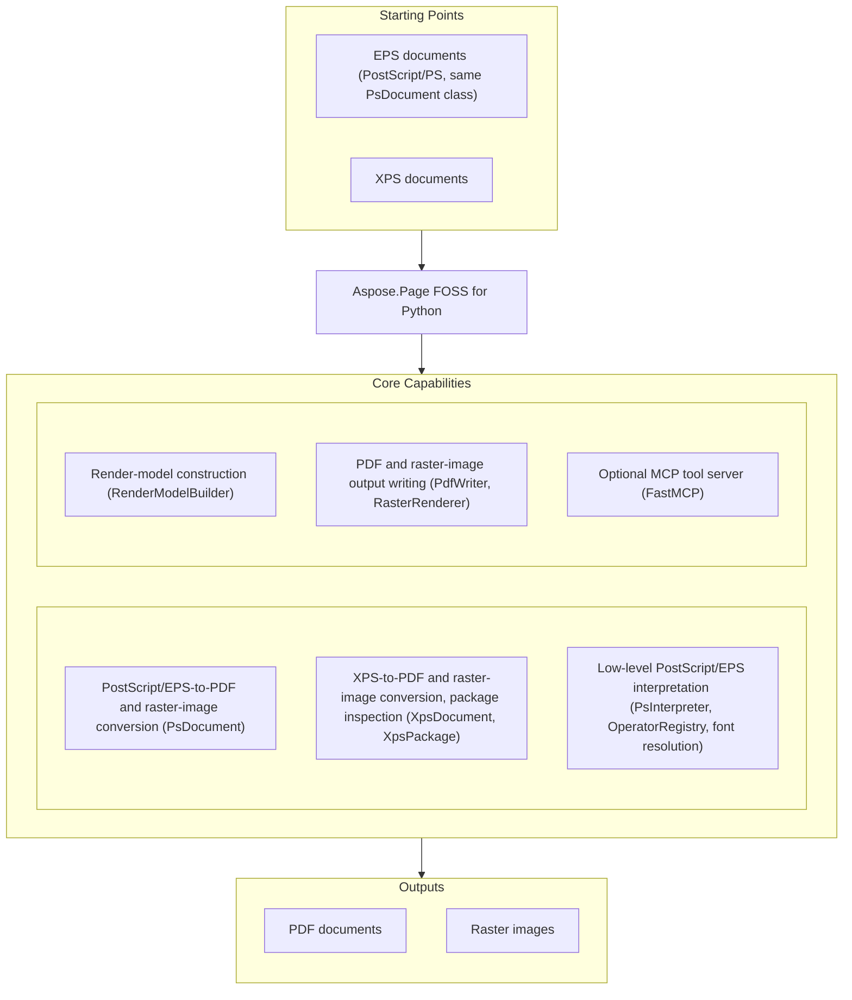

# Aspose.Page FOSS for Python

[](https://www.python.org/downloads/) [](LICENSE.txt) [](https://github.com/aspose-page-foss/Aspose.Page-FOSS-for-Python/graphs/contributors)

[](https://products.aspose.org/page/python/)

Aspose.Page FOSS for Python is a free, open-source Python library for converting PostScript
(PS), Encapsulated PostScript (EPS), and XPS documents to PDF and raster images. It has no
dependency on Ghostscript, Adobe Reader, or any native runtime, so it runs identically on
Windows, Linux, and macOS.

## Navigation

- [At a glance](#at-a-glance)
- [Key capabilities](#key-capabilities)
- [Installation](#installation)
- [Quick start](#quick-start)
- [Additional examples](#additional-examples)
- [API reference](#api-reference)
- [Documentation & resources](#documentation--resources)
- [Scope and limitations](#scope-and-limitations)
- [Development and testing](#development-and-testing)
- [License](#license)

## At a Glance



## Key Capabilities

- Convert PostScript (`.ps`) and Encapsulated PostScript (`.eps`) files to PDF and raster
  images with `PsDocument`.
- Convert XPS packages to PDF and raster images with `XpsDocument`; inspect raw XPS package
  parts with `XpsPackage`.
- Build render output directly from a low-level model with `RenderModelBuilder`, then
  serialize it with `PdfWriter` or rasterize it with `RasterRenderer`.
- Interpret PostScript/EPS content with `PsInterpreter` and a PostScript operator registry
  (`OperatorRegistry`), including embedded TrueType/Type 1 font resolution via
  `FontResolver` and `FontCache`.
- Optional MCP server (`aspose.page.mcp.create_server`) exposes `ps_to_pdf`, `ps_to_image`,
  `xps_to_pdf`, `xps_to_image`, and `eps_metadata` as remote tools through FastMCP, for use
  in agent and automation pipelines.
- Pure Python — no Ghostscript, Adobe Reader, or other native runtime dependency.

## Installation

A PyPI package has not been published yet. Install from source:

```bash
git clone https://github.com/aspose-page-foss/Aspose.Page-FOSS-for-Python.git
cd Aspose.Page-FOSS-for-Python
pip install -e .
```

Install optional dependencies for specific scenarios:

```bash
# PS/EPS-to-image and XPS-to-image conversion
pip install skia-python

# MCP server hosting
pip install fastmcp

# Running the test suite
pip install pypdf pypdfium2 Pillow
```

The package requires Python 3.10 or later.

## Quick Start

Convert a PostScript file to PDF:

```python
from aspose.page.ps.document import PsDocument

ps = PsDocument.from_file("input.ps")
output_pdf = ps.to_pdf()

with open("output.pdf", "wb") as f:
    f.write(output_pdf)
```

Convert an XPS document to PDF:

```python
import aspose.page.ps  # works around a module import-order issue triggered by xps.to_pdf()
from aspose.page.xps.document import XpsDocument

xps = XpsDocument.from_file("input.xps")
output_pdf = xps.to_pdf()

with open("output.pdf", "wb") as f:
    f.write(output_pdf)
```

## Additional Examples

Runnable tests and functional cases that exercise the same APIs live under `tests/` in the
repository. The most common operations are collected below.

### Example Results

XPS-to-PDF-to-PNG conversion:


PS-to-PDF-to-PNG conversion:


PS/EPS-to-image conversion:


### Convert EPS to PNG

```python
from aspose.page.ps.document import PsDocument
from aspose.page.ps.output import ImageSaveOptions

eps = PsDocument.from_file("input.eps")
output_png = eps.to_image(ImageSaveOptions(format="png", dpi=150))

with open("output.png", "wb") as f:
    f.write(output_png)
```

<details>
<summary>View Additional Examples</summary>

### Convert XPS to JPEG

```python
from aspose.page.ps.output import ImageSaveOptions
from aspose.page.xps.document import XpsDocument

xps = XpsDocument.from_file("input.xps")
output_jpeg = xps.to_image(ImageSaveOptions(format="jpeg", dpi=150))

with open("output.jpg", "wb") as f:
    f.write(output_jpeg)
```

### Rasterize XPS to BMP

```python
from aspose.page.ps.output import ImageSaveOptions
from aspose.page.xps.document import XpsDocument

doc = XpsDocument.from_file("testdata/xps/integration/Simple.xps")
data = doc.to_image(ImageSaveOptions(format="bmp", dpi=72))
assert data.startswith(b"BM")
```

### Build a PDF Directly From the Render Model

```python
import aspose.page.ps  # works around a module import-order issue in aspose.page.pdf.writer
from aspose.page.common.render_model import Matrix, RenderModelBuilder
from aspose.page.pdf.writer import PdfMetadata, PdfWriter

builder = RenderModelBuilder()
builder.begin_page(100, 100)
builder.add_text("Hello, world", "Helvetica", 12, Matrix.identity(), None)
builder.end_page()
doc = builder.document()

metadata = PdfMetadata(
    title="",
    creator="",
    producer="Aspose.Page FOSS for Python",
    creation_date="D:20240101000000",
    mod_date="D:20240101000000",
    trapped=False,
)
writer = PdfWriter(metadata)
pdf_bytes = writer.write(doc)
assert pdf_bytes.startswith(b"%PDF-1.4")
```

### Convert PostScript From an In-Memory MCP Request

```python
import base64
from aspose.page.mcp.handlers import ps_to_pdf
from aspose.page.mcp.types import McpInput, McpOutput

ps_bytes = b"%!PS-Adobe-3.0\n0 0 moveto 10 0 lineto stroke\n"
input_payload = McpInput(input_path=None, input_bytes_b64=base64.b64encode(ps_bytes).decode("ascii"))
output = McpOutput(output_path=None, return_bytes=True)

result = ps_to_pdf(input_payload, output)
pdf_bytes = base64.b64decode(result.output_bytes_b64)
assert pdf_bytes.startswith(b"%PDF")
```

### Run the MCP Server

```python
from aspose.page.mcp import create_server

server = create_server()
server.run(transport="http", host="127.0.0.1", port=8000)
```

`FastMCP` is required to start the MCP server; `skia-python` is required for the
`ps_to_image` and `xps_to_image` tools.

</details>

## API Reference

The library exposes conversion entry points (`PsDocument`, `XpsDocument`), package-level
access (`XpsPackage`), and a low-level render pipeline (`RenderModelBuilder`, `PdfWriter`,
`RasterRenderer`) that the high-level document classes are built on.

<details>
<summary>View the Supported Public API Surface</summary>

### Common

| Class | Description |
|---|---|
| `AxialShading` | Axial (linear) gradient shading in the render model: color space, endpoint coordinates, domain, backing `Function`, and per-end extend flags. |
| `CieBasedColorSpace` | CIE-based color space backed by an embedded ICC profile, its component count, and optional value ranges. |
| `ClipCommand` | Set the current clipping path. |
| `ColorSpacePaint` | A solid-color paint referencing a color space by id plus its component values. |
| `DeviceColorSpace` | A device color space (e.g. DeviceGray/DeviceRGB/DeviceCMYK) identified by name. |
| `DeviceNColorSpace` | A DeviceN color space: named colorants, an alternate color space, and a tint transform `Function`. |
| `ExponentialFunction` | ExponentialFunction.evaluate() computes function values for given inputs based on the defined domain, range, and coefficients. |
| `ImageCommand` | Render an image resource with a transform. |
| `IndexedColorSpace` | An indexed color space: a base color space, the highest valid index (`hival`), and the raw color lookup table bytes. |
| `Matrix` | Affine transform matrix (a, b, c, d, e, f). |
| `Paint` | Fill/stroke paint descriptor. |
| `Path` | A sequence of path segments. |
| `PathCommand` | Render a path with optional stroke/fill. |
| `PathSegment` | A path segment with a kind and control points. |
| `PatternColorSpace` | A pattern color space, optionally wrapping an underlying base `ColorSpace` for colored patterns. |
| `PatternPaint` | A pattern-based paint referencing a pattern by id, with optional base color space and component values for uncolored patterns. |
| `Point` | 2D point in the render model. |
| `RadialShading` | Radial gradient shading in the render model: color space, two-circle coordinates, domain, backing `Function`, and per-end extend flags. |
| `Rect` | Axis-aligned rectangle with min/max coordinates. |
| `RenderDocument` | A collection of render pages. |
| `RenderImageResource` | Image payload used by raster backends. |
| `RenderModelBuilder` | Build render documents incrementally. |
| `RenderPage` | A single renderable page with commands. |
| `RenderResources` | Shared render resources for a document. |
| `SampledFunction` | A sampled (Type 0) PDF/PostScript function: domain/range, sample grid size, bit depth, and encode/decode maps; `evaluate()` performs the table lookup. |
| `SeparationColorSpace` | A Separation color space: a single colorant name, its alternate color space, and a tint transform `Function`. |
| `ShadingPattern` | A shading pattern: a `Shading` (axial or radial) plus the pattern matrix. |
| `StateRestoreCommand` | Restore the previous graphics state. |
| `StateSaveCommand` | Save the current graphics state. |
| `StitchingFunction` | A stitching (Type 3) PDF/PostScript function that dispatches to one of several sub-`Function`s by input sub-domain, joined at `bounds`. |
| `StrokeStyle` | Stroke style settings for path rendering. |
| `TextCommand` | Render text using a font reference and transform. |
| `TilingPattern` | A tiling pattern: paint/tiling type, bounding box, step size, matrix, and the render commands to repeat across the tile. |

### Image

| Class | Description |
|---|---|
| `DefaultRasterWriter` | The DefaultRasterWriter.write(document, options) method returns the rendered document as a byte array. |
| `RasterRenderer` | Render a RenderDocument to a raster surface. |
| `RasterSurface` | In-memory RGBA pixel surface. |
| `RasterWriter` | Protocol for a raster writer's `write(document, options)` method, implemented by `RenderModelRasterWriter` and `SkiaRasterWriter`. |
| `RenderModelRasterWriter` | The default `RasterWriter` implementation: renders a `RenderDocument` directly to raster bytes using the render model (no Skia dependency). |
| `SkiaRasterWriter` | Rasterize a RenderDocument using Skia (requires skia-python). |

### Mcp

| Class | Description |
|---|---|
| `McpConversionOptions` | Conversion options for MCP operations. |
| `McpInput` | MCP input payload. |
| `McpOutput` | MCP output configuration. |
| `McpResult` | MCP output payload. |

### PDF

| Class | Description |
|---|---|
| `ImageResource` | Image resource payload for PDF XObject embedding. |
| `PdfEmbeddedFont` | Everything the PDF writer needs to embed a font as a `/Type0`/CID font: subset name, encoding, glyph widths and code map, font-program bytes, and font-descriptor metrics (ascent, descent, bbox, italic angle, stem width). |
| `PdfMetadata` | PDF metadata fields for the document info dictionary. |
| `PdfWriter` | Serialize a render document into PDF 1.4 bytes. |
| `RectWrapper` | Minimal width/height rectangle wrapper exposing `x_min`/`y_min`/`x_max`/`y_max` properties for PDF page-geometry code that expects a rect-like object. |

### PS

| Class | Description |
|---|---|
| `ClipType` | Boolean clipping-operation constants for `Clipper` (`ctIntersection`, `ctUnion`, `ctDifference`, `ctXor`). |
| `Clipper` | The Clipper class offers methods such as execute() and add_edge_to_sel() to perform polygon clipping and edge management. |
| `ClipperBase` | Base class implementing the Vatti polygon-clipping algorithm's shared edge-management and local-minima bookkeeping for `Clipper`. |
| `ClipperException` | Class extending Exception. |
| `Direction` | Internal edge-traversal direction constants (right-to-left / left-to-right) used by the `Clipper` polygon-clipping algorithm. |
| `DoublePoint` | Floating-point 2D point used internally by `PolyOffsetBuilder`'s polygon-offsetting geometry. |
| `DscMetadata` | Container for DSC metadata extracted from PS/EPS comments. |
| `EdgeSide` | Internal left/right edge-side constants used by the `Clipper` polygon-clipping algorithm. |
| `EmbeddedType42` | A parsed Type 42 (TrueType-in-PostScript) embedded font: raw sfnt bytes, units-per-em, and a code-to-width map. |
| `EndType` | Line-end style constants for `PolyOffsetBuilder` (closed, butt, square, round). |
| `ExecutionContext` | Holds interpreter stacks, dictionaries, and metadata for execution. |
| `FilterResult` | Result of decoding a filter chain. |
| `FontCache` | Loads and caches OS font-directory listings (`FontRecord`) and parsed font metrics (`FontMetrics`), backing `FontResolver`'s name-to-file lookups. |
| `FontMetrics` | Cached TrueType font metrics: units-per-em and a code-to-glyph-width map, keyed by font file path in `FontCache`. |
| `FontRecord` | One discovered OS font file: name, style, path, and whether it's monospace. |
| `FontResolver` | Resolve fonts from names or PostScript dictionaries. |
| `FontResource` | Represents a resolved font resource. |
| `GlyphPoint` | A single TrueType glyph outline point (x, y, and whether it's on-curve) used by `TrueTypeFont` outline extraction. |
| `GraphicsState` | Tracks current graphics state parameters. |
| `ImageInfo` | Decoded raster image data. |
| `ImageSaveOptions` | Options for `PsDocument.to_image()`/`XpsDocument.to_image()`: output raster format, DPI, raster writer override, and an additional font-search folder. |
| `IntPoint` | Integer-coordinate 2D point used internally by the `Clipper` polygon-clipping algorithm. |
| `IntRect` | Integer bounding rectangle (left/top/right/bottom) used internally by the `Clipper` polygon-clipping algorithm. |
| `IntersectNode` | An edge-pair intersection record (`edge1`, `edge2`, intersection point) used internally during `Clipper`'s sweep-line processing. |
| `Join` | A record of two output-polygon points to be joined into one path during `Clipper`'s final polygon assembly. |
| `JoinType` | Line-join style constants for `PolyOffsetBuilder` (square, round, miter). |
| `LocalMinima` | A local-minimum sweep event (starting y and left/right bounding edges) used internally by `Clipper`'s sweep-line algorithm. |
| `OperatorEntry` | Descriptor for a registered PostScript operator. |
| `OperatorRegistry` | Register and resolve PostScript operator implementations. |
| `OutPt` | A single point in an output polygon's doubly-linked point list, produced internally by `Clipper`. |
| `OutRec` | An output polygon record (its point list, hole/open flags, and enclosing polygon) produced internally by `Clipper`. |
| `PdfSaveOptions` | Options for `PsDocument.to_pdf()`: PDF stream compression and an additional font-search folder. |
| `PolyFillType` | Polygon fill-rule constants for `Clipper` (even-odd, non-zero, positive, negative). |
| `PolyNode` | A node in the `PolyTree` polygon hierarchy: a polygon's points, its parent/children, and its open/closed state. |
| `PolyOffsetBuilder` | PolyOffsetBuilder.add_point(pt) adds a vertex to the polygon before computing offset geometry, and build() finalizes the construction. |
| `PolyTree` | Root container for `Clipper`'s output polygon hierarchy — a `PolyNode` that also tracks every polygon produced. |
| `PolyType` | Polygon-role constants for `Clipper` inputs: subject (`ptSubject`) vs. clip (`ptClip`) polygon. |
| `PsArray` | A PostScript array object — an ordered list of `PsObject` items. |
| `PsCanvas` | Canvas that appends PostScript operators to a page. |
| `PsConversionPipeline` | Convert PS/EPS byte streams into render model documents. |
| `PsDict` | A PostScript dictionary object — a mapping of keys to `PsObject` values. |
| `PsDocument` | Represents a loaded or editable PS/EPS document. |
| `PsError` | Base PostScript error. |
| `PsFile` | A PostScript file object: its name, open mode, and in-memory data. |
| `PsFontId` | A PostScript font identifier — either a numeric font ID or a font name string. |
| `PsGState` | A PostScript graphics-state object returned by `gsave`, wrapping a saved `GraphicsState`. |
| `PsIOError` | PostScript `ioerror` — raised for input/output failures during interpretation. |
| `PsImage` | Raster image container for embedding in PS/EPS. |
| `PsImageResource` | Represents a decoded image resource. |
| `PsImageStore` | Store image resources by id. |
| `PsInterpreter` | Execute PostScript/EPS objects using a registry of operators. |
| `PsInvalidAccess` | PostScript `invalidaccess` — raised when an operation violates an object's access attribute. |
| `PsLimitCheck` | PostScript `limitcheck` — raised when an implementation limit (e.g. array/string size) is exceeded. |
| `PsMark` | A PostScript mark object, pushed by `mark`/`[` and used to delimit array/procedure construction on the operand stack. |
| `PsName` | A PostScript name object (`/name` literal or executable), the language's primary identifier type. |
| `PsOperator` | A resolved reference to a named PostScript operator, as distinct from a literal name. |
| `PsPage` | Editable PS/EPS page. |
| `PsParser` | Parse PostScript/EPS tokens into language objects. |
| `PsPattern` | A PostScript pattern object: its pattern id and the underlying render-model `Pattern` (tiling or shading). |
| `PsProcedure` | A PostScript procedure object (a `{...}` executable array) — an ordered list of `PsObject` items to execute. |
| `PsQuit` | Internal non-error signal used by PostScript `quit`. |
| `PsRangeError` | PostScript `rangecheck` — raised when a numeric or index argument is out of range. |
| `PsSave` | A PostScript `save` object returned by the `save` operator, wrapping the `PsSaveState` a matching `restore` will apply. |
| `PsSaveState` | The operand/execution-stack snapshot associated with a `PsSave` object (kept for backward compatibility; `restore` does not roll these back). |
| `PsStack` | Simple stack implementation for PostScript execution. |
| `PsString` | A PostScript string object; may carry a pending stream filter (`remaining_filter`/`filter_params`) for deferred image/filter decoding. |
| `PsSyntaxError` | PostScript `syntaxerror` — raised when the tokenizer or parser encounters malformed input. |
| `PsToken` | Represents a token from a PostScript/EPS input stream. |
| `PsTokenizer` | Tokenize PostScript/EPS bytes into language tokens. |
| `PsTypeError` | PostScript `typecheck` — raised when an operator receives an argument of the wrong type. |
| `PsUndefinedError` | PostScript `undefined` — raised when an undefined name is executed or looked up. |
| `Scanbeam` | A single sweep-line y-coordinate in `Clipper`'s sweep-line queue. |
| `TEdge` | An active polygon edge (bottom/current/top points, slope, and winding state) tracked internally by `Clipper`'s sweep-line algorithm. |
| `TrueTypeFont` | TrueTypeFont offers low‑level glyph metrics such as advance width, vertical advance, and outline points for precise text layout. |
| `Type1Metrics` | Parsed Type 1 font metrics: name, units-per-em, glyph/code widths, encoding vector, bounding box, and the raw Type 1 font program bytes. |

### XPS

| Class | Description |
|---|---|
| `PrintTicket` | Print ticket payload descriptor. |
| `Relationship` | Represents a package relationship. |
| `XpsCanvas` | XPS canvas element for grouping content. |
| `XpsDocument` | Represents a loaded or editable XPS document. |
| `XpsDocumentBuilder` | Builder for XPS document creation/editing. |
| `XpsFixedPage` | Editable XPS fixed page. |
| `XpsGlyphs` | XPS glyphs element. |
| `XpsImage` | XPS image element. |
| `XpsImageResource` | Decoded image resource. |
| `XpsImageStore` | Registers `XpsImageResource` objects under generated or existing IDs, keeping the id-to-resource map used when serializing an XPS package's image parts. |
| `XpsPackage` | Represents an XPS package. |
| `XpsParser` | Parse XPS package relationships to locate pages. |
| `XpsPath` | XPS path element. |
| `XpsRenderer` | Render XPS XML to the shared render model. |
| `XpsResourceDictionary` | Resource dictionary with parent lookup. |

#### Enumerations

| Enumeration | Description |
|---|---|
| `PrintTicketScope` | Print ticket scopes supported by XPS. |
---

#### Detailed Member Reference

### PostScript / EPS

- `PsDocument`
  - `create(is_eps, page_size) -> PsDocument`
  - `from_bytes(data) -> PsDocument`
  - `from_file(path) -> PsDocument`
  - `add_page(size) -> PsPage`, `insert_page(index, size) -> PsPage`, `remove_page(index)`,
    `get_page(index) -> PsPage`
  - `save(path) -> bytes`, `as_bytes() -> bytes`
  - `get_xmp() -> str | None`, `set_xmp(xmp_xml)`, `remove_xmp()`
  - `to_pdf(options) -> bytes`, `to_image(options) -> bytes`
  - Properties: `data`, `is_eps`, `dsc: DscMetadata | None`, `source_path`, `pages`,
    `prolog`, `trailer`, `header`, `dirty`
- `PsInterpreter` — `execute(data, ctx)`, `execute_objects(...)`, `execute_object(...)`,
  `execute_procedure(...)`
- `PsParser` — `parse_object() -> PsObject | None`, `parse_all() -> list[PsObject]`
- `PsTokenizer` — `next_token()`, ASCII-Hex/ASCII-85 decoding helpers
- `PsCanvas` — path construction (`move_to`, `line_to`, `curve_to`, `rect`, `ellipse`),
  paint state (`set_stroke_color`, `set_fill_color`, `clip`), and text/image drawing
- `OperatorRegistry` — `register(name, fn, min_operands, max_operands)`, `get(name)`
- `DscMetadata` — bounding box, orientation, title, creator, and extension fields parsed
  from PS/EPS DSC comments

### XPS

- `XpsDocument`
  - `create(title) -> XpsDocument`, `from_bytes(data)`, `from_file(path)`
  - `add_page(width, height) -> XpsFixedPage`, `insert_page(index, page)`,
    `remove_page(index)`, `save(path) -> bytes`
  - `get_print_tickets() -> list[PrintTicket]`, `set_print_ticket(...)`,
    `remove_print_ticket(...)`
  - `to_pdf(options) -> bytes`, `to_image(options) -> bytes`
- `XpsPackage` — `from_bytes(data)`, `from_file(path)`, `read(part_name) -> bytes`,
  `has_part(part_name) -> bool`
- `XpsParser` — `fixed_page_parts() -> list[str]`
- `XpsRenderer` — `set_package(...)`, `set_current_part(...)`, `render_fixed_page(...)`
- `XpsFixedPage`, `XpsCanvas`, `XpsGlyphs`, `XpsImage`, `XpsPath` — editable XPS content
  model

### Render Pipeline and Output

- `RenderModelBuilder` — `begin_page`/`end_page`, `add_path`, `add_text`, `add_image`,
  `clip`, `save_state`/`restore_state`, `document() -> RenderDocument`
- `PdfWriter` — `write(document) -> bytes`; `PdfMetadata` (title, creator, producer,
  creation/mod dates, trapped)
- `RasterRenderer` — `render(document, page_index) -> RasterSurface`
- `RasterSurface` — `create(width, height, background)`, `set_pixel`, `get_pixel`
- `ImageSaveOptions` — `format`, `dpi`, `raster_writer`, `additional_fonts_folder`,
  `font_resolver`
- `FontResolver` / `FontCache` — font lookup, embedded Type 42 font registration, glyph
  width resolution

### MCP Server

- `create_server()` (in `aspose.page.mcp`) registers `ps_to_pdf`, `ps_to_image`,
  `xps_to_pdf`, `xps_to_image`, and `eps_metadata` as FastMCP tools
- `McpInput` (`input_path` or `input_bytes_b64`), `McpOutput` (`output_path` or
  `return_bytes`), `McpConversionOptions` (`format`, `dpi`, `no_compress`)

</details>

## Documentation & Resources

- **[Getting started guide](https://docs.aspose.org/page/python/)** — installation, walkthroughs, and feature guides for this library.
- **[How-to guides & FAQ](https://kb.aspose.org/page/python/)** — task-focused answers for common PS/EPS/XPS conversion questions.
- **[Full API reference](https://reference.aspose.org/page/python/)** — the complete, browsable reference for all 139 public types (the [API reference](#api-reference) section above covers the essentials).
- Found a bug or have a feature request? [Open an issue](https://github.com/aspose-page-foss/Aspose.Page-FOSS-for-Python/issues) on GitHub.

## Scope and Limitations

- This project focuses on reading and converting PS, EPS, and XPS input — it does not author
  new PostScript or XPS documents from scratch beyond the low-level render-model builder.
- Image conversion (`to_image()` / `ps_to_image` / `xps_to_image`) requires the optional
  `skia-python` dependency, and the MCP server requires the optional `FastMCP` dependency;
  neither is installed by default.
- A module-import-order issue can raise an import error in a fresh Python interpreter
  depending on which submodule is imported first; the Quick Start and Additional Examples
  above show the current workaround — see [upstream-issues.md](upstream-issues.md) for the
  affected imports and full detail.

These limitations don't apply to the commercial
[Aspose.Page — Enterprise Edition](https://products.aspose.com/page/) product family, which adds
a broader commercial feature set, including native PostScript/XPS document generation and
dedicated support, beyond this FOSS edition's conversion-focused, render-model-builder scope.

## Development and Testing

Sync dependencies and run the test suite:

```bash
make sync
make test
```

<details>
<summary>View Additional Development Commands</summary>

Run only the MCP-focused checks:

```bash
python3 -m unittest tests.mcp.test_handlers
```

Build distribution artifacts:

```bash
make build
```

</details>

## License

This project is licensed under the [MIT License](LICENSE.txt). The MIT License permits use, copying,
modification, distribution, sublicensing, and commercial use, provided its copyright and
permission notice are retained. The software is provided without warranty.
