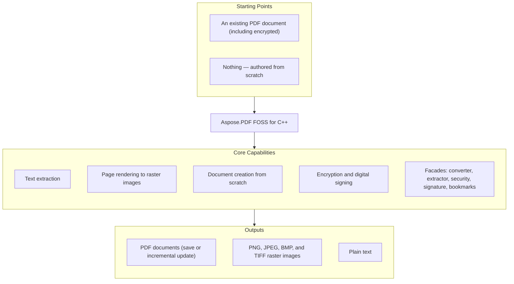

# Aspose.PDF FOSS for C++

[](https://github.com/aspose-pdf-foss/Aspose.PDF-FOSS-for-Cpp/actions/workflows/ci.yml) [](https://opensource.org/licenses/MIT) [](https://en.cppreference.com/w/cpp/20) [](https://cmake.org/)

[](https://products.aspose.org/pdf/cpp/)

A free, open-source PDF library for modern C++ — open and save PDFs, extract text, render pages
to raster images, build documents from scratch (text, images, tables, vector graphics,
annotations, AcroForm fields, bookmarks), encrypt with RC4-40 / RC4-128 / AES-128 / AES-256, and
digitally sign with a detached PKCS#7 signature. No runtime dependency on any commercial PDF
stack — the library links against nothing but the C++ standard library; every primitive,
including the TIFF/JPEG/PNG codecs and the rasteriser, is implemented from scratch. The public
API is a strict subset of the public API of the commercial Aspose.PDF for .NET library, mirroring
class and method names where natural for migrants. Spec references throughout
follow ISO 32000-1 (PDF 1.7) and ISO 32000-2 (PDF 2.0).

## Navigation

- [At a Glance](#at-a-glance)
- [Key Capabilities](#key-capabilities)
- [Installation](#installation)
- [Quick Start](#quick-start)
- [Additional Examples](#additional-examples)
- [API Reference](#api-reference)
- [Documentation & Resources](#documentation--resources)
- [Scope and Limitations](#scope-and-limitations)
- [Development and Testing](#development-and-testing)
- [Third-Party Notices](#third-party-notices)
- [License](#license)

## At a Glance



## Key Capabilities

Features spanning the whole document lifecycle — opening, editing, rendering, and creating PDFs
from scratch:

- **Open & save** — open existing PDFs; save with byte-verbatim round-trip, or edit `/Info`
  metadata via an incremental update that preserves the original bytes.
- **Open encrypted PDFs** — supply the user or owner password to `Document(path, password)`;
  `IsEncrypted()` reports the state.
- **Text extraction** — `Text::TextAbsorber` walks a whole `Document` or a single `Page`;
  `Text::TextFragmentAbsorber` returns positioned fragments with font, size, and colour.
- **Render to image** — rasterise pages through `PngDevice`, `JpegDevice`, and `BmpDevice`
  (single page per call), or `TiffDevice` (single page, or a full multi-page document range in
  one call), driven by a dependency-free, anti-aliased rasteriser built entirely on the C++
  standard library. TIFF supports 1/4/8/24-bpp output with median-cut palette quantisation; a
  custom `IIndexBitmapConverter` can be supplied for caller-controlled palettes.
- **Encryption** — `Document::Encrypt(user, owner, permissions, algorithm)` with RC4-40,
  RC4-128, AES-128, or AES-256 (PDF 2.0, R=6); granular viewer permissions via `Permissions`.
- **Digital signatures** — `Facades::PdfFileSignature` adds a detached PKCS#7
  (`adbe.pkcs7.detached`) signature with a byte-exact `/ByteRange`.
- **Create from scratch** — positioned/word-wrapped text (`Text::TextBuilder`/`TextFragment`),
  images (`Page::AddImage`), `Table`/`Row`/`Cell`, vector graphics (`Drawing::Graph`),
  watermarks (`WatermarkArtifact`), annotations, AcroForm fields, and outline (bookmark) trees.
- **Extract text via a device** — `Devices::TextDevice` writes a page's text to a stream with a
  selectable output charset (`Encoding`: utf-8, utf-16-le, utf-16-be, latin-1, windows-1252).
- **Named destinations** — define reusable navigation targets via
  `Annotations::NamedDestination`/`NamedDestinationCollection`.
- **Facades (Aspose.Pdf.Facades)** — the classic facade surface, with `PdfConverter`,
  `PdfExtractor`, `PdfFileSecurity`, `PdfFileSignature`, and `PdfBookmarkEditor` wired to the
  real engine.

## Installation

No NuGet package has been published for this library yet — it builds as a static library you link
into your project. Add it as a subdirectory of your CMake build, or build and install it
standalone (see [Build](#build)).

```cmake
add_subdirectory(aspose.pdf-foss-for-cpp)
target_link_libraries(your_app PRIVATE aspose_pdf_foss)
```

### Build

```bash
cmake -S . -B build
cmake --build build
```

This is an out-of-source build under `build/`; the static library lands at
`build/libaspose_pdf_foss.a` (or `aspose_pdf_foss.lib` on MSVC). For a release build:

```bash
cmake -S . -B build -DCMAKE_BUILD_TYPE=Release
cmake --build build
```

`CMakePresets.json` carries host-conditional Windows-MSVC presets, e.g.
`cmake --preset windows-msvc-debug`. Sources with non-ASCII bytes need `/utf-8` under MSVC.

**Requirements**: a C++20 compiler (clang ≥ 16, gcc ≥ 13, MSVC 2022 ≥ 17.5), CMake ≥ 3.22, and
Python 3 at build time only (a generator step embeds the bundled font outlines into a generated
source file). Runtime dependencies: none — the test suite alone fetches GoogleTest v1.14.0 via
CMake `FetchContent` at configure time; it is not needed to build or consume the library itself.

## Quick Start

```cpp
#include <aspose/pdf/document.hpp>
#include <aspose/pdf/page_collection.hpp>
#include <aspose/pdf/text_absorber.hpp>
#include <aspose/pdf/png_device.hpp>
#include <aspose/pdf/resolution.hpp>
#include <fstream>
#include <iostream>

int main() {
    // Open a PDF and count its pages
    Aspose::Pdf::Document doc("input.pdf");
    std::cout << "Pages: " << doc.Pages().Count() << "\n";

    // Extract text
    Aspose::Pdf::Text::TextAbsorber absorber;
    absorber.Visit(doc);
    std::cout << absorber.Text() << "\n";

    // Render page 1 to PNG at 150 DPI
    Aspose::Pdf::Devices::PngDevice png(Aspose::Pdf::Devices::Resolution(150));
    std::ofstream out("page1.png", std::ios::binary);
    png.Process(doc.Pages()[1], out);
}
```

See [`examples/`](examples/) for 12 runnable programs covering the whole surface, including a
from-scratch [feature showcase](examples/12_create_features.cpp).

## Additional Examples

12 runnable examples live in the [`examples/`](examples/) directory, covering page inspection,
rendering, encryption, digital signing, and from-scratch document creation with text, tables, and
vector graphics. They are numbered to build on one another — after `cmake --build build`, run
them in order from `build/examples/<name>`.

### Encrypt a Document With AES-256

```cpp
#include <aspose/pdf/document.hpp>
#include <aspose/pdf/crypto_algorithm.hpp>
#include <aspose/pdf/permissions.hpp>

using Aspose::Pdf::CryptoAlgorithm;
using Aspose::Pdf::Permissions;

Aspose::Pdf::Document doc("input.pdf");
doc.Encrypt("userpass", "ownerpass",
            Permissions::PrintDocument | Permissions::FillForm,
            CryptoAlgorithm::AESx128);
doc.Save("encrypted.pdf");                   // encryption applied on Save

// AES-256, PDF 2.0 (R=6): pass usePdf20 = true
doc.Encrypt("userpass", "ownerpass",
            Permissions::PrintDocument,
            CryptoAlgorithm::AESx256, /*usePdf20=*/true);

// Re-open with the password
Aspose::Pdf::Document reopened("encrypted.pdf", "userpass");
```

`CryptoAlgorithm` covers `RC4x40`, `RC4x128`, `AESx128`, and `AESx256`. `Permissions` is a
`[Flags]` enum (ISO 32000-1 §7.6.3.2 Table 22).

<details>
<summary>View Additional Code Examples</summary>

| Example | Shows |
|---|---|
| `01_pages` | open a PDF, count pages, iterate the 1-based indexer |
| `02_read_metadata` / `03_write_metadata` | read `DocumentInfo`; edit + incremental-update save |
| `04_text_extraction` | `TextAbsorber::Visit(Document)` |
| `05_save_roundtrip` | byte-verbatim save |
| `06_devices_surface` | construct + round-trip device properties |
| `07_render_png` | end-to-end `PngDevice::Process(Page, ostream)` |
| `08_render_tiff` | multi-page TIFF via `TiffDevice::Process(Document, …)` |
| `09_indexed_tiff` | 8-bpp palettised TIFF (median-cut) |
| `10_render_text_pdf` | render a page with an embedded TrueType font |
| `11_render_standard14` | render `/Helvetica` with no embedded font (fallback path) |
| `12_create_features` | from-scratch 10-page showcase: text, image, tables, graphics, annotations, AcroForm fields, bookmarks |

See [`examples/README.md`](examples/README.md) for the full tour.

### Read and Update Document Metadata

```cpp
#include <aspose/pdf/document_info.hpp>

Aspose::Pdf::Document doc("input.pdf");
std::cout << doc.Info().Title() << " / " << doc.Info().Author() << "\n";

doc.SetTitle("My Title");
doc.Info().Author("Demo author");
doc.Info().Add("Custom-Key", "Custom value");
doc.Save("output.pdf");
```

> The incremental-update writer patches an existing `/Info` object; a from-scratch document has
> no `/Info` to patch, so setting metadata on one and saving throws.

### Build a Page From Scratch (Text, Table, Vector Graphics)

```cpp
#include <aspose/pdf/document.hpp>
#include <aspose/pdf/page_collection.hpp>
#include <aspose/pdf/text_builder.hpp>
#include <aspose/pdf/text_fragment.hpp>
#include <aspose/pdf/font_repository.hpp>
#include <aspose/pdf/position.hpp>
#include <aspose/pdf/table.hpp>
#include <aspose/pdf/border_info.hpp>
#include <aspose/pdf/paragraphs.hpp>

namespace pdf = Aspose::Pdf;
namespace txt = Aspose::Pdf::Text;

pdf::Document doc;
pdf::Page page = doc.Pages().Add();
page.SetPageSize(595.0, 842.0);

txt::TextFragment frag("Hello from Aspose.PDF FOSS for C++");
frag.TextState().Font(txt::FontRepository::FindFont("Helvetica"));
frag.TextState().FontSize(18.0f);
frag.Position(txt::Position(60.0, 760.0));
txt::TextBuilder{page}.AppendText(frag);

pdf::Table table;                                    // keep alive until doc.Save()
table.ColumnWidths("250 120 120");
table.Border(pdf::BorderInfo(pdf::BorderSide::All, 0.5f));
pdf::Row& header = table.Rows().Add();
header.Cells().Add("Item"); header.Cells().Add("Qty"); header.Cells().Add("Price");
page.Paragraphs().Add(table);                        // stored by reference

doc.Save("scratch.pdf");
```

> **Lifetime rule for creation.** `Paragraphs`, `Annotations`, `Form`, `Artifacts`, and
> `Outlines` store the object **by reference**, so every table, graph, annotation, field,
> watermark, and outline item must outlive `Save()`. The full 10-page showcase in
> [`12_create_features.cpp`](examples/12_create_features.cpp) parks every such object in a
> keep-alive arena of `shared_ptr`s for exactly this reason.

### Digital Signatures

```cpp
#include <aspose/pdf/document.hpp>
#include <aspose/pdf/facades/pdf_file_signature.hpp>

Aspose::Pdf::Facades::PdfFileSignature sig{"input.pdf", "signed.pdf"};
// configure the signature (certificate + key), then sign and save —
// a detached PKCS#7 (adbe.pkcs7.detached) signature with a byte-exact
// /ByteRange, verifiable with the OpenSSL CLI.
```

See `tests/facades_pdf_file_signature_smoke_test.cpp` for the full signing flow.

</details>

## API Reference

The core API is built around the `Document` class and its `Pages()` collection
(`PageCollection`).

<details>
<summary>View the Core API Surface</summary>

### Core API

| Class | Description |
|---|---|
| `Artifact` | Class with 14 methods. |
| `ArtifactCollection` | Class with 7 methods and 1 property. |
| `BaseParagraph` | Class with 23 methods and 1 property. |
| `BitmapInfo` | BitmapInfo enables creation of raw bitmap images with specified pixel format, width, height, and pixel data, supporting image handling without external dependencies. |
| `BmpDevice` | Class with 1 method. |
| `BorderInfo` | Class with 10 methods. |
| `Cell` | Class with 27 methods. |
| `Cells` | Class with 9 methods. |
| `Color` | Class with 147 methods. |
| `Device` | The Device base class provides a virtual destructor, ensuring proper cleanup of derived raster‑device objects such as PngDevice or JpegDevice. |
| `Document` | Document metadata can be read via `Document.Info()` and the accessor methods `Title()`, `Author()`, `Creator()`, `Producer()`, `Subject()`, and `Keywords()`. |
| `DocumentDevice` | Class with 4 methods. |
| `DocumentInfo` | Class with 24 methods and 1 property. |
| `DocumentPrivilege` | Class with 34 methods. |
| `EmbeddedFileCollection` | Class with 9 methods. |
| `FileSpecification` | FileSpecification objects allow setting metadata for embedded files, including MIME type, description, Unicode name, and compression via the Encoding property. |
| `FloatingBox` | Class with 12 methods. |
| `Font` | The Font class lets developers query whether a font is embedded in the PDF and whether it is subsetted, enabling compliance checks for PDF/A. |
| `FontRepository` | Class with 2 methods. |
| `GraphInfo` | Class with 25 methods. |
| `Hyperlink` | Class with 6 methods and 1 property. |
| `ImageDevice` | Class with 10 methods. |
| `JpegDevice` | Class with 1 method. |
| `LoadOptions` | Class with 3 methods. |
| `MarginInfo` | MarginInfo allows precise control of page margins with double-precision getters and setters for left, right, top, and bottom values. |
| `Margins` | Class with 8 methods. |
| `Metadata` | Metadata class implements a dictionary-like interface with Add(key, value), Remove(key), and TryGetValue(key, value) for managing XMP metadata entries. |
| `NamedDestinationCollection` | Class with 6 methods and 1 property. |
| `OutlineCollection` | Class in the PDF CPP API. |
| `OutlineItemCollection` | Class with 18 methods. |
| `Outlines` | Class with 12 methods. |
| `Page` | Page labels (e.g., Roman numerals, custom prefixes) are managed through PageLabel and PageLabelCollection classes. |
| `PageCollection` | The PageCollection class provides methods to add a new blank page, insert a page at a specific position, and delete pages by number or range. |
| `PageDevice` | PageDevice.Process(page, outputFileName) can render a page directly to a file path. |
| `PageLabel` | PageLabel.StartingValue() gets or sets the numeric start for a page label sequence. |
| `PageLabelCollection` | PageLabelCollection.GetLabel(pageIndex) retrieves the PageLabel assigned to a specific page. |
| `PageSize` | PageSize.Width() and Height() get or set the page dimensions, while IsLandscape() indicates orientation. |
| `Paragraphs` | Class with 6 methods. |
| `PngDevice` | Class with 3 methods. |
| `Point` | Class with 6 methods. |
| `Position` | The Position class provides XIndent and YIndent getters and setters to fine‑tune the horizontal and vertical offset of annotations. |
| `Rectangle-Aspose_Pdf` | Class with 28 methods. |
| `RenderingOptions` | Class with 26 methods. |
| `Resolution` | Resolution stores horizontal and vertical DPI via X() and Y() getters and setters. |
| `Resources` | Class with 3 methods and 1 property. |
| `Row` | Class with 23 methods. |
| `Rows` | Rows and Row classes provide a table model for building PDF tables with per‑cell styling, borders, and padding. |
| `SvgLoadOptions` | SvgLoadOptions allows SVG files to be imported with optional page‑size adjustment via the AdjustPageSize property. |
| `Table` | The Table class lets developers construct PDF tables with full control over rows, column widths, borders, cell padding, and default text state. |
| `TextAbsorber` | Class with 6 methods and 1 property. |
| `TextBuilder` | Class with 2 methods. |
| `TextDevice` | Class with 3 methods. |
| `TextFragment` | Class with 7 methods. |
| `TextFragmentAbsorber` | Class with 4 methods. |
| `TextFragmentCollection` | Class with 2 methods. |
| `TextFragmentState` | Class with 1 method. |
| `TextParagraph` | Class with 18 methods. |
| `TextState` | The TextState class provides getters and setters for font, font size, foreground/background/stroking colors, and text decorations such as underline, strike‑out, subscript, and superscript. |
| `TiffDevice` | Class with 11 methods. |
| `TiffSettings` | Class with 13 methods. |
| `WatermarkArtifact` | Class in the PDF CPP API. |
| `XImage` | XImage exposes the pixel dimensions of an image via Width() and Height() methods. |
| `XImageCollection` | XImageCollection manages multiple XImage objects, providing Add, Replace, Delete, and Clear operations. |
| `XmpValue` | XmpValue provides conversion helpers: ToString(), ToInteger(), ToDouble(), ToArray(), and type‑query methods such as IsString() and IsArray(). |

#### Enumerations

| Enumeration | Description |
|---|---|
| `AFRelationship` | Enum with 7 members. |
| `BorderSide` | Enum with 7 members. |
| `ColorDepth` | Enum with 5 members. |
| `CompressionType` | Enum with 5 members. |
| `CryptoAlgorithm` | Enum with 4 members. |
| `FileEncoding` | Enum with 2 members. |
| `FormPresentationMode` | Enum with 2 members. |
| `HorizontalAlignment` | Enum with 6 members. |
| `NumberingStyle` | Enum with 6 members. |
| `PageCoordinateType` | PageCoordinateType enum values MediaBox and CropBox let developers choose which page rectangle is used for coordinate calculations. |
| `PasswordType` | Enum with 4 members. |
| `PdfFormat` | Enum with 27 members. |
| `Permissions` | Enum with 8 members. |
| `Rotation` | Rotation enum provides four orientation values: None, on90, on180, on270. |
| `ShapeType` | Enum with 3 members. |
| `VerticalAlignment` | Enum with 4 members. |

### Annotations

| Class | Description |
|---|---|
| `Annotation` | Class with 36 methods. |
| `AnnotationCollection` | Class with 11 methods. |
| `AnnotationSelector` | Class with 35 methods and 1 property. |
| `BleedMarkAnnotation` | BleedMarkAnnotation.Accept(visitor) implements the visitor pattern, allowing external visitor objects to process the annotation without exposing its internal structure. |
| `Border` | Border appearance can be customized by setting its Width, Style, Effect, EffectIntensity, and corner radii via the Border class methods. |
| `CaretAnnotation` | Class with 5 methods. |
| `Characteristics` | Class with 3 methods. |
| `CircleAnnotation` | Class with 1 method. |
| `ColorBarAnnotation` | Class with 3 methods. |
| `CommonFigureAnnotation` | Class with 5 methods. |
| `CornerPrinterMarkAnnotation` | Class with 2 methods. |
| `DefaultAppearance` | Class with 8 methods. |
| `ExplicitDestination` | Class with 3 methods. |
| `FileAttachmentAnnotation` | FileAttachmentAnnotation.File() gets or sets the attached file via a FileSpecification object, allowing embedding of external resources in a PDF. |
| `FitBExplicitDestination` | Class with 1 method. |
| `FitBHExplicitDestination` | Class with 2 methods. |
| `FitBVExplicitDestination` | Class with 2 methods. |
| `FitExplicitDestination` | Class with 1 method. |
| `FitHExplicitDestination` | Class with 2 methods. |
| `FitRExplicitDestination` | Class with 5 methods. |
| `FitVExplicitDestination` | Class with 2 methods. |
| `FreeTextAnnotation` | Class with 23 methods. |
| `GoToAction` | Class with 4 methods. |
| `GoToURIAction` | Class with 4 methods. |
| `HighlightAnnotation` | Class with 1 method. |
| `InkAnnotation` | InkAnnotation represents free‑hand ink strokes; its InkList property holds a StrokeList that can be read or replaced. |
| `JavascriptAction` | JavascriptAction encapsulates a JavaScript snippet attached to PDF objects; the script can be retrieved or updated via Script() getter/setter. |
| `LineAnnotation` | Class with 25 methods. |
| `LinkAnnotation` | LinkAnnotation enables clickable areas in a PDF that can trigger a PdfAction or navigate to a named destination. |
| `MarkupAnnotation` | MarkupAnnotation provides methods to set review state, opacity, title, and rich text for comment‑type annotations. |
| `MovieAnnotation` | MovieAnnotation lets you embed a video file in a PDF, with properties for title, poster flag, aspect ratio, and rotation. |
| `NamedAction` | Class with 3 methods. |
| `NamedDestination` | Class with 2 methods. |
| `PageInformationAnnotation` | Class with 1 method. |
| `PdfAction` | PdfAction.GetECMAScriptString() returns the JavaScript code attached to a PDF action, enabling inspection or modification of interactive scripts. |
| `PolyAnnotation` | Class with 11 methods. |
| `PolygonAnnotation` | Class with 1 method. |
| `PolylineAnnotation` | Class with 1 method. |
| `PopupAnnotation` | Class with 5 methods. |
| `PrinterMarkAnnotation` | PrinterMarkAnnotation can insert printer marks such as trim, bleed, registration, or colour bars into an entire document or a single page via AddPrinterMarks. |
| `RedactionAnnotation` | RedactionAnnotation lets you permanently remove content while optionally overlaying custom text, fill colour, border colour and font size. |
| `RegistrationMarkAnnotation` | Class with 3 methods. |
| `RichMediaAnnotation` | RichMediaAnnotation enables embedding of Flash or other rich media with activation events and custom variables. |
| `ScreenAnnotation` | Class with 3 methods. |
| `SoundAnnotation` | Class with 3 methods. |
| `SquareAnnotation` | Class with 1 method. |
| `SquigglyAnnotation` | Class with 1 method. |
| `StampAnnotation` | Class with 5 methods. |
| `StrikeOutAnnotation` | Class with 1 method. |
| `SubmitFormAction` | Class with 5 methods. |
| `TextAnnotation` | Class with 5 methods. |
| `TextMarkupAnnotation` | Class with 4 methods. |
| `TextStyle` | Class with 9 methods. |
| `TrimMarkAnnotation` | TrimMarkAnnotation and UnderlineAnnotation both support the visitor pattern via an Accept method that forwards the annotation to a visitor object. |
| `UnderlineAnnotation` | Class with 1 method. |
| `WatermarkAnnotation` | WatermarkAnnotation enables adding a visual watermark to a PDF page and lets developers control its transparency. |
| `WidgetAnnotation` | WidgetAnnotation provides access to AcroForm field attributes such as ReadOnly, Required, Exportable, and DefaultAppearance. |
| `XYZExplicitDestination` | XYZExplicitDestination supplies explicit page view coordinates via Left(), Top() and Zoom() methods. |

#### Enumerations

| Enumeration | Description |
|---|---|
| `AnnotationFlags` | AnnotationFlags enum includes a Locked flag that, when set, prevents further modifications to the annotation's properties. |
| `AnnotationState` | Enum with 7 members. |
| `AnnotationStateModel` | Enum with 3 members. |
| `AnnotationType` | Enum with 33 members. |
| `BorderEffect` | Enum with 2 members. |
| `BorderStyle` | Enum with 5 members. |
| `CapStyle` | Enum with 2 members. |
| `CaptionPosition` | Enum with 2 members. |
| `CaretSymbol` | Enum with 2 members. |
| `ColorsOfCMYK` | Enum with 4 members. |
| `ExplicitDestinationType` | Enum with 8 members. |
| `FileIcon` | Enum with 4 members. |
| `FreeTextIntent` | Enum with 4 members. |
| `HighlightingMode` | Enum with 5 members. |
| `Justification` | Enum with 3 members. |
| `LineEnding` | Enum with 10 members. |
| `LineIntent` | Enum with 3 members. |
| `PolyIntent` | Enum with 4 members. |
| `PredefinedAction` | Enum with 71 members. |
| `PrinterMarkCornerPosition` | Enum with 4 members. |
| `PrinterMarkSidePosition` | Enum with 4 members. |
| `PrinterMarksKind` | Enum with 7 members. |
| `ReplyType` | ReplyType enum distinguishes between Reply, Group, and Undefined reply categories. |
| `RichTextFontStyles` | Enum with 4 members. |
| `SoundIcon` | Enum with 2 members. |
| `StampIcon` | Enum with 14 members. |
| `TextAlignment` | Enum with 3 members. |
| `TextIcon` | Enum with 15 members. |

### Drawing

| Class | Description |
|---|---|
| `Circle` | Class with 7 methods. |
| `Ellipse` | Class with 9 methods. |
| `Graph` | Class with 16 methods. |
| `Line` | Class with 3 methods. |
| `Rectangle-Aspose_Pdf_Drawing` | Class with 11 methods. |
| `Shape` | Class with 4 methods. |

### Facades

| Class | Description |
|---|---|
| `AlignmentType` | Class with 4 methods. |
| `Bookmark` | Class with 35 methods. |
| `Bookmarks` | Bookmarks can be organized hierarchically; use Bookmark.ChildItem() or Bookmark.ChildItems() to access nested Bookmarks and set properties such as Action, Destination, and display flags like BoldFlag and ItalicFlag. |
| `Facade` | Facade.BindPdf overloads accept either a file path string (srcFile) or an existing Aspose::PDF::Document (srcDoc) to load PDF content. |
| `FormEditor` | Class with 53 methods. |
| `FormFieldFacade` | Class with 30 methods and 26 properties. |
| `PdfAnnotationEditor` | PdfAnnotationEditor can import annotations from FDF or XFDF files and flatten them into the page content, removing interactive elements. |
| `PdfBookmarkEditor` | PdfBookmarkEditor.CreateBookmarkOfPage(title, pageNumber) adds a new bookmark that points to the specified page. |
| `PdfContentEditor` | PdfContentEditor.ReplaceText(srcText, destText) searches the entire document and replaces matching strings, returning true when at least one replacement occurs. |
| `PdfConverter` | Class with 37 methods. |
| `PdfExtractor` | PdfExtractor extracts text by calling ExtractText() and then GetText(outputFile) to write the extracted plain‑text to a file. |
| `PdfFileEditor` | Class with 72 methods. |
| `PdfFileInfo` | PdfFileInfo provides getters and setters for standard metadata fields such as Author, Creator, and custom keys via GetMetaInfo(name) and SetMetaInfo(name, value). |
| `PdfFileSecurity` | Class with 20 methods. |
| `PdfFileSignature` | Class with 41 methods. |
| `PdfFileStamp` | Class with 26 methods and 8 properties. |
| `PdfPageEditor` | Class with 28 methods and 16 properties. |
| `PdfXmpMetadata` | Class with 15 methods. |
| `SaveableFacade` | SaveableFacade offers a simple interface to persist PDF objects to a file path via Save(destFile). |
| `SignatureName` | SignatureName.HasSignature() returns true if the PDF contains a detached PKCS#7 signature, and ToString() provides a textual representation of the signature name. |
| `VerticalAlignmentType` | VerticalAlignmentType offers static factory methods Top(), Center(), and Bottom() to obtain alignment objects, and ToString() to obtain their textual representation. |

#### Enumerations

| Enumeration | Description |
|---|---|
| `Algorithm` | Enum with 2 members. |
| `AutoRotateMode` | Enum with 3 members. |
| `BlendingColorSpace` | Enum with 4 members. |
| `DataType` | Enum with 6 members. |
| `DefaultMetadataProperties` | Enum with 9 members. |
| `EncodingType` | Enum with 7 members. |
| `FieldType` | Enum with 13 members. |
| `FontStyle` | Enum with 16 members. |
| `ImageMergeMode` | Enum with 3 members. |
| `KeySize` | Enum with 3 members. |
| `PositioningMode` | Enum with 3 members. |
| `PropertyFlag` | Enum with 4 members. |
| `StampType` | Enum with 2 members. |
| `SubmitFormFlag` | Enum with 6 members. |
| `WordWrapMode` | WordWrapMode enum defines two text wrapping strategies: Default and ByWords. |

### Forms

| Class | Description |
|---|---|
| `BarcodeField` | Class with 6 methods. |
| `ButtonField` | Class with 11 methods. |
| `CheckboxField` | Class with 16 methods. |
| `ChoiceField` | Class with 14 methods. |
| `ComboBoxField` | Class with 5 methods. |
| `DateField` | Class with 4 methods. |
| `DocMDPSignature` | Class with 1 method. |
| `ExternalSignature` | Class in the PDF CPP API. |
| `Field` | Field.Recalculate() recomputes the value of a form field and returns true on success. |
| `FileSelectBoxField` | Class with 1 method. |
| `Form` | Form text box fields can have a barcode added programmatically by calling `AddBarcode(code)` on a `TextBoxField` instance. |
| `IconFit` | IconFit allows fine‑grained control of form field scaling; developers can set ScalingReason, ScalingMode, and leftover margins before rendering. |
| `ListBoxField` | Class with 3 methods. |
| `NumberField` | Class with 3 methods. |
| `Option` | Class with 8 methods. |
| `OptionCollection` | Class with 9 methods. |
| `PKCS1` | Class with 1 method. |
| `PKCS7` | Class with 1 method. |
| `PKCS7Detached` | Class with 1 method. |
| `PasswordBoxField` | Class with 1 method. |
| `RadioButtonField` | Class with 7 methods. |
| `RadioButtonOptionField` | Class with 5 methods. |
| `RichTextBoxField` | RichTextBoxField provides a form field that stores rich text with styling, justification, and formatted value. |
| `Signature` | Signature objects allow creation and verification of detached PKCS#7 signatures on PDF documents. |
| `SignatureCustomAppearance` | Class with 37 methods. |
| `SignatureField` | Class with 2 methods. |
| `TextBoxField` | Class with 15 methods. |
| `XFA` | XFA provides access to XML‑based XFA form data; calling FieldNames() yields a list of all field identifiers present in the XFA document. |

#### Enumerations

| Enumeration | Description |
|---|---|
| `BoxStyle` | Enum with 6 members. |
| `DocMDPAccessPermissions` | The DocMDPAccessPermissions enum defines the allowed modifications on a signed PDF: NoChanges prevents any edits, FillingInForms allows form filling, and AnnotationModification permits annotation changes. |
| `FormType` | Enum with 3 members. |
| `IconCaptionPosition` | Enum with 7 members. |
| `ScalingMode` | ScalingMode enum defines Proportional and Anamorphic scaling options for image transformations. |
| `ScalingReason` | ScalingReason enum indicates when scaling should be applied: Always, IconIsBigger, IconIsSmaller, or Never. |
| `SubjectNameElements` | Enum with 7 members. |
| `Symbology` | Enum with 3 members. |

---

#### Detailed Member Reference

### Document and Pages

**Opening documents** — pass a path to `Document(path)`, or a path plus the user/owner password
to `Document(path, password)` for an encrypted file.

- `Document`
  - `Document(path)` / `Document(path, password)`
  - `IsEncrypted() -> bool`
  - `Pages() -> PageCollection`
  - `Info() -> DocumentInfo`
  - `SetTitle(value)`
  - `Encrypt(user, owner, permissions, algorithm, usePdf20 = false)`
  - `Decrypt()`
  - `Optimize()` / `OptimizeResources()`
  - `Outlines()`, `Form()`, `Metadata()` (XMP)
  - `EmbeddedFiles()` — attach companion files at the document level (via the `/Names` name
    tree); shown in the viewer's attachment panel, not per-page
  - `Save(path)`
- `PageCollection` (1-based)
  - `Count() -> int`
  - `operator[](index) -> Page&`
  - `Add()`, `Insert()`, `Delete()`
- `Page`
  - `Number()`, `SetPageSize(width, height)`
  - `AddImage(bytes, rectangle)` (PNG or JPEG byte streams)
  - `Paragraphs()`, `Annotations()`, `Artifacts()`
- `DocumentInfo` — typed accessors: `Title()`, `Author()`, `Subject()`, `Keywords()`,
  `Creator()`, `Producer()`, `Trapped()`; `Add()` / `Remove()` / `ClearCustomData()` for custom
  entries

### Text

- `Text::TextAbsorber` — `Visit(document)` / `Visit(page)`, `Text() -> std::string`
- `Text::TextFragmentAbsorber` — `TextFragments()` (positioned fragments with font, size, colour)
- `Text::TextBuilder` — `AppendText(fragment)`
- `Text::TextFragment`, `Text::TextParagraph` — positioned/word-wrapped text
- `Text::FontRepository::FindFont(name)`

### Rendering Devices

**Rendering to images** — pages rasterise through one of the following device classes.

- `Devices::PngDevice`, `Devices::JpegDevice`, `Devices::BmpDevice` — `Process(page, ostream)`
  (single page only)
- `Devices::TiffDevice` — `Process(page, ostream)` / `Process(document, startPage, endPage,
  ostream)` (single page or a multi-page document range)
- `Devices::Resolution`, `Devices::TiffSettings`, `Devices::ColorDepth`
- `IIndexBitmapConverter` — pluggable palette quantisation (`Get1BppImage`/`Get4BppImage`/
  `Get8BppImage`)
- `Devices::TextDevice` — `Process(page, ostream)`; `GetEncoding()`/`SetEncoding(Encoding)`

### Security

- `Document::Encrypt(user, owner, permissions, algorithm, usePdf20)`
- `CryptoAlgorithm`: `RC4x40`, `RC4x128`, `AESx128`, `AESx256`
- `Permissions` (`[Flags]`): print, modify, extract, annotate, fill form, accessibility,
  assemble, high-res print

### Creation Building Blocks

**Building documents from scratch** composes these primitives onto a `Page`:

- `Table` / `Row` / `Cell` — `ColumnWidths`, `Border`/`BorderInfo`, `BackgroundColor`,
  `Cell::ColSpan`
- `Drawing::Graph` with `Line`, `Rectangle`, `Circle`, `Ellipse`
- `WatermarkArtifact` — overlays or underlays rotated, semi-transparent text on a page via
  `Page::Artifacts()`
- `Annotations::*` — `Highlight`, `Underline`, `Squiggly`, `StrikeOut`, `Square`, `Circle`,
  `Line`, `Ink`, `Text`, `FreeText`, `Stamp`, `Link` (`GoToAction`/`GoToURIAction`),
  `FileAttachment`; each gets a pre-generated `/AP` appearance stream so it renders in any
  spec-conforming viewer
- `Forms::*` — `TextBoxField`, `CheckboxField`, `RadioButtonField`, `ComboBoxField`,
  `ListBoxField`, `ButtonField`; `Form::Add()`, `Form::Flatten()`; fields also get pre-generated
  `/AP` appearances
- `OutlineCollection` / `OutlineItemCollection` — hierarchical bookmark tree with `Bold`/`Italic`
  styling and `XYZExplicitDestination` targets
- `Annotations::NamedDestination` / `NamedDestinationCollection` — reusable named navigation
  targets

### Facades (`Aspose::Pdf::Facades`)

- `PdfConverter` — rasterise a PDF to multi-page TIFF or per-page PNG
- `PdfExtractor` — text extraction honouring `StartPage`/`EndPage`
- `PdfFileSecurity` — encrypt / decrypt / change passwords
- `PdfFileSignature` — detached PKCS#7 signing
- `PdfBookmarkEditor` — create / extract bookmarks

</details>

## Documentation & Resources

- **[Getting started guide](https://docs.aspose.org/pdf/cpp/)** — installation, walkthroughs, and feature guides for this library.
- **[How-to guides & FAQ](https://kb.aspose.org/pdf/cpp/)** — task-focused answers for common PDF-processing questions.
- **[Full API reference](https://reference.aspose.org/pdf/cpp/)** — the complete, browsable reference for the public API surface (the [API reference](#api-reference) section above covers the essentials).
- **[Contributing guide](CONTRIBUTING.md)** — development setup and how to submit changes.
- Found a bug or have a feature request? [Open an issue](https://github.com/aspose-pdf-foss/Aspose.PDF-FOSS-for-Cpp/issues) on GitHub.

## Scope and Limitations

- This is a v1 release and a deliberate subset of Aspose.PDF for .NET.
- Some facade methods (e.g. `PdfFileEditor` concatenate/split, `PdfFileStamp` header/footer
  stamping) ship their public surface but are not yet wired to the engine — the feature list
  above reflects what is exercised by the examples and the test suite.
- A few `XmpValue` type-checking helpers (`IsDateTime`, `IsField`, `IsNamedValue`, `IsRaw`,
  `IsNamedValues`, `IsStructure`) are stubs that always return `false`; use
  `IsString`/`IsInteger`/`IsDouble`/`IsArray` instead.
- Standard-14 font fallback currently covers 12 of the 14 standard fonts (Helvetica,
  Times-Roman, Courier × 4 styles each): a page reference to one of these fonts with no embedded
  `/FontFile` paints via the matching system font when one is found, falling back to the
  bundled Liberation substitutes (SIL OFL 1.1) so glyphs still render in fontless Linux/CI
  containers.
- Encryption supports four `CryptoAlgorithm` values — `RC4x40`, `RC4x128`, `AESx128`, and
  `AESx256` — selected per call to `Document::Encrypt()`.
- `Permissions` set via `Document::Encrypt()` are enforced by the consuming viewer, not by this
  library — the encryption bitfield is written into the PDF, but the library itself is not a
  DRM mechanism.

These limitations don't apply to the commercial
[Aspose.PDF — Enterprise Edition](https://products.aspose.com/pdf/) product family, which adds
the full Aspose.PDF facade surface, broader format coverage, and commercial support.

## Development and Testing

**Project structure.** Public-API bodies under `src/public/` call directly into foundation
primitives under `src/internal/`; foundation primitives never reach back into the public API.

```bash
cmake -S . -B build
cmake --build build
cd build && ctest
```

**Tests** — a GoogleTest suite covers both the public-API surface and the foundation primitives.
GoogleTest is fetched via CMake `FetchContent` at configure time and is the only test-time
dependency.

## Third-Party Notices

The compiled library links against nothing but the C++ standard library, and all codecs (TIFF,
JPEG, PNG, …) are implemented from scratch within the library. It bundles the **Liberation**
font family, licensed under the SIL Open Font License 1.1, which permits bundling with software
under any license — see
[`src/internal/standard14_outlines.fonts/OFL.txt`](src/internal/standard14_outlines.fonts/OFL.txt),
to provide metrically-compatible substitutes for the Standard-14 PDF fonts. **GoogleTest**
(BSD 3-Clause) is fetched via CMake `FetchContent` for the test suite only and is not part of the
shipped library. Full detail: [THIRD_PARTY_NOTICES.md](THIRD_PARTY_NOTICES.md).

## License

This project is licensed under the [MIT License](LICENSE). The MIT License permits use,
copying, modification, distribution, sublicensing, and commercial use, provided its copyright
and permission notice are retained. The software is provided without warranty.

The library also bundles the Liberation fonts under the SIL Open Font License 1.1, used to
render the PDF Standard-14 fonts when no embedded or system font is available (SPDX:
`MIT AND OFL-1.1` for the distribution as a whole). The MIT license above covers the library's
own code.
