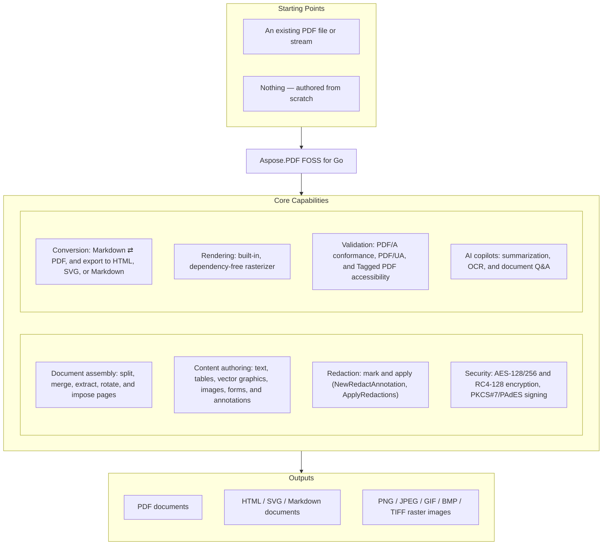

# Aspose.PDF FOSS for Go

[](https://github.com/aspose-pdf-foss/aspose-pdf-foss-for-go/actions/workflows/test.yml) [](https://github.com/aspose-pdf-foss/aspose-pdf-foss-for-go/actions/workflows/lint.yml) [](https://pkg.go.dev/github.com/aspose-pdf-foss/aspose-pdf-foss-for-go) [](https://opensource.org/licenses/MIT) [](https://go.dev/dl/)

[](https://products.aspose.org/pdf/go/)

Aspose.PDF FOSS for Go is a free, open-source, **pure Go** PDF library — no CGo, no
native libraries, no external dependencies (standard library only). It creates,
edits, renders, signs, encrypts, converts, and validates PDF documents: split and
merge pages, extract and search text, fill and build AcroForms, draw text/vector
graphics/tables, embed and subset fonts, apply digital signatures (PKCS#7, PAdES,
timestamps), validate and convert PDF/A, author accessible Tagged PDF, and render
pages to images with a built-in dependency-free rasterizer. It also converts
Markdown ⇄ PDF, exports PDF → HTML/SVG/Markdown, and (via the optional `ai`
subpackage) adds AI copilots — summarization, OCR, document Q&A — over any
OpenAI-compatible endpoint.

## Navigation

- [At a Glance](#at-a-glance)
- [Key Capabilities](#key-capabilities)
- [Installation](#installation)
- [Quick Start](#quick-start)
- [Feature Showcase](#feature-showcase)
- [Additional Examples](#additional-examples)
- [API Reference](#api-reference)
- [Documentation & Resources](#documentation--resources)
- [Scope and Limitations](#scope-and-limitations)
- [Development and Testing](#development-and-testing)
- [License](#license)

## At a Glance



## Key Capabilities

- Open, create, save, split, merge (`Document.Append`), extract page ranges, rotate, delete, and impose pages (`NUp`/`Booklet`) on a `Document`.
- Draw text — including right-to-left and bidirectional text (Hebrew, Arabic) via a pure-Go Unicode Bidi Algorithm (UAX #9) with Arabic contextual letterform shaping — vector graphics (`DrawLine`/`DrawRectangle`/`DrawPath`, linear/radial gradients, tiling patterns), tables (`Table`/`Row`/`Cell`), and images directly onto a `Page`.
- Automatic pagination via `Document.NewFlow` — chainable `AddParagraph`/`AddHeading`/`AddImage`/`AddTable`/`AddList`/`AddMarkdown`, plus floating boxes and multi-column layout.
- Fill, build, and export/import AcroForm fields (text, checkbox, radio, combo, list, push button) — including typed JSON, FDF, and XFDF form-data interchange.
- Add and manage annotations (links, highlights, stamps, redactions, ink, free text, polygons, and more) with auto-generated appearance streams.
- Encrypt with AES-128, AES-256, or RC4-128 (`EncryptionOptions`/`Permissions`), and sign with PKCS#7-detached digital signatures — invisible or visible, with optional PAdES, certification (DocMDP), and RFC 3161 timestamps.
- Author accessible Tagged PDF / PDF-UA content via `Document.TaggedContent()`, and validate/convert PDF/A conformance (`ValidatePDFA`/`ConvertToPDFA`).
- Render pages to PNG, JPEG, GIF, BMP, and single- or multi-page TIFF with a built-in, dependency-free, anti-aliased rasterizer (`Page.RenderImage`, `Document.RenderTIFF`) — no `golang.org/x/image`, no cgo — including CCITT Group 3/4 fax, JBIG2 bilevel, and JPEG2000 colour scans, plus non-embedded CJK text rendered from installed system fonts.
- Convert Markdown ⇄ PDF (CommonMark + GFM; the parser passes all 652/652 cases of the official CommonMark 0.31.2 test suite), and export documents to HTML in four modes — faithful (rasterized), visible-text and native (real selectable, Ctrl+F-searchable text with embedded fonts re-wrapped as WOFF `@font-face` data URLs), and flow (reflowable) — with fillable forms, or export to SVG or Markdown.
- Extract text (reading or raw content-stream order), search text (literal/regex), and extract images with layout and color-space metadata.
- Optional `ai` subpackage: document summarization, OCR of scanned pages with a searchable-PDF pipeline, document Q&A, and image alt-text generation, over any OpenAI-compatible endpoint (stdlib-only, network only when you configure a client).
- Reduce file size with `Document.Optimize`'s unified, single-call optimizer (`DefaultOptimizationOptions()` is the safe, lossless preset: Flate-compresses uncompressed streams, dedupes byte-identical streams, subsets fonts, and removes unused objects), plus standalone `OptimizeImages`, `RemoveUnusedObjects`, author reusable Form XObjects (`Document.CreateForm`/`ImportForm`, `Page.AddForm`) and optional-content layers (`Document.AddLayer`, `Page.BeginLayer`/`EndLayer`), attach document-level embedded files (`Document.EmbeddedFiles`) and document JavaScript/open actions (`Document.JavaScript`, `SetOpenAction`), apply page stamps (`Document.AddStamp`) and text watermarks (`Document.AddTextWatermark`), and convert a document to grayscale (`Document.ConvertToGrayscale`).

## Installation

```bash
go get github.com/aspose-pdf-foss/aspose-pdf-foss-for-go@v0.6.0
```

Requires Go 1.24 or later. Import with an alias, since the module path does not
match the package name:

```go
import pdf "github.com/aspose-pdf-foss/aspose-pdf-foss-for-go"
```

## Quick Start

```go
import pdf "github.com/aspose-pdf-foss/aspose-pdf-foss-for-go"

// Open a PDF
doc, err := pdf.Open("input.pdf")

// Split into individual page documents
pages, err := doc.Split()
for i, p := range pages {
    p.Save(fmt.Sprintf("page%03d.pdf", i+1))
}

// Merge multiple PDFs into one (Append mutates doc in place)
doc2, _ := pdf.Open("file2.pdf")
doc.Append(doc2)
doc.Save("merged.pdf")
```

See [`_examples/`](_examples/) for full runnable
programs covering text, forms, annotations, tables, vector graphics, SVG, and the
end-to-end `feature_showcase` demo. Short focused API snippets also appear under
"Examples" on [pkg.go.dev](https://pkg.go.dev/github.com/aspose-pdf-foss/aspose-pdf-foss-for-go).

## Feature Showcase

[](docs/feature_showcase.pdf)

[`docs/feature_showcase.pdf`](docs/feature_showcase.pdf) is a single 14-page PDF generated by
[`_examples/feature_showcase`](_examples/feature_showcase/main.go), demonstrating this library's
document-generation, text, form, annotation, table, and vector-graphics capabilities in one file.
Regenerate it locally with `go run ./_examples/feature_showcase`.

## Additional Examples

Each of these is a complete, runnable `Example` function from the library's own
test suite.

### Split a Document

```go
func ExampleDocument_Split() {
	doc, err := pdf.Open("testdata/4pages.pdf")
	if err != nil {
		log.Fatal(err)
	}
	parts, err := doc.Split()
	if err != nil {
		log.Fatal(err)
	}
	fmt.Println("parts:", len(parts))
	// Output: parts: 4
}
```

<details>
<summary>View Additional Examples</summary>

### Extract Page Ranges

```go
func ExampleDocument_Extract() {
	doc, err := pdf.Open("testdata/4pages.pdf")
	if err != nil {
		log.Fatal(err)
	}
	out, err := doc.Extract(
		pdf.PageRange{From: 1, To: 2},
		pdf.PageRange{From: 4, To: 4},
	)
	if err != nil {
		log.Fatal(err)
	}
	fmt.Println("extracted:", out.PageCount(), "pages")
	// Output: extracted: 3 pages
}
```

### Encrypt With Granular Permissions

```go
func ExampleDocument_SetEncryption() {
	doc := pdf.NewDocumentFromFormat(pdf.PageFormatA4)
	doc.SetEncryption(pdf.EncryptionOptions{
		UserPassword:  "secret",
		OwnerPassword: "owner-secret",
		Permissions:   &pdf.Permissions{AllowPrint: true, AllowCopy: true},
		Algorithm:     pdf.EncryptionAlgAES128,
	})

	var buf bytes.Buffer
	if _, err := doc.WriteTo(&buf); err != nil {
		log.Fatal(err)
	}

	// The file is now encrypted; Open returns ErrEncrypted.
	if _, err := pdf.OpenStream(&buf); err != nil {
		fmt.Println("encrypted")
	}
	// Output: encrypted
}
```

### Digital Signatures

```go
func ExampleDocument_Sign() {
	key, _ := ecdsa.GenerateKey(elliptic.P256(), cryptorand.Reader)
	tmpl := &x509.Certificate{
		SerialNumber: big.NewInt(1),
		Subject:      pkix.Name{CommonName: "Jane Signer"},
		NotBefore:    time.Now().Add(-time.Hour),
		NotAfter:     time.Now().Add(24 * time.Hour),
		KeyUsage:     x509.KeyUsageDigitalSignature,
	}
	der, _ := x509.CreateCertificate(cryptorand.Reader, tmpl, tmpl, &key.PublicKey, key)
	cert, _ := x509.ParseCertificate(der)

	doc := pdf.NewDocumentFromFormat(pdf.PageFormatA4)
	if err := doc.Sign(pdf.SignOptions{Certificate: cert, PrivateKey: key, Reason: "Approval"}); err != nil {
		log.Fatal(err)
	}
	var buf bytes.Buffer
	if _, err := doc.WriteTo(&buf); err != nil {
		log.Fatal(err)
	}

	signed, _ := pdf.OpenStream(&buf)
	sigs, err := signed.VerifySignatures()
	if err != nil {
		log.Fatal(err)
	}
	fmt.Printf("signatures: %d, valid: %v, reason: %s\n", len(sigs), sigs[0].Valid, sigs[0].Reason)
	// Output: signatures: 1, valid: true, reason: Approval
}
```

### Fill an AcroForm Field

```go
func ExampleForm_AddTextField() {
	doc := pdf.NewDocumentFromFormat(pdf.PageFormatA4)
	form := doc.Form()
	field, err := form.AddTextField(1, pdf.Rectangle{LLX: 50, LLY: 700, URX: 300, URY: 725}, "customer")
	if err != nil {
		log.Fatal(err)
	}
	_ = field.SetValue("ACME Corp")

	fmt.Println(form.Field("customer").Value())
	// Output: ACME Corp
}
```

### Add a Link Annotation

```go
func ExampleNewLinkAnnotation() {
	doc := pdf.NewDocumentFromFormat(pdf.PageFormatA4)
	page, _ := doc.Page(1)

	link := pdf.NewLinkAnnotation(page, pdf.Rectangle{LLX: 50, LLY: 700, URX: 300, URY: 720})
	link.SetAction(pdf.NewGoToURIAction("https://pkg.go.dev/github.com/aspose-pdf-foss/aspose-pdf-foss-for-go"))
	if err := page.Annotations().Add(link); err != nil {
		log.Fatal(err)
	}
	fmt.Println("annotations:", page.Annotations().Count())
	// Output: annotations: 1
}
```

### Draw a Table

```go
func ExampleNewTable() {
	doc := pdf.NewDocumentFromFormat(pdf.PageFormatA4)
	page, _ := doc.Page(1)

	table := pdf.NewTable().
		SetColumnWidths([]float64{300, 100}).
		SetDefaultCellBorder(pdf.BorderInfo{Sides: pdf.BorderSideAll, Width: 0.5}).
		SetDefaultCellMargin(pdf.MarginInfo{Top: 4, Right: 6, Bottom: 4, Left: 6})

	header := table.AddRow()
	header.AddCell("Item").SetTextStyle(pdf.TextStyle{Font: pdf.FontHelveticaBold, Size: 11})
	header.AddCell("Price").SetTextStyle(pdf.TextStyle{Font: pdf.FontHelveticaBold, Size: 11}).
		SetHAlign(pdf.HAlignRight)

	table.AddRows([][]string{
		{"Espresso", "€3.50"},
		{"Cappuccino", "€4.50"},
		{"Tiramisu", "€7.50"},
	})

	rect := pdf.Rectangle{LLX: 50, LLY: 500, URX: 450, URY: 750}
	if _, err := page.AddTable(table, rect); err != nil {
		log.Fatal(err)
	}
	fmt.Println("rows:", table.RowCount())
	// Output: rows: 4
}
```

### Flow Layout (Auto-Paginated Document Generator)

```go
func ExampleDocument_NewFlow() {
	doc := pdf.NewDocumentFromFormat(pdf.PageFormatA4)
	flow := doc.NewFlow(pdf.FlowOptions{})
	flow.AddHeading(1, "Quarterly Report", pdf.TextStyle{})
	flow.AddParagraph("Revenue grew in every region this quarter.", pdf.TextStyle{Size: 11})
	flow.AddList([]string{"North: +12%", "South: +8%"}, false, pdf.TextStyle{Size: 11})

	pages, err := flow.Render()
	if err != nil {
		log.Fatal(err)
	}
	fmt.Println("pages:", pages)
	// Output: pages: 1
}
```

### Search Text on a Page

```go
func ExamplePage_SearchText() {
	doc := pdf.NewDocumentFromFormat(pdf.PageFormatA4)
	page, _ := doc.Page(1)
	_ = page.AddText("The quick brown fox jumps over the lazy dog.",
		pdf.TextStyle{Size: 14}, pdf.Rectangle{LLX: 50, LLY: 700, URX: 545, URY: 780})

	matches, err := page.SearchText("brown fox")
	if err != nil {
		log.Fatal(err)
	}
	fmt.Printf("%d match: %q\n", len(matches), matches[0].Text)
	// Output: 1 match: "brown fox"
}
```

### Extract Text From Every Page

```go
doc, err := pdf.Open("input.pdf")
if err != nil {
	log.Fatalf("open: %v", err)
}

for i := 1; i <= doc.PageCount(); i++ {
	page, err := doc.Page(i)
	if err != nil {
		log.Fatalf("page %d: %v", i, err)
	}
	text, err := page.ExtractText()
	if err != nil {
		log.Fatalf("extract page %d: %v", i, err)
	}
	fmt.Printf("--- Page %d ---\n%s\n", i, text)
}
```

### Add an SVG Watermark

```go
func ExampleDocument_AddSVGWatermark() {
	doc, err := pdf.Open("testdata/4pages.pdf")
	if err != nil {
		log.Fatal(err)
	}
	if err := doc.AddSVGWatermark("testdata/aspose-logo.svg"); err != nil {
		log.Fatal(err)
	}
	var buf bytes.Buffer
	if _, err := doc.WriteTo(&buf); err != nil {
		log.Fatal(err)
	}
	fmt.Println("watermarked:", buf.Len() > 0)
	// Output: watermarked: true
}
```

### Render a Page to an Image

```go
func ExampleDocument_RenderImage() {
	doc := pdf.NewDocumentFromFormat(pdf.PageFormatA4)
	page, _ := doc.Page(1)
	_ = page.AddText("Preview me", pdf.TextStyle{Size: 24},
		pdf.Rectangle{LLX: 50, LLY: 700, URX: 545, URY: 780})

	img, err := doc.RenderImage(1, pdf.RenderOptions{DPI: 96})
	if err != nil {
		log.Fatal(err)
	}
	fmt.Println("rendered:", img.Bounds().Dx() > 0 && img.Bounds().Dy() > 0)
	// Output: rendered: true
}
```

</details>

## API Reference

The library exposes 179 public types in the root `asposepdf` package (imported
as `pdf`), plus 25 more in the optional `ai` subpackage. The table below is a curated subset
grouped by workflow — see [Documentation & Resources](#documentation--resources)
for the complete, browsable list.

<details>
<summary>View the Curated Public API Surface</summary>

### Core API

| Class | Description |
|---|---|
| `AIClient` | AIClient is the contract every copilot consumes: one call, one chat completion. |
| `APIError` | APIError is returned when the AI endpoint answers with a non-2xx status. |
| `Action` | Action is the common interface implemented by every concrete action type. |
| `ActionType` | ActionType identifies the kind of action attached to an annotation (typically a LinkAnnotation's /A entry). |
| `Annotation` | Annotation is the common interface implemented by every concrete annotation type. |
| `AnnotationCollection` | AnnotationCollection is the live, ordered set of annotations attached to a single page. |
| `AnnotationType` | AnnotationType identifies the kind of annotation. |
| `BmpDevice` | BmpDevice renders a page to BMP. |
| `BookletBinding` | BookletBinding selects the binding edge of a booklet. |
| `BookletOptions` | BookletOptions configures Booklet imposition. |
| `BorderEffect` | BorderEffect controls the /BE/S entry per ISO 32000-1 §12.5.4 Table 167. |
| `BorderInfo` | BorderInfo describes a border drawn around a table or cell. |
| `BorderSide` | BorderSide is a bitmask selecting which sides of a rectangular border are drawn. |
| `BorderStyle` | BorderStyle controls the /BS dict for drawing annotations per ISO 32000-1 §12.5.4 Table 168. |
| `ButtonAppearance` | ButtonAppearance configures a push button's rich appearance: separate captions for the normal / rollover / down states, an optional icon image, and face/border/text colours. |
| `ButtonField` | ButtonField is a push button — action only, no value semantics. |
| `ButtonIconPosition` | ButtonIconPosition controls how a push button lays out its icon and caption — the /MK /TP entry per ISO 32000-1 §12.5.6.19 Table 189. |
| `CaretAnnotation` | CaretAnnotation marks a point of text insertion or deletion, drawn as an upward caret ("^") filled with the annotation colour. |
| `CaretSymbol` | CaretSymbol is the /Sy entry of a Caret annotation per ISO 32000-1 §12.5.6.11 Table 180 — an optional symbol drawn together with the caret to associate it with an editing action. |
| `Cell` | Cell is a single cell within a Row. |
| `CertifyPermission` | CertifyPermission is the DocMDP permission level of a certification signature (ISO 32000-1 §12.8.2.2 Table 254). |
| `ChatCopilot` | ChatCopilot answers questions about a document, keeping conversation history. |
| `ChatOptions` | ChatOptions configures a ChatCopilot. |
| `CheckboxField` | CheckboxField is a checkbox with on/off state. |
| `ChoiceOption` | ChoiceOption is one option of a ComboBoxField or ListBoxField. |
| `CircleAnnotation` | CircleAnnotation draws an elliptical annotation. |
| `Color` | Color represents an RGBA color with values in [0, 1]. |
| `ComboBoxField` | ComboBoxField is a single-select dropdown choice field. |
| `CompletionRequest` | CompletionRequest describes one chat-completion call. |
| `CompletionResponse` | CompletionResponse is the model's reply. |
| `DateField` | DateField is a text field with a JavaScript date-format action and a format mask (e.g. `"mm/dd/yyyy"`). |
| `Destination` | Destination is the common interface for all explicit destinations. |
| `DestinationFit` | DestinationFit — [page /Fit]. |
| `DestinationFitB` | DestinationFitB — [page /FitB]. |
| `DestinationFitBH` | DestinationFitBH — [page /FitBH top]. |
| `DestinationFitBV` | DestinationFitBV — [page /FitBV left]. |
| `DestinationFitH` | DestinationFitH — [page /FitH top]. |
| `DestinationFitR` | DestinationFitR — [page /FitR left bottom right top]. |
| `DestinationFitV` | DestinationFitV — [page /FitV left]. |
| `DestinationType` | DestinationType identifies the destination flavor. |
| `DestinationXYZ` | DestinationXYZ — [page /XYZ left top zoom]. |
| `Document` | Document is a PDF document. |
| `DocumentInfo` | DocumentInfo contains document information from the PDF Info dictionary. |
| `EmbeddedFile` | EmbeddedFile is one attachment: a /Filespec dictionary with an embedded stream. |
| `EmbeddedFiles` | EmbeddedFiles is the document's collection of attached (embedded) files — the /Catalog/Names/EmbeddedFiles name tree (ISO 32000-1 §7.11.4). |
| `EncryptionAlgorithm` | EncryptionAlgorithm selects the cipher and security-handler revision used by (*Document).SetEncryption. |
| `EncryptionOptions` | EncryptionOptions bundles every knob that controls how a document is encrypted when saved. |
| `Field` | Field is the common interface implemented by every concrete form field type (TextBoxField, CheckboxField, RadioButtonField, etc.). |
| `FieldStyle` | FieldStyle is the visual styling applied to a form field's widget(s). |
| `FigureAlt` | FigureAlt is a /Figure structure element that has no alternate text, paired with the image it brackets (when resolvable). |
| `FileAttachmentAnnotation` | FileAttachmentAnnotation embeds a file in the document and shows an icon at the annotation's /Rect. |
| `FileAttachmentIcon` | FileAttachmentIcon names per ISO 32000-1 §12.5.6.15 Table 178. |
| `FileSelectBoxField` | FileSelectBoxField is a text field whose value is a file path (FileSelect flag), used to attach a local file on submit. |
| `FloatSide` | FloatSide selects which edge a floated box hugs while text wraps around it. |
| `FloatingBox` | FloatingBox is a positioned content container (Tier 2 of the flow model): a box with an optional border, background and padding that lays its own content (paragraphs, headings, images, lists) inside its width. |
| `Flow` | Flow is a document generator that lays content out top-to-bottom and paginates automatically — the "flow" counterpart to the Rectangle-based drawing API. |
| `FlowOptions` | FlowOptions configures a Flow. |
| `Font` | Font is implemented by standard 14 fonts and embedded TTF fonts. |
| `Form` | Form is the document's AcroForm view. |
| `FormFieldType` | FormFieldType identifies the kind of form field. |
| `FreeTextAnnotation` | FreeTextAnnotation displays text directly on the page, rendered into /AP/N using an embedded font. |
| `FreeTextIntent` | FreeTextIntent per ISO 32000-1 §12.5.6.6 /IT entry. |
| `GenericAnnotation` | GenericAnnotation is the catch-all surface for /Subtype values this release does not yet model (Stamp, FreeText, Ink, etc.). |
| `GifDevice` | GifDevice renders a page to GIF. |
| `GoToAction` | GoToAction navigates to a page within the same document. |
| `GoToURIAction` | GoToURIAction opens a URI in the user's default handler (typically a web browser). |
| `Gradient` | Gradient is a fill that varies colour across a shape: either a LinearGradient or a RadialGradient. |
| `GradientStop` | GradientStop is one colour stop in a gradient, positioned at Offset (0 at the gradient's start, 1 at its end). |
| `HAlign` | HAlign specifies horizontal text alignment within a rectangle. |
| `HTMLMode` | HTMLMode selects how SaveHTML / WriteHTML represents page text. |
| `HTMLSaveOptions` | HTMLSaveOptions configures SaveHTML / WriteHTML. |
| `HighlightAnnotation` | HighlightAnnotation marks a region with semi-transparent highlight color. |
| `Image` | Image holds an extracted image with its encoded data and metadata. |
| `ImageColorSpace` | ImageColorSpace describes the original color space of the image in the PDF. |
| `ImageDescriptionCopilot` | ImageDescriptionCopilot describes images with a vision model. |
| `ImageDescriptionOptions` | ImageDescriptionOptions configures an ImageDescriptionCopilot. |
| `ImageFormat` | ImageFormat describes the output format of an extracted image. |
| `ImageInfo` | ImageInfo holds metadata about an image found on a page without decoding pixel data. |
| `ImageStamp` | ImageStamp overlays a raster image (PNG or JPEG), stretched to fill Rect. |
| `ImageToDocumentOptions` | ImageToDocumentOptions controls page sizing for ImageToDocument. |
| `InkAnnotation` | InkAnnotation draws a series of free-form strokes — typically used to represent handwritten ink. |
| `JSONExportOptions` | JSONExportOptions controls (*Form).ExportJSON / WriteJSON. |
| `JavaScriptAction` | JavaScriptAction holds a JavaScript snippet attached to an annotation. |
| `JavaScriptCollection` | JavaScriptCollection is the document-level JavaScript store, backed by the /Catalog/Names/JavaScript name tree (ISO 32000-1 §7.7.4 / §8.5.1). |
| `JpegDevice` | JpegDevice renders a page to JPEG. |
| `LLMOCREngine` | LLMOCREngine recognizes text by sending the page image to a vision-capable chat model. |
| `LLMOCROptions` | LLMOCROptions configures the vision-model OCR engine. |
| `Layer` | Layer is one Optional Content Group (OCG) in the document. |
| `LineAnnotation` | LineAnnotation draws a straight line between two points, with optional line endings on each end (arrows, circles, etc. |
| `LineCap` | LineCap is the /J line cap style per ISO 32000-1 §8.4.3.3 Table 54. |
| `LineEndingStyle` | LineEndingStyle is one of the 10 line-ending shapes per ISO 32000-1 §12.5.6.7 Table 176, used in /Line annotations' /LE entry. |
| `LineJoin` | LineJoin is the /j line join style per ISO 32000-1 §8.4.3.4 Table 55. |
| `LineStyle` | LineStyle describes how a stroked path is drawn. |
| `LinearGradient` | LinearGradient interpolates colour along the line from (X1, Y1) to (X2, Y2). |
| `LinkAnnotation` | LinkAnnotation is a clickable region. |
| `LinkHighlightMode` | LinkHighlightMode controls the visual feedback when the link is activated by the user (the /H entry per ISO 32000-1 §12.5.6.5). |
| `ListBoxField` | ListBoxField is a single- or multi-select list choice field. |
| `MarginInfo` | MarginInfo describes margins or padding in points: Top / Right / Bottom / Left. |
| `MarkdownOptions` | MarkdownOptions configures Markdown rendering. |
| `MarkdownSaveOptions` | MarkdownSaveOptions configures SaveMarkdown / WriteMarkdown. |
| `MarkupParagraph` | MarkupParagraph is a run of consecutive lines forming one paragraph. |
| `MarkupSection` | MarkupSection is a column of paragraphs (left-to-right across the page). |
| `Message` | Message is a single chat message. |
| `MessageImage` | MessageImage is an inline image attached to a message, sent as a base64 data: URL. |
| `NUpOptions` | NUpOptions configures NUp imposition. |
| `NUpOrder` | NUpOrder controls the order in which source pages fill the grid cells of an N-up sheet. |
| `NamedAction` | NamedAction triggers a built-in viewer command (FirstPage, Print, ...). |
| `NamedActionType` | NamedActionType identifies one of the standard viewer commands supported by /Named actions per ISO 32000-1 §12.6.4.11. |
| `NamedDestination` | NamedDestination wraps a name reference into the document's NamedDestinations collection. |
| `NamedDestinations` | NamedDestinations is a name-to-destination map per ISO 32000-1 §12.3.2.3. |
| `NumberField` | NumberField is a text field with a JavaScript number-format action, so viewers display and validate the value as a formatted number. |
| `NumberFormatOptions` | NumberFormatOptions configures a NumberField's display formatting (maps to Acrobat's AFNumber_Format). |
| `OCRBox` | OCRBox is a rectangle in image pixel space: origin at the top-left corner, Y increasing downward (the usual raster convention — distinct from PDF user space on purpose). |
| `OCREngine` | OCREngine recognizes text on one page image. |
| `OCRLine` | OCRLine is one physical text line. |
| `OCRResult` | OCRResult is the recognized content of one page image. |
| `OCRWord` | OCRWord is word-level detail within a line, for engines that provide it. |
| `OcrCopilot` | OcrCopilot recognizes text on scanned pages. |
| `OcrOptions` | OcrOptions configures an OcrCopilot. |
| `OpenAIClient` | OpenAIClient talks to an OpenAI-compatible chat-completions endpoint using only the standard library. |
| `OpenAIClientOptions` | OpenAIClientOptions configures NewOpenAIClient. |
| `OptimizationOptions` | OptimizationOptions selects which reductions Document.Optimize applies. |
| `OptimizationResult` | OptimizationResult reports what Document.Optimize changed. |
| `OptimizeImageOptions` | OptimizeImageOptions controls image optimization behavior. |
| `OutlineItemCollection` | OutlineItemCollection represents an outline entry and the collection of its children. |
| `PDFAFormat` | PDFAFormat identifies a PDF/A conformance level. |
| `PDFAIssue` | PDFAIssue describes a single PDF/A conformance violation. |
| `PDFAValidationReport` | PDFAValidationReport is returned by (*Document).ValidatePDFA. |
| `PDFUAIssue` | PDFUAIssue describes a single PDF/UA (accessibility) conformance violation. |
| `PDFUAValidationReport` | PDFUAValidationReport is returned by (*Document).ValidatePDFUA. |
| `Page` | Page is a live view of a single page within a Document. |
| `PageFormat` | PageFormat describes a page size in points (1/72 inch). |
| `PageLabelRange` | PageLabelRange describes a contiguous run of pages that share a numbering style. |
| `PageLabelStyle` | PageLabelStyle is the numbering style applied within a PageLabelRange. |
| `PageMarkup` | PageMarkup is the structured text of one page. |
| `PageNumberStamp` | PageNumberStamp stamps the page number (and optionally the total), formatted by Format. |
| `PageRange` | PageRange specifies an inclusive range of pages (1-based). |
| `PageSize` | PageSize holds the width and height of a PDF page in points (1/72 inch). |
| `PasswordBoxField` | PasswordBoxField is a text field whose input is masked (Password flag). |
| `Path` | Path is a sequence of MoveTo/LineTo/CurveTo/Close operations defining an arbitrary 2D path in PDF user space (origin at page bottom-left, Y up). |
| `PdfPageStamp` | PdfPageStamp overlays (or underlays) a page from another PDF document as a stamp — the source page is imported once as a Form XObject and drawn into the stamp's Rect, scaled to fit while preserving aspect ratio, positioned by HAlign/VAlign, and honoring Opacity, RotateAngle and Background. |
| `Permissions` | Permissions controls what a viewer allows on an encrypted PDF. |
| `PngDevice` | PngDevice renders a page to PNG at a fixed resolution. |
| `Point` | Point is a single point in PDF user-space coordinates. |
| `PolygonAnnotation` | PolygonAnnotation draws a closed polygon through a list of vertices, with a stroked border and optional interior fill. |
| `PolylineAnnotation` | PolylineAnnotation draws an open polyline through a list of vertices, with a stroked border, optional line endings at the first and last vertex, and optional interior fill for closed endings. |
| `QuadPoint` | QuadPoint is one quadrilateral within a markup annotation's /QuadPoints array. |
| `RadialGradient` | RadialGradient interpolates colour from the focal point (FX, FY) out to the circle centred at (CX, CY) with radius R. |
| `RadioButtonField` | RadioButtonField is a group of mutually exclusive options. |
| `RadioButtonOptionField` | RadioButtonOptionField is one of the option widgets inside a RadioButtonField. |
| `RadioItem` | RadioItem describes one widget inside a radio group. |
| `Rectangle` | Rectangle represents a PDF rectangle [llx, lly, urx, ury] in points (1/72 inch). |
| `RedactAnnotation` | RedactAnnotation marks regions for redaction. |
| `RenderOptions` | RenderOptions controls page rasterization. |
| `ReplaceOptions` | ReplaceOptions tunes how ReplaceText matches the search text. |
| `ResetFormAction` | ResetFormAction resets named form fields to their /DV defaults. |
| `Resolution` | Resolution is a rendering resolution in DPI. |
| `RichTextBoxField` | RichTextBoxField is a text field that carries a rich-text value (RichText flag + /RV) in addition to its plain /V. |
| `RotationAngle` | RotationAngle represents a valid PDF page rotation in clockwise degrees. |
| `Row` | Row is a single row within a Table. |
| `SVG` | SVG is the pre-parsed SVG document. |
| `SVGFontResolver` | SVGFontResolver maps an SVG font-family + style to a PDF.Font. |
| `SVGSaveOptions` | SVGSaveOptions configures SaveSVG / WriteSVG. |
| `SearchOptions` | SearchOptions tunes how SearchText interprets the query. |
| `ShapeStyle` | ShapeStyle combines a stroke (LineStyle) with an optional fill color. |
| `SignOptions` | SignOptions configures a digital signature. |
| `SignatureAppearance` | SignatureAppearance controls the visible signature block's content and styling. |
| `SignatureVerification` | SignatureVerification is the result of verifying one digital signature. |
| `SquareAnnotation` | SquareAnnotation draws a rectangular annotation with stroked border and optional interior fill. |
| `SquigglyAnnotation` | SquigglyAnnotation draws a wavy underline under text (typically used for spell-check style hints). |
| `Stamp` | Stamp is content overlaid on (or behind) a page: a TextStamp, an ImageStamp, or a PageNumberStamp. |
| `StampAnnotation` | StampAnnotation is a rubber-stamp annotation. |
| `StampName` | StampName names per ISO 32000-1 §12.5.6.13 Table 184. |
| `StrikeOutAnnotation` | StrikeOutAnnotation draws a horizontal line through text. |
| `StructElement` | StructElement is a node in the logical structure tree. |
| `StructType` | StructType is a PDF standard structure type (ISO 32000-1 §14.8.4), used as the /S value of a structure element. |
| `SubmitFormAction` | SubmitFormAction submits form field values to a URL. |
| `SubmitFormFlags` | SubmitFormFlags is the /Flags bitfield for a /SubmitForm action per ISO 32000-1 Table 237. |
| `SummaryCopilot` | SummaryCopilot produces document summaries with an AI model. |
| `SummaryOptions` | SummaryOptions configures a SummaryCopilot. |
| `TOCEntry` | TOCEntry is one line of a table of contents: a title, an indent level (0 = top level), and the page it points at. |
| `TOCOptions` | TOCOptions controls how a table of contents is rendered. |
| `Table` | Table is a transient builder for a tabular layout drawn onto a Page. |
| `TaggedContent` | TaggedContent is the facade for authoring a Tagged PDF (ISO 32000-1 §14.8): it owns the document's logical structure tree and sets the catalog marks PDF/UA requires. |
| `TextAnnotation` | TextAnnotation is a sticky-note annotation. |
| `TextBoxField` | TextBoxField is a single- or multi-line text input. |
| `TextExtractOptions` | TextExtractOptions configures ExtractText. |
| `TextExtractionMode` | TextExtractionMode selects how ExtractText orders the extracted text. |
| `TextFragment` | TextFragment represents a contiguous run of text with uniform font. |
| `TextIcon` | TextIcon names per ISO 32000-1 §12.5.6.4 Table 172, used in /Subtype /Text annotations' /Name entry. |
| `TextLine` | TextLine represents a horizontal line of text fragments at a common Y position. |
| `TextMatch` | TextMatch is a single occurrence located by SearchText. |
| `TextRecognitionResult` | TextRecognitionResult is the recognized text of one processed page. |
| `TextStamp` | TextStamp overlays a line (or wrapped block) of text. |
| `TextStyle` | TextStyle defines reusable text formatting properties. |
| `TiffDevice` | TiffDevice renders pages to TIFF. |
| `TilingPattern` | TilingPattern is a repeating fill (PatternType 1, ISO 32000-1 §8.7.3.1): a small cell of content tiled across whatever shape it fills. |
| `UnderlineAnnotation` | UnderlineAnnotation draws a horizontal line under text. |
| `Usage` | Usage reports token counts when the provider returns them. |
| `VAlign` | VAlign specifies vertical text alignment within a rectangle. |
| `ValidationIssue` | ValidationIssue describes a single problem found in a PDF file. |
| `ValidationReport` | ValidationReport is returned by Validate and summarises the structural integrity of a PDF. |
| `WidgetAnnotation` | WidgetAnnotation is the read-only view of a form widget annotation surfaced through AnnotationCollection. |
| `XForm` | XForm is a reusable Form XObject (ISO 32000-1 §8.10) — a self-contained content stream (with its own resources) that can be placed on any number of pages and positions with a single Do invocation. |
| `XMPMetadata` | XMPMetadata is the document's XMP packet modelled as common schema fields plus a list of arbitrary Custom properties. |
| `XMPProperty` | XMPProperty is a single simple (string-valued) XMP property in an arbitrary namespace. |

---

#### Detailed Member Reference

### Document and Pages

- `Document` — the PDF document; `Open(path)`, `OpenStream(r)`, `OpenWithPassword(path, pw)`, `NewDocument(w, h)`, `NewDocumentFromFormat(format)`
  - `PageCount() -> int`, `Pages() -> []*Page`, `Page(n) -> (*Page, error)`
  - `Split() -> ([]*Document, error)`, `Extract(ranges...) -> (*Document, error)`, `Append(others...)`
  - `Rotate(angle, pageNums...) -> error`, `DeletePage(n) -> error`, `DeletePages(pageNums...) -> error`
  - `NUp(opts) -> (*Document, error)`, `Booklet(opts) -> (*Document, error)`
  - `Save(path) -> error`, `WriteTo(w) -> (int64, error)`, `SaveLinearized(path) -> error`
- `Page` — a live view of one page: `Number()`, `Size()`, `MediaBox()`/`CropBox()`/`TrimBox()`/`BleedBox()`/`ArtBox()`, `Rotation()`, `Label()`
- `(*Document).SetPageLabels(ranges []PageLabelRange) -> error` writes the `/PageLabels` number tree so viewers show logical page labels (roman/decimal/alphabetic styles, custom prefix); `ClearPageLabels()` removes it — round-trips with `Page.Label()`
- `PageFormat` — predefined sizes: `PageFormatA3`, `PageFormatA4`, `PageFormatLetter`, `PageFormatLegal`; `.Landscape()`
- `Rectangle`, `PageRange`, `PageSize`, `PageLabelRange`, `RotationAngle`

### Text and Search

- `(*Page).AddText(text, style TextStyle, rect Rectangle) -> error`
- `(*Page/*Document).ExtractText(opts ...TextExtractOptions) -> (string/[]string, error)`, `ExtractTextWithLayout()`
- `(*Page/*Document).SearchText(query, opts ...SearchOptions) -> ([]TextMatch, error)`
- `(*Page/*Document).ReplaceText(old, opts ...ReplaceOptions) -> (int, error)`
- `TextStyle`, `TextFragment`, `TextLine`, `TextMatch`, `SearchOptions`, `ReplaceOptions`, `Font` (Standard-14 + `Document.LoadFont`/`LoadFontByName` for TTF/OTF embedding)

### Tables and Vector Graphics

- `Table`/`Row`/`Cell` — `pdf.NewTable()`, `AddRow()`, `AddCell(text)`, `(*Page).AddTable(t, rect)`
- `BorderInfo`, `MarginInfo`, `BorderSide`
- `(*Page).DrawLine/DrawRectangle/DrawRoundedRectangle/DrawCircle/DrawEllipse/DrawPolyline/DrawPolygon/DrawPath`
- `Path` (fluent builder), `LineStyle`, `ShapeStyle`, `LinearGradient`, `RadialGradient`, `GradientStop`, `TilingPattern`
- `Table.SetRepeatingRowsCount(n)` marks header rows that repeat on every continuation page of a multi-page table; `Cell.SetColSpan`/`SetRowSpan` merge cells across columns/rows

### Forms (AcroForm)

- `Form` — `(*Document).Form()`, `Fields()`, `Field(name)`, `AddTextField`/`AddCheckbox`/`AddComboBox`/`AddListBox`/`AddRadioGroup`/`AddPushButton`
- `Field` interface implemented by `TextBoxField`, `CheckboxField`, `RadioButtonField`, `ComboBoxField`, `ListBoxField`, `ButtonField`, `DateField`, `NumberField`, `PasswordBoxField`, `FileSelectBoxField`, `RichTextBoxField`
- `FieldStyle`, `ChoiceOption`, `RadioItem`, `ButtonAppearance`
- `(*Form).ExportJSON/ImportJSON`, `ExportFDF/ImportFDF`, `ExportXFDF/ImportXFDF`
- Field values containing non-ASCII characters (e.g. Cyrillic) are encoded as UTF-16BE with a byte-order mark so any spec-conforming viewer reads them back correctly

### Annotations and Actions

- `Annotation` interface — `AnnotationType()`, `Rect()`, `Color()`, `Title()`, `Contents()`, `Flatten()`
- Concrete types: `LinkAnnotation`, `HighlightAnnotation`, `UnderlineAnnotation`, `StrikeOutAnnotation`, `SquigglyAnnotation`, `SquareAnnotation`, `CircleAnnotation`, `LineAnnotation`, `InkAnnotation`, `TextAnnotation`, `FreeTextAnnotation`, `StampAnnotation`, `FileAttachmentAnnotation`, `RedactAnnotation`, `PolygonAnnotation`, `PolylineAnnotation`, `CaretAnnotation`
- `AnnotationCollection` — `(*Page).Annotations()`, `Add`/`At`/`Delete`/`DeleteAt`/`Flatten`
- `Action` interface + `GoToAction`, `GoToURIAction`, `NamedAction`, `SubmitFormAction`, `ResetFormAction`, `JavaScriptAction`

### Security and Signatures

- `EncryptionOptions`, `EncryptionAlgorithm` (AES-128 default, AES-256, RC4-128), `Permissions`
- `(*Document).SetEncryption/SetPassword/RemoveEncryption/ChangePassword`
- `SignOptions`, `SignatureAppearance`, `CertifyPermission`, `SignatureVerification`
- `(*Document).Sign(opts) -> error`, `VerifySignatures() -> ([]SignatureVerification, error)`

### Outlines, TOC, and Destinations

- `OutlineItemCollection` — `(*Document).Outlines()`, `Add`/`Insert`/`Remove`/`At`/`All`, style (`SetBold`/`SetColor`), `SetDestination`/`SetAction`
- `Destination` interface + `DestinationXYZ`, `DestinationFit`, `DestinationFitH`, `DestinationFitV`, `DestinationFitR`, `DestinationFitB`, `DestinationFitBH`, `DestinationFitBV`, `NamedDestination`
- `NamedDestinations` — `(*Document).NamedDestinations()`, `Add`/`Get`/`Has`/`Remove`
- `(*Document).GenerateTOC(opts)`, `(*Page).AddTOC(entries, rect, opts)`, `TOCEntry`, `TOCOptions`

### Rendering and Images

- `(*Page).RenderImage/RenderPNG/RenderJPEG/RenderGIF/RenderBMP/RenderTIFF`, `(*Document).RenderImage/RenderTIFF`
- `RenderOptions`, `Resolution`, `PngDevice`, `JpegDevice`, `GifDevice`, `BmpDevice`, `TiffDevice`
- `Image`, `ImageInfo`, `ImageFormat`, `ImageColorSpace`, `ImageToDocumentOptions`
- `(*Page).AddImage/AddImageFromStream`, `(*Page/*Document).ExtractImages/ImageInfos`

### Accessibility and PDF/A

- `TaggedContent` — `(*Document).TaggedContent()`, `Root()`, `SetTitle`/`SetLanguage`
- `StructElement`, `StructType` — tagged tables and lists tag themselves, and purely decorative drawing (cell backgrounds/borders, header/footer chrome, page numbers) can be bracketed as a marked-content `/Artifact` so it stays out of the logical structure tree
- `(*Document).ValidatePDFUA() -> *PDFUAValidationReport`
- `PDFAFormat`, `(*Document).ValidatePDFA(format) -> *PDFAValidationReport`, `ConvertToPDFA(format) -> (*PDFAValidationReport, error)`

### Optimization, Layers, and Document Extras

- `(*Document).Optimize`, `OptimizeImages(opts OptimizeImageOptions) -> (int, error)`, `RemoveUnusedObjects() -> int`
- `XForm` — `(*Document).CreateForm(width, height) -> *XForm`, `ImportForm(form) -> (*XForm, error)`, `(*Page).AddForm(form, rect) -> error`
- `Layer` — `(*Document).AddLayer(name) -> *Layer`, `Layers() -> []*Layer`, `(*Page).BeginLayer(layer)`/`EndLayer()`
- `(*Document).EmbeddedFiles() -> *EmbeddedFiles` — document-level attachments, distinct from `FileAttachmentAnnotation`
- `(*Document).JavaScript() -> *JavaScriptCollection`, `OpenAction()`/`SetOpenAction(act)`/`RemoveOpenAction()`
- `(*Document).AddStamp(s Stamp, pageNums ...int) -> error` — page-number/header-footer/overlay stamp family
- `(*Document).AddTextWatermark(text, style TextStyle, pageNums ...int) -> error`
- `(*Document).ConvertToGrayscale() -> error`

### Conversion (Markdown / HTML / SVG)

- `MarkdownToDocument(path, opts...)`, `(*Document).SaveMarkdown/WriteMarkdown`, `MarkdownOptions`, `MarkdownSaveOptions`
- `(*Document).SaveHTML/WriteHTML`, `HTMLSaveOptions`, `HTMLMode`
- `(*Page).AddSVG/AddSVGFromStream/WriteSVG/SaveSVG`, `(*Document).LoadSVG/SaveSVG`, `SVG`, `SVGSaveOptions`, `SVGFontResolver`

### Metadata

- `DocumentInfo` — `(*Document).Info()/SetInfo()/ClearInfo()`
- `XMPMetadata`, `XMPProperty` — `(*Document).XMP()/SetXMP()/ClearXMP()/SyncInfoToXMP()`

### AI Copilots

Provided by the optional `ai` subpackage:

- `AIClient` interface, `OpenAIClient`/`OpenAIClientOptions` — OpenAI-compatible chat-completions client
- `SummaryCopilot`/`SummaryOptions` — `GetSummary`, `GetSummaryDocument`, `SaveSummary`
- `OcrCopilot`/`OcrOptions`, `OCREngine`/`LLMOCREngine`/`LLMOCROptions` — `GetTextRecognition`, `MakeSearchable`
- `ChatCopilot`/`ChatOptions` — `Ask`, `History`, `Reset`
- `ImageDescriptionCopilot`/`ImageDescriptionOptions` — `Describe`, `FillAltTexts`

</details>

## Documentation & Resources

- **[Getting started guide](https://docs.aspose.org/pdf/go/)** — installation, walkthroughs, and feature guides for this library.
- **[How-to guides & FAQ](https://kb.aspose.org/pdf/go/)** — task-focused answers for common PDF-processing questions.
- **[Full API reference](https://reference.aspose.org/pdf/go/)** — the complete, browsable reference for all 204 public types across the root package and `ai` subpackage (the [API reference](#api-reference) section above covers a curated subset).
- **[Contributing guide](CONTRIBUTING.md)** — how to propose changes and the project's coding conventions.
- **[Changelog](CHANGELOG.md)** — release history and notable changes per version.
- Found a bug or have a feature request? [Open an issue](https://github.com/aspose-pdf-foss/aspose-pdf-foss-for-go/issues) on GitHub.

## Scope and Limitations

Aspose.PDF FOSS for Go is a pure-Go library covering document assembly, content
authoring, forms, annotations, security, conversion, and rendering — with no CGo
or native dependencies. A few boundaries are worth noting:

- `Validate()` checks structural integrity only (parseable and internally consistent); it does
  not check PDF/A or PDF/UA conformance — use `ValidatePDFA`/`ValidatePDFUA` for those.
- `Document.VerifySignatures` confirms cryptographic validity, integrity, and whole-document
  coverage of a signature, but trust-chain validation against a certificate authority is the
  caller's responsibility.
- The built-in renderer does not support mesh shadings (PDF shading types 4–7).
- `ConvertToPDFA` cannot embed `Symbol`/`ZapfDingbats` or composite (CJK) fonts.
- PDF → Markdown export does not reconstruct tables: cell text flows as plain paragraphs rather
  than GFM table syntax (the Markdown → PDF direction, by contrast, renders GFM tables fully via
  the table engine).
- `Permissions` set via encryption are enforced by the consuming PDF viewer, not by this library
  — the encryption bitfield is written into the file, but the library itself is not a DRM
  mechanism.
- SVG import supports basic shapes, full SVG 1.1 path syntax, transforms, clipping and masking,
  gradients, markers, and CSS-selector styling; it does not support `<textPath>`, vertical
  writing modes, external `href` references in `<image>`, or true Gaussian blur (skipped
  silently).

These limitations don't apply to
[Aspose.PDF for Go — Enterprise Edition](https://products.aspose.com/pdf/go-cpp/), which
adds full format support — PDF/A and PDF/UA validation and signing-trust-chain verification,
complete mesh-shading rendering, CJK/Symbol/ZapfDingbats font embedding for PDF/A conversion —
plus cloud APIs and additional language bindings beyond this FOSS edition's pure-Go scope.

## Development and Testing

```bash
# Run all tests
go test ./...

# Run a single test
go test -run TestDocumentSplit ./...

# Run tests with verbose output
go test -v ./...

# Build (no binary — library only)
go build ./...
```

Standalone runnable examples live in `_examples/<name>/main.go` (run individually,
e.g. `go run ./_examples/feature_showcase`); short focused `ExampleXxx` functions
in `examples_test.go` are validated by `go test` via their `// Output:` comments.

## License

This project is licensed under the [MIT License](LICENSE). The MIT License
permits use, copying, modification, distribution, sublicensing, and commercial
use, provided its copyright and permission notice are retained. The software is
provided without warranty.

The library bundles Latin-subset copies of four metric-compatible fonts — Arimo, Tinos, Cousine,
and Carlito — used to render the PDF Standard-14 fonts (and Calibri) when no embedded or system
font is available. These are licensed under the SIL Open Font License 1.1, which permits
bundling with software under any license; see [`fonts/LICENSE.txt`](fonts/LICENSE.txt). The MIT
license above covers the library's own code (SPDX: `MIT AND OFL-1.1` for the distribution as a
whole).
