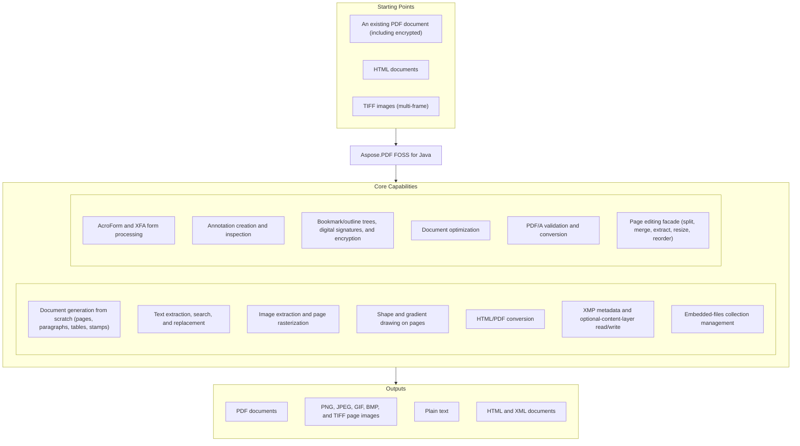

# Aspose.PDF FOSS for Java

[](https://github.com/aspose-pdf-foss/Aspose.PDF-FOSS-for-Java/actions/workflows/build.yml) [](https://repo1.maven.org/maven2/org/aspose/aspose-pdf-foss/) [](https://openjdk.org/projects/jdk/11/) [](LICENSE) [](https://github.com/aspose-pdf-foss/Aspose.PDF-FOSS-for-Java/graphs/contributors)

[](https://products.aspose.org/pdf/java/)

Aspose.PDF FOSS for Java is a free, open-source, pure-Java PDF library, API-compatible with
Aspose.PDF for Java. It targets ISO 32000-1:2008 compliance and depends only on the standard
Java platform — no third-party runtime libraries required. It covers document generation, text
and image extraction, AcroForm and XFA forms, annotations, digital signatures, encryption, and
PDF/A conversion. The library is functional for many common workflows, but breaking changes may
still happen between releases.

## Navigation

- [At a glance](#at-a-glance)
- [Key capabilities](#key-capabilities)
- [Installation](#installation)
- [Quick start](#quick-start)
- [Additional examples](#additional-examples)
- [API reference](#api-reference)
- [Documentation & resources](#documentation--resources)
- [Scope and limitations](#scope-and-limitations)
- [Development and testing](#development-and-testing)
- [Contributing](#contributing)
- [License](#license)

## At a Glance



## Key Capabilities

- Work with AcroForm fields via `Form`/`Field` (text, checkbox, radio, combo, list, signature)
  and XFA forms (fill, JavaScript/FormCalc scripting, conversion to AcroForm, flattening).
- Apply digital signatures (PKCS#7: RSA/DSA/ECDSA) via `PdfSigner` and encryption (AES-128/256,
  RC4), and read, modify, and create bookmark/outline trees with `OutlineCollection`.
- Validate and convert to PDF/A-1, PDF/A-2, PDF/A-3, and PDF/A-4 with `Document.validate()`/`Document.convert()`.
- Add and inspect annotations via `AnnotationCollection` — text markup, free text, ink, stamps,
  file attachments, links, watermarks, and redaction.
- Generate documents from scratch: pages, paragraphs, tables (`Table`/`Row`/`Cell`), floating boxes, headers/footers, and text/image/page-number stamps.
- Extract and search text with `TextFragmentAbsorber` and `TextAbsorber` (including RTL/Arabic
  shaping), and extract or rasterize images to PNG, JPEG, GIF, BMP, and TIFF (including
  multi-frame TIFF import, each frame expanded to its own page).
- Draw shapes and gradients directly on a page with the drawing API (`Line`, `Rectangle`,
  `Circle`, `Arc`, `Curve`, `Ellipse`, `GradientAxialShading`).
- Convert HTML to PDF (`HtmlLoadOptions`) and save a PDF back to HTML/XML.
- Read and write XMP document metadata with `XmpMetadata`, and read/write optional content
  groups (layers) via `Layer`.
- Manage the document-level embedded-files collection (`EmbeddedFileCollection`), preserved
  across merges, distinct from per-annotation file attachments.
- Optimize documents (`Document.optimizeResources()`): unused-object removal, duplicate-stream linking, recompression, image downsampling, and font subsetting.
- Split, merge, extract, resize page content, and reorder pages with the `PdfFileEditor` facade.

## Installation

Add the dependency to your `pom.xml`:

```xml
<dependency>
  <groupId>org.aspose</groupId>
  <artifactId>aspose-pdf-foss</artifactId>
  <version>26.6.0</version>
</dependency>
```

Gradle (Groovy DSL):

```groovy
implementation 'org.aspose:aspose-pdf-foss:26.6.0'
```

The library targets Java 11 and has zero third-party runtime dependencies (only `java.*`,
`javax.crypto`, `javax.imageio`, and `javax.xml.*`).

## Quick Start

Create a PDF from scratch:

```java
import org.aspose.pdf.Document;
import org.aspose.pdf.Page;
import org.aspose.pdf.text.TextFragment;

try (Document doc = new Document()) {
    Page page = doc.getPages().add();
    TextFragment fragment = new TextFragment("Hello, PDF world!");
    page.getParagraphs().add(fragment);
    doc.save("output.pdf");
}
```

Extract text from an existing PDF:

```java
import org.aspose.pdf.Document;
import org.aspose.pdf.text.TextAbsorber;

try (Document doc = new Document("input.pdf")) {
    TextAbsorber absorber = new TextAbsorber();
    doc.getPages().accept(absorber);
    String text = absorber.getText();
    System.out.println(text);
}
```

## Additional Examples

### Extract Images From a PDF

```java
import org.aspose.pdf.Document;
import org.aspose.pdf.XImage;

import java.io.FileOutputStream;

try (Document doc = new Document("input.pdf")) {
    int pageNumber = 1; // Aspose.PDF pages are 1-based (PageCollection.get(1) is the first page), not 0-based
    int imageIndex = 1;
    for (XImage image : doc.getPages().get(pageNumber).getResources().getImages()) {
        try (FileOutputStream out = new FileOutputStream("image-" + imageIndex + ".png")) {
            image.save(out);
        }
        imageIndex++;
    }
}
```

<details>
<summary>View Additional Examples</summary>

### Fill and Read AcroForm Fields

```java
import org.aspose.pdf.Document;
import org.aspose.pdf.forms.Form;
import org.aspose.pdf.forms.TextBoxField;

try (Document doc = new Document("form.pdf")) {
    Form form = doc.getForm();
    TextBoxField nameField = (TextBoxField) form.get("name");
    nameField.setValue("Jane Doe");

    for (org.aspose.pdf.forms.Field field : form.getFields()) {
        System.out.println(field.getPartialName() + " = " + field.getValue());
    }

    doc.save("form-filled.pdf");
}
```

### Add a Watermark Annotation

```java
import org.aspose.pdf.Document;
import org.aspose.pdf.Page;
import org.aspose.pdf.Rectangle;
import org.aspose.pdf.annotations.WatermarkAnnotation;

try (Document doc = new Document()) {
    Page page = doc.getPages().add();
    WatermarkAnnotation watermark = new WatermarkAnnotation(page, new Rectangle(0, 0, 100, 100));
    watermark.setText("DRAFT");
    page.getAnnotations().add(watermark);
    doc.save("watermarked.pdf");
}
```

### Configure a Free-Text Annotation's Ending Style

```java
import org.aspose.pdf.Document;
import org.aspose.pdf.Page;
import org.aspose.pdf.Rectangle;
import org.aspose.pdf.annotations.FreeTextAnnotation;
import org.aspose.pdf.annotations.LineEnding;

try (Document doc = new Document()) {
    Page page = doc.getPages().add();
    FreeTextAnnotation freeText = new FreeTextAnnotation(page, new Rectangle(0, 0, 100, 50));
    freeText.setEndingStyle(LineEnding.OpenArrow);
    page.getAnnotations().add(freeText);
    doc.save("annotated.pdf");
}
```

</details>

## API Reference

The public entry point is `org.aspose.pdf.*`, with sub-packages such as `org.aspose.pdf.text`,
`org.aspose.pdf.forms`, `org.aspose.pdf.annotations`, and `org.aspose.pdf.facades`. The classes
below cover the most commonly used parts of the surface.

<details>
<summary>View the Supported Public API Surface</summary>

### Core API

| Class | Description |
|---|---|
| `Artifact` | Represents a PDF artifact — content that is not part of the authored page content but is produced as a side effect of pagination or layout (ISO 32000-1:2008, §14.8.2.2). |
| `ArtifactCollection` | Represents a collection of Artifact objects found on a PDF page. |
| `AsposePdfLogging` | Centralised logging configuration for the `org.aspose.pdf` library. |
| `BackgroundArtifact` | Represents a background artifact — a convenience subclass for creating artifacts that serve as page backgrounds (ISO 32000-1:2008, §14.8.2.2). |
| `BaseParagraph` | Abstract base class for all content elements that can appear in a PDF page's paragraph collection. |
| `BorderInfo` | Represents border styling information for a content element such as a table, row, or cell. |
| `Cell` | Represents a single cell within a Row of a Table. |
| `Cells` | Represents an ordered collection of Cell instances within a Row. |
| `Collection` | Represents the `/Collection` entry in a PDF Catalog (ISO 32000-1:2008 §12.3.5 — &quot;Collections&quot;, also known as PDF portfolios). |
| `Color` | Represents a color value in one of several color spaces (RGB, Grayscale, CMYK). |
| `ColorConverter` | Converts color operators in page content streams from one color space to another. |
| `DefaultMetadataProperties` | String constants for commonly used XMP metadata property keys (ISO 16684-1). |
| `Document` | The central class for working with PDF documents (ISO 32000-1:2008). |
| `DocumentActions` | Document-level action triggers (ISO 32000-1:2008, §12.6.4.1, p.417). |
| `DocumentInfo` | Wraps the PDF document information dictionary (ISO 32000-1:2008, §14.3.3). |
| `DocumentPageImporter` | Imports pages from one Document into another by performing a full deep copy of the source page's PDF object subgraph into fresh indirect objects belonging to the target document. |
| `EmbeddedFileCollection` | Collection of embedded files (attachments) in a PDF document. |
| `ExplicitDestination` | Abstract base for explicit destinations (ISO 32000-1:2008, §12.3.2.2, Table 151). |
| `ExportFilter` | Filter for controlling which annotations are exported. |
| `ExtGState` | Extended graphics state parameter dictionary (ISO 32000-1:2008, §8.4.5, Table 58). |
| `FileHyperlink` | Hyperlink that launches an external file when the host paragraph is activated. |
| `FileParams` | Embedded file parameters (ISO 32000-1:2008, §7.11.4, Table 46). |
| `FileSpecification` | Represents an embedded file specification (ISO 32000-1:2008, §7.11.3, Table 44). |
| `FitBExplicitDestination` | FitB explicit destination — fit page bounding box within window. |
| `FitBHExplicitDestination` | FitBH explicit destination — fit bounding box width, position at top. |
| `FitBVExplicitDestination` | FitBV explicit destination — fit bounding box height, position at left. |
| `FitExplicitDestination` | Fit explicit destination — display page scaled to fit entirely within window. |
| `FitHExplicitDestination` | FitH explicit destination — fit page width, position at top coordinate. |
| `FitRExplicitDestination` | FitR explicit destination — fit specified rectangle within window. |
| `FitVExplicitDestination` | FitV explicit destination — fit page height, position at left coordinate. |
| `FloatingBox` | Represents a floating box container that can hold paragraph elements at a specific position on the page. |
| `FontEmbeddingOptions` | Controls optional font-substitution behavior used during standard-compliance conversion and validation flows. |
| `FontUtilities` | Provides utility methods for working with fonts in a PDF document. |
| `FormFieldParagraph` | BaseParagraph adapter that lets form-field widgets participate in paragraph-based collections such as getParagraphs(), getParagraphs() and getParagraphs(). |
| `GenericAction` | Represents a PDF action of an unknown or unsupported type. |
| `GoToAction` | Go-To action — navigate to a destination within the document (ISO 32000-1:2008, §12.6.4.2). |
| `GoToEmbeddedAction` | GoToE (Go-To-Embedded) action — navigates to a destination in an embedded PDF (ISO 32000-1:2008, §12.6.4.4). |
| `GoToRemoteAction` | Go-To Remote action — navigate to a destination in another PDF (ISO 32000-1:2008, §12.6.4.3). |
| `GoToURIAction` | GoToURI action — alias for UriAction for API compatibility with Aspose.PDF. |
| `GraphInfo` | Holds graphical properties for a single border side (color, line width, dash pattern). |
| `HeaderFooter` | Represents the header or footer area of a PDF page. |
| `Heading` | Represents a heading element that can be used in a table of contents. |
| `HideAction` | Hide action — shows or hides annotations (ISO 32000-1:2008, §12.6.4.10). |
| `HtmlFragment` | Represents an HTML content fragment that can be added to a PDF page's paragraph collection. |
| `HtmlLoadOptions` | Options for loading an HTML document into a PDF document. |
| `HtmlSaveOptions` | Options for saving a document in HTML format. |
| `Hyperlink` | Abstract base for hyperlinks attached to layout paragraphs such as TextFragment, Image and `Heading`. |
| `Image` | Represents an image element that can be added to a PDF page's paragraph collection. |
| `ImagePlacement` | Describes the placement of an image on a PDF page. |
| `ImagePlacementAbsorber` | Absorbs (finds) all image placements on PDF pages. |
| `ImageStamp` | Represents an image stamp that can be overlaid on a PDF page. |
| `ImportDataAction` | ImportData action — imports form data from an FDF or XFDF file (ISO 32000-1:2008, §12.6.4.17). |
| `JavaScriptAction` | JavaScript action — stores a JavaScript script (ISO 32000-1:2008, §12.6.4.16). |
| `JavaScriptCollection` | Provides access to the JavaScript name tree of a PDF document (ISO 32000-1:2008, §12.6.4.16 and §7.9.6). |
| `LabelRange` | A labelling range starting at a page index. |
| `LaunchAction` | Launch action — launches an application or opens a document (ISO 32000-1:2008, §12.6.4.1). |
| `Layer` | Represents an Optional Content Group (layer) in a PDF document (ISO 32000-1:2008, §8.11). |
| `LevelFormat` | Represents formatting settings for a single TOC level. |
| `LocalHyperlink` | Hyperlink to another location inside the same document — either a target BaseParagraph (set via setTarget(BaseParagraph)) or a specific 1-based page number (setTargetPageNumber(int)). |
| `MarginInfo` | Represents margin information for a content element. |
| `Matrix` | Represents a 3x3 affine transformation matrix used in PDF graphics state. |
| `NamedAction` | Named action — predefined action (ISO 32000-1:2008, §12.6.4.11). |
| `NamedDestination` | Represents a reference to a named destination in a PDF document (ISO 32000-1:2008, §12.3.2.3). |
| `NamedDestinations` | Provides access to named destinations in a PDF document (ISO 32000-1:2008, §12.3.2.3). |
| `Note` | Represents a footnote or endnote attached to a TextFragment (Aspose.PDF API compatibility). |
| `Operator` | Represents a PDF content stream operator (e.g., "BT", "Tf", "Td", "Tj", "q", "Q", "cm", "re"). |
| `OperatorCollection` | Represents a sequence of operators from a PDF content stream. |
| `OperatorSelector` | Selects operators of a specific runtime type from an OperatorCollection. |
| `OutlineCollection` | Root outline collection — the /Outlines dictionary in the document catalog (ISO 32000-1:2008, §12.3.3). |
| `OutlineItemCollection` | Represents a single bookmark (outline item) in the document outline tree (ISO 32000-1:2008, §12.3.3, Table 153). |
| `Page` | Represents a single PDF page (ISO 32000-1:2008, §7.7.3.3). |
| `PageCollection` | Represents the collection of pages in a PDF document (ISO 32000-1:2008, §7.7.3.2). |
| `PageInfo` | Holds page layout information including dimensions and margins. |
| `PageLabel` | Describes a page-label range entry used by PageLabels. |
| `PageLabels` | Page labelling for a PDF document (ISO 32000-1:2008, §12.4.2). |
| `PageNumberStamp` | Represents a page number stamp that renders the current page number and total page count on each page of the PDF document. |
| `PageSize` | Predefined page sizes and custom page dimensions for PDF documents. |
| `Paragraphs` | Represents an ordered collection of BaseParagraph elements that make up the content of a page, cell, or other container. |
| `PdfAction` | Abstract base for all PDF actions (ISO 32000-1:2008, §12.6, p.414). |
| `PdfFormatConversionOptions` | Options controlling PDF/A (and other standard) validation and conversion. |
| `PdfPageStamp` | A stamp consisting of an entire PDF page, overlaid onto another page. |
| `PdfSaveOptions` | Options for saving a PDF document. |
| `Point` | Represents a point in 2D space with double-precision coordinates. |
| `Rectangle` | Represents a rectangle defined by lower-left and upper-right corners (ISO 32000-1:2008, §7.9.5). |
| `RenditionAction` | Rendition action — controls multimedia renditions (ISO 32000-1:2008, §12.6.4.13). |
| `ResetFormAction` | ResetForm action — resets form fields to default values (ISO 32000-1:2008, §12.6.4.15). |
| `Resources` | Wraps a PDF resource dictionary (ISO 32000-1:2008, §7.8.3). |
| `RgbToDeviceGrayConversionStrategy` | Converts RGB color values in a page's content stream to DeviceGray equivalents. |
| `Row` | Represents a single row within a Table. |
| `Rows` | Represents an ordered collection of Row instances within a Table. |
| `SetOCGStateAction` | SetOCGState action — changes the state of Optional Content Groups (ISO 32000-1:2008, §12.6.4.12). |
| `Stamp` | Abstract base class for all stamp types that can be overlaid on PDF pages. |
| `SubmitFormAction` | SubmitForm action — submits form data to a URL (ISO 32000-1:2008, §12.6.4.14). |
| `Table` | Represents a table element that can be added to a PDF page's paragraph collection. |
| `TextStamp` | Represents a text stamp that can be overlaid on a PDF page. |
| `TocInfo` | Represents Table of Contents information for a PDF document. |
| `TransitionAction` | Transition action — controls page transitions during presentations (ISO 32000-1:2008, §12.6.4.14). |
| `UriAction` | URI action — open a Uniform Resource Identifier (ISO 32000-1:2008, §12.6.4.7). |
| `ViewerPreferences` | PDF viewer preferences (ISO 32000-1:2008, §12.2, Table 150). |
| `WatermarkArtifact` | Represents a watermark artifact — a convenience subclass for creating pagination artifacts with the Watermark subtype (ISO 32000-1:2008, §14.8.2.2). |
| `WebHyperlink` | Hyperlink to an external URL. |
| `XForm` | Represents a Form XObject (ISO 32000-1:2008, §8.10). |
| `XFormCollection` | Collection of Form XObjects from a resource dictionary's /XObject entry (ISO 32000-1:2008, §8.10). |
| `XImage` | Represents an image XObject in a PDF document (ISO 32000-1:2008, §8.9, Table 89). |
| `XImageCollection` | Collection of image XObjects from a page's /XObject resource dictionary. |
| `XYZExplicitDestination` | XYZ explicit destination (ISO 32000-1:2008, Table 151). |
| `XfdfExporter` | Exports annotations and form field data from a PDF document to XFDF (XML Forms Data Format) per XFDF Specification Version 3.0 (August 2009). |
| `XfdfImporter` | Imports annotations and form field data from XFDF (XML Forms Data Format) into a PDF document, per XFDF Specification Version 3.0 (August 2009). |
| `XmpMetadata` | Provides access to XMP metadata of a PDF document (ISO 32000-1 §14.3.2, ISO 16684-1). |
| `XmpValue` | Represents a typed XMP metadata value (ISO 16684-1). |

#### Interfaces

| Interface | Description |
|---|---|
| `IAppointment` | Marker interface for PDF destinations — either an inline ExplicitDestination (page + coordinates) or a NamedDestination (name resolved through the document's name tree at use time, ISO 32000-1:2008 §12.3.2.3). |

#### Enumerations

| Enumeration | Description |
|---|---|
| `ArtifactSubtype` | Defines the subtype of a pagination artifact (ISO 32000-1:2008, §14.8.2.2.1). |
| `ArtifactType` | Defines the type of an artifact (ISO 32000-1:2008, §14.8.2.2.1, Table 330). |
| `BorderCornerStyle` | Specifies the corner style for table borders. |
| `BorderSide` | Enumerates the sides of a rectangular border that should be drawn. |
| `ColorConversionStrategy` | Specifies the color conversion strategy to apply when processing PDF content. |
| `ColorSpace` | Supported PDF color spaces. |
| `ColorType` | Classification of the dominant colour content of a Page — used by getColorType() to answer "is this page colour, grayscale, or black-and-white?". |
| `ConvertErrorAction` | Specifies the action to take when a PDF/A conversion encounters non-compliant elements. |
| `ConvertSoftMaskAction` | Specifies the action to take when a PDF/A conversion encounters soft masks. |
| `ConvertTransparencyAction` | Specifies the action to take when transparency is encountered during PDF/A conversion. |
| `CryptoAlgorithm` | Enumerates the cryptographic algorithms available for PDF encryption (ISO 32000-1:2008, Section 7.6). |
| `HorizontalAlignment` | Enumerates horizontal alignment options for content elements within a PDF page or container. |
| `HtmlDocumentType` | Represents the type of HTML document to generate. |
| `NumberingStyle` | Numbering style for headings and TOC entries. |
| `PageCoordinateType` | Specifies which page box should be used as the coordinate space for rendering-related operations. |
| `PageMode` | Document page mode — how the document should be displayed when opened. |
| `PdfFormat` | Enumerates PDF format standards and versions used for validation and conversion. |
| `RemoveFontsStrategy` | Flags controlling how fonts may be removed or subsetted while optimizing conversion output size. |
| `Rotation` | Rotation angle enumeration for PDF pages (ISO 32000-1:2008, §7.7.3.3). |
| `SaveFormat` | Specifies the format for saving a document. |
| `VerticalAlignment` | Enumerates vertical alignment options for content elements within a PDF page or container. |

### Annotations

| Class | Description |
|---|---|
| `Annotation` | Abstract base for all PDF annotations (ISO 32000-1:2008, §12.5). |
| `AnnotationActionCollection` | Represents a collection of actions associated with an annotation (ISO 32000-1:2008, Section 12.6.3). |
| `AnnotationCollection` | Collection of annotations on a page (ISO 32000-1:2008, §12.5). |
| `Border` | Represents the border of an annotation or form field (ISO 32000-1:2008, §12.5.4). |
| `CaretAnnotation` | Caret annotation (ISO 32000-1:2008, Section 12.5.6.11, /Subtype /Caret). |
| `CircleAnnotation` | Circle annotation (ISO 32000-1:2008, Section 12.5.6.8, /Subtype /Circle). |
| `DefaultAppearance` | Represents the default appearance string (/DA) for form fields and free text annotations (ISO 32000-1:2008, Section 12.7.3.3). |
| `FileAttachmentAnnotation` | File attachment annotation (ISO 32000-1:2008, Section 12.5.6.15, /Subtype /FileAttachment). |
| `FreeTextAnnotation` | Free text annotation (ISO 32000-1:2008, Section 12.5.6.6, /Subtype /FreeText). |
| `GenericAnnotation` | Generic annotation for unknown or unsupported annotation subtypes. |
| `HighlightAnnotation` | Highlight annotation (ISO 32000-1:2008, Section 12.5.6.10, /Subtype /Highlight). |
| `InkAnnotation` | Ink annotation (ISO 32000-1:2008, Section 12.5.6.13, /Subtype /Ink). |
| `LineAnnotation` | Line annotation (ISO 32000-1:2008, Section 12.5.6.7, /Subtype /Line). |
| `LinkAnnotation` | Link annotation (ISO 32000-1:2008, Section 12.5.6.5, /Subtype /Link). |
| `MarkupAnnotation` | Abstract base for markup annotations (ISO 32000-1:2008, §12.5.6.2). |
| `PolygonAnnotation` | Polygon annotation (ISO 32000-1:2008, Section 12.5.6.9, /Subtype /Polygon). |
| `PolylineAnnotation` | Polyline annotation (ISO 32000-1:2008, Section 12.5.6.9, /Subtype /PolyLine). |
| `PopupAnnotation` | Popup annotation (ISO 32000-1:2008, Section 12.5.6.14, /Subtype /Popup). |
| `RedactionAnnotation` | Redaction annotation (ISO 32000-1:2008, Section 12.5.6.23, /Subtype /Redact). |
| `ScreenAnnotation` | Screen annotation (ISO 32000-1:2008, Section 12.5.6.18, /Subtype /Screen). |
| `SquareAnnotation` | Square annotation (ISO 32000-1:2008, Section 12.5.6.8, /Subtype /Square). |
| `SquigglyAnnotation` | Squiggly-underline annotation (ISO 32000-1:2008, Section 12.5.6.10, /Subtype /Squiggly). |
| `StampAnnotation` | Stamp annotation (ISO 32000-1:2008, Section 12.5.6.12, /Subtype /Stamp). |
| `StrikeOutAnnotation` | Strikeout annotation (ISO 32000-1:2008, Section 12.5.6.10, /Subtype /StrikeOut). |
| `TextAnnotation` | Text (sticky note) annotation (ISO 32000-1:2008, Section 12.5.6.4, /Subtype /Text). |
| `UnderlineAnnotation` | Underline annotation (ISO 32000-1:2008, Section 12.5.6.10, /Subtype /Underline). |
| `WatermarkAnnotation` | Watermark annotation (ISO 32000-1:2008, Section 12.5.6.22, /Subtype /Watermark). |
| `WidgetAnnotation` | Widget annotation (ISO 32000-1:2008, §12.5.6.19, /Subtype /Widget). |

#### Enumerations

| Enumeration | Description |
|---|---|
| `AnnotationFlags` | Annotation flag bits per ISO 32000-1:2008 §12.5.3, Table 165. |
| `AnnotationType` | Enumerates the standard PDF annotation types (ISO 32000-1:2008, §12.5.6). |
| `BorderStyle` | Border style for annotations and form fields (ISO 32000-1:2008, Table 166). |
| `FreeTextIntent` | Intent of a FreeTextAnnotation (ISO 32000-1:2008, §12.5.6.6). |
| `LineEnding` | Enumerates the line ending styles for line and polyline annotations. |
| `LineIntent` | Enumerates the intents of a line annotation. |

### Devices

| Class | Description |
|---|---|
| `BmpDevice` | Renders a PDF page to BMP format. |
| `GifDevice` | Renders a PDF page to GIF format. |
| `JpegDevice` | Renders a PDF page to JPEG format with configurable compression quality. |
| `Margins` | Defines page margins (left, right, top, bottom) in device units for PDF output rendering and device configuration. |
| `PageDevice` | Abstract base class for devices that render a PDF page to a raster image. |
| `PngDevice` | Renders a PDF page to PNG format. |
| `RenderingOptions` | Options for rendering PDF pages to images. |
| `Resolution` | Represents the resolution (DPI) for rendering PDF pages to images. |
| `TextDevice` | Extracts text from a PDF page and writes it to an output stream. |
| `TiffDevice` | Renders PDF pages to multi-page TIFF format. |
| `TiffSettings` | Settings for TIFF image output when using TiffDevice. |

#### Enumerations

| Enumeration | Description |
|---|---|
| `ColorDepth` | Specifies the color depth (bits per pixel) for TIFF image output. |
| `CompressionType` | Specifies the type of compression applied to TIFF images. |
| `ShapeType` | Specifies the shape (orientation) type for TIFF image output. |

### Drawing

| Class | Description |
|---|---|
| `Arc` | Represents an arc drawing shape. |
| `BoundsOutOfRangeException` | Thrown when a drawing shape does not fit within the bounds of its container. |
| `Circle` | Represents a circle drawing shape. |
| `Curve` | Represents a Bezier curve drawing shape. |
| `Ellipse` | Represents an ellipse drawing shape. |
| `GradientAxialShading` | Represents an axial (linear) gradient shading pattern. |
| `Graph` | Represents a drawing canvas that can be added to a PDF page's paragraph collection. |
| `GraphInfo-drawing` | Represents graphic styling properties for drawing shapes. |
| `Line` | Represents a line (or polyline) drawing shape. |
| `Path` | Represents a composite path made up of child Shape elements. |
| `PatternColorSpace` | Represents a pattern-based color space for use in drawing operations. |
| `Rectangle-drawing` | Represents a rectangle drawing shape. |
| `Shape` | Abstract base class for all drawing shapes in the PDF drawing API. |
| `ShapeCollection` | A collection of Shape objects with optional bounds checking. |

#### Enumerations

| Enumeration | Description |
|---|---|
| `BoundsCheckMode` | Specifies how bounds checking is performed when shapes are added to a collection. |

### Engine

| Class | Description |
|---|---|
| `AESCipher` | AES cipher for PDF encryption and decryption — CBC mode. |
| `ASCII85Filter` | ASCII85Decode filter (§7.4.3, ISO 32000-1:2008). |
| `ASCIIHexFilter` | ASCIIHexDecode filter (§7.4.2, ISO 32000-1:2008). |
| `ActionFixes` | Action-related fixes for PDF/A compliance. |
| `ActionRules` | Validates action requirements for PDF/A compliance. |
| `AdobeGlyphList` | Static mapping from Adobe glyph names to Unicode codepoints. |
| `AnnotationFixes` | Annotation-related fixes for PDF/A compliance. |
| `AnnotationRules` | Validates annotation requirements for PDF/A compliance. |
| `AppearanceFilter` | Typed XFA template element `appearanceFilter`. |
| `Arc-template` | Typed XFA template element `arc`. |
| `Area` | Typed XFA template element `area`. |
| `ArithmeticDecoder` | Adaptive binary arithmetic decoder for JBIG2 (MQ-coder). |
| `ArrayLit` | `[a, , c]` array literal; `null` elements are elisions. |
| `AssignExpr` | Assignment `= += -= ...`. |
| `Assist` | Typed XFA template element `assist`. |
| `AxialShading` | Axial shading / linear gradient — ShadingType 2 (ISO 32000-1:2008, §8.7.4.5.2). |
| `Barcode` | Typed XFA template element `barcode`. |
| `BinaryExpr` | Binary operator (arithmetic, relational, equality, bitwise, shift, `instanceof`, `in`). |
| `Bind-sourceset` | Typed XFA template element `bind`. |
| `Bind-template` | Typed XFA template element `bind`. |
| `BindItems` | Typed XFA template element `bindItems`. |
| `BindingEngine` | The XFA data-binding (merge) engine: combines the typed template with the datasets data to produce the FormDom (XFA 3.0 binding chapter). |
| `BitOutputStream` | Writes bits to a byte array, MSB first, crossing byte boundaries. |
| `BlendComposite` | Separable blend-mode composite for PDF /BM (ISO 32000-1:2008, §11.3.5). |
| `Block` | {@code { ... |
| `Bookend` | Typed XFA template element `bookend`. |
| `BoolLit` | `true` / `false`. |
| `Boolean-sourceset` | Typed XFA template element `boolean`. |
| `Boolean-template` | Typed XFA template element `boolean`. |
| `Border-template` | Typed XFA template element `border`. |
| `Break` | Typed XFA template element `break`. |
| `BreakAfter` | Typed XFA template element `breakAfter`. |
| `BreakBefore` | Typed XFA template element `breakBefore`. |
| `BreakStmt` | `break label?;`. |
| `Builtins` | Installs the ECMAScript 3 standard library into a Realm (ECMA-262 3rd ed., sec 15). |
| `Button` | Typed XFA template element `button`. |
| `CCITTFaxDecodeFilter` | CCITTFaxDecode filter — CCITT Group 3 (1D) and Group 4 (2D) fax decompression. |
| `CFFFontLoader` | Loads an AWT Font from a PDF font that has an embedded Type1C / CIDFontType0C / OpenType-CFF font program in its `/FontDescriptor /FontFile3` stream. |
| `CFFParser` | Minimal parser for the Compact Font Format (CFF) — Adobe Technical Note #5176. |
| `CIDFont` | CID font (ISO 32000-1:2008, §9.7.4). |
| `CMapParser` | Parses CMap data into a ToUnicodeCMap (ISO 32000-1:2008, §9.10). |
| `CalGrayColorSpace` | CalGray color space (ISO 32000-1:2008, §8.6.5.2). |
| `CalRGBColorSpace` | CalRGB color space (ISO 32000-1:2008, §8.6.5.3). |
| `CalcProperty` | Typed XFA template element `calcProperty`. |
| `Calculate` | Typed XFA template element `calculate`. |
| `CalendarSymbols` | Typed XFA template element `calendarSymbols`. |
| `CallExpr` | `callee(args)`. |
| `Caption` | Typed XFA template element `caption`. |
| `Certificate` | Typed XFA template element `certificate`. |
| `Certificates` | Typed XFA template element `certificates`. |
| `CheckButton` | Typed XFA template element `checkButton`. |
| `ChoiceList` | Typed XFA template element `choiceList`. |
| `ClassStep` | A class step (`#subform`, `#dataValue`, possibly indexed). |
| `CmykDisplay` | Display-oriented DeviceCMYK → sRGB conversion (ISO 32000-1:2008, §8.6.4.4). |
| `Color-template` | Typed XFA template element `color`. |
| `ColorSpaceBase` | Abstract base for all PDF color spaces (ISO 32000-1:2008, §8.6). |
| `Comb` | Typed XFA template element `comb`. |
| `Command` | Typed XFA template element `command`. |
| `ConditionalExpr` | {@code test ?. |
| `Config` | Typed XFA template element `config`. |
| `ConfigElements` | Registry of generated typed element constructors for this XFA grammar (element local name -> typed node). |
| `Connect-sourceset` | Typed XFA template element `connect`. |
| `Connect-template` | Typed XFA template element `connect`. |
| `ConnectString` | Typed XFA template element `connectString`. |
| `ConnectionSet` | Typed XFA template element `connectionSet`. |
| `ConnectionSetElements` | Registry of generated typed element constructors for this XFA grammar (element local name -> typed node). |
| `ContentArea` | Typed XFA template element `contentArea`. |
| `ContentStreamBuilder` | Builds a PDF content stream as a sequence of bytes. |
| `ContentStreamParser` | Parses PDF content streams into a list of Operator objects. |
| `Context` | Resolution context: the accessor roots plus the current node. |
| `ContinueStmt` | `continue label?;`. |
| `CoonsPatchShading` | Coons patch mesh — ShadingType 6 (ISO 32000-1:2008, §8.7.4.5.6). |
| `Corner` | Typed XFA template element `corner`. |
| `CurrencySymbol` | Typed XFA template element `currencySymbol`. |
| `CurrencySymbols` | Typed XFA template element `currencySymbols`. |
| `DCTDecodeFilter` | DCTDecode filter: JPEG to raw pixel samples. |
| `DEREncoder` | Encodes ASN.1 DER (Distinguished Encoding Rules) structures. |
| `DERNode` | Represents a parsed ASN.1 DER (Distinguished Encoding Rules) node. |
| `Data` | Typed XFA template element `data`. |
| `DataDescription` | Typed XFA template element `dataDescription`. |
| `DataDescriptionElements` | Registry of generated typed element constructors for this XFA grammar (element local name -> typed node). |
| `Datasets` | The `` packet wrapper. |
| `DatasetsElements` | Registry of generated typed element constructors for this XFA grammar (element local name -> typed node). |
| `Date` | Typed XFA template element `date`. |
| `DatePattern` | Typed XFA template element `datePattern`. |
| `DatePatterns` | Typed XFA template element `datePatterns`. |
| `DateTime` | Typed XFA template element `dateTime`. |
| `DateTimeEdit` | Typed XFA template element `dateTimeEdit`. |
| `DateTimeSymbols` | Typed XFA template element `dateTimeSymbols`. |
| `Day` | Typed XFA template element `day`. |
| `DayNames` | Typed XFA template element `dayNames`. |
| `Dd_group` | Typed XFA template element `dd:group`. |
| `DebuggerStmt` | Debugger statement (parsed, no-op). |
| `Decimal` | Typed XFA template element `decimal`. |
| `DecodeLimits` | Central guard against decompression bombs in stream decode filters (FlateDecode, LZWDecode, RunLengthDecode). |
| `DecodeSizeLimitException` | Thrown when a decode filter's output exceeds maxDecodedBytes(). |
| `DefaultUi` | Typed XFA template element `defaultUi`. |
| `Delete` | Typed XFA template element `delete`. |
| `Desc` | Typed XFA template element `desc`. |
| `DeviceCMYK` | The DeviceCMYK color space (ISO 32000-1:2008, §8.6.4.4). |
| `DeviceGray` | The DeviceGray color space (ISO 32000-1:2008, §8.6.4.2). |
| `DeviceNColorSpace` | DeviceN color space (ISO 32000-1:2008, §8.6.6.5). |
| `DeviceRGB` | The DeviceRGB color space (ISO 32000-1:2008, §8.6.4.3). |
| `DigestMethod` | Typed XFA template element `digestMethod`. |
| `DigestMethods` | Typed XFA template element `digestMethods`. |
| `DoWhileStmt` | `do body while (test)`. |
| `Draw` | Typed XFA template element `draw`. |
| `Edge` | Typed XFA template element `edge`. |
| `EffectiveInputPolicy` | Typed XFA template element `effectiveInputPolicy`. |
| `EffectiveOutputPolicy` | Typed XFA template element `effectiveOutputPolicy`. |
| `Embedded` | A resolved, embeddable font: a unique resource key, the Type0 dict, and the reader for GIDs. |
| `EmptyStmt` | Lone `;`. |
| `Encoding` | Typed XFA template element `encoding`. |
| `Encodings` | Typed XFA template element `encodings`. |
| `Encrypt` | Typed XFA template element `encrypt`. |
| `Engine` | Public entry point of the self-contained ECMAScript 3 engine. |
| `Era` | Typed XFA template element `era`. |
| `EraNames` | Typed XFA template element `eraNames`. |
| `Event` | Typed XFA template element `event`. |
| `ExData` | Typed XFA template element `exData`. |
| `ExObject` | Typed XFA template element `exObject`. |
| `ExclGroup` | Typed XFA template element `exclGroup`. |
| `Execute` | Typed XFA template element `execute`. |
| `ExponentialFunction` | Type 2 (Exponential Interpolation) function (ISO 32000-1:2008, §7.10.3). |
| `ExprStmt` | Expression used as a statement. |
| `Extras-sourceset` | Typed XFA template element `extras`. |
| `Extras-template` | Typed XFA template element `extras`. |
| `Field` | Typed XFA template element `field`. |
| `FileStructureFixes` | File-structure fixes for PDF/A and PDF/X compliance. |
| `FileStructureRules` | Validates PDF file structure requirements for PDF/A compliance. |
| `Fill` | Typed XFA template element `fill`. |
| `Filter` | Typed XFA template element `filter`. |
| `FilterFactory` | Registry of PDF stream filters (§7.4, ISO 32000-1:2008). |
| `FlateFilter` | FlateDecode filter (§7.4.4, ISO 32000-1:2008). |
| `Float` | Typed XFA template element `float`. |
| `Font-template` | Typed XFA template element `font`. |
| `FontDescriptor` | Wraps a PDF /FontDescriptor dictionary (ISO 32000-1:2008, §9.8, Table 122). |
| `FontDiskLookup` | Resolves a logical font name (e.g. `SimSun`) to its raw TrueType bytes on disk, returning a freshly assembled TTF buffer suitable for embedding into a PDF `/FontFile2` stream. |
| `FontEncoding` | Maps character codes (0-255) to glyph names and Unicode codepoints. |
| `FontFixes` | Font-related fixes for PDF/A compliance. |
| `FontMetrics` | Holds computed font metrics derived from a FontDescriptor and font-specific data. |
| `FontRepository` | Caches and resolves PDF fonts from resource dictionaries. |
| `FontRules` | Validates font requirements for PDF/A compliance (most critical rule set). |
| `ForInStmt` | `for (left in right) body`. |
| `ForStmt` | `for (init; test; update) body`. |
| `FormDom` | The Form DOM: the template structure merged with data (repeating containers expanded, fields bound), ready for layout (Stage C) and flattening (A5). |
| `FormField` | A field in the merged Form DOM: its SOM path, bound value, choice items, UI hint and the binding kind that produced it. |
| `FormFixes` | AcroForm-related fixes for PDF/A compliance. |
| `Format` | Typed XFA template element `format`. |
| `FreeFormGouraudShading` | Free-form Gouraud-shaded triangle mesh — ShadingType 4 (ISO 32000-1:2008, §8.7.4.5.4). |
| `FunctionBasedShading` | Function-based shading — ShadingType 1 (ISO 32000-1:2008, §8.7.4.5.1). |
| `FunctionDecl` | `function name(params) body` declaration. |
| `FunctionExpr` | `function name?(params) body` expression. |
| `GraphicsFixes` | Graphics-related fixes for PDF/A compliance. |
| `GraphicsRules` | Validates graphics-related requirements for PDF/A compliance. |
| `GraphicsState` | Tracks the mutable graphics state during PDF page rendering (ISO 32000-1:2008, §8.4). |
| `Handler` | Typed XFA template element `handler`. |
| `HeaderFooterOverlay` | The rendered header/footer of a page, ready to be wrapped as a Form XObject overlay. |
| `HintTableGenerator` | Generates hint tables for linearized PDF. |
| `Hyphenation` | Typed XFA template element `hyphenation`. |
| `ICCBasedColorSpace` | ICCBased color space (ISO 32000-1:2008, §8.6.5.5). |
| `Ident` | Identifier reference. |
| `IfStmt` | `if (test) consequent else alternate`. |
| `Image-template` | Typed XFA template element `image`. |
| `ImageEdit` | Typed XFA template element `imageEdit`. |
| `Index` | Index modifier on a step. |
| `IndexedColorSpace` | Indexed color space (ISO 32000-1:2008, §8.6.6.3). |
| `Inputs` | Inputs needed to build the OTF. |
| `Insert` | Typed XFA template element `insert`. |
| `Integer-sourceset` | Typed XFA template element `integer`. |
| `Integer-template` | Typed XFA template element `integer`. |
| `InteractiveFormRules` | Validates interactive form requirements for PDF/A compliance. |
| `Interpreter` | Tree-walking evaluator for ECMAScript 3 (ECMA-262 3rd ed.). |
| `Issuers` | Typed XFA template element `issuers`. |
| `Items` | Typed XFA template element `items`. |
| `JBIG2DecodeFilter` | JBIG2Decode filter — decodes JBIG2-encoded monochrome images. |
| `JPXDecodeFilter` | JPXDecode filter — JPEG 2000 decompression (§7.4.9, ISO 32000-1:2008). |
| `JSArray` | An ECMAScript Array exotic object (ECMA-262 3rd ed., sec 15.4). |
| `JSException` | Carries a value thrown by ECMAScript `throw` (or by a built-in raising a native error) up the Java stack until a `try`/`catch` handles it or it escapes `Engine.eval`. |
| `JSFunction` | Base class for all callable ECMAScript objects (ECMA-262 3rd ed., sec 13, 15.3). |
| `JSNull` | The ECMAScript `null` value (the sole instance of the Null type). |
| `JSNumber` | Numeric abstract operations: Number-to-String (sec 9.8.1), String-to-Number (sec 9.3.1), ToInteger/ToInt32/ToUint32 (sec 9.4-9.6) and radix conversion for `Number.prototype.toString`. |
| `JSObject` | A native ECMAScript object: an ordered map of named properties plus a prototype link (ECMA-262 3rd ed., sec 8.6). |
| `JSRegExp` | A RegExp object (ECMA-262 3rd ed., sec 15.10) backed by a compiled Pattern. |
| `JSSyntaxError` | Thrown by the lexer or parser when the source text is not valid ECMAScript 3. |
| `JSUnsupportedError` | Thrown when the interpreter encounters an ES3 construct it does not (yet) implement. |
| `JsExecutionLimitError` | Thrown when a script exceeds the interpreter's execution-step budget (see `-Dxfa.js.maxSteps`). |
| `Keep` | Typed XFA template element `keep`. |
| `KeyUsage` | Typed XFA template element `keyUsage`. |
| `LZWFilter` | LZWDecode filter (§7.4.4.2, ISO 32000-1:2008). |
| `LabColorSpace` | Lab color space (ISO 32000-1:2008, §8.6.5.4). |
| `LabeledStmt` | `label: statement`. |
| `LangAltEntry` | A language-tagged value entry in a Language Alternative. |
| `LatticeGouraudShading` | Lattice-form Gouraud-shaded triangle mesh — ShadingType 5 (ISO 32000-1:2008, §8.7.4.5.5). |
| `LayoutContext` | Tracks the cursor position and content area bounds during page layout. |
| `LayoutEngine` | The main layout engine that converts high-level paragraph objects into PDF content stream bytes during `Document.save()`. |
| `Lexer` | Hand-written lexer for the ECMAScript 3 lexical grammar (ECMA-262 3rd ed., sec 7). |
| `Line-template` | Typed XFA template element `line`. |
| `Linear` | Typed XFA template element `linear`. |
| `LinearizationDetector` | Detects whether a PDF is linearized and validates the linearization. |
| `LinearizationParams` | Represents the linearization parameter dictionary (Table F.1, ISO 32000-1:2008). |
| `LinearizationPlan` | Holds the object ordering plan for writing a linearized PDF. |
| `LinearizedPDFWriter` | Writes a linearized PDF file conforming to ISO 32000-1:2008 Annex F. |
| `Locale` | Typed XFA template element `locale`. |
| `LocaleSet` | Typed XFA template element `localeSet`. |
| `LocaleSetElements` | Registry of generated typed element constructors for this XFA grammar (element local name -> typed node). |
| `LockDocument` | Typed XFA template element `lockDocument`. |
| `LogicalExpr` | `&&` / `\|\|` short-circuit operator. |
| `LogicalStructureRules` | Validates logical structure requirements for PDF/A Level A compliance. |
| `Manifest` | Typed XFA template element `manifest`. |
| `Map` | Typed XFA template element `map`. |
| `Margin` | Typed XFA template element `margin`. |
| `Mdp` | Typed XFA template element `mdp`. |
| `Medium` | Typed XFA template element `medium`. |
| `MemberExpr` | `object.property` or `object[property]`. |
| `Meridiem` | Typed XFA template element `meridiem`. |
| `MeridiemNames` | Typed XFA template element `meridiemNames`. |
| `Message` | Typed XFA template element `message`. |
| `MetadataFixes` | Metadata-related fixes for PDF/A compliance. |
| `MetadataRules` | Validates metadata requirements for PDF/A compliance. |
| `Month` | Typed XFA template element `month`. |
| `MonthNames` | Typed XFA template element `monthNames`. |
| `NameStep` | A named child step (`name`, possibly indexed). |
| `NameTree` | Read/write view over a PDF name tree (ISO 32000-1:2008, §7.9.6). |
| `NativeFunction` | A built-in function implemented in Java and backed by a lambda. |
| `NewExpr` | `new callee(args)`. |
| `Node` | Abstract syntax tree for ECMAScript 3 (ECMA-262 3rd ed.). |
| `NullLit` | `null`. |
| `NumberLit` | Numeric literal. |
| `NumberPattern` | Typed XFA template element `numberPattern`. |
| `NumberPatterns` | Typed XFA template element `numberPatterns`. |
| `NumberSymbol` | Typed XFA template element `numberSymbol`. |
| `NumberSymbols` | Typed XFA template element `numberSymbols`. |
| `NumberTree` | Read/write view over a PDF number tree (ISO 32000-1:2008, §7.9.7). |
| `NumericEdit` | Typed XFA template element `numericEdit`. |
| `OIDs` | Well-known OID constants for PKCS#7, X.509, and PDF signatures. |
| `ObjectLit` | {@code { k: v, ... |
| `Occur` | Typed XFA template element `occur`. |
| `Oid` | Typed XFA template element `oid`. |
| `Oids-template` | Typed XFA template element `oids`. |
| `OpenTypeBuilder` | Builds a synthetic CFF-flavored OpenType (`.otf`) file in memory from a parsed CFF font + a PDF /Encoding + PDF /Widths. |
| `Operation` | Typed XFA template element `operation`. |
| `Overflow` | Typed XFA template element `overflow`. |
| `PDFCryptoUtils` | Shared cryptographic utilities for PDF encryption and decryption. |
| `PDFDecryptor` | Decrypts individual PDF objects (strings and streams). |
| `PDFEncryptionDict` | Wraps the /Encrypt dictionary from the PDF trailer (ISO 32000-1:2008, §7.6.1, Tables 20-21). |
| `PDFEncryptor` | Encrypts individual PDF objects (strings and streams). |
| `PDFKeyDerivation` | PDF encryption key derivation algorithms. |
| `PDFLexer` | PDF tokenizer: converts a byte stream into a sequence of PDF tokens. |
| `PDFParser` | Full PDF file parser implementing lazy object loading. |
| `PDFWriter` | Serializes a graph of PDF objects into a valid PDF file. |
| `PKCS7SignedData` | Parses and creates PKCS#7 SignedData structures (RFC 2315 §9). |
| `PageArea` | Typed XFA template element `pageArea`. |
| `PageLayout` | One physical page of placed content (page-local coordinates). |
| `PageObjectCollector` | Walks the object graph from each page to classify objects for linearization. |
| `PageRegion` | The content region a page draws into: the chosen pageArea's contentArea box. |
| `PageSet` | Typed XFA template element `pageSet`. |
| `PaginatedLayout` | The full paginated layout (pre-emit). |
| `Para` | Typed XFA template element `para`. |
| `ParentStep` | Parent navigation (`..`). |
| `Parser` | Recursive-descent parser for ECMAScript 3 (ECMA-262 3rd ed., sec 11-14). |
| `PassthroughFilter` | No-op filter: returns data unchanged. |
| `Password` | Typed XFA template element `password`. |
| `PasswordEdit` | Typed XFA template element `passwordEdit`. |
| `Pattern` | Typed XFA template element `pattern`. |
| `PatternColorSpace-colorspace` | Pattern color space (ISO 32000-1:2008, §8.6.6.2). |
| `PdfAConverter` | Orchestrator for PDF/A and PDF/X conversion. |
| `PdfAValidationResult` | Collects and reports PDF/A validation violations. |
| `PdfAValidator` | PDF/A and PDF/X validation orchestrator. |
| `PdfAViolation` | Represents a single violation found during PDF/A validation. |
| `PdfArray` | PDF array object (§7.3.6, ISO 32000-1:2008). |
| `PdfBase` | Abstract base class for all nine PDF PDF object types (§7.3, ISO 32000-1:2008). |
| `PdfBoolean` | PDF boolean object (§7.3.2, ISO 32000-1:2008). |
| `PdfDictionary` | PDF dictionary object (§7.3.7, ISO 32000-1:2008). |
| `PdfFloat` | PDF real number object (§7.3.3, ISO 32000-1:2008). |
| `PdfFont` | Abstract base class for all PDF font types (ISO 32000-1:2008, §9.5). |
| `PdfFunction` | Abstract base for PDF functions (ISO 32000-1:2008, §7.10). |
| `PdfInteger` | PDF integer object (§7.3.3, ISO 32000-1:2008). |
| `PdfName` | PDF name object (§7.3.5, ISO 32000-1:2008). |
| `PdfNull` | PDF null object (§7.3.9, ISO 32000-1:2008). |
| `PdfObjectCloner` | Recursively clones a PDF object graph from one document so the result is independent of the source document and can be safely inserted into a target document. |
| `PdfObjectKey` | Key identifying an indirect PDF object by its object number and generation number. |
| `PdfObjectReference` | PDF indirect object reference (§7.3.10, ISO 32000-1:2008). |
| `PdfPageRenderer` | Core PDF page rendering engine (ISO 32000-1:2008, §8 &amp; §9). |
| `PdfPattern` | Abstract base for PDF patterns (ISO 32000-1:2008, §8.7). |
| `PdfSigner` | Signs and verifies PDF documents using PKCS#7 detached signatures (ISO 32000-1:2008, §12.8). |
| `PdfStream` | PDF stream object (§7.3.8, ISO 32000-1:2008). |
| `PdfString` | PDF string object (§7.3.4, ISO 32000-1:2008). |
| `PdfXFixes` | PDF/X-specific fixes (ISO 15930). |
| `PdfXRules` | Validates PDF/X compliance requirements. |
| `Picture` | Typed XFA template element `picture`. |
| `PostScriptFunction` | Type 4 (PostScript Calculator) function (ISO 32000-1:2008, §7.10.5). |
| `Predicate` | A structural/comparison predicate `relativePath OP literal` (or a bare path = truthiness). |
| `PredictorDecoder` | PNG and TIFF predictor support for Flate/LZW filters (§7.4.4.4, ISO 32000-1:2008). |
| `Program` | A complete parsed program (list of top-level statements). |
| `Property-ast` | One `key: value` entry of an object literal. |
| `Property-runtime` | A single property slot with its ES3 attributes. |
| `PropertyStep` | A property step (`.#name`, `.#x`) — yields an attribute/property value. |
| `Proto` | Typed XFA template element `proto`. |
| `QrEncoder` | A dependency-free QR Code (Model 2) encoder implementing ISO/IEC 18004. |
| `Query` | Typed XFA template element `query`. |
| `RC4Cipher` | RC4 (ARCFOUR) stream cipher for PDF decryption. |
| `Radial` | Typed XFA template element `radial`. |
| `RadialShading` | Radial shading / radial gradient — ShadingType 3 (ISO 32000-1:2008, §8.7.4.5.3). |
| `RandomAccessReader` | Random-access reader for PDF files. |
| `Realm` | The set of intrinsic objects for one execution environment (ECMA-262 3rd ed., sec 15): the global object plus every standard prototype and constructor. |
| `Reason` | Typed XFA template element `reason`. |
| `Reasons` | Typed XFA template element `reasons`. |
| `RecordSet` | Typed XFA template element `recordSet`. |
| `Rectangle-template` | Typed XFA template element `rectangle`. |
| `Ref` | Typed XFA template element `ref`. |
| `RegexLit` | `/pat/flags` literal. |
| `Report` | Outcome of a resolution pass. |
| `ResourceBuilder` | Builds the /Resources dictionary for a PDF page during layout. |
| `ResourceOptimizer` | Size-reduction passes over a parsed document's object graph, driven by OptimizationOptions. |
| `Result` | Result tuple from build: the `/Type0` font dict to register under /Resources/Font, plus the TrueTypeReader the caller will need to map Unicode → glyph IDs when encoding text. |
| `Result-flatten` | Outcome of a flatten operation (the A5.4 acceptance numbers). |
| `Result-layout` | The outcome of laying a flowed-root form into one region. |
| `Result-paint` | Outcome of a paint pass. |
| `Result-script` | Outcome of a load-time scripting pass. |
| `ReturnStmt` | `return arg?;`. |
| `RootElement` | Typed XFA template element `rootElement`. |
| `RunLengthFilter` | RunLengthDecode filter (§7.4.5, ISO 32000-1:2008). |
| `SampledFunction` | Type 0 (Sampled) function (ISO 32000-1:2008, §7.10.2). |
| `Scope` | A lexical environment / scope-chain node (ECMA-262 3rd ed., sec 10.1.4). |
| `Script` | Typed XFA template element `script`. |
| `SecureXml` | Factory for XXE-hardened XML parsers, shared by every site that parses untrusted XML (XFA packets, XFDF import, bookmark XML import). |
| `SecurityUtils` | Small security-related utility helpers used by legacy-compatible tests. |
| `Select` | Typed XFA template element `select`. |
| `SeparationColorSpace` | Separation color space (ISO 32000-1:2008, §8.6.6.4). |
| `SequenceExpr` | Comma operator `a, b, c`. |
| `SetProperty` | Typed XFA template element `setProperty`. |
| `Shading` | Abstract base for shading dictionaries (ISO 32000-1:2008, §8.7.4.3). |
| `ShadingPattern` | Shading pattern — PatternType 2 (ISO 32000-1:2008, §8.7.4). |
| `ShadingRenderer` | Renders shading fills onto a Graphics2D context. |
| `SignData` | Typed XFA template element `signData`. |
| `Signature` | Typed XFA template element `signature`. |
| `SignatureVerificationResult` | Result of verifying a PDF signature. |
| `SignerInfo` | Per-signer information within a PKCS#7 SignedData structure (RFC 2315 §9.2). |
| `Signing` | Typed XFA template element `signing`. |
| `SoapAction` | Typed XFA template element `soapAction`. |
| `SoapAddress` | Typed XFA template element `soapAddress`. |
| `Solid` | Typed XFA template element `solid`. |
| `SomExpr` | Parsed SOM (Scripting Object Model) expression — XFA 3.0 SOM grammar. |
| `SomParser` | Parses a SOM expression string into a SomExpr. |
| `SomResolver` | Evaluates a SomExpr over the typed XFA model (template/data/form trees). |
| `Source-sourceset` | Typed XFA template element `source`. |
| `SourceSet` | Typed XFA template element `sourceSet`. |
| `SourceSetElements` | Registry of generated typed element constructors for this XFA grammar (element local name -> typed node). |
| `Speak` | Typed XFA template element `speak`. |
| `Spec` | The boundary content governing a paginating flowed form. |
| `SplitPlan` | The split plan for one laid-out form (no splitting performed). |
| `SplitPoint` | A page boundary: the first unit that belongs to the next page. |
| `StandardFonts` | Registry of the 14 Standard PDF Fonts (ISO 32000-1:2008, §9.6.2.2). |
| `StandardSecurityHandler` | Standard security handler — validates passwords and produces encryption keys. |
| `Stats` | Result counters for logging/tests. |
| `Step` | One navigation step. |
| `Stipple` | Typed XFA template element `stipple`. |
| `StitchingFunction` | Type 3 (Stitching) function (ISO 32000-1:2008, §7.10.4). |
| `StringLit` | String literal (already decoded). |
| `Stringprep` | Minimal SASLprep implementation used by security-related regression tests. |
| `StringprepException` | Thrown when a string fails SASLprep processing. |
| `Subform` | Typed XFA template element `subform`. |
| `SubformSet` | Typed XFA template element `subformSet`. |
| `SubjectDN` | Typed XFA template element `subjectDN`. |
| `SubjectDNs` | Typed XFA template element `subjectDNs`. |
| `Submit` | Typed XFA template element `submit`. |
| `SwitchCase` | One `case x:` or `default:` clause. |
| `SwitchStmt` | {@code switch (disc) { ... |
| `TensorPatchShading` | Tensor-product patch mesh — ShadingType 7 (ISO 32000-1:2008, §8.7.4.5.7). |
| `Text-sourceset` | Typed XFA template element `text`. |
| `Text-template` | Typed XFA template element `text`. |
| `TextEdit` | Typed XFA template element `textEdit`. |
| `TextExtractor` | Extracts text from PDF page content streams by processing text operators (ISO 32000-1:2008, §9.4). |
| `TextLayoutHelper` | Provides text measurement and word wrapping using PDF standard font metrics. |
| `TextRenderer` | Renders text glyphs onto a Graphics2D context (ISO 32000-1:2008, §9.4). |
| `ThisExpr` | `this`. |
| `ThrowStmt` | `throw arg;`. |
| `TilingPattern` | Tiling pattern (ISO 32000-1:2008, §8.7.3). |
| `Time` | Typed XFA template element `time`. |
| `TimePattern` | Typed XFA template element `timePattern`. |
| `TimePatterns` | Typed XFA template element `timePatterns`. |
| `TimeStamp` | Typed XFA template element `timeStamp`. |
| `ToUnicodeCMap` | A parsed ToUnicode CMap (ISO 32000-1:2008, §9.10.3). |
| `Token` | A single PDF token with its type, string value, and file position. |
| `Token-lexer` | A single lexical token produced by Lexer. |
| `ToolTip` | Typed XFA template element `toolTip`. |
| `TransparencyFixes` | Transparency-related fixes for PDF/A-1 compliance. |
| `TransparencyRules` | Validates transparency requirements for PDF/A compliance. |
| `Traversal` | Typed XFA template element `traversal`. |
| `Traverse` | Typed XFA template element `traverse`. |
| `TrueTypeFont` | TrueType font (/Subtype /TrueType) - ISO 32000-1:2008, 9.6.3. |
| `TrueTypeReader` | Reads TrueType/OpenType font files (sfnt format). |
| `TryStmt` | `try {` catch (p) { } finally { }}. |
| `Type0Font` | Type 0 (Composite) font (ISO 32000-1:2008, §9.7). |
| `Type0FontBuilder` | Builds the PDF object graph required to embed a TrueType font as a `/Type0` composite font with `/Identity-H` encoding (ISO 32000-1:2008, §9.7). |
| `Type1Font` | Simple Type 1 font (/Subtype /Type1) — ISO 32000-1:2008, §9.6. |
| `Type3Font` | Type 3 font (/Subtype /Type3) — ISO 32000-1:2008, §9.6.5. |
| `Types` | Pure ECMAScript abstract operations that do not require calling user code: `typeof`, ToBoolean, primitive coercions and strict equality (ECMA-262 3rd ed., sec 9, 11.9.6). |
| `Ui` | Typed XFA template element `ui`. |
| `UnaryExpr` | Unary prefix operator: {@code !. |
| `Undefined` | The ECMAScript `undefined` value (the sole instance of the Undefined type). |
| `Update` | Typed XFA template element `update`. |
| `UpdateExpr` | `++`/`--`, prefix or postfix. |
| `Uri` | Typed XFA template element `uri`. |
| `User` | Typed XFA template element `user`. |
| `UserFunction` | A function defined in ECMAScript source (a function declaration or expression). |
| `Validate` | Typed XFA template element `validate`. |
| `Value` | Typed XFA template element `value`. |
| `VarDeclarator` | A single declarator inside a `var` statement. |
| `VarStmt` | `var a = 1, b;`. |
| `Variables` | Typed XFA template element `variables`. |
| `WhileStmt` | `while (test) body`. |
| `WithStmt` | `with (object) body`. |
| `WsdlAddress` | Typed XFA template element `wsdlAddress`. |
| `WsdlConnection` | Typed XFA template element `wsdlConnection`. |
| `XRefEntry` | Represents a single cross-reference entry in a PDF file. |
| `XRefParser` | Parser for PDF cross-reference tables and streams as defined in ISO 32000-1:2008, §7.5.4 (text xref tables) and §7.5.8 (xref streams). |
| `XfaAcroFormConverter` | Converts an XFA form to a properly rendered, editable AcroForm document — the public `XfaForm.convertToAcroForm(...)` path (Aspose `Form.Type=FormType.Standard`). |
| `XfaAttribute` | A typed accessor for one attribute of an XfaNode, backed by a Codec that coerces between the attribute's string form and a Java type (String, Integer, Boolean, XfaMeasurement or a generated enum). |
| `XfaBookends` | Resolves the XFA boundary content a flowed form inserts at page boundaries (Stage C, sprint L4): leaders / trailers at explicit breaks (§ break) and overflow leaders / trailers (§ bookends), laying each referenced subform into a XfaLayoutNode prototype of known height so XfaPaginator can insert it per page. |
| `XfaDuplex` | Applies XFA simplex/duplex page qualification to a paginated layout (Stage C, sprint L4.3): honours a `` restriction when the governing `` forces content onto a physical odd/even side. |
| `XfaFlattener` | Maps a merged XFA FormDom into ordinary AcroForm fields on a Document, so generic PDF viewers (which cannot render XFA) display the form and its data. |
| `XfaFlowLayout` | Builds the XFA Layout DOM for a flowed-root form by flowing its content top-to-bottom into a SINGLE content region (Stage C, sprint L1). |
| `XfaFontResolver` | Resolves the real font a piece of XFA text should be painted in, in strict priority order, and builds an embeddable `/Type0` font from it (XFA-FONTEMBED sprint). |
| `XfaGeometry` | Resolves an XFA layout box (a Form DOM field/draw node) to an absolute PDF Rectangle on a page, for positioned layout (Stage C, sprint C1). |
| `XfaGrowableHeight` | Computes the height of a growable XFA leaf (field / draw) from its bound data (Stage C, sprint L1.2). |
| `XfaImageXObject` | Decodes an XFA `` (the base64 payload of a ``/`` logo or picture) into a PDF Image XObject stream ready to register with registerImage(String, PdfStream) and paint via `cm`+`Do`. |
| `XfaInstanceManager` | The XFA instanceManager host object (Stage B / B3.2) for a variable-occurrence container — accessed in script as `_` (e.g. |
| `XfaLayoutNode` | A placed object in the XFA Layout DOM (Stage C, sprint L1) — the internal tree produced when a flowed-root form is laid into a content region. |
| `XfaMeasurement` | An XFA measurement: a numeric value plus a unit (XFA 3.0 measurement datatype). |
| `XfaMedium` | Resolves the page dimensions an XFA form declares via its `` element (XFA 3.0 §"medium") — the form's own page size, used to size the flattened/painted page instead of a leftover placeholder MediaBox (which on dynamic XFA PDFs is often inverted or wrong). |
| `XfaModel` | The consolidated typed view over a whole XfaPacketSet: typed roots for every XFA grammar a form may carry. |
| `XfaNamespaces` | Canonicalises XFA namespace URIs to their version-independent family. |
| `XfaNode` | Base of the typed XFA template model. |
| `XfaNodeFactory` | Maps an XFA element to its typed XfaNode subclass, routed by the element's namespace family. |
| `XfaPacket` | One XFA packet: its name, its parsed DOM and (when available) the exact source bytes it was read from. |
| `XfaPacketReader` | Reads the AcroForm `/XFA` entry into a typed XfaPacketSet. |
| `XfaPacketSet` | The full set of XFA packets parsed from a PDF's `/XFA` entry, with typed accessors per packet plus the assembled `xdp` document. |
| `XfaPacketWriter` | Writes a modified XfaPacketSet back to the PDF `/XFA` entry, replacing the former `XfaPacketParser` write path. |
| `XfaPageSplitter` | Finds the page split points of a laid-out flowed form (Stage C, sprint L2 PART B): walks the flow top-to-bottom against the per-page content region height and determines where each page's content ends, honouring XFA keep (keep-together) and break (forced break) rules. |
| `XfaPaginator` | Applies an L2 SplitPlan to produce a paginated Layout DOM and emits the resulting multi-page PDF (Stage C, sprint L3). |
| `XfaPainter` | Paints positioned XFA content (Stage C, sprint C2) into a page content stream: box model (fill + border edges + corners), field/caption text, honouring `presence`. |
| `XfaProtoResolver` | Resolves XFA prototype references at the model level: `use` (intra-document prototype by id) and `usehref` (prototype by href/id), plus `proto` packet sources (XFA 3.0 sec on `use`/`usehref`). |
| `XfaScriptError` | Raised when an XFA script fails to parse or throws during execution. |
| `XfaScriptHost` | The XFA scripting host (Stage B / B3.1 PART A): owns one JS-0 Engine, injects the XFA host objects the corpus scripts use (`xfa` + `host`/`app`/`util`/`console`/ `event`) onto the global object, and bridges `xfa.resolveNode`/`resolveNodes` to the Stage-A SomResolver over the merged Form DOM. |
| `XfaScriptNode` | A live JavaScript view of an XFA Form-DOM node (Stage B / B3.1 A.2). |
| `XfaScripting` | Stage B / B3.1 PART B — executes the load-time XFA JavaScript over a merged Form DOM: initialize events (seed) → calculate (derive values, in SOM-dependency topological order with cycle detection) → ready events. |
| `XfaTemplateElements` | Registry of generated typed element constructors for this XFA grammar (element local name -> typed node). |
| `XmlConnection` | Typed XFA template element `xmlConnection`. |
| `XmpMetadataHandler` | Reads and writes XMP metadata packets for PDF/A compliance. |
| `XmpNamespaceRegistry` | Registry of XMP namespace prefix-to-URI mappings (ISO 16684-1). |
| `XmpParser` | Parses XMP XML (ISO 16684-1) into an internal property map. |
| `XmpProperty` | Internal representation of an XMP property value. |
| `XmpWriter` | Serializes an XMP property map to UTF-8 XMP XML with packet wrapper (ISO 16684-1). |
| `XsdConnection` | Typed XFA template element `xsdConnection`. |

#### Interfaces

| Interface | Description |
|---|---|
| `Codec` | Bidirectional string codec for an attribute value. |
| `Constructor` | Functional interface for a native `[[Construct]]`. |
| `Ctor` | Constructor functional interface for a typed node. |
| `IPdfVisitor` | Visitor interface for type-safe traversal of PDF object graphs. |
| `Native` | Functional interface for a native `[[Call]]`. |
| `ObjectResolver` | Functional interface for lazy loading of indirect objects. |
| `PdfARule` | A single PDF/A validation rule. |
| `PdfFilter` | Interface for PDF stream filters (§7.4, ISO 32000-1:2008). |
| `ReferenceRegistry` | Allocates object keys in the target document. |
| `Type3GlyphExecutor` | Executes a Type 3 glyph-description content stream (ISO 32000 §9.6.5). |

#### Enumerations

| Enumeration | Description |
|---|---|
| `AbbrValue` | Allowed values of the `abbr` attribute. |
| `AccessValue` | Allowed values of the `access` attribute. |
| `ActionValue` | Allowed values of the `action` attribute. |
| `ActivityValue` | Allowed values of the `activity` attribute. |
| `AfterValue` | Allowed values of the `after` attribute. |
| `AllowMacroValue` | Allowed values of the `allowMacro` attribute. |
| `AllowRichTextValue` | Allowed values of the `allowRichText` attribute. |
| `AnchorTypeValue` | Allowed values of the `anchorType` attribute. |
| `AspectValue` | Allowed values of the `aspect` attribute. |
| `BaseProfileValue` | Allowed values of the `baseProfile` attribute. |
| `BeforeValue` | Allowed values of the `before` attribute. |
| `BindingKind` | How a node obtained (or did not obtain) its data binding. |
| `BlankOrNotBlankValue` | Allowed values of the `blankOrNotBlank` attribute. |
| `BofActionValue` | Allowed values of the `bofAction` attribute. |
| `BreakValue` | Allowed values of the `break` attribute. |
| `CapValue` | Allowed values of the `cap` attribute. |
| `ChecksumValue` | Allowed values of the `checksum` attribute. |
| `CipherType` | Supported cipher types (`IDENTITY` = no encryption applied). |
| `CircularValue` | Allowed values of the `circular` attribute. |
| `CommandTypeValue` | Allowed values of the `commandType` attribute. |
| `CommitOnValue` | Allowed values of the `commitOn` attribute. |
| `CredentialServerPolicyValue` | Allowed values of the `credentialServerPolicy` attribute. |
| `CursorLocationValue` | Allowed values of the `cursorLocation` attribute. |
| `CursorTypeValue` | Allowed values of the `cursorType` attribute. |
| `DataPrepValue` | Allowed values of the `dataPrep` attribute. |
| `DataValue` | Allowed values of the `data` attribute. |
| `Dd_modelValue` | Allowed values of the `dd:model` attribute. |
| `DisableValue` | Allowed values of the `disable` attribute. |
| `Ecc` | Error-correction level. |
| `EmbedPDFValue` | Allowed values of the `embedPDF` attribute. |
| `EofActionValue` | Allowed values of the `eofAction` attribute. |
| `ExcludeAllCapsValue` | Allowed values of the `excludeAllCaps` attribute. |
| `ExcludeInitialCapValue` | Allowed values of the `excludeInitialCap` attribute. |
| `ExecuteTypeValue` | Allowed values of the `executeType` attribute. |
| `FormatTestValue` | Allowed values of the `formatTest` attribute. |
| `FormatValue` | Allowed values of the `format` attribute. |
| `HAlignValue` | Allowed values of the `hAlign` attribute. |
| `HScrollPolicyValue` | Allowed values of the `hScrollPolicy` attribute. |
| `HandValue` | Allowed values of the `hand` attribute. |
| `HighlightValue` | Allowed values of the `highlight` attribute. |
| `HyphenateValue` | Allowed values of the `hyphenate` attribute. |
| `IntactValue` | Allowed values of the `intact` attribute. |
| `InvertedValue` | Allowed values of the `inverted` attribute. |
| `JoinValue` | Allowed values of the `join` attribute. |
| `KerningModeValue` | Allowed values of the `kerningMode` attribute. |
| `Kind` | Index kinds. |
| `LayoutValue` | Allowed values of the `layout` attribute. |
| `LineThroughPeriodValue` | Allowed values of the `lineThroughPeriod` attribute. |
| `LineThroughValue` | Allowed values of the `lineThrough` attribute. |
| `ListenValue` | Allowed values of the `listen` attribute. |
| `LockTypeValue` | Allowed values of the `lockType` attribute. |
| `MarkValue` | Allowed values of the `mark` attribute. |
| `MatchValue` | Allowed values of the `match` attribute. |
| `Mode` | Pagination mode chosen for a form. |
| `MultiLineValue` | Allowed values of the `multiLine` attribute. |
| `NameValue` | Allowed values of the `name` attribute. |
| `NextValue` | Allowed values of the `next` attribute. |
| `NullTestValue` | Allowed values of the `nullTest` attribute. |
| `OddOrEvenValue` | Allowed values of the `oddOrEven` attribute. |
| `Op` | Comparison operators. |
| `OpenValue` | Allowed values of the `open` attribute. |
| `OperationValue` | Allowed values of the `operation` attribute. |
| `OrientationValue` | Allowed values of the `orientation` attribute. |
| `OverlinePeriodValue` | Allowed values of the `overlinePeriod` attribute. |
| `OverlineValue` | Allowed values of the `overline` attribute. |
| `OverrideValue` | Allowed values of the `override` attribute. |
| `PagePositionValue` | Allowed values of the `pagePosition` attribute. |
| `PermissionsValue` | Allowed values of the `permissions` attribute. |
| `PickerValue` | Allowed values of the `picker` attribute. |
| `PlacementValue` | Allowed values of the `placement` attribute. |
| `PostureValue` | Allowed values of the `posture` attribute. |
| `PresenceValue` | Allowed values of the `presence` attribute. |
| `PreviousValue` | Allowed values of the `previous` attribute. |
| `PrintCheckDigitValue` | Allowed values of the `printCheckDigit` attribute. |
| `PriorityValue` | Allowed values of the `priority` attribute. |
| `RelationValue` | Allowed values of the `relation` attribute. |
| `RestoreStateValue` | Allowed values of the `restoreState` attribute. |
| `Root` | Accessor shortcut roots (sec on SOM accessors). |
| `RunAtValue` | Allowed values of the `runAt` attribute. |
| `SaveValue` | Allowed values of the `save` attribute. |
| `ScopeValue` | Allowed values of the `scope` attribute. |
| `ScriptTestValue` | Allowed values of the `scriptTest` attribute. |
| `Severity` | Severity levels for PDF/A violations. |
| `ShapeValue` | Allowed values of the `shape` attribute. |
| `SignatureTypeValue` | Allowed values of the `signatureType` attribute. |
| `SlopeValue` | Allowed values of the `slope` attribute. |
| `Source-paint` | How a family was resolved (for reporting). |
| `StartNewValue` | Allowed values of the `startNew` attribute. |
| `StrokeValue` | Allowed values of the `stroke` attribute. |
| `TargetTypeValue` | Allowed values of the `targetType` attribute. |
| `TextEntryValue` | Allowed values of the `textEntry` attribute. |
| `TextLocationValue` | Allowed values of the `textLocation` attribute. |
| `TokenType` | Enumeration of all PDF token types. |
| `TokenType-lexer` | Lexical token categories for the ECMAScript 3 grammar (ECMA-262, 3rd ed.). |
| `TransferEncodingValue-sourceset` | Allowed values of the `transferEncoding` attribute. |
| `TransferEncodingValue-template` | Allowed values of the `transferEncoding` attribute. |
| `TrayInValue` | Allowed values of the `trayIn` attribute. |
| `TrayOutValue` | Allowed values of the `trayOut` attribute. |
| `TruncateValue` | Allowed values of the `truncate` attribute. |
| `Type` | The type of cross-reference entry. |
| `TypeValue` | Allowed values of the `type` attribute. |
| `UnderlinePeriodValue` | Allowed values of the `underlinePeriod` attribute. |
| `UnderlineValue` | Allowed values of the `underline` attribute. |
| `UpsModeValue` | Allowed values of the `upsMode` attribute. |
| `UsageValue` | Allowed values of the `usage` attribute. |
| `VAlignValue` | Allowed values of the `vAlign` attribute. |
| `VScrollPolicyValue` | Allowed values of the `vScrollPolicy` attribute. |
| `ValueType` | The type of XMP property value. |
| `WeightValue` | Allowed values of the `weight` attribute. |
| `XfaPolicy` | Policy for the AcroForm's `/XFA` entry after flattening. |
| `Xfd_dataNodeValue` | Allowed values of the `xfd:dataNode` attribute. |

### Facades

| Class | Description |
|---|---|
| `Bookmark` | Represents a bookmark (outline item) in a PDF document. |
| `Bookmarks` | Represents a typed list of Bookmark objects. |
| `ContentsResizeParameters` | Parameters for resizing page contents. |
| `ContentsResizeValue` | Represents a value used in content resizing parameters. |
| `DocumentPrivilege` | Represents the access privileges (permissions) for a PDF document (ISO 32000-1:2008, Table 22). |
| `Form` | A convenience facade for working with PDF interactive forms (AcroForms). |
| `FormEditor` | Provides methods for editing form fields in a PDF document: listing fields, filling values, flattening, and removing fields. |
| `FormFieldFacade` | Visual-style facade applied to fields created via addField(FieldType, String, String, int, double, double, double, double). |
| `FormattedText` | Represents formatted text with font, color, and encoding properties, used primarily for stamps in the facades API. |
| `PageBreak` | Page-break descriptor used by addPageBreak(Document, Document, PageBreak[]). |
| `PdfAnnotationEditor` | Provides methods for managing annotations in a PDF document: flattening, deleting, and counting annotations. |
| `PdfBookmarkEditor` | Provides methods for creating, extracting, and deleting bookmarks (outlines) in a PDF document. |
| `PdfContentEditor` | Provides methods for editing PDF content, primarily text replacement operations. |
| `PdfConverter` | Converts PDF pages to raster images (JPEG, PNG). |
| `PdfExtractor` | Facade for extracting text and images from PDF documents. |
| `PdfFileEditor` | Provides methods for manipulating PDF files: concatenating, extracting pages, splitting, inserting, and deleting pages. |
| `PdfFileInfo` | Provides read-only access to PDF document metadata and properties such as title, author, page count, and encryption status. |
| `PdfFileMend` | Legacy "mend" facade for adding raster images and FormattedText annotations to existing PDFs without rebuilding the page from scratch. |
| `PdfFileSecurity` | Provides methods for managing PDF document security: encryption, decryption, passwords, and access permissions. |
| `PdfFileSignature` | Facade for working with PDF digital signatures. |
| `PdfFileStamp` | Provides methods for adding stamps (text or image) to PDF pages. |
| `PdfPageEditor` | Provides methods for editing individual page properties such as size, rotation, and retrieving page information. |
| `PdfViewer` | Facade for viewing and printing PDF documents. |
| `PdfXmpMetadata` | Thin facade over getMetadata(), mirroring `Aspose.Pdf.Facades.PdfXmpMetadata`. |
| `ReplaceTextStrategy` | Controls how replaceText(String, String) performs replacements. |
| `SignatureName` | Represents a signature field name returned by getSignatureNames(boolean). |
| `Stamp-facades` | Represents a stamp in the facades API that can be applied via PdfFileStamp. |
| `StampInfo` | Lightweight information about a stamp placed on a page. |

#### Enumerations

| Enumeration | Description |
|---|---|
| `Algorithm` | Enumerates the high-level algorithm families used by PdfFileSecurity. |
| `EncodingType` | Enumerates the encoding types available for use with FormattedText. |
| `ExtractImageMode` | Controls how extractImage() enumerates images. |
| `FieldType` | AcroForm field types recognised by the FormEditor facade. |
| `FontStyle` | Enumerates predefined font names for use with FormattedText. |
| `ImageFormat` | Raster image formats supported by PdfConverter. |
| `KeySize` | Enumerates the legacy toolkit key-size options used by PdfFileSecurity. |
| `PasswordType` | Describes the role of a password used to open an encrypted document. |
| `Scope-facades` | Replacement scope. |

### Forms

| Class | Description |
|---|---|
| `AppearanceCharacteristics` | Wrapper around the widget appearance-characteristics dictionary (`/MK`, ISO 32000-1:2008 §12.5.6.19). |
| `AppearanceDictionary` | Typed view over a form field's `/AP` appearance dictionary (ISO 32000-1:2008 §12.5.5). |
| `ButtonField` | Push button field (/FT /Btn, push flag) (ISO 32000-1:2008, §12.7.4.2.2). |
| `CheckboxField` | Checkbox field (/FT /Btn) (ISO 32000-1:2008, §12.7.4.2.3). |
| `ComboBoxField` | Combo box / dropdown field (/FT /Ch, combo flag) (ISO 32000-1:2008, §12.7.4.4). |
| `Field-forms` | Abstract base for all form fields (ISO 32000-1:2008, §12.7.3). |
| `FieldAppearanceBuilder` | Builds Form-XObject `/AP/N` appearance streams for form fields (checkbox and radio-button options). |
| `FlattenSettings` | Settings that control how form fields are flattened into page content. |
| `Form-forms` | Represents the interactive form (AcroForm) of a PDF document (ISO 32000-1:2008, §12.7). |
| `ListBoxField` | List box field (/FT /Ch, no combo flag) (ISO 32000-1:2008, §12.7.4.4). |
| `Option` | A single option in a choice field (ComboBox/ListBox). |
| `OptionCollection` | Collection of options for choice fields (ComboBox/ListBox). |
| `PKCS1` | PKCS#1 RSA signature for PDF (ISO 32000-1:2008, §12.8.3.2). |
| `PKCS7` | PKCS#7 SHA-1 signature for PDF (ISO 32000-1:2008, §12.8.3.3.2). |
| `PKCS7Detached` | PKCS#7 detached signature for PDF (ISO 32000-1:2008, §12.8.3.3.1). |
| `RadioButtonField` | Radio button group (/FT /Btn, radio flag) (ISO 32000-1:2008, §12.7.4.2.3). |
| `RadioButtonOptionField` | A single option in a radio button group. |
| `Signature-forms` | Abstract base class for PDF digital signature types (ISO 32000-1:2008, §12.8). |
| `SignatureCustomAppearance` | Customizes the visual appearance of a digital signature field in a PDF document. |
| `SignatureField` | Signature field (/FT /Sig) (ISO 32000-1:2008, §12.7.4.5). |
| `TextBoxField` | Text input field (/FT /Tx) (ISO 32000-1:2008, §12.7.4.3). |
| `XfaForm` | Represents an XFA (XML Forms Architecture) form embedded in a PDF document. |
| `XfaNamespaceContext` | Namespace context for XFA XML documents. |
| `XfaPacketParser` | Extracts and manages XML packets from the /XFA entry in a PDF AcroForm dictionary. |

#### Enumerations

| Enumeration | Description |
|---|---|
| `BoxStyle` | Represents the style of a checkbox check mark. |
| `FormType` | Form type enumeration. |

### HTML

| Class | Description |
|---|---|
| `CssContext` | Cascading style context for HTML-to-PDF conversion. |
| `CssStyleParser` | Parses inline CSS style strings and applies them to a CssContext. |
| `HtmlTagParser` | Parses HTML (possibly malformed) into a DOM Document. |
| `HtmlToPdfConverter` | Converts HTML content to a PDF Document. |
| `PdfToHtmlConverter` | Converts a PDF Document to HTML markup. |

### Logicalstructure

| Class | Description |
|---|---|
| `DivElement` | Represents a division (Div) grouping structure element in the logical structure tree (ISO 32000-1:2008, §14.8.4.2, Table 333). |
| `Element` | Abstract base class for typed structure elements in the logical structure tree (ISO 32000-1:2008, §14.7.2). |
| `ElementList` | Ordered list of child StructureElements within a structure tree node. |
| `FigureElement` | Represents a figure (Figure) illustration structure element in the logical structure tree (ISO 32000-1:2008, §14.8.4.5). |
| `FormElement` | Represents a form (Form) illustration structure element in the logical structure tree (ISO 32000-1:2008, §14.8.4.5). |
| `FormulaElement` | Represents a formula (Formula) illustration structure element in the logical structure tree (ISO 32000-1:2008, §14.8.4.5). |
| `HeaderElement` | Represents a header structure element (H, H1–H6) in the logical structure tree (ISO 32000-1:2008, §14.8.4.3, Table 334). |
| `LinkElement` | Represents a link (Link) inline structure element in the logical structure tree (ISO 32000-1:2008, §14.8.4.4, Table 338). |
| `ListElement` | Represents a list (L) structure element in the logical structure tree (ISO 32000-1:2008, §14.8.4.3, Table 336). |
| `ListLBodyElement` | Represents a list body (LBody) structure element in the logical structure tree (ISO 32000-1:2008, §14.8.4.3, Table 336). |
| `ListLIElement` | Represents a list item (LI) structure element in the logical structure tree (ISO 32000-1:2008, §14.8.4.3, Table 336). |
| `ListLblElement` | Represents a list label (Lbl) structure element in the logical structure tree (ISO 32000-1:2008, §14.8.4.3, Table 336). |
| `MarkedContentReference` | Marked content reference — links a structure element to marked content in a page's content stream (ISO 32000-1:2008, §14.7.4.2). |
| `NoteElement` | Represents a note (Note) inline structure element in the logical structure tree (ISO 32000-1:2008, §14.8.4.4, Table 338). |
| `ObjectReference` | Object reference — links a structure element to a PDF object such as an annotation (ISO 32000-1:2008, §14.7.4.3). |
| `ParagraphElement` | Represents a paragraph (P) structure element in the logical structure tree (ISO 32000-1:2008, §14.8.4.3, Table 334). |
| `PartElement` | Represents a part (Part) grouping structure element in the logical structure tree (ISO 32000-1:2008, §14.8.4.2, Table 333). |
| `QuoteElement` | Represents a quote (Quote) inline structure element in the logical structure tree (ISO 32000-1:2008, §14.8.4.4, Table 338). |
| `RoleMap` | Maps custom structure type names to standard types (ISO 32000-1:2008, §14.7.3). |
| `SectElement` | Represents a section (Sect) grouping structure element in the logical structure tree (ISO 32000-1:2008, §14.8.4.2, Table 333). |
| `SpanElement` | Represents a span (Span) inline structure element in the logical structure tree (ISO 32000-1:2008, §14.8.4.4, Table 338). |
| `StructTreeRoot` | The root of the logical structure tree (ISO 32000-1:2008, §14.7.2, Table 322). |
| `StructureElement` | Represents a structure element in the logical structure tree (ISO 32000-1:2008, §14.7.2, Table 323). |
| `StructureTextState` | Represents text state settings for a structure element in a tagged PDF (ISO 32000-1:2008, §14.8.2.4). |
| `StructureTypeStandard` | Standard structure types for Tagged PDF (ISO 32000-1:2008, §14.8.4, Tables 333–338). |
| `TOCElement` | Represents a Table of Contents (TOC) structure element in the logical structure tree (ISO 32000-1:2008, §14.8.4.2, Table 333). |
| `TOCIElement` | Represents a Table of Contents Item (TOCI) structure element in the logical structure tree (ISO 32000-1:2008, §14.8.4.2, Table 333). |
| `TableElement` | Represents a table (Table) structure element in the logical structure tree (ISO 32000-1:2008, §14.8.4.4, Table 337). |
| `TableTBodyElement` | Represents a table body (TBody) structure element in the logical structure tree (ISO 32000-1:2008, §14.8.4.3, Table 337). |
| `TableTDElement` | Represents a table data cell (TD) structure element in the logical structure tree (ISO 32000-1:2008, §14.8.4.4, Table 337). |
| `TableTFootElement` | Represents a table footer (TFoot) structure element in the logical structure tree (ISO 32000-1:2008, §14.8.4.3, Table 337). |
| `TableTHElement` | Represents a table header cell (TH) structure element in the logical structure tree (ISO 32000-1:2008, §14.8.4.4, Table 337). |
| `TableTHeadElement` | Represents a table header (THead) structure element in the logical structure tree (ISO 32000-1:2008, §14.8.4.3, Table 337). |
| `TableTRElement` | Represents a table row (TR) structure element in the logical structure tree (ISO 32000-1:2008, §14.8.4.4, Table 337). |

### Operators

| Class | Description |
|---|---|
| `BDC` | Begin marked content with properties operator (BDC). |
| `BI` | Begin inline image operator (BI). |
| `BMC` | Begin marked content operator (BMC). |
| `BT` | Begin text object operator (BT). |
| `BX` | Begin compatibility section operator (BX). |
| `BasicSetColorAndPatternOperator` | Abstract base class for set-color operators that support pattern color spaces (ISO 32000-1:2008, §8.6.8). |
| `BasicSetColorOperator` | Abstract base class for basic set-color operators (ISO 32000-1:2008, §8.6.8). |
| `BlockTextOperator` | Abstract base class for text block operators (ISO 32000-1:2008, §9.4). |
| `Clip` | Set clipping path operator (W) using the non-zero winding number rule. |
| `ClosePath` | Close subpath operator (h). |
| `ClosePathEOFillStroke` | Close, fill (even-odd), and stroke path operator (b*). |
| `ClosePathFillStroke` | Close, fill, and stroke path operator (b). |
| `ClosePathStroke` | Close and stroke path operator (s). |
| `ConcatenateMatrix` | Concatenate matrix operator (cm). |
| `CurveTo` | Cubic Bezier curve operator (c). |
| `CurveTo1` | Cubic Bezier curve operator with initial point replicated (v). |
| `CurveTo2` | Cubic Bezier curve operator with final point replicated (y). |
| `DP` | Marked content point with properties operator (DP). |
| `Do` | Invoke named XObject operator (Do). |
| `EI` | End inline image operator (EI). |
| `EMC` | End marked content operator (EMC). |
| `EOClip` | Set clipping path operator (W*) using the even-odd rule. |
| `EOFill` | Fill path operator (f*) using the even-odd rule. |
| `EOFillStroke` | Fill and stroke path operator (B*) using the even-odd rule. |
| `ET` | End text object operator (ET). |
| `EX` | End compatibility section operator (EX). |
| `EndPath` | End path operator (n) without filling or stroking. |
| `Fill-operators` | Fill path operator (f) using the non-zero winding number rule. |
| `FillStroke` | Fill and stroke path operator (B). |
| `GRestore` | Restore graphics state operator (Q). |
| `GS` | Set graphics state dictionary operator (gs). |
| `GSave` | Save graphics state operator (q). |
| `GlyphPosition` | Represents a single element in a TJ (show text with glyph positioning) array. |
| `ID` | Begin inline image data operator (ID). |
| `LineTo` | Line-to operator (l). |
| `MP` | Marked content point operator (MP). |
| `MoveTextPosition` | Move text position operator (Td). |
| `MoveTextPositionSetLeading` | Move text position and set leading operator (TD). |
| `MoveTo` | Move-to operator (m). |
| `MoveToNextLine` | Move to start of next text line operator (T*). |
| `MoveToNextLineShowText` | Move to next line and show text operator ('). |
| `ObsoleteFill` | Obsolete fill path operator (F). |
| `Re` | Rectangle operator (re). |
| `SelectFont` | Select font and size operator (Tf). |
| `SetAdvancedColor` | Set color for non-stroking operations with pattern support operator (scn). |
| `SetAdvancedColorStroke` | Set color for stroking operations with pattern support operator (SCN). |
| `SetCMYKColor` | Set CMYK color for non-stroking operations operator (k). |
| `SetCMYKColorStroke` | Set CMYK color for stroking operations operator (K). |
| `SetCharWidth` | Set char width operator for Type 3 fonts (d0). |
| `SetCharWidthBoundingBox` | Set char width and bounding box operator for Type 3 fonts (d1). |
| `SetCharacterSpacing` | Set character spacing operator (Tc). |
| `SetColor` | Set color for non-stroking operations operator (sc). |
| `SetColorOperator` | Abstract base class for all color-setting operators (ISO 32000-1:2008, §8.6.8). |
| `SetColorRenderingIntent` | Set color rendering intent operator (ri). |
| `SetColorSpace` | Set color space for non-stroking operations operator (cs). |
| `SetColorSpaceStroke` | Set color space for stroking operations operator (CS). |
| `SetColorStroke` | Set color for stroking operations operator (SC). |
| `SetDash` | Set dash pattern operator (d). |
| `SetFlat` | Set flatness tolerance operator (i). |
| `SetGlyphsPositionShowText` | Show text with glyph positioning operator (TJ). |
| `SetGray` | Set gray level for non-stroking operations operator (g). |
| `SetGrayStroke` | Set gray level for stroking operations operator (G). |
| `SetHorizontalTextScaling` | Set horizontal text scaling operator (Tz). |
| `SetLineCap` | Set line cap style operator (J). |
| `SetLineJoin` | Set line join style operator (j). |
| `SetLineWidth` | Set line width operator (w). |
| `SetMiterLimit` | Set miter limit operator (M). |
| `SetRGBColor` | Set RGB color for non-stroking operations operator (rg). |
| `SetRGBColorStroke` | Set RGB color for stroking operations operator (RG). |
| `SetSpacingMoveToNextLineShowText` | Set spacing, move to next line, and show text operator ("). |
| `SetTextLeading` | Set text leading operator (TL). |
| `SetTextMatrix` | Set text matrix operator (Tm). |
| `SetTextRenderingMode` | Set text rendering mode operator (Tr). |
| `SetTextRise` | Set text rise operator (Ts). |
| `SetWordSpacing` | Set word spacing operator (Tw). |
| `ShFill` | Shading fill operator (sh). |
| `ShowText` | Show text operator (Tj). |
| `Stroke` | Stroke path operator (S). |
| `TextOperator` | Abstract base class for all text-related operators (ISO 32000-1:2008, §9). |
| `TextPlaceOperator` | Abstract base class for text positioning operators (ISO 32000-1:2008, §9.4.2). |
| `TextShowOperator` | Abstract base class for text showing operators (ISO 32000-1:2008, §9.4.3). |
| `TextStateOperator` | Abstract base class for text state operators (ISO 32000-1:2008, §9.3). |

#### Interfaces

| Interface | Description |
|---|---|
| `IOperatorSelector` | Visitor interface for traversing an `OperatorCollection`. |

### Optimization

| Class | Description |
|---|---|
| `OptimizationOptions` | Options controlling optimizeResources(OptimizationOptions). |

### Printing

| Class | Description |
|---|---|
| `PdfPrinterResolution` | Represents the resolution of a printer. |
| `PdfPrinterSettings` | Specifies information about how a document is printed, including the printer to use. |
| `PrintPageSettings` | Specifies settings that apply to a single printed page. |
| `PrintPaperSize` | Specifies the size of a piece of paper, with width and height in hundredths of an inch. |
| `PrintPaperSizes` | Standard paper sizes as pre-defined constants. |
| `PrinterMargins` | Specifies the margins of a printed page, in hundredths of an inch. |

#### Enumerations

| Enumeration | Description |
|---|---|
| `DuplexKind` | Specifies the duplex setting for a printer. |
| `PdfPrintRange` | Specifies the portion of the document to print. |
| `PdfPrinterResolutionKind` | Specifies a printer resolution kind. |
| `PrinterPaperKind` | Standard paper sizes. |

### Security

| Class | Description |
|---|---|
| `EncryptionParameters` | Carries the low-level values used by a custom security handler. |
| `ValidationOptions` | Options for controlling PDF signature validation behavior. |
| `ValidationResult` | Contains the result of a PDF signature validation operation. |

#### Interfaces

| Interface | Description |
|---|---|
| `ICustomSecurityHandler` | Pluggable custom security handler compatible with Aspose-style document encryption extension points. |

#### Enumerations

| Enumeration | Description |
|---|---|
| `ValidationMethod` | Specifies the method used for signature validation. |
| `ValidationMode` | Specifies the mode used for certificate validation during signature verification. |

### Tagged

| Class | Description |
|---|---|
| `AutoTaggingSettings` | Settings for automatic tagging of PDF document structure. |
| `HeaderElementTextConflictException` | Exception thrown when a header element's text conflicts with the TOC page title. |
| `PositionSettings` | Position settings for tagged PDF structure elements. |
| `TOCpageHasNoTitleException` | Exception thrown when attempting to link a TOC page title to a header element, but the TOC page does not have a title set via `TocInfo`. |
| `TaggedContent` | Provides access to a document's tagged (structured) content (ISO 32000-1:2008, §14.8). |
| `TaggedException` | Runtime exception thrown when tagged PDF validation rules are violated. |

#### Interfaces

| Interface | Description |
|---|---|
| `ITaggedContent` | Interface for accessing and modifying tagged (structured) content in a PDF document (ISO 32000-1:2008, §14.8). |

### Text

| Class | Description |
|---|---|
| `AbsorbedCell` | A cell detected in a table during absorption. |
| `AbsorbedRow` | A row detected in a table during absorption. |
| `AbsorbedTable` | A table detected on a PDF page during absorption. |
| `ArabicShaper` | Clean-room contextual Arabic shaper: maps plain Arabic letters (U+0621–U+064A) to their Unicode Arabic Presentation Forms-B (U+FE70–U+FEFC) glyph variants — isolated, final, initial, medial — according to the cursive joining rules of the script. |
| `FolderFontSource` | Represents a folder containing font files as a font source. |
| `Font-text` | Represents a font used in PDF documents. |
| `FontRepository-text` | Provides access to system fonts and font lookup. |
| `FontSource` | Base class for font sources. |
| `FontStyles` | Font style flags (ISO 32000-1:2008, Table 122). |
| `FontSubstitution` | Base class for font substitution strategies. |
| `MarkupParagraph` | A paragraph detected during markup analysis of a PDF page. |
| `MarkupSection` | A section of a page containing paragraphs detected during markup analysis. |
| `PageMarkup` | Markup analysis result for a single page. |
| `ParagraphAbsorber` | Extracts paragraph structures from PDF pages by analyzing text fragment positions and line spacing. |
| `Position` | Represents a position on a PDF page (x, y coordinates in page space). |
| `RichTextFontStyles` | Defines bitmask constants for rich text font styles used in PDF annotations and form fields. |
| `SubstitutionFontCategories` | Defines font categories for system font substitution. |
| `SystemFontsSubstitution` | Represents a font substitution strategy that uses system fonts. |
| `TableAbsorber` | Extracts table structures from PDF pages by analyzing text positions and ruling lines to identify rows, columns, and cells. |
| `TextAbsorber` | Absorbs (extracts) all text from PDF pages. |
| `TextAnalyzer` | Chooses the more reliable textual representation between two candidate strings. |
| `TextBuilder` | Builds and appends text content to a PDF page by generating content stream operators. |
| `TextEditOptions` | Represents text edit options that describe how text-editing operations (font replacement, character substitution, language transformation and underline detection) are performed by TextFragmentAbsorber, TextSegment and the content-editing facades. |
| `TextExtractionOptions` | Options for text extraction from PDF pages. |
| `TextFormattingOptions` | Options for text formatting within paragraphs. |
| `TextFragment` | Represents a fragment of text extracted from a PDF page. |
| `TextFragmentAbsorber` | Absorbs text fragments matching a search phrase or regex from PDF pages. |
| `TextFragmentCollection` | A collection of TextFragments extracted from PDF pages. |
| `TextParagraph` | Represents a multi-line text paragraph that can be appended to a page via TextBuilder. |
| `TextReplaceOptions` | Options for text replacement operations in PDF documents. |
| `TextSearchOptions` | Options for text search operations. |
| `TextSegment` | Represents a segment of text with uniform formatting (same font, size, color). |
| `TextState` | Represents the graphical state of text (ISO 32000-1:2008, §9.3). |

#### Enumerations

| Enumeration | Description |
|---|---|
| `ClippingPathsProcessingMode` | Defines how clipping paths are processed for edited text. |
| `FontReplace` | Defines font replacement behavior performed during text-editing operations. |
| `FontTypes` | Font format hints used by InputStream, FontTypes). |
| `Language` | Supported analyzer languages. |
| `LanguageTransformation` | Defines the language transformation mode applied while showing/editing text. |
| `LineSpacingMode` | Line spacing mode for paragraph layout. |
| `NoCharacterAction` | Defines the action taken when the current font lacks a character required by an edit. |
| `ReplaceAdjustment` | Controls how the page content is adjusted after text replacement. |
| `Scope-text` | Controls the scope of text replacement. |
| `TextFormattingMode` | Text formatting modes for extraction. |
| `TextStyle` | Supported analyzer styles. |
| `WordWrapMode` | Word wrapping mode for paragraph layout. |
---

#### Detailed Member Reference

### Document Model

- `Document` — the central class (implements `Closeable`)
  - `Document()`, `Document(filePath)`, `Document(filePath, password)`, `Document(stream, options)`
  - `getPages() -> PageCollection`, `getInfo() -> DocumentInfo`, `getForm() -> Form`, `getOutlines() -> OutlineCollection`
  - `save(filePath)`, `save(filePath, format)`, `save(outputStream)`
  - `optimize()`, `optimizeResources()`, `flatten()`, `encrypt(...)`, `decrypt()`
  - `validate(options) -> boolean`, `convert(options) -> boolean`, `convertToPdfA2B(outputLogPath) -> boolean`
- `PageCollection` — `get(index)`, `add() -> Page`, `add(page)`, `insert(index)`, `delete(index)`, iterable
- `Page` — `getParagraphs() -> Paragraphs`, `getAnnotations() -> AnnotationCollection`, `getResources() -> Resources`, `getMediaBox/setMediaBox`, `getRotate/setRotate`

### Text and Content

- `Paragraphs` — `add(paragraph)`, `add(text)`, `get(index)`, iterable
- `TextFragment` (extends `BaseParagraph`) — `TextFragment(text)`, `getText/setText`, `getSegments()`, `getPosition/setPosition`, `getRectangle()`
- `TextAbsorber` — `visit(page)`, `visit(document)`, `getText()`
- `TextFragmentAbsorber`, `TextFragmentCollection` — targeted text search/replace

### Annotations and Forms

- `Annotation` (abstract base) — `getRect/setRect`, `getContents/setContents`, `getColor/setColor`, `getBorder/setBorder`, `getOpacity/setOpacity`, `flatten()`
- `WatermarkAnnotation` — `getText/setText`, `getOpacity/setOpacity`, `getAngle/setAngle`
- `FreeTextAnnotation` — `getEndingStyle/setEndingStyle`, `getIntent/setIntent`, `getCallout/setCallout`
- `Form` (`org.aspose.pdf.forms`) — `get(fieldName) -> Field`, `getFields() -> Field[]`, `add(field)`, `flatten()`
- `Field` (abstract, `org.aspose.pdf.forms`) — `getPartialName/setPartialName`, `getValue/setValue`, `isReadOnly()`, `isRequired()`
- `Form` facade (`org.aspose.pdf.facades`) — `bindPdf(...)`, `fillField(fieldName, value)`, `flattenAllFields()`, `importXml/exportXml`

### Facades

- `PdfFileEditor` — `concatenate(...)`, `extract(inputFile, startPage, endPage, outputFile)`, `addPageBreak(...)`, `resizeContents(document, parameters)` (`ContentsResizeParameters`)
- Also available: `PdfContentEditor`, `PdfBookmarkEditor`, `PdfExtractor`, `PdfConverter`, `PdfFileSignature`, `PdfFileSecurity`
- `HtmlToPdfConverter`, `PdfToHtmlConverter` — HTML ⇄ PDF conversion

### Images

- `XImage` — `save(outputStream)`; accessed via `Resources.getImages()`
- Multi-frame TIFF import — saving a `Document` that contains a multi-frame TIFF `Image`
  paragraph automatically expands each frame into its own page (handled internally by
  `Document`; there is no public method to call for this)

### Drawing, Metadata, and Layers

- `org.aspose.pdf.drawing` — `Line`, `Rectangle`, `Circle`, `Arc`, `Curve`, `Ellipse`, `Graph`,
  `GraphInfo`, `GradientAxialShading`, `Path`
- `XmpMetadata` — read/write document XMP metadata (`Iterable<Map.Entry<String, XmpValue>>`)
- `Layer` — read and write optional content groups (OCG)
- `EmbeddedFileCollection` — document-level embedded-files collection, preserved across merges

The full surface totals 814 public classes. See the [full API reference](#documentation--resources)
below for every type.

</details>

## Documentation & Resources

- **[Getting started guide](https://docs.aspose.org/pdf/java/)** — installation, walkthroughs, and feature guides for this library.
- **[How-to guides & FAQ](https://kb.aspose.org/pdf/java/)** — task-focused answers for common PDF-processing questions.
- **[Full API reference](https://reference.aspose.org/pdf/java/)** — the complete, browsable reference for all 814 public classes.
- **[AGENTS.md](AGENTS.md)** — contributor guidance, particularly for AI coding assistants.
- **[Repository getting-started guide](docs/getting-started.md)** — a from-scratch walkthrough with copy-and-run programs.
- In-repo topic guides: **[annotations](docs/annotations.md)**, **[forms](docs/forms.md)**,
  **[text extraction](docs/text-extraction.md)**, **[metadata](docs/metadata.md)**,
  **[PDF/A](docs/pdfa.md)**, **[rasterization](docs/rasterization.md)**, and
  **[security](docs/security.md)**.
- **[Known limitations](docs/limitations.md)** — the repository's own high-level list of out-of-scope features.
- **[Maven Central publishing notes](PUBLISHING.md)** — CI-maintained record of what changed and why in the last publish.
- Found a bug or have a feature request? [Open an issue](https://github.com/aspose-pdf-foss/Aspose.PDF-FOSS-for-Java/issues) on GitHub.

## Scope and Limitations

- `PdfFileSecurity.setAllowExceptions(false)` is not implemented and throws
  `UnsupportedOperationException` in this edition.
- Tagged PDF / logical structure support is partial rather than complete, per the project's own
  roadmap; the rest of the coverage matrix — document generation, text/image extraction, forms,
  XFA, annotations, digital signatures, encryption, PDF/A, and the editing facades — is
  implemented.

These limitations don't apply to
[Aspose.PDF for Java — Enterprise Edition](https://products.aspose.com/pdf/java/), which adds
`PdfFileSecurity.setAllowExceptions(true)` support, full tagged-PDF/logical-structure support,
OCR, and conversion to a broader set of non-PDF formats. The FOSS and Enterprise editions share
the same API shape, so user code can often migrate between the two with minimal changes.

## Development and Testing

This is a Maven project targeting Java 11 (CI also verifies JDK 17). Build and test from source:

```bash
mvn clean install
mvn -B clean test
```

Generate JavaDoc locally:

```bash
mvn javadoc:javadoc
```

The generated HTML lives in `target/site/apidocs/`. CI publishes releases to Maven Central via
the [`maven-central-release.yml`](.github/workflows/maven-central-release.yml) workflow.

## Contributing

Pull requests are welcome. Before opening one: open an issue first for anything non-trivial,
ensure `mvn test` passes locally, follow the existing code style (run `mvn checkstyle:check` if
configured), keep changes focused to one PR per logical change, and avoid adding third-party
runtime dependencies. See [AGENTS.md](AGENTS.md) for additional guidance, particularly if you're
using an AI coding assistant.

## License

This project is licensed under the [MIT License](LICENSE). The MIT License permits use, copying,
modification, distribution, sublicensing, and commercial use, provided its copyright and
permission notice are retained. The software is provided without warranty.
