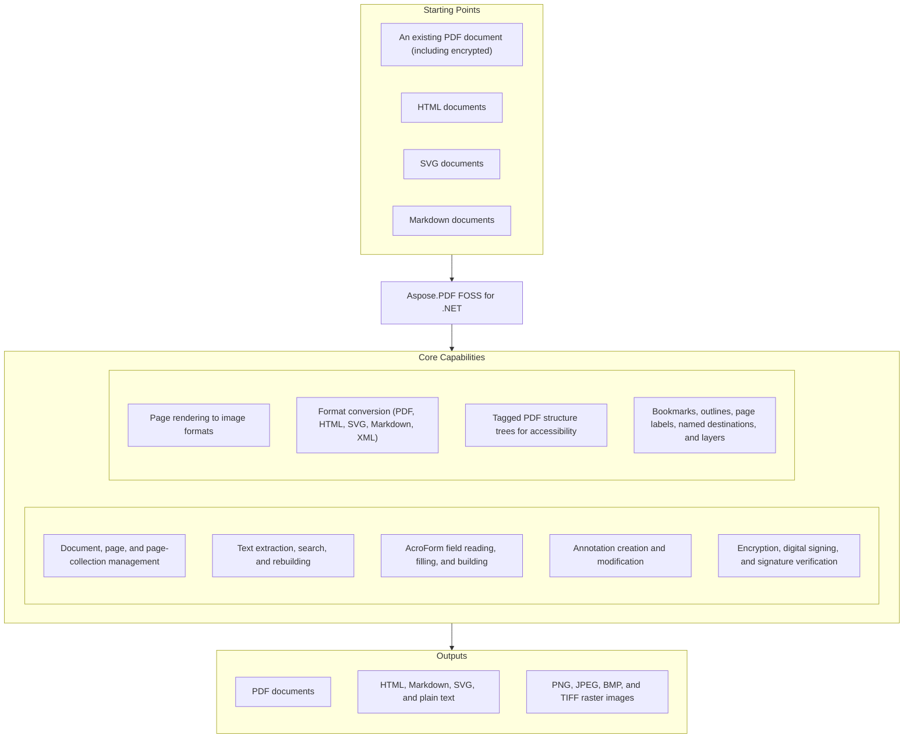

# Aspose.PDF FOSS for .NET

[](https://www.nuget.org/packages/Aspose.Pdf.Foss/) [](https://github.com/aspose-pdf-foss/Aspose.PDF-FOSS-for-.NET/actions/workflows/build.yml) [](LICENSE) [](https://github.com/aspose-pdf-foss/Aspose.PDF-FOSS-for-.NET/graphs/contributors)

[](https://products.aspose.org/pdf/net/)

Aspose.PDF FOSS for .NET is a free, open-source, MIT-licensed PDF library for .NET 8+ — read,
create, modify, and convert PDF documents. It provides an Aspose.PDF-compatible API surface (805
public types) across document core, text, AcroForms, annotations, security, rendering, and format
conversion — a large part of existing Aspose.PDF for .NET code can compile and run unchanged, so
code can usually migrate between the two with minimal changes. This is an early-stage
implementation, and its public API may still change between releases — see
[Scope and limitations](#scope-and-limitations) for the current per-feature breakdown.

## Navigation

- [At a glance](#at-a-glance)
- [Key capabilities](#key-capabilities)
- [Installation](#installation)
- [Quick start](#quick-start)
- [Additional examples](#additional-examples)
- [API reference](#api-reference)
- [Documentation & resources](#documentation--resources)
- [Scope and limitations](#scope-and-limitations)
- [Development and testing](#development-and-testing)
- [License](#license)

## At a Glance



## Key Capabilities

- Open and create PDFs with full round-trip save and incremental save; add, delete, reorder,
  rotate, resize, and copy pages across documents (`Document`, `Page`, `PageCollection`).
- Extract, search, and rebuild text via `TextAbsorber`, `TextFragmentAbsorber`,
  `ParagraphAbsorber`, `TableAbsorber`, and `TextBuilder`/`TextFragment`, with Bidi (RTL) and
  CMap-based decoding support.
- Read, fill, and build AcroForm fields — text, checkbox, radio, choice, button, signature, rich
  text — via `Form`, `Field`, `FormFieldBuilder`, and `FormEditor`.
- Create and modify every standard annotation type (link, text, free-text, highlight, square,
  circle, line, ink, stamp, popup, file attachment, redaction, watermark, rich media, and more)
  through `AnnotationCollection`.
- Encrypt/decrypt with RC4-40/128 and AES-128/256; sign with PKCS#7/CMS detached signatures and
  verify embedded certificates via `PdfFileSignature`.
- Render pages to PNG, JPEG, BMP, TIFF, or SVG through `PngDevice`, `JpegDevice`, `BmpDevice`,
  `TiffDevice`, and `SvgDevice`, with a pluggable `IPageRenderer`.
- Convert PDF to/from HTML, SVG, and Markdown; import from XML (`Document.BindXml`) — XML export
  is not implemented; and export to PDF/A (1A, 1B, 2A, 2B, 2U, 3A, 3B, 3U, 4, 4E, 4F), HTML,
  Markdown, SVG, and plain text.
- Build and read Tagged PDF structure trees (`ITaggedContent`, `/StructTreeRoot`) with 37 typed
  structure elements for accessibility.
- Read and build bookmarks/outlines, page labels (`PageLabel`), and named destinations
  (`NamedDestination`); read and write Optional Content Groups (OCG, i.e. layers) via `Layer`.

## Installation

Install the library from NuGet:

```bash
dotnet add package Aspose.Pdf.Foss --version 26.7.0
```

Requires .NET 8.0 or later — runs on Windows, macOS, and Linux. The only NuGet dependency is
`System.Drawing.Common`, used solely by a few image-interop members (e.g. `ImageDevice.GetBitmap`,
`StampInfo.Image`); it is Windows-only on .NET 8, so those specific members throw
`PlatformNotSupportedException` on Linux/macOS. Everything else — text, forms, parsing,
encryption & signing, and page-to-image rendering via `PngDevice`/`JpegDevice` — is pure-managed
and fully cross-platform. Cryptography in particular has no `System.Security.Cryptography`
runtime dependency; encryption and signing are implemented entirely in managed code.

## Quick Start

Open a PDF and extract text:

```csharp
using Aspose.Pdf;
using Aspose.Pdf.Text;

using var doc = new Document("input.pdf");
var absorber = new TextAbsorber();
absorber.Visit(doc.Pages[1]);
Console.WriteLine(absorber.Text);
```

Create a new PDF:

```csharp
using Aspose.Pdf;
using Aspose.Pdf.Text;

using var doc = new Document();
var page = doc.Pages.Add();

var fragment = new TextFragment("Hello, World!");
fragment.TextState.FontSize = 24;
page.Paragraphs.Add(fragment);

doc.Save("output.pdf");
```

## Additional Examples

A per-feature guide index lives under [`docs/`](docs/) (getting started, text, pages, fonts,
forms, annotations, bookmarks, security, metadata, converters, rendering, optimization, tables,
tagged PDF, and facades). A few more common operations:

### Find and Replace Text

```csharp
using Aspose.Pdf;
using Aspose.Pdf.Text;

using var doc = new Document("input.pdf");
var absorber = new TextFragmentAbsorber("old text");
absorber.Visit(doc);

foreach (var fragment in absorber.TextFragments)
    fragment.Text = "new text";

doc.Save("output.pdf");
```

<details>
<summary>View Additional Examples</summary>

### Fill Form Fields

```csharp
using Aspose.Pdf;

using var doc = new Document("form.pdf");
foreach (var field in doc.Form.Fields)
    Console.WriteLine($"{field.FullName} = {field.Value}");
```

### Encrypt a PDF

```csharp
using Aspose.Pdf;

using var doc = new Document("input.pdf");
doc.Encrypt("user-pw", "owner-pw", Permissions.PrintDocument, CryptoAlgorithm.AESx256);
doc.Save("encrypted.pdf");
```

### Convert HTML to PDF

```csharp
using Aspose.Pdf;

using var doc = new Document("input.html", new HtmlLoadOptions());
doc.Save("output.pdf");
```

### Render a Page to PNG

```csharp
using Aspose.Pdf;
using Aspose.Pdf.Devices;

using var doc = new Document("input.pdf");
var device = new PngDevice(new Resolution(300));
using var stream = File.Create("page1.png");
device.Process(doc.Pages[1], stream);
```

### Sign a PDF

```csharp
using Aspose.Pdf;
using Aspose.Pdf.Facades;
using Aspose.Pdf.Forms;

using var signer = new PdfFileSignature();
signer.BindPdf("input.pdf");
var sig = new PKCS7("my.pfx", "pfx-password");
signer.Sign(1, "reason", "contact", "location", true,
    new System.Drawing.Rectangle(100, 100, 200, 60), sig);
signer.Save("signed.pdf");
```

</details>

## API Reference

`Document` is the central entry point, exposing `Pages` (a `PageCollection` of `Page` objects),
`Form` for AcroForms, and `Outlines` for bookmarks/navigation. The library ships 805 public types
in total; the table below groups the most commonly used ones by area.

<details>
<summary>View Selected API Surface</summary>

### Core API

| Class | Description |
|---|---|
| `BaseOperatorCollection` | Standalone operator-list class — surface mirrors OperatorCollection but is detached from any page. |
| `BuildVersionInfo` | Build and version information for the library. |
| `CollectionItem` | Per-file metadata entries declared by a portfolio /Collection's schema, exposed as a typed dictionary on CollectionItem. |
| `ContentsAppender` | Buffers operators to prepend to / append to a page's content stream. |
| `Document` | Represents a PDF document. |
| `DocumentCollection` | Enumerable collection of `Document` instances; `GetEnumerator()` throws `NotImplementedException` in this edition (see Scope and Limitations). |
| `DocumentInfo` | Represents the document information dictionary. |
| `EmbeddedFileCollection` | Collection of embedded files in a document. |
| `EncryptedPayload` | Wraps the /EP entry on an embedded-file file-spec — the encrypted-payload that signals a PDF 2.0 unencrypted-wrapper document. |
| `EngineDocFacade` | Wrapper providing the small slice of engine-level state callers may set via DOC._engineDoc.X. |
| `ExtGStateValue` | One /ExtGState entry — name plus stroke/fill alpha factors. |
| `FileParams` | Wraps the /Params dict on an embedded-file stream (PDF §7.11.3 Table 46). |
| `FileSpecification` | Represents an embedded file specification (PDF §7.11.3). |
| `Group` | Group / blending colour space dictionary (PDF 32000 §11.6.5). |
| `Image` | Image compositing can be customized using the BlendMode enumeration, which includes common blend operations such as Multiply and Screen. |
| `ImagePlacement` | Represents an image placement found on a PDF page — the position, size, and resolution of an image XObject as it appears on the page (after CTM transformation). |
| `ImagePlacementAbsorber` | Absorbs image placement information from PDF pages. |
| `ImagePlacementCollection` | A collection of ImagePlacement items. |
| `ImageStamp` | Adds an image to a PDF page. |
| `InterruptMonitor` | Cooperative cancellation handle whose `Interrupt()` method is a no-op stub in this edition. |
| `JavaScriptCollection` | Document-level JavaScript scripts (PDF spec §12.6.4.16). |
| `LaunchActionOperationConverter` | Static helper exposing the raw "open"/"print" operation strings used by `LaunchAction` and converting a `LaunchActionOperation` value to its string form. |
| `Layer` | A PDF layer (Optional Content Group) exposed through `Page.Layers`; either freshly constructed and populated via `Contents`, or bound to an existing optional-content group whose visibility, lock state, and contents round-trip through that group. |
| `MergeOptions` | Merge tuning knobs honored by Merge(MergeOptions, Document[]) and friends. |
| `OcspSettings` | OCSP (Online Certificate Status Protocol) settings for the signer's revocation-check / OCSP-stapling path. |
| `Operator-Pdf` | Top-level base for all PDF content-stream operators. |
| `OperatorCollection` | Collection of content stream operators for a page. |
| `Opi` | Open Prepress Interface (OPI) metadata wrapper for an XForm. |
| `OptimizationOptions-Pdf` | Document-scoped alias for OptimizationOptions. |
| `Page` | Represents a page in a PDF document. |
| `PageActionCollection` | Per-page additional actions (PDF 32000 §12.6.3 /AA entries). |
| `PageExtensions` | Extension methods over Page that manipulate the page content stream. |
| `PageInfo` | Container for page dimension and margin properties. |
| `PageResources` | Provides access to a page's resource collections (fonts, images). |
| `PageTransition` | Represents a page transition effect (PDF32000 §12.4.4). |
| `RawOperator` | An unparsed operator token from a content stream — used as a fallback for operators not covered by the typed Operators hierarchy. |
| `RepairOptions` | Options describing what repair is needed. |
| `Resolution` | Represents the resolution (DPI) for device rendering and image placement. |
| `Resources` | Type alias for PageResources, matching the Resources class name. |
| `Stamp-Pdf` | Top-level abstract base for stamps applied to a Page via AddStamp(Stamp). |
| `TextStamp-Pdf` | Compat re-export so code that references Aspose.Pdf.TextStamp (from before the type moved to Aspose.Pdf.Stamps) keep compiling. |
| `TimestampSettings` | RFC 3161 Time-Stamp Authority (TSA) settings consumed by the signer when embedding a timestamp token into the PKCS#7 envelope. |
| `Value` | One typed value pulled out of a CollectionItem dict by TryGet*Value. |
| `WarningInfo` | A single warning raised during load/save: its `WarningType` category and message text, delivered to an `IWarningCallback`. |
| `Watermark` | Watermark applied to a page. |
| `XForm` | Represents a Form XObject (reusable content stream with its own resources). |
| `XFormCollection` | Collection of XForm (Form XObject) resources on a page. |
| `XFormResources` | Resources (fonts, xobjects) on an XForm's stream dict. |

#### Interfaces

| Interface | Description |
|---|---|
| `IDocumentFontUtilities` | Per-document font helper contract — implemented by FontUtilities. |
| `IOperatorSelector` | Visitor interface for Accept(IOperatorSelector). |
| `IWarningCallback` | Callback interface invoked with a `WarningInfo` during load/save, returning a `ReturnAction` (continue/abort) to the caller. |

#### Enumerations

| Enumeration | Description |
|---|---|
| `AFRelationship` | Relationship between an embedded file and the document content that references it (/AFRelationship, PDF 2.0 §7.11.3). |
| `FileEncoding` | Compression / encoding used for the embedded file stream's data (consumed by Encoding). |
| `Fixup` | Pre-defined PDF fixup operations accepted by Stream, bool, object[]). |
| `ImageDeleteAction` | Action taken by Delete(int, ImageDeleteAction) when the image being removed is still referenced from the page content. |
| `ImageFileType` | Recognised image-source file types reported by Image.FileType. |
| `ImageFilterType` | ImageFilterType enum defines the compression filters Jpeg2000, Flate, JPEG, and CCITTFax that can be applied when re‑encoding images. |
| `LaunchActionOperation` | LaunchActionOperation enum defines the operation type for a launch action with values None, Open, and Print. |
| `NoCharacterAction-Pdf` | Action taken when the configured font does not have a glyph for a character in the stamp text. |
| `PasswordType` | Identifies which password (if any) is in effect on an encrypted PDF. |
| `PdfAStandardVersion` | Enum with 12 members. |
| `Permissions` | Permissions.PrintDocument, ModifyContent, ExtractContent, etc., are enum values that can be combined to set document security settings. |
| `PrintScaling` | Enum with 2 members. |
| `ReturnAction` | The ReturnAction enum is used by RichMediaAnnotation.Accept(visitor) to indicate whether the visitor should Continue processing or Abort. |
| `Rotation` | Enum with 5 members. |
| `TabOrder` | Tab order applied to widget annotations on a page (PDF 32000 /Tabs entry). |
| `WarningType` | Categories of warnings emitted during save/load. |

### Actions

| Class | Description |
|---|---|
| `ActionCollection` | Collection of actions associated with an annotation. |
| `GoToAction` | Action that navigates the viewer to an explicit destination, a page, or a named destination within the document (`/GoTo`). |
| `GoToRemoteAction` | Go-to-remote action — jumps to a destination in a different PDF file . |
| `GoToURIAction` | Alias for UriAction, matching the public API name. |
| `ImportDataAction` | An import-data action (/S /ImportData): imports field data from the FDF/XFDF file identified by the action's /F file specification. |
| `JavascriptAction` | Action that carries a JavaScript source string to run when triggered (`/JavaScript`). |
| `LaunchAction` | Action that launches an external file, optionally in a new viewer window (`/Launch`). |
| `NamedAction` | NamedAction.CreateUri(uri) builds a URI action that can be linked to from annotations or form fields. |
| `PdfAction` | Base class for PDF actions. |
| `SubmitFormAction` | Submit-form action — sends form field data to a URL or remote file (PDF 32000-1:2008 §12.7.5.2). |
| `UriAction` | Action that opens a URI when triggered (`/URI`). |

#### Enumerations

| Enumeration | Description |
|---|---|
| `ActionType` | The type of a PDF action. |

### Annotations

| Class | Description |
|---|---|
| `Annotation` | Represents a PDF annotation. |
| `AnnotationActionCollection` | Per-event PDF action slots for a widget annotation (/AA-tree entry shape: 14 named events). |
| `AnnotationCollection` | Collection of annotations on a page. |
| `AnnotationSelector` | Visitor that filters annotations across one or more pages. |
| `AppearanceDictionary` | Appearance-stream dictionary on an annotation (/AP entry): maps appearance-state name -> XForm. |
| `BleedMarkAnnotation` | Printer's bleed-mark annotation placed at a page corner (`/PrinterMark` subtype); position is stored only, not rendered. |
| `Border` | Represents the border of an annotation or field widget. |
| `CaretAnnotation` | Markup annotation showing where text or graphics have been inserted (`/Caret`). |
| `Characteristics` | Annotation characteristics (border, rotation, etc.). |
| `CircleAnnotation` | Elliptical markup annotation inscribed within its bounding rectangle (`/Circle`). |
| `ColorBarAnnotation` | The ColorBarAnnotation constructor creates a color‑bar annotation on a page by specifying the page, rectangle and a CMYK color selector. |
| `CommonFigureAnnotation` | Common base for square and circle annotations — a figure drawn inside a rectangle, optionally inset by /RD (PDF 32000 §12.5.6.8). |
| `Dash` | Represents a dash pattern for borders. |
| `DefaultAppearance` | Represents the default appearance of a free text annotation. |
| `DocumentActionCollection` | Document-level /AA additional-action dictionary (PDF 32000-1 §12.6.3 Table 195). |
| `ExplicitDestination` | Represents an explicit destination in a PDF document (e.g. `[page /Fit]`, `[page /XYZ left top zoom]`). |
| `FieldDateTimeFormatter` | Formats a date/time value string according to an Acrobat-style date format. |
| `FieldNumberCurrencyFormatter` | Formats a numeric string as a currency value. |
| `FieldNumberPercentFormatter` | Formats a numeric string as a percentage (multiplies by 100 first). |
| `FileAttachmentAnnotation` | Represents a file attachment annotation. |
| `FitBExplicitDestination` | Fit-bounding-box destination (/FitB). |
| `FitBHExplicitDestination` | FitBH destination (/FitBH) — fit bounding box horizontally at Top. |
| `FitBVExplicitDestination` | FitBV destination (/FitBV) — fit bounding box vertically at Left. |
| `FitExplicitDestination` | Fit-the-page destination (/Fit). |
| `FitHExplicitDestination` | Fit horizontally at /Top (/FitH). |
| `FitRExplicitDestination` | FitR rectangle destination (/FitR). |
| `FitVExplicitDestination` | Fit vertically at /Left (/FitV). |
| `FixedPrint` | Print-scaling metadata for a rich-media/screen annotation appearance: a transform `Matrix` plus horizontal/vertical translation. |
| `FreeTextAnnotation` | Markup annotation that displays text directly on the page without a separate popup window (`/FreeText`). |
| `GenericAnnotation` | Fallback annotation class for annotation subtypes that have no dedicated model (e.g. vendor-specific subtypes such as /BatesN); round-trips its dictionary unchanged and exposes the common annotation surface (rectangle, colour, appearance, flags) inherited from Annotation. |
| `HighlightAnnotation` | Highlight text markup annotation. |
| `InkAnnotation` | Markup annotation representing one or more freehand "ink" strokes (`/Ink`). |
| `LineAnnotation` | Markup annotation drawing a straight line between two points, with optional line-ending styles (`/Line`). |
| `LinkAnnotation` | Annotation representing a clickable hyperlink region on a page (`/Link`). |
| `MarkupAnnotation` | Common base for annotations that support a title, subject, reply thread, and popup window (e.g. highlight, ink, line, stamp, text). |
| `Measure` | Measure-units metadata attached to a LineAnnotation (PDF 32000 §12.5.6.13 measure dictionaries). |
| `MediaClip` | A media clip object (PDF §13.2.4) — the actual media data or section thereof; abstract base for `MediaClipData` and `MediaClipSection`. |
| `MediaClipData` | A media clip data object (PDF §13.2.4.2) — full media data via a file specification. |
| `MediaClipSection` | A media clip section object (PDF §13.2.4.3) — a temporal section of another clip. |
| `MediaRendition` | A media rendition (PDF §13.2.3.2) — pairs a `MediaClip` with playback parameters. |
| `MovieAnnotation` | Annotation that plays a movie file when activated (`/Movie`). |
| `NumberFormat` | One number-format entry — describes how a measurement value is rendered (precision, separators, before/after text). |
| `NumberFormatList` | Nested number-format list (Measure+NumberFormatList). |
| `PDF3DAnnotation` | Annotation embedding interactive 3D artwork (`/3D`); exposes the artwork/activation surface (see Scope and Limitations for rendering support). |
| `PDF3DArtwork` | A 3D artwork dictionary referenced by a PDF 3D annotation. |
| `PDF3DContent` | Embedded-stream content for a 3D artwork (U3D or PRC). |
| `PDF3DCrossSection` | Single cross-section through a PDF 3D model. |
| `PDF3DCrossSectionArray` | Ordered collection of PDF3DCrossSection entries applied to a PDF 3D view. |
| `PDF3DCuttingPlaneOrientation` | Orientation angles for the cutting plane of a 3D cross-section. |
| `PDF3DLightingScheme` | Lighting scheme applied to a PDF 3D artwork. |
| `PDF3DRenderMode` | Render mode applied to a 3D artwork view. |
| `PDF3DStream` | PDF /3DD stream wrapper — pairs a PDF3DArtwork with its document-owned content stream. |
| `PDF3DView` | Camera + render-state snapshot of a 3D artwork. |
| `PDF3DViewArray` | Indexed collection of PDF3DView snapshots. |
| `PageInformationAnnotation` | Printer-mark annotation that renders the source file name and page metadata onto the page at save time (`/PrinterMark` subtype). |
| `PdfActionCollection` | Collection of PdfAction entries attached to an annotation (or any other action-bearing PDF object). |
| `PolyAnnotation` | Common base for polygon and polyline annotations — a chain of connected vertices (PDF 32000 §12.5.6.9). |
| `PolygonAnnotation` | Markup annotation drawing a closed multi-sided shape (`/Polygon`). |
| `PolylineAnnotation` | Markup annotation drawing an open multi-segment line (`/PolyLine`). |
| `PopupAnnotation` | Popup-window annotation associated with a markup annotation's comment (`/Popup`). |
| `PrinterMarkAnnotation` | Aggregate printer's-mark generator combining bleed/trim/registration/colour-bar marks on a page. |
| `RedactAnnotation` | Backward-compatible alias for RedactionAnnotation. |
| `RedactionAnnotation` | Represents a redaction annotation. |
| `RegistrationMarkAnnotation` | Printer's registration-mark annotation placed at a page side (`/PrinterMark` subtype); position is stored only. |
| `Rendition` | A rendition object (PDF §13.2.3) — describes a media object to be played by a rendition action. |
| `RenditionAction` | A rendition action (PDF §12.6.4.14) — controls the playing of multimedia content. |
| `RichMediaAnnotation` | Annotation embedding rich media (video/Flash/3D) content (`/RichMedia`). |
| `RichTextToFlatStructureTransformer` | Transforms rich text annotation content (XHTML with arbitrarily nested spans) into a flat structure where every leaf text node becomes a single &lt;span style="."&gt; with the fully-merged CSS from all ancestor elements. |
| `ScreenAnnotation` | The ScreenAnnotation class lets you add a screen annotation to a page by providing the page, rectangle, and media file, and exposes AnnotationType, Action, and Title properties. |
| `SelectorRendition` | A selector rendition (PDF §13.2.3.3) — chooses among alternative renditions. |
| `SoundAnnotation` | Annotation that plays an embedded sound when activated (`/Sound`), backed by a `SoundData` sample. |
| `SoundData` | Raw audio sample data (bits per channel, channel count, sample rate, encoding) embedded in a `SoundAnnotation`. |
| `SoundSampleData` | SoundSampleData constructors allow specifying samplingRate alone or together with numberOfSoundChannels, bitsPerChannel, and SoundSampleDataEncodingFormat. |
| `SquareAnnotation` | The SquareAnnotation.Accept(visitor) method implements the visitor pattern, allowing custom processing of annotation objects. |
| `SquigglyAnnotation` | Squiggly text markup annotation. |
| `StampAnnotation` | Markup annotation displaying a rubber-stamp icon or custom appearance (`/Stamp`). |
| `StrikeOutAnnotation` | StrikeOut text markup annotation. |
| `TextAnnotation` | "Sticky note" markup annotation shown as an icon that opens a popup with its text (`/Text`). |
| `TextMarkupAnnotation` | Base class for the text-markup annotations (Highlight, Underline, StrikeOut, Squiggly) — those whose geometry is a set of QuadPoints over page text. |
| `TextStyle` | Bundled font / colour / alignment style applied to a free-text annotation's rich text. |
| `TrimMarkAnnotation` | Printer's trim-mark annotation placed at a page corner (`/PrinterMark` subtype); position is stored only. |
| `UnderlineAnnotation` | Underline text markup annotation. |
| `WatermarkAnnotation` | Represents a watermark annotation that can be added to a PDF page. |
| `WidgetAnnotation` | Annotation representing an interactive form field's on-page appearance (`/Widget`). |
| `XYZExplicitDestination` | XYZ explicit destination: display the page at position (left, top) with zoom factor. |

#### Interfaces

| Interface | Description |
|---|---|
| `IAppointment` | Marker interface for any object that can be stored in an outline item's Destination, a link annotation's Destination, Document.OpenAction, or a named-destination collection. |

#### Enumerations

| Enumeration | Description |
|---|---|
| `ActivationEvent` | Enum with 3 members. |
| `AnnotationFlags` | Annotation flags as defined in PDF spec Table 165. |
| `AnnotationState` | Review or marked-state of a markup annotation, as defined by PDF 32000 §12.5.6.3 (text annotations, /StateModel + /State entries). |
| `AnnotationStateModel` | Which state model a AnnotationState belongs to. |
| `AnnotationType` | Annotation subtype as defined in PDF spec Table 169. |
| `BorderEffect` | Border effect applied to annotations. |
| `BorderStyle` | Border style for annotations and fields. |
| `CapStyle` | Cap style used by ink strokes (free-hand drawings). |
| `CaptionPosition` | Caption-position within a LineAnnotation. |
| `CaretSymbol` | Caret-symbol style for CaretAnnotation. |
| `ColorsOfCMYK` | CMYK channel selector used by ColorBarAnnotation. |
| `ContentType` | Enum with 3 members. |
| `ExplicitDestinationType` | Explicit destination type, mirroring PDF 32000 §12.3.2.2 names. |
| `FileIcon` | Named-icon style for FileAttachmentAnnotation (/Name entry). |
| `FractionStyle` | How fractional values are rendered (decimal / fraction / round / truncate). |
| `FreeTextIntent` | Intent (sub-purpose) of a free-text annotation. |
| `HighlightingMode` | Highlighting mode for link annotations. |
| `Justification` | Justification of a free-text annotation's content. |
| `LightingSchemeType` | Lighting-scheme nominal type (PDF 32000-1 §13.6.4). |
| `LineEnding` | Line annotation ending styles (/LE entry elements). |
| `LineIntent` | Line annotation intents (/IT entry). |
| `PDF3DActivation` | How the embedded 3D model becomes active (PDF 32000-1 §13.6.2, AAS entry of the 3D activation dictionary). |
| `PolyIntent` | Intent of a polygon or polyline annotation (/IT entry). |
| `PredefinedAction` | Named viewer commands targeted by a NamedAction (PDF 32000 §12.6.4.11). |
| `PrinterMarkCornerPosition` | Corner a printer-mark annotation sits in (used by bleed-/trim-marks). |
| `PrinterMarkSidePosition` | Side a printer-mark annotation sits on. |
| `PrinterMarksKind` | The set of printer's-mark families AddPrinterMarks generates on a page (PDF 32000 pre-press marks). |
| `RenderModeType` | Render-mode nominal type (PDF 32000-1 §13.6.5). |
| `ReplyType` | Reply-relationship between a markup annotation and its InReplyTo target. |
| `RichTextFontStyles` | Rich-text run styles applied via Color). |
| `SoundEncoding` | Enum with 4 members. |
| `SoundIcon` | Enum with 2 members. |
| `SoundSampleDataEncodingFormat` | SoundSampleDataEncodingFormat enum defines the supported audio encodings: Raw, Signed, muLaw, and ALaw. |
| `StampIcon` | Named stamp-icon style for StampAnnotation (/Name entry, PDF 32000 §12.5.6.14). |
| `TextAlignment` | Horizontal text alignment for annotation text boxes. |
| `TextIcon` | Named-icon style for TextAnnotation (PDF 32000 §12.5.6.4 /Name entries). |

### Artifacts

| Class | Description |
|---|---|
| `Artifact` | Represents a PDF artifact — a marked content sequence tagged as /Artifact (PDF 32000 §14.8.2.2). |
| `ArtifactCollection` | Collection of artifacts on a page. |
| `BackgroundArtifact` | Represents a background artifact (image painted behind page content). |
| `HeaderArtifact` | Represents a header artifact — a page-level running head tagged Artifact /Subtype /Header (PDF 32000 §14.8.2.2). |
| `WatermarkArtifact` | Represents a watermark artifact that can be added to a PDF page. |

#### Enumerations

| Enumeration | Description |
|---|---|
| `ArtifactSubtype` | Enumerates artifact subtypes. |
| `ArtifactType` | Enumerates artifact types as defined by PDF 32000 §14.8.2.2. |

### Collections

| Class | Description |
|---|---|
| `Collection` | PDF Portfolio collection. |
| `CollectionField` | One column in a PDF Portfolio's collection schema (PDF spec §7.11.5 Table 75). |
| `CollectionSchema` | Schema of a PDF Portfolio collection (PDF spec §7.11.5 Table 74). |
| `ImageCollection` | Collection of image XObjects on a page. |
| `ImageXObject` | Represents an image XObject found in a PDF page's resources. |
| `PageCollection` | Collection of pages in a PDF document. |
| `XImage` | Image XObject wrapper exposing the XImage public surface. |
| `XImageCollection` | Collection of image XObjects on a page, with XImage-typed accessors and editing helpers. |

#### Enumerations

| Enumeration | Description |
|---|---|
| `CollectionFieldSubtype` | Predefined collection field subtypes (PDF spec §7.11.5 Table 75). |

### Color

| Class | Description |
|---|---|
| `Color-Pdf` | Represents a color value used in PDF documents. |

#### Enumerations

| Enumeration | Description |
|---|---|
| `ColorSpace` | Top-level device colour-space selector. |
| `ColorType` | Represents the color type of a page. |

### Comparison

| Class | Description |
|---|---|
| `DiffOperation` | A single edit produced when diffing two texts: an `Operation` (Equal / Delete / Insert) together with the run of text it applies to. |
| `DiffUtils` | Text helpers used by the diff engine: common prefix/suffix extraction and re-assembly of the source / destination text from a list of `DiffOperation`s. |
| `MergingOptimizer` | Semantic clean-up pass: eliminates equalities that are no larger than the edits surrounding them (folding those short common runs back into the adjacent delete/insert), then re-merges the result into canonical form. |
| `OperationsMerger` | Merges a diff into its canonical minimal form: coalesces adjacent runs of the same operation, and for a mixed delete/insert run factors any common prefix into the preceding equality and any common suffix into the following equality. |
| `OperationsSlideMerger` | Shifts a single edit that is surrounded on both sides by equalities sideways to eliminate one of those equalities, canonicalising the diff. |

#### Interfaces

| Interface | Description |
|---|---|
| `IDiffOptimizationOperation` | A post-processing pass that normalises a diff — a mutable list of `DiffOperation`s — in place, preserving the source and destination texts while producing a cleaner or more canonical sequence of edits. |

#### Enumerations

| Enumeration | Description |
|---|---|
| `EditOperationsOrder` | When a delete and an insert are emitted for the same position, which one an optimizer places first in the resulting operation sequence. |
| `Operation` | The kind of edit a `DiffOperation` represents when diffing two texts: a run that is unchanged, deleted from the source, or inserted in the destination. |

### Content

| Class | Description |
|---|---|
| `BDC` | BDC — Begin marked content with properties. |
| `BI` | BI — Begin inline-image object. |
| `BMC` | BMC — Begin marked-content sequence (no properties). |
| `BT` | BT — Begin text object. |
| `BX` | BX — Begin compatibility section. |
| `BasicSetColorAndPatternOperator` | Common base for SCN/scn (basic color or pattern). |
| `BasicSetColorOperator` | Common base for the rg/RG/g/G/k/K family. |
| `BlockTextOperator` | Common base for the BT / ET delimiters. |
| `Clip` | W — Set clipping path (nonzero winding rule). |
| `ClosePath` | h — Close subpath. |
| `ClosePathEOFillStroke` | b* — Close, fill, and stroke path (even-odd rule). |
| `ClosePathFillStroke` | b — Close, fill, and stroke path (nonzero winding rule). |
| `ClosePathStroke` | s — Close and stroke path. |
| `ConcatenateMatrix` | cm — Concatenate matrix to CTM. |
| `ContentStreamBuilder` | Builds PDF content stream bytes using the operator syntax from PDF32000 §8-9. |
| `CurveTo` | c — Append cubic Bézier curve with three control points. |
| `CurveTo1` | v — Append cubic Bézier curve; first control point is current point. |
| `CurveTo2` | y — Append cubic Bézier curve; second control point coincides with final point. |
| `DP` | DP — Designate marked-content point with property list. |
| `Do` | Do — Invoke named XObject. |
| `EI` | EI — End inline-image object. |
| `EMC` | EMC — End marked content. |
| `EOClip` | W* — Set clipping path (even-odd rule). |
| `EOFill` | f* — Fill path (even-odd rule). |
| `EOFillStroke` | B* — Fill and stroke path (even-odd rule). |
| `ET` | ET — End text object. |
| `EX` | EX — End compatibility section. |
| `EndPath` | n — End path without filling or stroking. |
| `ExtGState` | Represents an Extended Graphics State dictionary (PDF32000 §8.4.5). |
| `ExtractedPath` | Represents a complete path with its painting mode and color. |
| `Fill` | f — Fill path (nonzero winding rule). |
| `FillStroke` | B — Fill and stroke path (nonzero winding rule). |
| `GRestore` | Q — Restore graphics state. |
| `GS` | gs — Set parameters from named ExtGState resource. |
| `GSave` | q — Save graphics state. |
| `GlyphPosition` | One element of a TJ-style glyph-position array: a string with an optional preceding/following position adjustment (in 1/1000 text units). |
| `GraphicsState` | Tracks the PDF graphics state during content stream parsing (PDF32000 §8.4). |
| `ID-Operators` | ID — Begin image data (after the inline-image dictionary). |
| `LineTo` | l — Append straight line segment to (X, Y). |
| `MP` | MP — Designate marked-content point (no properties). |
| `MoveTextPosition` | Td — Move text position: translate text origin by (X, Y). |
| `MoveTextPositionSetLeading` | TD — Move text position and set leading: translate by (X, Y) and set leading to -Y. |
| `MoveTo` | m — Begin new subpath at (X, Y). |
| `MoveToNextLine` | T* — Move to next line using current leading. |
| `MoveToNextLineShowText` | ' — Move to next line and show text. |
| `ObsoleteFill` | F — Fill path (deprecated; equivalent to f). |
| `Operator-Operators` | Back-compat alias for Operator kept so existing using Aspose.Pdf.Operators; code and the concrete operator subclasses (GSave, BT, ET, …) in this namespace continue to bind. |
| `OperatorSelector` | Visitor that filters content-stream operators by concrete type. |
| `PathExtractor` | Extracts vector paths from PDF page content streams. |
| `PathSegment` | Represents a segment of a path. |
| `Re` | re — Append rectangle (X, Y, Width, Height) as a complete subpath. |
| `SelectFont` | Tf — Select font and size. |
| `SetAdvancedColor` | scn — Set color (with optional pattern name) in current color space (non-stroking). |
| `SetAdvancedColorStroke` | SCN — Set color (with optional pattern name) in current color space (stroking). |
| `SetCMYKColor` | k — Set CMYK fill color. |
| `SetCMYKColorStroke` | K — Set CMYK stroke color. |
| `SetCharWidth` | d0 — Set glyph width in a Type 3 font. |
| `SetCharWidthBoundingBox` | d1 — Set glyph width and bounding box in a Type 3 font. |
| `SetCharacterSpacing` | Tc — Set character spacing. |
| `SetColor` | sc — Set color in current color space (non-stroking). |
| `SetColorOperator` | Common base for the SC/SCN/sc/scn family. |
| `SetColorRenderingIntent` | ri — Set color rendering intent. |
| `SetColorSpace` | cs — Set color space for non-stroking operations. |
| `SetColorSpaceStroke` | CS — Set color space for stroking operations. |
| `SetColorStroke` | SC — Set color in current color space (stroking). |
| `SetDash` | d — Set dash pattern. |
| `SetFlat` | i — Set flatness tolerance. |
| `SetGlyphsPositionShowText` | TJ — Show text with individual glyph positioning (array of strings and numeric adjustments). |
| `SetGray` | g — Set gray fill color. |
| `SetGrayStroke` | G — Set gray stroke color. |
| `SetHorizontalTextScaling` | Tz — Set horizontal text scaling. |
| `SetLineCap` | J — Set line cap style. |
| `SetLineJoin` | j — Set line join style. |
| `SetLineWidth` | w — Set line width. |
| `SetMiterLimit` | M — Set miter limit. |
| `SetRGBColor` | rg — Set RGB fill color. |
| `SetRGBColorStroke` | RG — Set RGB stroke color. |
| `SetSpacingMoveToNextLineShowText` | " — Set word/char spacing, move to next line, and show text. |
| `SetTextLeading` | TL — Set text leading. |
| `SetTextMatrix` | Tm — Set text matrix. |
| `SetTextRenderingMode` | Tr — Set text rendering mode. |
| `SetTextRise` | Ts — Set text rise. |
| `SetWordSpacing` | Tw — Set word spacing. |
| `ShFill` | sh — Paint shading specified by named resource. |
| `ShowText` | Tj — Show text string. |
| `Stroke` | S — Stroke path. |
| `TextOperator` | Common base for all text-related operators (BT/ET, Tx state, text-show, text-place). |
| `TextPlaceOperator` | Common base for text-positioning operators (Td, TD, T*, Tm). |
| `TextShowOperator` | Common base for text-showing operators (Tj, TJ, ', "). |
| `TextStateOperator` | Common base for text-state operators (Tc, Tw, Tz, TL, Tf, Tr, Ts). |

#### Structs

| Struct | Description |
|---|---|
| `PathCommand` | A single path construction command with coordinates. |

#### Enumerations

| Enumeration | Description |
|---|---|
| `LineCap` | Line cap style. |
| `LineJoin` | Line join style. |
| `PathOp` | Path construction operator type. |
| `PathOperationType` | Represents a type of path operation. |
| `PathPaintMode` | Represents a single path painting operation. |

### Converters

| Class | Description |
|---|---|
| `MarkdownConverterOptions` | Options for PDF-to-Markdown conversion. |
| `MdLoadOptions` | Options for loading Markdown files as PDF documents. |
| `PageSizeInfo` | Page size configuration for document loading. |
| `PdfToHtmlConverter` | Converts PDF pages to HTML markup. |
| `PdfToMarkdownConverter` | Converts PDF pages to Markdown text. |
| `PdfToSvgConverter` | Converts PDF pages to SVG format. |
| `PdfToTextConverter` | Converts PDF pages to plain text. |
| `SvgLoadOptions` | Options for loading SVG files as PDF documents. |
| `TxtLoadOptions` | Options for loading a plain-text (.txt) file as a PDF document. |

#### Enumerations

| Enumeration | Description |
|---|---|
| `ConversionEngines` | Available conversion engines. |

### Devices

| Class | Description |
|---|---|
| `BmpDevice` | Renders PDF document pages into BMP image format. |
| `DocumentDevice` | Abstract base for whole-document rendering devices. |
| `GdiPlusPageRenderer` | PDF page renderer that rasterizes through GDI+ (Graphics). |
| `GifDevice` | Renders PDF document pages into GIF image format. |
| `ImageDevice` | Abstract base class for image rendering devices (PNG, JPEG, BMP, TIFF). |
| `ImagePageDevice` | Default PageDevice that delegates to any ImageDevice — PngDevice / JpegDevice / BmpDevice / TiffDevice. |
| `IndexBitmapConverter` | Abstract base class for converting rendered images to indexed (1/4/8bpp) bitmaps. |
| `JpegDevice` | Renders PDF document pages into JPEG image format. |
| `Margins` | Page margins in points for TIFF rendering. |
| `PageDevice` | Abstract base for single-page rendering devices. |
| `PageSize-Devices` | Represents a physical page size in points. |
| `PdfDocumentDevice` | Default DocumentDevice implementation that saves the document as a PDF (Document.Save round-trip). |
| `PngDevice` | Renders PDF document pages into PNG image format. |
| `RgbaBuffer` | Raw RGBA pixel buffer returned by a IPageRenderer. |
| `SoftwarePageRenderer` | Built-in software PDF page renderer. |
| `SvgDevice` | Converts a PDF page to SVG markup. |
| `TextDevice` | Extracts text from PDF pages. |
| `TiffDevice` | Renders PDF document pages into TIFF image format. |
| `TiffSettings` | Settings for TIFF image generation (color depth, compression). |

#### Interfaces

| Interface | Description |
|---|---|
| `IPageRenderer` | Renders a PDF page to an RGBA pixel buffer. |

#### Enumerations

| Enumeration | Description |
|---|---|
| `ColorDepth` | Color depth options for TIFF encoding. |
| `CompressionType` | TIFF compression algorithm options. |
| `FormPresentationMode` | How form fields are rendered (canonical Production / Editor split). |
| `PageCoordinateType` | Which page-box the rendered image extents come from. |
| `ShapeType` | Shape type for TIFF rendering. |

### Drawing

| Class | Description |
|---|---|
| `Arc` | An arc shape (portion of an ellipse). |
| `Circle` | A circle shape. |
| `Color-Drawing` | Color for drawing shapes. |
| `Curve` | A Bézier curve shape. |
| `DrawingPath` | A path shape composed of move, line, and curve segments. |
| `DrawingRectangle` | A rectangle shape. |
| `Ellipse` | An ellipse shape. |
| `GradientAxialShading` | Defines a linear (axial) gradient between two colors for use as a fill pattern. |
| `Graph` | A graph container that holds drawable shapes and renders them to a content stream. |
| `Line` | A line shape. |
| `PatternColorSpace` | Pattern colour-space marker. |
| `Point-Drawing` | A 2D point (x, y). |
| `Polygon` | A polygon shape (closed path with arbitrary vertices). |
| `Rectangle-Drawing` | A rectangle shape in the Drawing namespace (distinct from Aspose.Pdf.Rectangle which is a page rectangle). |
| `Shape` | Base class for drawable shapes. |

#### Enumerations

| Enumeration | Description |
|---|---|
| `ImageFormat` | Specifies the encoding format of an image. |

### Enums

| Enumeration | Description |
|---|---|
| `Direction` | Predominant text-flow direction recorded in the viewer-preferences dictionary. |
| `ExtendedBoolean` | A tri-state Boolean — True/False plus an Undefined sentinel used at deserialization time when a value isn't carried on the PDF dictionary entry. |
| `FieldValueType` | Logical value type carried by a CollectionField. |
| `HorizontalAlignment` | Describes horizontal alignment. |
| `Id` | Pair of byte strings that make up the /ID array in the PDF trailer. |
| `PageLayout` | Page-layout entry written to the catalog (PDF32000 Table 28). |
| `PageMode` | Page-mode entry written to the catalog (PDF32000 Table 28). |
| `PdfVersion` | PDF specification version targeted by the document header. |
| `PrintDuplex` | Print-duplex value recorded in viewer preferences (PDF32000 Table 150). |
| `VerticalAlignment` | Describes vertical alignment. |

### Exceptions

| Class | Description |
|---|---|
| `CrashReportOptions` | Configures crash-report emission for GenerateCrashReport. |
| `FontNotFoundException` | Thrown when a requested font cannot be located (no system font with that name, no matching custom-font source, etc.). |
| `IncorrectFontUsageException` | Thrown during text extraction when the content stream issues a text-showing operator (Tj/TJ/'/") while no font is set in the current graphics state — i.e. no preceding `Tf` is in effect (the document is malformed); tolerated when `TextSearchOptions.IgnoreResourceFontErrors` is set. |
| `InvalidFormTypeOperationException` | Thrown when an operation is attempted on the wrong form type (e.g. an XFA-only operation on an AcroForm, or vice versa). |
| `InvalidPasswordException` | Thrown when a password-protected operation is attempted without supplying a valid password (e.g. reading `HasEditPassword` on an encrypted PDF whose open password has not been provided). |
| `InvalidPdfFileFormatException` | Thrown when a stream cannot be opened as a PDF (bad header, truncated file, or otherwise unrecognisable as PDF). |
| `PdfException` | Represents errors that occur during PDF application execution. |
| `PdfExceptionMessages` | Centralised message strings surfaced by the library's exceptions and security diagnostics. |
| `PdfTextDecodingException` | Thrown when text content cannot be decoded — e.g. a show-string references character codes a font's encoding/CMap can't map to Unicode, so the run can't be extracted or edited. |
| `UnsupportedFontTypeException` | Thrown when a file cannot be opened as a font because its format is not a supported font program (e.g. an Adobe Font Metrics file supplied on its own, with no accompanying outline data). |
| `ValidationIssue` | Represents a validation issue found in a PDF document. |

### Facades

| Class | Description |
|---|---|
| `AlignmentType` | Horizontal-alignment selector for legacy facade APIs (e.g. `PdfPageEditor`); a type-safe enum whose only valid values are `Left`, `Center`, `Right` -- superseded by `HorizontalAlignment`. |
| `AutoFiller` | Repeatedly stamps a template PDF with rows from a DataTable: for each row, fills the form fields whose names match column names, flattens (except those listed in UnFlattenFields), and appends the resulting pages to the output. |
| `BDCProperties` | Properties for a BDC / DP marked-content operator (/MCID and /Lang). |
| `Bookmark` | A single bookmark extracted from a document's outline tree by ExtractBookmarks(). |
| `Bookmarks` | An ordered, indexable collection of Bookmark entries returned by ExtractBookmarks(). |
| `ContentsResizeParameters` | Parameters for ResizeContents describing margins, content size, and whether the page media box should change to match. |
| `ContentsResizeValue` | Represents a content-resize value. |
| `CorruptedItem` | One file the Concatenate path could not parse — recorded only when CorruptedFileAction is set to skip-and-continue. |
| `DocumentPrivilege` | Represents document access permissions (P value in encryption dictionary). |
| `FontColor` | Represents a font color using RGB components. |
| `Form-Facades` | Facade for form field manipulation including XML import/export. |
| `FormDataConverter` | Bridges PDF form-data formats (FDF / XFDF / XML) with DataTable and direct stream-to-stream transforms. |
| `FormEditor` | Facade for form operations: fill fields, flatten forms, import/export data. |
| `FormFieldFacade` | Represents the visual appearance attributes of a form field. |
| `FormImportResult` | Per-field result of a form-data import operation. |
| `FormattedText` | Represents formatted text used in stamp and mend operations. |
| `FormattedTextFont` | Represents a font reference returned by FormattedText.getFont(). |
| `LineInfo` | Line drawing parameters for PdfContentEditor.DrawCurve. |
| `PageBreak` | Describes a single horizontal cut on a source page: PageNumber (1-based) identifies the page in the source document, Position the PDF y-coordinate where the page is split. |
| `PdfAnnotationEditor` | Facade for annotation manipulation: import/export XFDF, delete, flatten, redact. |
| `PdfBookmarkEditor` | Facade for bookmark (outline) manipulation: create, extract, delete bookmarks. |
| `PdfContentEditor` | Facade for content-level editing: text replacement, link creation, image operations. |
| `PdfConverter` | Facade for converting PDF pages to images. |
| `PdfExtractor` | Facade for extracting text and images from a PDF document. |
| `PdfFileEditor` | Real-only additions to PdfFileEditor: exception-handling state, Try* wrappers around the existing working methods, and MemoryStream/file overloads for SplitToBulks/SplitToPages that wrap the real byte[] implementations already present in PdfFileEditor.cs. |
| `PdfFileInfo` | Facade for accessing PDF document metadata and properties. |
| `PdfFileMend` | Facade for adding text and images to existing PDF documents. |
| `PdfFileSecurity` | Facade for encrypting, decrypting, and changing passwords on PDF files. |
| `PdfFileSignature` | Facade for signing and reading digital signatures in PDF documents. |
| `PdfFileStamp` | Facade for adding stamps, page numbers, headers, footers, and watermarks. |
| `PdfJavaScriptStripper` | Removes all JavaScript from a PDF document. |
| `PdfPageEditor` | Facade for page-level editing: rotation, resizing, margin adjustment, and page box manipulation (CropBox, TrimBox, BleedBox, ArtBox). |
| `PdfPrintPageInfo` | Per-page info (page number) passed to a `PdfQueryPageSettingsEventHandler` during printing. |
| `PdfViewer` | Façade for viewing / printing a PDF document. |
| `PdfXmpMetadata` | Dictionary-style facade over a PDF document's XMP metadata stream. |
| `RenderingOptions-Facades` | Rendering options used by PdfConverter and other facade classes. |
| `ReplaceTextStrategy` | Configures how ReplaceText(string, string) matches and substitutes text via editor.ReplaceTextStrategy.IsRegularExpressionUsed / editor.ReplaceTextStrategy.ReplaceScope. |
| `SignatureName` | Identifies a signature field by both its partial name (Name) and full hierarchical name (FullName), and reports whether the field currently carries a signature value via HasSignature. |
| `Stamp-Facades` | Represents a stamp to be applied via PdfFileStamp facade. |
| `StampInfo` | Contains information about a stamp on a page. |
| `TextProperties` | Text-display properties consumed by the *TextOperator family. |
| `VerticalAlignmentType` | Vertical-alignment selector for legacy facade APIs (e.g. `PdfPageEditor`); a type-safe enum whose only valid values are `Top`, `Center`, `Bottom` -- superseded by `VerticalAlignment`. |
| `ViewerPreference` | Bag of const int bit-flags describing viewer preferences (page mode, page layout, fullscreen behaviour, duplex, print scaling, reading direction). |

#### Interfaces

| Interface | Description |
|---|---|
| `IFacade` | Base contract for the legacy Facades API: bind a source document (`Document`, file path, or `Stream`) and `Close()` it. |
| `ISaveableFacade` | `IFacade` extended with `Save` overloads to a file path or `Stream`. |

#### Enumerations

| Enumeration | Description |
|---|---|
| `Algorithm` | Encryption algorithm family used by PdfFileSecurity. |
| `AutoRotateMode` | Auto-rotation behaviour for the PDF viewer. |
| `BlendingColorSpace` | Blend-mode colour-space hint passed to a Stamp. |
| `ConcatenateCorruptedFileAction` | How the facade reacts to corrupted input during Concatenate. |
| `DataType` | Form-data source / destination kind consumed by FormDataConverter. |
| `DefaultMetadataProperties` | Well-known XMP-basic-schema property keys exposed by PdfXmpMetadata as a typed alternative to raw "xmp:&lt;name&gt;" strings. |
| `EncodingType` | Encoding type enumeration for FormattedText. |
| `ExtractImageMode` | Image extraction mode — matches docs.aspose.com Aspose.Pdf.ExtractImageMode. |
| `ExtractTextMode` | Text extraction mode — matches docs.aspose.com "Pure" (0) / "Raw" (1). |
| `FieldType-Facades` | The type of an AcroForm field, as used by AddField and related facade operations. |
| `FontStyle` | Font style enumeration for FormattedText. |
| `ImageMergeMode` | Layout strategy used by MergeImages when combining multiple input images into a single output image. |
| `ImportStatus` | Outcome of importing a single field's value. |
| `KeySize` | Key strength selector paired with Algorithm to pick the concrete RC4/AES variant used by PdfFileSecurity. |
| `NoCharacterAction-Facades` | What to do when the replacement font lacks a glyph for a character. |
| `PdfConverterImageFormat` | Image format for PdfConverter output. |
| `PositioningMode` | Text positioning mode for PdfFileMend. |
| `PropertyFlag` | Attribute flags applied to a form field via SetFieldAttribute. |
| `Scope-Facades` | How many matches to replace per call. |
| `StampType` | Stamp kind exposed by StampInfo. |
| `SubmitFormFlag` | Format of the data posted by a Submit form action — set per field via SetSubmitFlag. |
| `WordWrapMode-Facades` | Word wrap mode for PdfFileMend text operations. |

### Forms

| Class | Description |
|---|---|
| `AcroFormData` | Form-level AcroForm dictionary data surfaced by the form JSON export. |
| `AppearanceEntry` | One state of a widget appearance variant (the body of an /AP/N, AP/D, or /AP/R entry). |
| `ButtonField` | Push-button form field (FT=Btn with Pushbutton flag set). |
| `CheckboxField` | AcroForm checkbox field, constructible unbound or bound to a `Document` (via `Form.Fields`). |
| `ChoiceField` | AcroForm choice-field base (list box/combo box) exposing selectable options. |
| `ComboBoxField` | Combo box (drop-down) form field — a ChoiceField with the Combo flag set. |
| `DefaultResourcesData` | Form-level default resources (/DR) surfaced by the form JSON export. |
| `DocMDPSignature` | Pairs a Signature (which carries the signing certificate) with the DocMDPAccessPermissions level a certifying signature will impose. |
| `ExportFieldsToJsonOptions` | Options passed to ExportToJson. |
| `Field` | Represents a form field. |
| `FieldExportingData` | Data-transfer object describing a single form field (or the form-level AcroForm dictionary) as produced by the form JSON export. |
| `FieldSerializationResult` | Per-field outcome of an ExportToJson or ImportFromJson call. |
| `FlattenSettings` | Settings for Flatten(FlattenSettings). |
| `Form-Forms` | Represents the interactive form (AcroForm) of a PDF document. |
| `FormFieldBuilder` | Creates new interactive form fields and adds them to a PDF document. |
| `IconFit` | PDF Annotation Handler "IF" entry — icon-fit dictionary for push-button widgets. |
| `ListBoxField` | List box form field — a ChoiceField without the Combo flag. |
| `Option` | Class represents option of choice field. |
| `OptionCollection` | Mutable collection of Option values backed by the owning ChoiceField's /Opt entry. |
| `PKCS1` | Signature configuration using a raw RSA (`adbe.x509.rsa_sha1`) signature, loaded from a PFX certificate and password. |
| `PKCS7` | Signature configuration using a non-detached PKCS#7/CMS (`adbe.pkcs7.sha1`) signature, loaded from a PFX certificate and password. |
| `PKCS7Detached` | A detached PKCS#7 (CMS) signature configuration. |
| `RadioButtonField` | AcroForm radio-button field -- a `ChoiceField` whose kid widgets are populated via `AddOption`. |
| `RadioButtonGroup` | A logical radio-button group — a set of mutually exclusive options sharing the same field name in the AcroForm hierarchy. |
| `RadioButtonOption` | A single option within a radio button group. |
| `RadioButtonOptionField` | One option of a RadioButtonField. |
| `RichTextBoxField` | A Tx form field that carries the rich-text flag (bit 26 of /Ff). |
| `Signature` | Represents a digital signature in a PDF document. |
| `SignatureCustomAppearance` | Visual-layout knobs for a signature's appearance stream — font, size, padding and which signer metadata strings are rendered inside the widget annotation. |
| `SignatureField` | SignatureField.Sign(signature) applies a digital signature to a form field, and Flatten() can make the signature appearance permanent in the document. |
| `TextBoxField` | The TextBoxField class lets developers create AcroForm text fields with multiple constructors and supports adding barcodes and images to the field. |
| `XFA` | XmlNode-based accessor for the document's XFA packets (template / datasets / config / form / xdp). |
| `XfaAccessor` | Provides indexer access to XFA field values by path. |
| `XfaField` | Represents a single field of an XFA form addressed by its template SOM path (e.g. `form1[0].#subform[0].TextField1[0]`); obtained via `XfaField.GetInstance(XFA, string)`, with `Value` returning the field's bound datasets value. |

#### Enumerations

| Enumeration | Description |
|---|---|
| `BoxShape` | Outer shape of a checkbox / radio-button widget border. |
| `BoxStyle` | Visual style of the checkbox glyph (/MK /CA mapping). |
| `DocMDPAccessPermissions` | /DocMDP /TransformParams /P access-permission levels per PDF 32000-1 §12.8.2.2. |
| `FieldSerializationStatus` | Outcome of serializing a single form field through ExportToJson or ImportFromJson. |
| `FieldType-Forms` | The type of a form field. |
| `FormType` | Represents the type of a PDF form. |
| `IconCaptionPosition` | PDF Annotation Handler "TP" entry — caption / icon layout for push-button widgets. |
| `ScalingMode` | How a button icon is scaled to fit its rectangle (/MK /IF /SW). |
| `ScalingReason` | When to scale the icon to fit its rectangle (/MK /IF /S). |
| `SignDependentElementsRenderingModes` | How widgets dependent on signature appearance are rendered when the form is converted. |
| `SubjectNameElements` | X.500 distinguished-name components rendered inside the visible signature appearance when UseDigitalSubjectFormat is set. |

### Functions

| Class | Description |
|---|---|
| `ExponentialFunction` | Exponential interpolation function (§7.10.3). |
| `PdfFunction` | Abstract base for all PDF function types. |
| `PostScriptEvaluator` | PostScript calculator evaluator for Type 4 PDF functions (PDF32000 §7.10.5). |
| `PostScriptFunction` | PostScript calculator function (§7.10.5). |
| `SampledFunction` | Sampled function (§7.10.2): lookup table with linear interpolation. |
| `StitchingFunction` | Stitching function (§7.10.4): combines sub-functions over sub-domains. |

### Generator

| Class | Description |
|---|---|
| `BaseParagraph` | Base class for paragraph-level DOM content (text fragments, tables, images, header/footer fragments, floating boxes). |
| `BorderInfo` | Represents border information for table cells and rows. |
| `Cell` | Represents a cell in a table row. |
| `Cells` | A collection of cells in a row. |
| `ColumnInfo` | ColumnInfo stores table layout details, exposing ColumnWidths, ColumnSpacing, and ColumnCount properties for precise column sizing. |
| `FileHyperlink` | Hyperlink that launches an external file (e.g. another PDF) via a /Launch action. |
| `FloatingBox` | Represents a floating box that can be positioned absolutely or flowed on a page. |
| `GraphInfo` | Stroke / fill settings for drawable shapes and table-cell borders. |
| `HeaderFooter` | Represents a header or footer that can be applied to PDF pages. |
| `Heading` | Represents a TOC heading entry that links to a destination page. |
| `Hyperlink` | Base type for hyperlinks attached to text fragments or annotations. |
| `LevelFormat` | Per-heading-level TOC formatting descriptor (line-dash style, margins, indent, text state). |
| `LocalHyperlink` | Hyperlink that jumps to another paragraph or page in the same document. |
| `MarginInfo` | Represents margin information for page elements. |
| `Note` | A footnote or endnote attached to a TextFragment. |
| `Paragraphs` | Container for paragraph-level content (text fragments, tables, images, header/footer fragments, etc.) attached to a Page, Cell, HeaderFooter or FloatingBox. |
| `Row` | Represents a row in a table. |
| `Rows` | A collection of rows in a table. |
| `Table` | Represents a table that can be added to a PDF page. |
| `TocInfo` | Table of contents information for a page. |
| `WebHyperlink` | Hyperlink that opens an external URL. |

#### Enumerations

| Enumeration | Description |
|---|---|
| `BorderCornerStyle` | Corner-rounding style for a Table's border box. |
| `BorderSide` | Specifies which sides of a border to draw. |
| `ColumnAdjustment` | How a Table sizes its columns (API parity). |
| `ParagraphPositioningMode` | How Left / Top are interpreted. |
| `TableBroken` | TableBroken enum indicates how a table is split across pages, with values None, Vertical, VerticalInSamePage, and IsInNextPage. |

### Geometry

| Class | Description |
|---|---|
| `Matrix` | Represents a 3x3 transformation matrix [a b 0; c d 0; e f 1]. |
| `Matrix3D` | 4×3 affine 3D matrix (for PDF 3D camera positioning). |
| `PageSize-Pdf` | Standard page size constants (dimensions in points, portrait orientation). |
| `Point-Pdf` | Represents a point in 2D space. |
| `Point3D` | Represents a point in 3D space (used by 3D annotations). |
| `Rectangle-Pdf` | Represents a rectangle defined by lower-left and upper-right coordinates (PDF user-space convention: Y increases upward). |

### Groupprocessor

| Class | Description |
|---|---|
| `ObjectKey` | Identifies a PDF indirect object by its object number and generation number. |

### Helpers

| Class | Description |
|---|---|
| `BoundsCheckableList` | A list of T that optionally enforces container bounds on insertion. |
| `OptimizedMemoryStream` | A growable in-memory stream that can exceed the 2 GB single-array limit of MemoryStream by storing data in fixed-size chunks. |
| `PolygonsHelper` | Polygon and rectangle geometry utilities — point/polygon containment, segment hit-testing and rectangle/polygon classification. |

#### Enumerations

| Enumeration | Description |
|---|---|
| `BoundsCheckMode` | How a BoundsCheckableList{T} reacts when an item lies outside its container. |
| `RectanglePosition` | Position of a rectangle relative to a polygon, as returned by GetRectanglePositionRelativePolygon. |

### HTML

| Class | Description |
|---|---|
| `CssSavingInfo` | Context passed to a CssSavingStrategy callback. |
| `CssUrlRequestInfo` | Context passed to a CssUrlMakingStrategy callback. |
| `HtmlFragment` | Represents an HTML content fragment that can be added to PDF pages via HeaderFooter.Paragraphs or Page.Paragraphs. |
| `HtmlImageSavingInfo` | Context passed to a per-image saving callback. |
| `HtmlLoadOptions` | Options for loading HTML content into PDF. |
| `HtmlPageMarkupSavingInfo` | Context passed to a HtmlPageMarkupSavingStrategy callback. |
| `HtmlSaveOptions` | Options for saving a PDF document as HTML. |

#### Enumerations

| Enumeration | Description |
|---|---|
| `AntialiasingProcessingType` | Antialiasing pass applied to the resulting HTML. |
| `FontEncodingRules` | Backing-byte enum: byte-typed. |
| `FontSavingModes` | How fonts are emitted into the output HTML. |
| `HtmlDocumentType` | HTML document flavour produced by HtmlSaveOptions. |
| `HtmlImageType` | Image type produced for embedded raster content. |
| `HtmlMarkupGenerationModes` | Granularity of HTML markup produced. |
| `HtmlMediaType` | Specifies the media type for HTML rendering. |
| `HtmlPageLayoutOption` | How the generated PDF page layout reacts to wide HTML content. |
| `ImageParentTypes` | Container element that hosts an image. |
| `LettersPositioningMethods` | How letter positions are encoded in the output CSS. |
| `PartsEmbeddingModes` | Whether and how secondary parts (CSS / images / fonts) are embedded. |
| `RasterImagesSavingModes` | How raster images are saved alongside the HTML. |

### Interop

| Class | Description |
|---|---|
| `BitmapInfo` | Raw bitmap payload (pixel bytes, width, height, `PixelFormat`) used by the bitmap-interop layer. |

#### Interfaces

| Interface | Description |
|---|---|
| `IIndexBitmapConverter` | Interface for converting an indexed-color `Bitmap` to 1/4/8-bpp representations. |

#### Enumerations

| Enumeration | Description |
|---|---|
| `PixelFormat` | Enum with 6 members. |

### Io

| Class | Description |
|---|---|
| `ZDeflaterOutputStream` | zlib (RFC 1950) deflating output stream — a public helper matching the Aspose.Pdf surface. |
| `ZInflaterInputStream` | zlib (RFC 1950) inflating input stream — a public helper matching the Aspose.Pdf surface. |

### Logicalstructure

| Class | Description |
|---|---|
| `AnnotElement` | Tagged-PDF structure element with role `/Annot`, marking content that describes an annotation. |
| `ArtElement` | Tagged-PDF structure element with role `/Art`, marking an article or other page-content grouping. |
| `AttributeName` | A typed value for a standard attribute name (the `/Name`-valued entries in an attribute object, e.g. `/Placement /Block`), implemented as a set of singletons so callers can compare by reference. |
| `BibEntryElement` | Tagged-PDF structure element with role `/BibEntry`, marking a bibliography entry. |
| `BlockQuoteElement` | Tagged-PDF structure element with role `/BlockQuote`, marking an extended quotation. |
| `CaptionElement` | Tagged-PDF structure element with role `/Caption`, marking a table or figure caption. |
| `CodeElement` | Tagged-PDF structure element with role `/Code`, marking a computer-code fragment. |
| `DivElement` | Tagged-PDF structure element with role `/Div`, a generic block-level grouping. |
| `DocumentElement` | The document root structure element (/S Document). |
| `Element-LogicalStructure` | Common base for nodes in the logical-structure tree. |
| `ElementList` | An ordered list of structure elements, as returned by ChildElements. |
| `FigureElement-LogicalStructure` | Tagged-PDF structure element with role `/Figure`; can bind a raster/vector image via `SetImage`. |
| `FormElement` | Tagged-PDF structure element with role `/Form`, marking an interactive form field's content. |
| `FormulaElement` | Tagged-PDF structure element with role `/Formula`; can bind a raster/vector image via `SetImage`. |
| `HeaderElement` | Tagged-PDF heading structure element with role `/H` or a leveled `/H1`-`/H6`. |
| `IllustrationElement` | Abstract base for illustration-kind structure elements (Figure, Formula). |
| `IndexElement` | Tagged-PDF structure element with role `/Index`, marking an index list. |
| `LinkElement` | Tagged-PDF structure element with role `/Link`; stores a `Hyperlink` target and `AlternateDescriptions` for the link. |
| `ListElement` | Tagged-PDF structure element with role `/L`, marking a list. |
| `ListLBodyElement` | Tagged-PDF structure element with role `/LBody`, marking a list item's body. |
| `ListLIElement` | Tagged-PDF structure element with role `/LI`, marking a list item. |
| `ListLblElement` | Tagged-PDF structure element with role `/Lbl`, marking a list-item label. |
| `MCRElement` | A marked-content reference leaf (role "MCR") emitted by the auto-tagger to mark where a structure element's page content lives. |
| `NonStructElement` | NonStructElement.SetTag(tag) assigns a custom tag to a non‑structural element, influencing its identification in the PDF structure tree. |
| `NoteElement` | Tagged-PDF structure element with role `/Note`, marking a footnote or endnote. |
| `OBJRElement` | An object reference (role "OBJR") — links a structure element to a PDF object on a page (typically an annotation, e.g. a Link's widget); `Obj` resolves the referenced object so callers can wrap it (e.g. `new LinkAnnotation(objr.Obj, doc)`). |
| `ParagraphElement` | Tagged-PDF structure element with role `/P`, marking a paragraph. |
| `PartElement` | Tagged-PDF structure element with role `/Part`, marking a large document division. |
| `PrivateElement` | Tagged-PDF structure element with role `/Private`, marking application-private content excluded from standard structure semantics. |
| `QuoteElement` | Tagged-PDF structure element with role `/Quote`, marking an inline quotation. |
| `ReferenceElement` | Tagged-PDF structure element with role `/Reference`, marking a cross-reference. |
| `RubyElement` | Tagged-PDF structure element with role `/Ruby`, marking East-Asian ruby (phonetic guide) text. |
| `SectElement` | SectElement provides methods such as AppendChild, SetTag, SetText, and Remove to build and manipulate structural elements within a PDF document. |
| `SpanElement` | SpanElement methods such as AppendChild, SetTag, SetText, SetId, AdjustPosition, and ChangeParentElement let developers build and manipulate structured PDF content. |
| `StructTreeRootElement` | The /StructTreeRoot wrapper at the top of the logical- structure tree. |
| `StructureAttribute` | A single tagged-PDF structure attribute (key plus one typed value). |
| `StructureAttributes` | An owner-scoped set of StructureAttribute objects attached to a structure element (one PDF attribute dictionary with a fixed /O owner). |
| `StructureElement` | Base class for tagged-PDF logical-structure elements. |
| `StructureElementAttributes` | The attribute manager exposed by Attributes. |
| `StructureTextState` | Text-state snapshot used to format inline structure-element runs. |
| `StructureType` | A structure-type role (the /S entry value), exposed via `StructureElement.S`; `Name` is the role tag, e.g. "P", "H1". |
| `TOCElement` | Tagged-PDF structure element with role `/TOC`, marking a table of contents. |
| `TOCIElement` | Tagged-PDF structure element with role `/TOCI`, marking a table-of-contents item. |
| `TableElement` | Tagged-PDF structure element with role `/Table`; carries table-level layout style (borders, alignment, repeating rows/columns) and `CreateTBody`/`CreateTHead`/`CreateTFoot` helpers. |
| `TableTBodyElement` | Tagged-PDF structure element with role `/TBody`, marking a table body section; `CreateTR` appends a row. |
| `TableTDElement` | TableTDElement.ColSpan and RowSpan properties allow a cell to span multiple columns or rows within a Table. |
| `TableTFootElement` | Tagged-PDF structure element with role `/TFoot`, marking a table footer section; `CreateTR` appends a row. |
| `TableTHElement` | Tagged-PDF structure element with role `/TH`, a table header cell; carries cell-level style (borders, alignment, span). |
| `TableTHeadElement` | Tagged-PDF structure element with role `/THead`, marking a table header section; `CreateTR` appends a row. |
| `TableTRElement` | Tagged-PDF structure element with role `/TR`, a table row; carries row-level style and `CreateTD`/`CreateTH` helpers. |
| `WarichuElement` | Tagged-PDF structure element with role `/Warichu`, marking Japanese warichu (split annotative) text. |

#### Interfaces

| Interface | Description |
|---|---|
| `ITextElement` | A structure element that can carry inline text content (written to the element's /ActualText entry). |

#### Enumerations

| Enumeration | Description |
|---|---|
| `AttributeKey` | Standard tagged-PDF attribute keys (ISO 32000-1 §14.8.5). |
| `AttributeOwnerStandard` | Standard owners of a tagged-PDF attribute set (the /O entry of an attribute object, ISO 32000-1 Table 348). |

### Navigation

| Class | Description |
|---|---|
| `DestinationArray` | Opaque wrapper around a PDF destination array, created by NamedDestination factory methods. |
| `DestinationCollection` | Named-destination collection exposed as IEnumerable&lt;KeyValuePair&lt;string, object&gt;&gt;. |
| `NamedDestination` | Represents a named destination in the document (PDF32000 §12.3.2.3). |
| `NamedDestinationCollection` | Collection of named destinations in the document. |
| `OutlineBuilder` | Builder for creating bookmarks (outlines) programmatically. |
| `OutlineCollection` | Enumerable collection of a document's top-level `OutlineItemCollection` bookmarks (`Document.Outlines`). |
| `OutlineItem` | Represents a bookmark (outline item) in the document outline hierarchy. |
| `OutlineItemBuilder` | Builder for a single outline item with fluent API. |
| `OutlineItemCollection` | A single outline item that may have child items (bookmarks/TOC entries). |
| `Outlines` | Document-level bookmark (outline) collection. |
| `PageLabel` | Represents a page label range. |
| `PageLabelBuilder` | Builder for creating page labels on a document. |
| `PageLabelCollection` | Collection of page label ranges from the /PageLabels number tree. |

#### Enumerations

| Enumeration | Description |
|---|---|
| `NumberingStyle` | Numbering style for page labels. |

### Optimization

| Class | Description |
|---|---|
| `AutoTaggingSettings` | Settings controlling automatic structure-tree generation during conversion. |
| `FontEmbeddingOptions` | Font-embedding behaviour during conversion. |
| `HeadingLevels` | Heading-level recognition tuning for AutoTaggingSettings. |
| `ImageCompressionOptions` | Image-compression sub-options for OptimizationOptions. |
| `OptimizationOptions-Optimization` | Class which describes document optimization algorithm. |
| `PdfANonSpecificationFlags` | PDF/A non-spec compliance toggles. |
| `PdfASymbolicFontEncodingStrategy` | Strategy for re-encoding symbolic fonts during PDF/A conversion. |
| `PdfFormatConversionOptions` | Options for converting a PDF document to a specific PDF/A conformance level. |
| `QueueItem` | One entry in the priority queue — names a single (platformID, platformSpecificID) cmap subtable. |
| `RgbToDeviceGrayConversionStrategy` | Converts all RGB color operators and image color spaces on a page to DeviceGray. |
| `ToUnicodeProcessingRules` | Rules applied when generating ToUnicode CMaps during conversion. |

#### Enumerations

| Enumeration | Description |
|---|---|
| `CMapEncodingTableType` | OpenType cmap subtable selector. |
| `ConvertErrorAction` | Action to take when a conversion error is found. |
| `ConvertSoftMaskAction` | Soft-mask handling strategy during PDF/A conversion. |
| `ConvertTransparencyAction` | Action to take when transparency is encountered during PDF/A conversion. |
| `HeadingRecognitionStrategy` | Algorithm used to detect headings during auto-tagging. |
| `ImageCompressionVersion` | Strategy version for image compression. |
| `ImageEncoding` | How image streams are re-encoded during optimization. |
| `PdfFormat` | PDF format/conformance level for validation and conversion. |
| `PuaProcessingStrategy` | Strategy for processing Private-Use-Area Unicode characters. |
| `RemoveFontsStrategy` | Strategy for removing or excluding fonts during conversion. |
| `SegmentAlignStrategy` | Strategy for collapsing adjacent text segments during PDF/A conversion. |

### Options

| Class | Description |
|---|---|
| `BorderPartStyle` | HTML-converter border-style descriptor: width in points, `Color`, and `LineType` (solid/dashed/dotted/etc.) for one edge of an HTML table/element border. |
| `CompositingParameters` | Image-blending parameters consumed by `PdfFileMend.AddImage(Stream, int, float, float, float, float, CompositingParameters)`; carries a blend mode, an image-filter hint, and a mask flag. |
| `LayerCollection` | Represents the collection of layers on a specific page. |
| `LayerEntry` | Represents a layer being built by OptionalContentBuilder. |
| `LoadOptions` | Base load-configuration type (warning handler, font-license-verification toggle, source `LoadFormat`) shared by format-specific load-options classes such as `HtmlLoadOptions`. |
| `MarginPartStyle` | One side of a MarginInfo: either a fixed PDF-point value or an auto-fit hint. |
| `OptionalContentBuilder` | Creates optional content groups (layers) in a PDF document. |
| `OptionalContentGroup` | Represents an Optional Content Group (layer) in a PDF document. |
| `OptionalContentProperties` | Collection of Optional Content Groups (layers) in a document. |
| `OutputIntent` | Represents a PDF OutputIntent entry (PDF32000 §14.11.5). |
| `OutputIntents` | Collection of OutputIntent entries on the document catalog's /OutputIntents array. |
| `PdfSaveOptions` | PDF-specific save configuration: default fallback font name (`DefaultFontName`) and a temp-file path (`TempPath`) used for save-time artifacts. |
| `ProgressEventHandlerInfo` | Progress-event payload (document ID, `ProgressEventType`, current/maximum value) delivered to `UnifiedSaveOptions.ConversionProgressEventHandler` during conversion. |
| `RenderingOptions-Pdf` | Rendering options used by the page-to-image converters (PngDevice, JpegDevice, PdfConverter, …). |
| `ResourceLoadingResult` | Result returned by an HTML `LoadOptions.ResourceLoadingStrategy` callback: the resolved resource bytes plus optional encoding, MIME type, and load-cancellation/exception info. |
| `ResourceSavingInfo` | Per-resource callback payload used during save (content stream/bytes, proposed file name, resource kind) that lets the caller cancel emitting the resource. |
| `SaveOptions` | The SaveOptions class exposes properties such as SaveFormat, CloseResponse, and WarningHandler to control PDF saving behavior. |
| `SvgImageSavingInfo` | Payload passed to `SvgSaveOptions.EmbeddedImagesSavingStrategy`: the embedded image's stream, proposed file name, and image-format hint. |
| `SvgSaveOptions` | SvgSaveOptions provides properties such as SaveFormat to control how a PDF is saved as SVG. |
| `UnifiedSaveOptions` | Shared save configuration for the unified HTML/SVG/Markdown-family converters: OCR-sublayer extraction, multithreading flag, and adjacent-background-image merging. |
| `ViewerPreferences` | Represents the document's viewer preferences (PDF32000 §12.2). |

#### Enumerations

| Enumeration | Description |
|---|---|
| `BlendMode` | PDF blend modes (Table 136 of PDF 32000-1:2008). |
| `DefaultState` | Default visibility state of an Optional Content Group (layer). |
| `HtmlBorderLineType` | Border line style for HTML-converter table/element borders: None, Dotted, Dashed, Solid, Double, Groove, Ridge, Inset, or Outset. |
| `LoadFormat` | Source format selector used by LoadOptions. |
| `NodeLevelResourceType` | NodeLevelResourceType enum distinguishes between Font and Image resources when working with structural elements. |
| `PageLayoutMode` | Page layout mode for the document (PDF32000 §12.2, Table 28). |
| `PageModeValue` | Page mode specifying how the document should be displayed on opening (PDF32000 §12.2, Table 28). |
| `ProgressEventType` | Conversion-progress milestones reported via EventType. |
| `SaveFormat` | Save format enumeration. |
| `SvgExternalImageType` | Image format used by the SVG embedded-image saver. |

### Printing

| Class | Description |
|---|---|
| `CustomPrintEventArgs` | Event args raised by PdfViewer.CustomPrint. |
| `PageSettings` | Per-page print settings (paper size / orientation / margins). |
| `PaperSize` | Named paper size (name, width, height, kind) used by the legacy printing facades. |
| `PdfQueryPageSettingsEventArgs` | Event args supplied to PdfViewer.PdfQueryPageSettings. |
| `PrinterSettings` | Printer-side settings (printer name, copies, range). |
| `StartEndPageEventArgs` | Event args raised by PdfViewer.StartPage / EndPage. |

### Security

| Class | Description |
|---|---|
| `BitString` | A variable-length bit string supporting bitwise operations, concatenation, substring extraction, and conversion to/from bytes and hex. |
| `CertificateEncryptionOptions` | Bundles the public certificate used to encrypt a document and the private-key store needed to decrypt it. |
| `EncryptionInfo` | Information about a document's encryption. |
| `EncryptionParameters` | Parameters parsed from the document's /Encrypt dictionary and passed to Initialize when a custom security handler takes over for an alternative /Filter. |
| `HashAlgorithmFactory` | Creates a HashAlgorithm for a DigestHashAlgorithm. |
| `MathExtensions` | Small integer math helpers shared by the security primitives. |
| `PdfCertificate` | Represents a certificate + private key for PDF signing. |
| `PdfSigner` | Signs PDF documents with X.509 certificates using PKCS#7/CMS detached signatures. |
| `Sha3_256` | SHA3-256 (FIPS 202) — own Keccak implementation. |
| `Sha3_384` | SHA3-384 (FIPS 202) — own Keccak implementation. |
| `Sha3_512` | SHA3-512 (FIPS 202) — own Keccak implementation. |
| `SignatureAlgorithmInfo` | Algorithm + digest + envelope-standard triple extracted from a PDF signature value. |
| `SignatureAppearance` | Defines the visual appearance for a digital signature annotation. |
| `SignatureOptions` | Options for signing a PDF document. |
| `ValidationOptions` | Tunes the verification policy used by Verify(SignatureName, ValidationOptions, out ValidationResult). |
| `ValidationResult` | Verification outcome produced by Verify(SignatureName, ValidationOptions, out ValidationResult). |

#### Interfaces

| Interface | Description |
|---|---|
| `ICustomSecurityHandler` | Pluggable custom security handler -- implement this to handle non-Standard `/Filter` entries (e.g. Public-Key handlers `/Adobe.PPKLite`); the built-in Standard handler covers RC4/AES password encryption without one. |

#### Enumerations

| Enumeration | Description |
|---|---|
| `CryptoAlgorithm` | PDF encryption algorithm. |
| `CryptographicStandard` | Cryptographic envelope standard reported by a PDF signature SubFilter entry. |
| `DigestHashAlgorithm` | Digest hash algorithm used by a PDF signature (PKCS#7 messageDigest attribute). |
| `SignatureAlgorithmType` | Signing-algorithm family extracted from a signature's PKCS#7 signatureAlgorithm OID. |
| `ValidationMethod` | Revocation-check protocol selector used by ValidationMethod. |
| `ValidationMode` | How aggressively VerifySignature(string, ValidationOptions, out ValidationResult) reports problems. |
| `ValidationStatus` | Outcome categories reported by Status. |

### Shading

| Class | Description |
|---|---|
| `AxialShading` | Axial (linear) shading (Type 2, §8.7.4.3). |
| `CoonsPatchShading` | Coons patch mesh (Type 6, §8.7.4.5.7). |
| `FreeFormGouraudShading` | Free-form Gouraud-shaded triangle mesh (Type 4, §8.7.4.5.5). |
| `FunctionBasedShading` | Function-based shading (Type 1, §8.7.4.2). |
| `LatticeFormGouraudShading` | Lattice-form Gouraud-shaded triangle mesh (Type 5, §8.7.4.5.6). |
| `Pattern` | Abstract base for all PDF pattern types. |
| `RadialShading` | Radial (circular) shading (Type 3, §8.7.4.4). |
| `ShadingBase` | Abstract base for all PDF shading types (§8.7.4.1). |
| `ShadingPattern` | Shading pattern (PatternType 2, §8.7.3.2): smooth gradient. |
| `TensorPatchShading` | Tensor-product patch mesh (Type 7, §8.7.4.5.8). |
| `TilingPattern` | Tiling pattern (PatternType 1, §8.7.3.1): repeating tile. |

#### Enumerations

| Enumeration | Description |
|---|---|
| `ShadingType` | Shading type — /ShadingType entry. |

### Stamps

| Class | Description |
|---|---|
| `PageNumberStamp` | A stamp that adds page numbers to PDF pages. |
| `PdfPageStamp` | Stamps the content of one PDF page onto another page. |
| `Stamp-Stamps` | Base class for stamps that can be applied to PDF pages. |
| `TextStamp-Stamps` | A text stamp that can be applied to PDF pages. |
| `WatermarkStamp` | A watermark stamp that draws diagonal text across the page. |

### Structure

| Class | Description |
|---|---|
| `Element-Structure` | A node in a PDF's logical-structure tree (the /StructTreeRoot /K subtree, plus their /K descendants). |
| `ElementCollection` | A live, mutable collection of structure elements held under a parent's /K array. |
| `FigureElement-Structure` | A figure structure element (/S = "Figure") that wraps a raster or vector picture. |
| `RootElement` | Top-level wrapper for the PDF /StructTreeRoot dictionary. |
| `StructElement` | A generic structure element (anything other than the recognised typed subclasses). |
| `TextElement` | A text-bearing structure element (Span / P / Quote / Note / Reference / BibEntry). |

### Tagged

| Class | Description |
|---|---|
| `MarkedContentInfo` | Information about a marked content sequence, used to wrap content in BDC/EMC operators. |
| `PositionSettings` | Layout/position settings for a tagged structure element, passed to AdjustPosition. |
| `StructTreeElement` | Read-only view of a single structure element in a tagged document's structure tree: its role, accessibility text, attributes, marked-content references, and child elements. |
| `StructTreeRoot` | Read-only view of a tagged document's structure-tree root (/StructTreeRoot). |
| `StructureElementBuilder` | Builder for creating a structure element with children and marked content. |
| `StructureTreeBuilder` | Builds a logical structure tree for a tagged PDF document. |
| `TaggedContent` | Provides access to tagged PDF metadata (title, language) and the logical structure tree. |
| `TaggedException` | Exception thrown when a tagged PDF structure operation violates PDF spec constraints. |

#### Interfaces

| Interface | Description |
|---|---|
| `ITaggedContent` | The author-facing surface for a tagged PDF document. |

### Text

| Class | Description |
|---|---|
| `AbsorbedCell` | Represents a cell in an absorbed table. |
| `AbsorbedRow` | Represents a row in an absorbed table. |
| `AbsorbedTable` | Represents a table detected on a PDF page. |
| `CharInfo` | Per-character layout information (glyph rectangle + page position). |
| `CharInfoCollection` | Collection of CharInfo entries — supports the public surface used by TextSegment.Characters but stays empty by default. |
| `CustomFontSubstitutionBase` | Base type for a custom font-substitution rule; override `TrySubstitute` to supply a replacement `Font` for an unresolved `OriginalFontSpecification`. |
| `ExternalFontCache` | Manages the set of folders searched for external (non-embedded) TrueType/OpenType faces during rendering and conversion. |
| `FileFontSource` | A font source backed by a single font file on disk. |
| `FolderFontSource` | A font source that searches fonts in a specific directory. |
| `Font` | Type alias for FontInfo, matching the Font class name. |
| `FontAbsorber` | Collects all fonts used in a PDF document or a single page. |
| `FontCollection` | Collection of fonts referenced by a page. |
| `FontData` | Represents a font with its name and type. |
| `FontEmbedder` | Embeds TrueType fonts into PDF documents for custom text rendering. |
| `FontInfo` | Information about a font used in a PDF. |
| `FontRepository` | Provides access to fonts available for use in PDF documents. |
| `FontSource` | Base class for font sources. |
| `FontSourceCollection` | A collection of font sources used by FontRepository. |
| `FontSubstitution` | Base type for font substitutions held in FontSubstitutionCollection. |
| `FontSubstitutionCollection` | Read-only, indexable collection of `FontSubstitution` rules consulted when resolving a missing font. |
| `FontUtilities` | Provides font management utilities for a document. |
| `MarkupParagraph` | A paragraph within a markup section. |
| `MarkupSection` | A section of text on a page — a spatially coherent group of lines. |
| `MemoryFontSource` | A font source backed by an in-memory font byte buffer. |
| `OneBasedList` | Read-only list with 1-based indexer, matching the public API. |
| `OriginalFontSpecification` | Describes the font a substitution rule is asked to replace: its name, whether it was embedded, and whether substitution is unavoidable. |
| `PageMarkup` | Represents the text markup of a single page, organized into sections. |
| `ParagraphAbsorber` | Absorbs text from PDF pages and organizes it into sections and paragraphs. |
| `ParagraphAbsorberOptions` | Options for ParagraphAbsorber controlling section detection thresholds. |
| `PdfFontView` | Thin engine-font view of this Font (Font.iPdfFont). |
| `PhysicalTextSegment` | Physical (page-space) projection of an absorbed TextSegment. |
| `Position` | A text fragment's X/Y indent position, tracking whether it was explicitly set by the caller versus left at its constructed default. |
| `RegexManager` | Global configuration for regular-expression text search (for example via TextFragmentAbsorber). |
| `SimpleFontSubstitution` | Font-substitution rule that maps one exact original font name to one substitution font name, optionally forced by save-option configuration. |
| `SystemFontSource` | A font source that searches the system's installed fonts. |
| `TabStop` | Represents a single tab stop position. |
| `TabStops` | A collection of tab stop positions for text layout. |
| `TableAbsorber` | Detects and extracts tables from PDF pages by analyzing text positions and line drawing operations. |
| `TextAbsorber` | Extracts text from PDF pages by parsing content streams. |
| `TextBuilder` | Appends text fragments to a PDF page by registering fonts in the page resources and writing content stream operators. |
| `TextEditOptions` | Options that control how text is edited (replaced, font-substituted, language-transformed). |
| `TextExtractionError` | Diagnostic produced by TextFragmentAbsorber when a page-level extraction fails or partially succeeds. |
| `TextExtractionErrorLocation` | Structured location of a TextExtractionError within a page's content stream. |
| `TextExtractionOptions` | Options for text extraction operations. |
| `TextFormattingOptions` | Represents text formatting options for a TextParagraph. |
| `TextFragment` | Represents a fragment of text on a page with position and style information. |
| `TextFragmentAbsorber` | Searches for text fragments on PDF pages, optionally matching a search phrase. |
| `TextFragmentCollection` | A 1-indexed collection of TextFragment objects, matching the public API. |
| `TextFragmentState` | Fragment-level text formatting state. |
| `TextOptions` | Base class for text-processing options. |
| `TextParagraph` | Represents a text paragraph that can be placed on a page via AppendParagraph. |
| `TextReplaceOptions` | Options for text replacement operations. |
| `TextReplacer` | Finds and replaces text in PDF content streams. |
| `TextSearchOptions` | Options for text search operations in PDF documents. |
| `TextSegment` | A single segment within a TextFragment. |
| `TextSegmentCollection` | A 1-indexed collection of TextSegment objects belonging to a TextFragment. |
| `TextState` | Text formatting state. |

#### Interfaces

| Interface | Description |
|---|---|
| `IFontOptions` | Per-font runtime options (currently only the font-embedding error toggle). |

#### Enumerations

| Enumeration | Description |
|---|---|
| `ClippingPathsProcessingMode` | How clipping paths are processed when text edits affect clipped regions. |
| `CoordinateOrigin` | How the lowest Y coordinate of a text fragment is interpreted in positioning APIs (CoordinateOrigin and per-segment SetPosition overloads). |
| `FontReplace` | Font-replacement strategy when the original font cannot encode replacement text. |
| `FontSizeAdjustment` | Font size adjustment strategy when replaced text has a different size. |
| `FontStyles` | Represents a position on a page. |
| `FontSubsetStrategy` | Strategy for font subsetting when saving a document. |
| `FontType` | Font type classification. |
| `FontTypes` | Stream-loadable font formats accepted by Stream, FontTypes). |
| `LanguageTransformation` | Language transformation behavior (RTL, ligatures, etc). |
| `LineSpacingMode` | How line spacing is interpreted (font-derived vs full glyph extent). |
| `NoCharacterAction-Text` | Action to perform if font does not contain required character. |
| `ReplaceAdjustment` | Specifies how text replacement adjustments are handled. |
| `Scope-Text` | Replace-scope selector (canonical screaming-snake naming). |
| `TabAlignmentType` | Tab alignment type for tab stops. |
| `TabLeaderType` | Tab leader character type. |
| `TextFormattingMode` | Specifies how extracted text is formatted. |
| `TextRenderingMode` | PDF text rendering mode (Tr operator). |
| `WordWrapMode-Text` | Word wrap mode that controls how text wraps within a paragraph rectangle. |

### Vector

| Class | Description |
|---|---|
| `GraphicElement` | Single vector-graphics element (path segment, image, text run) extracted from a PDF content stream. |
| `GraphicElementCollection` | Mutable collection of GraphicElement entries. |
| `GraphicsAbsorber` | Extracts the painted vector sub-paths of a page as `SubPath` elements, each carrying its page-space bounding Rectangle. |
| `SubPath` | A single painted sub-path extracted from a content stream: its construction operators (in their original user-space coordinates), the CTM in effect when it was drawn, and the painting operator that closed it. |
| `XFormPlacement` | Empty internal marker type passed when cloning a vector `GraphicElement` into an XForm context; carries no data in this edition. |

### Xmp

| Class | Description |
|---|---|
| `Metadata` | XMP metadata accessor exposed by per-resource members such as Metadata. |
| `XmpField` | One named XMP field — a (prefix, local-name) pair plus a typed value. |
| `XmpMetadata` | Provides access to XMP metadata embedded in the PDF. |
| `XmpPacketContainer` | The XMP packet exposed by getData; its WorkingPacket yields the live RDF/XML. |
| `XmpPdfAExtensionField` | One field of a PDF/A XMP-extension structured value type. |
| `XmpPdfAExtensionObject` | One PDF/A XMP-extension property/value pair. |
| `XmpPdfAExtensionProperty` | One PDF/A XMP-extension property declaration (name, value, value type, category, description). |
| `XmpPdfAExtensionSchema` | One PDF/A XMP-extension schema, holding a description and its associated XmpPdfAExtensionObjects. |
| `XmpPdfAExtensionSchemaDescription` | Human-readable description of a PDF/A XMP extension schema. |
| `XmpPdfAExtensionValueType` | One PDF/A XMP-extension structured value type, holding its fields. |
| `XmpValue` | Represents a typed XMP metadata value. |
| `XmpWorkingPacket` | A working XMP packet; GetXml returns the packet's RDF/XML with rdf:RDF as the document element so callers can XPath into it. |

#### Enumerations

| Enumeration | Description |
|---|---|
| `XmpFieldType` | XMP field categories. |
| `XmpPdfAExtensionCategoryType` | Whether a PDF/A XMP-extension property is for external (publicly visible) or internal (private) use. |

---

#### Detailed Member Reference

| Area | Key classes |
|------|-------------|
| Core | `Document`, `Page`, `PageCollection`, `Rectangle`, `Matrix`, `DocumentInfo` |
| Text | `TextAbsorber`, `TextFragmentAbsorber`, `TextFragment`, `TextSegment`, `TextBuilder`, `TextReplacer`, `TextState`, `TextFragmentState`, `TextStamp`, `FormattedText` |
| Forms | `Form`, `Field`, `FormFieldBuilder`, `FormEditor`, `Signature`, `SignatureField`, `CheckboxField`, `ChoiceField`, `ComboBoxField`, `ListBoxField`, `FormDataConverter` |
| Annotations | `Annotation`, `AnnotationCollection`, `AnnotationSelector`, `WidgetAnnotation`, `FreeTextAnnotation`, `LineAnnotation`, `RedactionAnnotation`, `WatermarkAnnotation` |
| Navigation | `NamedDestination`, `PageLabel`, `OutlineItemCollection` |
| Layers | `OptionalContent`, `Layer`, `OptionalContentBuilder` |
| Security | `CryptoAlgorithm`, `DocumentPrivilege`, `PdfSigner`, `PdfCertificate`, `SignatureAppearance`, `PKCS1`, `PKCS7` |
| Facades | `PdfFileEditor`, `PdfFileSecurity`, `PdfFileSignature`, `PdfBookmarkEditor`, `PdfContentEditor`, `PdfAnnotationEditor`, `PdfFileStamp`, `PdfFileInfo`, `PdfFileMend`, `PdfPageEditor`, `PdfConverter`, `PdfExtractor`, `PdfViewer`, `FormDataConverter` |
| Converters | `HtmlSaveOptions`, `MdLoadOptions`, `SvgLoadOptions`, `HtmlLoadOptions`, `PdfToSvgConverter`, `PdfToTextConverter`, `PdfToMarkdownConverter`, `PdfFormatConversionOptions` |
| Devices | `PngDevice`, `JpegDevice`, `BmpDevice`, `TiffDevice`, `SvgDevice`, `TextDevice`, `IPageRenderer`, `SoftwarePageRenderer` |
| Rendering | `MeshShading`, `Shading`, `Jbig2Decoder` |
| Optimization | `OptimizationOptions`, `PdfFormatConversionOptions` (PDF/A) |
| Tagged PDF | `ITaggedContent`, `LogicalStructure.StructureElement`, `Structure.RootElement` |
| Tables | `Table`, `Row`, `Cell`, `TableAbsorber`, `AbsorbedTable`, `AbsorbedRow`, `AbsorbedCell` |
| Drawing | `Graph`, `Rectangle`, `Circle`, `Ellipse`, `Arc`, `Line`, `Curve` |
| Fonts | `FontRepository`, `FontAbsorber`, `Font`, `FontInfo` |
| Actions | `PdfAction`, `GoToAction`, `UriAction`, `NamedAction`, `JavascriptAction`, `SubmitFormAction` |
| Content stream | `Operator`, `OperatorCollection`, `ContentStreamBuilder`, `ExtGState`, `GraphicsState` |
| Metadata & images | `XmpMetadata`, `XmpPdfAExtensionSchema`, `ImagePlacementAbsorber`, `XImageCollection` |

</details>

## Documentation & Resources

- **[Getting started guide](https://docs.aspose.org/pdf/net/)** — installation, walkthroughs, and feature guides for this library.
- **[How-to guides & FAQ](https://kb.aspose.org/pdf/net/)** — task-focused answers for common PDF-processing questions.
- **[Full API reference](https://reference.aspose.org/pdf/net/)** — the complete, browsable reference for all 805 public types.
- In-repo feature guides: [API reference](docs/api-reference.md),
  [getting started](docs/getting-started.md), [working with pages](docs/working-with-pages.md),
  [working with text](docs/working-with-text.md),
  [working with tables](docs/working-with-tables.md),
  [working with annotations](docs/working-with-annotations.md),
  [working with forms](docs/working-with-forms.md),
  [bookmarks and navigation](docs/bookmarks-and-navigation.md), [tagged PDF](docs/tagged-pdf.md),
  [security and encryption](docs/security-and-encryption.md),
  [metadata and XMP](docs/metadata-and-xmp.md), [fonts](docs/fonts.md),
  [rendering](docs/rendering.md), [converters](docs/converters.md),
  [facades](docs/facades.md), and [optimization](docs/optimization.md).
- Found a bug or have a feature request? [Open an issue](https://github.com/aspose-pdf-foss/Aspose.PDF-FOSS-for-.NET/issues) on GitHub.

## Scope and Limitations

The following are **not** implemented in this edition. Code that depends on them throws
`NotImplementedException` / `PlatformNotSupportedException`, or exists only as an inert API stub:

- **Out of scope by design** — AI/LowCode workflows (`Aspose.Pdf.AI.*`, `Aspose.Pdf.LowCode.*`);
  multithreading APIs (`Aspose.Pdf.Multithreading.*` — a `Document` instance is single-threaded);
  format converters beyond PDF/HTML/SVG/Markdown (import-only XML via `Document.BindXml`; no XML
  export) (DOCX, EPUB, MHT, XPS, PCL, LaTeX, DJVU, OFD, PostScript, CGM); the printing pipeline
  (`PdfViewer.Print*` throws `PlatformNotSupportedException` — render to image and print that
  instead).
- **Partial — basics work, advanced doesn't** — digital-signature validation options (OCSP,
  network timestamping, custom remote-sign delegates) are stored but not active; advanced
  `PdfFileEditor` imposition (`MakeNUp`, `MakeBooklet` with non-trivial margins, `ResizeContents`
  with custom imposition matrices) falls back to a simple layout; dynamic XFA is read and can be
  flattened to real, findable AcroForm pages, with XFA datasets syncing two-way with the
  resulting AcroForm fields and exporting/importing via FDF/XFDF/XML — only fine-grained
  authoring of individual XFA dataset fields is still limited; 3D annotations
  (`PDF3DAnnotation`) expose their surface but the 3D content is not embedded or rendered; some
  PDF/A-2/A-3 conversion fix-ups (transparency flattening, ICC profile downgrade) are stored but
  not applied; `DeviceN`/`Separation` color spaces with more than 4 channels render in
  approximate sRGB; Tagged PDF structure trees round-trip through `/StructTreeRoot`, but advanced
  PDF/UA-2 layout-aware tagging features (e.g. element `PositionSettings` applied to content
  layout) are partial; the low-level `Aspose.Pdf.Comparison.Diff` edit-operation model is
  available, but a higher-level "compare two PDFs and produce a visual diff document" workflow
  is not.
- **Platform-specific** — `System.Drawing.Common`-backed members (`ImageDevice.GetBitmap`,
  `StampInfo.Image`, etc.) are tagged `[SupportedOSPlatform("windows")]` and throw
  `PlatformNotSupportedException` on Linux/macOS; use the byte-array/`Stream` overloads instead.
  Page-to-image rendering itself is unaffected — it runs through the built-in managed
  `SoftwarePageRenderer` by default (used automatically off Windows), which never depends on
  `System.Drawing.Common`.
- Additionally, `TiffDevice.BinarizeBradley` and `DocumentCollection.GetEnumerator()` both throw
  `NotImplementedException`.
- **Renderer fidelity** — the FOSS rendering output is pixel-close but not byte-identical to
  Aspose.PDF for .NET / GDI+ output. Sub-pixel glyph positioning, image dithering, anti-aliasing
  weight, and widget-appearance details may differ slightly; expect small per-pixel deltas when
  comparing rendered PNGs against an Aspose.PDF for .NET reference.

For AI-assisted workflows, additional format converters, multithreading, and full validation
coverage, see [Aspose.PDF for .NET — Enterprise Edition](https://products.aspose.com/pdf/net/).

## Development and Testing

Restore, build, and test from the repository root (mirrors the project's CI, which runs on
`windows-latest` because of the `System.Drawing.Common` dependency and warnings-as-errors):

```bash
dotnet restore Aspose.Pdf.Foss.sln
dotnet build Aspose.Pdf.Foss.sln -c Release
dotnet test tests/Aspose.Pdf.Foss.Tests.csproj -c Release
```

## License

This project is licensed under the [MIT License](LICENSE). The MIT License permits use, copying,
modification, distribution, sublicensing, and commercial use, provided its copyright and
permission notice are retained. The software is provided without warranty.
