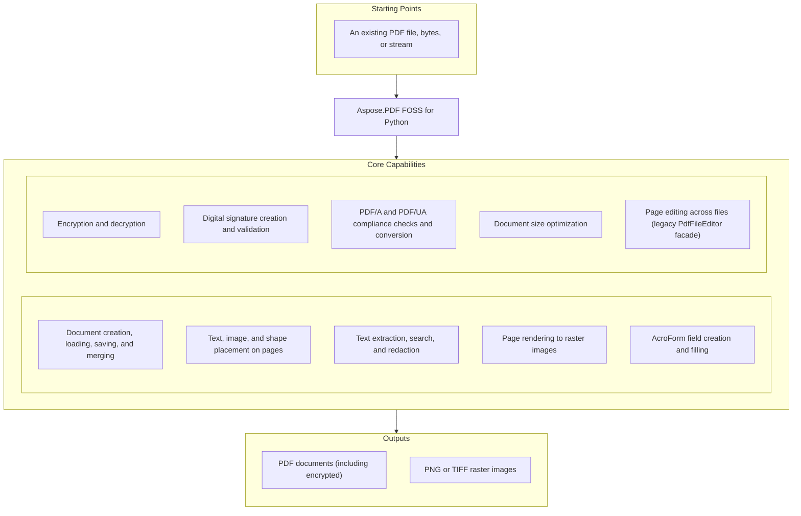

# Aspose.PDF FOSS for Python

[](https://github.com/aspose-pdf-foss/Aspose-PDF-FOSS-for-Python/actions/workflows/ci.yml) [](https://www.python.org/downloads/) [](LICENSE)

[](https://products.aspose.org/pdf/python/)

Aspose.PDF FOSS for Python is an open-source Python library for creating, reading, editing,
rendering, and validating PDF documents. It is implemented in pure Python, ships type
information, and is currently in alpha, so APIs and feature coverage may evolve before the
first stable release.

## Navigation

- [At a glance](#at-a-glance)
- [Key capabilities](#key-capabilities)
- [Installation](#installation)
- [Quick start](#quick-start)
- [Additional examples](#additional-examples)
- [API reference](#api-reference)
- [Documentation & resources](#documentation--resources)
- [Scope and limitations](#scope-and-limitations)
- [Development and testing](#development-and-testing)
- [Security](#security)
- [Contributing](#contributing)
- [License](#license)

## At a Glance



## Key Capabilities

- Create, load, save, and merge PDF documents with `Document`; load from a path, raw bytes,
  or a binary stream, bounded by a configurable `PdfLoadLimits` resource policy for
  untrusted input.
- Add Standard-14 or embedded Unicode text — including OpenType-shaped bidirectional text
  via the optional `text-layout` extra — plus images, lines, rectangles, annotations, and
  attachments with `Page.add_text()`, `Page.add_image()`, `Page.draw_rectangle()`, and
  `Page.draw_line()`.
- Extract and search page text with `PdfExtractor` and `TextFragmentAbsorber`; replace or
  redact matched text with `Document.replace_text()` and `Document.redact_text()`.
- Render pages to PNG or TIFF raster images with `Page.render()` / `Page.save_as_image()`,
  or batch-render a whole document with `Document.save_page_as_image()`.
- Create and fill interactive AcroForm fields — text fields, checkboxes, radio groups,
  list/combo boxes, push buttons — through `Form` and `Field`, then flatten with
  `Document.flatten()`.
- Encrypt and decrypt documents with RC4 or AES (AES-CBC, including AES-256) via
  `Document.encrypt()` / `decrypt()`.
- Create self-signed certificates and PKCS#7/CAdES signature payloads — including PAdES baseline
  (B/T/LT/LTA) signatures — with `SigningUtils`, and inspect or validate embedded digital
  signatures with `PdfSignature.validate()`.
- Run heuristic PDF/A and PDF/UA compliance checks and conversions with
  `Document.validate_pdfa()`, `Document.convert_to_pdfa()`, `Document.validate_pdfua()`,
  and auto-tag existing content into a structure tree with `Document.auto_tag()`.
- Reduce file size with `Document.optimize()` / `OptimizationOptions` — remove unused
  objects and streams, deduplicate images, subset/compress fonts, and link duplicate
  content streams.
- Merge, split, extract, and insert pages across files with the legacy boolean
  `PdfFileEditor` facade.

## Installation

A PyPI package has not been published yet. Install the latest source checkout:

```bash
git clone https://github.com/aspose-pdf-foss/Aspose-PDF-FOSS-for-Python.git
cd Aspose-PDF-FOSS-for-Python
python3 -m venv .venv
source .venv/bin/activate
python -m pip install -e '.[dev]'
```

Install with the optional extras for Pillow-based image support, Brotli-based WOFF2
decoding, and HarfBuzz/bidi complex-text layout, instead of the `dev` group:

```bash
python -m pip install -e '.[images,woff2,text-layout]'
```

The package requires Python 3.11 or later and depends on `cryptography` and `asn1crypto`.

## Quick Start

Create a PDF and add text to it:

```python
from aspose_pdf import Document

with Document() as document:
    page = document.pages.add()
    page.add_text(
        "Hello from Aspose.PDF FOSS!",
        x=72,
        y=720,
        font_size=18,
    )
    document.save("hello.pdf")
```

Read an existing document:

```python
from aspose_pdf import Document

with Document("input.pdf") as document:
    print(f"Pages: {document.page_count}")
    print(f"PDF version: {document.version}")
    print(document.info)
```

`Document(source, password=..., limits=...)` accepts a path, raw bytes, or a binary stream
and is equivalent to `Document().load_from(source, ...)`. A missing file, non-PDF data, or a
missing password raises rather than silently yielding an empty document.

## Additional Examples

Runnable checks for the same APIs live under `tests/` in the repository, and
[`supported-features.md`](supported-features.md) documents the full capability matrix. The
most common operations are collected below.

### Extract Text

```python
from aspose_pdf import PdfExtractor

with PdfExtractor() as extractor:
    extractor.bind_pdf("input.pdf")
    extractor.extract_text()
    print(extractor.get_text())
```

<details>
<summary>View Additional Examples</summary>

### Merge PDF Files

```python
from aspose_pdf import PdfFileEditor

with PdfFileEditor() as editor:
    if not editor.concatenate(["part-1.pdf", "part-2.pdf"], "merged.pdf"):
        raise RuntimeError(editor.last_exception)
```

### Render a Page to an Image

```python
from aspose_pdf import Document

with Document() as document:
    document.load_from("input.pdf")
    document.pages[0].save_as_image("page-1.png", dpi=144)
```

### Embed a Unicode Font

For text outside the Standard-14 encodings, provide an embeddable TrueType/OpenType font as
bytes, a path, or a `FontDescriptor`:

```python
from aspose_pdf import Document

with Document() as document:
    page = document.pages.add()
    page.add_text(
        "Latin Č · Кириллица · Ελληνικά · 漢字",
        x=72,
        y=720,
        font="NotoSans-Regular.ttf",
    )
    document.save("unicode.pdf")
```

The writer creates a subset Type0/CID font, two-byte character codes, `/ToUnicode`, widths,
and the required CID-to-glyph mapping. A character the supplied font cannot represent raises
`FontEmbeddingException` instead of silently writing `.notdef`.

### Complex, Bidirectional Text Layout

Install the `text-layout` extra and pass `TextLayoutOptions` for OpenType shaping,
bidirectional runs, ordered font fallback, and width-constrained line layout:

```python
from aspose_pdf import Document, TextLayoutOptions

with Document() as document:
    page = document.pages.add()
    page.add_text(
        "English العربية 123",
        x=72,
        y=720,
        font_size=16,
        font="NotoSansArabic-Regular.ttf",
        layout=TextLayoutOptions(
            fallback_fonts=["NotoSans-Regular.ttf"],
            max_width=300,
            alignment="start",
            language="ar",
        ),
    )
    document.save("complex-text.pdf")
```

### Bound Untrusted PDF Input

`PdfLoadLimits` is the public, immutable resource policy applied when a PDF is loaded and
processed:

```python
from aspose_pdf import Document, PdfLoadLimits, PdfResourceLimitException

limits = PdfLoadLimits(
    max_input_bytes=64 * 1024 * 1024,
    max_decoded_stream_bytes=16 * 1024 * 1024,
    max_image_pixels=25_000_000,
)

try:
    with Document(limits=limits) as document:
        document.load_from("input.pdf")
except PdfResourceLimitException as error:
    print(f"PDF rejected: {error}")
```

The same `limits=` argument is accepted by `Document.load_from()` and
`Document.open_streaming()` for lazy/streaming documents. These limits reduce known parser and
allocation risks but are not an exhaustive DoS sandbox — isolate highly hostile PDF input at the
process level as well.

### Create and Fill an AcroForm Field

```python
from aspose_pdf import Document

with Document() as document:
    page = document.pages.add()
    field = document.form.add_text_field(
        "customer_name",
        page,
        (72, 650, 272, 670),  # (x0, y0, x1, y1) widget rectangle, in page points
    )
    field.value = "Jane Doe"
    document.flatten()
    document.save("form.pdf")
```

### Optimize a Document

```python
from aspose_pdf import Document, OptimizationOptions

with Document("input.pdf") as document:
    options = OptimizationOptions()
    options.remove_duplicate_images = True
    options.compress_fonts = True
    document.optimize(options)
    document.save("optimized.pdf")
```

</details>

## API Reference

`Document` is the central entry point, exposing `pages`, `form`, `outlines`, and
`tagged_content` for structural editing alongside `encrypt`, `decrypt`, `merge`,
`optimize`, and `flatten` operations.

This list is organized by capability, not by import path. `Document` and the other names used
in the Quick start/Additional examples above import directly from `aspose_pdf`
(`from aspose_pdf import Document`). `RasterizedPage`, `Merger`, `Splitter`, `SplitOptions`,
`MergeOptions`, `UnsupportedFeatureException`, and `FontEmbeddingException` do too. The remaining
"Low-level and exceptions" names live in a submodule: `PdfDocument`/`PdfDictionary`/`PdfArray`/
`PdfStream` in `aspose_pdf.engine.cos`, `PdfCosParser`/`PdfCosWriter` in
`aspose_pdf.engine.pdf_parser_cos`/`aspose_pdf.engine.pdf_writer_cos`, `Rectangle` in
`aspose_pdf.geometry`/`aspose_pdf.images`, `Matrix` in `aspose_pdf.engine.primitives.matrix`, and
`AsposePdfException`/`PdfException`/`PdfParseException`/`PdfSecurityException`/
`InvalidPasswordException` in `aspose_pdf.exceptions`.

<details>
<summary>View the Supported Public API Surface</summary>

### Core API

| Class | Description |
|---|---|
| `AsposePdfException` | Base class for all aspose_pdf exceptions. |
| `ByteArrayDataSource` | A data source backed by in-memory bytes. |
| `CdrLoadOptions` | Options for loading CDR files. |
| `CgmLoadOptions` | Options for loading CGM files. |
| `Color-color` | Represents a color in PDF documents. |
| `ColorPrimitive` | Very small color primitive with transparency support. |
| `DataSource` | Base class for plugin inputs and outputs. |
| `DeprecatedFeatureException` | Raised when a deprecated PDF feature is used that is not allowed in newer PDF versions. |
| `Document-document` | Pythonic wrapper for PDF document lifecycle and core operations. |
| `Field` | A field of an interactive form. |
| `FileDataSource` | A data source backed by a file on disk. |
| `FileFontSource` | Discover the font(s) contained in a single file. |
| `FileSpecification` | A document-level embedded file (``/Filespec``) with typed metadata. |
| `FillMode` | Fill mode enumeration for path operations. |
| `FolderFontSource` | Collect fonts from a directory (optionally recursing into subfolders). |
| `FontDescriptor` | Represents a discoverable font. |
| `FontEmbeddingException` | Raised when there is an error embedding fonts in the PDF. |
| `FontRegistry` | Singleton registry for resolving well-known font names. |
| `FontRepository` | Aggregate font sources and resolve fonts by name. |
| `FontSource` | Base class for external font providers. |
| `Form` | Represents an interactive form (AcroForm) within a PDF document. |
| `GradientAxialShading` | Represents axial (linear) gradient shading. |
| `GraphicElementCollection` | Collection of graphic elements that can be added to or removed from a page. |
| `GraphicsAbsorber` | Absorbs graphic elements from PDF pages. |
| `HtmlLoadOptions` | Options for loading HTML documents. |
| `HtmlSaveOptions` | Options for saving PDF documents as HTML. |
| `ImagePlacement-images` | Represent an image placed on a PDF page. |
| `ImagePlacementAbsorber-images` | Absorber to collect image placements from PDF pages. |
| `IncorrectCMapUsageException` | Raised when there is an incorrect usage of CMap. |
| `InvalidFormTypeOperationException` | Exception thrown when an invalid form type operation is attempted. |
| `InvalidOperationException` | Raised when a graphics element is attached to the wrong parent. |
| `InvalidPasswordException` | Raised when an incorrect password is provided for an encrypted document. |
| `InvalidPdfFileFormatException` | Raised when the PDF file format is invalid or corrupted. |
| `InvalidValueFormatException` | Raised when an invalid value is encountered during parsing or conversion. |
| `LatexFragment` | Small value object that stores LaTeX source text. |
| `License` | License management class for Aspose.PDF. |
| `Margin` | The Margin class provides top, left, bottom, and right properties for defining page margins. |
| `MarkdownSaveOptions` | Options controlling Markdown export — output format (`GFM` by default), image extraction, and the image output directory. |
| `Matrix3D` | Represents a 3D transformation matrix. |
| `MemoryFontSource` | Expose a font program supplied as in-memory bytes. |
| `MergeOptions` | Options for :class:`Merger`: concatenate all inputs in order. |
| `Merger` | Concatenate every input PDF into a single document. |
| `NamespaceProvider` | Resolve XMP namespace prefixes and URIs. |
| `OfdLoadOptions` | Options for loading OFD files. |
| `OperationResult` | A single result produced by a plugin. |
| `OptimizationOptions` | OptimizationOptions lets developers control stream compression, removal of unused objects, image down‑sampling, and other cleanup actions when optimizing PDFs. |
| `OptimizeOptions` | Options for :class:`Optimizer`. |
| `Optimizer` | Optimize each input PDF (compression + unused-object cleanup). |
| `OutlineCollection` | Top-level collection of :class:`OutlineItem` bookmarks. |
| `OutlineItem` | A single bookmark entry in a PDF outline tree. |
| `Page` | A page of a PDF document. |
| `PageCollection-pages` | A collection to manage PDF pages within a Document. |
| `PageInfo` | Page layout metadata used by `SvgLoadOptions` — currently just the page `Margin`. |
| `PdfAConversionResult` | Result of a PDF/A conversion operation. |
| `PdfAValidateOptions-pdfa` | Container for PDF/A validation settings. |
| `PdfAValidationResult-pdfa` | Detailed result of a PDF/A validation run. |
| `PdfAValidator` | Plugin that runs PDF/A validation on one or more inputs. |
| `PdfConsts` | Static helpers for converting between decimal and octal string representations (`decimal_to_octal`, `octal_to_decimal`). |
| `PdfException` | Base class for PDF-related exceptions. |
| `PdfExtractor` | Simple PDF text and image extractor. |
| `PdfFileEditor` | Facade for PDF file editing operations. |
| `PdfIOException` | Raised when there is an I/O error during PDF processing. |
| `PdfLoadLimits` | Immutable safety limits for untrusted PDF input and authored assets. |
| `PdfParseException` | Raised when there is an error parsing a PDF document. |
| `PdfPlugin` | Base class for low-code plugins. |
| `PdfResourceLimitException` | Raised when processing a PDF would exceed a configured resource limit. |
| `PdfSecurityException` | Raised when there is an encryption, signature, or permissions error. |
| `PdfSignature` | Represent a PDF digital signature. |
| `PdfUaValidateOptions` | Container for batch PDF/UA validation settings. |
| `PdfUaValidationResult` | Detailed result of a PDF/UA structure check (heuristic). |
| `PdfUaValidator` | Plugin that runs heuristic PDF/UA validation on one or more inputs. |
| `PdfValidationException` | Raised when a PDF document fails validation or compliance checks. |
| `PerformanceLogger` | Collects timing log lines written by `VirtualizationPerformance.print_statistics`. |
| `PluginOptions` | Hold input/output data sources and their PDF resource-limit policy. |
| `Point` | Represents a point in 2D space. |
| `Point3D` | Represents a 3D point. |
| `PrinterSettings` | Printer configuration for document printing — copies, duplex mode, page range, and printer/print-file names. |
| `Rectangle-geometry` | Represents a rectangle with position and size. |
| `Rectangle-images` | Rectangle representing image placement bounds on a PDF page. |
| `RegexResult` | Wraps a single regular-expression match found on a PDF page. |
| `ResultContainer` | Holds the ordered results of a plugin operation. |
| `SplitOptions` | Options for :class:`Splitter`: split the first input into single pages. |
| `Splitter` | Split the first input PDF into one document per page. |
| `StatisticsEntry` | Entry for tracking statistics and timing information. |
| `StreamDataSource` | A data source backed by a binary stream (e.g. `io.BytesIO`). |
| `StructureElement` | A mutable logical-structure element in a tagged PDF. |
| `SvgLoadOptions-load_options` | Options for loading SVG files. |
| `SvgLoadOptions-svg` | Compatibility subclass of `SvgLoadOptions` adding `conversion_engine` and `page_info` (margin) settings. |
| `SystemFontSource` | Collect fonts from common system font directories. |
| `TaggedContent` | Editable view of a document's logical structure tree. |
| `TaggedContext` | Holds a document's tagged-PDF context — its structure tree root, mark info, and language — consumed by `TaggedContent`. |
| `TextAbsorber` | Absorbs text from PDF pages (legacy class, alias for TextFragmentAbsorber). |
| `TextExtractionOptions` | Options for text extraction from PDF pages. |
| `TextExtractor` | Extract plain text from each input PDF. |
| `TextExtractorOptions` | Options for :class:`TextExtractor`: extract text from each input. |
| `TextFormattingMode` | Text formatting mode for text extraction. |
| `TextFragment` | A text fragment found inside a PDF page. |
| `TextFragmentAbsorber-text` | Absorbs text fragments from a PDF page or document. |
| `TextFragmentCollection-text` | A mutable ordered collection of :class:`TextFragment` objects. |
| `TextLayoutOptions` | Configure complex-text shaping and line layout for ``Page.add_text``. |
| `TextSearchOptions` | Options controlling how text search is performed. |
| `UnsignedContent-forms` | Represents a collection of unsigned content elements in a PDF document. |
| `UnsignedContentAbsorber-forms` | Extract unsigned form fields and annotations from a PDF document. |
| `UnsupportedFeatureException` | Raised when a compatibility surface names a feature this package lacks. |
| `ValidationOptions` | Configuration for signature validation. |
| `ValidationResult` | Structured result returned by signature validation. |
| `VirtualizationPerformance` | Class-level stopwatch utility for timing rendering/virtualization operations by key, reporting elapsed time through a `PerformanceLogger`. |
| `WarichuWPElement` | Minimal tagged-element type for API compatibility. |

#### Enumerations

| Enumeration | Description |
|---|---|
| `CertificationLevel` | DocMDP certification level of a signature. |
| `DocFormat` | Target format for a save operation. |
| `Duplex` | Printer duplex mode (`NONE`, `SIMPLEX`, `DUPLEX`, `TUMBLE`) used by `PrinterSettings.duplex`. |
| `FieldType` | Type of form field. |
| `FormType` | Type of PDF form. |
| `PadesLevel` | PAdES baseline conformance level reached by a signature. |
| `Plugin` | Identifiers for the available low-code plugins. |
| `PrintRange` | Which pages to print (`ALL_PAGES`, `SOME_PAGES`, `SELECTION`, `PAGE_RANGE`) used by `PrinterSettings.print_range`. |
| `RevocationStatus` | Certificate revocation outcome (OCSP/CRL). |
| `SaveFormat` | Format for saving PDF documents. |
| `StructureTypeStandard` | Standard PDF logical-structure element type names (`Document`, `Part`, `Sect`, `Div`, `P`, `Table`, ...) per ISO 32000. |
| `TrustStatus` | Outcome of building/validating the signer's certificate chain. |
| `ValidationMethod` | Selects the signature format / validation algorithm. |
| `ValidationMode` | Controls whether certificate revocation is checked via network. |
| `ValidationStatus` | Outcome of a :class:`ValidationResult`. |

### Annotations

| Class | Description |
|---|---|
| `Annotation` | Live view over a single annotation on a page. |
| `AnnotationCollection` | Mutable sequence-like wrapper over page annotations. |
| `LinkAnnotation` | Concrete annotation type kept for compatibility with tests/API. |
| `MarkupAnnotation` | Base class for markup annotations. |
| `PDF3DAnnotation` | Minimal annotation wrapper for prerelease imports. |
| `PDF3DArtwork` | Container for 3D content and named views. |
| `PDF3DContent` | Reference to 3D content stored on disk. |
| `PDF3DView` | Lightweight description of a saved 3D view. |

#### Enumerations

| Enumeration | Description |
|---|---|
| `AnnotationFlags` | Flags that define annotation behaviour. |
| `AnnotationType` | Known annotation subtype names (PDF 32000-1:2008, Table 169). |
| `PDF3DLightingScheme` | Lighting scheme for a 3D annotation view (`HEADLAMP`, `WHITE`, `GRAY`, `DARK`, `CUSTOM`), set on `PDF3DView.lighting_scheme`. |
| `PDF3DRenderMode` | PDF3DRenderMode and PDF3DLightingScheme enums let developers choose rendering style (SOLID, WIREFRAME, TRANSPARENT) and lighting (HEADLAMP, WHITE, etc.) for 3D annotations. |

### Clustering

| Class | Description |
|---|---|
| `Cluster` | Represents a cluster of data points. |
| `ClusterCollection` | A collection of clusters. |
| `DataPoint` | Represents a data point in clustering operations. |

### Engine

| Class | Description |
|---|---|
| `AnnotationName` | A ``str`` subclass that marks a value to be serialized as a PDF name. |
| `AuthoredFont` | A normalized embedded font and the mutable CID mapping for authored text. |
| `AuthoredImage` | Prepared image data and PDF image XObject metadata. |
| `BitStream` | Minimal bit-oriented buffer used by compatibility code. |
| `CffOutlines` | Decode glyph outlines from a CFF (Type 2 charstring) font program. |
| `ChainResult` | Result of building and validating a certificate path. |
| `CharacterCollection` | A CIDSystemInfo registry, ordering, and supplement triple. |
| `CidTextCodec` | Code codec for a composite (Type0) font's show strings. |
| `Color-types` | Represents a color in PDF documents. |
| `CompositeFontMetric` | Advance metrics for a composite (Type0) font. |
| `ContentStreamParser` | Parse a PDF content stream and extract plain text. |
| `CosExtractor` | Extract pages, streams, images and metadata from a PdfDocument. |
| `DecodedJpeg` | A decoded JPEG image. |
| `Decoder-ccitt` | Decoder.decode(data, params, limits) returns the raw bytes of a decoded stream for supported codecs like JBIG2 and JPEG 2000. |
| `Decoder-jbig2` | JBIG2 decoder that parses segment structure and extracts bitmap data. |
| `Decoder-jpx` | JPEG 2000 (JPX) Stream Decoder. |
| `DssMaterial` | Validation material destined for (or harvested from) a ``/DSS``. |
| `Encoding` | Text-encoding name constants (`UTF8`, `UTF16`, `LATIN1`, `WIN_ANSI`) plus a static `encode()` helper. |
| `EncryptionUtils` | Utility class for PDF-compliant AES-CBC, RC4 encryption, and key derivation. |
| `GeneratedAppearance` | A synthesised appearance: content bytes plus any required ExtGState entries. |
| `GlyphPlacement` | One shaped glyph at an em-relative position within a laid-out line. |
| `ImagePlacement-simple_pdf` | Represents an image placement on a page. |
| `ImagePlacementAbsorber-simple_pdf` | Absorber that finds image placements in a PDF. |
| `IncrementalUpdate` | Generate an incremental update section for an existing PDF. |
| `IncrementalWriter` | Utility that appends incremental updates to an existing PDF. |
| `LayoutElement` | A positioned piece of page content (a text object or an image paint). |
| `LayoutLine` | One visual line with logical replacement text and shaped glyphs. |
| `LayoutResult` | Complete line layout; glyph coordinates and widths are in em units. |
| `LazyImageDict` | Dictionary that decodes image streams on demand to save memory. |
| `LazyPdfObjectStore` | Object-number → COS object map that parses from a :class:`PdfCosParser` on demand. |
| `Matrix` | Matrix supports 2‑D transformations with translate(x, y) and multiply(other) methods, exposing the a‑f components of the affine matrix. |
| `PageCollection-simple_pdf` | Collection wrapper for pages in SimplePdf. |
| `ParseWarnings` | Collects warnings during parsing. |
| `PdfArray` | PdfArray provides an items collection and an append method to build PDF array objects. |
| `PdfBoolean` | PdfBoolean represents a PDF boolean value via its 'value' property. |
| `PdfCorruptedError` | Unrecoverable PDF corruption. |
| `PdfCosParser` | Parse a PDF file (bytes) into a :class:`PdfDocument`. |
| `PdfCosWriter` | Serialize a :class:`PdfDocument` to a PDF byte sequence. |
| `PdfDictionary` | PdfDictionary behaves like a mapping with get and pop methods to access entries. |
| `PdfDocument` | Container for a PDF's COS object graph. |
| `PdfEncodingError` | Font or content stream encoding error. |
| `PdfIndirectReference` | PdfIndirectReference exposes the object number and generation number of an indirect PDF object. |
| `PdfMalformedError` | Recoverable malformed PDF structure. |
| `PdfName` | COS name object (e.g. `/Type`) wrapping a string value, used as dictionary keys in `PdfDictionary`. |
| `PdfName-types` | Represents a PDF name object. |
| `PdfNull-cos` | Represent PDF null object. |
| `PdfNull-data` | Lightweight null-object placeholder used by the data-layer compatibility helpers (distinct from the COS-layer `PdfNull` in `engine.cos`). |
| `PdfNumber` | COS numeric object wrapping an `int` or `float` value. |
| `PdfNumber-number` | Represents a PDF number primitive (integer or real). |
| `PdfObject` | Base class for all PDF COS objects. |
| `PdfObjectID` | Identifies a registered PDF object by its object and generation number, used by `PdfObjectRegistry`. |
| `PdfObjectRegistry` | PdfObjectRegistry.register(obj) returns a PdfObjectID that uniquely identifies the stored PDF object within the registry. |
| `PdfParseError` | Base exception for PDF parsing errors. |
| `PdfParseWarning` | Non-fatal parsing issue that was recovered from. |
| `PdfSecurityError` | Encryption or permission related error. |
| `PdfStream` | COS stream object — a `PdfDictionary` plus raw stream bytes stored in `content`. |
| `PdfString` | COS string object wrapping a UTF-8-encoded `bytes` value. |
| `PdfTrailerable` | Base mixin for COS objects that expose a trailer dictionary via `get_dictionary()`. |
| `PdfValidationError` | PDF/A or general structural validation error. |
| `PdfWriterV0` | Writes SimplePdf to PDF 1.7 format. |
| `PredefinedCMap` | A resolved predefined CMap and its semantic Unicode mapping. |
| `PredefinedCMapEncoding` | Compact code-to-CID view of a predefined CMap. |
| `RasterizedPage` | A rendered PDF page in packed RGB format. |
| `RevocationResult` | Outcome of a single certificate revocation check — `RevocationStatus`, the checking source, and a detail message. |
| `RichRun` | A single styled text run — `text` plus its `RichStyle` — used to compose formatted PDF content. |
| `RichStyle` | The resolved style of a text run. |
| `SfntFace` | Metadata recovered from a single SFNT face. |
| `Shading` | Base class for bounded RGB sampling in a shading's target space. |
| `SignedDataInfo` | Everything we need from a parsed CMS ``SignedData``. |
| `SignerVerification` | Outcome of verifying a single signer. |
| `SigningUtils` | Utility class for generating certificates and PKCS#7 signatures. |
| `SimpleFontMetric` | Advance metrics for a single-byte simple font, in 1000-unit glyph space. |
| `SimplePdf` | Native Python PDF document representation. |
| `StandardFonts` | Utility class for the PDF Standard 14 fonts. |
| `StreamDecoder` | Decode PDF stream data using supported filters. |
| `StreamEncoder` | Encode raw bytes into PDF stream data, the inverse of :class:`StreamDecoder`. |
| `TextFragmentAbsorber-simple_pdf` | Absorber that extracts text fragments from a SimplePdf instance. |
| `TextFragmentCollection-simple_pdf` | Collection of TextFragment objects. |
| `TextObject` | A `BT` ... `ET` text object located in a content stream. |
| `TimestampInfo` | Result of verifying an RFC 3161 timestamp token. |
| `TrueTypeOutlines` | Decode glyph outlines from an embedded TrueType (``glyf``) program. |
| `Type1Outlines` | Decode glyph outlines from a Type 1 (``/FontFile``) font program. |
| `XmpArray` | An ordered XMP array value. |
| `XmpField` | A single XMP property. |
| `XmpNamespaceProvider` | Bidirectional XMP namespace prefix URI resolver. |
| `XmpPacket` | An in-memory XMP packet: an ordered collection of properties. |
| `XmpProperty` | A property carrying arbitrary qualifiers. |
| `XmpStruct` | A structured XMP value (an ``rdf:parseType="Resource"`` block). |

#### Enumerations

| Enumeration | Description |
|---|---|
| `EncodingType` | PDF text-encoding scheme names (`WIN_ANSI`, `MAC_ROMAN`, `MAC_EXPERT`, `PDF_DOC`, `UNICODE`). |
| `FilterType` | The FilterType enum lists the supported stream filter names such as FLATE_DECODE, LZW_DECODE, and DCT_DECODE. |

### Generated

| Class | Description |
|---|---|
| `Document-generated_document` | Pythonic wrapper for PDF document lifecycle and core operations. |
| `PdfAValidateOptions-generated_pdfa` | Options for a PDF/A validation run. |
| `PdfAValidationResult-generated_pdfa` | Result of a PDF/A validation run. |
| `UnsignedContent-generated_forms` | Container for unsigned content (pages, form fields, annotations). |
| `UnsignedContentAbsorber-generated_forms` | Extracts unsigned content elements; includes form field/annotation info. |

### Security

| Class | Description |
|---|---|
| `CompromiseCheckResult` | Result of scanning a signed PDF for compromised/altered signatures — whether any were found, page coverage, and reasons. |
| `SignaturesCompromiseDetector` | Detect possible compromise indicators around signed PDFs. |

---

#### Detailed Member Reference

### Document and Pages

- `Document`
  - `load_from(source, password, limits) -> Document`, `save(destination, save_format, overwrite) -> Document`
  - `iter_pages()`, `render_page(page_index, dpi, ...)`, `save_page_as_image(...)`
  - `replace_text(...)`, `redact_text(...)`
  - `optimize(options, compress_streams)`, `optimize_resources(options)`, `compress_streams()`
  - `encrypt(user_password, owner_password, permissions)`, `decrypt(password)`,
    `change_passwords(...)`
  - `validate()`, `check()`, `repair()`, `flatten()`, `merge()`
  - `validate_pdfa(level)`, `convert_to_pdfa(level, ...)`, `validate_pdfua()`,
    `convert_to_pdfua(...)`, `auto_tag(image_alt)`
  - `add_attachment(...)`, `get_embedded_file(name)`
  - Properties: `pages: PageCollection`, `form: Form`, `tagged_content`, `outlines`,
    `page_count`, `info`, `xmp_metadata`, `is_encrypted`, `version`, `permissions`,
    `load_limits: PdfLoadLimits`
- `Page`
  - `add_text(text, x, y, font_size, font_name, font, color, ...) -> Page`
  - `add_image(image, x, y, width, height, ...) -> str`
  - `draw_rectangle(...)`, `draw_line(...)`
  - `render(dpi, scale, background, antialias) -> RasterizedPage`
  - `save_as_image(path, dpi, scale, background, antialias) -> Path`
  - `replace_text(...)`, `redact_text(...)`
  - Properties: `index`, `rect`, `annotations`, `media_box`, `rotation`, `crop_box`, `content`
- `PageCollection` — `item(index) -> Page`, `add(page)`, `insert(index, page)`,
  `delete(index)`, `clear()`, `contains(page)`, `index_of(page)`

### Text Extraction and Search

- `PdfExtractor` — `bind_pdf(source, password, limits)`, `extract_text()`, `get_text()`,
  `has_next_page_text()`, `get_next_page_text()`, `extract_image()`, `extract_attachment()`
- `TextFragmentAbsorber` — `visit(page_or_doc)`, `remove_all_text()`,
  `apply_for_all_fragments(action)`; properties `text_fragments`, `regex_results`, `phrase`,
  `text_search_options`
- `TextLayoutOptions` — OpenType shaping and bidi options: `fallback_fonts`, `max_width`,
  `alignment`, `language`. Logical text is retained for extraction while glyphs are painted in
  their shaped visual order.
- `PdfFileEditor` — legacy boolean facade: `concatenate(inputs, output)`,
  `extract(source, destination, page_from, page_to)`, `insert(...)`, `delete(...)`,
  `append(...)`; `last_exception` on failure

### Forms

- `Form` — `add_text_field(...)`, `add_checkbox(...)`, `add_radio_group(...)`,
  `add_list_box(...)`, `add_combo_box(...)`, `add_push_button(...)`, `remove_field(name)`,
  `generate_appearances()`, `flatten()`; property `fields: list[Field]`
- `Field`, `FieldType`, `FormType`

### Security and Signatures

- `PdfLoadLimits` — immutable resource-limit policy: `max_input_bytes`, `max_objects`,
  `max_decoded_stream_bytes`, `max_image_pixels`, `max_pages`, and more; `unlimited()`
- `PdfResourceLimitException`, `PdfValidationException`
- `PdfSignature` — `validate(options) -> ValidationResult`; properties `valid`, `name`,
  `date`, `reason`, `sub_filter`, `docmdp_level`
- `SigningUtils` (`aspose_pdf.engine.signing`) — `create_self_signed_cert()`,
  `create_self_signed_ca(...)`, `sign_data_pkcs7(...)`, `sign_data_cades(...)`: build self-signed
  certificates and PKCS#7/CAdES signing payloads for producing PAdES baseline signatures
- `ValidationResult` — `is_valid`, `status`, `signer`, `trust_status`, `revocation_status`,
  `timestamp`, `certification_level`, `pades_level`

### Compliance and Optimization

- `PdfAValidator` — `process(options) -> list[PdfAValidationResult]`; `PdfAValidateOptions`,
  `PdfAValidationResult` (`is_valid`, `errors`, `warnings`, `is_heuristic`)
- `PdfUaValidator`, `PdfUaValidateOptions`, `PdfUaValidationResult`
- `OptimizationOptions` — `remove_unused_objects`, `remove_unused_streams`,
  `remove_duplicate_images`, `link_duplicate_streams`, `compress_fonts`, `subset_fonts`,
  `image_compression_quality`, `use_object_streams`, and more

### Low-Level and Exceptions

- `PdfCosParser` / `PdfCosWriter` — parse/serialize the raw COS object graph
- `PdfDocument`, `PdfDictionary`, `PdfArray`, `PdfName`, `PdfStream` — COS primitives
- `RasterizedPage`, `Rectangle`, `Matrix`, `Merger`, `Splitter`, `SplitOptions`,
  `MergeOptions`
- `AsposePdfException`, `PdfException`, `PdfParseException`, `PdfSecurityException`,
  `UnsupportedFeatureException`, `FontEmbeddingException`, `InvalidPasswordException`

</details>

## Documentation & Resources

- **[Getting started guide](https://docs.aspose.org/pdf/python/)** — installation, walkthroughs, and feature guides for this library.
- **[How-to guides & FAQ](https://kb.aspose.org/pdf/python/)** — task-focused answers for common PDF-processing questions.
- **[Full API reference](https://reference.aspose.org/pdf/python/)** — the complete, browsable reference for all 237 public types (the [API reference](#api-reference) section above covers the essentials).
- **[Contributor guide](AGENTS.md)** — architecture notes and conventions for contributors.
- **[Changelog](CHANGELOG.md)** — release history.
- Found a bug or have a feature request? [Open an issue](https://github.com/aspose-pdf-foss/Aspose-PDF-FOSS-for-Python/issues) on GitHub.

## Scope and Limitations

This project aims to fail explicitly (raising rather than silently no-opping or producing
wrong output) when an operation is unsupported, but PDF is a large format and coverage is not
yet complete.

- This project reads, writes, and processes only the PDF format itself — it does not
  implement import from or export to other document or image formats.
- The compatibility layer exposes load-option and save-format placeholders for formats such
  as CDR, CGM, HTML, OFD, SVG, and PPTX, but the constructors and `Document.save()` reject
  them explicitly with `UnsupportedFeatureException` rather than silently no-opping.
- Page rendering is best effort and does not implement every PDF graphics feature.
- PDF/A and PDF/UA validation (`Document.validate_pdfa()`, `Document.validate_pdfua()`) is
  heuristic, not certification-grade.
- OCR and layout reflow are not implemented.
- Printing (`PrinterSettings`) has no backing implementation.
- PAdES baseline signature validation (chain building, revocation, and timestamp checks) is
  not a formally certified eIDAS-grade implementation — conformance to ETSI EN 319 142 and
  final certification is deferred to external validators such as veraPDF.
- See [`supported-features.md`](supported-features.md) in the repository for the full
  capability matrix before relying on the library for compliance- or security-sensitive
  workflows.

These limitations don't apply to the commercial
[Aspose.PDF — Enterprise Edition](https://products.aspose.com/pdf/) product family, which adds
full format support — CDR/CGM/HTML/OFD/SVG/PPTX conversion, certification-grade PDF/A and PDF/UA
validation, OCR — and complete printing support.

## Development and Testing

Activate the project virtual environment, install development dependencies, and run the
test suite:

```bash
source .venv/bin/activate
python -m pip install -e '.[dev]'
python -m pytest -q
```

<details>
<summary>View Linting, Build, and CI Details</summary>

Run the linter separately:

```bash
python -m ruff check src/
```

Build and validate the distribution:

```bash
python -m build
python -m twine check dist/*
```

Convenience wrappers run the same checks:

```bash
scripts/check.sh
scripts/build.sh
```

Continuous integration and release publishing run via GitHub Actions:
[`ci.yml`](.github/workflows/ci.yml) lints, type-checks, and tests every push/PR;
[`publish-pypi.yml`](.github/workflows/publish-pypi.yml) and
[`publish-testpypi.yml`](.github/workflows/publish-testpypi.yml) handle release publishing;
[`security-audit.yml`](.github/workflows/security-audit.yml) runs dependency/security
scanning.

### Repository Map

| Path | Description |
| --- | --- |
| `src/aspose_pdf/` | Public Python package |
| `src/aspose_pdf/engine/` | PDF parser, writer, filters, renderer, encryption, and signing internals |
| `src/aspose_pdf/generated/` | Supported API compatibility modules |
| `tests/` | Unit, regression, and integration tests |
| `supported-features.md` | Detailed feature coverage and limitations |
| `scripts/` | Local check and build commands |
| `.github/workflows/` | CI and publishing workflows |

</details>

## Security

If you discover a security issue, follow the [security policy](SECURITY.md) and use GitHub
private vulnerability reporting instead of opening a public issue.

## Contributing

Issues and pull requests are welcome. Keep changes focused, add tests, write code comments and
docstrings in English, run `python -m ruff check src/` and `python -m pytest -q`, and document
public API changes. When reporting a parser or rendering problem, include a minimal PDF that can
be shared publicly whenever possible.

## License

This project is licensed under the [MIT License](LICENSE). The MIT License permits use, copying,
modification, distribution, sublicensing, and commercial use, provided its copyright and
permission notice are retained. The software is provided without warranty.

Copyright © 2026 Aspose Pty Ltd.
