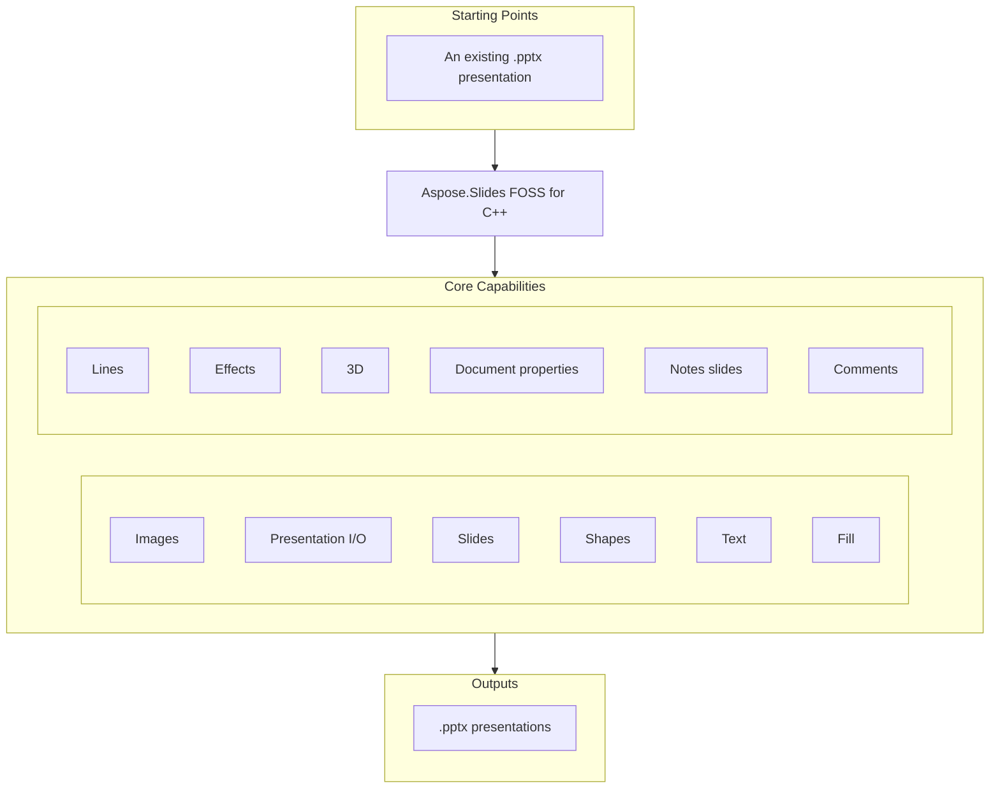

# Aspose.Slides FOSS for C++

[](LICENSE) [](CMakeLists.txt)

[](https://products.aspose.org/slides/cpp/)

The official open-source C++ library by Aspose.Slides for creating, reading, and editing
PowerPoint (`.pptx`) presentations — no Microsoft Office or COM automation required.

## Navigation

- [At a Glance](#at-a-glance)
- [Key Capabilities](#key-capabilities)
- [Installation](#installation)
- [Quick Start](#quick-start)
- [Additional Examples](#additional-examples)
- [API Reference](#api-reference)
- [Documentation & Resources](#documentation--resources)
- [Scope and Limitations](#scope-and-limitations)
- [Development and Testing](#development-and-testing)
- [Third-Party Notices](#third-party-notices)
- [License](#license)

## At a Glance



## Key Capabilities

Features cover the full authoring surface — from presentation I/O and shape creation to fill,
line, and 3D formatting, notes, comments, and document properties.

- **Presentation I/O** — open, create, and save `.pptx` files with full round-trip fidelity;
  unknown XML parts encountered during load are preserved verbatim on save.
- **Slides** — add, remove, clone, reorder, and iterate slides.
- **Shapes** — AutoShapes, PictureFrames, Tables, Connectors.
- **Text** — `TextFrame`, `Paragraph`, `Portion` with character-, paragraph-, and text-frame-level
  formatting, including bullets.
- **Fill** — solid, gradient, pattern, and picture fills via `FillFormat`/`FillType`.
- **Lines** — width, dash style, arrows, join and alignment.
- **Effects** — outer shadow, inner shadow, preset shadow, glow, soft edge, blur, fill overlay,
  and reflection via `EffectFormat`.
- **3D** — bevel, camera, light rig, material, extrusion depth.
- **Document properties** — core, app, and custom properties.
- **Notes slides** — per-slide notes with header/footer management (`NotesSlideManager`).
- **Comments** — threaded comments with authors, timestamps, and positions.
- **Images** — embed from file, bytes, or stream.

## Installation

This library is not yet published to a package registry. Building it as a standalone CMake
project is straightforward:

```bash
cmake -B build -DCMAKE_BUILD_TYPE=Release
cmake --build build
```

Dependencies are fetched automatically via CMake `FetchContent`: [pugixml](https://github.com/zeux/pugixml)
v1.14 (XML parsing) and [miniz](https://github.com/richgel999/miniz) 3.0.2 (ZIP archive I/O);
[GoogleTest](https://github.com/google/googletest) v1.15.2 is fetched for the test build only.
Requires a C++20 compiler and CMake 3.20+.

To consume the library directly from your own CMake project via `FetchContent` instead of a
standalone build:

```cmake
include(FetchContent)
FetchContent_Declare(
  aspose_slides_foss
  GIT_REPOSITORY https://github.com/aspose-slides-foss/Aspose.Slides-FOSS-for-Cpp.git
  GIT_TAG main
)
FetchContent_MakeAvailable(aspose_slides_foss)
```

## Quick Start

```cpp
#include <Aspose/Slides/Foss/presentation.h>
#include <Aspose/Slides/Foss/export/save_format.h>

using namespace Aspose::Slides::Foss;

int main() {
    // Open an existing presentation
    Presentation pres("input.pptx");
    auto& slides = pres.slides();
    // ... work with slides ...
    pres.save("output.pptx", SaveFormat::PPTX);

    // Create a new presentation
    Presentation new_pres;
    auto& slide = new_pres.slides()[0];
    new_pres.save("new.pptx", SaveFormat::PPTX);
}
```

## Additional Examples

The usage examples below build directly on the Quick Start snippet above, covering shapes,
text formatting, tables, connectors, fills, notes, comments, and document properties.

### Shapes

```cpp
#include <Aspose/Slides/Foss/presentation.h>
#include <Aspose/Slides/Foss/slide.h>
#include <Aspose/Slides/Foss/shape_type.h>
#include <Aspose/Slides/Foss/auto_shape.h>
#include <Aspose/Slides/Foss/export/save_format.h>

using namespace Aspose::Slides::Foss;

Presentation pres;
auto& slide = pres.slides()[0];
auto& shape = slide.shapes().add_auto_shape(ShapeType::RECTANGLE, 50, 50, 300, 100);
shape.add_text_frame("Hello, world!");
pres.save("shapes.pptx", SaveFormat::PPTX);
```

<details>
<summary>View Additional Examples</summary>

### Text Formatting

```cpp
#include <Aspose/Slides/Foss/presentation.h>
#include <Aspose/Slides/Foss/slide.h>
#include <Aspose/Slides/Foss/shape_type.h>
#include <Aspose/Slides/Foss/auto_shape.h>
#include <Aspose/Slides/Foss/text_frame.h>
#include <Aspose/Slides/Foss/paragraph.h>
#include <Aspose/Slides/Foss/portion.h>
#include <Aspose/Slides/Foss/portion_format.h>
#include <Aspose/Slides/Foss/fill_type.h>
#include <Aspose/Slides/Foss/nullable_bool.h>
#include <Aspose/Slides/Foss/drawing/color.h>
#include <Aspose/Slides/Foss/export/save_format.h>

using namespace Aspose::Slides::Foss;
using namespace Aspose::Slides::Foss::Drawing;

Presentation pres;
auto& shape = pres.slides()[0].shapes().add_auto_shape(
    ShapeType::RECTANGLE, 50, 50, 400, 150);
auto& tf = shape.add_text_frame("Formatted text");
auto& fmt = tf.paragraphs()[0].portions()[0].portion_format();
fmt.set_font_height(24.0f);
fmt.set_font_bold(NullableBool::TRUE);
fmt.fill_format().set_fill_type(FillType::SOLID);
fmt.fill_format().solid_fill_color().set_color(Color::from_argb(255, 0, 70, 127));
pres.save("text.pptx", SaveFormat::PPTX);
```

### Table

```cpp
#include <Aspose/Slides/Foss/presentation.h>
#include <Aspose/Slides/Foss/slide.h>
#include <Aspose/Slides/Foss/table.h>
#include <Aspose/Slides/Foss/export/save_format.h>
#include <array>

using namespace Aspose::Slides::Foss;

Presentation pres;
auto& table = pres.slides()[0].shapes().add_table(
    50, 50, std::array{120.0, 120.0, 120.0}, std::array{40.0, 40.0});
table.rows()[0][0].text_frame()->set_text("Name");
table.rows()[0][1].text_frame()->set_text("Value");
pres.save("table.pptx", SaveFormat::PPTX);
```

### Connector

```cpp
#include <Aspose/Slides/Foss/presentation.h>
#include <Aspose/Slides/Foss/slide.h>
#include <Aspose/Slides/Foss/shape_type.h>
#include <Aspose/Slides/Foss/auto_shape.h>
#include <Aspose/Slides/Foss/connector.h>
#include <Aspose/Slides/Foss/export/save_format.h>

using namespace Aspose::Slides::Foss;

Presentation pres;
auto& slide = pres.slides()[0];
auto& box1 = slide.shapes().add_auto_shape(ShapeType::RECTANGLE, 50, 100, 150, 60);
auto& box2 = slide.shapes().add_auto_shape(ShapeType::RECTANGLE, 350, 100, 150, 60);
auto& conn = slide.shapes().add_connector(
    ShapeType::BENT_CONNECTOR3, 0, 0, 10, 10);
conn.set_start_shape_connected_to(&box1);
conn.set_start_shape_connection_site_index(3);  // right
conn.set_end_shape_connected_to(&box2);
conn.set_end_shape_connection_site_index(1);    // left
pres.save("connector.pptx", SaveFormat::PPTX);
```

### Fill

```cpp
#include <Aspose/Slides/Foss/presentation.h>
#include <Aspose/Slides/Foss/slide.h>
#include <Aspose/Slides/Foss/shape_type.h>
#include <Aspose/Slides/Foss/auto_shape.h>
#include <Aspose/Slides/Foss/fill_type.h>
#include <Aspose/Slides/Foss/drawing/color.h>
#include <Aspose/Slides/Foss/export/save_format.h>

using namespace Aspose::Slides::Foss;
using namespace Aspose::Slides::Foss::Drawing;

Presentation pres;
auto& shape = pres.slides()[0].shapes().add_auto_shape(
    ShapeType::RECTANGLE, 50, 50, 300, 150);
shape.fill_format().set_fill_type(FillType::SOLID);
shape.fill_format().solid_fill_color().set_color(Color::from_argb(255, 30, 120, 200));
pres.save("fill.pptx", SaveFormat::PPTX);
```

### Notes

```cpp
#include <Aspose/Slides/Foss/presentation.h>
#include <Aspose/Slides/Foss/slide.h>
#include <Aspose/Slides/Foss/notes_slide_manager.h>
#include <Aspose/Slides/Foss/notes_slide.h>
#include <Aspose/Slides/Foss/text_frame.h>
#include <Aspose/Slides/Foss/export/save_format.h>

using namespace Aspose::Slides::Foss;

Presentation pres;
auto* notes = pres.slides()[0].notes_slide_manager().add_notes_slide();
notes->notes_text_frame().set_text("Speaker notes go here.");
pres.save("notes.pptx", SaveFormat::PPTX);
```

### Comments

```cpp
#include <Aspose/Slides/Foss/presentation.h>
#include <Aspose/Slides/Foss/comment_author_collection.h>
#include <Aspose/Slides/Foss/comment_author.h>
#include <Aspose/Slides/Foss/comment_collection.h>
#include <Aspose/Slides/Foss/drawing/point_f.h>
#include <Aspose/Slides/Foss/export/save_format.h>
#include <chrono>

using namespace Aspose::Slides::Foss;
using namespace Aspose::Slides::Foss::Drawing;

Presentation pres;
auto& author = pres.comment_authors().add_author("Jane Smith", "JS");
auto& slide = pres.slides()[0];
author.comments().add_comment(
    "Review this slide", slide, PointF{2.0, 2.0},
    std::chrono::system_clock::now());
pres.save("comments.pptx", SaveFormat::PPTX);
```

### Document Properties

```cpp
#include <Aspose/Slides/Foss/presentation.h>
#include <Aspose/Slides/Foss/document_properties.h>
#include <Aspose/Slides/Foss/export/save_format.h>

using namespace Aspose::Slides::Foss;

Presentation pres;
pres.document_properties().set_title("Q1 Results");
pres.document_properties().set_author("Finance Team");
pres.document_properties().set_custom_property_value("Version", 3);
pres.save("deck.pptx", SaveFormat::PPTX);
```

</details>

## API Reference

The API is built around `Presentation`, `Slide`, `ShapeCollection`, `TextFrame`, `Paragraph`,
and `Portion` — the conceptual model used by PowerPoint itself. RAII semantics apply throughout:
the `Presentation` destructor releases all internal state automatically.

<details>
<summary>View the Core API Surface</summary>

### Foss

| Class | Description |
|---|---|
| `AdjustValue` | Represents a geometry shape's adjustment value. |
| `AdjustValueCollection` | Represents a collection of shape's adjustments. |
| `AppPropertiesPart` | Parse/serialize docProps/app.xml. |
| `AuthorData` | Raw data for a comment author parsed from XML. |
| `AutoShape` | Represents an AutoShape. |
| `BaseHandoutNotesSlideHeaderFooterManager` | Base class for handout and notes slide header/footer managers. |
| `BasePortionFormat` | Common text portion formatting properties. |
| `BaseShapeLock` | Base class for shape locks that determine which operations are disabled on a shape. |
| `Blur` | Represents a blur effect applied to the entire shape, including its fill. |
| `BulletFormat` | Represents paragraph bullet formatting properties. |
| `Camera` | Represents camera properties for 3D scene rendering. |
| `Cell` | Represents a cell in a table. |
| `CellCollection` | Represents a collection of table cells. |
| `CellFormat` | Represents formatting for a table cell. |
| `Color` | Represents an ARGB color, equivalent to System.Drawing.Color. |
| `ColorFormat` | Represents a color used in a presentation. |
| `Column` | Represents a column in a table. |
| `ColumnCollection` | Represents collection of columns in a table. |
| `ColumnFormat` | Represents formatting properties for a table column. |
| `Comment` | Represents a comment on a slide. |
| `CommentAuthor` | Represents the author of a comment. |
| `CommentAuthorCollection` | Manages a collection of comment authors in a presentation. |
| `CommentAuthorsPart` | Manages the comment authors XML part (`ppt/commentAuthors.xml`). |
| `CommentCollection` | Manages a collection of comments belonging to a single author. |
| `CommentData` | Raw data for a single comment parsed from XML. |
| `CommentsPart` | Manages a slide comments XML part (`ppt/comments/slideN.xml`). |
| `Connector` | Represents a connector shape that links two shapes. |
| `ContentTypesManager` | Manages the [Content_Types].xml part, which maps part names to MIME types. |
| `CorePropertiesPart` | Parse/serialize docProps/core.xml (Dublin Core metadata). |
| `CustomPropertiesPart` | Parse and serialize docProps/custom.xml. |
| `DocumentProperties` | Represents properties of a presentation. |
| `EffectFormat` | Represents effect properties of a shape (shadow, glow, blur, etc.). |
| `ExporterBase` | Abstract base class for presentation format exporters. |
| `ExporterRegistry` | Central registry for format exporters. |
| `FillFormat` | Represents the fill formatting properties of a shape. |
| `FillOverlay` | Represents a Fill Overlay effect. |
| `FontData` | Represents font information used in a presentation. |
| `GlobalLayoutSlideCollection` | Represents a collection of all layout slides in a presentation. |
| `Glow` | Represents a glow effect, in which a color blurred outline is added outside the edges of the object. |
| `GradientFormat` | Represents gradient fill formatting. |
| `GradientStop` | Represents a gradient stop within a gradient fill. |
| `GradientStopCollection` | Represents a collection of gradient stops. |
| `GraphicalObjectLock` | Concrete locking properties for a graphical object. |
| `GroupShape` | Represents a group shape that contains a nested collection of shapes. |
| `HeadingPair` | Represents a 'Heading pair' property of the document. |
| `Image` | Represents a raster or vector image backed by in-memory data. |
| `ImageCollection` | Manages the collection of images in a presentation. |
| `ImageTransformOperation` | Base class for image transform operations that participate in property value inheritance via PVIObject. |
| `Images` | Factory methods to create IImage instances. |
| `InMemoryOpcPackage` | In-memory OPC package with ZIP file I/O support. |
| `InnerShadow` | Represents an inner shadow effect applied to a shape. |
| `LayoutSlide` | Represents a layout slide. |
| `LayoutSlideCollection` | Manages a collection of layout slides belonging to a master slide. |
| `LayoutSlidePart` | Manages a layout slide XML part (ppt/slideLayouts/slideLayoutN.xml). |
| `LightRig` | Represents light rig properties for 3D scene rendering. |
| `LineFillFormat` | Represents the fill properties of a line. |
| `LineFormat` | Represents the line (outline) formatting properties. |
| `MasterLayoutSlideCollection` | Represents a collection of all layout slides of a defined master slide. |
| `MasterSlide` | Represents a master slide in a presentation. |
| `MasterSlideCollection` | Manages the collection of master slides in a presentation. |
| `MasterSlidePart` | Manages a master slide XML part (ppt/slideMasters/slideMasterN.xml). |
| `NotesSize` | Specifies the size of the notes slide. |
| `NotesSlide` | Represents a notes slide associated with a presentation slide. |
| `NotesSlideHeaderFooterManager` | Manages the behavior of notes slide placeholders including header, footer, date-time, and slide number. |
| `NotesSlideManager` | Manages the notes slide associated with a presentation slide. |
| `NotesSlidePart` | Manages a notes slide XML part (ppt/notesSlides/notesSlideN.xml). |
| `NotesSlidePart-Aspose_Slides_Foss` | Internal representation of a notes slide's placeholder storage (`_internal/pptx/notes_slide_part.h`, a distinct class from the public one above). |
| `OpcPackage` | Abstract interface for an OPC package that stores named parts as byte arrays. |
| `OuterShadow` | Represents an outer shadow effect applied to a shape. |
| `PPImage` | Represents an image stored in a presentation. |
| `Paragraph` | Represents a text paragraph within a text frame. |
| `ParagraphCollection` | Manages a collection of paragraphs within a text frame. |
| `ParagraphFormat` | Represents paragraph formatting properties. |
| `PatternFormat` | Represents a pattern fill format. |
| `Picture` | Represents a picture in a presentation. |
| `PictureFillFormat` | Represents a picture fill within a fill format. |
| `PictureFrame` | Represents a picture frame shape containing an image. |
| `PictureFrameLock` | Determines which operations are disabled on the parent PictureFrame. |
| `Portion` | Represents a text portion (run) within a paragraph. |
| `PortionCollection` | Manages a collection of text portions within a paragraph. |
| `PortionFormat` | Represents text portion formatting properties with write access. |
| `PptxExporter` | Exporter for PPTX and related Office Open XML formats. |
| `PptxExporterFactory` | Factory for creating PPTX exporters with specific target formats. |
| `Presentation` | Represents a Microsoft PowerPoint presentation. |
| `PresetShadow` | Represents a preset shadow effect applied to a shape. |
| `Reflection` | Represents a reflection effect applied to a shape. |
| `RelationshipsManager` | Manages the .rels file associated with a given OPC part. |
| `Row` | Represents a row in a table. |
| `RowCollection` | Represents collection of rows in a table. |
| `RowFormat` | Represents formatting properties for a table row. |
| `Shape` | Base class for all shapes on a slide. |
| `ShapeBevel` | Represents the bevel properties of a shape's 3D surface. |
| `ShapeCollection` | Manages the collection of shapes on a slide. |
| `ShapeFrame` | Represents the geometric frame of a shape. |
| `SimpleColorFormat` | A simple concrete implementation of ColorFormat backed by an sRGB color. |
| `Slide` | Represents a slide in a presentation. |
| `SlideCollection` | Manages the collection of slides in a presentation. |
| `SlidePart` | Manages a slide XML part (ppt/slides/slideN.xml). |
| `SoftEdge` | Represents a soft edge effect applied to a shape. |
| `Table` | Represents a table shape on a slide. |
| `TableFormat` | Represents table formatting properties. |
| `TextFrame` | Represents a TextFrame containing paragraphs of text. |
| `TextFrameFormat` | Represents text frame formatting properties. |
| `ThreeDFormat` | Represents 3D formatting properties of a shape. |
| `XmlElement` | Lightweight in-memory XML element for OOXML manipulation. |

#### Structs

| Struct | Description |
|---|---|
| `Attributes` | Common PPTX attribute names. |
| `Elements` | Common PPTX element names with full namespace qualification. |
| `HeadingPairData` | Internal representation of a heading pair (name + count). |
| `MasterReference` | Represents a master reference entry from presentation.xml (sldMasterIdLst). |
| `Ns` | Namespace helper providing Clark-notation formatted strings ("{uri}"). |
| `ParagraphFormatSource` | Tagged wrapper for paragraph format source. |
| `PointF` | Represents a 2D point with float coordinates, equivalent to System.Drawing.PointF. |
| `PortionFormatSource` | Tagged wrapper so the dispatcher knows which applier to invoke. |
| `RectangleF` | Represents a rectangle with float coordinates, equivalent to System.Drawing.RectangleF. |
| `Relationship` | A single OPC relationship entry. |
| `Size` | Represents a 2D size with integer dimensions, equivalent to System.Drawing.Size. |
| `SizeF` | Represents a 2D size with float dimensions, equivalent to System.Drawing.SizeF. |
| `SlideReference` | Represents a slide reference entry from presentation.xml (sldIdLst). |
| `TextFrameFormatSource` | Tagged wrapper for text-frame format source. |
| `XmlWriter` | XmlWriter.result holds the generated XML output as a vector of bytes. |

#### Enumerations

| Enumeration | Description |
|---|---|
| `BevelPresetType` | Constants which define 3D bevel of shape. |
| `BulletType` | Represents the type of the extended bullets. |
| `CameraPresetType` | Constants which define camera preset type. |
| `ColorType` | Represents different color modes. |
| `FillBlendMode` | Determines blend mode. |
| `FillType` | Specifies the interior fill type of various visual objects. |
| `FontAlignment` | Represents vertical font alignment. |
| `GradientDirection` | Represents the gradient style. |
| `GradientShape` | Represents the shape of gradient fill. |
| `LightRigPresetType` | Constants which define light preset types. |
| `LightingDirection` | Constants which define light directions. |
| `LineAlignment` | Represents the lines alignment type. |
| `LineArrowheadLength` | Represents the length of an arrowhead. |
| `LineArrowheadStyle` | Represents the style of an arrowhead. |
| `LineArrowheadWidth` | Represents the width of an arrowhead. |
| `LineCapStyle` | Represents the line cap style. |
| `LineDashStyle` | Represents the line dash style. |
| `LineJoinStyle` | Represents the lines join style. |
| `LineStyle` | Represents the style of a line. |
| `MaterialPresetType` | Constants which define material of shape. |
| `NullableBool` | Represents triple boolean values. |
| `NumberedBulletStyle` | Represents the style of the numbered bullets. |
| `PatternStyle` | Represents the pattern style. |
| `PictureFillMode` | Determines how picture will fill area. |
| `PresetColor` | Represents predefined color presets. |
| `PresetShadowType` | Represents a preset for a shadow effect. |
| `RectangleAlignment` | Defines 2-dimension alignment. |
| `SaveFormat` | Constants which define the format of a saved presentation. |
| `SchemeColor` | Represents colors in a color scheme. |
| `ShapeType` | Represents preset geometry of shapes. |
| `SlideLayoutType` | Represents the slide layout type. |
| `SourceFormat` | Represents source file format. |
| `TableStylePreset` | Represents builtin table styles. |
| `TextAlignment` | Represents different text alignment styles. |
| `TextAnchorType` | Text box alignment within a text area. |
| `TextAutofitType` | Represents text autofit mode. |
| `TextCapType` | Represents the type of text capitalisation. |
| `TextShapeType` | Represents text wrapping shape. |
| `TextStrikethroughType` | Represents the type of text strikethrough. |
| `TextUnderlineType` | Represents the type of text underline. |
| `TextVerticalType` | Determines vertical writing mode for a text. |
| `TileFlip` | Defines tile flipping mode. |

---

#### Detailed Member Reference

### Presentation and Slides

- `Presentation`
  - `Presentation()` / `Presentation(path)`
  - `slides() -> SlideCollection`
  - `comment_authors() -> CommentAuthorCollection`
  - `document_properties() -> DocumentProperties`
  - `save(path, SaveFormat)`
- `SlideCollection` — `add_empty_slide(layout)`, `remove()`, `remove_at()`, indexed access

### Shapes

- `ShapeCollection`
  - `add_auto_shape(ShapeType, x, y, width, height)`
  - `add_picture_frame(ShapeType, x, y, width, height, PPImage&)`
  - `add_table(x, y, columnWidths, rowHeights)`
  - `add_connector(ShapeType, x, y, width, height)`
- `AutoShape` — `text_frame()`, `add_text_frame(text)`, `is_text_box()`
- `PictureFrame` — `pp_image()` / `set_pp_image(image)`, `picture_format()` / `ensure_picture_format()`,
  `relative_scale_width()` / `relative_scale_height()`
- `Connector`
  - `connector.set_start_shape_connected_to(shape)` / `set_start_shape_connection_site_index(index)`
  - `connector.set_end_shape_connected_to(shape)` / `set_end_shape_connection_site_index(index)`
- `Table` — `rows()`, `Cell::text_frame()`
- `ShapeType` (enum) — `RECTANGLE`, `BENT_CONNECTOR3`, and other AutoShape/Connector geometries

### Text

- `TextFrame` — `set_text(value)`, `paragraphs() -> ParagraphCollection`
- `Paragraph` — `portions() -> PortionCollection`, `paragraph_format()`
- `Portion` — `portion_format() -> PortionFormat`
- `PortionFormat` — `set_font_height(value)`, `set_font_bold(NullableBool)`,
  `fill_format() -> FillFormat`

### Fill, Line, and Effects

- `FillFormat` — `set_fill_type(FillType)`, `solid_fill_color()`, `gradient_format()`,
  `pattern_format()`, `picture_fill_format()`
- `FillType` (enum) — `SOLID`, gradient, pattern, picture
- `Drawing::Color` — `from_argb(a, r, g, b)`
- `EffectFormat` — outer shadow, inner shadow, preset shadow, glow, soft edge, blur, fill overlay,
  reflection

### Notes, Comments, and Properties

- `NotesSlideManager` — `add_notes_slide()`
- `NotesSlide` — `notes_text_frame()`
- `CommentAuthorCollection` — `add_author(name, initials)`
- `CommentAuthor` — `comments() -> CommentCollection`
- `CommentCollection` — `add_comment(text, slide, PointF, timestamp)`
- `DocumentProperties` — `set_title(value)`, `set_author(value)`, `set_custom_property_value(key, value)`

### Export

- `SaveFormat` (enum) — `PPTX`

</details>

## Documentation & Resources

- **[Getting started guide](https://docs.aspose.org/slides/cpp/)** — installation, walkthroughs, and feature guides for this library.
- **[How-to guides & FAQ](https://kb.aspose.org/slides/cpp/)** — task-focused answers for common PowerPoint-processing questions.
- **[Full API reference](https://reference.aspose.org/slides/cpp/)** — the complete, browsable reference for the public API surface (the [API reference](#api-reference) section above covers the essentials).
- **[GitHub Repository](https://github.com/aspose-slides-foss/Aspose.Slides-FOSS-for-Cpp)** — browse the source and project history.
- Found a bug or have a feature request? [Open an issue](https://github.com/aspose-slides-foss/Aspose.Slides-FOSS-for-Cpp/issues) on GitHub.

## Scope and Limitations

`.pptx` is the only supported read/write format — export to PDF, HTML, SVG, or images is not
available in this edition. The following areas are not yet available:

- Charts, SmartArt, OLE objects, mathematical text
- Animations and slide transitions
- Export to non-PPTX formats (PDF, HTML, SVG, images)
- VBA macros, digital signatures
- Hyperlinks and action settings

Unknown XML parts encountered during load are preserved verbatim on save — opening and
re-saving a file will never strip content this library does not yet understand.

For workflows that require the areas above, broader format coverage, or commercial support, see
[Aspose.Slides for C++ — Enterprise Edition](https://products.aspose.com/slides/cpp/).

## Development and Testing

Tests build as part of the standard CMake build (`enable_testing()` +
`gtest_discover_tests()` in `CMakeLists.txt`, with GoogleTest fetched via `FetchContent`):

```bash
cmake -B build -DCMAKE_BUILD_TYPE=Release
cmake --build build
cd build && ctest
```

## Third-Party Notices

Fetched automatically at build time via CMake `FetchContent`: **pugixml** 1.14 (MIT License,
XML parsing) and **miniz** 3.0.2 (MIT License, ZIP archive I/O). **GoogleTest** 1.15.2 (BSD
3-Clause License) is fetched for the test build only. Full license texts:
[THIRD_PARTY_NOTICES](THIRD_PARTY_NOTICES).

## License

This project is licensed under the [MIT License](LICENSE). The MIT License permits use, copying,
modification, distribution, sublicensing, and commercial use, provided its copyright and
permission notice are retained. The software is provided without warranty.
