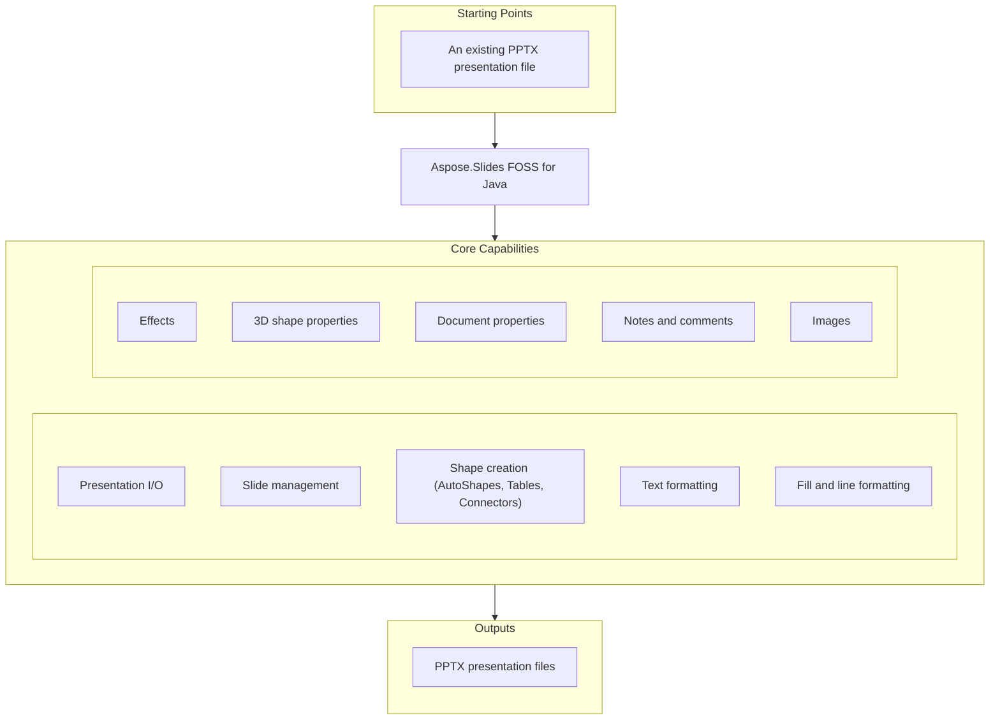

# Aspose.Slides FOSS for Java

[](https://repo1.maven.org/maven2/org/aspose/aspose-slides-foss/) [](https://openjdk.org/projects/jdk/21/) [](LICENSE) [](https://github.com/aspose-slides-foss/Aspose.Slides-FOSS-for-Java/graphs/contributors)

[](https://products.aspose.org/slides/java/)

Aspose.Slides FOSS for Java is the official, free, open-source Java library from Aspose.Slides
for creating, reading, and editing PowerPoint (`.pptx`) presentations, providing an
Aspose.Slides-compatible API. It supports full round-trip fidelity: unknown XML parts encountered
during load are preserved verbatim on save, so opening and re-saving a file never strips content
this library does not yet understand.

## Navigation

- [At a Glance](#at-a-glance)
- [Key Capabilities](#key-capabilities)
- [Installation](#installation)
- [Quick Start](#quick-start)
- [Additional Examples](#additional-examples)
- [API Reference](#api-reference)
- [Documentation & Resources](#documentation--resources)
- [Scope and Limitations](#scope-and-limitations)
- [Development and Testing](#development-and-testing)
- [License](#license)

## At a Glance



## Key Capabilities

Features cover the full authoring surface — from presentation I/O and shape creation to 3D
properties, document metadata, notes, and comments:

- Open, create, and save `.pptx` files with full round-trip fidelity.
- Add, remove, clone, reorder, and iterate slides (`ISlideCollection`).
- Create shapes — AutoShapes, PictureFrames, Tables, and Connectors — via `IShapeCollection`.
- Format text with `TextFrame`, `Paragraph`, and `Portion`, including character, paragraph, text-frame, and bullet formatting (`IBulletFormat`, including numbered-bullet styles).
- Apply solid, gradient, pattern, and picture fills; configure line width, dash style, arrows, join style, and alignment (`ILineFormat`).
- Add effects — outer shadow, glow, soft edge, blur, reflection, and inner shadow.
- Configure 3D shape properties — extrusion depth/height, top and bottom bevels, contour and extrusion color, camera and light-rig presets, and material type (`IThreeDFormat`, via `IShape.getThreeDFormat()`).
- Manage core, application, and custom document properties.
- Add per-slide notes with header/footer management, and threaded comments with authors, timestamps, and positions.
- Embed images from a file, byte array, or stream.

## Installation

Add the dependency to your `pom.xml`:

```xml
<dependency>
  <groupId>org.aspose</groupId>
  <artifactId>aspose-slides-foss</artifactId>
  <version>26.7.0</version>
</dependency>
```

Gradle (Groovy DSL):

```groovy
implementation 'org.aspose:aspose-slides-foss:26.7.0'
```

The library targets Java 21. The public API is imported from `org.aspose.slides.foss.*`
(save-format constants live in `org.aspose.slides.foss.export.SaveFormat`).

## Quick Start

Open an existing presentation and re-save it:

```java
import org.aspose.slides.foss.Presentation;
import org.aspose.slides.foss.export.SaveFormat;

try (Presentation prs = new Presentation("input.pptx")) {
    System.out.println("Slides: " + prs.getSlides().size());
    prs.save("output.pptx", SaveFormat.PPTX);
}
```

Create a new presentation and add a shape with text:

```java
import org.aspose.slides.foss.IAutoShape;
import org.aspose.slides.foss.ISlide;
import org.aspose.slides.foss.Presentation;
import org.aspose.slides.foss.ShapeType;
import org.aspose.slides.foss.export.SaveFormat;

try (Presentation prs = new Presentation()) {
    ISlide slide = prs.getSlides().get(0);
    IAutoShape shape = slide.getShapes().addAutoShape(ShapeType.RECTANGLE, 50, 50, 300, 100);
    shape.addTextFrame("Hello, world!");
    prs.save("shapes.pptx", SaveFormat.PPTX);
}
```

## Additional Examples

The Usage Examples below build directly on the Quick Start snippet above, covering tables,
text formatting, connectors, fills, speaker notes, comments, and document properties.

### Table

```java
import org.aspose.slides.foss.*;
import org.aspose.slides.foss.export.SaveFormat;

try (Presentation prs = new Presentation()) {
    ITable table = prs.getSlides().get(0).getShapes()
            .addTable(50, 50, new double[]{120, 120, 120}, new double[]{40, 40});
    table.getRows().get(0).get(0).getTextFrame().setText("Name");
    table.getRows().get(0).get(1).getTextFrame().setText("Value");
    prs.save("table.pptx", SaveFormat.PPTX);
}
```

<details>
<summary>View Additional Examples</summary>

### Text Formatting

```java
import org.aspose.slides.foss.*;
import org.aspose.slides.foss.drawing.Color;
import org.aspose.slides.foss.export.SaveFormat;

try (Presentation prs = new Presentation()) {
    IAutoShape shape = prs.getSlides().get(0).getShapes()
            .addAutoShape(ShapeType.RECTANGLE, 50, 50, 400, 150);
    shape.getTextFrame().setText("Formatted text");

    IPortionFormat fmt = shape.getTextFrame().getParagraphs().get(0)
            .getPortions().get(0).getPortionFormat();
    fmt.setFontHeight(24);
    fmt.setFontBold(NullableBool.TRUE);
    fmt.getFillFormat().setFillType(FillType.SOLID);
    fmt.getFillFormat().getSolidFillColor().setColor(Color.fromArgb(255, 0, 70, 127));

    prs.save("formatted-text.pptx", SaveFormat.PPTX);
}
```

### Connector

```java
import org.aspose.slides.foss.*;
import org.aspose.slides.foss.export.SaveFormat;

try (Presentation prs = new Presentation()) {
    ISlide slide = prs.getSlides().get(0);
    IAutoShape box1 = slide.getShapes().addAutoShape(ShapeType.RECTANGLE, 50, 100, 150, 60);
    IAutoShape box2 = slide.getShapes().addAutoShape(ShapeType.RECTANGLE, 350, 100, 150, 60);
    IConnector conn = slide.getShapes().addConnector(ShapeType.BENT_CONNECTOR3, 0, 0, 10, 10);
    conn.setStartShapeConnectedTo(box1);
    conn.setStartShapeConnectionSiteIndex(3);
    conn.setEndShapeConnectedTo(box2);
    conn.setEndShapeConnectionSiteIndex(1);
    prs.save("connector.pptx", SaveFormat.PPTX);
}
```

### Fill

```java
import org.aspose.slides.foss.*;
import org.aspose.slides.foss.drawing.Color;
import org.aspose.slides.foss.export.SaveFormat;

try (Presentation prs = new Presentation()) {
    IAutoShape shape = prs.getSlides().get(0).getShapes()
            .addAutoShape(ShapeType.RECTANGLE, 50, 50, 300, 150);
    shape.getFillFormat().setFillType(FillType.SOLID);
    shape.getFillFormat().getSolidFillColor().setColor(Color.fromArgb(255, 30, 120, 200));
    prs.save("fill.pptx", SaveFormat.PPTX);
}
```

### Speaker Notes

```java
import org.aspose.slides.foss.*;
import org.aspose.slides.foss.export.SaveFormat;

try (Presentation prs = new Presentation()) {
    INotesSlide notes = prs.getSlides().get(0).getNotesSlideManager().addNotesSlide();
    notes.getNotesTextFrame().setText("Speaker notes go here.");
    prs.save("notes.pptx", SaveFormat.PPTX);
}
```

### Comments

```java
import org.aspose.slides.foss.*;
import org.aspose.slides.foss.drawing.PointF;
import org.aspose.slides.foss.export.SaveFormat;

import java.time.LocalDateTime;

try (Presentation prs = new Presentation()) {
    ICommentAuthor author = prs.getCommentAuthors().addAuthor("Jane Smith", "JS");
    ISlide slide = prs.getSlides().get(0);
    author.getComments().addComment("Review this slide", slide,
            new PointF(2.0f, 2.0f), LocalDateTime.now());
    prs.save("comments.pptx", SaveFormat.PPTX);
}
```

### Document Properties

```java
import org.aspose.slides.foss.*;
import org.aspose.slides.foss.export.SaveFormat;

try (Presentation prs = new Presentation()) {
    prs.getDocumentProperties().setTitle("Q1 Results");
    prs.getDocumentProperties().setAuthor("Finance Team");
    prs.getDocumentProperties().setCustomPropertyValue("Version", 3);
    prs.save("deck.pptx", SaveFormat.PPTX);
}
```

</details>

## API Reference

The public entry point is `Presentation`, and the surface is built around `ISlide`,
`IShapeCollection`, `IShape` (concrete shapes such as `IAutoShape`, `ITable`, and `IConnector`),
and `ITextFrame`. The classes below cover the most commonly used parts of the surface.

<details>
<summary>View the Supported Public API Surface</summary>

### Foss

| Class | Description |
|---|---|
| `AdjustValue` | Represents a single geometry adjustment value backed by an OOXML `<a:gd>` element. |
| `AdjustValueCollection` | Represents a collection of shape's adjustments backed by an OOXML `<a:avLst>` element. |
| `AutoShape` | Represents an AutoShape. |
| `BaseHandoutNotesSlideHeaderFooterManager` | Represents abstract base class for handout and notes slide header/footer managers. |
| `BasePortionFormat` | Common text portion formatting properties. |
| `BaseShapeLock` | Base class for shape locks. |
| `BaseSlide` | Represents common data for all slide types. |
| `Blur` | Represents a Blur effect that is applied to the entire shape, including its fill. |
| `BulletFormat` | Represents paragraph bullet formatting properties. |
| `Camera` | Represents 3D camera settings. |
| `Cell` | Represents a cell of a table. |
| `CellCollection` | Represents a collection of cells. |
| `CellFormat` | Represents format of a table cell. |
| `Color` | Immutable value type representing an ARGB color. |
| `ColorFormat` | Represents a color used in a presentation. |
| `Column` | Represents a column in a table. |
| `ColumnCollection` | Represents collection of columns in a table. |
| `ColumnFormat` | Represents formatting properties of a table column. |
| `Comment` | Represents a comment on a presentation slide. |
| `CommentAuthor` | Represents an author of comments. |
| `CommentAuthorCollection` | Represents a collection of comment authors in a presentation. |
| `CommentCollection` | Represents a collection of comments of one author. |
| `Connector` | Represents a connector shape. |
| `ConnectorLock` | Represents the lock settings for a connector shape. |
| `DocumentProperties` | Represents properties of a presentation. |
| `EffectFormat` | Represents effect formatting properties of a shape. |
| `FillFormat` | Represents fill formatting properties. |
| `FillOverlay` | Represents a Fill Overlay effect. |
| `GeometryShape` | Base class for shapes with geometry, backed by an OOXML shape element. |
| `GlobalLayoutSlideCollection` | Represents a collection of all layout slides in presentation. |
| `Glow` | Represents a glow effect backed by an OOXML `<a:glow>` element. |
| `GradientFormat` | Represents a gradient format. |
| `GradientStop` | Represents a single gradient stop. |
| `GradientStopCollection` | Represents a collection of gradient stops. |
| `GraphicalObject` | Abstract base class for graphical objects on a slide. |
| `GraphicalObjectLock` | Represents the lock settings for a graphical object shape. |
| `GroupShape` | Represents a group of shapes on a slide. |
| `HeadingPair` | Represents a heading pair indicating a grouping of document parts. |
| `Image` | Represents a raster or vector image. |
| `ImageCollection` | Represents a collection of images in a presentation. |
| `ImageTransformOperation` | Represents an image-transform operation applied to an image effect. |
| `Images` | Methods to instantiate and work with IImage. |
| `InnerShadow` | Represents an inner shadow effect backed by an OOXML `<a:innerShdw>` element. |
| `LayoutSlide` | Represents a layout slide. |
| `LayoutSlideCollection` | Represents a collection of layout slides. |
| `LightRig` | Represents a light rig for 3D scene. |
| `LineFillFormat` | Represents the fill format of a line. |
| `LineFormat` | Represents format of a line. |
| `MasterLayoutSlideCollection` | Represents a collection of all layout slides of the defined master slide. |
| `MasterSlide` | Represents a master slide in a presentation. |
| `MasterSlideCollection` | Represents a collection of master slides in a presentation. |
| `NotesSize` | Represents the size of a notes slide. |
| `NotesSlide` | Represents a notes slide in a presentation. |
| `NotesSlideHeaderFooterManager` | Represents manager which holds behavior of the notes slide placeholders, including header placeholder. |
| `NotesSlideManager` | Manages the notes slide for a given slide. |
| `OuterShadow` | Represents an outer shadow effect backed by an OOXML `<a:outerShdw>` element. |
| `PPImage` | Represents an image in a presentation. |
| `PVIObject` | Base class for property-value-inheritance (PVI) objects that are bound to a slide and presentation. |
| `Paragraph` | Represents a text paragraph. |
| `ParagraphCollection` | Represents a collection of paragraphs. |
| `ParagraphFormat` | Represents paragraph formatting properties. |
| `PatternFormat` | Represents a pattern fill format. |
| `Picture` | Represents a picture in a presentation. |
| `PictureFillFormat` | Represents a picture fill style. |
| `PictureFrame` | Represents a frame with a picture inside. |
| `PictureFrameLock` | Represents the locks for a PictureFrame. |
| `PointF` | Represents a 2D point with float coordinates. |
| `Portion` | Represents a text portion (run) within a paragraph. |
| `PortionCollection` | Represents a collection of text portions within a paragraph. |
| `PortionFormat` | Represents text portion formatting properties. |
| `PptCorruptFileException` | Exception thrown when a PPT file is corrupt and cannot be processed. |
| `PptException` | Base exception for PPT-related errors. |
| `PptReadException` | Exception thrown when a PPT file cannot be read. |
| `Presentation` | Represents a PowerPoint presentation. |
| `PresetShadow` | Represents a preset shadow effect backed by an OOXML `<a:prstShdw>` element. |
| `RectangleF` | Represents a rectangle defined by position and size using floating-point coordinates. |
| `Reflection` | Represents a reflection effect backed by an OOXML `<a:reflection>` element. |
| `Row` | Represents a row in a table. |
| `RowCollection` | Represents a collection of rows in a table. |
| `RowFormat` | Represents formatting properties of a table row. |
| `Shape` | Abstract base class for shapes on a slide. |
| `ShapeBevel` | Contains the properties of shape's main face relief (bevel). |
| `ShapeCollection` | Represents a collection of shapes on a slide. |
| `ShapeFrame` | Represents an immutable shape frame with position, size, rotation, and flip properties. |
| `ShapeStyle` | Represents a shape's style reference. |
| `Size` | Represents a 2D size with integer dimensions. |
| `SizeF` | Represents a 2D size with float dimensions. |
| `Slide` | Represents a slide in a presentation. |
| `SlideCollection` | Represents a collection of slides in a presentation. |
| `SoftEdge` | Represents a soft edge effect backed by an OOXML `<a:softEdge>` element. |
| `Table` | Represents a table shape on a slide. |
| `TableFormat` | Represents format of a table. |
| `TextFrame` | Represents a text frame containing paragraphs. |
| `TextFrameFormat` | Contains the TextFrame's formatting properties. |
| `ThreeDFormat` | Represents 3-D formatting properties for a shape. |

#### Interfaces

| Interface | Description |
|---|---|
| `IAdjustValue` | Represents a geometry shape adjustment value. |
| `IAdjustValueCollection` | Represents a collection of shape adjustment values. |
| `IAutoShape` | Represents an AutoShape. |
| `IBaseHandoutNotesSlideHeaderFooterManager` | Represents base interface for handout and notes slide header/footer managers. |
| `IBaseHeaderFooterManager` | Represents base interface for header/footer managers. |
| `IBasePortionFormat` | Represents common text portion formatting properties. |
| `IBaseSlide` | Represents common data for all slide types. |
| `IBaseSlideHeaderFooterManager` | Represents base interface for slide header/footer managers that manage footer, slide number, and date-time placeholders. |
| `IBlur` | Represents a Blur effect that is applied to the entire shape, including its fill. |
| `IBulkTextFormattable` | Represents an object with the possibility of bulk setting child text elements' formats. |
| `IBulletFormat` | Represents paragraph bullet formatting properties. |
| `ICamera` | Represents Camera. |
| `ICell` | Represents a cell in a table. |
| `ICellCollection` | Represents a collection of cells. |
| `ICellFormat` | Represents format of a table cell. |
| `IColorFormat` | Represents a color used in a presentation. |
| `IColumn` | Represents a column in a table. |
| `IColumnCollection` | Represents collection of columns in a table. |
| `IColumnFormat` | Represents format of a table column. |
| `IComment` | Represents a comment on a presentation slide. |
| `ICommentAuthor` | Represents a comment author in a presentation. |
| `ICommentAuthorCollection` | Represents a collection of comment authors in a presentation. |
| `ICommentCollection` | Represents a collection of comments belonging to a single author. |
| `IConnector` | Represents a connector. |
| `IConnectorLock` | Determines which operations are disabled on the parent Connector. |
| `ICustomData` | Represents custom data associated with a shape. |
| `IDocumentProperties` | Represents properties of a presentation document. |
| `IEffectFormat` | Represents effect formatting properties. |
| `IEffectParamSource` | Marker interface for objects that serve as a source of effect parameters. |
| `IFillFormat` | Represents fill formatting options. |
| `IFillOverlay` | Represents a Fill Overlay effect. |
| `IFillParamSource` | Marker interface for objects that serve as a source of fill parameters. |
| `IFontData` | Represents a font definition. |
| `IGeometryShape` | Represents a shape with geometry (preset or custom). |
| `IGlobalLayoutSlideCollection` | Represents a collection of all layout slides in a presentation. |
| `IGlow` | Represents a glow effect applied to a shape. |
| `IGradientFormat` | Represents a gradient format. |
| `IGradientStop` | Represents a gradient stop. |
| `IGradientStopCollection` | Represents a collection of gradient stops. |
| `IGraphicalObject` | Represents abstract graphical object. |
| `IGraphicalObjectLock` | Determines which operations are disabled on the parent IGraphicalObject. |
| `IGroupShape` | Represents a group of shapes on a slide. |
| `IHeadingPair` | Represents a heading pair that indicates a grouping of document parts and the number of parts in each group. |
| `IHyperlinkContainer` | Marker interface for objects that contain hyperlinks. |
| `IImage` | Represents a raster or vector image. |
| `IImageCollection` | Represents a collection of images in a presentation. |
| `IImageTransformOperation` | Represents an image-transform operation effect. |
| `IInnerShadow` | Represents an inner shadow effect applied to a shape. |
| `ILayoutSlide` | Represents a layout slide. |
| `ILayoutSlideCollection` | Represents a base class for collection of a layout slides. |
| `ILightRig` | Represents a light rig. |
| `ILineFillFormat` | Represents properties for lines filling. |
| `ILineFormat` | Represents format of a line. |
| `ILineParamSource` | Marker interface for objects that serve as a source of line parameters. |
| `ILoadOptions` | Represents options that can be used to configure how a presentation is loaded. |
| `IMasterLayoutSlideCollection` | Represents a collection of layout slides belonging to a master slide. |
| `IMasterSlide` | Represents a master slide in a presentation. |
| `IMasterSlideCollection` | Represents a collection of master slides. |
| `INotesSize` | Represents a size of notes slide. |
| `INotesSlide` | Represents a notes slide in a presentation. |
| `INotesSlideHeaderFooterManager` | Represents manager which holds behavior of the notes slide placeholders, including header placeholder. |
| `INotesSlideManager` | Manages the notes slide for a given slide. |
| `IOuterShadow` | Represents an Outer Shadow effect. |
| `IPPImage` | Represents an image in a presentation. |
| `IParagraph` | Represents a text paragraph. |
| `IParagraphCollection` | Represents a collection of paragraphs. |
| `IParagraphFormat` | Represents paragraph formatting properties. |
| `IPatternFormat` | Represents a pattern fill format. |
| `IPictureFillFormat` | Represents a picture fill style. |
| `IPictureFrame` | Represents a frame with a picture inside. |
| `IPictureFrameLock` | Determines which operations are disabled on the parent IPictureFrame. |
| `IPlaceholder` | Represents a placeholder on a slide. |
| `IPortion` | Represents a portion of text inside a text paragraph. |
| `IPortionCollection` | Represents a collection of text portions. |
| `IPortionFormat` | Represents formatting properties of a text portion with no inheritance applied. |
| `IPresentation` | Represents a presentation document. |
| `IPresentationComponent` | Represents a component of a presentation. |
| `IPresetShadow` | Represents a Preset Shadow effect. |
| `IReflection` | Represents a reflection effect applied to a shape. |
| `IRow` | Represents a row in a table. |
| `IRowCollection` | Represents a collection of rows in a table. |
| `IRowFormat` | Represents format of a table row. |
| `ISaveOptions` | Options that control how a presentation is saved. |
| `ISection` | Represents a section in a presentation. |
| `IShape` | Represents a shape on a slide. |
| `IShapeBevel` | Represents properties of shape's main face relief. |
| `IShapeCollection` | Represents a collection of shapes. |
| `IShapeFrame` | Represents shape frame's properties. |
| `IShapeStyle` | Represents a shape's style reference. |
| `ISlide` | Represents a slide in a presentation. |
| `ISlideCollection` | Represents a collection of slides in a presentation. |
| `ISlideComponent` | Represents a component of a slide. |
| `ISlidesPicture` | Represents a picture in a presentation. |
| `ISoftEdge` | Represents a Soft Edge effect. |
| `ITable` | Represents a table on a slide. |
| `ITableFormat` | Represents format of a table. |
| `ITextFrame` | Represents a TextFrame. |
| `ITextFrameFormat` | Represents format of a text frame. |
| `IThemeable` | Represents objects that can be themed. |
| `IThreeDFormat` | Represents 3-D properties. |
| `IThreeDParamSource` | Marker interface for objects that serve as a source of 3D parameters. |

#### Enumerations

| Enumeration | Description |
|---|---|
| `BevelPresetType` | Constants which define 3D bevel of shape. |
| `BulletType` | Represents the type of the extended bullets. |
| `CameraPresetType` | Constants which define camera preset type. |
| `ColorType` | Represents different color modes. |
| `FillBlendMode` | Determines blend mode. |
| `FillType` | Specifies the interior fill type of various visual objects. |
| `FontAlignment` | Represents vertical font alignment. |
| `GradientDirection` | Represents the gradient style. |
| `GradientShape` | Represents the shape of gradient fill. |
| `LightRigPresetType` | Constants which define light preset types. |
| `LightingDirection` | Constants which define light directions. |
| `LineAlignment` | Represents the lines alignment type. |
| `LineArrowheadLength` | Represents the length of an arrowhead. |
| `LineArrowheadStyle` | Represents the style of an arrowhead. |
| `LineArrowheadWidth` | Represents the width of an arrowhead. |
| `LineCapStyle` | Represents the line cap style. |
| `LineDashStyle` | Represents the line dash style. |
| `LineJoinStyle` | Represents the lines join style. |
| `LineStyle` | Represents the style of a line. |
| `MaterialPresetType` | Constants which define material of shape. |
| `NullableBool` | Represents triple boolean values. |
| `NumberedBulletStyle` | Represents the style of the numbered bullets. |
| `PatternStyle` | Represents the pattern style. |
| `PictureFillMode` | Determines how picture will fill area. |
| `PresetColor` | Represents predefined color presets. |
| `PresetShadowType` | Represents a preset for a shadow effect. |
| `RectangleAlignment` | Defines 2-dimension alignment. |
| `SaveFormat` | Constants which define the format of a saved presentation. |
| `SchemeColor` | Represents colors in a color scheme. |
| `ShapeType` | Represents preset geometry of geometry shapes. |
| `SlideLayoutType` | Represents the slide layout type. |
| `SourceFormat` | Represents source file format. |
| `TableStylePreset` | Represents builtin table styles. |
| `TextAlignment` | Represents different text alignment styles. |
| `TextAnchorType` | text box alignment within a text area. |
| `TextAutofitType` | Represents text autofit mode. |
| `TextCapType` | Represents the type of text capitalisation. |
| `TextShapeType` | Represents text wrapping shape. |
| `TextStrikethroughType` | Represents the type of text strikethrough. |
| `TextUnderlineType` | Represents the type of text underline. |
| `TextVerticalType` | Determines vertical writing mode for a text. |
| `TileFlip` | Defines tile flipping mode. |

---

#### Detailed Member Reference

### Presentation and Slides

- `Presentation` — `Presentation()`, `Presentation(path)`, `Presentation(in)`
  - `getSlides() -> ISlideCollection`, `getLayoutSlides()`, `getMasters()`, `getImages()`
  - `getDocumentProperties() -> IDocumentProperties`, `getCommentAuthors() -> ICommentAuthorCollection`
  - `save(path)`, `save(path, format)`, `save(path, format, options)`
  - `dispose()`, `close()`
- `ISlideCollection` — `get(index)`, `size()`, `addEmptySlide(layout)`, `insertEmptySlide(index, layout)`, `addClone(sourceSlide)`, `removeAt(index)`, iterable
- `ISlide` / `Slide` — `getShapes() -> IShapeCollection`, `getName/setName`, `getLayoutSlide/setLayoutSlide`, `getNotesSlideManager()`, `getSlideComments(author)`

### Shapes

- `IShapeCollection` — `addAutoShape(shapeType, x, y, width, height) -> IAutoShape`, `addConnector(...)`, `addPictureFrame(...)`, `addTable(x, y, colWidths, rowHeights) -> ITable`, `get(index)`, `removeAt(index)`
- `IAutoShape` — `getTextFrame() -> ITextFrame`, `addTextFrame(text) -> ITextFrame`, `getShapeType/setShapeType`, `getFillFormat()`
- `ITextFrame` — `getParagraphs() -> IParagraphCollection`, `getText/setText`, `getTextFrameFormat()`
- `IParagraph` — `getPortions() -> IPortionCollection`
- `IPortion` — `getPortionFormat() -> IPortionFormat`
- `IPortionFormat` — `setFontHeight(value)`, `setFontBold(NullableBool)`, `getFillFormat() -> IFillFormat`
- `ITable` — `getRows() -> IRowCollection`, `getColumns() -> IColumnCollection`, `mergeCells(cell1, cell2, allowSplitting)`
- `IConnector` — `setStartShapeConnectedTo(shape)`, `setStartShapeConnectionSiteIndex(index)`, `setEndShapeConnectedTo(shape)`, `setEndShapeConnectionSiteIndex(index)`

### Formatting

- `FillType` — `SOLID`, `GRADIENT`, `PATTERN`, `PICTURE`, `NO_FILL` (fill-type enum)
- `ShapeType` — includes `RECTANGLE`, `BENT_CONNECTOR3`, and the standard AutoShape geometry set
- `SaveFormat` — `PPT`, `PDF`, `XPS`, `PPTX`, `PPSX`, `TIFF`, `ODP`, `PPTM`
- `IBulletFormat` — `getType/setType(BulletType)`, `getChar/setChar`, `getFont/setFont`,
  `getHeight/setHeight`, `getColor()`, `getNumberedBulletStartWith/setNumberedBulletStartWith`,
  `getNumberedBulletStyle/setNumberedBulletStyle`; `BulletType`, `NumberedBulletStyle`
- `ILineFormat` — width, dash style, arrows; `LineJoinStyle` (`ROUND`, `BEVEL`, `MITER`),
  `LineAlignment` (`CENTER`, `INSET`)

### 3D

- `IThreeDFormat` (via `IShape.getThreeDFormat()`) — `getContourWidth/setContourWidth`,
  `getExtrusionHeight/setExtrusionHeight`, `getDepth/setDepth`, `getBevelTop()`, `getBevelBottom()`,
  `getContourColor()`, `getExtrusionColor()`, `getCamera()`, `getLightRig()`, `getMaterial/setMaterial`
- `IShapeBevel` — bevel geometry; `BevelPresetType`
- `ICamera` — `CameraPresetType`
- `ILightRig` — `LightRigPresetType`
- `MaterialPresetType`

### Comments, Notes, and Properties

- `ICommentAuthorCollection` — `addAuthor(name, initials) -> ICommentAuthor`
- `ICommentAuthor` — `getComments() -> ICommentCollection`
- `ICommentCollection` — `addComment(text, slide, position, createdTime) -> IComment`
- `INotesSlideManager` — `addNotesSlide() -> INotesSlide`, `getNotesSlide()`
- `INotesSlide` — `getNotesTextFrame() -> ITextFrame`, `getHeaderFooterManager()`
- `IDocumentProperties` — `setTitle`, `setAuthor`, `setCustomPropertyValue(name, value)`

The full surface totals 276 public classes. See the [full API reference](#documentation--resources)
below for every type.

</details>

## Documentation & Resources

Links below cover getting-started docs, task-focused how-tos, the full API reference, the
contributor guide, and the GitHub repository.

- **[Getting started guide](https://docs.aspose.org/slides/java/)** — installation, walkthroughs, and feature guides for this library.
- **[How-to guides & FAQ](https://kb.aspose.org/slides/java/)** — task-focused answers for common presentation-processing questions.
- **[Full API reference](https://reference.aspose.org/slides/java/)** — the complete, browsable reference for all 276 public classes.
- **[GitHub Repository](https://github.com/aspose-slides-foss/Aspose.Slides-FOSS-for-Java)** — browse the source and project history.
- **[Contributor guide](AGENTS.md)** — architecture notes and conventions for contributors.
- Found a bug or have a feature request? [Open an issue](https://github.com/aspose-slides-foss/Aspose.Slides-FOSS-for-Java/issues) on GitHub.

## Scope and Limitations

- This edition reads and writes `.pptx` only — there is no export to PDF, HTML, SVG, images, or
  other non-PPTX formats, and no support for charts, SmartArt, OLE objects, mathematical text,
  animations, slide transitions, VBA macros, digital signatures, or hyperlinks/action settings.
- Passing a non-PPTX `SaveFormat` to `Presentation.save(path, format)` does not throw or report
  an error — it silently writes a PPTX/OOXML package to the given path regardless of the
  requested format. Always pass `SaveFormat.PPTX` (the only format this edition actually
  implements) and rely on the `.pptx` extension.
- `Table.mergeCells()` requires an XML-backed table.
- `Presentation.save(ISaveOptions)` (the options-only overload, with no output path or stream)
  is not implemented.
- Unknown XML parts encountered during load are preserved verbatim on save.

These limitations don't apply to
[Aspose.Slides for Java — Enterprise Edition](https://products.aspose.com/slides/java/), which
adds non-PPTX export, charts, animations, and the broader feature set.

## Development and Testing

This is a Maven project targeting Java 21, using JUnit 5 and AssertJ. Unit tests live under
`src/test`, and integration tests under `tests/integration` are wired in via the
`build-helper-maven-plugin` as an additional test source root, so both run together:

```bash
mvn clean test
```

## License

This project is licensed under the [MIT License](LICENSE). The MIT License permits use, copying,
modification, distribution, sublicensing, and commercial use, provided its copyright and
permission notice are retained. The software is provided without warranty.
