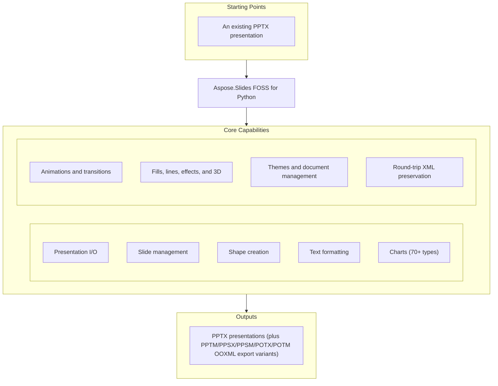

# Aspose.Slides FOSS for Python

[](https://pypi.org/project/aspose-slides-foss/) [](https://www.python.org/downloads/) [](LICENSE) [](https://github.com/aspose-slides-foss/Aspose.Slides-FOSS-for-Python/graphs/contributors)

[](https://products.aspose.org/slides/python/)

Aspose.Slides FOSS for Python is the official open-source, MIT-licensed, pure-Python library
by Aspose.Slides for creating, reading, and editing PowerPoint (`.pptx`) presentations. It
requires no Microsoft Office installation and has a single runtime dependency, `lxml`.

## Navigation

- [At a Glance](#at-a-glance)
- [Key Capabilities](#key-capabilities)
- [Installation](#installation)
- [Quick Start](#quick-start)
- [Additional Examples](#additional-examples)
- [API Reference](#api-reference)
- [Documentation & Resources](#documentation--resources)
- [Scope and Limitations](#scope-and-limitations)
- [Development and Testing](#development-and-testing)
- [License](#license)

## At a Glance



## Key Capabilities

Features cover the full authoring surface — from presentation I/O and shape creation to
charts, animations, transitions, and 3D formatting.

- Open and create PowerPoint `.pptx` presentations with full round-trip fidelity through
  `Presentation`, always used as a context manager for reliable resource cleanup.
- Add, remove, clone, and iterate slides through `Presentation.slides`.
- Insert AutoShapes, PictureFrames, Tables, Connectors, and GroupShapes via `Slide.shapes`.
- Format text at the run level with `TextFrame`, `Paragraph`, and `Portion` — font, bold,
  italic, size, color, and bullets.
- Build charts with 70+ chart types, series, categories, axes, trendlines, error bars,
  legends, data labels, markers, and series groups through `Chart` and its backing
  `ChartDataWorkbook`.
- Apply shape and text-level animations and 55+ slide transition types with per-slide
  timing and advance settings, including morph support.
- Style shapes with solid, gradient, pattern, and picture fills, line formatting (width,
  dash style, arrows, join style, and alignment via `LineFormat`), and effects (outer
  shadow, glow, soft edge, blur, reflection, inner shadow), plus 3D bevel, camera, light
  rig, material, and extrusion-depth properties.
- Manage themes, master/override slides, per-slide and master backgrounds, document
  properties, per-slide speaker notes with header/footer management, and threaded comments
  with authors, timestamps, and positions.
- Embed images from a file, byte stream, or in-memory stream via `Images`.
- Unknown XML parts encountered during load are preserved verbatim on save, so
  round-tripping never destroys content the library does not yet understand.

## Installation

```bash
python -m pip install aspose-slides-foss
```

The package requires Python 3.10 or later. The only runtime dependency, `lxml`, is
installed automatically.

## Quick Start

Open an existing presentation and re-save it:

```python
import aspose.slides_foss as slides
from aspose.slides_foss.export import SaveFormat

with slides.Presentation("input.pptx") as prs:
    print(f"Slides: {len(prs.slides)}")
    prs.save("output.pptx", SaveFormat.PPTX)
```

Create a new presentation and add a shape:

```python
import aspose.slides_foss as slides
from aspose.slides_foss.export import SaveFormat

with slides.Presentation() as prs:
    slide = prs.slides[0]

    shape = slide.shapes.add_auto_shape(
        slides.ShapeType.RECTANGLE, 50, 50, 400, 150
    )
    shape.add_text_frame("Hello, Aspose.Slides!")

    prs.save("new.pptx", SaveFormat.PPTX)
```

## Additional Examples

The usage examples below build directly on the Quick Start snippet above. Runnable tests
for these APIs live under `tests/` in the repository, and
[`agents.md`](agents.md) documents a compact quick-reference for automated and AI-agent
use. The most common operations are collected below.

### Text Formatting and Fill

```python
from aspose.slides_foss import ShapeType, NullableBool, FillType
from aspose.slides_foss.drawing import Color
import aspose.slides_foss as slides
from aspose.slides_foss.export import SaveFormat

with slides.Presentation() as prs:
    shape = prs.slides[0].shapes.add_auto_shape(ShapeType.RECTANGLE, 50, 50, 400, 150)
    tf = shape.add_text_frame("Formatted text")
    fmt = tf.paragraphs[0].portions[0].portion_format
    fmt.font_height = 24
    fmt.font_bold = NullableBool.TRUE
    fmt.fill_format.fill_type = FillType.SOLID
    fmt.fill_format.solid_fill_color.color = Color.from_argb(255, 0, 70, 127)
    prs.save("text.pptx", SaveFormat.PPTX)
```

<details>
<summary>View Additional Examples</summary>

### Table

```python
import aspose.slides_foss as slides
from aspose.slides_foss.export import SaveFormat

with slides.Presentation() as prs:
    table = prs.slides[0].shapes.add_table(50, 50, [120.0, 120.0, 120.0], [40.0, 40.0])
    table.rows[0][0].text_frame.text = "Name"
    table.rows[0][1].text_frame.text = "Value"
    prs.save("table.pptx", SaveFormat.PPTX)
```

### Connector

```python
from aspose.slides_foss import ShapeType
import aspose.slides_foss as slides
from aspose.slides_foss.export import SaveFormat

with slides.Presentation() as prs:
    slide = prs.slides[0]
    box1 = slide.shapes.add_auto_shape(ShapeType.RECTANGLE, 50, 100, 150, 60)
    box2 = slide.shapes.add_auto_shape(ShapeType.RECTANGLE, 350, 100, 150, 60)
    conn = slide.shapes.add_connector(ShapeType.BENT_CONNECTOR3, 0, 0, 10, 10)
    conn.start_shape_connected_to = box1
    conn.start_shape_connection_site_index = 3  # right
    conn.end_shape_connected_to = box2
    conn.end_shape_connection_site_index = 1    # left
    prs.save("connector.pptx", SaveFormat.PPTX)
```

### Notes and Comments

```python
from datetime import datetime
from aspose.slides_foss.drawing import PointF
import aspose.slides_foss as slides
from aspose.slides_foss.export import SaveFormat

with slides.Presentation() as prs:
    notes = prs.slides[0].notes_slide_manager.add_notes_slide()
    notes.notes_text_frame.text = "Speaker notes go here."

    author = prs.comment_authors.add_author("Jane Smith", "JS")
    author.comments.add_comment("Review this slide", prs.slides[0], PointF(2.0, 2.0), datetime.now())

    prs.save("notes-and-comments.pptx", SaveFormat.PPTX)
```

### Document Properties

```python
import aspose.slides_foss as slides
from aspose.slides_foss.export import SaveFormat

with slides.Presentation() as prs:
    prs.document_properties.title = "Q1 Results"
    prs.document_properties.author = "Finance Team"
    prs.document_properties.set_custom_property_value("Version", 3)
    prs.save("deck.pptx", SaveFormat.PPTX)
```

### Chart From Scratch

```python
from aspose.slides_foss.charts import ChartType
import aspose.slides_foss as slides
from aspose.slides_foss.export import SaveFormat

with slides.Presentation() as prs:
    slide = prs.slides[0]

    # Pass has_default_data=False to start with an empty workbook
    chart = slide.shapes.add_chart(ChartType.CLUSTERED_COLUMN, 50, 50, 600, 400, False)
    chart.chart_title.add_text_frame_for_overriding("Quarterly Sales")

    cd = chart.chart_data
    wb = cd.chart_data_workbook  # embedded XLSX workbook backing the chart

    cd.series.clear()
    cd.categories.clear()

    for row, name in enumerate(["Q1", "Q2", "Q3", "Q4"], start=1):
        cd.categories.add(wb.get_cell(0, row, 0, name))

    s1 = cd.series.add(wb.get_cell(0, 0, 1, "Revenue"), chart.type)
    for row, value in enumerate([1200, 1500, 1800, 2100], start=1):
        s1.data_points.add_data_point_for_bar_series(wb.get_cell(0, row, 1, value))

    prs.save("chart.pptx", SaveFormat.PPTX)
```

`wb.get_cell(worksheet_index, row, column, value)` writes the value to the embedded XLSX
and returns a cell reference that the chart series and categories bind to.

### Slide Transition

```python
from aspose.slides_foss.slideshow import TransitionType
import aspose.slides_foss as slides
from aspose.slides_foss.export import SaveFormat

with slides.Presentation() as prs:
    slide = prs.slides[0]
    slide.slide_show_transition.type = TransitionType.CIRCLE
    slide.slide_show_transition.advance_on_click = True
    slide.slide_show_transition.advance_after_time = 3000  # ms
    prs.save("transition.pptx", SaveFormat.PPTX)
```

### Group Shape

```python
from aspose.slides_foss import ShapeType
import aspose.slides_foss as slides
from aspose.slides_foss.export import SaveFormat

with slides.Presentation() as prs:
    slide = prs.slides[0]
    group = slide.shapes.add_group_shape()
    group.shapes.add_auto_shape(ShapeType.RECTANGLE, 300, 100, 100, 100)
    group.shapes.add_auto_shape(ShapeType.RECTANGLE, 500, 100, 100, 100)
    group.name = "TwoRectangles"
    prs.save("group.pptx", SaveFormat.PPTX)
```

</details>

## API Reference

The library exposes a `Presentation` API built around `Presentation`, `Slide`, `Shape`,
`TextFrame`, `Paragraph`, and `Portion` — the same conceptual model PowerPoint itself uses.

<details>
<summary>View the Supported Public API Surface</summary>

### Core API

| Class | Description |
|---|---|
| `AdjustValue` | Represents a geometry shape's adjustment value. |
| `AdjustValueCollection` | Reprasents a collection of shape's adjustments. |
| `AutoShape` | Represents an AutoShape. |
| `Background` | Represents background of a slide. |
| `BaseHandoutNotesSlideHeaderFooterManager` | Base class for handout and notes slide header/footer placeholder managers (see `NotesSlideHeaderFooterManager`). |
| `BasePortionFormat` | Common text portion formatting properties. |
| `BaseShapeLock` | Base class for shape lock objects, exposing `no_locks` (true when every lock flag is disabled). |
| `BaseSlide` | Represents common data for all slide types. |
| `BulletFormat` | Represents paragraph bullet formatting properties. |
| `Camera` | Represents Camera. |
| `Cell` | Represents a cell of a table. |
| `CellCollection` | Represents a collection of cells. |
| `CellFormat` | Represents format of a table cell. |
| `ColorFormat` | Represents a color used in a presentation. |
| `Column` | Represents a column in a table. |
| `ColumnCollection` | Represents collection of columns in a table. |
| `Comment` | Represents a comment on a slide. |
| `CommentAuthor` | Represents an author of comments. |
| `CommentAuthorCollection` | Represents a collection of comment authors. |
| `CommentCollection` | Represents a collection of comments of one author. |
| `Connector` | Represents a connector. |
| `DocumentProperties` | Represents properties of a presentation. |
| `EffectFormat` | Represents effect properties of shape. |
| `FillFormat` | Represents a fill formatting options. |
| `FontData` | Represents a font definition. |
| `Fonts` | Fonts collection. |
| `GeometryShape` | Abstract base class for all geometric shapes — adds `shape_type` and a collection of `adjustments` on top of `Shape`. |
| `GlobalLayoutSlideCollection` | Represents a collection of all layout slides in presentation. |
| `GradientFormat` | Represent a gradient format. |
| `GradientStop` | Represents a gradient format. |
| `GradientStopCollection` | Represnts a collection of gradient stops. |
| `GraphicalObject` | Abstract base class for graphical objects that carry a `graphical_object_lock` (see `GroupShape`, `PictureFrame`). |
| `GraphicalObjectLock` | Class extending BaseShapeLock. |
| `GroupShape` | Represents a group of shapes on a slide. |
| `GroupShapeLock` | Determines which operations are disabled on the parent GroupShape. |
| `HeadingPair` | Represents a 'Heading pair' property of the document. |
| `Image` | Represents a raster or vector image. |
| `ImageCollection` | Represents collection of PPImage. |
| `Images` | Methods to instantiate and work with . |
| `LayoutSlide` | Represents a layout slide. |
| `LayoutSlideCollection` | Represents a base class for collection of a layout slides. |
| `LightRig` | Represents LightRig. |
| `LineFillFormat` | Represents properties for lines filling. |
| `LineFormat` | Represents format of a line. |
| `MasterLayoutSlideCollection` | Represents a collections of all layout slides of defined master slide. |
| `MasterSlide` | Represents a master slide in a presentation. |
| `MasterSlideCollection` | Represents a collection of master slides. |
| `NotesSize` | Represents a size of notes slide. |
| `NotesSlide` | Represents a notes slide in a presentation. |
| `NotesSlideHeaderFooterManager` | Represents manager which holds behavior of the notes slide placeholders, including header placeholder. |
| `NotesSlideManager` | Notes slide manager. |
| `PPImage` | Represents an image in a presentation. |
| `PVIObject` | Encapsulates basic service infrastructure for objects can be a subject of property value inheritance. |
| `Paragraph` | Represents a paragraph of text. |
| `ParagraphCollection` | Represents a collection of a paragraphs. |
| `ParagraphFormat` | This class contains the paragraph formatting properties. |
| `PatternFormat` | Represents a pattern to fill a shape. |
| `Picture` | Represents a picture in a presentation. |
| `PictureFillFormat` | Represents a picture fill style. |
| `PictureFrame` | Represents a frame with a picture inside. |
| `PictureFrameLock` | Determines which operations are disabled on the parent PictureFrame. |
| `Portion` | Represents a portion of text inside a text paragraph. |
| `PortionCollection` | Represents a collection of portions. |
| `PortionFormat` | This class contains the text portion formatting properties. |
| `Presentation` | Represents a Microsoft PowerPoint presentation. |
| `Row` | Represents a row in a table. |
| `RowCollection` | Represents table row collection. |
| `Shape` | Represents a shape on a slide. |
| `ShapeBevel` | Contains the properties of shape's main face relief. |
| `ShapeCollection` | Represents a collection of shapes. |
| `ShapeFrame` | Represents shape frame's properties. |
| `Slide` | Represents a slide in a presentation. |
| `SlideCollection` | Represents a collection of a slides. |
| `Table` | Represents a table on a slide. |
| `TableFormat` | Represents format of a table. |
| `TextFrame` | Represents a TextFrame. |
| `TextFrameFormat` | Contains the TextFrame's formatTextFrameFormatting properties. |
| `ThreeDFormat` | Represents 3-D properties. |

#### Enumerations

| Enumeration | Description |
|---|---|
| `BackgroundType` | Defines the slide background fill source. |
| `BevelPresetType` | Constants which define 3D bevel of shape. |
| `BulletType` | Represents the type of the extended bullets. |
| `CameraPresetType` | Constants which define camera preset type. |
| `ColorType` | Represents different color modes. |
| `FillBlendMode` | Determines blend mode. |
| `FillType` | Specifies the interior fill type of various visual objects. |
| `FontAlignment` | Represents vertical font alignment. |
| `GradientDirection` | Represents the gradient style. |
| `GradientShape` | Represents the shape of gradient fill. |
| `LightRigPresetType` | Constants which define light preset types. |
| `LightingDirection` | Constants which define light directions. |
| `LineAlignment` | Represents the lines alignment type. |
| `LineArrowheadLength` | Represents the length of an arrowhead. |
| `LineArrowheadStyle` | Represents the style of an arrowhead. |
| `LineArrowheadWidth` | Represents the width of an arrowhead. |
| `LineCapStyle` | Represents the line cap style. |
| `LineDashStyle` | Represents the line dash style. |
| `LineJoinStyle` | Represents the lines join style. |
| `LineStyle` | Represents the style of a line. |
| `MaterialPresetType` | Constants which define material of shape. |
| `NullableBool` | Represents triple boolean values. |
| `NumberedBulletStyle` | Represents the style of the numbered bullets. |
| `Orientation` | Represents the orientation of a shape. |
| `PatternStyle` | Represents the pattern style. |
| `PictureFillMode` | Determines how picture will fill area. |
| `PresetColor` | Represents predefined color presets. |
| `PresetShadowType` | Represents a preset for a shadow effect. |
| `RectangleAlignment` | Defines 2-dimension allignment. |
| `SchemeColor` | Represents colors in a color scheme. |
| `ShapeType` | Represents preset geometry of geometry shapes. |
| `SlideLayoutType` | Represents the slide layout type. |
| `SourceFormat` | Represents source file format. |
| `TableStylePreset` | Represents builtin table styles. |
| `TextAlignment` | Represents different text alignment styles. |
| `TextAnchorType` | text box alignment within a text area. |
| `TextAutofitType` | Represents text autofit mode. |
| `TextCapType` | Represents the type of text capitalisation. |
| `TextShapeType` | Represents text wrapping shape. |
| `TextStrikethroughType` | Represents the type of text strikethrough. |
| `TextUnderlineType` | Represents the type of text underline. |
| `TextVerticalType` | Determines vertical writing mode for a text. |
| `TileFlip` | Defines tile flipping mode. |

### Animation

| Class | Description |
|---|---|
| `AnimationTimeLine` | Represents timeline of animation. |
| `Behavior` | Represent base class behavior of effect. |
| `BehaviorCollection` | Represents collection of behavior effects. |
| `BehaviorFactory` | Factory for creating behavior effect instances. |
| `BehaviorProperty` | Represent property types for animation behavior. |
| `BehaviorPropertyCollection` | Represents collection of behavior properties. |
| `ColorEffect` | Represent color effect behavior of effect. |
| `ColorOffset` | Represent color offset. |
| `CommandEffect` | Represent command effect behavior of effect. |
| `Effect` | Represents animation effect. |
| `FilterEffect` | Represent filter effect behavior of effect. |
| `MotionCmdPath` | Represent one command of a path. |
| `MotionEffect` | Represent motion effect behavior of effect. |
| `MotionPath` | Represent motion path. |
| `Point` | Represents animation point. |
| `PointCollection` | Represents a collection of animation points. |
| `PropertyEffect` | Represent property effect behavior of effect. |
| `RotationEffect` | Represent rotation effect behavior of effect. |
| `ScaleEffect` | Represent scale effect behavior of effect. |
| `Sequence` | Represents sequence (collection of effects). |
| `SequenceCollection` | Represents collection of interactive sequences. |
| `SetEffect` | Represent set effect behavior of effect. |
| `TextAnimation` | Represent text animation. |
| `TextAnimationCollection` | Represents collection of text animations. |
| `Timing` | Represents animation timing. |

#### Enumerations

| Enumeration | Description |
|---|---|
| `AfterAnimationType` | Represents the after animation type of an animation effect. |
| `AnimateTextType` | Represents the animate text type of an animation effect. |
| `BehaviorAccumulateType` | Represents types of accumulation of effect behaviors. |
| `BehaviorAdditiveType` | Represents additive type for effect behavior. |
| `BuildType` | Determines how text will appear on a shape during animation. |
| `ColorDirection` | Represents color direction for color effect behavior. |
| `ColorSpace` | Represents color space for color effect behavior. |
| `CommandEffectType` | Represents command effect type for command effect behavior. |
| `EffectChartMajorGroupingType` | Represents the type of an animation effect for chart's element. |
| `EffectChartMinorGroupingType` | Represents the type of an animation effect for chart's element in series or category. |
| `EffectFillType` | Represent fill types. |
| `EffectPresetClassType` | Represent effect class types. |
| `EffectRestartType` | Represent restart types for timing. |
| `EffectSubtype` | Represents subtypes of animation effect. |
| `EffectTriggerType` | Represent trigger type of effect. |
| `EffectType` | Represents the type of an animation effect. |
| `FilterEffectRevealType` | Represents filter reveal type. |
| `FilterEffectSubtype` | Represents filter effect subtypes. |
| `FilterEffectType` | Represents filter effect types. |
| `MotionCommandPathType` | Represent types of command for animation motion effect behavior. |
| `MotionOriginType` | Specifies what the origin of the motion path is relative to. |
| `MotionPathEditMode` | Specifies how the motion path moves when the target shape is moved. |
| `MotionPathPointsType` | Represent types of points in animation motion path. |
| `PropertyCalcModeType` | Represent calc mode for animation property. |
| `PropertyValueType` | Represent property value types. |

### Charts

| Class | Description |
|---|---|
| `AxesManager` | Provides access to chart axes. |
| `Axis` | Encapsulates the object that represents a chart's axis. |
| `BaseChartValue` | Base class for chart value types. |
| `Chart` | Represents a chart on a slide. |
| `ChartCategory` | Represents a chart category. |
| `ChartCategoryCollection` | Represents collection of chart categories. |
| `ChartData` | Represents data used for chart plotting. |
| `ChartDataCell` | Represents a cell in the chart data workbook. |
| `ChartDataPoint` | Represents a series data point. |
| `ChartDataPointCollection` | Represents collection of data points for a series. |
| `ChartDataWorkbook` | Provides access to the embedded Excel workbook for chart data. |
| `ChartDataWorksheet` | Represents a worksheet in the chart data workbook. |
| `ChartLinesFormat` | Represents gridlines format properties. |
| `ChartPlotArea` | Represents rectangle where chart should be plotted. |
| `ChartPortionFormat` | Chart portion formatting — wraps inside . |
| `ChartSeries` | Represents a chart series. |
| `ChartSeriesCollection` | Represents collection of chart series. |
| `ChartSeriesGroup` | Represents group of series. |
| `ChartSeriesGroupCollection` | Collection of ChartSeriesGroup objects. |
| `ChartSeriesReadonlyCollection` | Readonly view of chart series belonging to a single series group. |
| `ChartTextFormat` | Specifies default text formatting for chart text elements. |
| `ChartTitle` | Represents chart title properties. |
| `ChartWall` | Represents walls on 3D charts. |
| `DataLabel` | Represents a series data point label. |
| `DataLabelCollection` | Represents the labels of a chart series. |
| `DataLabelFormat` | Represents formatting options for DataLabel. |
| `DataSourceTypeForErrorBarsCustomValues` | Specifies types of values in ChartDataPoint.ErrorBarsCustomValues properties list. |
| `DataTable` | Represents data table properties. |
| `DoubleChartValue` | Represents a double value backed by a workbook cell or literal. |
| `ErrorBarsCustomValues` | Specifies the error bar values for a single data point. |
| `ErrorBarsFormat` | Represents error bars of chart series. |
| `Format` | Represents chart format properties (fill, line, effect, 3D). |
| `Legend` | Represents chart's legend properties. |
| `LegendEntryCollection` | Collection of legend entries. |
| `LegendEntryProperties` | Represents legend properties of a chart entry. |
| `Marker` | Represents a chart marker (symbol at data points). |
| `Rotation3D` | Represents 3D rotation of a chart. |
| `StringChartValue` | Represents a string value backed by workbook cells or literal. |
| `StringOrDoubleChartValue` | Represents a value that can be string or double, backed by a cell or literal. |
| `Trendline` | Represents a trend line of a chart series. |
| `TrendlineCollection` | Represents a collection of Trendline objects for a chart series. |

#### Enumerations

| Enumeration | Description |
|---|---|
| `AxisPositionType` | Determines a position of axis. |
| `BubbleSizeRepresentationType` | Specifies the possible ways to represent data as bubble chart sizes. |
| `CategoryAxisType` | Represents a type of a category axis. |
| `ChartDataSourceType` | Represents a type of data source of the chart. |
| `ChartType` | Represents a type of chart. |
| `CombinableSeriesTypesGroup` | Enumeration of groups of combinable series types. |
| `CrossesType` | Determines where axis will cross. |
| `DataSourceType` | Data source types. |
| `DisplayBlanksAsType` | Determines how missing data will be displayed. |
| `DisplayUnitType` | Determines multiplicity of the displayed data. |
| `ErrorBarType` | Represents type of error bar. |
| `ErrorBarValueType` | Represents type of error bar value. |
| `LayoutTargetType` | If layout of the plot area defined manually this property specifies whether to layout the plot area by its inside (not including axis and axis labels) or outside (including axis and axis labels). |
| `LegendDataLabelPosition` | Determines position of data labels. |
| `LegendPositionType` | Determines a position of legend on a chart. |
| `MarkerStyleType` | Determines form of marker on chart's data point. |
| `PieSplitType` | Represents a type of splitting points in the second pie or bar on a pie-of-pie or bar-of-pie chart. |
| `StyleType` | Represents chart style. |
| `TickLabelPositionType` | Represents the position type of tick-mark labels on the specified axis. |
| `TickMarkType` | Represents the tick mark type for the specified axis. |
| `TimeUnitType` | Represents the base unit for the category axis. |
| `TrendlineType` | Represents type of trend line. |

### Drawing

| Class | Description |
|---|---|
| `Color` | Represents an ARGB color, equivalent to System.Drawing.Color. |
| `PointF` | Represents a 2D point with float coordinates, equivalent to System.Drawing.PointF. |
| `Size` | Represents a 2D size with integer dimensions, equivalent to System.Drawing.Size. |
| `SizeF` | Represents a 2D size with float dimensions, equivalent to System.Drawing.SizeF. |

### Effects

| Class | Description |
|---|---|
| `Blur` | Represents a Blur effect that is applied to the entire shape, including its fill. |
| `FillOverlay` | Represents a Fill Overlay effect. |
| `Glow` | Represents a Glow effect, in which a color blurred outline is added outside the edges of the object. |
| `ImageTransformOperation` | Abstract base class for image/shape effect operations (`Blur`, `Glow`, `InnerShadow`, `OuterShadow`, `Reflection`, `SoftEdge`, `PresetShadow`). |
| `InnerShadow` | Represents a Inner Shadow effect. |
| `OuterShadow` | Represents an Outer Shadow effect. |
| `PresetShadow` | Represents a Preset Shadow effect. |
| `Reflection` | Represents a Reflection effect. |
| `SoftEdge` | Represents a soft edge effect. |

### Export

| Class | Description |
|---|---|
| `SaveFormat` | Constants which define the format of a saved presentation. |

### Slideshow

| Class | Description |
|---|---|
| `CornerDirectionTransition` | Corner direction slide transition effect. |
| `EightDirectionTransition` | Eight direction slide transition effect. |
| `EmptyTransition` | Empty slide transition effect. |
| `FlyThroughTransition` | Fly-through slide transition effect. |
| `GlitterTransition` | Glitter slide transition effect. |

### Theme

| Class | Description |
|---|---|
| `FillFormatCollection` | Represents the collection of fill styles. |
| `FormatScheme` | Stores theme-defined formats for the shapes. |
| `LineFormatCollection` | Represents the collection of line styles. |

---

#### Detailed Member Reference

### Presentation and Slides

- `Presentation` — `save()`, `dispose()`; properties `slides`, `notes_size`,
  `layout_slides`, `masters`, `comment_authors`, `document_properties`, `images`,
  `master_theme`, `first_slide_number`
- `Slide` — `remove()`, `get_slide_comments(author)`; properties `slide_number`, `hidden`,
  `layout_slide`, `notes_slide_manager`, `shapes`, `name`, `background`,
  `slide_show_transition`, `timeline`
- `SlideCollection` — `add_clone()`, plus standard collection operations
- `DocumentProperties` — `get_custom_property_value()`, `set_custom_property_value()`,
  `remove_custom_property(name)`; properties `title`, `subject`, `author`, `keywords`,
  `category`, `company`, `slides`, `words`, `heading_pairs`

### Shapes

- `Shape` (base) — properties `frame`, `line_format`, `three_d_format`, `effect_format`,
  `fill_format`, `rotation`, `x`, `y`, `width`, `height`, `name`, `hidden`
- `ShapeCollection` — `add_auto_shape()`, `add_connector()`, `add_group_shape()`,
  `add_picture_frame(shape_type, x, y, width, height, image)`,
  `add_table(x, y, column_widths, row_heights)`, `add_chart()`, `remove(shape)`, `clear()`
- `AutoShape`, `Connector`, `GroupShape` (`shapes`, `group_shape_lock`), `PictureFrame`,
  `Table` (`rows`, `columns`, `merge_cells(cell1, cell2, allow_splitting)`), `Column`,
  `Row`, `Cell`

### Text

- `TextFrame` — properties `paragraphs`, `text`, `text_frame_format`
- `Paragraph` — properties `portions`, `paragraph_format`, `text`
- `Portion` — property `portion_format`, `text`
- `PortionFormat` / `ParagraphFormat` / `TextFrameFormat` — font, alignment, bullet, and
  wrapping properties

### Charts

- `Chart` — `chart_data`, `chart_title`, `axes`, `plot_area`, `legend`, `type`
- `ChartData` — `series`, `categories`, `series_groups`, `chart_data_workbook`; `ChartDataWorkbook` —
  `get_cell(worksheet, row, col, value)`; `ChartDataWorksheet` — `name`, `index`
- `ChartSeries`, `ChartSeriesCollection`, `ChartCategory`, `ChartCategoryCollection`,
  `ChartDataPoint`, `Trendline`, `Legend`, `DataLabel`, `Marker`, `ChartSeriesGroup`,
  `ChartSeriesGroupCollection`
- `ChartType` — 70+ enum values (clustered column, line, pie, bar, area, scatter, and more)

### Fills, Lines, Effects, and 3D

- `FillFormat` / `FillType` (`SOLID`, `GRADIENT`, `PATTERN`, `PICTURE`, ...)
- `LineFormat`, `LineFillFormat`
- `EffectFormat` — `OuterShadow`, `InnerShadow`, `Glow`, `Blur`, `SoftEdge`, `Reflection`,
  `PresetShadow`
- `ThreeDFormat` (`depth`, `material`), `Camera`, `LightRig`, `Bevel`-related types (`ShapeBevel`)
- `Color`, `ColorFormat` — `Color.from_argb(a, r, g, b)`, named colors (`Color.dark_blue`, ...)

### Animation and Transitions

- `AnimationTimeLine`, `Sequence`, `SequenceCollection`, `Behavior`, `BehaviorCollection`,
  `BehaviorFactory`, `EffectType`
- `SlideShowTransition` (via `slide.slide_show_transition`) — `type`, `advance_on_click`,
  `advance_after_time`; `TransitionType` enum (55+ values)

### Notes, Comments, and Themes

- `NotesSlideManager` — `add_notes_slide()`, `remove_notes_slide()`
- `CommentAuthorCollection` — `add_author(name, initials)`; `CommentAuthor.comments.add_comment(text, slide, point, timestamp)`
- `Background`, `MasterSlide`, `MasterSlideCollection`, `LayoutSlide`, theme and format
  scheme types (`FormatScheme`, `SchemeColor`)

### Enums Used Throughout

- `ShapeType` (rectangle, ellipse, connectors, and more), `SaveFormat.PPTX`, `FillType`,
  `NullableBool`

</details>

## Documentation & Resources

- **[Getting started guide](https://docs.aspose.org/slides/python/)** — installation, walkthroughs, and feature guides for this library.
- **[How-to guides & FAQ](https://kb.aspose.org/slides/python/)** — task-focused answers for common PowerPoint-processing questions.
- **[Full API reference](https://reference.aspose.org/slides/python/)** — the complete, browsable reference for all 491 public types (the [API reference](#api-reference) section above covers the essentials).
- **[Contributor guide](agents.md)** — a compact quick-reference for automated and AI-agent use.
- **[GitHub Repository](https://github.com/aspose-slides-foss/Aspose.Slides-FOSS-for-Python)** — browse the source and project history.
- Found a bug or have a feature request? [Open an issue](https://github.com/aspose-slides-foss/Aspose.Slides-FOSS-for-Python/issues) on GitHub.

## Scope and Limitations

- `.pptx` and the related OOXML PowerPoint container formats — `.pptm`, `.ppsx`, `.ppsm`,
  `.potx`, `.potm` — are supported for both read and write; presentations can also be
  exported to text-only Markdown (`.md`, write-only, via `SaveFormat.MD`).
- Legacy binary `.ppt`, OpenDocument (`.odp`/`.otp`/`.fodp`), and export to PDF, HTML, SVG,
  or images (GIF, TIFF) are not implemented in this edition — `Presentation.save()` raises
  `ValueError` for those targets.
- SmartArt, OLE objects, and mathematical text are not implemented.
- VBA macros and digital signatures are not implemented.
- Hyperlinks and action settings are not implemented.
- `TextAnimation.add_effect()` — a redundant, direct way to add a text-build effect —
  raises `NotImplementedError`; use `Sequence.add_effect()` together with
  `TextAnimation.build_type` for paragraph-level text-build animation instead.
- Unknown XML parts encountered during load are preserved verbatim on save, so opening and
  re-saving a file never strips content the library does not yet understand.

These limitations don't apply to
[Aspose.Slides for Python — Enterprise Edition](https://products.aspose.com/slides/python-net/),
which adds broader format support — legacy `.ppt` and OpenDocument support, PDF/HTML/SVG/image
export, SmartArt and OLE object handling — plus VBA macro and digital-signature support.

## Development and Testing

Install the package and `pytest`, then run the test suite:

```bash
python -m pip install -e . pytest
python -m pytest
```

## License

This project is licensed under the [MIT License](LICENSE). The MIT License permits use, copying,
modification, distribution, sublicensing, and commercial use, provided its copyright and
permission notice are retained. The software is provided without warranty.
