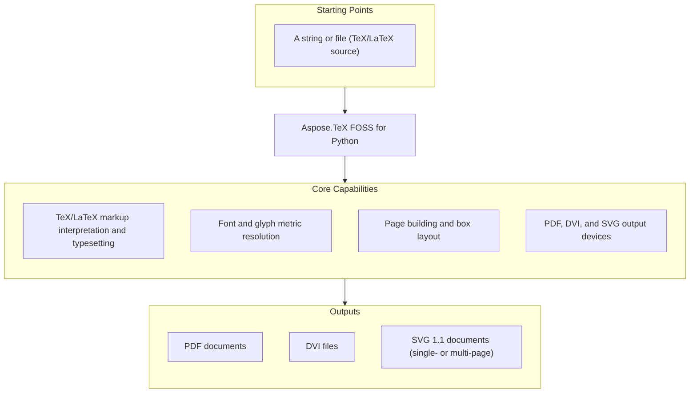

# Aspose.TeX FOSS for Python

[](https://www.python.org/downloads/) [](LICENSE) [](https://github.com/aspose-tex-foss/Aspose.TeX-FOSS-for-Python/graphs/contributors)

[](https://products.aspose.org/tex/python/)

Aspose.TeX FOSS for Python (`aspose-tex`) is a pure-Python library for TeX/LaTeX processing.
It parses TeX input and produces PDF, SVG, and DVI output. No external TeX installation is
required — Computer Modern fonts and hyphenation patterns are bundled.

## Navigation

- [At a Glance](#at-a-glance)
- [Key Capabilities](#key-capabilities)
- [Installation](#installation)
- [Quick Start](#quick-start)
- [Additional Examples](#additional-examples)
- [API Reference](#api-reference)
- [Documentation & Resources](#documentation--resources)
- [Scope and Limitations](#scope-and-limitations)
- [Development and Testing](#development-and-testing)
- [Third-Party Notices](#third-party-notices)
- [License](#license)

## At a Glance

*Note: the diagram below describes the intended API surface — see
[Scope and Limitations](#scope-and-limitations) for the package's current source-snapshot
limitations.*



## Key Capabilities

- Typeset TeX markup from a Python string (`StringInputSource`) or a file on disk
  (`FileInputSource`) through the `TeXJob` engine.
- Produce PDF output with `PdfDevice` (wraps `PdfWriter`), DVI output with `DviDevice`
  (wraps `DviWriter`), and multi-page SVG 1.1 output with `SvgDevice` (wraps `SvgWriter`).
- Write output to an in-memory `bytes` result or directly to a `Path` — no temporary files
  required.
- SVG output is self-contained: glyph outlines are extracted from the bundled Computer
  Modern PFB fonts and embedded as `<path>` elements, so no external fonts are required by
  the SVG viewer.
- Control job behavior with `TeXOptions` — job name, magnification, format pre-loading, and
  `extra_format_paths` / `extra_font_paths` search paths.
- Resolve font metrics with `FontManager` and `FontMetrics` (TFM-based widths, heights,
  kerning, and ligatures) and character-to-glyph mapping with `FontEncoding`.
- Collect run diagnostics through `TeXJob.messages` (returns a copy) — `\message` and
  `\write 16` append plain-text entries, `\errmessage` prefixes entries with `! `, and
  `\write -1` logs through the `aspose_tex` logger without appending to `messages`.
- Pure Python — no external TeX distribution, Perl runtime, or Ghostscript dependency.

## Installation

A PyPI package has not been published yet. Install from source:

```bash
git clone https://github.com/aspose-tex-foss/Aspose.TeX-FOSS-for-Python.git
cd Aspose.TeX-FOSS-for-Python
pip install -e ".[dev]"
```

Requirements: the package requires Python 3.10 or later, with no external TeX distribution
needed.

## Quick Start

Typeset a TeX string to PDF:

```python
from pathlib import Path
from aspose_tex import TeXJob, TeXOptions, PdfDevice, create_input_source

source = create_input_source("Hello World\n\\bye")
device = PdfDevice(Path("hello.pdf"))
job = TeXJob(source, device, options=TeXOptions(load_format=False))
job.run()  # hello.pdf is written to disk
```

Produce PDF bytes in memory instead of writing to disk:

```python
from aspose_tex import TeXJob, TeXOptions, PdfDevice, create_input_source

source = create_input_source("Hello World\n\\bye")
device = PdfDevice()
job = TeXJob(source, device, options=TeXOptions(load_format=False))
pdf_bytes = job.run()
```

## Additional Examples

Runnable checks for these APIs live under `tests/` in the repository. The most common
operations are collected below.

### DVI Output

```python
from aspose_tex import TeXJob, TeXOptions, DviDevice, create_input_source

source = create_input_source("Hello World\n\\bye")
device = DviDevice()
job = TeXJob(source, device, options=TeXOptions(load_format=False))
dvi_bytes = job.run()
```

Output directly to a file:

```python
from pathlib import Path
from aspose_tex import TeXJob, TeXOptions, DviDevice, create_input_source

source = create_input_source("Hello World\n\\bye")
device = DviDevice(Path("hello.dvi"))
job = TeXJob(source, device, options=TeXOptions(load_format=False))
job.run()  # returns None; output is on disk
```

<details>
<summary>View Additional Examples</summary>

### SVG Output

```python
from aspose_tex import TeXJob, TeXOptions, SvgDevice, create_input_source

source = create_input_source("Hello World\n\\bye")
device = SvgDevice()
job = TeXJob(source, device, options=TeXOptions(load_format=False))
svg_bytes = job.run()  # UTF-8 encoded SVG 1.1 document
```

Multi-page, in-memory output:

```python
from aspose_tex import TeXJob, TeXOptions, SvgDevice, create_input_source

source = create_input_source("Page one\n\\eject\nPage two\n\\bye")
device = SvgDevice()
job = TeXJob(source, device, options=TeXOptions(load_format=False))
job.run()
pages = device.get_all_pages()  # list[bytes], one SVG per page
```

### Job Options

```python
from aspose_tex import TeXJob, TeXOptions, PdfDevice, create_input_source

opts = TeXOptions(job_name="hello", magnification=1200, load_format=False)
source = create_input_source("Hello World\n\\bye")
device = PdfDevice()
job = TeXJob(source, device, options=opts)
pdf_bytes = job.run()
```

### Reading TeX From a File With Extra Format Paths

```python
from pathlib import Path
from aspose_tex import TeXJob, TeXOptions, DviDevice, create_input_source

opts = TeXOptions(load_format=False, extra_format_paths=[Path("tex-inputs")])
source = create_input_source("\\input chapter1\n\\bye")
job = TeXJob(source, DviDevice(), options=opts)
dvi_bytes = job.run()
messages = job.messages
```

`extra_format_paths` is searched after bundled format data and before the current working
directory for `\input` files.

Job messages and logging both surface run diagnostics — `job.messages` for in-process
inspection, and the standard `logging` module for application-wide log integration.

### Standard Logging Integration

The package registers a `logging.NullHandler` on the `aspose_tex` logger so applications can
opt into standard Python logging without receiving default handler warnings:

```python
import logging

logging.basicConfig(level=logging.INFO)
logging.getLogger("aspose_tex").setLevel(logging.INFO)
```

</details>

## API Reference

`TeXJob` is the main entry point: it accepts an `InputSource` and an output device
(`PdfDevice`, `DviDevice`, or `SvgDevice`), then runs the typesetting engine when
`.run()` is called.

<details>
<summary>View the Supported Public API Surface</summary>

### Core API

| Class | Description |
|---|---|
| `AsposeTeXError` | Base exception for all aspose_tex errors. |
| `EngineError` | Raised for TeX engine errors (infinite recursion, undefined register, etc.). |
| `FontError` | Raised for font-related failures (TFM not found, corrupt file, invalid char, etc.). |
| `InputError` | Raised for input reading failures (file not found, stack underflow, etc.). |

### Presentation

| Class | Description |
|---|---|
| `DviDevice` | DVI output device — wraps `DviWriter`. |
| `OutputDevice` | Abstract base class for all output devices. |
| `PdfDevice` | PDF output device — wraps `PdfWriter`. |
| `SvgDevice` | SVG output device — wraps `SvgWriter`. |
| `TeXJob` | Main entry point for processing TeX input. |
| `TeXOptions` | Configuration for a TeX processing job (job name, magnification, font paths). |

#### Enumerations

| Enumeration | Description |
|---|---|
| `OutputFormat` | Supported output formats. |

---

#### Detailed Member Reference

### Job and Input

- `TeXJob` — `run() -> bytes | None`; property `messages: list[str]`
- `TeXOptions` — `job_name`, `magnification`, `extra_font_paths`, `load_format`,
  `extra_format_paths`
- `StringInputSource(InputSource)` — reads TeX source from an in-memory `str`/`bytes` value;
  `read_line() -> str | None`, `name() -> str`
- `FileInputSource(InputSource)` — reads TeX source from a file path
- `InputSource`, `InputReader` — base protocols for custom input implementations

### Output Devices

- `PdfDevice(OutputDevice)` — wraps `PdfWriter`; `finalize()`, `get_bytes() -> bytes | None`;
  property `destination: Path | io.BytesIO`
- `DviDevice(OutputDevice)` — wraps `DviWriter`
- `SvgDevice(OutputDevice)` — wraps `SvgWriter`; adds `get_all_pages() -> list[bytes] | None`
  for multi-page documents
- `PdfWriter`, `DviWriter`, `SvgWriter` — implement `ShipoutBackend.shipout(page_number, box)`
- `OutputDevice`, `OutputFormat`, `ShipoutBackend` (protocol)

### Fonts and Metrics

- `FontManager` — `load_font(...)`, `select_font(cs_name)`, `get_metrics(cs_name)`,
  `fontdimen(...)`, `find_pfb(tfm_name)`, `load_pfb(tfm_name)`
- `FontMetrics` — `has_char(code)`, `char_metrics(code)`, `kern(code1, code2)`,
  `ligature(code1, code2)`; properties `design_size_sp`, `at_size_sp`, `tfm_name`
- `FontEncoding`, `CharMetrics`, `TfmData`, `PfbData`, `GlyphOutline`

### Engine Internals

- `Tokenizer`, `Expander`, `TeXInterpreter`, `CatcodeTable`, `MacroDefinition`
- `PageBuilder`, `PageBuilderConfig`, `HBoxBuilder`, `VBoxBuilder`, `LinebreakParams`,
  `ParagraphList`
- Node types: `CharNode`, `HlistNode`, `VlistNode`, `GlueNode`, `KernNode`, `RuleNode`,
  `DiscretionaryNode`, `MarkNode`, `InsertNode`, `WhatsitNode`
- `RegisterBank`, `RegisterSet`, `RegisterProvider` — TeX's count/dimen/skip/muskip/toks
  register families
- `AsposeTeXError`, `EngineError`, `FontError`, `InputError`

</details>

## Documentation & Resources

- **[Getting started guide](https://docs.aspose.org/tex/python/)** — installation, walkthroughs, and feature guides for this library.
- **[How-to guides & FAQ](https://kb.aspose.org/tex/python/)** — task-focused answers for common TeX-processing questions.
- **[Full API reference](https://reference.aspose.org/tex/python/)** — the complete, browsable reference for all 83 public types (the [API reference](#api-reference) section above covers the essentials).
- Found a bug or have a feature request? [Open an issue](https://github.com/aspose-tex-foss/Aspose.TeX-FOSS-for-Python/issues) on GitHub.

## Scope and Limitations

- This project is pre-alpha — the core engine and public API are under active development, and
  interfaces may change between releases.
- TeX's `\halign`/`\valign` alignment execution is a documented stub that currently raises
  `NotImplementedError`.
- The `\write`/deferred-stream I/O primitives are a documented stub that currently raise
  `NotImplementedError`.
- The current source snapshot has a real packaging defect that prevents the package from
  importing at all, so none of the code examples in this README can currently be executed
  against this snapshot — see [upstream-issues.md](upstream-issues.md) for details.

These limitations don't carry over to the commercial
[Aspose.TeX — Enterprise Edition](https://products.aspose.com/tex/) product family, which adds
full feature coverage — `\halign`/`\valign` alignment, deferred-stream I/O — and broader
production support.

## Development and Testing

Install the development extras and run the test suite:

```bash
pip install -e ".[dev]"
pytest
```

`ruff` is included in the `dev` extra for linting, and `build`/`twine` for packaging checks.

## Third-Party Notices

Aspose.TeX FOSS for Python bundles Computer Modern font data (TFM metrics and PFB glyph
outlines, under `src/aspose_tex/data/fonts/`) used for typesetting when no other font is
requested. These fonts are covered by a separate [font license file](LICENSE-FONTS), which
documents the Computer Modern family as distributed under the LaTeX Project Public License
(LPPL) and/or the SIL Open Font License (OFL).

## License

This project is licensed under the [MIT License](LICENSE). The MIT License permits use, copying,
modification, distribution, sublicensing, and commercial use, provided its copyright and
permission notice are retained. The software is provided without warranty.
