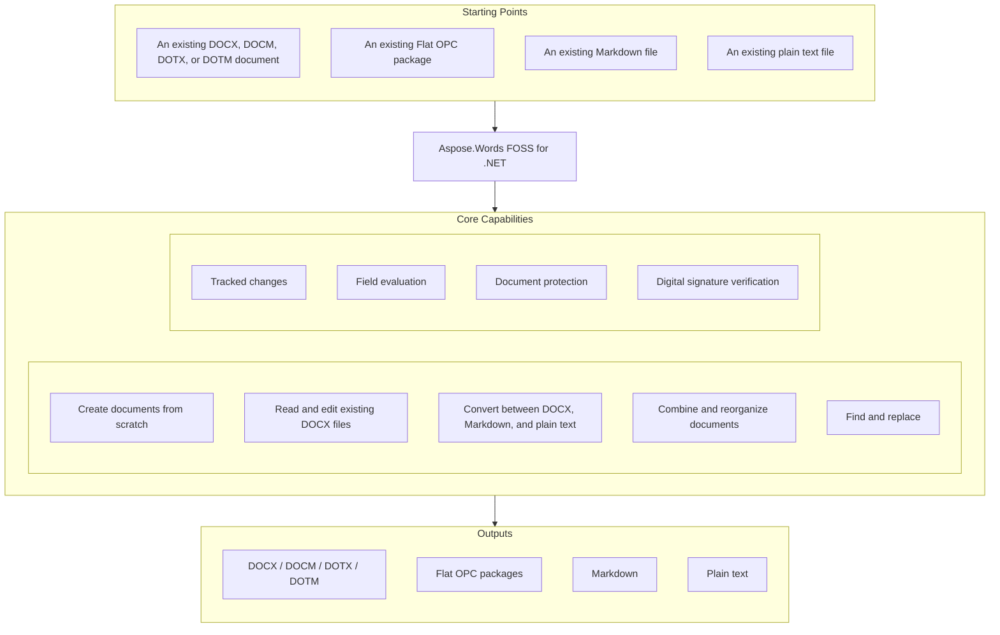

# Aspose.Words FOSS for .NET

[](https://www.nuget.org/packages/Aspose.Words.FOSS/) [](https://github.com/aspose-words-foss/Aspose.Words-FOSS-for-.NET/blob/main/LICENSE) [](https://github.com/aspose-words-foss/Aspose.Words-FOSS-for-.NET/graphs/contributors) [](https://github.com/aspose-words-foss/Aspose.Words-FOSS-for-.NET/issues)

[](https://products.aspose.org/words/net/)

### Project History

Aspose.Words has been in continuous development for over two decades — older than the DOCX
format itself. Development began with manual reverse engineering of the binary DOC format, at a
time when no public specification existed, then followed the format's own evolution: WordML, the
Word 2003 XML dialect, and then OOXML when Word 2007 introduced it. What this FOSS edition
carries forward from that history is the genuine core: the document model and the DOCX reader
and writer.

Aspose.Words FOSS for .NET is a free, open-source, MIT-licensed .NET library for Word documents.
It is not a rewrite or a wrapper: it is the actual Aspose.Words for .NET source code, the same
document engine that has processed Word documents in production since 2003, reduced to a free,
open-source core. It is pure managed C# targeting .NET Standard 2.0, with no native dependencies
and no Microsoft Word installation required.

## Navigation

- [At a Glance](#at-a-glance)
- [Key Capabilities](#key-capabilities)
- [Installation](#installation)
- [Quick Start](#quick-start)
- [Additional Examples](#additional-examples)
- [API Reference](#api-reference)
- [Documentation & Resources](#documentation--resources)
- [Scope and Limitations](#scope-and-limitations)
- [Development and Testing](#development-and-testing)
- [License](#license)

## At a Glance



## Key Capabilities

- **Create documents from scratch** with the full document object model or the high-level `DocumentBuilder`.
- **Read and edit existing DOCX files**: text, formatting, styles, tables, lists, sections, headers and footers, bookmarks, comments, footnotes, shapes.
- **Convert** between DOCX, Markdown, and plain text.
- **Combine and reorganize documents**: append, clone, and import content between documents.
- **Find and replace** text with regular expressions and formatting-aware options.
- **Work with tracked changes**: inspect, accept, or reject revisions via `RevisionCollection`.
- **Update fields** with the full field evaluation engine included, though values that depend on page layout (such as page numbers in a TOC) evaluate to placeholders since page layout is not part of this edition.
- **Protect documents** and round-trip macro-enabled files (DOCM/DOTM) with their VBA projects intact.
- **Verify digital signatures**: check whether a DOCX is signed and untampered, and inspect its certificates or remove signatures (creating new signatures is not included in this edition).

### Supported Formats

| Format | Load | Save |
|---|:---:|:---:|
| DOCX / DOCM / DOTX / DOTM | Yes | Yes |
| Flat OPC (all variants) | Yes | Yes |
| Markdown | Yes | Yes |
| Plain text | Yes | Yes |

## Installation

```bash
dotnet add package Aspose.Words.FOSS
```

The library targets .NET Standard 2.0 (plus .NET Framework 4.6.2 and net8.0 builds), so it runs
on .NET Framework 4.6.2+ and .NET 6/8/10, on Windows, Linux, and macOS, with no native
dependencies and no COM/Office automation — Microsoft Word does not need to be installed.

## Quick Start

Create a document from scratch and convert an existing one to Markdown:

```csharp
using Aspose.Words;

// Create a document from scratch.
Document doc = new Document();
DocumentBuilder builder = new DocumentBuilder(doc);

builder.ParagraphFormat.StyleIdentifier = StyleIdentifier.Heading1;
builder.Writeln("Hello from Aspose.Words FOSS!");

builder.ParagraphFormat.StyleIdentifier = StyleIdentifier.BodyText;
builder.Writeln("This document was created entirely in code, no Word installed.");

doc.Save("Hello.docx");

// Convert an existing document to Markdown.
Document report = new Document("Report.docx");
report.Save("Report.md");
```

## Additional Examples

More real, runnable snippets are collected below.

### Extract All Text From a DOCX

```csharp
Document doc = new Document("input.docx");
string text = doc.GetText();          // fast, includes control chars
doc.Save("input.txt");                 // or: clean plain-text export
doc.Save("input.md");                  // or: Markdown, preserves structure
```

<details>
<summary>View Additional Examples</summary>

### Edit an Existing Document

```csharp
Document doc = new Document("contract.docx");
doc.Range.Replace("{{CLIENT_NAME}}", "Acme Corp");
doc.Save("contract-filled.docx");
```

### Walk the Document Model

```csharp
using Aspose.Words.Tables;

foreach (Paragraph para in doc.GetChildNodes(NodeType.Paragraph, true))
    Console.WriteLine(para.GetText().Trim());
foreach (Table table in doc.GetChildNodes(NodeType.Table, true))
    Console.WriteLine($"Table with {table.Rows.Count} rows");
```

### Merge Documents

```csharp
Document main = new Document("main.docx");
Document appendix = new Document("appendix.docx");
main.AppendDocument(appendix, ImportFormatMode.KeepSourceFormatting);
main.Save("combined.docx");
```

### Accept All Tracked Changes

```csharp
Document doc = new Document("reviewed.docx");
doc.AcceptAllRevisions();
doc.Save("final.docx");
```

### Convert Markdown to DOCX

```csharp
Document doc = new Document("notes.md");
doc.Save("notes.docx");
```

### Create a Document With a Chart

`DocumentBuilder.InsertChart()` adds a chart shape to a document; its `Chart` object then
configures the series data. Clear the default generated series before adding real data.

```csharp
using Aspose.Words;
using Aspose.Words.Drawing;
using Aspose.Words.Drawing.Charts;

Document doc = new Document();
DocumentBuilder builder = new DocumentBuilder(doc);

Shape shape = builder.InsertChart(ChartType.Line, 432, 252);
Chart chart = shape.Chart;

// Delete default generated series.
chart.Series.Clear();

string[] categories = new string[] { "AW Category 1", "AW Category 2", "AW Category 3" };
chart.Series.Add("AW Series 1", categories, new double[] { 4.3, 2.5, 3.5 });

doc.Save("chart.docx");
```

</details>

## API Reference

The library exposes the same document object model used by the commercial product, so the
[commercial product's official documentation and examples](https://docs.aspose.com/words/net/)
apply directly within this edition's supported feature set. `Document` is the root of the object
model; `DocumentBuilder` is a cursor-based writer over it. The public API surface includes 617
classes, summarized in the module-grouped table below.

<details>
<summary>View the Supported Public API Surface</summary>

### Core API

| Class | Description |
|---|---|
| `AbsolutePositionTab` | An absolute position tab is a character which is used to advance the position on the current line of text when displaying this WordprocessingML content. |
| `Adjustment` | Represents adjustment values that are applied to the specified shape. |
| `AdjustmentCollection` | Represents a read-only collection of Adjustment adjust values that are applied to the specified shape. |
| `AxisBound` | Represents minimum or maximum bound of axis values. |
| `AxisDisplayUnit` | Provides access to the scaling options of the display units for the value axis. |
| `AxisScaling` | Represents the scaling options of the axis. |
| `AxisTickLabels` | Represents properties of axis tick mark labels. |
| `BarcodeParameters` | Container class for barcode parameters to pass-through to BarcodeGenerator. |
| `BaseWebExtensionCollection` | Base class for TaskPaneCollection, WebExtensionBindingCollection, WebExtensionPropertyCollection and WebExtensionReferenceCollection collections. |
| `Bibliography` | Represents the list of bibliography sources available in the document. |
| `Body` | Represents a container for the main text of a section. |
| `Bookmark` | Represents a single bookmark. |
| `BookmarkCollection` | A collection of Bookmark objects that represent the bookmarks in the specified range. |
| `BookmarkEnd` | Represents an end of a bookmark in a Word document. |
| `BookmarkStart` | Represents a start of a bookmark in a Word document. |
| `BookmarksOutlineLevelCollection` | A collection of individual bookmarks outline level. |
| `Border` | Represents a border of an object. |
| `BorderCollection` | A collection of Border objects. |
| `BubbleSizeCollection` | Represents a collection of bubble sizes for a chart series. |
| `BuildVersionInfo` | Provides information about the current product name and version. |
| `BuildingBlock` | Represents a glossary document entry such as a building block, AutoText, or AutoCorrect entry. |
| `BuildingBlockCollection` | A collection of BuildingBlock objects in the document. |
| `BuiltInDocumentProperties` | A collection of built-in document properties. |
| `Cell` | Represents a table cell. |
| `CellCollection` | Provides typed access to a collection of Cell nodes. |
| `CellFormat` | Represents all formatting for a table cell. |
| `CertificateHolder` | Represents a holder of X509Certificate2 instance. |
| `Chart` | Provides access to the chart shape properties. |
| `ChartAxis` | Represents the axis options of the chart. |
| `ChartAxisCollection` | Represents a collection of chart axes. |
| `ChartAxisTitle` | Provides access to the axis title properties. |
| `ChartDataLabel` | Represents data label on a chart point or trendline. |
| `ChartDataLabelCollection` | Represents a collection of ChartDataLabel. |
| `ChartDataPoint` | Allows to specify formatting of a single data point on the chart. |
| `ChartDataPointCollection` | Represents collection of a ChartDataPoint. |
| `ChartDataTable` | Allows to specify properties of a chart data table. |
| `ChartFormat` | Represents the formatting of a chart element. |
| `ChartLegend` | Represents chart legend properties. |
| `ChartLegendEntry` | Represents a chart legend entry. |
| `ChartLegendEntryCollection` | Represents a collection of chart legend entries. |
| `ChartMarker` | Represents a chart data marker. |
| `ChartMultilevelValue` | Represents a value for charts that display multilevel data. |
| `ChartNumberFormat` | Represents number formatting of the parent element. |
| `ChartSeries` | Represents chart series properties. |
| `ChartSeriesCollection` | Represents collection of a ChartSeries. |
| `ChartSeriesGroup` | Represents properties of a chart series group, that is, the properties of chart series of the same type associated with the same axes. |
| `ChartSeriesGroupCollection` | Represents a collection of ChartSeriesGroup objects. |
| `ChartTitle` | Provides access to the chart title properties. |
| `ChartXValue` | Represents an X value for a chart series. |
| `ChartXValueCollection` | Represents a collection of X values for a chart series. |
| `ChartYValue` | Represents an Y value for a chart series. |
| `ChartYValueCollection` | Represents a collection of Y values for a chart series. |
| `CheckBoxControl` | The CheckBox control toggles a value. |
| `ChmLoadOptions` | Allows to specify additional options when loading CHM document into a Document object. |
| `CleanupOptions` | Allows to specify options for document cleaning. |
| `CommandButtonControl` | The CommandButton control runs a macro that performs an action when a user clicks it. |
| `Comment` | Represents a container for text of a comment. |
| `CommentCollection` | Provides typed access to a collection of Comment nodes. |
| `CommentRangeEnd` | Denotes the end of a region of text that has a comment associated with it. |
| `CommentRangeStart` | Denotes the start of a region of text that has a comment associated with it. |
| `ComparisonEvaluationResult` | The comparison evaluation result. |
| `ComparisonExpression` | The comparison expression. |
| `CompatibilityOptions` | Contains compatibility options (that is, the user preferences entered on the Compatibility tab of the Options dialog in Microsoft Word). |
| `CompositeNode` | Base class for nodes that can contain other nodes. |
| `ConditionalStyle` | Represents special formatting applied to some area of a table with assigned table style. |
| `ConditionalStyleCollection` | Represents a collection of ConditionalStyle objects. |
| `Contributor` | Represents a bibliography source contributor. |
| `ContributorCollection` | Represents bibliography source contributors. |
| `ControlChar` | Control characters often encountered in documents. |
| `ConvertUtil` | Provides helper functions to convert between various measurement units. |
| `Corporate` | Represents a corporate (an organization) bibliography source contributor. |
| `CssSavingArgs` | Provides data for the CssSaving event. |
| `CustomDocumentProperties` | A collection of custom document properties. |
| `CustomPart` | Represents a custom (arbitrary content) part, that is not defined by the ISO/IEC 29500 standard. |
| `CustomPartCollection` | Represents a collection of CustomPart objects. |
| `CustomXmlPart` | Represents a Custom XML Data Storage Part (custom XML data within a package). |
| `CustomXmlPartCollection` | Represents a collection of Custom XML Parts. |
| `CustomXmlProperty` | Represents a single custom XML attribute or a smart tag property. |
| `CustomXmlPropertyCollection` | Represents a collection of custom XML attributes or smart tag properties. |
| `CustomXmlSchemaCollection` | A collection of strings that represent XML schemas that are associated with a custom XML part. |
| `DigitalSignature` | Represents a digital signature on a document and the result of its verification. |
| `DigitalSignatureCollection` | Provides a read-only collection of digital signatures attached to a document. |
| `DigitalSignatureDetails` | Contains details for signing a document with a digital signature. |
| `DigitalSignatureUtil` | Provides methods for signing document. |
| `Document` | The Document class constructors let developers create a new empty document or load an existing one from a file path, stream, or with custom load options. |
| `DocumentBase` | Provides the abstract base class for a main document and a glossary document of a Word document. |
| `DocumentBuilder` | Provides methods to insert text, images and other content, specify font, paragraph and section formatting. |
| `DocumentBuilderOptions` | Allows to specify additional options for the document building process. |
| `DocumentLoadingArgs` | An argument passed into Notify(DocumentLoadingArgs). |
| `DocumentPartSavingArgs` | Provides data for the DocumentPartSaving callback. |
| `DocumentProperty` | Represents a custom or built-in document property. |
| `DocumentPropertyCollection` | Base class for BuiltInDocumentProperties and CustomDocumentProperties collections. |
| `DocumentReaderPluginLoadException` | Thrown during document load, when the plugin required for reading the document format cannot be loaded. |
| `DocumentSavingArgs` | An argument passed into Notify(DocumentSavingArgs). |
| `DocumentVisitor` | Base class for custom document visitors. |
| `DropDownItemCollection` | A collection of strings that represent all the items in a drop-down form field. |
| `EditableRange` | Represents a single editable range. |
| `EditableRangeEnd` | Represents an end of an editable range in a Word document. |
| `EditableRangeStart` | Represents a start of an editable range in a Word document. |
| `EndnoteOptions` | Represents the endnote numbering options for a document or section. |
| `Field` | Represents a Microsoft Word document field. |
| `FieldAddIn` | Implements the ADDIN field. |
| `FieldAddressBlock` | Implements the ADDRESSBLOCK field. |
| `FieldAdvance` | Implements the ADVANCE field. |
| `FieldArgumentBuilder` | Builds a complex field argument consisting of fields, nodes, and plain text. |
| `FieldAsk` | Implements the ASK field. |
| `FieldAuthor` | Implements the AUTHOR field. |
| `FieldAutoNum` | Implements the AUTONUM field. |
| `FieldAutoNumLgl` | Implements the AUTONUMLGL field. |
| `FieldAutoNumOut` | Implements the AUTONUMOUT field. |
| `FieldAutoText` | Implements the AUTOTEXT field. |
| `FieldAutoTextList` | Implements the AUTOTEXTLIST field. |
| `FieldBarcode` | Implements the BARCODE field. |
| `FieldBibliography` | Implements the BIBLIOGRAPHY field. |
| `FieldBidiOutline` | Implements the BIDIOUTLINE field. |
| `FieldBuilder` | Builds a field from field code tokens (arguments and switches). |
| `FieldChar` | Base class for nodes that represent field characters in a document. |
| `FieldCitation` | Implements the CITATION field. |
| `FieldCollection` | A collection of Field objects that represents the fields in the specified range. |
| `FieldComments` | Implements the COMMENTS field. |
| `FieldCompare` | Implements the COMPARE field. |
| `FieldCreateDate` | Implements the CREATEDATE field. |
| `FieldData` | Implements the DATA field. |
| `FieldDatabase` | Implements the DATABASE field. |
| `FieldDatabaseDataRow` | Provides data for the FieldDatabase field result. |
| `FieldDatabaseDataTable` | Provides data for the FieldDatabase field result. |
| `FieldDate` | Implements the DATE field. |
| `FieldDde` | Implements the DDE field. |
| `FieldDdeAuto` | Implements the DDEAUTO field. |
| `FieldDisplayBarcode` | Implements the DISPLAYBARCODE field. |
| `FieldDocProperty` | Implements the DOCPROPERTY field. |
| `FieldDocVariable` | Implements DOCVARIABLE field. |
| `FieldEQ` | Implements the EQ field. |
| `FieldEditTime` | Implements the EDITTIME field. |
| `FieldEmbed` | Implements the EMBED field. |
| `FieldEnd` | Represents an end of a Word field in a document. |
| `FieldFileName` | Implements the FILENAME field. |
| `FieldFileSize` | Implements the FILESIZE field. |
| `FieldFillIn` | Implements the FILLIN field. |
| `FieldFootnoteRef` | Implements the FOOTNOTEREF field. |
| `FieldFormCheckBox` | Implements the FORMCHECKBOX field. |
| `FieldFormDropDown` | Implements the FORMDROPDOWN field. |
| `FieldFormText` | Implements the FORMTEXT field. |
| `FieldFormat` | Provides typed access to field's numeric, date and time, and general formatting. |
| `FieldFormula` | Implements the = (formula) field. |
| `FieldGlossary` | Implements the GLOSSARY field. |
| `FieldGoToButton` | Implements the GOTOBUTTON field. |
| `FieldGreetingLine` | Implements the GREETINGLINE field. |
| `FieldHyperlink` | Implements the HYPERLINK field To learn more, visit the Working with Fields documentation article. |
| `FieldIf` | Implements the IF field. |
| `FieldImport` | Implements the IMPORT field. |
| `FieldInclude` | Implements the INCLUDE field. |
| `FieldIncludePicture` | Implements the INCLUDEPICTURE field. |
| `FieldIncludeText` | Implements the INCLUDETEXT field. |
| `FieldIndex` | Implements the INDEX field. |
| `FieldInfo` | Implements the INFO field. |
| `FieldKeywords` | Implements the KEYWORDS field. |
| `FieldLastSavedBy` | Implements the LASTSAVEDBY field. |
| `FieldLink` | Implements the LINK field. |
| `FieldListNum` | Implements the LISTNUM field. |
| `FieldMacroButton` | Implements the MACROBUTTON field. |
| `FieldMergeBarcode` | Implements the MERGEBARCODE field. |
| `FieldMergeField` | Implements the MERGEFIELD field. |
| `FieldMergeRec` | Implements the MERGEREC field. |
| `FieldMergeSeq` | Implements the MERGESEQ field. |
| `FieldNext` | Implements the NEXT field. |
| `FieldNextIf` | Implements the NEXTIF field. |
| `FieldNoteRef` | Implements the NOTEREF field. |
| `FieldNumChars` | Implements the NUMCHARS field. |
| `FieldNumPages` | Implements the NUMPAGES field. |
| `FieldNumWords` | Implements the NUMWORDS field. |
| `FieldOcx` | Implements the OCX field. |
| `FieldOptions` | Represents options to control field handling in a document. |
| `FieldPage` | Implements the PAGE field. |
| `FieldPageRef` | Implements the PAGEREF field. |
| `FieldPrint` | Implements the PRINT field. |
| `FieldPrintDate` | Implements the PRINTDATE field. |
| `FieldPrivate` | Implements the PRIVATE field. |
| `FieldQuote` | Implements the QUOTE field. |
| `FieldRD` | Implements the RD field. |
| `FieldRef` | Implements the REF field. |
| `FieldRevNum` | Implements the REVNUM field. |
| `FieldSaveDate` | Implements the SAVEDATE field. |
| `FieldSection` | Implements the SECTION field. |
| `FieldSectionPages` | Implements the SECTIONPAGES field. |
| `FieldSeparator` | Represents a Word field separator that separates the field code from the field result. |
| `FieldSeq` | Implements the SEQ field. |
| `FieldSet` | Implements the SET field. |
| `FieldShape` | Implements the SHAPE field. |
| `FieldSkipIf` | Implements the SKIPIF field. |
| `FieldStart` | Represents a start of a Word field in a document. |
| `FieldStyleRef` | Implements the STYLEREF field. |
| `FieldSubject` | Implements the SUBJECT field. |
| `FieldSymbol` | Implements a SYMBOL field. |
| `FieldTA` | Implements the TA field. |
| `FieldTC` | Implements the TC field. |
| `FieldTemplate` | Implements the TEMPLATE field. |
| `FieldTime` | Implements the TIME field. |
| `FieldTitle` | Implements the TITLE field. |
| `FieldToa` | Implements the TOA field. |
| `FieldToc` | Implements the TOC field. |
| `FieldUnknown` | Implements an unknown or unrecognized field. |
| `FieldUpdatingProgressArgs` | Provides data for the field updating progress event. |
| `FieldUserAddress` | Implements the USERADDRESS field. |
| `FieldUserInitials` | Implements the USERINITIALS field. |
| `FieldUserName` | Implements the USERNAME field. |
| `FieldXE` | Implements the XE field. |
| `FileCorruptedException` | Thrown during document load, when the document appears to be corrupted and impossible to load. |
| `FileFormatInfo` | Contains data returned by FileFormatUtil document format detection methods. |
| `FileFormatUtil` | Provides utility methods for working with file formats, such as detecting file format or converting file extensions to/from file format enums. |
| `Fill` | Represents fill formatting for an object. |
| `FindReplaceOptions` | Specifies options for find/replace operations. |
| `Font` | Contains font attributes (font name, font size, color, and so on) for an object. |
| `FontEmbeddingLicensingRights` | Represents embedding licensing rights for the font. |
| `FontInfo` | Specifies information about a font used in the document. |
| `FontInfoCollection` | Represents a collection of fonts used in a document. |
| `FontSettings` | Specifies font settings for a document. |
| `Footnote` | Represents a container for text of a footnote or endnote. |
| `FootnoteOptions` | Represents the footnote numbering options for a document or section. |
| `FootnoteSeparator` | Represents a container for the footnote/endnote separator and continuation content of a document. |
| `FootnoteSeparatorCollection` | Provides typed access to FootnoteSeparator nodes of a document. |
| `FormField` | Represents a single form field. |
| `FormFieldCollection` | A collection of FormField objects that represent all the form fields in a range. |
| `Forms2OleControl` | Represents Microsoft Forms 2.0 OLE control. |
| `Forms2OleControlCollection` | Represents collection of Forms2OleControl objects. |
| `FrameFormat` | Represents frame related formatting for a paragraph. |
| `Frameset` | Represents a frames page or a single frame on a frames page. |
| `FramesetCollection` | Represents a collection of instances of the Frameset class. |
| `GeneralFormatCollection` | Represents a typed collection of general formats. |
| `GlossaryDocument` | Represents the root element for a glossary document within a Word document. |
| `GlowFormat` | Represents the glow formatting for an object. |
| `GradientStop` | Represents one gradient stop. |
| `GradientStopCollection` | Contains a collection of GradientStop objects. |
| `GraphicsQualityOptions` | Allows to specify additional Graphics quality optionsjava.awt.RenderingHints Graphics quality options. |
| `GroupShape` | Represents a group of shapes in a document. |
| `HeaderFooter` | Represents a container for the header or footer text of a section. |
| `HeaderFooterCollection` | Provides typed access to HeaderFooter nodes of a Section. |
| `HorizontalRuleFormat` | Represents horizontal rule formatting. |
| `HtmlLoadOptions` | Allows to specify additional options when loading HTML document into a Document object. |
| `HtmlSaveOptions` | Can be used to specify additional options when saving a document into the HTML, MHTML, EPUB, Azw3 or MOBI format. |
| `HyphenationOptions` | Allows to configure document hyphenation options. |
| `ImageData` | Defines the image data for a shape, accessed via `Shape.ImageData`. |
| `ImageSavingArgs` | Provides data for the ImageSaving event. |
| `ImageSize` | Contains information about image size and resolution. |
| `ImageWatermarkOptions` | Contains options that can be specified when adding a watermark with image. |
| `ImportFormatOptions` | Allows to specify various import options to format output. |
| `IncorrectPasswordException` | Thrown if a document is encrypted with a password and the password specified when opening the document is incorrect or missing. |
| `Inline` | Base class for inline-level nodes that can have character formatting associated with them, but cannot have child nodes of their own. |
| `InlineStory` | Base class for inline-level nodes that can contain paragraphs and tables. |
| `InternableComplexAttr` | Base class for internable complex attribute. |
| `LanguagePreferences` | Allows to set up language preferences. |
| `List` | List class exposes ListId, ListLevels, Style and methods like CompareTo and HasSameTemplate, allowing developers to inspect, compare, and manipulate document list definitions. |
| `ListCollection` | Stores and manages formatting of bulleted and numbered lists used in a document. |
| `ListFormat` | Allows to control what list formatting is applied to a paragraph. |
| `ListLabel` | Defines properties specific to a list label. |
| `ListLevel` | Defines formatting for a list level. |
| `ListLevelCollection` | A collection of list formatting for each level in a list. |
| `LoadOptions` | Allows to specify additional options (such as password or base URI) when loading a document into a Document object. |
| `MailMergeSettings` | Specifies all of the mail merge information for a document. |
| `MarkdownLoadOptions` | Allows to specify additional options when loading Markdown document into a Document object. |
| `MarkdownSaveOptions` | Class to specify additional options when saving a document into the Markdown format. |
| `MergeFieldImageDimension` | Represents an image dimension (i.e. |
| `MorphDataControl` | The MorphDataControl structure is an aggregate of six controls: CheckBox, ComboBox, ListBox, OptionButton, TextBox, and ToggleButton. |
| `MultiPageLayout` | Defines a layout for rendering multiple pages into a single output. |
| `Node` | Base class for all nodes of a Word document. |
| `NodeChangingArgs` | Provides data for methods of the INodeChangingCallback interface. |
| `NodeCollection` | Represents a collection of nodes of a specific type. |
| `NodeEnumerator` | Enumerates a range of nodes in the document tree. |
| `NodeImporter` | Allows to efficiently perform repeated import of nodes from one document to another. |
| `NodeList` | Represents a collection of nodes matching an XPath query executed using the SelectNodes method. |
| `Odso` | Specifies the Office Data Source Object (ODSO) settings for a mail merge data source. |
| `OdsoFieldMapData` | Specifies how a column in the external data source shall be mapped to the predefined merge fields within the document. |
| `OdsoFieldMapDataCollection` | A typed collection of the OdsoFieldMapData objects. |
| `OdsoRecipientData` | Represents information about a single record within an external data source that is to be excluded from the mail merge. |
| `OdsoRecipientDataCollection` | A typed collection of OdsoRecipientData To learn more, visit the Mail Merge and Reporting documentation article. |
| `OfficeMath` | Represents an Office Math object such as function, equation, matrix or alike. |
| `OleControl` | Represents OLE ActiveX control. |
| `OleFormat` | Provides access to the data of an OLE object or ActiveX control. |
| `OlePackage` | Allows to access OLE Package properties. |
| `OoxmlSaveOptions` | Can be used to specify additional options when saving a document into the DOCX, DOCM, DOTX, DOTM or FlatOpc format. |
| `OptionButtonControl` | The OptionButton control enables a single choice in a limited set of mutually exclusive choices. |
| `OutlineOptions` | Allows to specify outline options. |
| `PageRange` | Represents a continuous range of pages. |
| `PageSavingArgs` | Provides data for the PageSaving event. |
| `PageSet` | Describes a random set of pages. |
| `PageSetup` | Represents the page setup properties of a section. |
| `Paragraph` | Represents a paragraph of text. |
| `ParagraphCollection` | Provides typed access to a collection of Paragraph nodes. |
| `ParagraphFormat` | Represents all the formatting for a paragraph. |
| `PdfLoadOptions` | Allows to specify additional options when loading PDF document into a Document object. |
| `Person` | Represents individual (a person) bibliography source contributor. |
| `PersonCollection` | Represents a list of persons who are bibliography source contributors. |
| `PhoneticGuide` | Represents Phonetic Guide. |
| `PlainTextDocument` | Allows to extract plain-text representation of the document's content. |
| `PreferredWidth` | Represents a value and its unit of measure that is used to specify the preferred width of a table or a cell. |
| `Range` | Represents a contiguous area in a document. |
| `ReflectionFormat` | Represents the reflection formatting for an object. |
| `ReplacingArgs` | Provides data for a custom replace operation. |
| `ResourceLoadingArgs` | Provides data for the ResourceLoading method. |
| `ResourceSavingArgs` | Provides data for the ResourceSaving event. |
| `Revision` | Represents a revision (tracked change) in a document node or style. |
| `RevisionCollection` | A collection of Revision objects that represent revisions in the document. |
| `RevisionGroup` | Represents a group of sequential Revision objects. |
| `RevisionGroupCollection` | A collection of RevisionGroup objects that represent revision groups in the document. |
| `Row` | Represents a table row. |
| `RowCollection` | Provides typed access to a collection of Row nodes. |
| `RowFormat` | Represents all formatting for a table row. |
| `RtfLoadOptions` | Allows to specify additional options when loading RTF document into a Document object. |
| `Run` | Represents a run of characters with the same font formatting. |
| `RunCollection` | Provides typed access to a collection of Run nodes. |
| `SaveOptions` | This is an abstract base class for classes that allow the user to specify additional options when saving a document into a particular format. |
| `SaveOutputParameters` | This object is returned to the caller after a document is saved and contains additional information that has been generated or calculated during the save operation. |
| `SdtListItem` | This element specifies a single list item within a parent ComboBox or DropDownList structured document tag. |
| `SdtListItemCollection` | Provides access to SdtListItem elements of a structured document tag. |
| `Section` | Represents a single section in a document. |
| `SectionCollection` | A collection of Section objects in the document. |
| `Shading` | Contains shading attributes for an object. |
| `ShadowFormat` | Represents shadow formatting for an object. |
| `Shape` | Represents an object in the drawing layer, such as an AutoShape, textbox, freeform, OLE object, ActiveX control, or picture. |
| `ShapeBase` | Base class for objects in the drawing layer, such as an AutoShape, freeform, OLE object, ActiveX control, or picture. |
| `SignOptions` | Allows to specify options for document signing. |
| `SignatureLine` | Provides access to signature line properties. |
| `SignatureLineOptions` | Allows to specify options for signature line being inserted. |
| `SmartTag` | This element specifies the presence of a smart tag around one or more inline structures (runs, images, fields,etc.) within a paragraph. |
| `SoftEdgeFormat` | Represents the soft edge formatting for an object. |
| `Source` | Represents an individual source, such as a book, journal article, or interview. |
| `SpecialChar` | Base class for special characters in the document. |
| `Story` | Base class for elements that contain block-level nodes Paragraph and Table. |
| `Stroke` | Defines a stroke for a shape. |
| `StructuredDocumentTag` | Represents a structured document tag (SDT or content control) in a document. |
| `StructuredDocumentTagCollection` | A collection of IStructuredDocumentTag instances that represent the structured document tags in the specified range. |
| `StructuredDocumentTagRangeEnd` | Represents an end of ranged structured document tag which accepts multi-sections content. |
| `StructuredDocumentTagRangeStart` | Represents a start of ranged structured document tag which accepts multi-sections content. |
| `Style` | Represents a single built-in or user-defined style. |
| `StyleCollection` | A collection of Style objects that represent both the built-in and user-defined styles in a document. |
| `SubDocument` | Represents a SubDocument - which is a reference to an externally stored document. |
| `TabStop` | Represents a single custom tab stop. |
| `TabStopCollection` | A collection of `TabStop` objects representing the custom tab stops defined for a paragraph or a style. |
| `Table` | Represents a table in a Word document. |
| `TableCollection` | Provides typed access to a collection of Table nodes. |
| `TableStyle` | Represents a table style. |
| `TaskPane` | Represents an add-in task pane object. |
| `TaskPaneCollection` | Specifies a list of persisted task pane objects. |
| `TextBox` | Defines attributes that specify how a text is displayed inside a shape. |
| `TextBoxControl` | The TextBox control displays text from an organized set of data or user input. |
| `TextColumn` | Represents a single text column. |
| `TextColumnCollection` | A collection of TextColumn objects that represent all the columns of text in a section of a document. |
| `TextPath` | Defines the text and formatting of the text path (of a WordArt object). |
| `TextWatermarkOptions` | Contains options that can be specified when adding a watermark with text. |
| `Theme` | Represents document Theme, and provides access to main theme parts including MajorFonts, MinorFonts and Colors To learn more, visit the Working with Styles and Themes documentation article. |
| `ThemeColors` | Represents the color scheme of the document theme which contains twelve colors. |
| `ThemeFonts` | Represents a collection of fonts in the font scheme, allowing to specify different fonts for different languages Latin, EastAsian and ComplexScript. |
| `ToaCategories` | Represents a table of authorities categories. |
| `TxtListIndentation` | Specifies how list levels are indented when document is exporting to Text format. |
| `TxtLoadOptions` | Allows to specify additional options when loading Text document into a Document object. |
| `TxtSaveOptions` | Can be used to specify additional options when saving a document into the Text format. |
| `TxtSaveOptionsBase` | The base class for specifying additional options when saving a document into a text based formats. |
| `UnsupportedFileFormatException` | Thrown during document load, when the document format is not recognized or not supported by Aspose.Words. |
| `UserInformation` | Specifies information about the user. |
| `VariableCollection` | A collection of document variables. |
| `VbaModule` | Provides access to VBA project module. |
| `VbaModuleCollection` | Represents a collection of VbaModule objects. |
| `VbaProject` | Provides access to VBA project information. |
| `VbaReference` | Implements a reference to an Automation type library or VBA project. |
| `VbaReferenceCollection` | Represents a collection of VbaReference objects. |
| `ViewOptions` | Provides various options that control how a document is shown in Microsoft Word. |
| `WarningInfo` | Contains information about a warning that Aspose.Words issued during document loading or saving. |
| `WarningInfoCollection` | Represents a typed collection of WarningInfo objects. |
| `Watermark` | Represents class to work with document watermark. |
| `WebExtension` | Represents a web extension object. |
| `WebExtensionBinding` | Specifies a binding relationship between a web extension and the data in the document. |
| `WebExtensionBindingCollection` | Specifies a list of web extension bindings. |
| `WebExtensionProperty` | Specifies a web extension custom property. |
| `WebExtensionPropertyCollection` | Specifies a set of web extension custom properties. |
| `WebExtensionReference` | Represents the reference to a web extension. |
| `WebExtensionReferenceCollection` | Specifies a list of web extension references. |
| `WordML2003SaveOptions` | Can be used to specify additional options when saving a document into the WordML format. |
| `WriteProtection` | Specifies write protection settings for a document. |
| `XmlMapping` | Specifies the information that is used to establish a mapping between the parent structured document tag and an XML element stored within a custom XML data part in the document. |

#### Interfaces

| Interface | Description |
|---|---|
| `IBarcodeGenerator` | Public interface for barcode custom generator. |
| `IBibliographyStylesProvider` | Implement this interface to provide bibliography style for the FieldBibliography and FieldCitation fields when they're updated. |
| `IChartDataPoint` | Contains properties of a single data point on the chart. |
| `IComparisonExpressionEvaluator` | When implemented, allows to override default comparison expressions evaluation for the FieldIf and FieldCompare fields. |
| `ICssSavingCallback` | Implement this interface if you want to control how Aspose.Words saves CSS (Cascading Style Sheet) when saving a document to HTML. |
| `IDocumentConverterPlugin` | Defines an interface for external converter plugin. |
| `IDocumentLoadingCallback` | Implement this interface if you want to have your own custom method called during loading a document. |
| `IDocumentMergerPlugin` | Defines an interface for external merger plugin that can merge PDF documents. |
| `IDocumentPartSavingCallback` | Implement this interface if you want to receive notifications and control how Aspose.Words saves document parts when exporting a document to HTML or EPUB format. |
| `IDocumentReaderPlugin` | Defines an interface for external reader plugins that can read a file into a document. |
| `IDocumentSavingCallback` | Implement this interface if you want to have your own custom method called during saving a document. |
| `IFieldDatabaseProvider` | Implement this interface to provide data for the FieldDatabase field when it's updated. |
| `IFieldResultFormatter` | Implement this interface if you want to control how the field result is formatted. |
| `IFieldUpdateCultureProvider` | When implemented, provides a CultureInfo object that should be used during the update of a particular field. |
| `IFieldUpdatingCallback` | Implement this interface if you want to have your own custom methods called during a field update. |
| `IFieldUpdatingProgressCallback` | Implement this interface if you want to track field updating progress. |
| `IFieldUserPromptRespondent` | Represents the respondent to user prompts during field update. |
| `IImageSavingCallback` | Implement this interface if you want to control how Aspose.Words saves images when saving a document to HTML. |
| `INodeChangingCallback` | Implement this interface if you want to receive notifications when nodes are inserted or removed in the document. |
| `INodeCollection` | Base interface for node collections and composite nodes treated as node collections. |
| `IPageSavingCallback` | Implement this interface if you want to control how Aspose.Words saves separate pages when saving a document to fixed page formats. |
| `IReplacingCallback` | Implement this interface if you want to have your own custom method called during a find and replace operation. |
| `IResourceLoadingCallback` | Implement this interface if you want to control how Aspose.Words loads external resource when importing a document and inserting images using DocumentBuilder. |
| `IResourceSavingCallback` | Implement this interface if you want to control how Aspose.Words saves external resources (images, fonts and css) when saving a document to fixed page HTML or SVG. |
| `IRevisionCriteria` | Implement this interface if you want to control when certain Revision should be accepted/rejected or not by the Accept/Reject methods. |
| `IStructuredDocumentTag` | Interface to define a common data for StructuredDocumentTag and StructuredDocumentTagRangeStart. |
| `IWarningCallback` | Implement this interface if you want to have your own custom method called to capture loss of fidelity warnings that can occur during document loading or saving. |

#### Enumerations

| Enumeration | Description |
|---|---|
| `ArrowLength` | Length of the arrow at the end of a line. |
| `ArrowType` | Specifies the type of an arrow at a line end. |
| `ArrowWidth` | Width of the arrow at the end of a line. |
| `AutoFitBehavior` | Determines how Aspose.Words resizes the table when you invoke the AutoFit method. |
| `AxisBuiltInUnit` | Specifies the display units for an axis. |
| `AxisCategoryType` | Specifies type of a category axis. |
| `AxisCrosses` | Specifies the possible crossing points for an axis. |
| `AxisGroup` | Represents a type of a chart axis group. |
| `AxisScaleType` | Specifies the possible scale types for an axis. |
| `AxisTickLabelPosition` | Specifies the possible positions for tick labels. |
| `AxisTickMark` | Specifies the possible positions for tick marks. |
| `AxisTimeUnit` | Specifies the unit of time for axes. |
| `BaselineAlignment` | Specifies fonts vertical position on a line. |
| `BlockImportMode` | Specifies how properties of block-level elements are imported from HTML-based documents. |
| `BorderType` | Specifies sides of a border. |
| `BreakType` | Specifies type of a break inside a document. |
| `BuildingBlockBehavior` | Specifies the behavior that shall be applied to the contents of the building block when it is inserted into the main document. |
| `BuildingBlockGallery` | Specifies the predefined gallery into which a building block is classified. |
| `BuildingBlockType` | Specifies a building block type. |
| `CalendarType` | Specifies the type of a calendar. |
| `CellMerge` | Specifies how a cell in a table is merged with other cells. |
| `CellVerticalAlignment` | Specifies vertical justification of text inside a table cell. |
| `ChapterPageSeparator` | Defines the separator character that appears between the chapter and page number. |
| `ChartAxisType` | Specifies type of chart axis. |
| `ChartDataLabelLocationMode` | Specifies how the values ​​that specify the location of a data label - the Left and Top properties - are interpreted. |
| `ChartDataLabelPosition` | Specifies the position for a chart data label. |
| `ChartSeriesType` | Specifies a type of a chart series. |
| `ChartShapeType` | Specifies the shape type of chart elements. |
| `ChartStyle` | Specifies predefined styles of a chart. |
| `ChartType` | Specifies type of a chart. |
| `ChartXValueType` | Allows to specify type of an X value of a chart series. |
| `ChartYValueType` | Allows to specify type of an Y value of a chart series. |
| `ColorMode` | Specifies how colors are rendered. |
| `Compatibility` | Specifies names of compatibility options. |
| `CompressionLevel` | Compression level for OOXML files. |
| `ConditionalStyleType` | Represents possible table areas to which conditional formatting may be defined in a table style. |
| `ContentDisposition` | Enumerates different ways of presenting the document at the client browser. |
| `CssStyleSheetType` | Specifies how CSS (Cascading Style Sheet) styles are exported to HTML. |
| `DashStyle` | Dashed line style. |
| `DigitalSignatureType` | Specifies the type of a digital signature. |
| `Dml3DEffectsRenderingMode` | Specifies how 3D shape effects are rendered. |
| `DmlEffectsRenderingMode` | Specifies how DrawingML effects are rendered to fixed page formats. |
| `DmlRenderingMode` | Specifies how DrawingML shapes are rendered to fixed page formats. |
| `DocumentDirection` | Allows to specify the direction to flow the text in a document. |
| `DocumentPositionMovement` | Enum with 6 members. |
| `DocumentRecoveryMode` | Specifies the available recovery options when a document encounters errors during loading. |
| `DocumentSecurity` | Used as a value for the Security property. |
| `DocumentSplitCriteria` | Specifies how the document is split into parts when saving to HTML, EPUB or Azw3 format. |
| `DropCapPosition` | Specifies the position for a drop cap text. |
| `EditingLanguage` | Specifies the editing language. |
| `EditorType` | Specifies the set of possible aliases (or editing groups) which can be used as aliases to determine if the current user shall be allowed to edit a single range defined by an editable range within a document. |
| `EmbeddedFontFormat` | Specifies format of particular embedded font inside FontInfo object. |
| `EmbeddedFontStyle` | Specifies the style of an embedded font inside a FontInfo object. |
| `EmfPlusDualRenderingMode` | Specifies how Aspose.Words should render EMF+ Dual metafiles. |
| `EmphasisMark` | Specifies possible types of emphasis mark. |
| `EndCap` | Specifies line cap style. |
| `EndnotePosition` | Defines the endnote position. |
| `ExportHeadersFootersMode` | Specifies how headers and footers are exported to HTML, MHTML or EPUB. |
| `ExportListLabels` | Specifies how list labels are exported to HTML, MHTML and EPUB. |
| `FieldIfComparisonResult` | Specifies the result of the IF field condition evaluation. |
| `FieldIndexFormat` | Specifies the formatting for the FieldIndex fields in a document. |
| `FieldType` | Specifies Microsoft Word field types. |
| `FieldUpdateCultureSource` | Indicates what culture to use during field update. |
| `FillType` | Specifies fill type for a fillable object. |
| `FindReplaceDirection` | Specifies direction for replace operations. |
| `FlipOrientation` | Possible values for the orientation of a shape. |
| `FontEmbeddingUsagePermissions` | Represents the font embedding usage permissions. |
| `FontFamily` | Represents the font family. |
| `FontPitch` | Represents the font pitch. |
| `FootnoteNumberingRule` | Determines when automatic footnote or endnote numbering restarts. |
| `FootnotePosition` | Defines the footnote position. |
| `FootnoteSeparatorType` | Specifies the type of the footnote/endnote separator. |
| `FootnoteType` | Specifies whether this is a footnote or an endnote. |
| `Forms2OleControlType` | Enumerates types of Forms 2.0 controls. |
| `GeneralFormat` | Specifies a general format that is applied to a numeric, text, or any field result. |
| `GradientStyle` | Specifies the style for a gradient fill. |
| `GradientVariant` | Specifies the variant for a gradient fill. |
| `HeaderFooterBookmarksExportMode` | Specifies how bookmarks in headers/footers are exported. |
| `HeaderFooterType` | Identifies the type of header or footer found in a Word file. |
| `HeightRule` | Specifies the rule for determining the height of an object. |
| `HorizontalAlignment` | Specifies horizontal alignment of a floating shape, text frame or floating table. |
| `HorizontalRuleAlignment` | Represents the alignment for the specified horizontal rule. |
| `HtmlControlType` | Type of document nodes that represent &lt;input&gt; and &lt;select&gt; elements imported from HTML. |
| `HtmlElementSizeOutputMode` | Specifies how Aspose.Words exports element widths and heights to HTML, MHTML and EPUB. |
| `HtmlInsertOptions` | Specifies options for the InsertHtml(string, HtmlInsertOptions) method. |
| `HtmlMetafileFormat` | Indicates the format in which metafiles are saved to HTML documents. |
| `HtmlOfficeMathOutputMode` | Specifies how Aspose.Words exports OfficeMath to HTML, MHTML and EPUB. |
| `HtmlVersion` | Indicates the version of HTML is used when saving the document to HTML and MHTML formats. |
| `ImageBinarizationMethod` | Specifies the method used to binarize image. |
| `ImageColorMode` | Specifies the color mode for the generated images of document pages. |
| `ImagePixelFormat` | Specifies the pixel format for the generated images of document pages. |
| `ImageType` | Specifies the type (format) of an image in a Microsoft Word document. |
| `ImlRenderingMode` | Specifies how ink (InkML) objects are rendered to fixed page formats. |
| `ImportFormatMode` | Specifies how formatting is merged when importing content from another document. |
| `JoinStyle` | Line join style. |
| `JustificationMode` | Specifies the character spacing adjustment for a document. |
| `LayoutFlow` | Determines the flow of the text layout in a textbox. |
| `LegendPosition` | Specifies the possible positions for a chart legend. |
| `LineNumberRestartMode` | Determines when automatic line numbering restarts. |
| `LineSpacingRule` | Specifies line spacing values for a paragraph. |
| `LineStyle` | Specifies line style of a Border. |
| `ListLevelAlignment` | Specifies alignment for the list number or bullet. |
| `ListTemplate` | Specifies one of the predefined list formats available in Microsoft Word. |
| `ListTrailingCharacter` | Specifies the character that separates the list label from the text of the paragraph. |
| `LoadFormat` | Indicates the format of the document that is to be loaded. |
| `MailMergeCheckErrors` | Specifies how Microsoft Word will report errors detected during mail merge. |
| `MailMergeDataType` | Specifies the type of an external mail merge data source. |
| `MailMergeDestination` | Specifies the possible results which may be generated when a mail merge is carried out on a document. |
| `MailMergeMainDocumentType` | Specifies the possible types for a mail merge source document. |
| `Margins` | Specifies preset margins. |
| `MarkdownEmptyParagraphExportMode` | Specifies how Aspose.Words exports empty paragraphs to Markdown. |
| `MarkdownExportAsHtml` | Allows to specify the elements to be exported to Markdown as raw HTML. |
| `MarkdownLinkExportMode` | Specifies how links are exported into Markdown. |
| `MarkdownListExportMode` | Specifies how lists are exported into Markdown. |
| `MarkdownOfficeMathExportMode` | Specifies how Aspose.Words exports OfficeMath to Markdown. |
| `MarkerSymbol` | Specifies marker symbol style. |
| `MarkupLevel` | Specifies the level in the document tree where a particular StructuredDocumentTag can occur. |
| `MathObjectType` | Specifies type of an Office Math object. |
| `MeasurementUnits` | Specifies the unit of measurement. |
| `MergeFieldImageDimensionUnit` | Specifies an unit of an image dimension (i.e. |
| `MsWordVersion` | Allows Aspose.Wods to mimic MS Word version-specific application behavior. |
| `MultiplePagesType` | Specifies how document is printed out. |
| `NodeChangingAction` | Specifies the type of node change. |
| `NodeType` | Specifies the type of a Word document node. |
| `NumSpacing` | Specifies possible values in which numeral spacing can be displayed. |
| `NumberStyle` | Specifies the number style for a list, footnotes and endnotes, page numbers. |
| `NumeralFormat` | Indicates the symbol set that is used to represent numbers while rendering to fixed page formats. |
| `OdsoDataSourceType` | Specifies the type of the external data source to be connected to as part of the ODSO connection information. |
| `OdsoFieldMappingType` | Specifies the possible types used to indicate if a given mail merge field has been mapped to a column in the given external data source. |
| `OfficeMathDisplayType` | Specifies the display format type of the equation. |
| `OfficeMathJustification` | Specifies the justification of the equation. |
| `OoxmlCompliance` | Allows to specify which OOXML specification will be used when saving in the DOCX format. |
| `Orientation` | Specifies page orientation. |
| `OutlineLevel` | Specifies the outline level of a paragraph in the document. |
| `PageBorderAppliesTo` | Specifies which pages the page border is printed on. |
| `PageBorderDistanceFrom` | Specifies the positioning of the page border relative to the page margin. |
| `PageVerticalAlignment` | Specifies vertical justification of text on each page. |
| `PaperSize` | Specifies paper size. |
| `ParagraphAlignment` | Specifies text alignment in a paragraph. |
| `PatternType` | Specifies the fill pattern to be used to fill a shape. |
| `PreferredWidthType` | Specifies the unit of measurement for the preferred width of a table or cell. |
| `PresetTexture` | Specifies texture to be used to fill a shape. |
| `PropertyType` | Specifies data type of a document property. |
| `ProtectionType` | Protection type for a document. |
| `RelativeHorizontalPosition` | Specifies to what the horizontal position of a shape or text frame is relative. |
| `RelativeHorizontalSize` | Specifies relatively to what the width of a shape or a text frame is calculated horizontally. |
| `RelativeVerticalPosition` | Specifies to what the vertical position of a shape or text frame is relative. |
| `RelativeVerticalSize` | Specifies relatively to what the height of a shape or a text frame is calculated vertically. |
| `ReplaceAction` | Allows the user to specify what happens to the current match during a replace operation. |
| `ReplacementFormat` | Specifies the replacement format. |
| `ResourceLoadingAction` | Specifies the mode of resource loading. |
| `ResourceType` | Type of loaded resource. |
| `RevisionType` | Enum with 5 members. |
| `RevisionsView` | Allows to specify whether to work with the original or revised version of a document. |
| `SaveFormat` | Indicates the format in which the document is saved. |
| `SdtAppearance` | Specifies the appearance of a structured document tag. |
| `SdtCalendarType` | Specifies the possible types of calendars which can be used to specify CalendarType in an Office Open XML document. |
| `SdtDateStorageFormat` | Specifies how the date for a date SDT is stored/retrieved when the SDT is bound to an XML node in the document's data store. |
| `SdtType` | Specifies the type of a structured document tag (SDT) node. |
| `SectionLayoutMode` | Specifies the layout mode for a section allowing to define the document grid behavior. |
| `SectionStart` | The type of break at the beginning of the section. |
| `ShadowType` | Specifies the type of a shape shadow. |
| `ShapeLineStyle` | Specifies the compound line style of a Shape. |
| `ShapeMarkupLanguage` | Enum with 2 members. |
| `ShapeTextOrientation` | Specifies orientation of text in shapes. |
| `ShapeType` | Specifies the type of shape in a Microsoft Word document. |
| `SourceType` | Represents bibliography source types. |
| `StoryType` | Text of a Word document is stored in stories. |
| `StyleIdentifier` | Locale independent style identifier. |
| `StyleType` | Represents type of the style. |
| `SvgTextOutputMode` | Allows to specify how text inside a document should be rendered when saving in SVG format. |
| `TabAlignment` | Specifies the alignment/type of a tab stop. |
| `TabLeader` | Specifies the type of the leader line displayed under the tab character. |
| `TableAlignment` | Specifies alignment for an inline table. |
| `TableContentAlignment` | Allows to specify the alignment of the content of the table to be used when exporting into Markdown format. |
| `TableStyleOptions` | Specifies how table style is applied to a table. |
| `TaskPaneDockState` | Enumerates available locations of task pane object. |
| `TextBoxAnchor` | Specifies values used for shape text vertical alignment. |
| `TextBoxWrapMode` | Specifies how text wraps inside a shape. |
| `TextDmlEffect` | Dml text effect for text runs. |
| `TextEffect` | Animation effect for text runs. |
| `TextFormFieldType` | Specifies the type of a text form field. |
| `TextOrientation` | Specifies orientation of text on a page, in a table cell or a text frame. |
| `TextPathAlignment` | WordArt alignment. |
| `TextWrapping` | Specifies how text is wrapped around the table. |
| `TextureAlignment` | Specifies the alignment for the tiling of the texture fill. |
| `TextureIndex` | Specifies shading texture. |
| `ThemeColor` | Specifies the theme colors for document themes. |
| `ThemeFont` | Specifies the types of theme font names for document themes. |
| `TiffCompression` | Specifies what type of compression to apply when saving page images into a TIFF file. |
| `TxtExportHeadersFootersMode` | Specifies the way headers and footers are exported to plain text format. |
| `TxtLeadingSpacesOptions` | Specifies available options for leading space handling during import from Text file. |
| `TxtOfficeMathExportMode` | Specifies how Aspose.Words exports OfficeMath to Text. |
| `TxtTrailingSpacesOptions` | Specifies available options for trailing spaces handling during import from Text file. |
| `Underline` | Indicates type of the underline applied to a font. |
| `VbaModuleType` | Specifies the type of a model in a VBA project. |
| `VbaReferenceType` | Allows to specify the type of a VbaReference object. |
| `VerticalAlignment` | Specifies vertical alignment of a floating shape, text frame or a floating table. |
| `ViewType` | Possible values for the view mode in Microsoft Word. |
| `VisitorAction` | Allows the visitor to control the enumeration of nodes. |
| `WarningSource` | Specifies the module that produces a warning during document loading or saving. |
| `WarningType` | Specifies the type of a warning that is issued by Aspose.Words during document loading or saving. |
| `WatermarkLayout` | Defines layout of the watermark relative to the watermark center. |
| `WatermarkType` | Specifies the watermark type. |
| `WebExtensionBindingType` | Enumerates available types of binding between a web extension and the data in the document. |
| `WebExtensionStoreType` | Enumerates available types of a web extension store. |
| `WrapSide` | Specifies what side(s) of the shape or picture the text wraps around. |
| `WrapType` | Specifies how text is wrapped around a shape or picture. |
| `XmlDsigLevel` | Specifies the level of a digital signature based on XML-DSig standard. |
| `Zip64Mode` | Specifies when to use ZIP64 format extensions for OOXML files. |
| `ZoomType` | Possible values for how large or small the document appears on the screen in Microsoft Word. |

---

#### Detailed Member Reference

### Document and Structure

- `Document`
  - Constructors: `Document()`, `Document(fileName)`, `Document(fileName, loadOptions)`, `Document(stream)`, `Document(stream, loadOptions)`
  - `Clone()`, `Accept(visitor)`, `AppendDocument(srcDoc, importFormatMode)`, `Save(...)` (multiple overloads)
  - `Protect(type)` / `Unprotect()`, `StartTrackRevisions(author)` / `StopTrackRevisions()`, `AcceptAllRevisions()`
  - `UpdateFields()`, `GetText()`, `GetChildNodes(nodeType, isDeep)`
  - Properties: `Sections: SectionCollection`, `FirstSection: Section`, `Revisions: RevisionCollection`, `DigitalSignatures: DigitalSignatureCollection`, `Lists: ListCollection`, `Styles: StyleCollection`, `Range: Range`, `Watermark: Watermark`, `TrackRevisions: bool`
- `DocumentBuilder`
  - Constructors: `DocumentBuilder()`, `DocumentBuilder(doc)`, `DocumentBuilder(doc, options)`
  - Navigation: `MoveToDocumentStart()`, `MoveToSection(sectionIndex)`, `MoveToBookmark(bookmarkName)`, `MoveToParagraph(paragraphIndex, characterIndex)`
  - Content: `Write(text)`, `Writeln(text)`, `InsertParagraph()`, `InsertField(fieldCode)`, `InsertHyperlink(...)`, `InsertImage(...)`, `InsertChart(chartType, width, height)`, `StartTable()` / `InsertCell()` / `EndRow()` / `EndTable()`, `InsertDocument(srcDoc, importFormatMode)`
  - Properties: `Document: Document`, `Font: Font`, `ParagraphFormat: ParagraphFormat`, `ListFormat: ListFormat`, `CurrentParagraph: Paragraph`, `CurrentSection: Section`
- `Section`
  - Properties: `Body: Body`, `HeadersFooters: HeaderFooterCollection`, `PageSetup: PageSetup`
- `Paragraph`
  - `AppendField(fieldType, updateField)`, `GetEffectiveTabStops()`, `JoinRunsWithSameFormatting()`
- `Table`
  - `SetBorders(lineStyle, lineWidth, color)`, `SetShading(texture, foregroundColor, backgroundColor)`, `AutoFit(behavior)`
  - Properties: `Rows: RowCollection`, `FirstRow: Row`, `LastRow: Row`, `StyleIdentifier: StyleIdentifier`

### Tracked Changes

- `Revision`
  - `Accept()`, `Reject()`
  - Properties: `Author: string`, `DateTime: DateTime`, `RevisionType: RevisionType`, `Group: RevisionGroup`
- `RevisionCollection`
  - `AcceptAll()`, `RejectAll()`, `Accept(criteria)`, `Reject(criteria)`
  - Properties: `Count: int`, `Groups: RevisionGroupCollection`
- `RevisionType` (enum): `Insertion`, `Deletion`, `FormatChange`, `StyleDefinitionChange`, `Moving`

### Lists and Table Styles

- `ListCollection`
  - `Add(listTemplate)`, `AddSingleLevelList(listTemplate)`, `GetListByListId(listId)`
- `ListFormat`
  - `ApplyBulletDefault()`, `ApplyNumberDefault()`, `RemoveNumbers()`, `ListIndent()` / `ListOutdent()`
  - Properties: `ListLevelNumber: int`, `IsListItem: bool`, `List: List`
- `ConditionalStyle`
  - Properties: `ParagraphFormat: ParagraphFormat`, `Font: Font`, `Shading: Shading`, `Borders: BorderCollection`, `Type: ConditionalStyleType`

### Security and Signatures

- `DocumentSecurity` (enum): `None`, `PasswordProtected`, `ReadOnlyRecommended`, `ReadOnlyEnforced`, `ReadOnlyExceptAnnotations`
- `DigitalSignature`
  - Properties: `SignatureType: DigitalSignatureType`, `SignTime: DateTime`, `SubjectName: string`, `IssuerName: string`, `IsValid: bool`, `CertificateHolder: CertificateHolder`
- `DigitalSignatureCollection`
  - Properties: `IsValid: bool`, `Count: int`

### Charts

- `Chart` / `ChartTitle` / `ChartSeries` / `ChartSeriesCollection` / `ChartAxis` / `ChartLegend`
- `ChartType` (enum) — includes `Line` and other chart-shape variants

### Save Format

- `SaveFormat` (enum) — the full commercial enum is present in source (`Docx`, `Docm`, `Dotx`, `Dotm`, `FlatOpc`, `Rtf`, `Pdf`, `Xps`, `Html`, …), but only the formats listed in the [Supported formats](#key-capabilities) table — DOCX/DOCM/DOTX/DOTM, Flat OPC, Markdown, and plain text — are implemented for load and save in this edition. See [Scope and limitations](#scope-and-limitations).

### Exceptions

- `FileCorruptedException` — document appears corrupted and cannot be loaded
- `IncorrectPasswordException` — a password-protected document was opened with the wrong or a missing password
- `UnsupportedFileFormatException` — the document format is not recognized or not supported
- `DocumentReaderPluginLoadException`

</details>

## Documentation & Resources

- **[Getting started guide](https://docs.aspose.org/words/net/)** — installation, walkthroughs, and feature guides for this library.
- **[How-to guides & FAQ](https://kb.aspose.org/words/net/)** — task-focused answers for common Word-processing questions.
- **[Full API reference](https://reference.aspose.org/words/net/)** — the complete, browsable reference for all public types (the [API reference](#api-reference) section above covers the essentials).
- **[Contributor guide](AGENTS.md)** — architecture notes and conventions for contributors.
- Found a bug or have a feature request? [Open an issue](https://github.com/aspose-words-foss/Aspose.Words-FOSS-for-.NET/issues) on GitHub. Pull requests are considered case by case — for anything non-trivial, open an issue first to discuss the approach.

## Scope and Limitations

To keep this edition free, the subsystems that power Aspose's commercial offering were removed:

- **No page layout or rendering.** No saving to PDF, XPS, or images, and no printing. Layout-dependent field values (such as page numbers in a TOC, or `NUMPAGES`) evaluate to `0` or placeholder values rather than being computed.
- **No DOC (binary), RTF, ODT, HTML, EPUB, or other additional formats** are read or written in this edition — only DOCX/DOCM/DOTX/DOTM, Flat OPC, Markdown, and plain text.
- **Mail merge execution, LINQ Reporting, document comparison, digital-signature creation, and embedded-font subsetting** are not included. (Digital signatures can be verified and inspected, just not created.)
- A small number of narrower gaps surface in the source itself: several `ChartFormat` theme-color setters (e.g. `FillableForeThemeColor`, `StrokeForeThemeColor`) and a handful of structured-document-tag and revision-writer code paths throw `NotImplementedException` for specific cases.
- **Requesting a currently-excluded capability.** If a capability outside this list would be valuable to you, [open an issue](https://github.com/aspose-words-foss/Aspose.Words-FOSS-for-.NET/issues) describing your use case — functionality with enough real demand is a candidate for future inclusion in this edition.

For workflows that require broader writing, conversion, or compatibility support, see the
commercial [Aspose.Words — Enterprise Edition](https://products.aspose.com/words/) product
family — the .NET edition uses the same document engine, with the commercial subsystems (page
layout, rendering, format converters) included and the same public API, so migrating is a
package-reference swap with no code changes required.

## Development and Testing

Clone the repository and run the NUnit 3 test suite:

```bash
git clone https://github.com/aspose-words-foss/Aspose.Words-FOSS-for-.NET.git
cd Aspose.Words-FOSS-for-.NET
dotnet build Aspose.Words.sln -c Release
dotnet test Aspose.Words.Tests/Aspose.Words.Tests.csproj
```

A fresh clone's `dotnet build` currently fails due to a missing upstream NuGet dependency — see
[upstream-issues.md](upstream-issues.md) for the exact packages involved and a real workaround
(commenting out one project reference and building against the checked-in fallback source).

Many tests compare generated output against gold files stored in `TestGold/`; a mismatch produces
a diff-style failure message referencing both paths.

## License

This project is licensed under the [MIT License](LICENSE). The MIT License permits use, copying, modification,
distribution, sublicensing, and commercial use, provided its copyright and permission notice are
retained. The software is provided without warranty.
