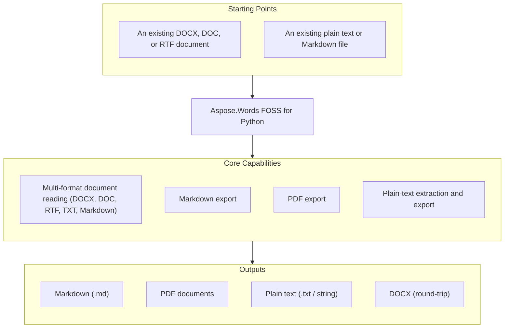

# Aspose.Words FOSS for Python

[](https://pypi.org/project/aspose-words-foss/) [](https://www.python.org/downloads/) [](license/LICENSE) [](https://github.com/aspose-words-foss/Aspose.Words-FOSS-for-Python/graphs/contributors)

[](https://products.aspose.org/words/python/)

Aspose.Words FOSS for Python is a lightweight, open-source Python library for reading Word
documents (DOCX, DOC, RTF, TXT, Markdown) and exporting them to Markdown, plain text, and
PDF — without requiring Microsoft Word. It is a free, lightweight companion to the
[commercial Aspose.Words for Python](https://github.com/aspose-words/Aspose.Words-for-Python-via-.NET)
with a compatible API (`Document`, `SaveFormat`, `SaveOptions`).

## Navigation

- [At a glance](#at-a-glance)
- [Key capabilities](#key-capabilities)
- [Installation](#installation)
- [Quick start](#quick-start)
- [Additional examples](#additional-examples)
- [API reference](#api-reference)
- [Documentation & resources](#documentation--resources)
- [Scope and limitations](#scope-and-limitations)
- [Development and testing](#development-and-testing)
- [License](#license)

## At a Glance



## Key Capabilities

- Convert Word documents (DOCX, DOC, RTF) to Markdown via `Document.save(path,
  SaveFormat.MARKDOWN)`, preserving rich formatting — headings, bold/italic/strikethrough/underline,
  ordered and unordered lists (including nested), tables, block quotes, code blocks, and
  hyperlinks — without requiring Microsoft Word.
- Load DOCX (pure-Python, via `zipfile`/`xml.etree`), legacy DOC (Word 97-2003 binary, via
  `olefile`), and RTF (OLE2 delegation) documents through the same `Document(path)` reader,
  with no third-party DOCX-parser dependency.
- Load plain text (`.txt`) and Markdown (`.md`) files directly through `Document(path)` as
  well, so all five supported input formats share one API.
- Export to PDF via `fpdf2` with `PdfSaveOptions`.
- Export or extract plain text with `SaveFormat.TEXT` and `Document.get_text()`.
- One `Document` class and one `save()` method for every conversion — load once, save to
  any supported target with a `SaveFormat` constant or a save-options object.

## Installation

```bash
python -m pip install aspose-words-foss
```

Requirements: the package requires Python 3.10 or higher (and below 3.13) and depends on `olefile>=0.46`,
`fpdf2>=2.7.0`, and `pydantic>=2.0.0`, installed automatically.

## Quick Start

Convert a document to Markdown:

```python
import aspose.words_foss as aw

doc = aw.Document("input.docx")  # or .doc, .rtf, .txt, .md
doc.save("output.md", aw.SaveFormat.MARKDOWN)
```

Export a document to PDF:

```python
import aspose.words_foss as aw

doc = aw.Document("input.docx")
doc.save("output.pdf", aw.SaveFormat.PDF)
```

## Additional Examples

Runnable examples for the same APIs live under `ApiExamples/` in the repository, covering
every input format converted to every output format. The most common operations are
collected below.

### Extract Plain Text

```python
import aspose.words_foss as aw

doc = aw.Document("input.docx")
text = doc.get_text()
```

<details>
<summary>View Additional Examples</summary>

### Save With Explicit Options

To save with options beyond the defaults, pass a save-options object instead of a
`SaveFormat` constant:

```python
import aspose.words_foss as aw
from aspose.words_foss.saving import MarkdownSaveOptions, PdfSaveOptions

doc = aw.Document("input.docx")

md_opts = MarkdownSaveOptions()
md_opts.export_underline_formatting = True
doc.save("output.md", md_opts)

pdf_opts = PdfSaveOptions()
doc.save("output.pdf", pdf_opts)
```

### Convert Every Input Format to Plain Text

```python
import aspose.words_foss as aw

inputs = {
    "docx": "test_full_article.docx",
    "doc": "test_full_article.doc",
    "rtf": "test_full_article.rtf",
    "md": "test_markdown.md",
}
for label, filename in inputs.items():
    doc = aw.Document(filename)
    doc.save(f"from_{label}.txt", aw.SaveFormat.TEXT)
```

### Running the Bundled Example Scripts

```bash
# Individual scripts
python ApiExamples/convert_document.py

# All examples via pytest
python -m pytest ApiExamples/ -v --rootdir=ApiExamples -c ApiExamples/pytest.ini
```

The example scripts also cover image-containing documents (`working_with_images.py`) and
`OoxmlSaveOptions` (`working_with_ooxml_save_options.py`) round-tripped through every output
format.

</details>

## API Reference

`Document` is the single entry point: load a file with `Document(path)`, then call `save()`
with a target path and a `SaveFormat` constant, or a save-options object for finer control.

<details>
<summary>View the Supported Public API Surface</summary>

### Core API

| Class | Description |
|---|---|
| `Body` | Represents the document body: an ordered list of `Paragraph`, `Table`, and `UnknownNode` children (`BodyChild`). |
| `BookmarkEnd` | Marks the end of a Word bookmark (`<w:bookmarkEnd>`), paired by `name` with a `BookmarkStart`. |
| `BookmarkStart` | Marks the beginning of a Word bookmark (`<w:bookmarkStart>`). |
| `Border` | Border.line_style is an integer representing the border's line style. |
| `Cell` | Cell.type returns the cell's type as a string. |
| `CellFormat` | CellFormat.width specifies the absolute width of the table cell in points. |
| `ColorMode` | Color rendering mode. |
| `CompressionLevel` | Compression level for OOXML files. |
| `ConversionOptions` | Options for controlling DOCX to Markdown conversion. |
| `DocList` | DocList.list_id is the identifier of the list within the document. |
| `Document` | Represents a Word document. |
| `Document-light_document_model` | A distinct `Document` model in `light_document_model.py` — the root node of the light, serializable document-model representation (not the main DOM-style `Document` above). |
| `DocumentFormatReader` | Protocol defining the interface all document readers must implement. |
| `FieldEnd` | Marks the end of a Word field (`<w:fldChar w:fldCharType="end">`), closing a `FieldStart`/`FieldSeparator` pair. |
| `FieldSeparator` | Marks the separator between a Word field's instruction and its cached result (`<w:fldChar w:fldCharType="separate">`). |
| `FieldStart` | FieldStart.type is a string indicating the field's type name. |
| `Font` | Font.name stores the font family name as a string. |
| `FrameFormat` | Floating text-frame definition. |
| `HeaderFooter` | HeaderFooter.type is a string representing the header/footer content type. |
| `ImageData` | ImageData.source_filename holds the original filename of the image. |
| `LdmMarkdownWriter` | Converts a ``light_document_model.Document`` to a Markdown string. |
| `ListFormat` | ListFormat.is_list_item indicates whether the paragraph is a list item. |
| `ListLabel` | Snapshot of a list-item's rendered bullet/number label. |
| `ListLevel` | ListLevel.number_format specifies the numeric format string for the list level. |
| `ListLevelOverride` | One `<w:lvlOverride>` inside a concrete `<w:num>`. |
| `LoadFormat` | Document load format constants. |
| `MarkdownEmptyParagraphExportMode` | Controls how empty paragraphs are exported. |
| `MarkdownExportAsHtml` | Controls which elements are exported as raw HTML. |
| `MarkdownFileReader` | Reads Markdown (.md) files and yields one Paragraph per line. |
| `MarkdownLinkExportMode` | Link export mode options. |
| `MarkdownListExportMode` | List export mode options. |
| `MarkdownSaveOptions` | Options for saving documents as Markdown. |
| `OoxmlCompliance` | OOXML standards compliance level. |
| `OoxmlSaveOptions` | Options for saving a document as DOCX (Office Open XML). |
| `OutlineOptions` | Controls how outlines (bookmarks panel) are generated in the PDF. |
| `PageSetup` | PageSetup.paper_size represents the predefined size of the page (e.g., A4, Letter). |
| `Paragraph` | A paragraph whose children — ``Run``, ``BookmarkStart`` / ``End``, ``FieldStart`` / ``Separator`` / ``End`` and inline ``ShapeNode`` — sit in a single ordered collection in document order. |
| `ParagraphFormat` | ParagraphFormat.alignment specifies the horizontal alignment of the paragraph. |
| `ParagraphInfo` | Information about a paragraph's style and context. |
| `PdfCompliance` | PDF standards compliance level. |
| `PdfFontEmbeddingMode` | Font embedding mode in PDF. |
| `PdfImageCompression` | Image compression in PDF. |
| `PdfPageMode` | PDF page display mode. |
| `PdfSaveOptions` | Options for saving documents as PDF. |
| `PdfTextCompression` | Text compression in PDF. |
| `PdfZoomBehavior` | Mirrors public API. |
| `Row` | Row.type is a string that identifies the row's type. |
| `RowFormat` | RowFormat.height specifies the row's height in points. |
| `RtfFileReader` | Reads RTF files (OLE2-format) and produces the same data structures as DocumentReader (for .docx) and DocFileReader (for .doc). |
| `Run` | Run.text holds the literal text content of the run. |
| `RunFormatting` | Text run formatting properties. |
| `SaveFormat` | Document save format constants. |
| `Section` | Section.type is a string indicating the section's classification or identifier. |
| `Shading` | Shading.background_color holds the background color value for the shading as a string. |
| `ShapeNode` | ShapeNode.type is a string indicating the node's type identifier. |
| `Style` | Style.name is the identifier string of the style. |
| `TabStop` | A single paragraph tab stop: position, alignment (`TabAlignment`), leader character (`TabLeader`), and whether it clears an inherited stop. |
| `TabStopCollection` | TabStopCollection.add(position, alignment, leader) inserts a new tab stop with the specified alignment and leader character. |
| `Table` | Table.rows provides the collection of TableRow objects representing each row in the table. |
| `Table-models` | Represents a table structure (the `models.py` dataclass — a distinct `Table` from the one above). |
| `TableCell` | Represents a table cell. |
| `TableContentAlignment` | Table content alignment options. |
| `TableRow` | Represents a table row. |
| `TableStyleFormat` | Table-level properties stored on table styles (``w:tblPr`` inside ``w:style``). |
| `TextColumn` | Width and trailing spacing for one column in a multi-column section layout (`TextColumns`). |
| `TextColumns` | TextColumns exposes properties count, evenly_spaced, spacing, line_between, and columns to configure multi‑column layout in a document. |
| `TextFileReader` | Reads plain-text (.txt) files and yields one Paragraph per line. |
| `UnknownNode` | Fallback placeholder for a body-child element the reader doesn't recognize, preserving its raw `_type` tag instead of discarding it. |
| `Zip64Mode` | Controls when to use ZIP64 format extensions for OOXML files. |

#### Enumerations

| Enumeration | Description |
|---|---|
| `CodeBlockStyle` | Code block style preference. |
| `HeadingStyle` | Heading export style preference. |
| `ListMarker` | Bullet list marker style. |

### Converters

| Class | Description |
|---|---|
| `ListHandler` | Handles parsing and conversion of lists. |
| `ParagraphConverter` | Handles conversion of paragraphs to Markdown. |
| `TableConverter` | Handles conversion of tables to Markdown. |

### DOC Reader

| Class | Description |
|---|---|
| `BlipInfo` | Parsed BSE (Blip Store Entry) with location of image data. |
| `CharProps` | Properties extracted from CHPX for a text run. |
| `ChildAnchorInfo` | Position of a child shape within its parent group's coordinate system. |
| `DocFileReader` | Full DOC reader with LDM (Light Document Model) building capability. |
| `DocFileReaderCore` | Core reader for Word 97-2003 (.doc) files. |
| `DocTableBuilderMixin` | Mixin that adds table-building helpers to the DOC reader. |
| `FibData` | Parsed FIB (File Information Block) data. |
| `GroupShapeInfo` | Coordinate system of a shape group (from Spgr record). |
| `ListDef` | Parsed list definition with full level information. |
| `ListLevelData` | One parsed LVL record (measurements in points). |
| `ParaProps` | Properties extracted from PAPX for a single paragraph. |
| `ShapeAnchor` | Parsed SPA (Shape Address) from PlcSpaMom / PlcSpaHdr. |
| `ShapeLineProps` | Escher line/fill properties for a shape (from FOpt records). |
| `StyleData` | Properties parsed from a style definition (STSH UPX). |
| `TableRowProps` | Properties extracted from PAPX SPRMs on table row-end paragraphs. |

### DOCX Reader

| Class | Description |
|---|---|
| `CellBuilder` | Build the light document model's `Cell` from a `<w:tc>` element. |
| `CellData` | Table cell. |
| `DocumentReader` | Reads DOCX documents and produces abstracted data structures. |
| `FontBuilder` | Build a non-cascaded light document model `Font` from one `<w:rPr>`. |
| `FontResolver` | Compose a fully cascaded :class:`ldm.Font`. |
| `LdmBuilderMixin` | Mixin that adds :meth:`to_light_document` to :class:`DocumentReader`. |
| `ListBuilder` | Translate `<w:numbering>` into a list of light document model `DocList` objects. |
| `NumberingInfo` | Numbering definition. |
| `NumberingLevel` | List level definition. |
| `PageSetupBuilder` | Build the light document model's `PageSetup` from a `<w:sectPr>` element. |
| `ParagraphBuilder` | Build the light document model's `Paragraph` from a `<w:p>` element. |
| `ParagraphData` | Paragraph with style and content. |
| `ParagraphFormatBuilder` | Build a non-cascaded light document model `ParagraphFormat` from one `<w:pPr>`. |
| `ParagraphFormatResolver` | Compose a fully cascaded :class:`ldm.ParagraphFormat`. |
| `ReaderContext` | Class extending Protocol. |
| `RowBuilder` | Build the light document model's `Row` from a `<w:tr>` element. |
| `RowData` | Table row. |
| `RunBuilder` | Build a single :class:`ldm.Run` with a resolved font cascade. |
| `RunData` | Text run with formatting. |
| `SectionBuilder` | Split the body into :class:`ldm.Section`\\ s at sectPr boundaries. |
| `ShapeParserMixin` | Mixin providing drawing/shape parsing methods for DocumentReader. |
| `StyleBuilder` | Translate `<w:styles>` into a list of light document model `Style` objects. |
| `StyleChainResolver` | Walk the `<w:basedOn>` graph for a styleId, returning its root-to-leaf style-inheritance chain. |
| `TableBuilder` | Build the light document model's `Table` from a `<w:tbl>` element. |
| `TableData` | Table structure. |

### DOCX Writer

| Class | Description |
|---|---|
| `BookmarkState` | Hands out monotonically increasing bookmark ids and pairs starts/ends across paragraphs. |
| `DocxWriterLossyWarning` | Warns the caller that the writer is dropping known LDM constructs. |
| `ImageEntry` | One image to add to ``word/media/`` plus its relationship row. |
| `ImageRenderState` | Accumulator threaded through paragraph rendering for inline shapes. |
| `LdmDocxWriter` | Convert an :class:`ldm.Document` into a DOCX file. |

### Model

| Class | Description |
|---|---|
| `CellMerge` | Specifies how a cell in a table is merged with other cells. |
| `CellVerticalAlignment` | Specifies vertical justification of text inside a table cell. |
| `HeightRule` | Specifies the rule for determining the height of an object. |
| `LineSpacingRule` | Specifies values for line spacing. |
| `LineStyle` | Specifies line style of a border. |
| `NumberStyle` | Specifies the number style for a list, footnotes, endnotes, page numbers. |
| `Orientation` | Specifies page orientation. |
| `ParagraphAlignment` | Specifies text alignment in a paragraph. |
| `SectionStart` | Specifies the type of break at the beginning of the section. |
| `StyleIdentifier` | Locale-independent built-in style identifier. |
| `StyleType` | Specifies type of the style. |
| `TabAlignment` | Tab stop alignment. |
| `TabLeader` | Tab stop leader character. |
| `Underline` | Specifies type of the underline applied to a font. |
| `WrapType` | Specifies how text is wrapped around a shape or picture. |

### Parsers

| Class | Description |
|---|---|
| `ListInfo` | Information about a list. |
| `ListLevelInfo` | Information about a list level. |
| `NumberingParser` | Parser for DOCX numbering definitions. |
| `ParsedStyle` | Parsed style information. |
| `StyleParser` | Parser for DOCX style names and properties. |

### PDF Writer

| Class | Description |
|---|---|
| `LdmPdfWriter` | Converts a ``light_document_model.Document`` to a PDF file. |
| `PDFWriterContext` | Protocol defining the internal state (page geometry, anchor links, renderer instances) shared across the PDF writer's paragraph, shape, and table renderers. |
| `ParagraphRenderer` | Renders LDM paragraphs into PDF. |
| `RunRenderer` | Renders formatted runs (text segments with fonts, colors, links). |
| `ShapeRenderer` | Renders shapes, images, and positioned elements. |
| `TableRenderer` | Renders LDM tables into PDF. |
---

#### Detailed Member Reference

### Document

- `Document`
  - `get_text() -> str`
  - `save(output_path, save_format_or_options) -> None`
  - Properties: `sections`, `first_section`, `last_section`, `styles`, `lists`, `page_count`
- `SaveFormat` — enum values `MARKDOWN`, `DOC`, `DOCX`, `TEXT`, `PDF`

### Save Options

- `MarkdownSaveOptions` — `table_content_alignment`, `list_export_mode`,
  `export_images_as_base64`, `images_folder`, `images_folder_alias`,
  `export_underline_formatting`, `link_export_mode`, `export_as_html`,
  `empty_paragraph_export_mode`, `paragraph_break` (all of these
  are applied by the writer)
- `PdfSaveOptions` — `compliance`, `export_document_structure`, `image_compression`,
  `jpeg_quality`, `zoom_factor`, `zoom_behavior`, `export_bookmarks_outline`,
  `outline_options`, `display_doc_title` (applied by the writer);
  `text_compression`, `embed_full_fonts`, `use_core_fonts`, `font_embedding_mode`,
  `page_mode`, `color_mode`, `preserve_form_fields`, `memory_optimization`
  (accepted but not yet consumed)
- `OoxmlSaveOptions`, `OoxmlCompliance`
- `ConversionOptions`

### Document Object Model (Light Document Model)

- `Document` (light model) — `find_style(name)`, `headings(max_level)`; properties
  `all_paragraphs`, `tables`, `all_tables`, `text`, `sections`, `styles`, `lists`,
  `header_paragraphs`, `footer_paragraphs`
- `Section`, `Paragraph` (`runs`, `paragraph_format`, `list_format`, `text`), `Run`,
  `Table`, `Row`, `Cell`
- `Font` — `name`, `size`, `bold`, `italic`, `underline`, `color`, `strike_through`,
  `superscript`, `subscript`, `highlight_color`, `all_caps`, `small_caps`, `shading`
- `ParagraphFormat`, `Style`, `ListFormat`, `ListLevel`, `ListLabel`, `NumberStyle`
- `Border`, `Shading`, `FrameFormat`, `HeaderFooter`, `PageSetup`, `TextColumn`,
  `TextColumns`

### Readers and Writers (Internal Pipeline)

- `DocumentReader`, `RtfFileReader`, `MarkdownFileReader`, `TextFileReader`,
  `DocFileReader` — implement `DocumentFormatReader` (`load_file`, `load_stream`,
  `load_bytes`, `to_light_document`)
- `LdmDocxWriter`, `LdmMarkdownWriter`, `LdmPdfWriter` — internal writers behind `save()`

</details>

## Documentation & Resources

- **[Getting started guide](https://docs.aspose.org/words/python/)** — installation, walkthroughs, and feature guides for this library.
- **[How-to guides & FAQ](https://kb.aspose.org/words/python/)** — task-focused answers for common Word-document-conversion questions.
- **[Full API reference](https://reference.aspose.org/words/python/)** — the complete, browsable reference for all 146 public types (the [API reference](#api-reference) section above covers the essentials).
- Found a bug or have a feature request? [Open an issue](https://github.com/aspose-words-foss/Aspose.Words-FOSS-for-Python/issues) on GitHub.

## Scope and Limitations

- All `MarkdownSaveOptions` properties listed in the [API reference](#api-reference) are
  consumed by the Markdown writer; for `PdfSaveOptions`, only `compliance`,
  `export_document_structure`, `image_compression`, `jpeg_quality`, `zoom_factor`,
  `zoom_behavior`, `export_bookmarks_outline`, `outline_options`, and `display_doc_title`
  are applied by the PDF writer — `text_compression`, `embed_full_fonts`, `use_core_fonts`,
  `font_embedding_mode`, `page_mode`, `color_mode`, `preserve_form_fields`, and
  `memory_optimization` exist for API forward-compatibility with the commercial
  Aspose.Words API and are not yet consumed.
- `LdmDocxWriter` has a documented `NotImplementedError` in its compliance-enforcement path
  (`_enforce_compliance`).
- The library reads and writes a fixed set of formats — DOCX, DOC, RTF, TXT, and Markdown on
  input; DOCX, Markdown, plain text, and PDF on output — and does not implement DOCX authoring
  features beyond what its writers currently support.

These limitations don't apply to
[Aspose.Words for Python — Enterprise Edition](https://products.aspose.com/words/python-net/),
which adds full feature support — `PdfSaveOptions` enforcement (text compression, font
embedding, core-font substitution, preserved form fields, memory optimization), complete DOCX
compliance enforcement, and a much broader set of input/output formats and DOCX authoring
capabilities.

## Development and Testing

Install the package with the `dev` extra (adds `Pillow` and `pytest`) and run the bundled
API examples as tests:

```bash
python -m pip install -e ".[dev]"
python -m pytest ApiExamples/ -v --rootdir=ApiExamples -c ApiExamples/pytest.ini
```

Input / output locations: shared test fixtures live under `tests/data/input/`; example
output is written to the git-ignored `ApiExamples/output/`. Individual example scripts
include `convert_document.py`
(every input format to every output format), `working_with_markdown_save_options.py`
(only the `MarkdownSaveOptions` that are actually applied), `working_with_pdf_save_options.py`
(PDF export from all input formats), `working_with_txt_save_options.py` (plain-text export
and `get_text()`), and `working_with_images.py` (image-containing documents to all output
formats).

## License

This project is licensed under the [MIT License](license/LICENSE). The MIT License permits use, copying,
modification, distribution, sublicensing, and commercial use, provided its copyright and
permission notice are retained. The software is provided without warranty.
