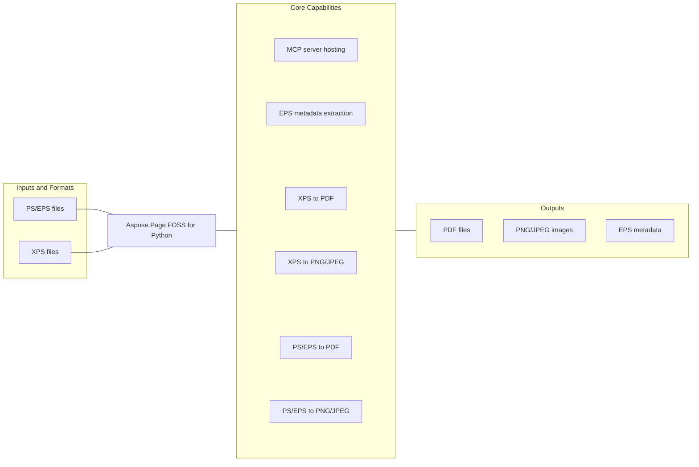

# Aspose.Page FOSS for Python

[](https://github.com/aspose-page-foss/Aspose.Page-FOSS-for-Python/tree/dac5d70e0f91949a780f2e98dfbb12314a5fbc70)   [](LICENSE.txt) [](https://github.com/aspose-page-foss/Aspose.Page-FOSS-for-Python/graphs/contributors)


Aspose.Page FOSS for Python is an open-source Python document conversion library for developers who need PostScript (PS), Encapsulated PostScript (EPS), and XPS conversion in backend services, automation pipelines, and document workflows.

## Navigation

- [At a Glance](#at-a-glance)
- [Key Capabilities](#key-capabilities)
- [Installation](#installation)
- [Quick Start](#quick-start)
- [Additional Examples](#additional-examples)
- [API Reference](#api-reference)
- [Documentation and Resources](#documentation-and-resources)
- [Scope and Limitations](#scope-and-limitations)
- [Development and Testing](#development-and-testing)
- [License](#license)

## At a Glance



## Key Capabilities

- **Convert PS/EPS files to PDF in Python** - Serialize the supported source content as PDF output. Available through the public `ps_to_pdf` API.
- **Convert PS/EPS files to PNG and JPEG in Python** - Render the supported source content as raster image data. Available through the public `PsImage` and `ps_to_image` APIs.
- **Convert XPS files to PDF in Python** - Serialize the supported source content as PDF output. Available through the public `xps_to_pdf` API.
- **Convert XPS files to PNG and JPEG in Python** - Render the supported source content as raster image data. Available through the public `XpsImage`, `xps_to_image`, and `PsImage` APIs.
- **Host MCP servers** - Create and run the MCP server through the public `create_server` and `run` APIs.
- **Extract EPS metadata** - Read EPS metadata through the public `eps_metadata` API.

## Installation

Install the package from its source repository:

```bash
git clone https://github.com/aspose-page-foss/Aspose.Page-FOSS-for-Python.git
cd Aspose.Page-FOSS-for-Python
python -m pip install .
```

Install optional dependencies by scenario:

- Image conversion (`ps_to_image`, `xps_to_image`): `python -m pip install skia-python Pillow`
- MCP server hosting: `python -m pip install fastmcp`
- Running the test suite: `python -m pip install ".[test]"`

## Quick Start

```python
from aspose.page.ps.document import PsDocument

ps = PsDocument.from_file("input.ps")
output_pdf = ps.to_pdf()

with open("output.pdf", "wb") as f:
    f.write(output_pdf)
```

## Additional Examples

Expand this section to view examples for converting EPS to PNG, converting XPS to PDF and JPEG, hosting the MCP server, and viewing generated example results.

<details>
<summary>View additional examples and results</summary>

### Convert EPS to PNG

```python
from aspose.page.ps.document import PsDocument
from aspose.page.ps.output import ImageSaveOptions

eps = PsDocument.from_file("input.eps")
output_png = eps.to_image(ImageSaveOptions(format="png", dpi=150))

with open("output.png", "wb") as f:
    f.write(output_png)
```

### Convert XPS to PDF

```python
from aspose.page.xps.document import XpsDocument

xps = XpsDocument.from_file("input.xps")
output_pdf = xps.to_pdf()

with open("output.pdf", "wb") as f:
    f.write(output_pdf)
```

### Convert XPS to JPEG

```python
from aspose.page.ps.output import ImageSaveOptions
from aspose.page.xps.document import XpsDocument

xps = XpsDocument.from_file("input.xps")
output_jpeg = xps.to_image(ImageSaveOptions(format="jpeg", dpi=150))

with open("output.jpg", "wb") as f:
    f.write(output_jpeg)
```

### Host the MCP Server

The MCP server exposes the `ps_to_pdf`, `ps_to_image`, `xps_to_pdf`, `xps_to_image`, and `eps_metadata` tools for integrating conversion workflows.

```python
from aspose.page.mcp import create_server

server = create_server()
server.run(host="127.0.0.1", port=8000)
```

### Example Results

An XPS document converted to PDF, rendered here as PNG:


A PS file converted to PDF, rendered here as PNG:


A PS/EPS to image conversion sample:


</details>

## API Reference

The package declares 134 public exports across 41 export namespaces. Package namespaces include `aspose.page.mcp`, `aspose.page.pdf`, `aspose.page.ps`, `aspose.page.xps`.

<details>
<summary>View public API by namespace</summary>

### Aspose.Page.MCP Namespace (`aspose.page.mcp`)

| Type | Description |
| --- | --- |
| `create_server` | Creates and configures the Aspose.Page MCP server. |
| `run` | Starts the Aspose.Page MCP server. |

### Aspose.Page.PDF Namespace (`aspose.page.pdf`)

| Type | Description |
| --- | --- |
| `ImageResource` | Stores Image resource data through the Aspose.Page API. Exposes bits per component, color space, and data. Includes 8 additional members. |
| `PdfMetadata` | Stores PDF metadata through the Aspose.Page API. Exposes creation date, creator, and mod date. Includes 3 additional members. |
| `PdfWriter` | Writes PDF output through the Aspose.Page API. |

### Aspose.Page.PS Namespace (`aspose.page.ps`)

| Type | Description |
| --- | --- |
| `ImageSaveOptions` | Configures Image output through the Aspose.Page API. Exposes additional fonts folder, dpi, and font resolver. Includes 3 additional members. |
| `PdfSaveOptions` | Configures PDF output through the Aspose.Page API. Exposes additional fonts folder and no compression. |
| `PsDocument` | Represents a PS document through the Aspose.Page API. Supports adding pages, serializing content to bytes, and creating document instances. Includes 20 additional members. |
| `convert_image_to_eps` | Converts image content to EPS output. |

### Aspose.Page.XPS Namespace (`aspose.page.xps`)

| Type | Description |
| --- | --- |
| `XpsDocument` | Represents an XPS document through the Aspose.Page API. Supports adding pages, creating document instances, and loading content from bytes. Includes 12 additional members. |

### Aspose.Page.Common.Color Resources Namespace (`aspose.page.common.color_resources`)

| Type | Description |
| --- | --- |
| `AxialShading` | Represents an Axial Shading in the public color resources API for Aspose.Page. Exposes color space, coords, and domain. Includes 2 additional members. |
| `CieBasedColorSpace` | Represents a CIE Based Color Space in the public color resources API for Aspose.Page. Exposes components, icc profile, and ranges. |
| `ColorSpacePaint` | Represents a Color Space Paint in the public color resources API for Aspose.Page. Exposes components and space id. |
| `DeviceColorSpace` | Represents a Device Color Space in the public color resources API for Aspose.Page. |
| `DeviceNColorSpace` | Represents a Device N Color Space in the public color resources API for Aspose.Page. Exposes alternate, names, and tint. |
| `ExponentialFunction` | Represents an Exponential Function in the public color resources API for Aspose.Page. Exposes c0, c1, and domain. Includes 3 additional members. |
| `IndexedColorSpace` | Represents an Indexed Color Space in the public color resources API for Aspose.Page. Exposes base, hival, and lookup. |
| `PatternColorSpace` | Represents a Pattern Color Space in the public color resources API for Aspose.Page. |
| `PatternPaint` | Represents a Pattern Paint in the public color resources API for Aspose.Page. Exposes base components, base space id, and pattern id. |
| `RadialShading` | Represents a Radial Shading in the public color resources API for Aspose.Page. Exposes color space, coords, and domain. Includes 2 additional members. |
| `SampledFunction` | Represents a Sampled Function in the public color resources API for Aspose.Page. Exposes bits per sample, decode, and domain. Includes 6 additional members. |
| `SeparationColorSpace` | Represents a Separation Color Space in the public color resources API for Aspose.Page. Exposes alternate, name, and tint. |
| `ShadingPattern` | Represents a Shading Pattern in the public color resources API for Aspose.Page. |
| `StitchingFunction` | Represents a Stitching Function in the public color resources API for Aspose.Page. Exposes bounds, domain, and encode. Includes 3 additional members. |
| `TilingPattern` | Represents a Tiling Pattern in the public color resources API for Aspose.Page. Exposes bbox, commands, and matrix. Includes 4 additional members. |

### Aspose.Page.Common.Render Model Namespace (`aspose.page.common.render_model`)

| Type | Description |
| --- | --- |
| `ClipCommand` | Represents a Clip command through the Aspose.Page API. Exposes fill rule and path. |
| `ImageCommand` | Represents an Image command through the Aspose.Page API. Exposes height, image id, and mask. Includes 4 additional members. |
| `Matrix` | Represents a Matrix in the public render model API for Aspose.Page. Exposes a, b, and c. Includes 4 additional members. |
| `Paint` | Represents a Paint in the public render model API for Aspose.Page. Exposes kind and value. |
| `Path` | Represents a page path through the Aspose.Page API. |
| `PathCommand` | Represents a Path command through the Aspose.Page API. Exposes fill, fill opacity, and fill rule. Includes 5 additional members. |
| `PathSegment` | Represents a Path Segment in the public render model API for Aspose.Page. Exposes kind and points. |
| `Point` | Represents a Point in the public render model API for Aspose.Page. Exposes x and y. |
| `Rect` | Represents a Rect in the public render model API for Aspose.Page. Exposes x max, x min, and y max. Includes 1 additional member. |
| `RenderDocument` | Represents a Render document through the Aspose.Page API. |
| `RenderImageResource` | Stores Render Image resource data through the Aspose.Page API. Exposes bits per component, color space, and data. Includes 8 additional members. |
| `RenderModelBuilder` | Builds Render Model through the Aspose.Page API. Supports adding images, adding paths, and adding texts. Includes 10 additional members. |
| `RenderPage` | Represents a Render Page in the public render model API for Aspose.Page. Exposes commands, height, and width. |
| `RenderResources` | Represents a Render Resources in the public render model API for Aspose.Page. Exposes color spaces, functions, and images. Includes 1 additional member. |
| `StateRestoreCommand` | Represents a State Restore command through the Aspose.Page API. |
| `StateSaveCommand` | Represents a State Save command through the Aspose.Page API. |
| `StrokeStyle` | Represents a Stroke Style in the public render model API for Aspose.Page. Exposes dash, dash phase, and line cap. Includes 3 additional members. |
| `TextCommand` | Represents a Text command through the Aspose.Page API. Exposes fill, fill opacity, and font ref. Includes 5 additional members. |
| `rect_path` | Creates a rectangular rendering path. |

### Aspose.Page.Image.Encoders Namespace (`aspose.page.image.encoders`)

| Type | Description |
| --- | --- |
| `add_png_dpi` | Adds PNG dpi metadata to generated output. |
| `encode_bmp` | Encodes raster data as BMP output. |
| `encode_jpeg` | Encodes raster data as JPEG output. |
| `encode_png` | Encodes raster data as PNG output. |
| `encode_tiff` | Encodes raster data as TIFF output. |

### Aspose.Page.Image.Raster Renderer Namespace (`aspose.page.image.raster_renderer`)

| Type | Description |
| --- | --- |
| `RasterRenderer` | Renders Raster content through the Aspose.Page API. |
| `RasterSurface` | Represents a Raster Surface in the public raster renderer API for Aspose.Page. Supports creating document instances, retrieving pixel, and setting pixel. Includes 4 additional members. |

### Aspose.Page.Image.Raster Writer Namespace (`aspose.page.image.raster_writer`)

| Type | Description |
| --- | --- |
| `DefaultRasterWriter` | Writes Default Raster output through the Aspose.Page API. |
| `RasterWriter` | Writes Raster output through the Aspose.Page API. |
| `RenderModelRasterWriter` | Writes Render Model Raster output through the Aspose.Page API. |
| `select_raster_writer` | Selects the appropriate raster writer for the requested output. |

### Aspose.Page.Image.Skia Raster Writer Namespace (`aspose.page.image.skia_raster_writer`)

| Type | Description |
| --- | --- |
| `SkiaRasterWriter` | Writes Skia Raster output through the Aspose.Page API. |
| `skia_available` | Reports whether the Skia raster backend is available. |

### Aspose.Page.MCP.Handlers Namespace (`aspose.page.mcp.handlers`)

| Type | Description |
| --- | --- |
| `eps_metadata` | Reads EPS metadata from source content. |
| `ps_to_image` | Converts PS content to image output. |
| `ps_to_pdf` | Converts PS content to PDF output. |
| `xps_to_image` | Converts XPS content to image output. |
| `xps_to_pdf` | Converts XPS content to PDF output. |

### Aspose.Page.MCP.Server Namespace (`aspose.page.mcp.server`)

| Type | Description |
| --- | --- |
| `create_server` | The `aspose.page.mcp.server` namespace re-exports `create_server` from the primary `aspose.page.mcp` namespace. |
| `run` | The `aspose.page.mcp.server` namespace re-exports `run` from the primary `aspose.page.mcp` namespace. |

### Aspose.Page.MCP.Types Namespace (`aspose.page.mcp.types`)

| Type | Description |
| --- | --- |
| `McpConversionOptions` | Configures MCP Conversion operations through the Aspose.Page API. Exposes dpi, format, and no compress. |
| `McpInput` | Defines MCP input through the Aspose.Page API. Exposes input bytes b64 and input path. |
| `McpOutput` | Defines MCP output through the Aspose.Page API. Exposes output path and return bytes. |
| `McpResult` | Stores MCP result data through the Aspose.Page API. Exposes output bytes b64 and output path. |

### Aspose.Page.PDF.Fonts Namespace (`aspose.page.pdf.fonts`)

| Type | Description |
| --- | --- |
| `PdfEmbeddedFont` | Represents a PDF Embedded font through the Aspose.Page API. Exposes ascent, base name, and bbox. Includes 16 additional members. |
| `build_to_unicode` | Converts build content to unicode output. |

### Aspose.Page.PDF.Utils Namespace (`aspose.page.pdf.utils`)

| Type | Description |
| --- | --- |
| `escape_pdf_string` | Escapes PDF string content for safe serialization. |
| `format_matrix` | Formats matrix values for serialized output. |
| `format_rect` | Formats rect values for serialized output. |

### Aspose.Page.PDF.Writer Namespace (`aspose.page.pdf.writer`)

| Type | Description |
| --- | --- |
| `ImageResource` | The `aspose.page.pdf.writer` namespace re-exports `ImageResource` from the primary `aspose.page.pdf` namespace. |
| `PdfMetadata` | The `aspose.page.pdf.writer` namespace re-exports `PdfMetadata` from the primary `aspose.page.pdf` namespace. |
| `PdfWriter` | The `aspose.page.pdf.writer` namespace re-exports `PdfWriter` from the primary `aspose.page.pdf` namespace. |
| `RectWrapper` | Represents a Rect Wrapper in the public writer API for Aspose.Page. Exposes height, width, and x max. Includes 3 additional members. |

### Aspose.Page.PS.Clipper Namespace (`aspose.page.ps.clipper`)

| Type | Description |
| --- | --- |
| `Clipper` | Represents a Clipper in the public clipper API for Aspose.Page. Supports adding edge to sels, adding ghost joins, and adding joins. Inherits from `ClipperBase`. Includes 21 additional members. |
| `ClipperBase` | Represents a Clipper Base in the public clipper API for Aspose.Page. Supports adding bounds to lmls, adding paths, and alling horizontal. Includes 21 additional members. |
| `TEdge` | Represents a T Edge in the public clipper API for Aspose.Page. Exposes bot, curr, and delta. Includes 15 additional members. |
| `PolyNode` | Represents a Poly Node in the public clipper API for Aspose.Page. Supports adding children. Exposes child count and children. Includes 6 additional members. |
| `PolyOffsetBuilder` | Builds Poly Offset through the Aspose.Page API. Supports adding points, building output, and doing miter. Includes 6 additional members. |
| `OutRec` | Represents an Out Rec in the public clipper API for Aspose.Page. Exposes bottom pt, first left, and idx. Includes 4 additional members. |
| `IntRect` | Represents an Int Rect in the public clipper API for Aspose.Page. Exposes bottom, left, and right. Includes 1 additional member. |
| `IntersectNode` | Represents an Intersect Node in the public clipper API for Aspose.Page. Exposes edge1, edge2, and next. Includes 1 additional member. |
| `LocalMinima` | Represents a Local Minima in the public clipper API for Aspose.Page. Exposes left bound, next, and right bound. Includes 1 additional member. |
| `OutPt` | Represents an Out Pt in the public clipper API for Aspose.Page. Exposes idx, next, and prev. Includes 1 additional member. |
| `PolyTree` | Represents a Poly Tree in the public clipper API for Aspose.Page. Supports clearing content and retrieving first. Exposes all polys. Inherits from `PolyNode`. Includes 10 additional members. |
| `Join` | Represents a Join in the public clipper API for Aspose.Page. Exposes off pt, out pt1, and out pt2. |
| `DoublePoint` | Represents a Double Point in the public clipper API for Aspose.Page. Exposes x and y. |
| `IntPoint` | Represents an Int Point in the public clipper API for Aspose.Page. Exposes x and y. |

### Aspose.Page.PS.Context Namespace (`aspose.page.ps.context`)

| Type | Description |
| --- | --- |
| `GraphicsState` | Stores Graphics state through the Aspose.Page API. Supports cloning content. Exposes char spacing and clip path. Includes 21 additional members. |
| `ExecutionContext` | Represents an Execution Context in the public context API for Aspose.Page. Exposes charpath mode, default page size, and dictionary stack. Includes 11 additional members. |

### Aspose.Page.PS.Editing Namespace (`aspose.page.ps.editing`)

| Type | Description |
| --- | --- |
| `PsCanvas` | Provides a PS drawing canvas through the Aspose.Page API. Supports closing path, curving to, and drawing image. Includes 19 additional members. |
| `PsImage` | Represents a PS Image in the public editing API for Aspose.Page. Exposes bits per component, color space, and data. Includes 4 additional members. |
| `PsPage` | Represents a PS Page in the public editing API for Aspose.Page. Exposes canvas, content, and dirty. Includes 2 additional members. |

### Aspose.Page.PS.Fonts Namespace (`aspose.page.ps.fonts`)

| Type | Description |
| --- | --- |
| `FontResource` | Stores Font resource data through the Aspose.Page API. Exposes char procs, code map, and code widths. Includes 13 additional members. |
| `FontResolver` | Represents a Font Resolver in the public fonts API for Aspose.Page. Supports retrieving embedded type42, retrieving glyph width, and registering defined font. Includes 4 additional members. |
| `EmbeddedType42` | Represents an Embedded Type42 in the public fonts API for Aspose.Page. Exposes code widths, data, and units per em. |

### Aspose.Page.PS.DSC Namespace (`aspose.page.ps.dsc`)

| Type | Description |
| --- | --- |
| `DscMetadata` | Stores DSC metadata through the Aspose.Page API. Exposes bounding box, creation date, and creator. Includes 9 additional members. |

### Aspose.Page.PS.Images Namespace (`aspose.page.ps.images`)

| Type | Description |
| --- | --- |
| `PsImageResource` | Stores PS Image resource data through the Aspose.Page API. Exposes bits per component, color space, and data. Includes 9 additional members. |
| `PsImageStore` | Represents a PS Image Store in the public images API for Aspose.Page. Includes 3 additional members. |

### Aspose.Page.PS.TTF Outline Namespace (`aspose.page.ps.ttf_outline`)

| Type | Description |
| --- | --- |
| `TrueTypeFont` | Represents a True Type font through the Aspose.Page API. Supports glyphing advance, glyphing id for code, and glyphing outline. Includes 8 additional members. |
| `GlyphPoint` | Represents a Glyph Point in the public TTF outline API for Aspose.Page. Exposes on curve, x, and y. |

### Aspose.Page.XPS.Images Namespace (`aspose.page.xps.images`)

| Type | Description |
| --- | --- |
| `XpsImageResource` | Stores XPS Image resource data through the Aspose.Page API. Exposes bits per component, color space, and data. Includes 7 additional members. |

### Aspose.Page.PS.Tokenizer Namespace (`aspose.page.ps.tokenizer`)

| Type | Description |
| --- | --- |
| `PsTokenizer` | Represents a PS Tokenizer in the public tokenizer API for Aspose.Page. Supports nexting token, reading asciihex decoded, and reading asciihex source. Includes 4 additional members. |

### Aspose.Page.PS.Type1 Parser Namespace (`aspose.page.ps.type1_parser`)

| Type | Description |
| --- | --- |
| `Type1Metrics` | Represents a Type1 Metrics in the public type1 parser API for Aspose.Page. Exposes code widths, encoding, and font bbox. Includes 4 additional members. |

### Aspose.Page.PS.Stack Namespace (`aspose.page.ps.stack`)

| Type | Description |
| --- | --- |
| `PsStack` | Represents a PS Stack in the public stack API for Aspose.Page. Supports clearing content, cloning content, and converting content to list. Inherits from `Generic[T]`. Includes 3 additional members. |

### Aspose.Page.XPS.Editing Namespace (`aspose.page.xps.editing`)

| Type | Description |
| --- | --- |
| `XpsGlyphs` | Represents an XPS Glyphs in the public editing API for Aspose.Page. Exposes fill, font size, and font URI. Includes 3 additional members. |
| `XpsDocumentBuilder` | Builds XPS Document through the Aspose.Page API. Supports adding pages, inserting page, and removing page. Includes 2 additional members. |
| `XpsImage` | Represents an XPS Image in the public editing API for Aspose.Page. Exposes height, source, and transform. Includes 1 additional member. |
| `XpsPath` | Represents an XPS path through the Aspose.Page API. Exposes data, fill, and stroke. Includes 1 additional member. |
| `XpsCanvas` | Provides an XPS drawing canvas through the Aspose.Page API. Exposes clip, elements, and transform. |
| `XpsFixedPage` | Represents an XPS Fixed Page in the public editing API for Aspose.Page. Exposes elements, height, and width. |

### Aspose.Page.PS.Image to EPS Namespace (`aspose.page.ps.image_to_eps`)

| Type | Description |
| --- | --- |
| `ImageInfo` | Represents an Image Info in the public image to EPS API for Aspose.Page. Exposes bits per component, color space, and height. Includes 2 additional members. |

### Aspose.Page.XPS.Package Namespace (`aspose.page.xps.package`)

| Type | Description |
| --- | --- |
| `XpsPackage` | Represents an XPS Package in the public package API for Aspose.Page. Supports loading content from bytes, loading content from file, and checking for part. Includes 2 additional members. |

### Aspose.Page.PS.Font Cache Namespace (`aspose.page.ps.font_cache`)

| Type | Description |
| --- | --- |
| `FontRecord` | Represents a Font Record in the public font cache API for Aspose.Page. Exposes is monospace, name, and path. Includes 1 additional member. |
| `FontCache` | Represents a Font Cache in the public font cache API for Aspose.Page. Supports finding font, loading content, and metricsing for. |
| `FontMetrics` | Represents a Font Metrics in the public font cache API for Aspose.Page. Exposes code widths and units per em. |

### Aspose.Page.PS.Operators Namespace (`aspose.page.ps.operators`)

| Type | Description |
| --- | --- |
| `OperatorEntry` | Represents an Operator Entry in the public operators API for Aspose.Page. Exposes fn, max operands, and min operands. Includes 1 additional member. |
| `OperatorRegistry` | Represents an Operator Registry in the public operators API for Aspose.Page. Includes 2 additional members. |

### Aspose.Page.PS.Interpreter Namespace (`aspose.page.ps.interpreter`)

| Type | Description |
| --- | --- |
| `PsInterpreter` | Represents a PS Interpreter in the public interpreter API for Aspose.Page. Supports executing procedure. Includes 3 additional members. |

### Aspose.Page.PS.VM Namespace (`aspose.page.ps.vm`)

| Type | Description |
| --- | --- |
| `PsSaveState` | Stores PS Save state through the Aspose.Page API. Exposes dictionary stack, execution stack, and graphics state stack. Includes 1 additional member. |

### Aspose.Page.PS.Filters Namespace (`aspose.page.ps.filters`)

| Type | Description |
| --- | --- |
| `FilterResult` | Stores Filter result data through the Aspose.Page API. Exposes data, params, and remaining filter. |

### Aspose.Page.XPS.Print Tickets Namespace (`aspose.page.xps.print_tickets`)

| Type | Description |
| --- | --- |
| `PrintTicket` | Represents a Print Ticket in the public print tickets API for Aspose.Page. Exposes part name, scope, and XML. |
| `PrintTicketScope` | Enumerates print ticket scope values. Values include `DOCUMENT`, `JOB`, and `PAGE`. |

### Aspose.Page.PS.Objects Namespace (`aspose.page.ps.objects`)

| Type | Description |
| --- | --- |
| `PsFile` | Represents a PS File in the public objects API for Aspose.Page. Exposes data, mode, and name. |
| `PsString` | Represents a PS String in the public objects API for Aspose.Page. Exposes filter params, remaining filter, and value. |
| `PsName` | Represents a PS Name in the public objects API for Aspose.Page. Exposes literal and value. |
| `PsPattern` | Represents a PS Pattern in the public objects API for Aspose.Page. Exposes pattern and pattern id. |

### Aspose.Page.XPS.Relationships Namespace (`aspose.page.xps.relationships`)

| Type | Description |
| --- | --- |
| `Relationship` | Represents a Relationship in the public relationships API for Aspose.Page. Exposes id, target, and type. |

### Aspose.Page.XPS.Render Namespace (`aspose.page.xps.render`)

| Type | Description |
| --- | --- |
| `XpsRenderer` | Renders XPS content through the Aspose.Page API. Supports rendering fixed page, setting current part, and setting package. |

### Aspose.Page.XPS.Resources Namespace (`aspose.page.xps.resources`)

| Type | Description |
| --- | --- |
| `XpsResourceDictionary` | Represents an XPS Resource Dictionary in the public resources API for Aspose.Page. Exposes items and parent. Includes 1 additional member. |

### Aspose.Page.PS.Parser Namespace (`aspose.page.ps.parser`)

| Type | Description |
| --- | --- |
| `PsParser` | Represents a PS Parser in the public parser API for Aspose.Page. Includes 2 additional members. |

</details>


## Documentation and Resources

- **[Getting started guide](https://docs.aspose.org/page/python/)** - installation, walkthroughs, and feature guides for this library.
- **[How-to guides and FAQ](https://kb.aspose.org/page/python/)** - task-focused answers for common product questions.
- **[Full API reference](https://reference.aspose.org/page/python/)** - the complete browsable reference for the public API.
- Found a bug or have a feature request? [Open an issue](https://github.com/aspose-page-foss/Aspose.Page-FOSS-for-Python/issues) on GitHub.

## Scope and Limitations

The library targets the conversion workflows listed above; PostScript color-space, function, and embedded-font support has documented boundaries. Ten specific constraints are listed below.

<details>
<summary>View specific limitations</summary>

- Exponential functions require exactly one input.
- Stitching functions require exactly one input.
- Type0 embedded fonts require a CID descendant.
- Unsupported color space types are rejected.
- Unsupported device color spaces are rejected.
- Indexed color spaces require base, hival, and lookup entries.
- Separation color spaces require name, alternate, and tint entries.
- DeviceN color spaces require names, alternate, and tint entries.
- CIEBased color spaces require a dictionary.
- Unsupported color tuple lengths are rejected.

</details>

This repository contains [Aspose.Page FOSS for Python](https://products.aspose.org/page/python/). For requirements beyond the FOSS scope described above, explore the [full-featured Aspose.Page Enterprise Edition](https://products.aspose.com/page/). It is a separate product, so features and APIs may differ.

## Development and Testing

The repository includes 66 test files, 4 declared Make targets, 3 source-bound validation commands.

<details>
<summary>View development and testing resources</summary>

### Tests

- [`tests/common/compare_utils.py`](tests/common/compare_utils.py)
- [`tests/common/output_utils.py`](tests/common/output_utils.py)
- [`tests/common/pdf_validator.py`](tests/common/pdf_validator.py)
- [`tests/common/render_model_dump.py`](tests/common/render_model_dump.py)
- [`tests/common/test_utils.py`](tests/common/test_utils.py)
- [Browse all test files](tests)

### Repository Make Targets

```bash
make sync
```

```bash
make test
```

```bash
make build
```

```bash
make check
```

### Focused Commands and Repository Scripts

```bash
python -m unittest tests.mcp.test_handlers tests.mcp.test_server
```

```bash
python -m pip install -e .
```

```bash
python -m unittest discover -s tests -p "test_*.py"
```


</details>

## License

This project is available under the [MIT License](LICENSE.txt). It permits use, modification, distribution, and commercial use when the license and copyright notice are retained.
