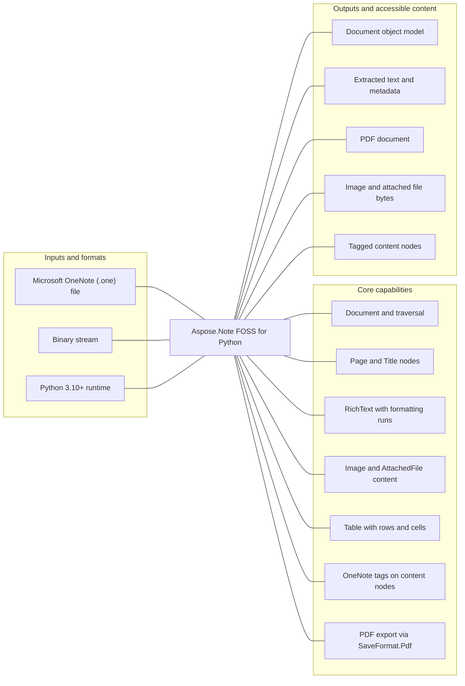

# Aspose.Note FOSS for Python

[](https://pypi.org/project/aspose-note/) [](https://pypi.org/project/aspose-note/) [](https://github.com/aspose-note-foss/Aspose.Note-FOSS-for-Python/actions/workflows/ci.yml) [](LICENSE) [](https://github.com/aspose-note-foss/Aspose.Note-FOSS-for-Python/graphs/contributors)

Aspose.Note FOSS for Python is a Python library for reading Microsoft OneNote (.one) files and exporting to PDF, offering a subset-compatible Aspose.Note for .NET-shaped public API. It supports document traversal, content extraction (RichText, images, tables, tags, numbered lists), and PDF export via SaveFormat.Pdf.

## Navigation

- [At a glance](#at-a-glance)
- [Key capabilities](#key-capabilities)
- [Installation](#installation)
- [Quick start](#quick-start)
- [Additional examples](#additional-examples)
- [API reference](#api-reference)
- [Scope and limitations](#scope-and-limitations)
- [Development and testing](#development-and-testing)
- [Third-party notices](#third-party-notices)
- [License](#license)

## At a glance



## Key capabilities

- Document and traversal.
- Page and Title nodes.
- RichText with formatting runs.
- Image and AttachedFile content.
- Table with rows and cells.
- OneNote tags on content nodes.
- Numbered lists and outline elements.
- PDF export via SaveFormat.Pdf.

## Installation

```bash
python -m pip install aspose-note
```

Requires Python 3.10 or later.

Optional dependency groups declared in `pyproject.toml`:
- `dev`: `python -m pip install "aspose-note[dev]"`
- `pdf`: `python -m pip install "aspose-note[pdf]"`
- `test-pdf`: `python -m pip install "aspose-note[test-pdf]"`

## Quick start

### Minimal verified example

- Before running the example, provide `testfiles/3ImagesWithDifferentAlignment.one`; verification used the repository fixture `testfiles/3ImagesWithDifferentAlignment.one`.

```python
from aspose.note import Document, Image

doc = Document("testfiles/3ImagesWithDifferentAlignment.one")
for i, img in enumerate(doc.GetChildNodes(Image), start=1):
    name = img.FileName or f"image_{i}.bin"
    with open(name, "wb") as f:
        f.write(img.Bytes)
```

## Additional examples

Explore additional examples for common product workflows.

<details>
<summary>View additional source examples</summary>

- [`export_pdf.py`](examples/export_pdf.py)
- [`extract_text.py`](examples/extract_text.py)
- [`save_images.py`](examples/save_images.py)

</details>

## API reference

The package declares 36 public exports in its static `__all__` surface.

<details>
<summary>View the public API inventory</summary>

### `aspose`

- `note`

### `aspose.note`

- `FileCorruptedException`
- `IncorrectDocumentStructureException`
- `IncorrectPasswordException`
- `UnsupportedFileFormatException`
- `UnsupportedSaveFormatException`
- `SaveFormat`
- `FileFormat`
- `HorizontalAlignment`
- `TagStatus`
- `NodeType`
- `DocumentVisitor`
- `License`
- `Metered`
- `LoadOptions`
- `Node`
- `NoteTag`
- `ParagraphStyle`
- `TextStyle`
- `TextRun`
- `RichText`
- `Title`
- `NumberList`
- `OutlineElement`
- `Outline`
- `Image`
- `AttachedFile`
- `TableColumn`
- `TableCell`
- `TableRow`
- `Table`
- `Page`
- `PageHistory`
- `Document`

### `aspose.note.saving`

- `SaveOptions`
- `PdfSaveOptions`

### `UnsupportedFileFormatException` members

- `FileFormat: FileFormat`

### `DocumentVisitor` members

- `VisitDocumentStart(document) -> None`
- `VisitDocumentEnd(document) -> None`
- `VisitPageStart(page) -> None`
- `VisitPageEnd(page) -> None`
- `VisitTitleStart(title) -> None`
- `VisitTitleEnd(title) -> None`
- `VisitOutlineStart(outline) -> None`
- `VisitOutlineEnd(outline) -> None`
- `VisitOutlineElementStart(outline_element) -> None`
- `VisitOutlineElementEnd(outline_element) -> None`
- `VisitRichTextStart(rich_text) -> None`
- `VisitRichTextEnd(rich_text) -> None`
- `VisitImageStart(image) -> None`
- `VisitImageEnd(image) -> None`

### `License` members

- `SetLicense(license_path_or_stream) -> None`

### `Metered` members

- `SetMeteredKey(public_key, private_key) -> None`

### `LoadOptions` members

- `DocumentPassword: str | None`
- `LoadHistory: bool`

### `Node` members

- `ParentNode: Node | None`
- `Document: Document | None`
- `Accept(visitor) -> None`

### `NoteTag` members

- `Label: str | None`
- `Label(value) -> None`
- `Icon: int | None`
- `Icon(value) -> None`
- `Status: TagStatus`
- `Highlight: int | None`
- `Highlight(value) -> None`
- `CreationTime: datetime | None`
- `CreationTime(value) -> None`
- `CompletedTime: datetime | None`
- `FontColor: int | None`
- `FontColor(value) -> None`
- `CreateYellowStar(label=None) -> NoteTag`
- `CreateQuestionMark(label=None) -> NoteTag`
- `CreateMusicalNote(label=None) -> NoteTag`

### `ParagraphStyle` members

- `FontStyle: int`
- `Default() -> ParagraphStyle`

### `TextStyle` members

- `IsHyperlink: bool`
- `IsHyperlink(value) -> None`
- `HyperlinkAddress: str | None`
- `HyperlinkAddress(value) -> None`
- `FontName: str | None`
- `FontName(value) -> None`
- `FontSize: float | None`
- `FontSize(value) -> None`
- `FontColor: int | None`
- `FontColor(value) -> None`
- `Highlight: int | None`
- `Highlight(value) -> None`
- `Language: int | None`
- `Language(value) -> None`
- `IsBold: bool`
- `IsBold(value) -> None`
- `IsItalic: bool`
- `IsItalic(value) -> None`
- `IsUnderline: bool`
- `IsUnderline(value) -> None`
- `IsStrikethrough: bool`
- `IsStrikethrough(value) -> None`
- `IsSuperscript: bool`
- `IsSuperscript(value) -> None`
- `IsSubscript: bool`
- `IsSubscript(value) -> None`
- `IsHidden: bool`
- `IsHidden(value) -> None`
- `IsMathFormatting: bool`
- `IsMathFormatting(value) -> None`
- `FontStyle: int`
- `Default() -> TextStyle`
- `DefaultMsOneNoteTitleTextStyle() -> TextStyle`
- `DefaultMsOneNoteTitleDateStyle() -> TextStyle`
- `DefaultMsOneNoteTitleTimeStyle() -> TextStyle`

### `TextRun` members

- `Text: str`
- `Style: TextStyle`

### `RichText` members

- `Text: str`
- `Text(value) -> None`
- `TextRuns: list[TextRun]`
- `ParagraphStyle: ParagraphStyle`
- `ParagraphStyle(value) -> None`
- `Tags: list[NoteTag]`
- `Length: int`
- `Alignment: HorizontalAlignment | None`
- `Alignment(value) -> None`
- `IsTitleText: bool`
- `IsTitleDate: bool`
- `IsTitleTime: bool`
- `Append(text, style=None) -> RichText`
- `AppendFront(text, style=None) -> RichText`
- `Clear() -> RichText`
- `GetEnumerator() -> Iterator[str]`
- `IndexOf(value, startIndex=0, count=None, comparison=None) -> int`
- `Insert(index, text, style=None) -> RichText`
- `Remove(start, count=None) -> RichText`
- `Replace(old_value, new_value, style=None) -> RichText`
- `Trim() -> RichText`
- `TrimStart() -> RichText`
- `TrimEnd() -> RichText`

### `Title` members

- `TitleText: RichText | None`
- `TitleText(value) -> None`
- `TitleDate: RichText | None`
- `TitleDate(value) -> None`
- `TitleTime: RichText | None`
- `TitleTime(value) -> None`
- `GetEnumerator() -> Iterator[Node]`
- `GetChildNodes(node_type) -> list[TNode]`

### `NumberList` members

- `Format: str | None`
- `NumberFormat: str | None`
- `Font: str | None`
- `FontSize: float | None`
- `FontColor: int | None`
- `IsBold: bool`
- `IsItalic: bool`
- `LastModifiedTime: datetime | None`
- `Restart: int | None`
- `GetNumberedListHeader(number) -> str`

### `OutlineElement` members

- `NumberList: NumberList | None`

### `Outline` members

- `HorizontalOffset: float | None`
- `VerticalOffset: float | None`
- `MaxWidth: float | None`
- `MaxHeight: float | None`
- `MinWidth: float | None`
- `ReservedWidth: float | None`
- `IndentPosition: float | None`
- `DescendantsCannotBeMoved: bool`
- `LastModifiedTime: datetime | None`

### `Image` members

- `FileName: str | None`
- `FilePath: str | None`
- `Format: str | None`
- `Bytes: bytes`
- `OriginalWidth: float | None`
- `OriginalHeight: float | None`
- `Tags: list[NoteTag]`
- `Alignment: HorizontalAlignment | None`
- `Alignment(value) -> None`
- `Replace(image) -> None`

### `AttachedFile` members

- `FileName: str | None`
- `Bytes: bytes`
- `Tags: list[NoteTag]`

### `TableColumn` members

- `Width: float | None`
- `LockedWidth: bool`

### `Table` members

- `Tags: list[NoteTag]`
- `Columns: list[TableColumn]`

### `Page` members

- `Title: Title | None`
- `Author: str | None`
- `CreationTime: datetime | None`
- `LastModifiedTime: datetime | None`
- `Level: int | None`
- `BackgroundColor: int | None`
- `Margin: Any | None`
- `SizeType: Any | None`
- `PageLayoutSize: Any | None`
- `IsConflictPage: bool`
- `PageContentRevisionSummary: Any | None`
- `Clone(cloneHistory=False, **kwargs) -> Page`

### `PageHistory` members

- `Count: int`
- `Current: Page`
- `IsReadOnly: bool`
- `Add(page) -> None`
- `AddRange(pages) -> None`
- `Clear() -> None`
- `Contains(page) -> bool`
- `CopyTo(target, index) -> None`
- `GetEnumerator() -> Iterator[Page]`
- `IndexOf(page) -> int`
- `Insert(index, page) -> None`
- `Remove(page) -> bool`
- `RemoveAt(index) -> None`
- `RemoveRange(index, count) -> None`

### `Document` members

- `FileFormat: FileFormat`
- `DetectLayoutChanges() -> None`
- `GetPageHistory(page) -> PageHistory`
- `Save(target, format_or_options=None) -> None`

### `SaveOptions` members

- `SaveFormat: SaveFormat`

</details>

## Scope and limitations

- Only .pdf file targets are supported for save operations
- Password-protected documents are not supported
- Only PDF save is supported
- PDF export requires ReportLab

[Aspose.Note FOSS for Python](https://products.aspose.org/note/python/) and [Aspose.Note Enterprise Edition](https://products.aspose.com/note/) are separate products. This README documents the FOSS implementation; do not assume API or feature parity beyond verified behavior.

## Development and testing

The repository includes 13 test files, 1 maintenance tool, 13 golden assets.

<details>
<summary>View development and testing resources</summary>

### Tests

- [`tests/test_aspose_note_compat_smoke.py`](tests/test_aspose_note_compat_smoke.py)
- [`tests/test_aspose_note_dom_content.py`](tests/test_aspose_note_dom_content.py)
- [`tests/test_aspose_note_dom_document.py`](tests/test_aspose_note_dom_document.py)
- [`tests/test_aspose_note_exceptions_and_stubs.py`](tests/test_aspose_note_exceptions_and_stubs.py)
- [`tests/test_aspose_note_history.py`](tests/test_aspose_note_history.py)
- [Browse all test files](tests)

### Tools

- [`tools/regenerate_pdf_goldens.py`](tools/regenerate_pdf_goldens.py)

### Goldens

- [`tests/goldens/pdf/attached_file_with_tag.manifest.json`](tests/goldens/pdf/attached_file_with_tag.manifest.json)
- [`tests/goldens/pdf/formatted_richtext.manifest.json`](tests/goldens/pdf/formatted_richtext.manifest.json)
- [`tests/goldens/pdf/image_with_tag.manifest.json`](tests/goldens/pdf/image_with_tag.manifest.json)
- [`tests/goldens/pdf/images_with_alignment.manifest.json`](tests/goldens/pdf/images_with_alignment.manifest.json)
- [`tests/goldens/pdf/numbered_list_with_tags.manifest.json`](tests/goldens/pdf/numbered_list_with_tags.manifest.json)
- [`tests/goldens/pdf/one_page_with_file.manifest.json`](tests/goldens/pdf/one_page_with_file.manifest.json)
- [`tests/goldens/pdf/page_with_subpage.manifest.json`](tests/goldens/pdf/page_with_subpage.manifest.json)
- [`tests/goldens/pdf/page_with_subpage.pdf`](tests/goldens/pdf/page_with_subpage.pdf)
- [Browse all golden assets](tests/goldens)


</details>

## Third-party notices

Third-party attribution and dependency license notices are recorded in [`THIRD_PARTY_NOTICES.md`](THIRD_PARTY_NOTICES.md).

## License

This project is available under the [MIT License](LICENSE). It permits use, modification, distribution, and commercial use when the license and copyright notice are retained.
