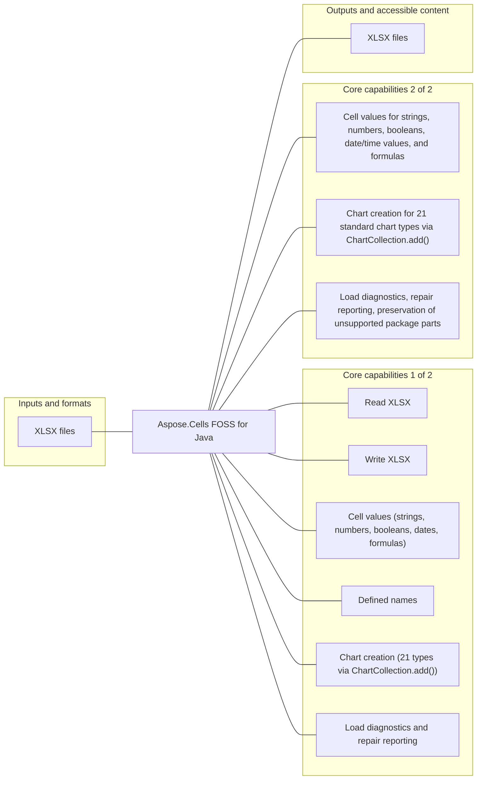

# Aspose.Cells FOSS for Java

[](https://central.sonatype.com/artifact/org.aspose/aspose-cells-foss)   [](License/LICENSE.txt) [](https://github.com/aspose-cells-foss/Aspose.Cells-FOSS-for-Java/graphs/contributors)

Aspose.Cells FOSS for Java is a Java 17 spreadsheet library for developers using Java to create, load, modify, and save Excel .xlsx workbooks. It supports reading and writing XLSX files, cell values (strings, numbers, booleans, dates, formulas), defined names, and chart creation for 21 standard chart types.

## Navigation

- [At a glance](#at-a-glance)
- [Key capabilities](#key-capabilities)
- [Installation](#installation)
- [Quick start](#quick-start)
- [Scope and limitations](#scope-and-limitations)
- [License](#license)

## At a glance



## Key capabilities

- Cell values for strings, numbers, booleans, date/time values, and formulas.
- Defined names.
- Chart creation for 21 standard chart types via ChartCollection.add().
- Load diagnostics, repair reporting, and preservation of unsupported package parts.

## Installation

Install the package published for this repository:

```xml
<dependency>
  <groupId>org.aspose</groupId>
  <artifactId>aspose-cells-foss</artifactId>
  <version>26.7.0</version>
</dependency>
```

The coordinate was verified against Maven Central.

## Quick start

### Minimal verified example

```java
import org.aspose.cells_foss.Cell;
import org.aspose.cells_foss.Style;
import org.aspose.cells_foss.Workbook;
import org.aspose.cells_foss.Worksheet;

public class Main {
    public static void main(String[] args) {
        try (Workbook workbook = new Workbook()) {
            Worksheet sheet = workbook.getWorksheets().get(0);
            sheet.setName("Report");

            sheet.getCells().get("A1").putValue("Revenue");
            sheet.getCells().get("B1").putValue(12500.75);

            Cell total = sheet.getCells().get("B1");
            Style style = total.getStyle();
            style.getFont().setBold(true);
            style.setCustom("#,##0.00");
            total.setStyle(style);

            sheet.getCells().getRows().get(0).setHeight(22.0);
            sheet.getCells().getColumns().get(1).setWidth(14.5);

            workbook.save("report.xlsx");
        }
    }
}
```

## Scope and limitations

[Aspose.Cells FOSS for Java](https://products.aspose.org/cells/java/) and [Aspose.Cells Enterprise Edition](https://products.aspose.com/cells/java/) are separate products. This README documents the FOSS implementation; do not assume API or feature parity beyond verified behavior.

## License

This project is available under the [MIT License](License/LICENSE.txt). It permits use, modification, distribution, and commercial use when the license and copyright notice are retained.
