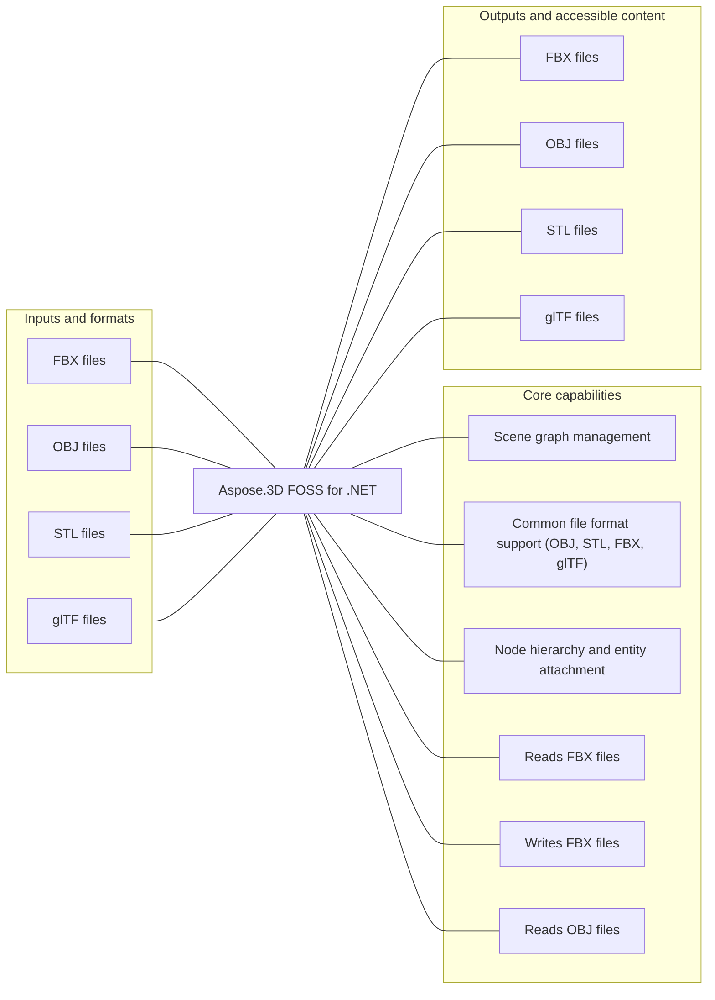

# Aspose.3D FOSS for .NET

[](https://www.nuget.org/packages/Aspose.3D.FOSS)  [](https://github.com/aspose-3d-foss/Aspose.3D-FOSS-for-.NET/tree/e78d87e1b33e22560c90acd73247695a1eec6a34) [](LICENSE) [](https://github.com/aspose-3d-foss/Aspose.3D-FOSS-for-.NET/graphs/contributors)

Aspose.3D FOSS for .NET provides Scene graph management for developers using .NET.

## Navigation

- [At a glance](#at-a-glance)
- [Key capabilities](#key-capabilities)
- [Installation](#installation)
- [Quick start](#quick-start)
- [Scope and limitations](#scope-and-limitations)
- [License](#license)

## At a glance



## Key capabilities

- Scene graph management.
- Common file format support (OBJ, STL, FBX, glTF).
- Node hierarchy and entity attachment.

## Installation

Install the package published for this repository:

```bash
dotnet add package Aspose.3D.FOSS --version 26.1.0
```

The package was verified against NuGet.

## Quick start

### Minimal verified example

```dotnet
using Aspose.ThreeD; var scene = new Scene(); scene.Save(System.IO.Path.GetTempFileName());
```

## Scope and limitations

- License/trial management APIs not available

[Aspose.3D FOSS for .NET](https://products.aspose.org/3d/net/) and [Aspose.3D Enterprise Edition](https://products.aspose.com/3d/net/) are separate products. This README documents the FOSS implementation; do not assume API or feature parity beyond verified behavior.

## License

This project is available under the [MIT License](LICENSE). It permits use, modification, distribution, and commercial use when the license and copyright notice are retained.
