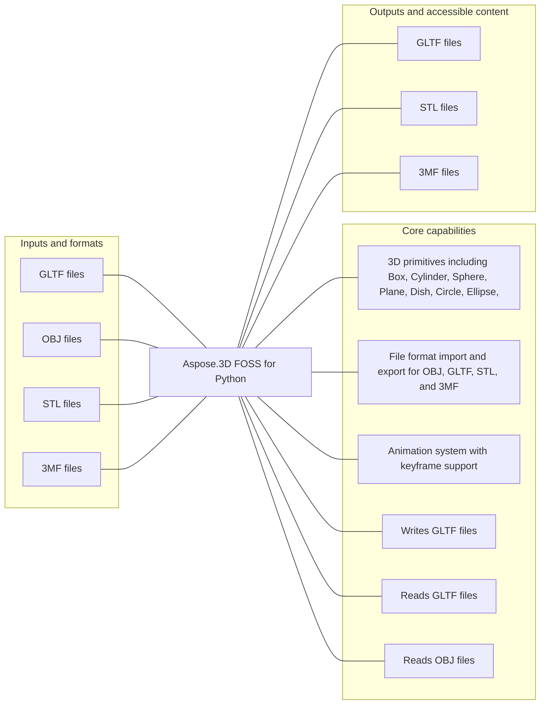

# Aspose.3D FOSS for Python

[](https://github.com/aspose-3d-foss/Aspose.3D-FOSS-for-Python/tree/62fb89f3ca76dc0afa9b2dfb983b9a1fa3f74fba)   [](LICENSE) [](https://github.com/aspose-3d-foss/Aspose.3D-FOSS-for-Python/graphs/contributors)

Aspose.3D FOSS for Python provides 3D primitives including Box, Cylinder, Sphere, Plane, Dish, Circle, Ellipse, Frustum for developers using Python.

## Navigation

- [At a glance](#at-a-glance)
- [Key capabilities](#key-capabilities)
- [Installation](#installation)
- [Quick start](#quick-start)
- [Additional examples](#additional-examples)
- [API reference](#api-reference)
- [Documentation resources](#documentation-resources)
- [Scope and limitations](#scope-and-limitations)
- [Development and testing](#development-and-testing)
- [Preserved repository details](#preserved-repository-details)
- [License](#license)

## At a glance



## Key capabilities

- 3D primitives including Box, Cylinder, Sphere, Plane, Dish, Circle, Ellipse, Frustum.
- File format import and export for OBJ, GLTF, STL, and 3MF.
- Animation system with keyframe support.

## Installation

Install the verified immutable repository revision from a local checkout:

```bash
git clone https://github.com/aspose-3d-foss/Aspose.3D-FOSS-for-Python.git
cd Aspose.3D-FOSS-for-Python
git checkout --detach 62fb89f3ca76dc0afa9b2dfb983b9a1fa3f74fba
python -m pip install .
```

`aspose-3d-foss` was installed and exercised from this exact source revision in an isolated, network-disabled verification environment. The matching PyPI receipt did not find a published package, so this README does not present a PyPI package installation command.

## Quick start

### Minimal verified example

```python
from aspose.threed import Scene

scene = Scene()
```

## Additional examples

The inline workflows below were syntax-checked and matched to the repository's static public API. They were not executed by the evidence collector.

<details>
<summary>View additional examples and results</summary>

### Quick start (2)

```python
from aspose.threed import Scene
from aspose.threed.formats.obj import ObjLoadOptions

scene = Scene()
options = ObjLoadOptions()
options.enable_materials = True
scene.open("model.obj", options)

for node in scene.root_node.child_nodes:
    if node.entity:
        mesh = node.entity
        print(f"Mesh: {node.name}")
        print(f"  Vertices: {len(mesh.control_points)}")
        print(f"  Polygons: {mesh.polygon_count}")
```

### Quick start (3)

```python
from aspose.threed import Scene
from aspose.threed.formats.gltf import GltfSaveOptions

scene = Scene()
scene.open("mesh.stl")

options = GltfSaveOptions()
options.binary_mode = True
scene.save("mesh.glb", options)
```

### Assign a PBR material and export to glTF

```python
import io
import json
from aspose.threed import Scene, FileFormat
from aspose.threed.entities import Mesh
from aspose.threed.utilities import Vector3, Vector4
from aspose.threed.formats.gltf import GltfSaveOptions
from aspose.threed.shading import PbrMaterial

scene = Scene()
mesh = Mesh("TestMesh")
mesh.control_points.add(Vector4(0.0, 0.0, 0.0, 1.0))
mesh.control_points.add(Vector4(1.0, 0.0, 0.0, 1.0))
mesh.control_points.add(Vector4(0.0, 1.0, 0.0, 1.0))
mesh.create_polygon(0, 1, 2)

albedo = Vector3(0.8, 0.2, 0.3)
material = PbrMaterial("RedMaterial", albedo)
material.metallic_factor = 0.5
material.roughness_factor = 0.7

node = scene.root_node.create_child_node("TestNode")
node.entity = mesh
node.material = material

stream = io.BytesIO()


options = GltfSaveOptions(FileFormat.get_format_by_extension(".gltf"))
options.binary_mode = False
scene.save(stream, options)

stream.seek(0)
gltf_data = json.loads(stream.read().decode("utf-8"))
print(gltf_data["materials"][0]["pbrMetallicRoughness"])
```

### Convert a parametric primitive to a mesh

```python
from aspose.threed.entities import Box

box = Box(10, 20, 30)
mesh = box.to_mesh()
print(f"Control points: {len(mesh.control_points)}")
```

### Build a cube and export it to 3MF

```python
import io
from aspose.threed import Scene
from aspose.threed.entities import Mesh
from aspose.threed.utilities import Vector4
from aspose.threed.formats import ThreeMfSaveOptions

scene = Scene()
mesh = Mesh("cube")
for point in [
    Vector4(0, 0, 0, 1), Vector4(1, 0, 0, 1), Vector4(1, 1, 0, 1), Vector4(0, 1, 0, 1),
    Vector4(0, 0, 1, 1), Vector4(1, 0, 1, 1), Vector4(1, 1, 1, 1), Vector4(0, 1, 1, 1),
]:
    mesh.control_points.add(point)

mesh.create_polygon(0, 1, 2)
mesh.create_polygon(0, 2, 3)
mesh.create_polygon(4, 7, 6)
mesh.create_polygon(4, 6, 5)
mesh.create_polygon(0, 4, 5)
mesh.create_polygon(0, 5, 1)
mesh.create_polygon(2, 6, 7)
mesh.create_polygon(2, 7, 3)
mesh.create_polygon(0, 3, 7)
mesh.create_polygon(0, 7, 4)
mesh.create_polygon(1, 5, 6)
mesh.create_polygon(1, 6, 2)

node = scene.root_node.create_child_node("cube")
node.entity = mesh

stream = io.BytesIO()
options = ThreeMfSaveOptions()
options.enable_compression = False
scene.save(stream, options)
```


</details>

## API reference

The package declares 63 public exports in its static `__all__` surface.

<details>
<summary>View MCP and public API details</summary>

### Public package namespaces

- `aspose`
- `aspose.threed`
- `aspose.threed.animation`
- `aspose.threed.deformers`
- `aspose.threed.entities`
- `aspose.threed.formats`
- `aspose.threed.formats.gltf`
- `aspose.threed.formats.obj`
- `aspose.threed.formats.stl`
- `aspose.threed.formats.threemf`
- `aspose.threed.profiles`
- `aspose.threed.render`
- `aspose.threed.shading`
- `aspose.threed.utilities`

### `aspose.threed`

- `A3DObject`
- `AnimationChannel`
- `AnimationClip`
- `AnimationNode`
- `ArrayListAdapter`
- `AssetInfo`
- `Axis`
- `AxisSystem`
- `BindPoint`
- `BonePose`
- `BoundingBox2D`
- `BoundingBoxExtent`
- `Box`
- `Camera`
- `Circle`
- `ComposeOrder`
- `CoordinateSystem`
- `Curve`
- `CustomObject`
- `Cylinder`
- `Dish`
- `Ellipse`
- `Entity`
- `ExportException`
- `Extrapolation`
- `ExtrapolationType`
- `FMatrix4`
- `FileContentType`
- `FileFormat`
- `FileFormatType`
- `Frustum`
- `Geometry`
- `GlobalTransform`
- `Group`
- `INamedObject`
- `IOExtension`
- `ImageRenderOptions`
- `ImportException`
- `Interpolation`
- `KeyFrame`
- `KeyframeSequence`
- `Light`
- `LinearExtrusion`
- `MathUtils`
- `Mesh`
- `Node`
- `ParseException`
- `Plane`

### `aspose.threed.A3DObject`

- `A3DObject`

### `aspose.threed.AssetInfo`

- `AssetInfo`

### `aspose.threed.Axis`

- `Axis`

### `aspose.threed.AxisSystem`

- `AxisSystem`

### `aspose.threed.BonePose`

- `BonePose`

### `aspose.threed.CoordinateSystem`

- `CoordinateSystem`

### `aspose.threed.CustomObject`

- `CustomObject`

### `aspose.threed.Entity`

- `Entity`

### `aspose.threed.ExportException`

- `ExportException`

### `aspose.threed.FileContentType`

- `FileContentType`

### `aspose.threed.FileFormat`

- `FileFormat`

### `aspose.threed.FileFormatType`

- `FileFormatType`

### `aspose.threed.GlobalTransform`

- `GlobalTransform`

### `aspose.threed.Group`

- `Group`

### `aspose.threed.INamedObject`

- `INamedObject`

### `Camera` members

- `direction`
- `excluded: bool`
- `far_plane: float`
- `field_of_view: float`
- `get_bounding_box()`
- `name: str`
- `near_plane: float`
- `parent_node`
- `parent_nodes`
- `target`
- `up`
- `aperture_mode`
- `aspect: float`
- `aspect_ratio: float`
- `field_of_view_x: float`
- `field_of_view_y: float`
- `find_property(property)`
- `get_entity_renderer_key()`
- `get_property(property)`
- `height: float`
- `look_at`
- `magnification`
- `move_forward(distance)`
- `ortho_height: float`

### `Transform` members

- `euler_angles: Vector3`
- `rotation: Quaternion`
- `scaling: Vector3`
- `set_rotation(rw, rx, ry, rz)`
- `set_scale(sx, sy, sz)`
- `set_translation(tx, ty, tz)`
- `transform_matrix: Matrix4`
- `translation: Vector3`
- `geometric_rotation: Vector3`
- `geometric_scaling: Vector3`
- `geometric_translation: Vector3`
- `post_rotation: Vector3`
- `pre_rotation: Vector3`
- `rotation_offset: Vector3`
- `rotation_pivot: Vector3`
- `scaling_offset: Vector3`
- `scaling_pivot: Vector3`
- `set_euler_angles(rx, ry, rz)`
- `set_geometric_rotation(rx, ry, rz)`
- `set_geometric_scaling(sx, sy, sz)`
- `set_geometric_translation(x, y, z)`
- `set_post_rotation(rx, ry, rz)`
- `set_pre_rotation(rx, ry, rz)`
- `name: str`

### `Node` members

- `add_child_node(node)`
- `add_entity(entity)`
- `asset_info`
- `child_nodes: List['Node']`
- `create_child_node(node_name=None, entity=None, material=None)`
- `entities: List['Entity']`
- `entity: Optional['Entity']`
- `evaluate_global_transform(with_geometric_transform)`
- `excluded: bool`
- `get_bounding_box()`
- `global_transform: GlobalTransform`
- `material: Optional['Material']`
- `materials: List['Material']`
- `merge(node)`
- `parent_node: Optional['Node']`
- `transform: Transform`
- `visible: bool`
- `get_child(index_or_name)`
- `get_entity(entity_type)`
- `meta_datas: List`
- `select_objects(path)`
- `select_single_object(path)`
- `scene`
- `name: str`

### `FileFormat` members

- `can_export: bool`
- `can_import: bool`
- `detect(stream=None, file_name=None)`
- `formats: List['FileFormat']`
- `get_format_by_extension(extension_name)`
- `FBX7400ASCII()`
- `GLTF2()`
- `MICROSOFT_3MF_FORMAT()`
- `WAVEFRONT_OBJ()`
- `content_type: str`
- `create_load_options()`
- `create_save_options()`
- `extension: str`
- `extensions: List[str]`
- `file_format_type`
- `version: str`

### `Mesh` members

- `control_points: ArrayListAdapter[Vector4]`
- `create_polygon(*args)`
- `difference(a, b)`
- `do_boolean(op, a, transform_a, b, transform_b)`
- `get_bounding_box()`
- `intersect(a, b)`
- `polygon_count: int`
- `polygons: List[List[int]]`
- `to_mesh()`
- `triangulate()`
- `union(a, b)`
- `edges: ArrayListAdapter[int]`
- `get_entity_renderer_key()`
- `get_polygon_size(index)`
- `is_manifold()`
- `optimize(vertex_elements=False, tolerance_control_point=1e-09, tolerance_normal=1e-09, tolerance_uv=1e-09)`
- `visible: bool`
- `add_element(element)`
- `cast_shadows: bool`
- `create_element(element_type, mapping_mode=None, reference_mode=None)`
- `create_element_uv(uv_mapping, mapping_mode=None, reference_mode=None)`
- `deformers: List['Deformer']`
- `find_property(property)`
- `get_deformers(deformer_type=None)`

### `KeyFrame` members

- `bias: float`
- `continuity: float`
- `interpolation: Interpolation`
- `step_mode: StepMode`
- `tangent_weight_mode: WeightedMode`
- `tension: float`
- `time: float`
- `value: float`
- `flat: bool`
- `independent_tangent: bool`
- `next_in_tangent: 'Vector2'`
- `next_in_weight: float`
- `out_tangent: 'Vector2'`
- `out_weight: float`
- `time_independent_tangent: bool`

### `Cylinder` members

- `to_mesh()`
- `generate_fan_cylinder: bool`
- `height: float`
- `height_segments: int`
- `offset_bottom`
- `offset_top`
- `open_ended: bool`
- `radial_segments: int`
- `radius_bottom: float`
- `radius_top: float`
- `shear_bottom`
- `shear_top`
- `theta_length: float`
- `theta_start: float`
- `cast_shadows: bool`
- `receive_shadows: bool`
- `control_points: 'ArrayListAdapter[Vector4]'`
- `get_bounding_box()`
- `visible: bool`
- `add_element(element)`
- `create_element(element_type, mapping_mode=None, reference_mode=None)`
- `create_element_uv(uv_mapping, mapping_mode=None, reference_mode=None)`
- `deformers: List['Deformer']`
- `find_property(property)`

### `Scene` members

- `animation_clips: List['AnimationClip']`
- `asset_info: AssetInfo`
- `clear()`
- `create_animation_clip(name)`
- `from_file(file_name)`
- `open(file_or_stream, options=None)`
- `render(camera, file_name_or_bitmap, size=None, format=None, options=None)`
- `root_node`
- `save(file_or_stream, format_or_options=None)`
- `sub_scenes: List['Scene']`
- `current_animation_clip: Optional['AnimationClip']`
- `get_animation_clip(name)`
- `library: List[CustomObject]`
- `poses: List`
- `scene`
- `name: str`
- `find_property(property_name)`
- `get_property(property)`
- `properties: PropertyCollection`
- `remove_property(property)`
- `set_property(property, value)`

### `BindPoint` members

- `name: str`
- `add_channel(name, value, type=None)`
- `bind_keyframe_sequence(channel_name, sequence)`
- `channels_count()`
- `create_keyframe_sequence(name)`
- `get_channel(channel_name)`
- `get_keyframe_sequence(channel_name)`
- `properties`
- `property()`
- `reset_channels()`
- `find_property(property_name)`
- `get_property(property)`
- `remove_property(property)`
- `set_property(property, value)`

### `ArrayListAdapter` members

- `add(item)`
- `clear()`
- `add_range(collection)`
- `append(item)`
- `index_of(item)`
- `insert(index, item)`
- `remove(item)`
- `remove_at(index)`
- `to_array()`

### `AnimationNode` members

- `create_bind_point(obj, prop_name)`
- `name: str`
- `bind_points: List['BindPoint']`
- `find_bind_point(target, name)`
- `get_bind_point(target, prop_name, create)`
- `get_keyframe_sequence(target, prop_name, channel_name=None, create=True)`
- `properties`
- `sub_animations: List['AnimationNode']`
- `find_property(property_name)`
- `get_property(property)`
- `remove_property(property)`
- `set_property(property, value)`

### `Frustum` members

- `to_mesh()`
- `height: float`
- `height_segments: int`
- `radial_segments: int`
- `radius_bottom: float`
- `radius_top: float`
- `theta_length: float`
- `theta_start: float`
- `cast_shadows: bool`
- `receive_shadows: bool`
- `control_points: 'ArrayListAdapter[Vector4]'`
- `get_bounding_box()`
- `visible: bool`
- `add_element(element)`
- `create_element(element_type, mapping_mode=None, reference_mode=None)`
- `create_element_uv(uv_mapping, mapping_mode=None, reference_mode=None)`
- `deformers: List['Deformer']`
- `find_property(property)`
- `get_deformers(deformer_type=None)`
- `get_element(element_type)`
- `get_entity_renderer_key()`
- `get_property(property)`
- `get_vertex_element_of_uv(texture_mapping)`
- `remove_property(property)`

### `KeyframeSequence` members

- `add(time, value, interpolation=Interpolation.LINEAR)`
- `key_frames: List['KeyFrame']`
- `name: str`
- `post_behavior: Extrapolation`
- `pre_behavior: Extrapolation`
- `bind_point: 'BindPoint'`
- `properties`
- `reset()`
- `find_property(property_name)`
- `get_property(property)`
- `remove_property(property)`
- `set_property(property, value)`

### `Sphere` members

- `to_mesh()`
- `height_segments: int`
- `phi_length: float`
- `phi_start: float`
- `radius: float`
- `theta_length: float`
- `theta_start: float`
- `width_segments: int`
- `cast_shadows: bool`
- `receive_shadows: bool`
- `control_points: 'ArrayListAdapter[Vector4]'`
- `get_bounding_box()`
- `visible: bool`
- `add_element(element)`
- `create_element(element_type, mapping_mode=None, reference_mode=None)`
- `create_element_uv(uv_mapping, mapping_mode=None, reference_mode=None)`
- `deformers: List['Deformer']`
- `find_property(property)`
- `get_deformers(deformer_type=None)`
- `get_element(element_type)`
- `get_entity_renderer_key()`
- `get_property(property)`
- `get_vertex_element_of_uv(texture_mapping)`
- `remove_property(property)`

### `AnimationClip` members

- `animations: List['AnimationNode']`
- `create_animation_node(node_name)`
- `name: str`
- `start: float`
- `stop: float`
- `description: str`
- `properties`
- `scene`
- `find_property(property_name)`
- `get_property(property)`
- `remove_property(property)`
- `set_property(property, value)`

### `Box` members

- `length: float`
- `to_mesh()`
- `height: float`
- `height_segments: int`
- `length_segments: int`
- `width: float`
- `width_segments: int`
- `cast_shadows: bool`
- `receive_shadows: bool`
- `control_points: 'ArrayListAdapter[Vector4]'`
- `get_bounding_box()`
- `visible: bool`
- `add_element(element)`
- `create_element(element_type, mapping_mode=None, reference_mode=None)`
- `create_element_uv(uv_mapping, mapping_mode=None, reference_mode=None)`
- `deformers: List['Deformer']`
- `find_property(property)`
- `get_deformers(deformer_type=None)`
- `get_element(element_type)`
- `get_entity_renderer_key()`
- `get_property(property)`
- `get_vertex_element_of_uv(texture_mapping)`
- `remove_property(property)`
- `set_property(property, value)`

### `Dish` members

- `get_bounding_box()`
- `to_mesh()`
- `height: float`
- `height_segments: int`
- `radius: float`
- `width_segments: int`
- `cast_shadows: bool`
- `receive_shadows: bool`
- `control_points: 'ArrayListAdapter[Vector4]'`
- `visible: bool`
- `add_element(element)`
- `create_element(element_type, mapping_mode=None, reference_mode=None)`
- `create_element_uv(uv_mapping, mapping_mode=None, reference_mode=None)`
- `deformers: List['Deformer']`
- `find_property(property)`
- `get_deformers(deformer_type=None)`
- `get_element(element_type)`
- `get_entity_renderer_key()`
- `get_property(property)`
- `get_vertex_element_of_uv(texture_mapping)`
- `remove_property(property)`
- `set_property(property, value)`
- `vertex_elements: List['VertexElement']`
- `excluded: bool`

### `Ellipse` members

- `to_mesh()`
- `radius_x: float`
- `radius_y: float`
- `segments: int`
- `theta_length: float`
- `theta_start: float`
- `cast_shadows: bool`
- `receive_shadows: bool`
- `control_points: 'ArrayListAdapter[Vector4]'`
- `get_bounding_box()`
- `visible: bool`
- `add_element(element)`
- `create_element(element_type, mapping_mode=None, reference_mode=None)`
- `create_element_uv(uv_mapping, mapping_mode=None, reference_mode=None)`
- `deformers: List['Deformer']`
- `find_property(property)`
- `get_deformers(deformer_type=None)`
- `get_element(element_type)`
- `get_entity_renderer_key()`
- `get_property(property)`
- `get_vertex_element_of_uv(texture_mapping)`
- `remove_property(property)`
- `set_property(property, value)`
- `vertex_elements: List['VertexElement']`

### `Interpolation` members

- `BEZIER`
- `B_SPLINE`
- `CARDINAL_SPLINE`
- `CONSTANT`
- `LINEAR`
- `TCB_SPLINE`

### `Circle` members

- `to_mesh()`
- `radius: float`
- `segments: int`
- `theta_length: float`
- `theta_start: float`
- `cast_shadows: bool`
- `receive_shadows: bool`
- `control_points: 'ArrayListAdapter[Vector4]'`
- `get_bounding_box()`
- `visible: bool`
- `add_element(element)`
- `create_element(element_type, mapping_mode=None, reference_mode=None)`
- `create_element_uv(uv_mapping, mapping_mode=None, reference_mode=None)`
- `deformers: List['Deformer']`
- `find_property(property)`
- `get_deformers(deformer_type=None)`
- `get_element(element_type)`
- `get_entity_renderer_key()`
- `get_property(property)`
- `get_vertex_element_of_uv(texture_mapping)`
- `remove_property(property)`
- `set_property(property, value)`
- `vertex_elements: List['VertexElement']`
- `excluded: bool`

### `Entity` members

- `excluded: bool`
- `get_bounding_box()`
- `parent_node: Optional['Node']`
- `parent_nodes: List['Node']`
- `get_entity_renderer_key()`
- `scene`
- `name: str`
- `find_property(property_name)`
- `get_property(property)`
- `properties: PropertyCollection`
- `remove_property(property)`
- `set_property(property, value)`

### `ExtrapolationType` members

- `CONSTANT`
- `CYCLE`
- `CYCLE_RELATIVE`
- `GRADIENT`
- `OSCILLATE`

### `GlobalTransform` members

- `euler_angles: Vector3`
- `rotation: Quaternion`
- `scale: Vector3`
- `transform_matrix: Matrix4`
- `translation: Vector3`

### `WeightedMode` members

- `BOTH`
- `NEXT_IN_WEIGHT`
- `NONE`
- `OUT_WEIGHT`

### `AnimationChannel` members

- `component_type`
- `default_value: Any`
- `keyframe_sequence: KeyframeSequence`
- `add(time, value, interpolation=Interpolation.LINEAR)`
- `key_frames: List['KeyFrame']`
- `name: str`
- `post_behavior: Extrapolation`
- `pre_behavior: Extrapolation`
- `bind_point: 'BindPoint'`
- `properties`
- `reset()`
- `find_property(property_name)`
- `get_property(property)`
- `remove_property(property)`
- `set_property(property, value)`

### `Extrapolation` members

- `repeat_count: int`
- `type: ExtrapolationType`

### `StepMode` members

- `NEXT_VALUE`
- `PREVIOUS_VALUE`

### `Light` members

- `direction`
- `excluded: bool`
- `far_plane: float`
- `field_of_view: float`
- `get_bounding_box()`
- `name: str`
- `near_plane: float`
- `parent_node`
- `parent_nodes`
- `target`
- `up`
- `aperture_mode`
- `aspect: float`
- `aspect_ratio: float`
- `field_of_view_x: float`
- `field_of_view_y: float`
- `find_property(property)`
- `get_entity_renderer_key()`
- `get_property(property)`
- `height: float`
- `look_at`
- `magnification`
- `move_forward(distance)`
- `ortho_height: float`

### `Matrix4` members

- `decompose(translation, scaling, rotation)`
- `get_identity()`
- `inverse()`
- `normalize()`
- `rotate(angle, axis=None)`
- `scale(sx, sy=None, sz=None)`
- `translate(tx, ty=None, tz=None)`
- `concatenate(m2)`
- `determinant: float`
- `m00: float`
- `m01: float`
- `m02: float`
- `m03: float`
- `m10: float`
- `m11: float`
- `m12: float`
- `m13: float`
- `m20: float`
- `m21: float`
- `m22: float`
- `m23: float`
- `m30: float`
- `m31: float`
- `m32: float`

### `Quaternion` members

- `dot(q)`
- `euler_angles()`
- `from_angle_axis(a, axis)`
- `from_euler_angle(pitch, yaw, roll)`
- `inverse()`
- `length: float`
- `normalize()`
- `slerp(t, v1, v2)`
- `to_matrix(translation=None)`
- `w: float`
- `x: float`
- `y: float`
- `z: float`
- `concat(rhs)`
- `conjugate()`
- `from_rotation(orig, dest)`
- `get_IDENTITY()`
- `get_bind_point(anim, create)`
- `get_keyframe_sequence(anim, create)`
- `interpolate(t, from_q, to_q)`
- `to_angle_axis(angle, axis)`

### `Renderer` members

- `material`
- `node: 'Node'`
- `render(render_target)`
- `asset_directories`
- `clear_cache()`
- `create_renderer()`
- `enable_shadows: bool`
- `execute(post_processing, result)`
- `fallback_entity_renderer: 'EntityRenderer'`
- `frustum: 'Frustum'`
- `get_post_processing(name)`
- `post_processings`
- `preset_shaders: 'PresetShaders'`
- `register_entity_renderer(renderer)`
- `render_factory: 'RenderFactory'`
- `render_stage: 'RenderStage'`
- `render_target`
- `shader: 'ShaderProgram'`
- `shader_set: 'ShaderSet'`
- `variables: 'RendererVariableManager'`

### `Vector3` members

- `cross(rhs)`
- `dot(rhs)`
- `length: float`
- `normalize()`
- `x: float`
- `y: float`
- `z: float`
- `angle_between(dir, up=None)`
- `compare_to(other)`
- `cos()`
- `length2: float`
- `one: 'Vector3'`
- `parse(input)`
- `set(new_x, new_y, new_z)`
- `sin()`
- `unit_x: 'Vector3'`
- `unit_y: 'Vector3'`
- `unit_z: 'Vector3'`
- `zero: 'Vector3'`

### `BoundingBox` members

- `center`
- `contains(arg)`
- `maximum`
- `merge(*args)`
- `minimum`
- `scale()`
- `size`
- `extent`
- `from_geometry(geometry)`
- `get_infinite()`
- `get_null()`
- `overlaps_with(box)`

### `PbrMaterial` members

- `albedo: 'Vector3'`
- `albedo_texture`
- `emissive_color: 'Vector3'`
- `emissive_texture`
- `metallic_factor: float`
- `normal_texture`
- `occlusion_texture`
- `roughness_factor: float`
- `transparency: float`
- `from_material(material)`
- `metallic_roughness`
- `occlusion_factor: float`
- `get_texture(slot_name)`
- `set_texture(slot_name, texture)`
- `name: str`
- `find_property(property_name)`
- `get_property(property)`
- `properties: PropertyCollection`
- `remove_property(property)`
- `set_property(property, value)`

### `NurbsCurve` members

- `control_points`
- `evaluate(steps)`
- `curve_type: 'NurbsType'`
- `degree: int`
- `dimension: 'CurveDimension'`
- `evaluate_at(u)`
- `knot_vectors`
- `multiplicity`
- `order: int`
- `rational: bool`
- `color: 'Vector3'`
- `excluded: bool`
- `get_bounding_box()`
- `parent_node: Optional['Node']`
- `parent_nodes: List['Node']`
- `get_entity_renderer_key()`
- `scene`
- `name: str`
- `find_property(property_name)`
- `get_property(property)`
- `properties: PropertyCollection`
- `remove_property(property)`
- `set_property(property, value)`

### `FbxSaveOptions` members

- `embed_textures: bool`
- `enable_compression: bool`
- `export_textures: bool`
- `export_legacy_material_properties: bool`
- `fold_repeated_curve_data`
- `generate_vertex_element_material: bool`
- `reuse_primitive_mesh: bool`
- `video_for_texture: bool`
- `file_name: str`
- `encoding: str`
- `file_format: 'FileFormat'`
- `file_system: 'FileSystem'`
- `lookup_paths: List[str]`

### `ObjSaveOptions` members

- `apply_unit_scale: bool`
- `axis_system: 'AxisSystem'`
- `enable_materials: bool`
- `flip_coordinate_system: bool`
- `point_cloud: bool`
- `serialize_w: bool`
- `verbose: bool`
- `export_textures: bool`
- `file_name: str`
- `encoding: str`
- `file_format: 'FileFormat'`
- `file_system: 'FileSystem'`
- `lookup_paths: List[str]`

### `Torus` members

- `to_mesh()`
- `arc: float`
- `radial_segments: int`
- `radius: float`
- `tube: float`
- `tubular_segments: int`
- `cast_shadows: bool`
- `receive_shadows: bool`
- `control_points: 'ArrayListAdapter[Vector4]'`
- `get_bounding_box()`
- `visible: bool`
- `add_element(element)`
- `create_element(element_type, mapping_mode=None, reference_mode=None)`
- `create_element_uv(uv_mapping, mapping_mode=None, reference_mode=None)`
- `deformers: List['Deformer']`
- `find_property(property)`
- `get_deformers(deformer_type=None)`
- `get_element(element_type)`
- `get_entity_renderer_key()`
- `get_property(property)`
- `get_vertex_element_of_uv(texture_mapping)`
- `remove_property(property)`
- `set_property(property, value)`
- `vertex_elements: List['VertexElement']`

### `Vector2` members

- `length: float`
- `x: float`
- `y: float`
- `length2: float`
- `parse(input)`
- `set(new_x, new_y)`

### `LambertMaterial` members

- `ambient_color: 'Vector3'`
- `diffuse_color: 'Vector3'`
- `emissive_color: 'Vector3'`
- `transparency: float`
- `transparent_color: 'Vector3'`
- `get_texture(slot_name)`
- `set_texture(slot_name, texture)`
- `name: str`
- `find_property(property_name)`
- `get_property(property)`
- `properties: PropertyCollection`
- `remove_property(property)`
- `set_property(property, value)`

### `PhongMaterial` members

- `reflection_color: 'Vector3'`
- `shininess: float`
- `specular_color: 'Vector3'`
- `specular_factor: float`
- `reflection_factor: float`
- `ambient_color: 'Vector3'`
- `diffuse_color: 'Vector3'`
- `emissive_color: 'Vector3'`
- `transparency: float`
- `transparent_color: 'Vector3'`
- `get_texture(slot_name)`
- `set_texture(slot_name, texture)`
- `name: str`
- `find_property(property_name)`
- `get_property(property)`
- `properties: PropertyCollection`
- `remove_property(property)`
- `set_property(property, value)`

### `Pyramid` members

- `to_mesh()`
- `bottom_area: Vector2`
- `bottom_offset: Vector3`
- `height: float`
- `top_area: Vector2`
- `cast_shadows: bool`
- `receive_shadows: bool`
- `control_points: 'ArrayListAdapter[Vector4]'`
- `get_bounding_box()`
- `visible: bool`
- `add_element(element)`
- `create_element(element_type, mapping_mode=None, reference_mode=None)`
- `create_element_uv(uv_mapping, mapping_mode=None, reference_mode=None)`
- `deformers: List['Deformer']`
- `find_property(property)`
- `get_deformers(deformer_type=None)`
- `get_element(element_type)`
- `get_entity_renderer_key()`
- `get_property(property)`
- `get_vertex_element_of_uv(texture_mapping)`
- `remove_property(property)`
- `set_property(property, value)`
- `vertex_elements: List['VertexElement']`
- `excluded: bool`

### `ThreeMfSaveOptions` members

- `build_all: bool`
- `enable_compression: bool`
- `flip_coordinate_system: bool`
- `pretty_print: bool`
- `unit: str`
- `export_textures: bool`
- `file_name: str`
- `encoding: str`
- `file_format: 'FileFormat'`
- `file_system: 'FileSystem'`
- `lookup_paths: List[str]`

### `Vector4` members

- `w: float`
- `x: float`
- `y: float`
- `z: float`
- `set(new_x, new_y, new_z, new_w=1.0)`

### `ICommandList` members

- `draw(vertex_count, instance_count, start_vertex, start_instance)`
- `draw_indexed(index_count, instance_count, start_index, base_vertex, start_instance)`
- `set_index_buffer(buffer, offset, index_type)`
- `set_vertex_buffer(buffer, offset)`

### `ObjLoadOptions` members

- `enable_materials: bool`
- `flip_coordinate_system: bool`
- `normalize_normal: bool`
- `scale: float`
- `file_name: str`
- `encoding: str`
- `file_format: 'FileFormat'`
- `file_system: 'FileSystem'`
- `lookup_paths: List[str]`

### `ColladaSaveOptions` members

- `enable_materials: bool`
- `flip_coordinate_system: bool`
- `indented: bool`
- `export_textures: bool`
- `file_name: str`
- `encoding: str`
- `file_format: 'FileFormat'`
- `file_system: 'FileSystem'`
- `lookup_paths: List[str]`

### `GltfSaveOptions` members

- `binary_mode: bool`
- `flip_tex_coord_v: bool`
- `file_format: 'FileFormat'`
- `export_textures: bool`
- `file_name: str`
- `encoding: str`
- `file_system: 'FileSystem'`
- `lookup_paths: List[str]`

### `IBuffer` members

- `size`
- `map(access)`
- `unmap()`

</details>

## Documentation resources

- [Product documentation](https://docs.aspose.org/3d/python/)
- [Knowledge base](https://kb.aspose.org/3d/python/)
- [API reference](https://reference.aspose.org/3d/python/)

## Scope and limitations

- Mesh boolean operations do_boolean, union, difference, and intersect are not implemented.
- NURBS curve evaluation and surface-to-mesh conversion are not implemented.
- COLLADA export through Scene.save is blocked because an earlier FBX exporter format check is not implemented.
- FBX export is not implemented.
- Scene and renderer output generation are not implemented.

[Aspose.3D Enterprise Edition](https://products.aspose.com/3d/python-net/) is a separate product. This README documents the FOSS implementation; do not assume API or feature parity beyond verified behavior.

## Development and testing

The repository includes 34 test files, 2 source-bound validation commands.

<details>
<summary>View development and testing resources</summary>

### Tests

- [`tests/test_3mf_exporter.py`](tests/test_3mf_exporter.py)
- [`tests/test_3mf_importer.py`](tests/test_3mf_importer.py)
- [`tests/test_3mf_material_export.py`](tests/test_3mf_material_export.py)
- [`tests/test_3mf_materials.py`](tests/test_3mf_materials.py)
- [`tests/test_3mf_roundtrip.py`](tests/test_3mf_roundtrip.py)
- [`tests/test_array_list_adapter.py`](tests/test_array_list_adapter.py)
- [`tests/test_collada_exporter.py`](tests/test_collada_exporter.py)
- [`tests/test_collada_importer.py`](tests/test_collada_importer.py)
- [Browse all test files](tests)

### Focused commands and repository scripts

```bash
python -m pip install -e .
```

```bash
python -m pytest tests
```


</details>

## Preserved repository details

- Build 3D scenes programmatically with `Scene`, `Node`, `Mesh`, `Camera`, and `Light` in a
  hierarchical node graph.


- Import OBJ (with `.mtl` materials), STL (binary and ASCII), glTF 2.0 / GLB, COLLADA (`.dae`),
  and 3MF files into a common `Scene` model with `Scene.open(...)`.


- Export the same `Scene` model back out to OBJ, STL, glTF/GLB, or 3MF with `Scene.save(...)`
  (COLLADA import is supported; COLLADA export is not currently reachable through the public
  API — see [Scope and limitations](#scope-and-limitations)).


- Assign Lambert, Phong, or PBR (metallic-roughness) materials to nodes, including glTF material
  properties such as `albedo`, `metallic_factor`, and `roughness_factor`.


- Convert built-in parametric primitives (`Box`, `Cylinder`, `Sphere`, `Torus`, `Pyramid`,
  `Dish`, ...) into triangulated `Mesh` objects with `to_mesh()`.


- Work with `Vector2`/`Vector3`/`Vector4`, `Matrix4`, `Quaternion`, and `BoundingBox` utilities
  for transforms and spatial queries.


- Animate scene properties with keyframe sequences (`AnimationClip`, `KeyframeSequence.add(time,
  value, interpolation)`, `KeyFrame`) bound to node/material properties via
  `AnimationNode`/`BindPoint`.


- Found a bug or have a feature request? [Open an issue](https://github.com/aspose-3d-foss/Aspose.3D-FOSS-for-Python/issues) on GitHub.


## License

This project is available under the [MIT License](LICENSE). It permits use, modification, distribution, and commercial use when the license and copyright notice are retained.
