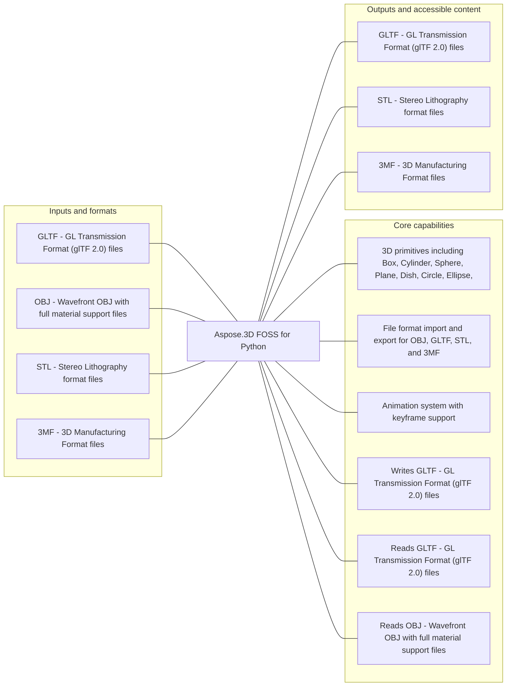

# Aspose.3D FOSS for Python

[](https://github.com/aspose-3d-foss/Aspose.3D-FOSS-for-Python/tree/ab1a2267a0ba6302311d0c7c4ad01494974c7d76)  [](LICENSE) [](https://github.com/aspose-3d-foss/Aspose.3D-FOSS-for-Python/graphs/contributors)

Aspose.3D FOSS for Python provides 3D primitives including Box, Cylinder, Sphere, Plane, Dish, Circle, Ellipse, Frustum for developers using Python.

## Navigation

- [At a glance](#at-a-glance)
- [Key capabilities](#key-capabilities)
- [Installation](#installation)
- [Quick start](#quick-start)
- [Scope and limitations](#scope-and-limitations)
- [Development and testing](#development-and-testing)
- [License](#license)

## At a glance



## Key capabilities

- 3D primitives including Box, Cylinder, Sphere, Plane, Dish, Circle, Ellipse, Frustum.
- File format import and export for OBJ, GLTF, STL, and 3MF.
- Animation system with keyframe support.

## Installation

Install the verified immutable repository revision from a local checkout:

```bash
git clone https://github.com/aspose-3d-foss/Aspose.3D-FOSS-for-Python.git
cd Aspose.3D-FOSS-for-Python
git checkout --detach ab1a2267a0ba6302311d0c7c4ad01494974c7d76
python -m pip install .
```

`aspose-3d-foss` was installed and exercised from this exact source revision in an isolated, network-disabled verification environment. The matching PyPI receipt did not find a published package, so this README does not present a PyPI package installation command.

## Quick start

### Minimal verified example

```python
from aspose.threed import Scene

scene = Scene()
```

## Scope and limitations

[Aspose.3D FOSS for Python](https://products.aspose.org/3d/python/) and [Aspose.3D Enterprise Edition](https://products.aspose.com/3d/python-net/) are separate products. This README documents the FOSS implementation; do not assume API or feature parity beyond verified behavior.

## Development and testing

The repository includes 34 test files.

<details>
<summary>View development and testing resources</summary>

### Tests

- [`tests/test_3mf_exporter.py`](tests/test_3mf_exporter.py)
- [`tests/test_3mf_importer.py`](tests/test_3mf_importer.py)
- [`tests/test_3mf_material_export.py`](tests/test_3mf_material_export.py)
- [`tests/test_3mf_materials.py`](tests/test_3mf_materials.py)
- [`tests/test_3mf_roundtrip.py`](tests/test_3mf_roundtrip.py)
- [`tests/test_array_list_adapter.py`](tests/test_array_list_adapter.py)
- [`tests/test_collada_exporter.py`](tests/test_collada_exporter.py)
- [`tests/test_collada_importer.py`](tests/test_collada_importer.py)
- [Browse all test files](tests)


</details>

## License

This project is available under the [MIT License](LICENSE). It permits use, modification, distribution, and commercial use when the license and copyright notice are retained.
