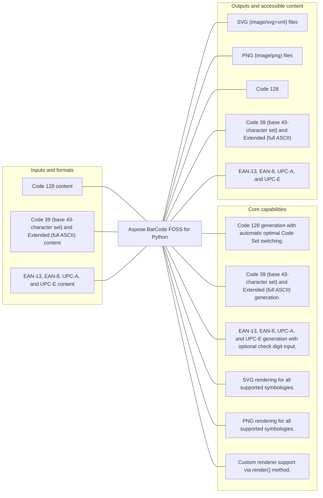

# Aspose.BarCode FOSS for Python

[](https://github.com/aspose-barcode-foss/Aspose.BarCode-FOSS-for-Python/tree/53f2c3350b8171f2c8275e7b1a178f218695ac45)   [](LICENSE) [](https://github.com/aspose-barcode-foss/Aspose.BarCode-FOSS-for-Python/graphs/contributors)

Aspose.BarCode FOSS for Python provides Code 128 generation with automatic optimal Code Set switching for developers using Python.

## Navigation

- [At a glance](#at-a-glance)
- [Key capabilities](#key-capabilities)
- [Installation](#installation)
- [Quick start](#quick-start)
- [Additional examples](#additional-examples)
- [API reference](#api-reference)
- [Scope and limitations](#scope-and-limitations)
- [Development and testing](#development-and-testing)
- [License](#license)

## At a glance



## Key capabilities

- Code 128 generation with automatic optimal Code Set switching.
- Code 39 (base 43-character set) and Extended (full ASCII) generation.
- EAN-13, EAN-8, UPC-A, and UPC-E generation with optional check digit input.
- SVG rendering for all supported symbologies.
- PNG rendering for all supported symbologies.
- Custom renderer support via render() method.

## Installation

Install the verified immutable repository revision from a local checkout:

```bash
git clone https://github.com/aspose-barcode-foss/Aspose.BarCode-FOSS-for-Python.git
cd Aspose.BarCode-FOSS-for-Python
git checkout --detach 53f2c3350b8171f2c8275e7b1a178f218695ac45
python -m pip install .
```

`aspose-barcode-foss` was installed and exercised from this exact source revision in an isolated, network-disabled verification environment. The matching PyPI receipt did not find a published package, so this README does not present a PyPI package installation command.

Required runtime dependencies declared in `pyproject.toml`: `Pillow>=10.1.0`.

## Quick start

### Minimal verified example

```python
from aspose_barcode_foss import SvgRenderer

renderer = SvgRenderer()
```

## Additional examples

These additional workflows were syntax-checked and matched to the repository's static public API. They were not executed by the evidence collector.

<details>
<summary>View additional examples and results</summary>

### Quick Start

```python
from aspose_barcode_foss import code128

barcode = code128("Hello-World")
svg = barcode.to_svg()
png = barcode.to_png()
```

### Quick Start

```python
from aspose_barcode_foss import qr

png = qr("https://example.com").to_png()
```

### Repository example files

- [`all_symbologies.py`](examples/all_symbologies.py)
- [`error_handling.py`](examples/error_handling.py)
- [`quickstart.py`](examples/quickstart.py)
- [`render_options.py`](examples/render_options.py)


</details>

## API reference

The package declares 35 public exports in its static `__all__` surface.

<details>
<summary>View MCP and public API details</summary>

### `aspose_barcode_foss`

- `Barcode`
- `BarcodeError`
- `Code128EncodeMode`
- `Code128Options`
- `Code39EncodeMode`
- `Code39Options`
- `Ean8Options`
- `Ean13Options`
- `EncodeOptions`
- `EncodingError`
- `InvalidInputError`
- `PdfRenderer`
- `PngRenderer`
- `QrEncodeMode`
- `QrErrorCorrectionLevel`
- `QrOptions`
- `RenderOptions`
- `ResolvedRenderOptions`
- `Renderer`
- `RenderingError`
- `SvgRenderer`
- `SymbologyNotFoundError`
- `UnsupportedCapabilityError`
- `UnsupportedFeatureError`
- `UpcaOptions`
- `UpceOptions`
- `code128`
- `code39`
- `code39ext`
- `ean8`
- `ean13`
- `generate`
- `qr`
- `upca`
- `upce`

### `Barcode` members

- `symbol: EncodedSymbol`
- `profile: SymbologyProfile`
- `default_render_options: RenderOptions | None`
- `render(renderer, options) -> RenderedArtifact`
- `to_svg(options) -> str`
- `to_png(options) -> bytes`
- `to_pdf(options) -> bytes`

</details>

## Scope and limitations

- UPC-E requires number system digit 0 (GTIN-12 must be zero-suppressible).

The package manifest classifies this release as **Beta**. The distribution includes the [`src/aspose_barcode_foss/py.typed`](src/aspose_barcode_foss/py.typed) type marker.

[Aspose.BarCode FOSS for Python](https://products.aspose.org/barcode/python/) and [Aspose.BarCode Enterprise Edition](https://products.aspose.com/barcode/) are separate products. This README documents the FOSS implementation; do not assume API or feature parity beyond verified behavior.

## Development and testing

The repository includes 48 test files.

<details>
<summary>View development and testing resources</summary>

### Tests

- [`tests/api/test_api_entrypoints.py`](tests/api/test_api_entrypoints.py)
- [`tests/api/test_barcode_service.py`](tests/api/test_barcode_service.py)
- [`tests/api/test_code128_api_success.py`](tests/api/test_code128_api_success.py)
- [`tests/api/test_symbology_registry.py`](tests/api/test_symbology_registry.py)
- [`tests/conftest.py`](tests/conftest.py)
- [`tests/encoding/test_code128_golden_vectors.py`](tests/encoding/test_code128_golden_vectors.py)
- [Browse all test files](tests)


</details>

## License

This project is available under the [MIT License](LICENSE). It permits use, modification, distribution, and commercial use when the license and copyright notice are retained.
