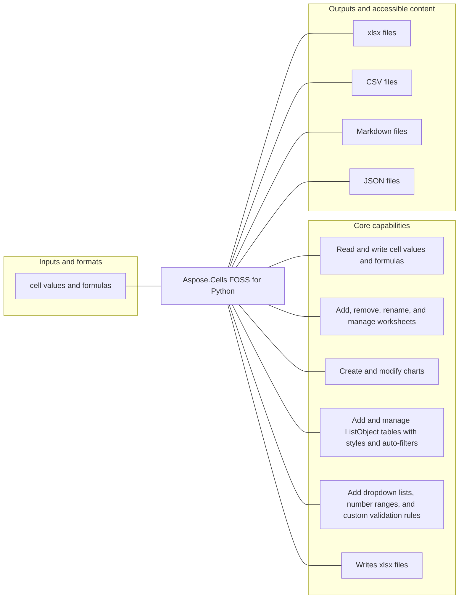

# Aspose.Cells FOSS for Python

[](https://pypi.org/project/aspose-cells-foss/)   [](License/LICENSE.txt) [](https://github.com/aspose-cells-foss/Aspose.Cells-FOSS-for-Python/graphs/contributors)

Aspose.Cells FOSS for Python provides developers using Python a way to read and write cell values and formulas. Its verified scope also includes add, remove, rename, and manage worksheets, and create and modify charts.

## Navigation

- [At a glance](#at-a-glance)
- [Key capabilities](#key-capabilities)
- [Installation](#installation)
- [Quick start](#quick-start)
- [Additional examples](#additional-examples)
- [Scope and limitations](#scope-and-limitations)
- [License](#license)

## At a glance



## Key capabilities

- Read and write cell values and formulas.
- Add, remove, rename, and manage worksheets.
- Create and modify charts.
- Add and manage ListObject tables with styles and auto-filters.
- Add dropdown lists, number ranges, and custom validation rules.

## Installation

```bash
python -m pip install aspose-cells-foss
```

Requires Python 3.7 or later.

Optional dependency groups declared in `pyproject.toml`:
- `dev`: `python -m pip install "aspose-cells-foss[dev]"`

Required runtime dependencies declared in `pyproject.toml`: `pycryptodome>=3.15.0`, `olefile>=0.46`.

## Quick start

### Minimal verified example

```python
from aspose.cells_foss import Font

font = Font()
```

## Additional examples

These additional workflows were syntax-checked and matched to the repository's static public API. They were not executed by the evidence collector.

<details>
<summary>View additional examples and results</summary>

### Repository example files

- [`__init__.py`](examples/__init__.py)
- [`output_path_helper.py`](examples/output_path_helper.py)
- [`test_alignment_properties.py`](examples/test_alignment_properties.py)
- [`test_auto_filter.py`](examples/test_auto_filter.py)
- [`test_border_settings.py`](examples/test_border_settings.py)
- [`test_cell_protection_locked.py`](examples/test_cell_protection_locked.py)
- [`test_cell_values.py`](examples/test_cell_values.py)
- [`test_comment_size.py`](examples/test_comment_size.py)
- [`test_comments.py`](examples/test_comments.py)
- [`test_conditional_formatting.py`](examples/test_conditional_formatting.py)
- [`test_create_all_charts.py`](examples/test_create_all_charts.py)
- [`test_create_exceltable.py`](examples/test_create_exceltable.py)
- [`test_create_picture.py`](examples/test_create_picture.py)
- [`test_create_shape.py`](examples/test_create_shape.py)
- [`test_create_sparkline.py`](examples/test_create_sparkline.py)
- [`test_csv_import_export.py`](examples/test_csv_import_export.py)
- [`test_data_validation.py`](examples/test_data_validation.py)
- [`test_document_properties.py`](examples/test_document_properties.py)
- [`test_encryption.py`](examples/test_encryption.py)
- [`test_fill_settings.py`](examples/test_fill_settings.py)
- [`test_font_settings.py`](examples/test_font_settings.py)
- [`test_hyperlinks.py`](examples/test_hyperlinks.py)
- [`test_manual_page_breaks.py`](examples/test_manual_page_breaks.py)
- [`test_merge_cells.py`](examples/test_merge_cells.py)
- [`test_number_formats.py`](examples/test_number_formats.py)
- [`test_print_area.py`](examples/test_print_area.py)
- [`test_workbook_protection.py`](examples/test_workbook_protection.py)
- [`test_worksheet_management.py`](examples/test_worksheet_management.py)
- [`test_worksheet_properties.py`](examples/test_worksheet_properties.py)
- [`test_worksheet_protection.py`](examples/test_worksheet_protection.py)
- [`test_xlsx_to_json.py`](examples/test_xlsx_to_json.py)
- [`test_xlsx_to_markdown.py`](examples/test_xlsx_to_markdown.py)


</details>

## Scope and limitations

The package manifest classifies this release as **Beta**.

[Aspose.Cells FOSS for Python](https://products.aspose.org/cells/python/) and [Aspose.Cells Enterprise Edition](https://products.aspose.com/cells/python/) are separate products. This README documents the FOSS implementation; do not assume API or feature parity beyond verified behavior.

## License

This project is available under the [MIT License](License/LICENSE.txt). It permits use, modification, distribution, and commercial use when the license and copyright notice are retained.
