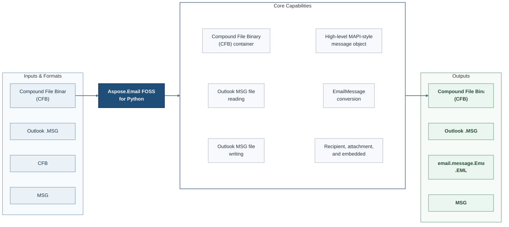

# Aspose.Email FOSS for Python

[](https://pypi.org/project/aspose-email-foss/)   [](LICENSE) [](https://github.com/aspose-email-foss/Aspose.Email-FOSS-for-Python/graphs/contributors)


Aspose.Email FOSS for Python is an open-source library for developers using Python. It reads Compound File Binary (CFB) files and Outlook .MSG files and writes Compound File Binary (CFB) files, Outlook .MSG files, and email.message.EmailMessage (.eml) files.

## Navigation

- [At a Glance](#at-a-glance)
- [Key Capabilities](#key-capabilities)
- [Installation](#installation)
- [Quick Start](#quick-start)
- [Additional Examples](#additional-examples)
- [API Reference](#api-reference)
- [Documentation and Resources](#documentation-and-resources)
- [Scope and Limitations](#scope-and-limitations)
- [Development and Testing](#development-and-testing)
- [Contributing](#contributing)
- [Security](#security)
- [License](#license)

## At a Glance



## Key Capabilities

- **Import Compound File Binary (CFB) files** - Bring supported content into application workflows.
- **Work with Outlook MSG file writing** - Produce supported output through the public API.
- **Work with High-level MAPI-style message object manipulation** - Use the public `MapiMessage` API in application workflows.
- **Work with EmailMessage conversion** - Produce supported output through the public API.
- **Work with Recipient, attachment, and embedded message handling** - Apply Recipient, attachment, and embedded message handling through the product's public object model.

## Installation

```bash
python -m pip install aspose-email-foss
```

Requires Python 3.10 or later.

## Quick Start

```python
from aspose.email_foss import msg
message = msg.MapiMessage.create('Test', 'Body')
message.set_property(msg.PropertyId.SUBJECT, 'Test Subject')
message.add_recipient('user@example.com')
message.save('test.msg')
```

## Additional Examples

Expand this section to view examples for exploring another repository workflow, converting MSG to EML, converting EML to MSG, and browsing repository example files.

<details>
<summary>View additional examples and results</summary>

### Explore Another Repository Workflow

```python
from datetime import datetime, timezone

from aspose.email_foss import msg

message = msg.MapiMessage.create("Hello", "Body")
message.set_property(msg.PropertyId.SENDER_NAME, "Build Agent")
message.set_property(msg.PropertyId.SENDER_EMAIL_ADDRESS, "build.agent@example.com")
message.set_property(msg.PropertyId.MESSAGE_DELIVERY_TIME, datetime(2026, 3, 15, 10, 30, tzinfo=timezone.utc))
message.add_recipient("alice@example.com", display_name="Alice Example")
message.add_attachment("hello.txt", b"sample attachment\n", mime_type="text/plain")
message.save("example-message.msg")

with msg.MapiMessage.from_file("example-message.msg") as loaded:
    email_message = loaded.to_email_message()
    print(email_message["Subject"])
```

### Convert MSG to EML

```python
from aspose.email_foss import msg

with msg.MapiMessage.from_file("message.msg") as message:
    email_message = message.to_email_message()

with open("message.eml", "wb") as target:
    target.write(email_message.as_bytes())
```

### Convert EML to MSG

```python
from email import policy
from email.parser import BytesParser

from aspose.email_foss import msg

with open("message.eml", "rb") as source:
    email_message = BytesParser(policy=policy.default).parse(source)

message = msg.MapiMessage.from_email_message(email_message)
message.save("message.msg")
```

### Repository Example Files

- [`create_msg_and_eml.py`](examples/create_msg_and_eml.py)
- [`msg_reader.py`](examples/msg_reader.py)
- [`msg_summary.py`](examples/msg_summary.py)

</details>

## API Reference

The package documents 30 public types across 2 namespaces. Package namespaces include `aspose.email_foss.cfb`, `aspose.email_foss.msg`. See the complete API reference under Documentation and Resources for members, signatures, and inherited APIs.

<details>
<summary>View public API by namespace</summary>

### Aspose.Email.CFB Namespace (`aspose.email_foss.cfb`)

| Type | Description |
| --- | --- |
| `CFBDocument` | Represents a CFB document through the Aspose.Email API. Supports loading content from file and loading content from reader. |
| `CFBError` | Signals a CFB error condition; derives from `Exception`. |
| `cfb.reader.CFBReader(data, _mmap_owner)` | Reads CFB content through the Aspose.Email API. Supports finding child by name, loading content from file, and retrieving entry. |
| `CFBStorage` | Represents a CFB Storage in the public CFB API for Aspose.Email. Supports adding storages and adding streams. |
| `CFBStream` | Represents a CFB Stream in the public CFB API for Aspose.Email. |
| `CFBWriter` | Writes CFB output through the Aspose.Email API. Supports converting content to bytes and writing file. |
| `DirectoryColorFlag` | Enumerates directory color flag values. |
| `DirectoryEntry` | Represents a Directory Entry in the public CFB API for Aspose.Email. Supports checking whether root, checking whether storage, and checking whether stream. |
| `DirectoryObjectType` | Enumerates directory object type values. |
| `Header` | Represents a Header in the public CFB API for Aspose.Email. |
| `SectorMarker` | Enumerates sector marker values. |

### Aspose.Email.MSG Namespace (`aspose.email_foss.msg`)

| Type | Description |
| --- | --- |
| `CommonMessagePropertyId` | Enumerates common message property id values. |
| `MapiAttachment` | Represents a Mapi Attachment in the public MSG API for Aspose.Email. Supports loading content from bytes, loading content from embedded message, and setting property. |
| `MapiMessage` | Represents a Mapi Message in the public MSG API for Aspose.Email. Supports adding attachments, adding embedded message attachments, and adding recipients. |
| `MapiNamedProperty` | Represents a Mapi Named Property in the public MSG API for Aspose.Email. |
| `MapiProperty` | Represents a Mapi Property in the public MSG API for Aspose.Email. Supports clearing raw and cloning content. |
| `MapiRecipient` | Represents a Mapi Recipient in the public MSG API for Aspose.Email. Supports setting property. |
| `MsgDocument` | Represents a MSG document through the Aspose.Email API. Supports loading content from file, loading content from reader, and converting content to CFB document. |
| `MsgError` | Signals a MSG error condition; derives from `Exception`. |
| `msg.reader.MsgReader(cfb_reader, strict)` | Reads MSG content through the Aspose.Email API. Supports loading content from file, itering attachment storages, and itering recipient storages. |
| `MsgStorage` | Represents a MSG Storage in the public MSG API for Aspose.Email. Supports adding storages, adding streams, and finding storage. |
| `MsgStream` | Represents a MSG Stream in the public MSG API for Aspose.Email. |
| `MsgWriter` | Writes MSG output through the Aspose.Email API. Supports converting content to bytes and writing file. |
| `MutableMapiAttachment` | Represents a Mutable Mapi Attachment in the public MSG API for Aspose.Email. Supports loading content from bytes, loading content from embedded message, and setting property. |
| `PropertyEntryFixedLength` | Represents a Property Entry Fixed Length in the public MSG API for Aspose.Email. Supports checking whether mandatory, checking whether readable, and checking whether writable. |
| `PropertyId` | Enumerates property id values. |
| `PropertyStreamHeaderSubobject` | Represents a Property Stream Header Subobject in the public MSG API for Aspose.Email. |
| `PropertyStreamHeaderTopLevel` | Represents a Property Stream Header Top Level in the public MSG API for Aspose.Email. |
| `PropertyTypeCode` | Enumerates property type code values. |
| `StorageLayout` | Represents a Storage Layout in the public MSG API for Aspose.Email. |

For the stable API summary, see [PUBLIC_API.md](PUBLIC_API.md).
For runnable scenarios, see [examples](examples).

</details>

## Documentation and Resources

- **[Getting started guide](https://docs.aspose.org/email/python/)** - installation, walkthroughs, and feature guides for this library.
- **[How-to guides and FAQ](https://kb.aspose.org/email/python/)** - task-focused answers for common product questions.
- Found a bug or have a feature request? [Open an issue](https://github.com/aspose-email-foss/Aspose.Email-FOSS-for-Python/issues) on GitHub.

<details>
<summary>View Additional Documentation</summary>

See [CHANGELOG.md](CHANGELOG.md).

</details>

## Scope and Limitations

The library targets the workflows listed above. Four specific constraints are listed below.

- Raised for malformed or unsupported Compound File Binary (CFB) content.
- Unsupported byte order; expected little-endian marker 0xFFFEs are rejected.
- Unsupported fixed inline property type: 0xes are rejected.
- Raised for malformed or unsupported MSG structures.

The package manifest classifies this release as **Production/Stable**.

For requirements beyond the FOSS scope described above, explore the [full-featured Aspose.Email Enterprise Edition](https://products.aspose.com/email/python-net/). It is a separate product, so features and APIs may differ.

## Development and Testing

The repository includes 2 test files.

### Tests

- [`tests/test_cfb_formats.py`](tests/test_cfb_formats.py)
- [`tests/test_msg_formats.py`](tests/test_msg_formats.py)

### Focused Commands and Repository Scripts

```bash
python -m pip install -e .
```

```bash
python -m unittest discover -s tests -p "test_*.py"
```

See [CONTRIBUTING.md](CONTRIBUTING.md).

## Contributing

See [`CONTRIBUTING.md`](CONTRIBUTING.md) for the repository's contribution guidance.

## Security

See [SECURITY.md](SECURITY.md).

## License

This project is available under the [MIT License](LICENSE). It permits use, modification, distribution, and commercial use when the license and copyright notice are retained.
