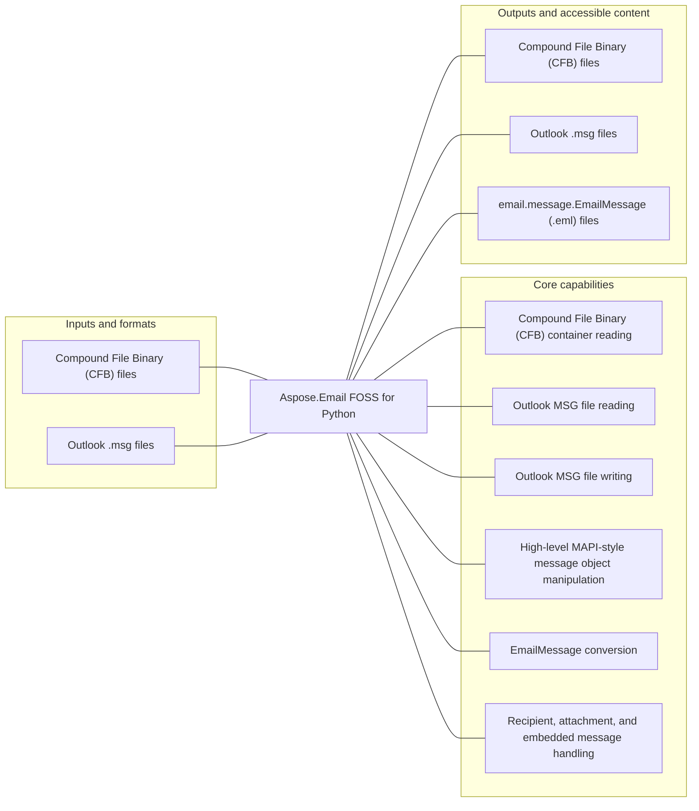

# Aspose.Email FOSS for Python

[](https://pypi.org/project/aspose-email-foss/)   [](LICENSE) [](https://github.com/aspose-email-foss/Aspose.Email-FOSS-for-Python/graphs/contributors)

Aspose.Email FOSS for Python provides Compound File Binary (CFB) container reading for developers using Python.

## Navigation

- [At a glance](#at-a-glance)
- [Key capabilities](#key-capabilities)
- [Installation](#installation)
- [Quick start](#quick-start)
- [Additional examples](#additional-examples)
- [Scope and limitations](#scope-and-limitations)
- [Development and testing](#development-and-testing)
- [Contributing](#contributing)
- [Security](#security)
- [License](#license)

## At a glance



## Key capabilities

- Compound File Binary (CFB) container reading.
- Outlook MSG file reading.
- Outlook MSG file writing.
- High-level MAPI-style message object manipulation.
- EmailMessage conversion.
- Recipient, attachment, and embedded message handling.

## Installation

```bash
python -m pip install aspose-email-foss
```

Requires Python 3.10 or later.

## Quick start

### Minimal verified example

```python
from aspose.email_foss import msg
message = msg.MapiMessage.create('Test', 'Body')
message.set_property(msg.PropertyId.SUBJECT, 'Test Subject')
message.add_recipient('user@example.com')
message.save('test.msg')
```

## Additional examples

These additional workflows were syntax-checked and matched to the repository's static public API. They were not executed by the evidence collector.

<details>
<summary>View additional examples and results</summary>

### Repository example files

- [`create_msg_and_eml.py`](examples/create_msg_and_eml.py)
- [`msg_reader.py`](examples/msg_reader.py)
- [`msg_summary.py`](examples/msg_summary.py)


</details>

## Scope and limitations

The package manifest classifies this release as **Production/Stable**.

[Aspose.Email FOSS for Python](https://products.aspose.org/email/python/) and [Aspose.Email Enterprise Edition](https://products.aspose.com/email/python/) are separate products. This README documents the FOSS implementation; do not assume API or feature parity beyond verified behavior.

## Development and testing

The repository includes 2 test files.

<details>
<summary>View development and testing resources</summary>

### Tests

- [`tests/test_cfb_formats.py`](tests/test_cfb_formats.py)
- [`tests/test_msg_formats.py`](tests/test_msg_formats.py)


</details>

## Contributing

See [`CONTRIBUTING.md`](CONTRIBUTING.md) for the repository's contribution guidance.

## Security

Follow the repository's [`SECURITY.md`](SECURITY.md) policy.

## License

This project is available under the [MIT License](LICENSE). It permits use, modification, distribution, and commercial use when the license and copyright notice are retained.
