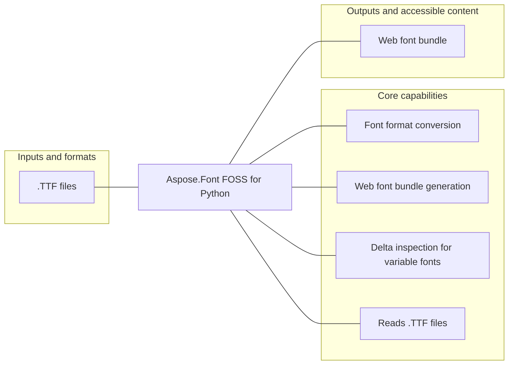

# Aspose.Font FOSS for Python

[](https://github.com/aspose-font-foss/Aspose.Font-FOSS-for-Python/tree/54004305922b8a45e241fae6066c35c439615d28)   [](LICENSE.txt) [](https://github.com/aspose-font-foss/Aspose.Font-FOSS-for-Python/graphs/contributors)

Aspose.Font FOSS for Python provides Font format conversion for developers using Python.

## Navigation

- [At a glance](#at-a-glance)
- [Key capabilities](#key-capabilities)
- [Installation](#installation)
- [Quick start](#quick-start)
- [API reference](#api-reference)
- [Scope and limitations](#scope-and-limitations)
- [Development and testing](#development-and-testing)
- [Security](#security)
- [License](#license)

## At a glance



## Key capabilities

- Font format conversion.
- Web font bundle generation.
- Delta inspection for variable fonts.

## Installation

Install the verified immutable repository revision from a local checkout:

```bash
git clone https://github.com/aspose-font-foss/Aspose.Font-FOSS-for-Python.git
cd Aspose.Font-FOSS-for-Python
git checkout --detach 54004305922b8a45e241fae6066c35c439615d28
python -m pip install .
```

`aspose-font` was installed and exercised from this exact source revision in an isolated, network-disabled verification environment. The matching PyPI receipt did not find a published package, so this README does not present a PyPI package installation command.

Optional dependency groups declared in `pyproject.toml`:
- `dev`: `python -m pip install ".[dev]"`
- `mcp`: `python -m pip install ".[mcp]"`

## Quick start

### Minimal verified example

- Before running the example, provide `Roboto-VariableFont_wdth,wght.ttf`; verification used the repository fixture `testdata/Roboto-VariableFont_wdth,wght.ttf`.

```python
from aspose_font import FontLoader

font = FontLoader.open('Roboto-VariableFont_wdth,wght.ttf')
```

## API reference

The package declares 140 public exports in its static `__all__` surface.

<details>
<summary>View MCP and public API details</summary>

### `aspose_font`

- `FontException`
- `FontParseException`
- `FontConversionException`
- `FontNotSupportedException`
- `GlyphNotFoundException`
- `UnsupportedFontFormatException`
- `FontType`
- `Font`
- `FontEncoding`
- `GlyphAccessor`
- `GlyphId`
- `Glyph`
- `GlyphPath`
- `FontMetrics`
- `PathCommand`
- `MoveTo`
- `LineTo`
- `QuadraticTo`
- `CurveTo`
- `ClosePath`
- `KernPair`
- `GlyphLayout`
- `TextLayout`
- `TextRenderer`
- `Rasterizer`
- `CoverageGroup`
- `FontSubsetter`
- `SubsetCoverage`
- `SubsetResult`
- `SUBSET_PRESETS`
- `available_subset_presets`
- `GlyphOutlineStats`
- `GlyphCompatibilityIssue`
- `GlyphInterpolationIssue`
- `ActiveTupleSummary`
- `TupleScalarDelta`
- `CompatibilityReport`
- `CompatibilityChecker`
- `CompositeGlyphComponent`
- `CompositeComponentMovement`
- `DeltaPoint`
- `DeltaTupleReport`
- `GlyphDeltaComparisonReport`
- `GlyphDeltaReport`
- `TextDeltaComparisonReport`
- `TextDeltaReport`
- `DeltaInspector`
- `ResolvedInstance`
- `SmartInstancer`
- `PreviewImage`
- `FontPreviewBuilder`
- `FontQaPackage`
- `FontQaReport`
- `FontQaReporter`
- `AnimationAsset`
- `AnimationFramePackage`
- `AnimationPreset`
- `AnimationPreviewBuilder`
- `AnimationReviewPackage`
- `AnimationShowcasePackage`
- `AnimationStep`
- `AxisRecord`
- `FvarTable`
- `NamedInstance`
- `LocalizationCoverage`
- `LocalizationResolution`
- `RequestedLanguageHint`
- `LanguageProfile`
- `build_language_profiles`
- `VariableAxis`
- `VariableAxisPreset`
- `VariableInstance`
- `NamingPolicyPreview`
- `PlatformNamingDiagnostics`
- `StatNamingDiagnostics`
- `WebFontAsset`
- `WebFontBundle`
- `WebFontFamilyPackage`
- `WebFontOptimizer`
- `WebFontOptimizerPackage`
- `FamilyReviewExportPackage`
- `WebFontBuilder`
- `FontLoader`
- `FontSourceInfo`
- `LoadedFont`
- `FontCleaner`
- `TtfFont`
- `CffFont`
- `Type1Font`
- `WoffFont`
- `Woff2Font`
- `EotFont`

### `aspose_font.cff`

- `CffFont`
- `CffIndex`
- `CffDict`
- `TopDict`
- `PrivateDict`
- `CffCharset`
- `CffEncoding`
- `Type2Interpreter`

### `aspose_font.eot`

- `EotFont`

### `aspose_font.ttf`

- `TtfFont`
- `TtfTableSet`

### `aspose_font.ttf.tables`

- `TtfTableSet`
- `HeadTable`
- `HheaTable`
- `HvarTable`
- `HMetric`
- `MaxpTable`
- `Os2Table`
- `NameTable`
- `PostTable`
- `CmapTable`
- `LocaTable`
- `HmtxTable`
- `KernTable`
- `GlyfTable`
- `FvarTable`
- `AxisRecord`
- `NamedInstance`

### `aspose_font.type1`

- `Type1Font`
- `Type1FontData`
- `Type1Interpreter`
- `PFB_ASCII`
- `PFB_BINARY`
- `PFB_EOF`
- `PfbSegment`
- `parse_pfb`
- `pfb_to_ps_stream`
- `pfa_to_ps_stream`
- `eexec_decrypt`
- `eexec_encrypt`
- `charstring_decrypt_full`
- `AfmData`
- `AfmGlyphMetric`
- `parse_afm`
- `parse_afm_bytes`
- `parse_type1_ps`

### `aspose_font.woff`

- `WoffFont`
- `Woff2Font`

### `AnimationAsset` members

- `filename: str`
- `media_type: str`
- `data: bytes`
- `frame_count: int`
- `fps: int`
- `frame_labels: tuple[str, ...]`
- `write_to(path) -> Path`

### `AnimationFramePackage` members

- `directory_name: str`
- `storyboard: PreviewImage`
- `manifest_name: str`
- `frames: tuple[PreviewImage, ...]`
- `fps: int`
- `frame_labels: tuple[str, ...]`
- `write_to(path) -> Path`

### `AnimationReviewPackage` members

- `directory_name: str`
- `package: AnimationFramePackage`
- `markdown_filename: str`
- `html_filename: str`
- `manifest_filename: str`
- `markdown: str`
- `html: str`
- `manifest: dict[str, object] | None`
- `write_to(path) -> Path`

### `AnimationShowcasePackage` members

- `directory_name: str`
- `animation: AnimationAsset`
- `review: AnimationReviewPackage`
- `html_filename: str`
- `manifest_filename: str`
- `html: str`
- `manifest: dict[str, object] | None`
- `write_to(path) -> Path`

### `AnimationPreset` members

- `name: str`
- `frames_per_segment: int`
- `fps: int`
- `size: float`
- `padding: int`
- `bounce: bool`

### `AnimationStep` members

- `coordinates: dict[str, float]`
- `label: str | None`
- `hold_frames: int`

### `AnimationPreviewBuilder` members

- `available_presets() -> tuple[str, ...]`
- `build_axis_sweep(font, axis_tag, start_val, end_val, text, frames, fps, bounce, size, color, background, padding, antialias, preset, file_stem, instance_name, base_coordinates, easing, caption_mode) -> AnimationAsset`
- `build_axis_sweep_package(font, axis_tag, start_val, end_val, **kwargs) -> AnimationFramePackage`
- `build_path(font, steps, text, frames_per_segment, hold_frames, fps, bounce, size, color, background, padding, antialias, preset, file_stem, easing, caption_mode) -> AnimationAsset`
- `build_path_package(font, steps, text, frames_per_segment, hold_frames, fps, bounce, size, color, background, padding, antialias, preset, file_stem, easing, caption_mode) -> AnimationFramePackage`
- `build_path_review_package(font, steps, text, frames_per_segment, hold_frames, fps, bounce, size, color, background, padding, antialias, preset, file_stem, easing, caption_mode) -> AnimationReviewPackage`
- `build_path_showcase_package(font, steps, text, frames_per_segment, hold_frames, fps, bounce, size, color, background, padding, antialias, preset, file_stem, easing, caption_mode) -> AnimationShowcasePackage`
- `build_named_instance_path(font, instance_names, text, frames_per_segment, hold_frames, fps, bounce, size, color, background, padding, antialias, preset, file_stem, easing, caption_mode) -> AnimationAsset`

### `CffCharset` members

- `standard(num_glyphs) -> 'CffCharset'`
- `from_reader(r, num_glyphs, string_index) -> 'CffCharset'`
- `name_for(gid) -> str`
- `gid_for(name) -> int | None`

### `CffDict` members

- `from_bytes(data) -> 'CffDict'`
- `get(op, default=None)`
- `set(op, value) -> None`
- `to_bytes() -> bytes`

### `TopDict` members

- `full_name: str`
- `family_name: str`
- `weight: str`
- `version: str`
- `font_bbox: tuple[int, int, int, int]`
- `charstring_type: int`
- `italic_angle: float`
- `is_fixed_pitch: bool`
- `underline_position: int`
- `underline_thickness: int`
- `font_matrix: tuple[float, float, float, float, float, float]`
- `charset_offset: int`
- `encoding_offset: int`
- `charstrings_offset: int`
- `private_size: int`
- `private_offset: int`
- `from_dict(d, string_index) -> 'TopDict'`

### `PrivateDict` members

- `default_width_x: int`
- `nominal_width_x: int`
- `std_hw: float`
- `std_vw: float`
- `subrs_offset: int`
- `from_dict(d) -> 'PrivateDict'`

### `CffEncoding` members

- `from_reader(r, num_glyphs, charset, string_index) -> 'CffEncoding'`
- `standard(charset) -> 'CffEncoding'`
- `expert(charset) -> 'CffEncoding'`
- `unicode_to_gid(codepoint) -> GlyphId`
- `get_all_codepoints() -> list[int]`

### `CffFont` members

- `font_type: FontType`
- `font_name: str`
- `font_family: str`
- `font_style: str`
- `num_glyphs: int`
- `metrics: FontMetrics`
- `encoding`
- `glyph_accessor: GlyphAccessor`
- `top_dict: TopDict`
- `private_dict: PrivateDict`
- `charstrings: CffIndex`
- `global_subrs: CffIndex`
- `local_subrs: CffIndex`
- `charset: CffCharset`
- `string_index: CffIndex`
- `get_kern_pairs() -> list[KernPair]`
- `to_bytes(font_type=None) -> bytes`

### `CffIndex` members

- `from_reader(r) -> 'CffIndex'`
- `to_bytes() -> bytes`

### `Type2Interpreter` members

- `interpret(charstring, gid=0) -> tuple[GlyphPath, int]`

### `FontCleaner` members

- `clean_for_web(font, drop_mac_names, drop_legacy_tables, drop_metadata_tables) -> Font`

### `GlyphOutlineStats` members

- `command_count: int`
- `point_count: int`
- `contour_count: int`
- `advance_width: int`
- `line_count: int`
- `quadratic_count: int`
- `cubic_count: int`
- `control_point_count: int`
- `closed_contour_count: int`
- `open_contour_count: int`
- `start_point: tuple[float, float] | None`
- `end_point: tuple[float, float] | None`
- `bbox: tuple[float, float, float, float] | None`
- `to_dict() -> dict[str, object]`

### `GlyphCompatibilityIssue` members

- `codepoint: int`
- `character: str`
- `reason: str`
- `geometry_notes: tuple[str, ...]`
- `before_signature: tuple[str, ...]`
- `after_signature: tuple[str, ...]`
- `before_stats: GlyphOutlineStats`
- `after_stats: GlyphOutlineStats`
- `to_dict() -> dict[str, object]`

### `ActiveTupleSummary` members

- `tuple_index: int`
- `scalar: float`
- `peak_coords: dict[str, float]`
- `start_coords: dict[str, float] | None`
- `end_coords: dict[str, float] | None`
- `to_dict() -> dict[str, object]`

### `TupleScalarDelta` members

- `tuple_index: int`
- `before_scalar: float`
- `after_scalar: float`
- `to_dict() -> dict[str, object]`

### `GlyphInterpolationIssue` members

- `codepoint: int`
- `character: str`
- `reason: str`
- `before_active: tuple[ActiveTupleSummary, ...]`
- `after_active: tuple[ActiveTupleSummary, ...]`
- `entered_tuple_indices: tuple[int, ...]`
- `exited_tuple_indices: tuple[int, ...]`
- `retuned_tuples: tuple[TupleScalarDelta, ...]`
- `to_dict() -> dict[str, object]`

### `CompatibilityReport` members

- `before_label: str`
- `after_label: str`
- `checked_codepoints: tuple[int, ...]`
- `compared_glyphs: int`
- `before_normalized_coordinates: dict[str, float]`
- `after_normalized_coordinates: dict[str, float]`
- `issues: tuple[GlyphCompatibilityIssue, ...]`
- `interpolation_issues: tuple[GlyphInterpolationIssue, ...]`
- `is_compatible: bool`
- `to_dict() -> dict[str, object]`
- `to_json(indent, sort_keys) -> str`
- `write_json(target, indent, sort_keys) -> None`

### `CompatibilityChecker` members

- `compare_fonts(before, after, before_label, after_label, codepoints, text) -> CompatibilityReport`
- `compare_variable_instances(font, before_coordinates, after_coordinates, before_instance_name, after_instance_name, codepoints, text) -> CompatibilityReport`

### `DeltaPoint` members

- `index: int`
- `dx: float`
- `dy: float`
- `magnitude: float`
- `to_dict() -> dict[str, float | int]`

### `DeltaTupleReport` members

- `tuple_index: int`
- `scalar: float`
- `peak_coords: dict[str, float]`
- `start_coords: dict[str, float] | None`
- `end_coords: dict[str, float] | None`
- `referenced_points: int`
- `referenced_outline_points: int`
- `referenced_phantom_points: int`
- `non_zero_points: int`
- `non_zero_outline_points: int`
- `non_zero_phantom_points: int`
- `max_abs_dx: float`
- `max_abs_dy: float`
- `total_abs_dx: float`
- `total_abs_dy: float`
- `top_points: tuple[DeltaPoint, ...]`
- `to_dict() -> dict[str, object]`

### `CompositeGlyphComponent` members

- `glyph_id: int`
- `dx: float`
- `dy: float`
- `xx: float`
- `yx: float`
- `xy: float`
- `yy: float`
- `to_dict() -> dict[str, float | int]`

### `CompositeComponentMovement` members

- `component_index: int`
- `glyph_id: int`
- `point_count: int`
- `strongest_point_index: int | None`
- `strongest_magnitude: float`
- `total_abs_dx: float`
- `total_abs_dy: float`
- `active_tuple_count: int`
- `local_strongest_point_index: int | None`
- `local_strongest_magnitude: float`
- `shift_magnitude: float`
- `transform_changed: bool`
- `note: str | None`
- `to_dict() -> dict[str, float | int | bool | None]`

### `GlyphDeltaReport` members

- `glyph_id: int`
- `glyph_name: str | None`
- `codepoint: int | None`
- `character: str`
- `instance_label: str`
- `coordinates: dict[str, float]`
- `normalized_coordinates: dict[str, float]`
- `total_tuple_count: int`
- `active_tuples: tuple[DeltaTupleReport, ...]`
- `strongest_points: tuple[DeltaPoint, ...]`
- `composite_components: tuple[CompositeGlyphComponent, ...]`
- `component_movements: tuple[CompositeComponentMovement, ...]`
- `point_count: int`
- `contour_count: int`
- `is_supported: bool`
- `note: str | None`
- `to_dict() -> dict[str, object]`

### `TextDeltaReport` members

- `text: str`
- `instance_label: str`
- `coordinates: dict[str, float]`
- `normalized_coordinates: dict[str, float]`
- `glyph_reports: tuple[GlyphDeltaReport, ...]`
- `glyph_count: int`
- `active_glyph_count: int`
- `supported_glyph_count: int`
- `to_dict() -> dict[str, object]`

### `GlyphDeltaComparisonReport` members

- `glyph_id: int`
- `glyph_name: str | None`
- `codepoint: int | None`
- `character: str`
- `before: GlyphDeltaReport`
- `after: GlyphDeltaReport`
- `comparison_points: tuple[DeltaPoint, ...]`
- `note: str | None`
- `moved_point_count: int`
- `is_comparable: bool`
- `to_dict() -> dict[str, object]`

### `TextDeltaComparisonReport` members

- `text: str`
- `before_label: str`
- `after_label: str`
- `before_coordinates: dict[str, float]`
- `after_coordinates: dict[str, float]`
- `before_normalized_coordinates: dict[str, float]`
- `after_normalized_coordinates: dict[str, float]`
- `glyph_comparisons: tuple[GlyphDeltaComparisonReport, ...]`
- `glyph_count: int`
- `comparable_glyph_count: int`
- `moved_glyph_count: int`
- `to_dict() -> dict[str, object]`

### `DeltaInspector` members

- `inspect_variable_glyph(font, glyph_id, codepoint, coordinates, instance_name, top_points) -> GlyphDeltaReport`
- `build_delta_sheet(font, glyph_id, codepoint, coordinates, instance_name, top_points, panel_size, file_stem) -> PreviewImage`
- `compare_variable_glyph(font, glyph_id, codepoint, before_coordinates, after_coordinates, before_instance_name, after_instance_name, top_points) -> GlyphDeltaComparisonReport`
- `inspect_variable_text(font, text, coordinates, instance_name, top_points) -> TextDeltaReport`
- `compare_variable_text(font, text, before_coordinates, after_coordinates, before_instance_name, after_instance_name, top_points) -> TextDeltaComparisonReport`
- `build_delta_text_sheet(font, text, coordinates, instance_name, top_points, panel_size, columns, file_stem) -> PreviewImage`
- `build_delta_text_comparison_sheet(font, text, before_coordinates, after_coordinates, before_instance_name, after_instance_name, top_points, panel_size, columns, file_stem) -> PreviewImage`
- `build_delta_comparison_sheet(font, glyph_id, codepoint, before_coordinates, after_coordinates, before_instance_name, after_instance_name, top_points, panel_size, file_stem) -> PreviewImage`

### `EotFont` members

- `font_type: FontType`
- `inner_font: TtfFont`
- `font_name: str`
- `font_family: str`
- `font_style: str`
- `num_glyphs: int`
- `metrics: FontMetrics`
- `encoding: FontEncoding`
- `glyph_accessor: GlyphAccessor`
- `eot_version: int`
- `flags: int`
- `charset: int`
- `italic: int`
- `weight: int`
- `fs_type: int`
- `get_kern_pairs() -> list[KernPair]`
- `to_bytes(font_type=None) -> bytes`

### `ResolvedInstance` members

- `coordinates: dict[str, float]`
- `source_instance: 'VariableInstance | None'`
- `is_default: bool`
- `label: str`

### `SmartInstancer` members

- `font: 'TtfFont'`
- `axes`
- `named_instances`
- `default_coordinates: dict[str, float]`
- `suggest_axis_values(axis_tag, include_default, include_bounds) -> list[float]`
- `resolve_axis_grid(axis_tag, values=(), secondary_axis_tag, secondary_values, coordinates, instance_name, use_axis_presets, use_secondary_axis_presets, include_default, include_bounds) -> list[ResolvedInstance]`
- `resolve(coordinates=None, instance_name, **axis_values) -> ResolvedInstance`
- `instantiate(coordinates=None, instance_name, naming_strategy, family_suffix, legacy_family_name, typographic_family_name, legacy_style_name, typographic_style_name, stat_policy, **axis_values) -> 'TtfFont'`
- `preview_naming_policy(coordinates=None, instance_name, naming_strategy, family_suffix, legacy_family_name, typographic_family_name, legacy_style_name, typographic_style_name, stat_policy, **axis_values)`
- `instantiate_named(name, coordinates, naming_strategy, family_suffix, legacy_family_name, typographic_family_name, legacy_style_name, typographic_style_name, stat_policy, **axis_values) -> 'TtfFont'`
- `resolve_named_many(names=None, include_default) -> list[ResolvedInstance]`
- `instantiate_many(names=None, include_default, naming_strategy, family_suffix, legacy_family_name, typographic_family_name, legacy_style_name, typographic_style_name, stat_policy) -> list[tuple[ResolvedInstance, 'TtfFont']]`
- `build_web_bundle(coordinates=None, instance_name, **kwargs) -> WebFontBundle`
- `build_preview(coordinates=None, instance_name, output_format, **axis_values) -> PreviewImage`
- `build_web_bundles(names=None, include_default, **kwargs) -> list[tuple[ResolvedInstance, WebFontBundle]]`
- `build_axis_grid_web_bundles(axis_tag, values=(), secondary_axis_tag, secondary_values, coordinates, instance_name, use_axis_presets, use_secondary_axis_presets, include_default, include_bounds, **kwargs) -> list[tuple[ResolvedInstance, WebFontBundle]]`
- `build_axis_grid_web_family_package(axis_tag, values, secondary_axis_tag, secondary_values, coordinates, instance_name, family_name, **kwargs) -> WebFontFamilyPackage`
- `build_previews(names=None, include_default, text, size, color, background, padding, antialias, output_format) -> list[tuple[ResolvedInstance, PreviewImage]]`
- `build_web_family_package(names=None, include_default, family_name, **kwargs) -> WebFontFamilyPackage`
- `build_axis_grid_previews(axis_tag, values=(), secondary_axis_tag, secondary_values, coordinates, instance_name, use_axis_presets, use_secondary_axis_presets, include_default, include_bounds, text, size, color, background, padding, antialias, output_format) -> list[tuple[ResolvedInstance, PreviewImage]]`
- `build_axis_grid_sheet(axis_tag, values=(), secondary_axis_tag, secondary_values, coordinates, instance_name, use_axis_presets, use_secondary_axis_presets, include_default, include_bounds, text, size, color, background, padding, antialias, gap, file_stem) -> PreviewImage`
- `build_comparison_sheet(before_coordinates, after_coordinates, before_instance_name, after_instance_name, text, size, color, background, padding, antialias, gap, file_stem) -> PreviewImage`
- `build_waterfall_sheet(names=None, include_default, text, file_stem) -> PreviewImage`
- `build_matrix_sheet(names=None, include_default, text, file_stem) -> PreviewImage`
- `build_family_review_board(names=None, include_default, text, family_name, file_stem) -> PreviewImage`
- `build_family_review_export_package(names=None, include_default, text, family_name, file_stem) -> FamilyReviewExportPackage`
- `check_compatibility(before_coordinates, after_coordinates, before_instance_name, after_instance_name, codepoints, text) -> CompatibilityReport`
- `inspect_deltas(glyph_id, codepoint, coordinates, instance_name, top_points) -> GlyphDeltaReport`
- `build_delta_sheet(glyph_id, codepoint, coordinates, instance_name, top_points, panel_size, file_stem) -> PreviewImage`
- `inspect_delta_text(text, coordinates, instance_name, top_points) -> TextDeltaReport`
- `compare_delta_glyph(glyph_id, codepoint, before_coordinates, after_coordinates, before_instance_name, after_instance_name, top_points) -> GlyphDeltaComparisonReport`
- `compare_delta_text(text, before_coordinates, after_coordinates, before_instance_name, after_instance_name, top_points) -> TextDeltaComparisonReport`
- `build_delta_text_sheet(text, coordinates, instance_name, top_points, panel_size, columns, file_stem) -> PreviewImage`
- `build_delta_text_comparison_sheet(text, before_coordinates, after_coordinates, before_instance_name, after_instance_name, top_points, panel_size, columns, file_stem) -> PreviewImage`
- `build_delta_comparison_sheet(glyph_id, codepoint, before_coordinates, after_coordinates, before_instance_name, after_instance_name, top_points, panel_size, file_stem) -> PreviewImage`

### `FontSourceInfo` members

- `kind: str`
- `label: str`
- `size: int`
- `path: str | None`
- `stream_name: str | None`
- `collection_index: int | None`
- `collection_size: int | None`
- `is_path: bool`
- `is_bytes: bool`
- `is_stream: bool`

### `LoadedFont` members

- `font: Font`
- `source: FontSourceInfo`
- `detected_font_type: FontType`
- `requested_font_type: FontType | None`
- `is_variable: bool`
- `is_static: bool`
- `unwrap() -> Font`

### `FontLoader` members

- `open(source, font_type=None, collection_index) -> Font`
- `load(source, font_type=None, collection_index) -> LoadedFont`

### `PreviewImage` members

- `filename: str`
- `media_type: str`
- `data: bytes`
- `write_to(path) -> Path`

### `FontPreviewBuilder` members

- `build(font, text, size, color, background, padding, antialias, file_stem, instance_coordinates, instance_name, output_format) -> PreviewImage`
- `compose_sheet(previews, columns, gap, background, title, column_headers, row_headers, labels, footer_lines, label_color, file_stem) -> PreviewImage`
- `compose_difference_preview(before, after, file_stem, background, before_color, after_color, overlap_color, threshold) -> PreviewImage`
- `compose_overlay_preview(before, after, file_stem, background, before_color, after_color, overlap_color, threshold) -> PreviewImage`

### `FontQaReport` members

- `payload: dict[str, object]`
- `to_dict() -> dict[str, object]`
- `to_json(indent, sort_keys) -> str`
- `write_json(path, indent, sort_keys) -> Path`
- `write_html(path) -> Path`

### `FontQaPackage` members

- `report: FontQaReport`
- `directory: Path`
- `json_path: Path`
- `html_path: Path`
- `preview_path: Path`
- `artifacts: list[dict[str, str]]`

### `FontQaReporter` members

- `build(font, source_label, presets, text, codepoints, ranges, preferred_languages) -> FontQaReport`
- `build_package(font, output_dir, source_label, presets, text, codepoints, ranges, preferred_languages, preview_text, preview_instance_name) -> FontQaPackage`

### `Rasterizer` members

- `curve_tolerance: float`
- `clear(color=None) -> None`
- `draw_path(path, color=(0, 0, 0), transform=None) -> None`
- `to_png() -> bytes`

### `CoverageGroup` members

- `kind: str`
- `label: str`
- `requested_codepoints: tuple[int, ...]`
- `covered_codepoints: tuple[int, ...]`
- `missing_codepoints: tuple[int, ...]`
- `requested_count: int`
- `covered_count: int`
- `missing_count: int`
- `fully_covered: bool`
- `to_dict() -> dict[str, object]`
- `summary_dict() -> dict[str, object]`

### `SubsetCoverage` members

- `requested_codepoints: tuple[int, ...]`
- `covered_codepoints: tuple[int, ...]`
- `missing_codepoints: tuple[int, ...]`
- `retained_gids: tuple[int, ...]`
- `groups: tuple[CoverageGroup, ...]`
- `requested_count: int`
- `covered_count: int`
- `missing_count: int`
- `fully_covered: bool`
- `to_dict() -> dict[str, object]`
- `summary_dict() -> dict[str, object]`

### `SubsetResult` members

- `font: Font`
- `coverage: SubsetCoverage`

### `FontSubsetter` members

- `available_presets() -> tuple[str, ...]`
- `subset(font, codepoints) -> Font`
- `subset_by_text(font, text) -> Font`
- `subset_by_gids(font, gids) -> Font`
- `subset_by_presets(font, presets) -> Font`
- `subset_for_web(font, presets, text, codepoints, ranges) -> Font`
- `subset_with_coverage(font, codepoints) -> SubsetResult`
- `subset_for_web_with_coverage(font, presets, text, codepoints, ranges) -> SubsetResult`
- `analyze_coverage(font, codepoints, groups) -> SubsetCoverage`
- `analyze_web_coverage(font, presets, text, codepoints, ranges) -> SubsetCoverage`
- `resolve_codepoints(presets, text, codepoints, ranges) -> set[int]`

### `GlyphLayout` members

- `char: str`
- `glyph_id: GlyphId`
- `x_offset: float`
- `y_offset: float`
- `advance_width: float`
- `path: GlyphPath | None`

### `TextLayout` members

- `glyphs: list[GlyphLayout]`
- `total_width: float`
- `ascender: float`
- `descender: float`

### `TextRenderer` members

- `layout(font, text, size=1.0, kern=True) -> TextLayout`
- `layout_glyphs(font, glyph_ids, size=1.0, kern=True) -> TextLayout`
- `render_rgb(font, text, size, color=(0, 0, 0), background=(255, 255, 255), padding=4, antialias=True, _fixed_canvas=None, _fixed_baseline=None) -> tuple[int, int, bytes]`
- `render_png(font, text, size, color=(0, 0, 0), background=(255, 255, 255), padding=4, antialias=True) -> bytes`
- `render_svg(font, text, size, color=(0, 0, 0), background=(255, 255, 255), padding=4) -> bytes`

### `TtfFont` members

- `font_type: FontType`
- `font_name: str`
- `font_family: str`
- `font_style: str`
- `num_glyphs: int`
- `metrics: FontMetrics`
- `encoding: FontEncoding`
- `glyph_accessor: GlyphAccessor`
- `ttf_tables: TtfTableSet`
- `get_table_bytes(tag) -> bytes`
- `set_table_bytes(tag, data) -> None`
- `cff_font`
- `fvar: 'FvarTable | None'`
- `hvar: 'HvarTable | None'`
- `is_variable: bool`
- `axes: 'list[AxisRecord]'`
- `named_instances: 'list[NamedInstance]'`
- `variable_axes: list[VariableAxis]`
- `get_axis(tag) -> VariableAxis | None`
- `variable_instances: list[VariableInstance]`
- `get_named_instance(name, preferred_languages) -> VariableInstance | None`
- `variable_presentation(preferred_languages, include_suggested_values) -> dict[str, object]`
- `smart_instancer`
- `available_naming_strategies() -> tuple[str, ...]`
- `instantiate(coordinates, naming_strategy, family_suffix, legacy_family_name, typographic_family_name, legacy_style_name, typographic_style_name, stat_policy) -> 'TtfFont'`
- `preview_naming_policy(coordinates, naming_strategy, family_suffix, legacy_family_name, typographic_family_name, legacy_style_name, typographic_style_name, stat_policy)`
- `get_kern_pairs() -> list[KernPair]`
- `to_bytes(font_type=None) -> bytes`

### `NamingPolicyPreview` members

- `naming_strategy: str`
- `family_suffix: str | None`
- `coordinates: dict[str, float]`
- `source_instance_name: str | None`
- `legacy_family_name: str`
- `legacy_style_name: str`
- `full_name: str`
- `postscript_name: str`
- `typographic_family_name: str`
- `typographic_style_name: str`
- `warnings: tuple[str, ...]`
- `stat_diagnostics: 'StatNamingDiagnostics | None'`
- `platform_diagnostics: 'PlatformNamingDiagnostics | None'`
- `name_ids: dict[int, str]`
- `to_dict() -> dict[str, object]`

### `StatNamingDiagnostics` members

- `stat_policy: str`
- `supported_stat_policies: tuple[str, ...]`
- `source_has_stat: bool`
- `static_export_action: str`
- `stat_policy_recommendation: str`
- `stat_policy_recommendation_reasons: tuple[str, ...]`
- `stat_policy_next_action: str`
- `stat_policy_override_suggestion: str | None`
- `stat_policy_override_suggestion_reasons: tuple[str, ...]`
- `typographic_family_ids_emitted: tuple[int, ...]`
- `typographic_style_ids_emitted: tuple[int, ...]`
- `legacy_typographic_family_diverges: bool`
- `legacy_typographic_style_diverges: bool`
- `source_stat_name_ids: tuple[int, ...]`
- `covered_source_stat_name_ids: tuple[int, ...]`
- `uncovered_source_stat_name_ids: tuple[int, ...]`
- `source_stat_name_labels: tuple[tuple[int, str | None, bool], ...]`
- `source_stat_axis_value_flags: tuple[int, ...]`
- `source_stat_axis_value_flag_meanings: tuple[tuple[int, tuple[str, ...]], ...]`
- `source_stat_axis_value_flag_summary: dict[str, int]`
- `generated_stat_name_ids: tuple[int, ...]`
- `generated_stat_axis_tags: tuple[str, ...]`
- `generated_stat_axis_value_flags: int`
- `generated_stat_axis_value_flag_meanings: tuple[str, ...]`
- `generated_stat_axis_value_flag_summary: dict[str, int]`
- `notes: tuple[str, ...]`
- `warnings: tuple[str, ...]`
- `to_dict() -> dict[str, object]`

### `PlatformNamingDiagnostics` members

- `windows_legacy_menu_safe: bool`
- `windows_legacy_style_ribbi: bool`
- `macos_typographic_names_present: bool`
- `macos_typographic_names_diverge: bool`
- `postscript_name_safe: bool`
- `postscript_name_length: int`
- `postscript_name_sanitized: bool`
- `notes: tuple[str, ...]`
- `warnings: tuple[str, ...]`
- `to_dict() -> dict[str, object]`

### `CmapTable` members

- `subtables: list[CmapSubtable]`
- `best_subtable() -> CmapSubtable`
- `from_reader(r, table_length) -> 'CmapTable'`
- `to_bytes() -> bytes`

### `AxisRecord` members

- `tag: str`
- `min_value: float`
- `default_value: float`
- `max_value: float`
- `flags: int`
- `name_id: int`

### `NamedInstance` members

- `name_id: int`
- `coordinates: dict[str, float]`
- `postscript_name_id: int | None`

### `FvarTable` members

- `axes: list[AxisRecord]`
- `instances: list[NamedInstance]`
- `from_reader(r, length) -> 'FvarTable'`
- `to_bytes() -> bytes`

### `GlyfTable` members

- `from_reader(r, length) -> 'GlyfTable'`
- `to_bytes() -> bytes`
- `get_glyph_bytes(offset, length) -> bytes`

### `HeadTable` members

- `magic: int`
- `major_version: int`
- `minor_version: int`
- `font_revision: float`
- `checksum_adjustment: int`
- `flags: int`
- `units_per_em: int`
- `created: int`
- `modified: int`
- `x_min: int`
- `y_min: int`
- `x_max: int`
- `y_max: int`
- `mac_style: int`
- `lowest_rec_ppem: int`
- `font_direction_hint: int`
- `index_to_loc_format: int`
- `glyph_data_format: int`
- `from_reader(r) -> 'HeadTable'`
- `to_bytes() -> bytes`

### `HheaTable` members

- `major_version: int`
- `minor_version: int`
- `ascender: int`
- `descender: int`
- `line_gap: int`
- `advance_width_max: int`
- `min_lsb: int`
- `min_rsb: int`
- `x_max_extent: int`
- `caret_slope_rise: int`
- `caret_slope_run: int`
- `caret_offset: int`
- `metric_data_format: int`
- `number_of_hmetrics: int`
- `from_reader(r) -> 'HheaTable'`
- `to_bytes() -> bytes`

### `HMetric` members

- `advance_width: int`
- `lsb: int`

### `HmtxTable` members

- `metrics: list[HMetric]`
- `from_reader(r, num_glyphs, number_of_hmetrics, table_length) -> 'HmtxTable'`
- `to_bytes(number_of_hmetrics) -> bytes`
- `get_metric(gid) -> HMetric`

### `HvarTable` members

- `advance_width_mapping: DeltaSetIndexMap | None`
- `item_variation_store: ItemVariationStore`
- `from_reader(r, table_length, axis_tags) -> 'HvarTable'`
- `advance_width_delta(gid, normalized_coordinates) -> float`

### `KernTable` members

- `pairs: list[KernPair]`
- `from_reader(r, table_length) -> 'KernTable'`
- `get(left_gid, right_gid) -> int`
- `build_lookup() -> dict[tuple[int, int], int]`
- `to_bytes() -> bytes`

### `LocaTable` members

- `offsets: list[int]`
- `from_reader(r, num_glyphs, index_to_loc_format, table_length) -> 'LocaTable'`
- `to_bytes(index_to_loc_format) -> bytes`
- `glyph_offset(gid) -> int`
- `glyph_length(gid) -> int`

### `MaxpTable` members

- `version: int`
- `num_glyphs: int`
- `extras: tuple[int, ...]`
- `from_reader(r, table_length) -> 'MaxpTable'`
- `to_bytes() -> bytes`

### `NameTable` members

- `records: list[NameRecord]`
- `language_key(platform_id, language_id) -> str`
- `get(name_id, platform_id=3, encoding_id=1) -> str | None`
- `records_for(name_id) -> list[NameRecord]`
- `localized_names(name_id) -> dict[str, str]`
- `best_name(name_id, preferred_languages=('en',)) -> str | None`
- `replace_name(name_id, value) -> None`
- `ensure_name_record(name_id, value, platform_id, encoding_id, language_id) -> None`
- `ensure_english_platform_names(name_id, value) -> None`
- `remove_name_ids(name_ids) -> None`
- `from_reader(r, table_length) -> 'NameTable'`
- `to_bytes() -> bytes`

### `Os2Table` members

- `version: int`
- `fs_type: int`
- `s_typo_ascender: int`
- `s_typo_descender: int`
- `s_typo_line_gap: int`
- `us_win_ascent: int`
- `us_win_descent: int`
- `fs_selection: int`
- `panose: bytes`
- `ach_vend_id: str`
- `from_reader(r, table_length) -> 'Os2Table'`
- `to_bytes() -> bytes`

### `PostTable` members

- `version: int`
- `italic_angle: float`
- `underline_position: int`
- `underline_thickness: int`
- `is_fixed_pitch: int`
- `glyph_names: list[str] | None`
- `from_reader(r, table_length) -> 'PostTable'`
- `to_bytes() -> bytes`
- `glyph_name(gid) -> str | None`

### `AfmGlyphMetric` members

- `name: str`
- `code: int`
- `advance_width: int`
- `bbox: tuple[int, int, int, int]`

### `AfmData` members

- `font_name: str`
- `full_name: str`
- `family_name: str`
- `weight: str`
- `italic_angle: float`
- `is_fixed_pitch: bool`
- `font_bbox: tuple[int, int, int, int]`
- `underline_position: int`
- `underline_thickness: int`
- `cap_height: float`
- `x_height: float`
- `ascender: float`
- `descender: float`
- `glyph_metrics: dict[str, AfmGlyphMetric]`
- `kern_pairs: list[tuple[str, str, int]]`

### `Type1Interpreter` members

- `interpret(charstring) -> tuple[GlyphPath, int]`

### `Type1Font` members

- `font_type: FontType`
- `font_name: str`
- `font_family: str`
- `font_style: str`
- `num_glyphs: int`
- `metrics: FontMetrics`
- `encoding: FontEncoding`
- `glyph_accessor: GlyphAccessor`
- `get_kern_pairs() -> list[KernPair]`
- `load_afm(path) -> None`
- `to_bytes(font_type=None) -> bytes`

### `PfbSegment` members

- `seg_type: int`
- `data: bytes`

### `Type1FontData` members

- `font_name: str`
- `full_name: str`
- `family_name: str`
- `weight: str`
- `italic_angle: float`
- `is_fixed_pitch: bool`
- `font_bbox: tuple[int, int, int, int]`
- `underline_position: int`
- `underline_thickness: int`
- `encoding: list[str]`
- `charstrings: dict[str, bytes]`
- `subrs: list[bytes]`
- `len_iv: int`

### `LocalizationResolution` members

- `requested_languages: tuple[str, ...]`
- `preference_chain: tuple[str, ...]`
- `selected_language: str | None`
- `selected_label: str | None`
- `fallback_reason: str`
- `is_exact_match: bool`
- `to_dict() -> dict[str, object]`

### `LocalizationCoverage` members

- `requested_languages: tuple[str, ...]`
- `available_languages: tuple[str, ...]`
- `matched_languages: tuple[str, ...]`
- `missing_languages: tuple[str, ...]`
- `status: str`
- `requested_count: int`
- `available_count: int`
- `matched_count: int`
- `missing_count: int`
- `to_dict() -> dict[str, object]`

### `RequestedLanguageHint` members

- `requested_language: str`
- `status: str`
- `matched_language: str | None`
- `label: str | None`
- `has_requested_language_label: bool`
- `to_dict() -> dict[str, object]`

### `LanguageProfile` members

- `requested_language: str`
- `display_label: str | None`
- `resolved_language: str | None`
- `fallback_reason: str`
- `has_requested_language_label: bool`
- `to_dict() -> dict[str, object]`

### `VariableAxisPreset` members

- `name: str`
- `value: float`
- `description: str`
- `to_presentation(axis=None) -> dict[str, object]`

### `VariableAxis` members

- `tag: str`
- `min_value: float`
- `default_value: float`
- `max_value: float`
- `flags: int`
- `name_id: int`
- `names_by_language: dict[str, str]`
- `available_languages: tuple[str, ...]`
- `label: str`
- `description: str | None`
- `unit_label: str`
- `presentation_kind: str`
- `display_group: str`
- `display_order: int`
- `is_registered_axis: bool`
- `recommended_step: float`
- `span: float`
- `default_ratio: float | None`
- `presets: list[VariableAxisPreset]`
- `is_hidden: bool`
- `default_preset: VariableAxisPreset | None`
- `name(language='en') -> str | None`
- `localization_resolution(language='en') -> LocalizationResolution`
- `localization_coverage(language='en') -> LocalizationCoverage`
- `localized_labels(preferred_languages=()) -> tuple[tuple[str, str], ...]`
- `requested_language_hints(language='en') -> tuple[RequestedLanguageHint, ...]`
- `language_profiles(language='en') -> tuple[LanguageProfile, ...]`
- `clamp(value) -> float`
- `normalize(value) -> float`
- `format_value(value) -> str`
- `describe_value(value) -> str`
- `range_summary: str`
- `css_axis_tag: str`
- `css_variation_setting(value) -> str`
- `ui_control(language='en') -> dict[str, object]`
- `get_preset(name) -> VariableAxisPreset | None`
- `to_presentation(language, suggested_values) -> dict[str, object]`

### `VariableInstance` members

- `coordinates: dict[str, float]`
- `name_id: int`
- `postscript_name_id: int | None`
- `names_by_language: dict[str, str]`
- `postscript_name: str | None`
- `available_languages: tuple[str, ...]`
- `label: str`
- `name(language='en') -> str | None`
- `localization_resolution(language='en') -> LocalizationResolution`
- `localization_coverage(language='en') -> LocalizationCoverage`
- `localized_labels(preferred_languages=()) -> tuple[tuple[str, str], ...]`
- `requested_language_hints(language='en') -> tuple[RequestedLanguageHint, ...]`
- `language_profiles(language='en') -> tuple[LanguageProfile, ...]`
- `format_coordinates(axes, language, include_tags) -> tuple[str, ...]`
- `css_variation_settings(axes) -> tuple[str, ...]`
- `to_presentation(axes, language, include_tags) -> dict[str, object]`

### `WebFontAsset` members

- `filename: str`
- `media_type: str`
- `data: bytes`

### `WebFontBundle` members

- `family: str`
- `style: str`
- `css: str`
- `html: str`
- `css_filename: str`
- `html_filename: str`
- `manifest_filename: str`
- `manifest: dict[str, object]`
- `font_assets: list[WebFontAsset]`
- `preview_font: Font | None`
- `review_label: str | None`
- `write_to(directory) -> list[Path]`

### `WebFontFamilyPackage` members

- `family_name: str`
- `bundles: list[WebFontBundle]`
- `css: str`
- `html: str`
- `css_filename: str`
- `html_filename: str`
- `manifest_filename: str`
- `manifest: dict[str, object]`
- `assets: list[WebFontAsset]`
- `write_to(directory) -> list[Path]`

### `WebFontOptimizerPackage` members

- `bundle: WebFontBundle`
- `manifest: dict[str, object]`
- `manifest_filename: str`
- `size_summary: dict[str, object]`
- `readiness: dict[str, object]`
- `notes: list[dict[str, str]]`
- `write_to(directory) -> list[Path]`

### `FamilyReviewExportPackage` members

- `family_name: str`
- `board: PreviewImage`
- `assets: list[WebFontAsset]`
- `markdown_filename: str`
- `html_filename: str`
- `manifest_filename: str`
- `markdown: str`
- `html: str`
- `manifest: dict[str, object]`
- `write_to(directory) -> list[Path]`

### `WebFontOptimizer` members

- `build(font, source_path, file_stem, include_woff, font_display, preview_text, instance_coordinates, instance_name, presets, text, codepoints, ranges, specimen_template, variable_mode, naming_strategy, family_suffix, legacy_family_name, typographic_family_name, legacy_style_name, typographic_style_name, stat_policy) -> WebFontOptimizerPackage`

### `WebFontBuilder` members

- `build_family_waterfall_preview(bundles, preview_text, file_stem) -> PreviewImage`
- `build_family_matrix_preview(bundles, preview_text, file_stem) -> PreviewImage`
- `build_family_review_board(bundles, family_name, preview_text, file_stem) -> PreviewImage`
- `build_family_review_export_package(bundles, family_name, preview_text, file_stem) -> FamilyReviewExportPackage`
- `build_family_package(bundles, family_name, css_filename, html_filename, preview_text, specimen_template) -> WebFontFamilyPackage`
- `build(font, file_stem, include_woff, font_display, preview_text, instance_coordinates, instance_name, presets, text, codepoints, ranges, specimen_template, variable_mode, naming_strategy, family_suffix, legacy_family_name, typographic_family_name, legacy_style_name, typographic_style_name, stat_policy) -> WebFontBundle`

### `WoffFont` members

- `font_type: FontType`
- `font_name: str`
- `font_family: str`
- `font_style: str`
- `num_glyphs: int`
- `metrics: FontMetrics`
- `encoding: FontEncoding`
- `glyph_accessor: GlyphAccessor`
- `metadata_xml: str`
- `inner_font: TtfFont`
- `get_kern_pairs() -> list[KernPair]`
- `to_bytes(font_type=None) -> bytes`

### `Woff2Font` members

- `font_type: FontType`
- `font_name: str`
- `font_family: str`
- `font_style: str`
- `num_glyphs: int`
- `metrics: FontMetrics`
- `encoding: FontEncoding`
- `glyph_accessor: GlyphAccessor`
- `metadata_xml: str`
- `inner_font: TtfFont`
- `get_kern_pairs() -> list[KernPair]`
- `to_bytes(font_type=None) -> bytes`

</details>

## Scope and limitations

The package manifest classifies this release as **Beta**.

[Aspose.Font FOSS for Python](https://products.aspose.org/font/python/) and [Aspose.Font Enterprise Edition](https://products.aspose.com/font/) are separate products. This README documents the FOSS implementation; do not assume API or feature parity beyond verified behavior.

## Development and testing

The repository includes 29 test files, 2 declared Make targets.

<details>
<summary>View development and testing resources</summary>

### Tests

- [`tests/conftest.py`](tests/conftest.py)
- [`tests/test_animation.py`](tests/test_animation.py)
- [`tests/test_cff.py`](tests/test_cff.py)
- [`tests/test_cff_glyphs.py`](tests/test_cff_glyphs.py)
- [`tests/test_cleaner.py`](tests/test_cleaner.py)
- [`tests/test_cli.py`](tests/test_cli.py)
- [`tests/test_compatibility.py`](tests/test_compatibility.py)
- [`tests/test_converter.py`](tests/test_converter.py)
- [Browse all test files](tests)

### Repository Make targets

```bash
make test
```

```bash
make build
```


</details>

## Security

Follow the repository's [`SECURITY.md`](SECURITY.md) policy.

## License

This project is available under the [MIT License](LICENSE.txt). It permits use, modification, distribution, and commercial use when the license and copyright notice are retained.
