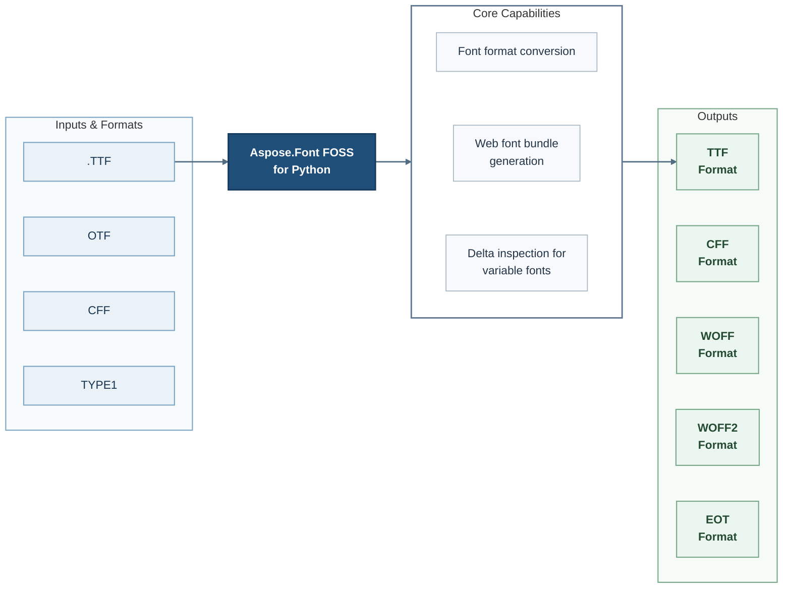

# Aspose.Font FOSS for Python

[](https://github.com/aspose-font-foss/Aspose.Font-FOSS-for-Python/tree/800ea256fec1eec387cba1fc599530cd402ef515)   [](LICENSE.txt) [](https://github.com/aspose-font-foss/Aspose.Font-FOSS-for-Python/graphs/contributors)


Aspose.Font FOSS for Python is a pure-Python font automation library for developers using Python. It reads desktop and web font formats, converts between them, generates web font bundles with coverage diagnostics, and inspects variable-font deltas and compatibility.

## Navigation

- [At a Glance](#at-a-glance)
- [Key Capabilities](#key-capabilities)
- [Installation](#installation)
- [Quick Start](#quick-start)
- [Additional Examples](#additional-examples)
- [API Reference](#api-reference)
- [Documentation and Resources](#documentation-and-resources)
- [Scope and Limitations](#scope-and-limitations)
- [Development and Testing](#development-and-testing)
- [Security](#security)
- [License](#license)

## At a Glance



## Key Capabilities

- **Work with Font format conversion** - Produce supported output through the public `Font` API.
- **Work with Web font bundle generation** - Use the public `WebFontBundle` and `Font` APIs in application workflows.
- **Work with Delta inspection for variable fonts** - Work directly with the public object model through the public `Font` API.

## Installation

Install the package directly from its source repository:

```bash
git clone https://github.com/aspose-font-foss/Aspose.Font-FOSS-for-Python.git
cd Aspose.Font-FOSS-for-Python
git checkout --detach 800ea256fec1eec387cba1fc599530cd402ef515
python -m pip install .
```

Use source installation for the `aspose-font` distribution.

Install optional dependencies by scenario:

- Installing the `dev` extra: `python -m pip install ".[dev]"`
- Installing the `mcp` extra: `python -m pip install ".[mcp]"`

## Quick Start

```python
from aspose_font import FontLoader

font = FontLoader.open('Roboto-VariableFont_wdth,wght.ttf')
```

## Additional Examples

Expand this section to view examples for exploring the FontLoader and WebFontBuilder APIs, variable Instance Review, axis Grid Proof, and variable Font Discovery, plus 2 more workflows.

<details>
<summary>View additional examples and results</summary>

### Explore the FontLoader and WebFontBuilder APIs

```python
from aspose_font import FontLoader, WebFontBuilder

font = FontLoader.open("Roboto-VariableFont_wdth,wght.ttf")
bundle = WebFontBuilder.build(
    font,
    presets=("latin",),
    text="Aspose Web",
    variable_mode="auto",
    include_woff=False,
)
bundle.write_to("web-out")

print(bundle.manifest["export_mode"])
print(bundle.manifest["subset"]["coverage"]["covered_count"])
```

### Explore the FontLoader and FontQaReporter APIs

```python
from aspose_font import FontLoader, FontQaReporter

font = FontLoader.open("Roboto-VariableFont_wdth,wght.ttf")
package = FontQaReporter.build_package(
    font,
    "qa-package",
    presets=("latin",),
    text="Aspose QA",
    preview_instance_name="Bold",
)

print(package.json_path)
print(package.html_path)
print(package.preview_path)
```

### Explore the FontLoader APIs

```python
from aspose_font import FontLoader

font = FontLoader.open("Roboto-VariableFont_wdth,wght.ttf")
instance = font.instantiate(
    {"wght": "Bold", "wdth": "Condensed"},
    naming_strategy="ribbi-safe",
    family_suffix="Beta",
    stat_policy="static",
)
instance.save("roboto-beta-bold.ttf")
```

### Variable Instance Review

```python
from aspose_font import FontLoader

font = FontLoader.open("Roboto-VariableFont_wdth,wght.ttf")
board = font.smart_instancer.build_family_review_board(
    ["Bold", "Condensed Bold"],
    include_default=True,
    text="Aspose Variable",
    family_name="Roboto Review",
)
board.write_to("roboto-family-review-board.png")
```

### Axis Grid Proof

```python
from aspose_font import FontLoader

font = FontLoader.open("Roboto-VariableFont_wdth,wght.ttf")
grid = font.smart_instancer.build_axis_grid_sheet(
    "wght",
    secondary_axis_tag="wdth",
    use_axis_presets=True,
    use_secondary_axis_presets=True,
    text="Aspose Grid",
    size=48,
    file_stem="roboto-axis-grid",
)
grid.write_to("roboto-axis-grid.png")
```

### Variable Font Discovery

```python
from aspose_font import FontLoader

font = FontLoader.open("Roboto-VariableFont_wdth,wght.ttf")
print(font.is_variable)
print([axis.tag for axis in font.axes])
print(len(font.named_instances))
print(font.get_axis("wght").get_preset("Bold").value)
print(font.smart_instancer.resolve({"wght": "Bold", "wdth": "Condensed"}).label)
print(font.smart_instancer.suggest_axis_values("wght", include_bounds=True))
print(font.get_axis("wght").name(("fr-CA", "en")))
print(font.get_axis("wght").range_summary)
print(font.get_named_instance("Condensed Bold").format_coordinates(font.variable_axes, include_tags=True))
print(font.get_axis("wght").localized_labels(("pt-PT", "fr-CA")))
print(font.variable_presentation(preferred_languages=("en",))["axes"][0]["range_summary"])
print(font.variable_presentation(preferred_languages=("fr-CA", "en"))["axes"][0]["language_profiles"][0])
```

</details>

## API Reference

The package documents 163 public types across 14 namespaces. Package namespaces include `aspose_font`, `aspose_font.cff`, `aspose_font.eot`, `aspose_font.ttf`, `aspose_font.ttf.tables`, `aspose_font.type1`, `aspose_font.woff`. See the complete API reference under Documentation and Resources for members, signatures, and inherited APIs.

<details>
<summary>View public API by namespace</summary>

### Aspose.Font Namespace (`aspose_font`)

| Type | Description |
| --- | --- |
| `ActiveTupleSummary` | Represents an Active Tuple Summary in the public Aspose.Font API. Supports serializing values to a dictionary. |
| `AnimationAsset` | Represents an Animation Asset in the public Aspose.Font API. |
| `AnimationFramePackage` | Represents an Animation Frame Package in the public Aspose.Font API. |
| `AnimationPreset` | Represents an Animation Preset in the public Aspose.Font API. |
| `AnimationPreviewBuilder` | Builds Animation Preview through the Aspose.Font API. Supports availabling presets, building axis sweep, and building axis sweep package. |
| `AnimationReviewPackage` | Represents an Animation Review Package in the public Aspose.Font API. |
| `AnimationShowcasePackage` | Represents an Animation Showcase Package in the public Aspose.Font API. |
| `AnimationStep` | Represents an Animation Step in the public Aspose.Font API. |
| `AxisRecord` | Represents an Axis Record in the public Aspose.Font API. |
| `CffFont(data, top_dict, private_dict, charset, encoding, charstrings, global_subrs, local_subrs, string_index)` | Represents a CFF font through the Aspose.Font API. Supports retrieving kern pairs, converting content to bytes, and saving document output. Inherits from `Font`. |
| `ClosePath` | Represents a Close path through the Aspose.Font API. Inherits from `PathCommand`. |
| `CompatibilityChecker` | Represents a Compatibility Checker in the public Aspose.Font API. Supports comparing fonts and comparing variable instances. |
| `CompatibilityReport` | Represents a Compatibility Report in the public Aspose.Font API. Supports serializing values to a dictionary, converting content to JSON, and writing JSON. |
| `CompositeComponentMovement` | Represents a Composite Component Movement in the public Aspose.Font API. Supports serializing values to a dictionary. |
| `CompositeGlyphComponent` | Represents a Composite Glyph Component in the public Aspose.Font API. Supports serializing values to a dictionary. |
| `CoverageGroup` | Represents a Coverage Group in the public Aspose.Font API. Supports summarying dict and serializing values to a dictionary. |
| `CurveTo` | Represents a Curve To in the public Aspose.Font API. Inherits from `PathCommand`. |
| `DeltaInspector` | Represents a Delta Inspector in the public Aspose.Font API. Supports building delta comparison sheet, building delta sheet, and building delta text comparison sheet. |
| `DeltaPoint` | Represents a Delta Point in the public Aspose.Font API. Supports serializing values to a dictionary. |
| `DeltaTupleReport` | Represents a Delta Tuple Report in the public Aspose.Font API. Supports serializing values to a dictionary. |
| `EotFont(inner, eot_version, flags, charset, italic, weight, fs_type)` | Represents an EOT font through the Aspose.Font API. Supports retrieving kern pairs, converting content to bytes, and saving document output. Inherits from `Font`. |
| `FamilyReviewExportPackage` | Represents a Family Review Export Package in the public Aspose.Font API. |
| `Font` | Represents a font font through the Aspose.Font API. Supports retrieving kern pairs, saving document output, and saving to format. Inherits from `ABC`. |
| `FontCleaner` | Represents a Font Cleaner in the public Aspose.Font API. Supports cleaning for web. |
| `FontConversionException` | Signals a font conversion condition; derives from `FontException`. |
| `FontEncoding` | Represents a Font Encoding in the public Aspose.Font API. Supports retrieving all codepoints and unicoding to gid. Inherits from `ABC`. |
| `FontException` | Signals a font condition; derives from `Exception`. |
| `FontLoader` | Represents a Font Loader in the public Aspose.Font API. Supports loading content and opening content. |
| `FontMetrics` | Represents a Font Metrics in the public Aspose.Font API. |
| `FontNotSupportedException` | Signals a font not supported condition; derives from `FontException`. |
| `FontParseException(message, offset=-1, format_name='')` | Signals a font parse condition; derives from `FontException`. |
| `FontPreviewBuilder` | Builds Font Preview through the Aspose.Font API. Supports building output, composing difference preview, and composing overlay preview. |
| `FontQaPackage` | Represents a Font Qa Package in the public Aspose.Font API. |
| `FontQaReport` | Represents a Font Qa Report in the public Aspose.Font API. Supports serializing values to a dictionary, converting content to JSON, and writing HTML. |
| `FontQaReporter` | Represents a Font Qa Reporter in the public Aspose.Font API. Supports building output and building package. |
| `FontSourceInfo` | Represents a Font Source Info in the public Aspose.Font API. |
| `FontSubsetter` | Represents a Font Subsetter in the public Aspose.Font API. Supports analyzing coverage, analyzing web coverage, and availabling presets. |
| `FontType` | Represents a Font Type in the public Aspose.Font API. Inherits from `enum.Enum`. |
| `FvarTable` | Represents a Fvar Table in the public Aspose.Font API. Supports loading content from reader and converting content to bytes. |
| `Glyph` | Represents a Glyph in the public Aspose.Font API. |
| `GlyphAccessor(encoding)` | Represents a Glyph Accessor in the public Aspose.Font API. Supports retrieving all glyph ids, retrieving glyph by id, and retrieving glyph by unicode. Inherits from `ABC`. |
| `GlyphCompatibilityIssue` | Represents a Glyph Compatibility Issue in the public Aspose.Font API. Supports serializing values to a dictionary. |
| `GlyphDeltaComparisonReport` | Represents a Glyph Delta Comparison Report in the public Aspose.Font API. Supports serializing values to a dictionary. |
| `GlyphDeltaReport` | Represents a Glyph Delta Report in the public Aspose.Font API. Supports serializing values to a dictionary. |
| `GlyphId` | Represents a Glyph Id in the public Aspose.Font API. |
| `GlyphInterpolationIssue` | Represents a Glyph Interpolation Issue in the public Aspose.Font API. Supports serializing values to a dictionary. |
| `GlyphLayout` | Represents a Glyph Layout in the public Aspose.Font API. |
| `GlyphNotFoundException(glyph_id)` | Signals a glyph not found condition; derives from `FontException`. |
| `SmartInstancer(font)` | Represents a Smart Instancer in the public Aspose.Font API. Supports building axis grid previews, building axis grid sheet, and building axis grid web bundles. |
| `WebFontBuilder` | Builds Web Font through the Aspose.Font API. Supports building output, building family matrix preview, and building family package. |
| `VariableAxis` | Represents a Variable Axis in the public Aspose.Font API. Supports cssing variation setting, retrieving preset, and languaging profiles. |
| `StatNamingDiagnostics` | Represents a Stat Naming Diagnostics in the public Aspose.Font API. Supports serializing values to a dictionary. |
| `TtfFont(sfnt_data, tables, sfnt_version)` | Represents a TTF font through the Aspose.Font API. Supports availabling naming strategies, retrieving axis, and retrieving kern pairs. Inherits from `Font`. |
| `VariableInstance` | Represents a Variable Instance in the public Aspose.Font API. Supports cssing variation settings, formating coordinates, and languaging profiles. |
| `NamingPolicyPreview` | Represents a Naming Policy Preview in the public Aspose.Font API. Supports serializing values to a dictionary. |
| `GlyphOutlineStats` | Represents a Glyph Outline Stats in the public Aspose.Font API. Supports serializing values to a dictionary. |
| `TextDeltaComparisonReport` | Represents a Text Delta Comparison Report in the public Aspose.Font API. Supports serializing values to a dictionary. |
| `WebFontBundle` | Represents a Web Font Bundle in the public Aspose.Font API. |
| `Woff2Font(inner, metadata_xml='')` | Represents a WOFF2 font through the Aspose.Font API. Supports retrieving kern pairs, converting content to bytes, and saving document output. Inherits from `Font`. |
| `WoffFont(inner, metadata_xml='')` | Represents a WOFF font through the Aspose.Font API. Supports retrieving kern pairs, converting content to bytes, and saving document output. Inherits from `Font`. |
| `SubsetCoverage` | Represents a Subset Coverage in the public Aspose.Font API. Supports summarying dict and serializing values to a dictionary. |
| `Type1Font(raw_data, font_data, is_pfa=False)` | Represents a TYPE1 font through the Aspose.Font API. Supports retrieving kern pairs, loading afm, and converting content to bytes. Inherits from `Font`. |
| `LocalizationCoverage` | Represents a Localization Coverage in the public Aspose.Font API. Supports serializing values to a dictionary. |
| `PlatformNamingDiagnostics` | Represents a Platform Naming Diagnostics in the public Aspose.Font API. Supports serializing values to a dictionary. |
| `WebFontFamilyPackage` | Represents a Web Font Family Package in the public Aspose.Font API. |
| `TextDeltaReport` | Represents a Text Delta Report in the public Aspose.Font API. Supports serializing values to a dictionary. |
| `LoadedFont` | Represents a Loaded font through the Aspose.Font API. |
| `LocalizationResolution` | Represents a Localization Resolution in the public Aspose.Font API. Supports serializing values to a dictionary. |
| `WebFontOptimizerPackage` | Represents a Web Font Optimizer Package in the public Aspose.Font API. |
| `LanguageProfile` | Represents a Language Profile in the public Aspose.Font API. Supports serializing values to a dictionary. |
| `RequestedLanguageHint` | Represents a Requested Language Hint in the public Aspose.Font API. Supports serializing values to a dictionary. |
| `TextRenderer` | Renders Text content through the Aspose.Font API. Supports layouting glyphs, rendering PNG, and rendering rgb. |
| `PreviewImage` | Represents a Preview Image in the public Aspose.Font API. |
| `QuadraticTo` | Represents a Quadratic To in the public Aspose.Font API. Inherits from `PathCommand`. |
| `ResolvedInstance` | Represents a Resolved Instance in the public Aspose.Font API. |
| `TextLayout` | Represents a Text Layout in the public Aspose.Font API. |
| `TupleScalarDelta` | Represents a Tuple Scalar Delta in the public Aspose.Font API. Supports serializing values to a dictionary. |
| `VariableAxisPreset` | Represents a Variable Axis Preset in the public Aspose.Font API. Supports converting content to presentation. |
| `KernPair` | Represents a Kern Pair in the public Aspose.Font API. |
| `NamedInstance` | Represents a Named Instance in the public Aspose.Font API. |
| `Rasterizer(width, height, background=(255, 255, 255))` | Represents a Rasterizer in the public Aspose.Font API. Supports clearing content, drawing path, and encoding page content as PNG. |
| `WebFontAsset` | Represents a Web Font Asset in the public Aspose.Font API. |
| `GlyphPath(commands=None)` | Represents a Glyph path through the Aspose.Font API. Supports appending content. |
| `LineTo` | Represents a Line To in the public Aspose.Font API. Inherits from `PathCommand`. |
| `MoveTo` | Represents a Move To in the public Aspose.Font API. Inherits from `PathCommand`. |
| `SubsetResult` | Stores Subset result data through the Aspose.Font API. |
| `WebFontOptimizer` | Represents a Web Font Optimizer in the public Aspose.Font API. Supports building output. |
| `PathCommand` | Represents a Path command through the Aspose.Font API. |
| `SUBSET_PRESETS` | Defines the `SUBSET_PRESETS` public constant. |
| `UnsupportedFontFormatException` | Signals an unsupported font format condition; derives from `FontException`. |

### Aspose.Font.Animation Namespace (`aspose_font.animation`)

| Type | Description |
| --- | --- |
| `AnimationAsset` | The `aspose_font.animation` namespace re-exports `AnimationAsset` from the primary `aspose_font` namespace. |
| `AnimationFramePackage` | The `aspose_font.animation` namespace re-exports `AnimationFramePackage` from the primary `aspose_font` namespace. |
| `AnimationPreset` | The `aspose_font.animation` namespace re-exports `AnimationPreset` from the primary `aspose_font` namespace. |
| `AnimationPreviewBuilder` | The `aspose_font.animation` namespace re-exports `AnimationPreviewBuilder` from the primary `aspose_font` namespace. |
| `AnimationReviewPackage` | The `aspose_font.animation` namespace re-exports `AnimationReviewPackage` from the primary `aspose_font` namespace. |
| `AnimationShowcasePackage` | The `aspose_font.animation` namespace re-exports `AnimationShowcasePackage` from the primary `aspose_font` namespace. |
| `AnimationStep` | The `aspose_font.animation` namespace re-exports `AnimationStep` from the primary `aspose_font` namespace. |

### Aspose.Font.CFF Namespace (`aspose_font.cff`)

| Type | Description |
| --- | --- |
| `CffCharset` | Represents a CFF Charset in the public CFF API for Aspose.Font. Supports loading content from reader. |
| `CffDict` | Represents a CFF Dict in the public CFF API for Aspose.Font. Supports loading content from bytes and converting content to bytes. |
| `CffEncoding` | Represents a CFF Encoding in the public CFF API for Aspose.Font. Supports loading content from reader, retrieving all codepoints, and unicoding to gid. Inherits from `FontEncoding`. |
| `CffFont(data, top_dict, private_dict, charset, encoding, charstrings, global_subrs, local_subrs, string_index)` | The `aspose_font.cff` namespace re-exports `CffFont` from the primary `aspose_font` namespace. |
| `CffIndex(items)` | Represents a CFF Index in the public CFF API for Aspose.Font. Supports loading content from reader and converting content to bytes. |
| `PrivateDict` | Represents a Private Dict in the public CFF API for Aspose.Font. Supports loading content from dict. |
| `TopDict` | Represents a Top Dict in the public CFF API for Aspose.Font. Supports loading content from dict. |
| `Type2Interpreter(global_subrs, local_subrs, default_width_x, nominal_width_x)` | Represents a Type2 Interpreter in the public CFF API for Aspose.Font. |

### Aspose.Font.Compatibility Namespace (`aspose_font.compatibility`)

| Type | Description |
| --- | --- |
| `ActiveTupleSummary` | The `aspose_font.compatibility` namespace re-exports `ActiveTupleSummary` from the primary `aspose_font` namespace. |
| `CompatibilityChecker` | The `aspose_font.compatibility` namespace re-exports `CompatibilityChecker` from the primary `aspose_font` namespace. |
| `CompatibilityReport` | The `aspose_font.compatibility` namespace re-exports `CompatibilityReport` from the primary `aspose_font` namespace. |
| `GlyphCompatibilityIssue` | The `aspose_font.compatibility` namespace re-exports `GlyphCompatibilityIssue` from the primary `aspose_font` namespace. |
| `GlyphInterpolationIssue` | The `aspose_font.compatibility` namespace re-exports `GlyphInterpolationIssue` from the primary `aspose_font` namespace. |
| `GlyphOutlineStats` | The `aspose_font.compatibility` namespace re-exports `GlyphOutlineStats` from the primary `aspose_font` namespace. |
| `TupleScalarDelta` | The `aspose_font.compatibility` namespace re-exports `TupleScalarDelta` from the primary `aspose_font` namespace. |

### Aspose.Font.Converter Namespace (`aspose_font.converter`)

| Type | Description |
| --- | --- |
| `CurveAdapter` | Represents a Curve Adapter in the public converter API for Aspose.Font. Supports converting path cubic to quad, converting path quad to cubic, and cubicing to quads. |
| `FontConverter` | Converts Font content through the Aspose.Font API. |

### Aspose.Font.Delta Namespace (`aspose_font.delta`)

| Type | Description |
| --- | --- |
| `DeltaInspector` | The `aspose_font.delta` namespace re-exports `DeltaInspector` from the primary `aspose_font` namespace. |
| `DeltaPoint` | The `aspose_font.delta` namespace re-exports `DeltaPoint` from the primary `aspose_font` namespace. |
| `DeltaTupleReport` | The `aspose_font.delta` namespace re-exports `DeltaTupleReport` from the primary `aspose_font` namespace. |
| `GlyphDeltaComparisonReport` | The `aspose_font.delta` namespace re-exports `GlyphDeltaComparisonReport` from the primary `aspose_font` namespace. |
| `GlyphDeltaReport` | The `aspose_font.delta` namespace re-exports `GlyphDeltaReport` from the primary `aspose_font` namespace. |
| `TextDeltaComparisonReport` | The `aspose_font.delta` namespace re-exports `TextDeltaComparisonReport` from the primary `aspose_font` namespace. |
| `TextDeltaReport` | The `aspose_font.delta` namespace re-exports `TextDeltaReport` from the primary `aspose_font` namespace. |

### Aspose.Font.EOT Namespace (`aspose_font.eot`)

| Type | Description |
| --- | --- |
| `EotFont(inner, eot_version, flags, charset, italic, weight, fs_type)` | The `aspose_font.eot` namespace re-exports `EotFont` from the primary `aspose_font` namespace. |

### Aspose.Font.Preview Namespace (`aspose_font.preview`)

| Type | Description |
| --- | --- |
| `FontPreviewBuilder` | The `aspose_font.preview` namespace re-exports `FontPreviewBuilder` from the primary `aspose_font` namespace. |
| `PreviewImage` | The `aspose_font.preview` namespace re-exports `PreviewImage` from the primary `aspose_font` namespace. |

### Aspose.Font.Qa Namespace (`aspose_font.qa`)

| Type | Description |
| --- | --- |
| `FontQaPackage` | The `aspose_font.qa` namespace re-exports `FontQaPackage` from the primary `aspose_font` namespace. |
| `FontQaReport` | The `aspose_font.qa` namespace re-exports `FontQaReport` from the primary `aspose_font` namespace. |
| `FontQaReporter` | The `aspose_font.qa` namespace re-exports `FontQaReporter` from the primary `aspose_font` namespace. |

### Aspose.Font.TTF Namespace (`aspose_font.ttf`)

| Type | Description |
| --- | --- |
| `TtfFont(sfnt_data, tables, sfnt_version)` | The `aspose_font.ttf` namespace re-exports `TtfFont` from the primary `aspose_font` namespace. |
| `TtfTableSet` | Represents a TTF Table Set in the public TTF API for Aspose.Font. Supports retrieving raw and setting raw. |

### Aspose.Font.TYPE1 Namespace (`aspose_font.type1`)

| Type | Description |
| --- | --- |
| `AfmData` | Represents an Afm Data in the public TYPE1 API for Aspose.Font. |
| `AfmGlyphMetric` | Represents an Afm Glyph Metric in the public TYPE1 API for Aspose.Font. |
| `PFB_ASCII` | Defines the `PFB_ASCII` public constant. |
| `PFB_BINARY` | Defines the `PFB_BINARY` public constant. |
| `PFB_EOF` | Defines the `PFB_EOF` public constant. |
| `PfbSegment` | Represents a Pfb Segment in the public TYPE1 API for Aspose.Font. |
| `Type1Font(raw_data, font_data, is_pfa=False)` | The `aspose_font.type1` namespace re-exports `Type1Font` from the primary `aspose_font` namespace. |
| `Type1FontData` | Represents a TYPE1 Font Data in the public TYPE1 API for Aspose.Font. |
| `Type1Interpreter(subrs, len_iv=4)` | Represents a TYPE1 Interpreter in the public TYPE1 API for Aspose.Font. |

### Aspose.Font.Web Namespace (`aspose_font.web`)

| Type | Description |
| --- | --- |
| `WebFontAsset` | The `aspose_font.web` namespace re-exports `WebFontAsset` from the primary `aspose_font` namespace. |
| `WebFontBuilder` | The `aspose_font.web` namespace re-exports `WebFontBuilder` from the primary `aspose_font` namespace. |
| `WebFontBundle` | The `aspose_font.web` namespace re-exports `WebFontBundle` from the primary `aspose_font` namespace. |
| `WebFontFamilyPackage` | The `aspose_font.web` namespace re-exports `WebFontFamilyPackage` from the primary `aspose_font` namespace. |
| `WebFontOptimizer` | The `aspose_font.web` namespace re-exports `WebFontOptimizer` from the primary `aspose_font` namespace. |
| `WebFontOptimizerPackage` | The `aspose_font.web` namespace re-exports `WebFontOptimizerPackage` from the primary `aspose_font` namespace. |

### Aspose.Font.WOFF Namespace (`aspose_font.woff`)

| Type | Description |
| --- | --- |
| `Woff2Font(inner, metadata_xml='')` | The `aspose_font.woff` namespace re-exports `Woff2Font` from the primary `aspose_font` namespace. |
| `WoffFont(inner, metadata_xml='')` | The `aspose_font.woff` namespace re-exports `WoffFont` from the primary `aspose_font` namespace. |

### Aspose.Font.TTF.Tables Namespace (`aspose_font.ttf.tables`)

| Type | Description |
| --- | --- |
| `AxisRecord` | The `aspose_font.ttf.tables` namespace re-exports `AxisRecord` from the primary `aspose_font` namespace. |
| `CmapTable` | Represents a CMap Table in the public tables API for Aspose.Font. Supports besting subtable, loading content from reader, and converting content to bytes. |
| `FvarTable` | The `aspose_font.ttf.tables` namespace re-exports `FvarTable` from the primary `aspose_font` namespace. |
| `GlyfTable` | Represents a Glyf Table in the public tables API for Aspose.Font. Supports loading content from reader, retrieving glyph bytes, and converting content to bytes. |
| `HMetric` | Represents an H Metric in the public tables API for Aspose.Font. |
| `HeadTable` | Represents a Head Table in the public tables API for Aspose.Font. Supports loading content from reader and converting content to bytes. |
| `HheaTable` | Represents a Hhea Table in the public tables API for Aspose.Font. Supports loading content from reader and converting content to bytes. |
| `HmtxTable` | Represents a Hmtx Table in the public tables API for Aspose.Font. Supports loading content from reader, retrieving metric, and converting content to bytes. |
| `HvarTable` | Represents a Hvar Table in the public tables API for Aspose.Font. Supports advancing width delta and loading content from reader. |
| `KernTable` | Represents a Kern Table in the public tables API for Aspose.Font. Supports building lookup, loading content from reader, and converting content to bytes. |
| `LocaTable` | Represents a Loca Table in the public tables API for Aspose.Font. Supports loading content from reader, glyphing length, and glyphing offset. |
| `MaxpTable` | Represents a Maxp Table in the public tables API for Aspose.Font. Supports loading content from reader and converting content to bytes. |
| `NameTable` | Represents a Name Table in the public tables API for Aspose.Font. Supports besting name, ensuring english platform names, and ensuring name record. |
| `NamedInstance` | The `aspose_font.ttf.tables` namespace re-exports `NamedInstance` from the primary `aspose_font` namespace. |
| `Os2Table` | Represents an Os2 Table in the public tables API for Aspose.Font. Supports loading content from reader and converting content to bytes. |
| `PostTable` | Represents a Post Table in the public tables API for Aspose.Font. Supports loading content from reader, glyphing name, and converting content to bytes. |
| `TtfTableSet` | The `aspose_font.ttf.tables` namespace re-exports `TtfTableSet` from the primary `aspose_font.ttf` namespace. |

</details>

## Documentation and Resources

- **[Getting started guide](https://docs.aspose.org/font/python/)** - installation, walkthroughs, and feature guides for this library.
- **[Full API reference](https://reference.aspose.org/font/python/)** - the complete browsable reference for the public API.
- Found a bug or have a feature request? [Open an issue](https://github.com/aspose-font-foss/Aspose.Font-FOSS-for-Python/issues) on GitHub.

## Scope and Limitations

The library targets the workflows listed above; embedded-font support has documented boundaries. Ten specific constraints are listed below.

- To_bytes not implemented for.
- BinaryReader requires a binary stream, got text stream.
- Animation paths require at least two steps.
- Animation sweeps require a variable TTF font.
- Animation paths require at least 2 frames per segment.
- Animation requires at least 2 frames.
- --chars require exactly one character.
- Preview-batches require a --all-named or at least one --instance-name.
- Preview-waterfalls require --all-named, --include-default, and or at least one --instance-name entries.
- Preview-matrixes require --all-named, --include-default, and or at least one --instance-name entries.

The package manifest classifies this release as **Beta**.

This repository contains [Aspose.Font FOSS for Python](https://products.aspose.org/font/python/). For requirements beyond the FOSS scope described above, explore the [full-featured Aspose.Font Enterprise Edition](https://products.aspose.com/font/). It is a separate product, so features and APIs may differ.

## Development and Testing

The repository includes 29 test files, 2 declared Make targets.

### Tests

- [`tests/conftest.py`](tests/conftest.py)
- [`tests/test_animation.py`](tests/test_animation.py)
- [`tests/test_cff.py`](tests/test_cff.py)
- [`tests/test_cff_glyphs.py`](tests/test_cff_glyphs.py)
- [`tests/test_cleaner.py`](tests/test_cleaner.py)
- [`tests/test_cli.py`](tests/test_cli.py)
- [`tests/test_compatibility.py`](tests/test_compatibility.py)
- [`tests/test_converter.py`](tests/test_converter.py)
- [Browse all test files](tests)

### Repository Make Targets

```bash
make test
```

```bash
make build
```

### Focused Commands and Repository Scripts

```bash
python -m pip install -e .
```

```bash
python -m pytest tests
```

## Security

Follow the repository's [`SECURITY.md`](SECURITY.md) policy.

## License

This project is available under the [MIT License](LICENSE.txt). It permits use, modification, distribution, and commercial use when the license and copyright notice are retained.
