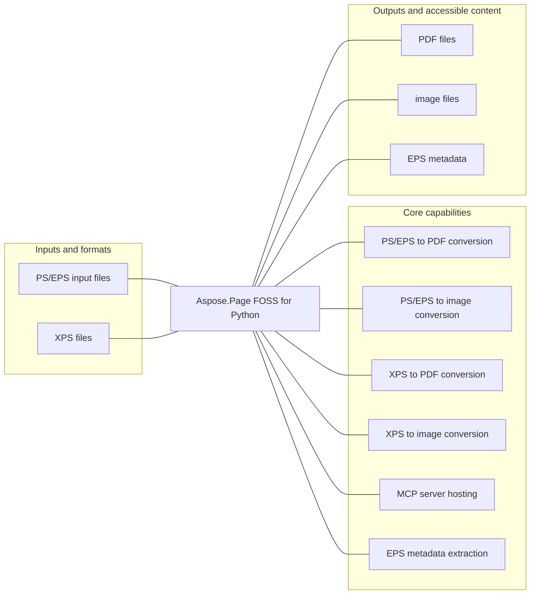

# Aspose.Page FOSS for Python

[](https://github.com/aspose-page-foss/Aspose.Page-FOSS-for-Python/tree/dac5d70e0f91949a780f2e98dfbb12314a5fbc70)   [](LICENSE.txt) [](https://github.com/aspose-page-foss/Aspose.Page-FOSS-for-Python/graphs/contributors)

Aspose.Page FOSS for Python provides PS/EPS to PDF conversion for developers using Python. Its verified scope also includes PS/EPS to image conversion, XPS to PDF conversion, XPS to image conversion, MCP server hosting, and EPS metadata extraction.

## Navigation

- [At a glance](#at-a-glance)
- [Key capabilities](#key-capabilities)
- [Installation](#installation)
- [Quick start](#quick-start)
- [Additional examples](#additional-examples)
- [API reference](#api-reference)
- [Scope and limitations](#scope-and-limitations)
- [Development and testing](#development-and-testing)
- [License](#license)

## At a glance



## Key capabilities

- PS/EPS to PDF conversion.
- PS/EPS to image conversion.
- XPS to PDF conversion.
- XPS to image conversion.
- MCP server hosting.
- EPS metadata extraction.

## Installation

Install the verified immutable repository revision from a local checkout:

```bash
git clone https://github.com/aspose-page-foss/Aspose.Page-FOSS-for-Python.git
cd Aspose.Page-FOSS-for-Python
git checkout --detach dac5d70e0f91949a780f2e98dfbb12314a5fbc70
python -m pip install .
```

`aspose-page-foss` was installed and exercised from this exact source revision in an isolated, network-disabled verification environment. The matching PyPI receipt did not find a published package, so this README does not present a PyPI package installation command.

Optional dependency groups declared in `pyproject.toml`:
- `test`: `python -m pip install ".[test]"`

- image conversion: `python -m pip install Pillow`
- MCP server hosting: `python -m pip install fastmcp`
- image conversion: `python -m pip install skia-python`

## Quick start

### Minimal verified example

- Before running the example, provide `input.ps`; verification used the repository fixture `testdata/ps/integration/minimal.ps`.

```python
from aspose.page.ps.document import PsDocument

ps = PsDocument.from_file("input.ps")
output_pdf = ps.to_pdf()

with open("output.pdf", "wb") as f:
    f.write(output_pdf)
```

## Additional examples

These additional workflows were syntax-checked and matched to the repository's static public API. They were not executed by the evidence collector.

<details>
<summary>View additional examples and results</summary>

### Convert EPS to PNG

```python
from aspose.page.ps.document import PsDocument
from aspose.page.ps.output import ImageSaveOptions

eps = PsDocument.from_file("input.eps")
output_png = eps.to_image(ImageSaveOptions(format="png", dpi=150))

with open("output.png", "wb") as f:
    f.write(output_png)
```

### Convert XPS to PDF

```python
from aspose.page.xps.document import XpsDocument

xps = XpsDocument.from_file("input.xps")
output_pdf = xps.to_pdf()

with open("output.pdf", "wb") as f:
    f.write(output_pdf)
```

### Convert XPS to JPEG

```python
from aspose.page.ps.output import ImageSaveOptions
from aspose.page.xps.document import XpsDocument

xps = XpsDocument.from_file("input.xps")
output_jpeg = xps.to_image(ImageSaveOptions(format="jpeg", dpi=150))

with open("output.jpg", "wb") as f:
    f.write(output_jpeg)
```

### Example results


</details>

## API reference

The package declares 10 public exports in its static `__all__` surface.

<details>
<summary>View MCP and public API details</summary>

### MCP server

The repository registers these MCP tools:

- `eps_metadata`
- `ps_to_image`
- `ps_to_pdf`
- `xps_to_image`
- `xps_to_pdf`

```python
from aspose.page.mcp import create_server

server = create_server()
server.run(host="127.0.0.1", port=8000)
```

The server imports FastMCP from the separately supplied `fastmcp` package.

### `aspose.page.mcp`

- `create_server`
- `run`

### `aspose.page.pdf`

- `PdfMetadata`
- `ImageResource`
- `PdfWriter`

### `aspose.page.ps`

- `PsDocument`
- `PdfSaveOptions`
- `ImageSaveOptions`
- `convert_image_to_eps`

### `aspose.page.xps`

- `XpsDocument`

### `PdfMetadata` members

- `title: str`
- `creator: str`
- `producer: str`
- `creation_date: str`
- `mod_date: str`
- `trapped: bool`

### `ImageResource` members

- `data: bytes`
- `width: int`
- `height: int`
- `color_space: str`
- `bits_per_component: int`
- `filter: str | None`
- `filter_params: dict | None`
- `decode: tuple[float, ...] | None`
- `mask: bool`
- `mask_polarity: bool`
- `soft_mask: bytes | None`

### `PdfWriter` members

- `write(document) -> bytes`

### `PsDocument` members

- `data: bytes`
- `is_eps: bool`
- `dsc: DscMetadata | None`
- `source_path: str | None`
- `pages: list[PsPage]`
- `prolog: list[str]`
- `trailer: list[str]`
- `header: str | None`
- `dirty: bool`
- `create(is_eps=False, page_size=(612.0, 792.0)) -> 'PsDocument'`
- `from_bytes(data) -> 'PsDocument'`
- `from_file(path) -> 'PsDocument'`
- `add_page(size=None) -> PsPage`
- `insert_page(index, size=None) -> PsPage`
- `remove_page(index) -> None`
- `get_page(index) -> PsPage`
- `save(path=None) -> bytes`
- `as_bytes() -> bytes`
- `get_xmp() -> str | None`
- `set_xmp(xmp_xml) -> None`
- `remove_xmp() -> None`
- `to_pdf(options=None) -> bytes`
- `to_image(options) -> bytes`

### `PdfSaveOptions` members

- `no_compression: bool`
- `additional_fonts_folder: str | None`

### `ImageSaveOptions` members

- `format: str`
- `dpi: int`
- `raster_writer: RasterWriter | None`
- `additional_fonts_folder: str | None`
- `opaque_background: bool`
- `font_resolver: FontResolver | None`

### `XpsDocument` members

- `package: XpsPackage`
- `builder: XpsDocumentBuilder`
- `create(title=None) -> 'XpsDocument'`
- `from_bytes(data) -> 'XpsDocument'`
- `from_file(path) -> 'XpsDocument'`
- `add_page(width, height) -> XpsFixedPage`
- `insert_page(index, page) -> None`
- `remove_page(index) -> None`
- `save(path=None) -> bytes`
- `get_print_tickets() -> list['PrintTicket']`
- `set_print_ticket(scope, xml, page_index=None) -> None`
- `remove_print_ticket(scope, page_index=None) -> None`
- `to_pdf(options=None) -> bytes`
- `to_image(options) -> bytes`
- `to_images(options) -> list[bytes]`

</details>

## Scope and limitations

[Aspose.Page FOSS for Python](https://products.aspose.org/page/python/) and [Aspose.Page Enterprise Edition](https://products.aspose.com/page/python/) are separate products. This README documents the FOSS implementation; do not assume API or feature parity beyond verified behavior.

## Development and testing

The repository includes 66 test files, 4 declared Make targets, 1 source-bound validation command.

<details>
<summary>View development and testing resources</summary>

### Tests

- [`tests/common/compare_utils.py`](tests/common/compare_utils.py)
- [`tests/common/output_utils.py`](tests/common/output_utils.py)
- [`tests/common/pdf_validator.py`](tests/common/pdf_validator.py)
- [`tests/common/render_model_dump.py`](tests/common/render_model_dump.py)
- [`tests/common/test_utils.py`](tests/common/test_utils.py)
- [Browse all test files](tests)

### Repository Make targets

```bash
make sync
```

```bash
make test
```

```bash
make build
```

```bash
make check
```

### Focused commands and repository scripts

```bash
python -m unittest tests.mcp.test_handlers tests.mcp.test_server
```


</details>

## License

This project is available under the [MIT License](LICENSE.txt). It permits use, modification, distribution, and commercial use when the license and copyright notice are retained.
