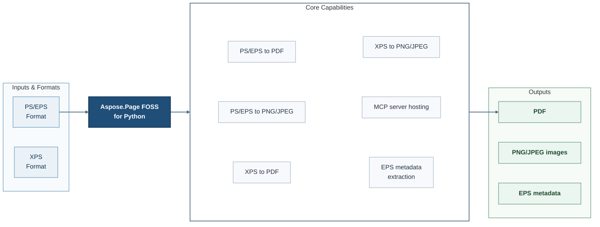

# Aspose.Page FOSS for Python

[](https://github.com/aspose-page-foss/Aspose.Page-FOSS-for-Python/tree/dac5d70e0f91949a780f2e98dfbb12314a5fbc70)   [](LICENSE.txt) [](https://github.com/aspose-page-foss/Aspose.Page-FOSS-for-Python/graphs/contributors)


Aspose.Page FOSS for Python is an open-source Python document conversion library for developers who need PostScript (PS), Encapsulated PostScript (EPS), and XPS conversion in backend services, automation pipelines, and document workflows.

It is designed for developers using Python.

## Navigation

- [At a Glance](#at-a-glance)
- [Key Capabilities](#key-capabilities)
- [Installation](#installation)
- [Quick Start](#quick-start)
- [Additional Examples](#additional-examples)
- [API Reference](#api-reference)
- [Documentation and Resources](#documentation-and-resources)
- [Scope and Limitations](#scope-and-limitations)
- [Development and Testing](#development-and-testing)
- [License](#license)

## At a Glance



## Key Capabilities

- **Convert PS/EPS files to PDF in Python** - Serialize the supported source content as PDF output. Available through the public `ps_to_pdf` API.
- **Convert PS/EPS files to PNG and JPEG in Python** - Render the supported source content as raster image data. Available through the public `PsImage` and `ps_to_image` APIs.
- **Convert XPS files to PDF in Python** - Serialize the supported source content as PDF output. Available through the public `xps_to_pdf` API.
- **Convert XPS files to PNG and JPEG in Python** - Render the supported source content as raster image data. Available through the public `XpsImage`, `xps_to_image`, and `PsImage` APIs.
- **Host MCP servers** - Create and run the MCP server through the public `create_server` and `run` APIs.
- **Extract EPS metadata** - Read EPS metadata through the public `eps_metadata` API.

## Installation

Install the package directly from its source repository:

```bash
git clone https://github.com/aspose-page-foss/Aspose.Page-FOSS-for-Python.git
cd Aspose.Page-FOSS-for-Python
git checkout --detach dac5d70e0f91949a780f2e98dfbb12314a5fbc70
python -m pip install .
```

Use source installation for the `aspose-page-foss` distribution.

Install optional dependencies by scenario:

- Image conversion (`ps_to_image`, `xps_to_image`): `python -m pip install skia-python Pillow`
- MCP server hosting: `python -m pip install fastmcp`
- Running the test suite: `python -m pip install ".[test]"`

## Quick Start

```python
from aspose.page.ps.document import PsDocument

ps = PsDocument.from_file("input.ps")
output_pdf = ps.to_pdf()

with open("output.pdf", "wb") as f:
    f.write(output_pdf)
```

## Additional Examples

Expand this section to view examples for converting EPS to PNG, converting XPS to PDF and JPEG, hosting the MCP server, and viewing generated example results.

<details>
<summary>View additional examples and results</summary>

### Convert EPS to PNG

```python
from aspose.page.ps.document import PsDocument
from aspose.page.ps.output import ImageSaveOptions

eps = PsDocument.from_file("input.eps")
output_png = eps.to_image(ImageSaveOptions(format="png", dpi=150))

with open("output.png", "wb") as f:
    f.write(output_png)
```

### Convert XPS to PDF

```python
from aspose.page.xps.document import XpsDocument

xps = XpsDocument.from_file("input.xps")
output_pdf = xps.to_pdf()

with open("output.pdf", "wb") as f:
    f.write(output_pdf)
```

### Convert XPS to JPEG

```python
from aspose.page.ps.output import ImageSaveOptions
from aspose.page.xps.document import XpsDocument

xps = XpsDocument.from_file("input.xps")
output_jpeg = xps.to_image(ImageSaveOptions(format="jpeg", dpi=150))

with open("output.jpg", "wb") as f:
    f.write(output_jpeg)
```

### Host the MCP Server

The MCP server exposes the `ps_to_pdf`, `ps_to_image`, `xps_to_pdf`, `xps_to_image`, and `eps_metadata` tools for integrating conversion workflows.

```python
from aspose.page.mcp import create_server

server = create_server()
server.run(host="127.0.0.1", port=8000)
```

### Example Results

An XPS document converted to PDF, rendered here as PNG:


A PS file converted to PDF, rendered here as PNG:


A PS/EPS to image conversion sample:


</details>

## API Reference

The package documents 7 public types across 3 namespaces. Package namespaces include `aspose.page.mcp`, `aspose.page.pdf`, `aspose.page.ps`, `aspose.page.xps`. See the complete API reference under Documentation and Resources for members, signatures, and inherited APIs.

<details>
<summary>View public API by namespace</summary>

### Aspose.Page.PDF Namespace (`aspose.page.pdf`)

| Type | Description |
| --- | --- |
| `ImageResource` | Stores Image resource data through the Aspose.Page API. |
| `PdfMetadata` | Stores PDF metadata through the Aspose.Page API. |
| `PdfWriter(metadata, no_compression=False, image_provider=None, font_provider=None)` | Writes PDF output through the Aspose.Page API. Supports writing output. |

### Aspose.Page.PS Namespace (`aspose.page.ps`)

| Type | Description |
| --- | --- |
| `ImageSaveOptions` | Configures Image output through the Aspose.Page API. |
| `PdfSaveOptions` | Configures PDF output through the Aspose.Page API. |
| `PsDocument` | Represents a PS document through the Aspose.Page API. Supports adding pages, serializing content to bytes, and creating document instances. |

### Aspose.Page.XPS Namespace (`aspose.page.xps`)

| Type | Description |
| --- | --- |
| `XpsDocument` | Represents an XPS document through the Aspose.Page API. Supports adding pages, creating document instances, and loading content from bytes. |

</details>

## Documentation and Resources

- **[Getting started guide](https://docs.aspose.org/page/python/)** - installation, walkthroughs, and feature guides for this library.
- **[How-to guides and FAQ](https://kb.aspose.org/page/python/)** - task-focused answers for common product questions.
- Found a bug or have a feature request? [Open an issue](https://github.com/aspose-page-foss/Aspose.Page-FOSS-for-Python/issues) on GitHub.

## Scope and Limitations

The library targets the conversion workflows listed above; function, embedded-font, and color-space support has documented boundaries. Ten specific constraints are listed below.

- Exponential functions require exactly one input.
- Stitching functions require exactly one input.
- Type0 embedded fonts require a CID descendant.
- Unsupported color space types are rejected.
- Unsupported device color spaces are rejected.
- Indexed color spaces require base, hival, and lookup entries.
- Separation color spaces require name, alternate, and tint entries.
- DeviceN color spaces require names, alternate, and tint entries.
- CIEBased color spaces require a dictionary.
- Unsupported color tuple lengths are rejected.

For requirements beyond the FOSS scope described above, explore the [full-featured Aspose.Page Enterprise Edition](https://products.aspose.com/page/). It is a separate product, so features and APIs may differ.

## Development and Testing

The repository includes 66 test files, 4 declared Make targets.

### Tests

- [`tests/common/compare_utils.py`](tests/common/compare_utils.py)
- [`tests/common/output_utils.py`](tests/common/output_utils.py)
- [`tests/common/pdf_validator.py`](tests/common/pdf_validator.py)
- [`tests/common/render_model_dump.py`](tests/common/render_model_dump.py)
- [`tests/common/test_utils.py`](tests/common/test_utils.py)
- [Browse all test files](tests)

### Repository Make Targets

```bash
make sync
```

```bash
make test
```

```bash
make build
```

```bash
make check
```

### Focused Commands and Repository Scripts

```bash
python -m unittest tests.mcp.test_handlers tests.mcp.test_server
```

```bash
python -m pip install -e .
```

```bash
python -m unittest discover -s tests -p "test_*.py"
```

## License

This project is available under the [MIT License](LICENSE.txt). It permits use, modification, distribution, and commercial use when the license and copyright notice are retained.
