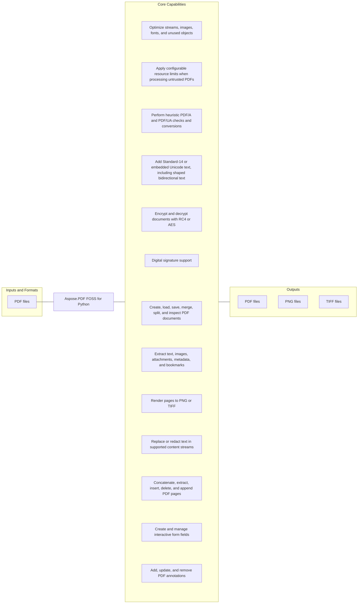

# Aspose.PDF FOSS for Python

[](https://github.com/aspose-pdf-foss/Aspose-PDF-FOSS-for-Python/tree/537b8273b185e4f7440b201cacad56567e55b2f0)   [](LICENSE) [](https://github.com/aspose-pdf-foss/Aspose-PDF-FOSS-for-Python/graphs/contributors)

Aspose.PDF FOSS for Python is an open-source library for developers using Python. It reads PDF files and writes PDF files, PNG files, and TIFF files.

Aspose.PDF FOSS for Python is an open-source Python library for creating,
reading, editing, rendering, and validating PDF documents.
The package is implemented in Python and ships type information. The project is
currently in alpha, so APIs and feature coverage may evolve before the first
stable release.

## Navigation

- [At a Glance](#at-a-glance)
- [Key Capabilities](#key-capabilities)
- [Installation](#installation)
- [Quick Start](#quick-start)
- [Additional Examples](#additional-examples)
- [API Reference](#api-reference)
- [Documentation and Resources](#documentation-and-resources)
- [Scope and Limitations](#scope-and-limitations)
- [Development and Testing](#development-and-testing)
- [Security](#security)
- [Contributing](#contributing)
- [License](#license)

## At a Glance



## Key Capabilities

- **Create and manage PDF documents** - Load, save, merge, and inspect files throughout the document lifecycle. Available through the public `Document` API.
- **Extract images and attached files from PDF files** - Retrieve text, embedded images, and file attachments.
- **Render pages to PNG or TIFF** - Produce PNG and TIFF image output from individual pages. Available through the public `Page` API.
- **Replace or redact text in supported content streams** - Change supported content through the public object model.
- **Concatenate, extract, insert, delete, and append PDF pages** - Reorder pages or move selected pages between documents. Available through the public `Page` API.
- **Create and manage interactive form fields** - Work with interactive data-entry controls and their values. Available through the public `Form` and `Field` APIs.
- **Add, update, and remove PDF annotations** - Manage annotations as document content changes. Available through the public `Annotation` API.
- **Optimize streams, images, fonts, and unused objects** - Compress streams and consolidate unused image, font, and object resources.
- **Configure PDF resource limits** - Control resource-use limits during document processing.
- **Validate and convert PDF/A and PDF/UA documents** - Check archival and accessibility conformance profiles.
- **Encrypt and decrypt documents with RC4 or AES** - Protect PDF content with RC4 or AES encryption. Available through the public `Document` API.
- **Work with PDF digital signatures** - Support document-signing workflows.

<details>
<summary>View Detailed Capabilities</summary>

- Add Standard-14 or embedded Unicode text, including shaped bidirectional
  text, plus images, lines, rectangles, annotations, attachments, and form data


- Create and inspect PDF signatures


- Apply configurable resource limits when processing untrusted PDFs


- Work with XMP metadata and low-level PDF objects


- Perform heuristic PDF/A and PDF/UA checks and conversions


See the [supported features](supported-features.md) document for the
detailed capability matrix and known limitations.


`Document(source, password=..., limits=...)` accepts a path, raw bytes, or a
binary stream and is equivalent to `Document().load_from(source, ...)`. A
missing file, non-PDF data, or a missing password raises; neither form ever
hands back a silently empty document.


</details>

## Installation

Install the package directly from its source repository:

```bash
git clone https://github.com/aspose-pdf-foss/Aspose-PDF-FOSS-for-Python.git
cd Aspose-PDF-FOSS-for-Python
git checkout --detach 537b8273b185e4f7440b201cacad56567e55b2f0
python -m pip install .
```

Use source installation for the `aspose-pdf-foss-for-python` distribution.

Optional dependency groups declared in `pyproject.toml`:
- `dev`: `python -m pip install ".[dev]"`
- `fuzz`: `python -m pip install ".[fuzz]"`
- `images`: `python -m pip install ".[images]"`
- `text-layout`: `python -m pip install ".[text-layout]"`
- `woff2`: `python -m pip install ".[woff2]"`

Required runtime dependencies declared in `pyproject.toml`: `cryptography>=42`, `asn1crypto>=1.5`.

- optional capability: `python -m pip install Pillow`

<details>
<summary>View Dependency and Extra Details</summary>

- `cryptography`


- `asn1crypto`


Optional extras add Pillow-based image support, Brotli-based WOFF2 decoding,
and HarfBuzz/bidi complex-text layout:


</details>

## Quick Start

```python
from aspose_pdf import Document

with Document() as document:
    page = document.pages.add()
    page.add_text(
        "Hello from Aspose.PDF FOSS for Python!",
        x=72,
        y=720,
        font_size=18,
    )
    document.save("hello.pdf")
```

<details>
<summary>View Additional Quick Start Details</summary>

For Unicode outside the Standard-14 encodings, provide an embeddable
TrueType/OpenType font as bytes, a path, or a `FontDescriptor`:


The writer creates a subset Type0/CID font, two-byte character codes,
`/ToUnicode`, widths, and the required CID-to-glyph mapping. A character that
the supplied font cannot represent raises `FontEmbeddingException` instead of
silently writing `.notdef`.


Install the `text-layout` extra and pass `TextLayoutOptions` for OpenType
shaping, bidirectional runs, ordered font fallback, and width-constrained line
layout:


Logical text is retained for extraction while glyphs are painted in their
shaped visual order.


</details>

## Additional Examples

Expand this section to view examples for creating a PDF, exporting a document to PDF, reading a document, and extracting text, plus 3 more workflows.

<details>
<summary>View additional examples and results</summary>

### Create a PDF

```python
from aspose_pdf import Document

with Document() as document:
    page = document.pages.add()
    page.add_text(
        "Hello from Aspose.PDF FOSS!",
        x=72,
        y=720,
        font_size=18,
    )
    document.save("hello.pdf")
```

### Export a Document to PDF

```python
with Document() as document:
    page = document.pages.add()
    page.add_text(
        "Latin Č · Кириллица · Ελληνικά · 漢字",
        x=72,
        y=720,
        font="NotoSans-Regular.ttf",
    )
    document.save("unicode.pdf")
```

### Export a Document to PDF with Document

```python
from aspose_pdf import Document, TextLayoutOptions

with Document() as document:
    page = document.pages.add()
    page.add_text(
        "English العربية 123",
        x=72,
        y=720,
        font_size=16,
        font="NotoSansArabic-Regular.ttf",
        layout=TextLayoutOptions(
            fallback_fonts=["NotoSans-Regular.ttf"],
            max_width=300,
            alignment="start",
            language="ar",
        ),
    )
    document.save("complex-text.pdf")
```

### Read a Document

```python
from aspose_pdf import Document

with Document("input.pdf") as document:
    print(f"Pages: {document.page_count}")
    print(f"PDF version: {document.version}")
    print(document.info)
```

### Extract Text

```python
from aspose_pdf import PdfExtractor

with PdfExtractor() as extractor:
    extractor.bind_pdf("input.pdf")
    extractor.extract_text()
    print(extractor.get_text())
```

### Merge PDF Files

```python
from aspose_pdf import PdfFileEditor

with PdfFileEditor() as editor:
    if not editor.concatenate(["part-1.pdf", "part-2.pdf"], "merged.pdf"):
        raise RuntimeError(editor.last_exception)
```

### Render a Page

```python
from aspose_pdf import Document

with Document() as document:
    document.load_from("input.pdf")
    document.pages[0].save_as_image("page-1.png", dpi=144)
```


</details>

## API Reference

The package declares 152 public exports across 20 export namespaces. Package namespaces include `aspose_pdf`, `aspose_pdf.annotations`, `aspose_pdf.clustering`, `aspose_pdf.engine.data`, `aspose_pdf.engine.primitives`, `aspose_pdf.generated`, `aspose_pdf.security`.

<details>
<summary>View public API by namespace</summary>

### Aspose.PDF Namespace (`aspose_pdf`)

| Type | Description |
| --- | --- |
| `AF_RELATIONSHIPS` | Defines the `AF_RELATIONSHIPS` public constant. |
| `Action` | Represents an Action in the public Aspose.PDF API. |
| `Annotation` | Represents an Annotation in the public Aspose.PDF API. Supports generating appearance, retrieving property, and setting property. Includes 10 additional members. |
| `AnnotationCollection` | Represents an Annotation Collection in the public Aspose.PDF API. Supports clearing content, generating appearances, and inserting content. Includes 2 additional members. |
| `AnnotationFlags` | Represents an Annotation Flags in the public Aspose.PDF API. Inherits from `IntFlag`. |
| `AnnotationType` | Enumerates annotation type values. Values include `CARET`, `CIRCLE`, and `FILE_ATTACHMENT` and 21 more. |
| `ByteArrayDataSource` | Represents a Byte Array Data Source in the public Aspose.PDF API. Supports reading bytes and writing bytes. Exposes data. Inherits from `DataSource`. |
| `CertificationLevel` | Enumerates certification level values. Values include `FORM_FILLING`, `FORM_FILLING_AND_ANNOTATIONS`, and `NO_CHANGES` and 1 more. |
| `DataSource` | Represents a Data Source in the public Aspose.PDF API. Supports reading bytes and writing bytes. |
| `Destination` | Represents a Destination in the public Aspose.PDF API. |
| `Document` | Represents a PDF document through the Aspose.PDF API. Supports adding attachments, tagging document content automatically, and changing passwords. Includes 21 additional members. |
| `Field` | Represents a Field in the public Aspose.PDF API. Supports removing content. Exposes field type and name. Includes 1 additional member. |
| `FieldType` | Enumerates field type values. Values include `CHECKBOX`, `COMBOBOX`, and `LISTBOX` and 4 more. |
| `FileDataSource` | Represents a File Data Source in the public Aspose.PDF API. Supports reading bytes and writing bytes. Inherits from `DataSource`. |
| `FileFontSource` | Represents a File Font Source in the public Aspose.PDF API. Supports retrieving font definitions. Inherits from `FontSource`. |
| `FileSpecification` | Represents a File Specification in the public Aspose.PDF API. Supports saving document output. Exposes contents and creation date. Includes 6 additional members. |
| `FitBDestination` | Represents a Fit B Destination in the public Aspose.PDF API. Exposes page. Inherits from `Destination`. |
| `FitBHDestination` | Represents a Fit BH Destination in the public Aspose.PDF API. Exposes page and top. Inherits from `Destination`. |
| `FitBVDestination` | Represents a Fit BV Destination in the public Aspose.PDF API. Exposes left and page. Inherits from `Destination`. |
| `FitDestination` | Represents a Fit Destination in the public Aspose.PDF API. Exposes page. Inherits from `Destination`. |
| `FitHDestination` | Represents a Fit H Destination in the public Aspose.PDF API. Exposes page and top. Inherits from `Destination`. |
| `FitRDestination` | Represents a Fit R Destination in the public Aspose.PDF API. Exposes bottom, left, and page. Inherits from `Destination`. Includes 2 additional members. |
| `FitVDestination` | Represents a Fit V Destination in the public Aspose.PDF API. Exposes left and page. Inherits from `Destination`. |
| `FolderFontSource` | Represents a Folder Font Source in the public Aspose.PDF API. Supports retrieving font definitions. Inherits from `FontSource`. |
| `FontDescriptor` | Represents a Font Descriptor in the public Aspose.PDF API. Supports retrieving font bytes. Exposes has font data. Includes 1 additional member. |
| `FontEmbeddingException` | Signals a font embedding condition; derives from `AsposePdfException`. |
| `FontRepository` | Represents a Font Repository in the public Aspose.PDF API. Supports adding sources, clearing sources, and finding font. Includes 5 additional members. |
| `FontSource` | Represents a Font Source in the public Aspose.PDF API. Supports retrieving font definitions. |
| `Form` | Represents a Form in the public Aspose.PDF API. Supports adding checkboxes, adding combo boxes, and adding list boxes. Includes 8 additional members. |
| `FormType` | Enumerates form type values. Values include `from_string`, `DYNAMIC`, and `STANDARD`. |
| `GoToAction` | Represents a Go To Action in the public Aspose.PDF API. Exposes destination. Inherits from `Action`. |
| `GoToRAction` | Represents a Go To R Action in the public Aspose.PDF API. Exposes destination and file. Inherits from `Action`. |
| `JavaScriptAction` | Represents a Java Script Action in the public Aspose.PDF API. Exposes script. Inherits from `Action`. |
| `LaunchAction` | Represents a Launch Action in the public Aspose.PDF API. Exposes file. Inherits from `Action`. |
| `LinkAnnotation` | Represents a Link Annotation in the public Aspose.PDF API. Supports generating appearance, retrieving property, and setting property. Inherits from `Annotation`. Includes 10 additional members. |
| `MarkupAnnotation` | Represents a Markup Annotation in the public Aspose.PDF API. Supports generating appearance, retrieving property, and setting property. Inherits from `Annotation`. Includes 10 additional members. |
| `MemoryFontSource` | Represents a Memory Font Source in the public Aspose.PDF API. Supports retrieving font definitions. Inherits from `FontSource`. |
| `MergeOptions` | Configures Merge operations through the Aspose.PDF API. Supports adding data sources, adding inputs, and adding outputs. Inherits from `PluginOptions`. Includes 2 additional members. |
| `Merger` | Represents a Merger in the public Aspose.PDF API. Supports processing documents. Inherits from `PdfPlugin`. |
| `NamedAction` | Represents a Named Action in the public Aspose.PDF API. Exposes name. Inherits from `Action`. |
| `NamespaceProvider` | Represents a Namespace Provider in the public Aspose.PDF API. Supports retrieving namespace URI, retrieving prefix, and retrieving URI. Inherits from `XmpNamespaceProvider`. Includes 4 additional members. |
| `OperationResult` | Stores Operation result data through the Aspose.PDF API. Supports checking for byte-array results, checking for string results, and saving document output. Includes 2 additional members. |
| `OptimizationOptions` | Configures Optimization operations through the Aspose.PDF API. Supports serializing values to a dictionary. Exposes allow reuse page content and compress fonts. Includes 11 additional members. |
| `OptimizeOptions` | Configures Optimize operations through the Aspose.PDF API. Supports adding data sources, adding inputs, and adding outputs. Inherits from `PluginOptions`. Includes 2 additional members. |
| `Optimizer` | Represents an Optimizer in the public Aspose.PDF API. Supports processing documents. Inherits from `PdfPlugin`. |
| `Page` | Represents a Page in the public Aspose.PDF API. Supports traversing content with a visitor, adding images, and adding links. Includes 14 additional members. |
| `PageCollection` | Represents a Page Collection in the public Aspose.PDF API. Supports clearing content, retrieving enumerator, and locating items. Includes 6 additional members. |
| `PdfAValidateOptions` | Configures PDF/A validation operations through the Aspose.PDF API. Supports adding inputs. Exposes font lookup directory and inputs. Includes 3 additional members. |
| `PdfLoadLimits` | Represents a PDF Load Limits in the public Aspose.PDF API. Exposes max codec work bytes, max compression ratio, and max container items. Includes 14 additional members. |
| `TextLayoutOptions` | Configures Text Layout operations through the Aspose.PDF API. Exposes alignment, direction, and fallback fonts. Includes 5 additional members. |
| `XmpPacket` | Represents an XMP Packet in the public Aspose.PDF API. Supports retrieving array, retrieving bool, and retrieving date. Includes 18 additional members. |
| `PdfExtractor` | Represents a PDF Extractor in the public Aspose.PDF API. Supports binding PDF, extracting attachment, and extracting image. Includes 11 additional members. |
| `PdfSignature` | Represents a PDF Signature in the public Aspose.PDF API. Exposes byte range, contact info, and contents. Includes 10 additional members. |
| `StructureElement` | Represents a Structure Element in the public Aspose.PDF API. Supports adding children, moving to, and removing content. Includes 8 additional members. |
| `ValidationResult` | Stores validation result data through the Aspose.PDF API. Exposes certification level, errors, and is valid. Includes 8 additional members. |
| `UnsignedContent` | Represents an Unsigned Content in the public Aspose.PDF API. Supports adding annotations, adding form fields, and adding pages. Includes 7 additional members. |
| `PdfFileEditor` | Represents a PDF File Editor in the public Aspose.PDF API. Supports adding page breaks, appending content, and inserting content. Includes 6 additional members. |
| `ValidationOptions` | Configures validation operations through the Aspose.PDF API. Supports serializing values to a dictionary. Exposes allow self signed and check revocation. Includes 6 additional members. |
| `PdfAValidationResult` | Stores PDF/A validation result data through the Aspose.PDF API. Supports adding errors, adding warnings, and serializing values to a dictionary. Includes 5 additional members. |
| `RasterizedPage` | Represents a Rasterized Page in the public Aspose.PDF API. Supports retrieving pixel, saving document output, and encoding page content as PNG. Includes 5 additional members. |
| `PdfUaValidationResult` | Stores PDF/UA validation result data through the Aspose.PDF API. Supports adding errors, adding warnings, and serializing values to a dictionary. Includes 4 additional members. |
| `Plugin` | Enumerates plugin values. Values include `CONVERTER`, `EDITOR`, and `EXTRACTOR` and 4 more. |
| `XmpField` | Represents an XMP Field in the public Aspose.PDF API. Exposes is URI, language, and name. Includes 4 additional members. |
| `TaggedContent` | Represents a Tagged Content in the public Aspose.PDF API. Supports adding elements, elementing for mcid, and removing content. Includes 3 additional members. |
| `PluginOptions` | Configures Plugin operations through the Aspose.PDF API. Supports adding data sources, adding inputs, and adding outputs. Includes 2 additional members. |
| `XmpArray` | Represents an XMP Array in the public Aspose.PDF API. Supports removing content. Exposes items and kind. Includes 2 additional members. |
| `XmpProperty` | Represents an XMP Property in the public Aspose.PDF API. Supports adding qualifiers and removing qualifier. Exposes field. Includes 2 additional members. |
| `RevocationStatus` | Enumerates revocation status values. Values include `GOOD`, `NOT_CHECKED`, and `REVOKED` and 1 more. |
| `TrustStatus` | Enumerates trust status values. Values include `BROKEN`, `SELF_SIGNED`, and `TRUSTED` and 1 more. |
| `UnsignedContentAbsorber` | Represents an Unsigned Content Absorber in the public Aspose.PDF API. Supports retrieving extracted and checking for extracted. Includes 2 additional members. |
| `XYZDestination` | Represents an XYZ Destination in the public Aspose.PDF API. Exposes left, page, and top. Inherits from `Destination`. Includes 1 additional member. |
| `XmpStruct` | Represents an XMP Struct in the public Aspose.PDF API. Exposes fields and namespace provider. Includes 2 additional members. |
| `ValidationMode` | Enumerates validation mode values. Values include `AUTO`, `OFFLINE`, and `ONLINE`. |
| `ValidationStatus` | Enumerates validation status values. Values include `INVALID`, `UNKNOWN`, and `VALID`. |
| `PdfUaValidateOptions` | Configures PDF/UA validation operations through the Aspose.PDF API. Supports adding inputs. Exposes inputs. |
| `StreamDataSource` | Represents a Stream Data Source in the public Aspose.PDF API. Supports reading bytes and writing bytes. Inherits from `DataSource`. |
| `ValidationMethod` | Enumerates validation method values. Values include `LTIP` and `PKCS7`. |
| `PdfAValidator` | Represents a PDF/A Validator in the public Aspose.PDF API. Supports processing documents. |
| `PdfPlugin` | Represents a PDF Plugin in the public Aspose.PDF API. Supports processing documents. |
| `PdfUaValidator` | Represents a PDF/UA Validator in the public Aspose.PDF API. Supports processing documents. |
| `ResultContainer` | Represents a Result Container in the public Aspose.PDF API. Exposes result collection. |
| `Splitter` | Represents a Splitter in the public Aspose.PDF API. Supports processing documents. Inherits from `PdfPlugin`. |
| `SystemFontSource` | Represents a System Font Source in the public Aspose.PDF API. Supports retrieving font definitions. Inherits from `FontSource`. |
| `TextExtractor` | Represents a Text Extractor in the public Aspose.PDF API. Supports processing documents. Inherits from `PdfPlugin`. |
| `URIAction` | Represents a URI Action in the public Aspose.PDF API. Exposes URI. Inherits from `Action`. |
| `PdfResourceLimitException` | Signals a PDF resource limit condition; derives from `PdfValidationException`. |
| `SplitOptions` | Configures Split operations through the Aspose.PDF API. Supports adding data sources, adding inputs, and adding outputs. Inherits from `PluginOptions`. Includes 2 additional members. |
| `TextExtractorOptions` | Configures Text Extractor operations through the Aspose.PDF API. Supports adding data sources, adding inputs, and adding outputs. Inherits from `PluginOptions`. Includes 2 additional members. |
| `UnsupportedFeatureException` | Signals an unsupported feature condition; derives from `AsposePdfException`. |
| `parse_xmp` | Parses XMP metadata from source content. |
| `serialize_xmp` | Serializes XMP metadata for PDF output. |

### Aspose.PDF.Annotations Namespace (`aspose_pdf.annotations`)

| Type | Description |
| --- | --- |
| `Annotation` | The `aspose_pdf.annotations` namespace re-exports `Annotation` from the primary `aspose_pdf` namespace. |
| `AnnotationCollection` | The `aspose_pdf.annotations` namespace re-exports `AnnotationCollection` from the primary `aspose_pdf` namespace. |
| `AnnotationFlags` | The `aspose_pdf.annotations` namespace re-exports `AnnotationFlags` from the primary `aspose_pdf` namespace. |
| `AnnotationType` | The `aspose_pdf.annotations` namespace re-exports `AnnotationType` from the primary `aspose_pdf` namespace. |
| `LinkAnnotation` | The `aspose_pdf.annotations` namespace re-exports `LinkAnnotation` from the primary `aspose_pdf` namespace. |
| `MarkupAnnotation` | The `aspose_pdf.annotations` namespace re-exports `MarkupAnnotation` from the primary `aspose_pdf` namespace. |
| `Name` | Represents a Name in the public annotations API for Aspose.PDF. |

### Aspose.PDF.Attachments Namespace (`aspose_pdf.attachments`)

| Type | Description |
| --- | --- |
| `FileSpecification` | The `aspose_pdf.attachments` namespace re-exports `FileSpecification` from the primary `aspose_pdf` namespace. |

### Aspose.PDF.CGM Namespace (`aspose_pdf.cgm`)

| Type | Description |
| --- | --- |
| `CgmLoadOptions` | Configures CGM Load operations through the Aspose.PDF API. |

### Aspose.PDF.Clustering Namespace (`aspose_pdf.clustering`)

| Type | Description |
| --- | --- |
| `Cluster` | Represents a Cluster in the public clustering API for Aspose.PDF. |
| `ClusterCollection` | Represents a Cluster Collection in the public clustering API for Aspose.PDF. |
| `DataPoint` | Represents a Data Point in the public clustering API for Aspose.PDF. |

### Aspose.PDF.Color Namespace (`aspose_pdf.color`)

| Type | Description |
| --- | --- |
| `Color` | Represents a Color in the public color API for Aspose.PDF. |
| `GradientAxialShading` | Represents a Gradient Axial Shading in the public color API for Aspose.PDF. |
| `Point` | Represents a Point in the public color API for Aspose.PDF. |

### Aspose.PDF.Document Namespace (`aspose_pdf.document`)

| Type | Description |
| --- | --- |
| `Document` | The `aspose_pdf.document` namespace re-exports `Document` from the primary `aspose_pdf` namespace. |

### Aspose.PDF.Drawing Namespace (`aspose_pdf.drawing`)

| Type | Description |
| --- | --- |
| `Rectangle` | Represents a Rectangle in the public drawing API for Aspose.PDF. |

### Aspose.PDF.Exceptions Namespace (`aspose_pdf.exceptions`)

| Type | Description |
| --- | --- |
| `AsposePdfException` | Represents an Aspose.PDF Exception in the public exceptions API for Aspose.PDF. |
| `DeprecatedFeatureException` | Represents a Deprecated Feature Exception in the public exceptions API for Aspose.PDF. |
| `FontEmbeddingException` | The `aspose_pdf.exceptions` namespace re-exports `FontEmbeddingException` from the primary `aspose_pdf` namespace. |
| `IncorrectCMapUsageException` | Represents an Incorrect C Map Usage Exception in the public exceptions API for Aspose.PDF. |
| `InvalidPasswordException` | Represents an Invalid Password Exception in the public exceptions API for Aspose.PDF. |
| `InvalidPdfFileFormatException` | Represents an Invalid PDF File Format Exception in the public exceptions API for Aspose.PDF. |
| `InvalidValueFormatException` | Represents an Invalid Value Format Exception in the public exceptions API for Aspose.PDF. |
| `PdfException` | Represents a PDF Exception in the public exceptions API for Aspose.PDF. |
| `PdfIOException` | Represents a PDF IO Exception in the public exceptions API for Aspose.PDF. |
| `PdfParseException` | Represents a PDF Parse Exception in the public exceptions API for Aspose.PDF. |
| `PdfResourceLimitException` | The `aspose_pdf.exceptions` namespace re-exports `PdfResourceLimitException` from the primary `aspose_pdf` namespace. |
| `PdfSecurityException` | Represents a PDF Security Exception in the public exceptions API for Aspose.PDF. |
| `PdfValidationException` | Represents a PDF Validation Exception in the public exceptions API for Aspose.PDF. |
| `UnsupportedFeatureException` | The `aspose_pdf.exceptions` namespace re-exports `UnsupportedFeatureException` from the primary `aspose_pdf` namespace. |

### Aspose.PDF.Facades Namespace (`aspose_pdf.facades`)

| Type | Description |
| --- | --- |
| `PdfExtractor` | The `aspose_pdf.facades` namespace re-exports `PdfExtractor` from the primary `aspose_pdf` namespace. |
| `PdfFileEditor` | The `aspose_pdf.facades` namespace re-exports `PdfFileEditor` from the primary `aspose_pdf` namespace. |

### Aspose.PDF.Font Registry Namespace (`aspose_pdf.font_registry`)

| Type | Description |
| --- | --- |
| `FontDescriptor` | The `aspose_pdf.font_registry` namespace re-exports `FontDescriptor` from the primary `aspose_pdf` namespace. |
| `FontRegistry` | Represents a Font Registry in the public font registry API for Aspose.PDF. |

### Aspose.PDF.Font Repository Namespace (`aspose_pdf.font_repository`)

| Type | Description |
| --- | --- |
| `FileFontSource` | The `aspose_pdf.font_repository` namespace re-exports `FileFontSource` from the primary `aspose_pdf` namespace. |
| `FolderFontSource` | The `aspose_pdf.font_repository` namespace re-exports `FolderFontSource` from the primary `aspose_pdf` namespace. |
| `FontDescriptor` | The `aspose_pdf.font_repository` namespace re-exports `FontDescriptor` from the primary `aspose_pdf` namespace. |
| `FontRepository` | The `aspose_pdf.font_repository` namespace re-exports `FontRepository` from the primary `aspose_pdf` namespace. |
| `FontSource` | The `aspose_pdf.font_repository` namespace re-exports `FontSource` from the primary `aspose_pdf` namespace. |
| `MemoryFontSource` | The `aspose_pdf.font_repository` namespace re-exports `MemoryFontSource` from the primary `aspose_pdf` namespace. |
| `SystemFontSource` | The `aspose_pdf.font_repository` namespace re-exports `SystemFontSource` from the primary `aspose_pdf` namespace. |

### Aspose.PDF.Forms Namespace (`aspose_pdf.forms`)

| Type | Description |
| --- | --- |
| `Field` | The `aspose_pdf.forms` namespace re-exports `Field` from the primary `aspose_pdf` namespace. |
| `FieldType` | The `aspose_pdf.forms` namespace re-exports `FieldType` from the primary `aspose_pdf` namespace. |
| `Form` | The `aspose_pdf.forms` namespace re-exports `Form` from the primary `aspose_pdf` namespace. |
| `FormType` | The `aspose_pdf.forms` namespace re-exports `FormType` from the primary `aspose_pdf` namespace. |
| `InvalidFormTypeOperationException` | Represents an Invalid Form Type Operation Exception in the public forms API for Aspose.PDF. |
| `UnsignedContent` | The `aspose_pdf.forms` namespace re-exports `UnsignedContent` from the primary `aspose_pdf` namespace. |
| `UnsignedContentAbsorber` | The `aspose_pdf.forms` namespace re-exports `UnsignedContentAbsorber` from the primary `aspose_pdf` namespace. |

### Aspose.PDF.Generated Namespace (`aspose_pdf.generated`)

| Type | Description |
| --- | --- |
| `annotations` | Exposes generated annotations compatibility definitions. |

### Aspose.PDF.Geometry Namespace (`aspose_pdf.geometry`)

| Type | Description |
| --- | --- |
| `Matrix3D` | Represents a Matrix3D in the public geometry API for Aspose.PDF. |
| `Point3D` | Represents a Point3D in the public geometry API for Aspose.PDF. |
| `Rectangle` | The `aspose_pdf.geometry` namespace re-exports `Rectangle` from the primary `aspose_pdf.drawing` namespace. |

### Aspose.PDF.Graphics Namespace (`aspose_pdf.graphics`)

| Type | Description |
| --- | --- |
| `GraphicElementCollection` | Represents a Graphic Element Collection in the public graphics API for Aspose.PDF. |
| `GraphicsAbsorber` | Represents a Graphics Absorber in the public graphics API for Aspose.PDF. |
| `InvalidOperationException` | Represents an Invalid Operation Exception in the public graphics API for Aspose.PDF. |

### Aspose.PDF.Engine.Simple PDF Namespace (`aspose_pdf.engine.simple_pdf`)

| Type | Description |
| --- | --- |
| `SimplePdf` | Represents a Simple PDF in the public simple PDF API for Aspose.PDF. Supports adding annotations, adding images, and adding image to pages. Includes 21 additional members. |
| `CosExtractor` | Represents a Cos Extractor in the public simple PDF API for Aspose.PDF. Supports attaching stream decryption, detecting encryption, and checking encryption-password access. Includes 21 additional members. |

### Aspose.PDF.Engine.Encryption Namespace (`aspose_pdf.engine.encryption`)

| Type | Description |
| --- | --- |
| `EncryptionUtils` | Represents an Encryption Utils in the public encryption API for Aspose.PDF. Supports computing file encryption key, computing hash v5, and computing owner key v4. Includes 12 additional members. |

### Aspose.PDF.Engine.Incremental Update Namespace (`aspose_pdf.engine.incremental_update`)

| Type | Description |
| --- | --- |
| `IncrementalUpdate` | Represents an Incremental Update in the public incremental update API for Aspose.PDF. Supports adding new objects, building incremental trailer, and building incremental xref. Includes 12 additional members. |

### Aspose.PDF.Logical Structure Namespace (`aspose_pdf.logical_structure`)

| Type | Description |
| --- | --- |
| `StructureTypeStandard` | Enumerates structure type standard values. Values include `DIV`, `DOCUMENT`, and `P` and 12 more. |

</details>

## Documentation and Resources

- **[Full API reference](https://reference.aspose.org/pdf/python/)** - the complete browsable reference for the public API.
- Found a bug or have a feature request? [Open an issue](https://github.com/aspose-pdf-foss/Aspose-PDF-FOSS-for-Python/issues) on GitHub.

## Scope and Limitations

- Page rendering supports common page content; it is not represented as complete PDF graphics coverage.
- PDF/A and PDF/UA checks are heuristic signals, not certification-grade conformance.
- OCR is not implemented, and layout reflow remains outside the prerelease scope.
- The lightweight signature check does not perform full PKCS#7 certificate-chain validation.
- Compatibility surfaces may name features that are unavailable and must fail explicitly.
- The documented feature set is bounded by the active test suite rather than every exposed compatibility name.

The package manifest classifies this release as **Alpha**. The distribution includes the [`src/aspose_pdf/py.typed`](src/aspose_pdf/py.typed) type marker.

Review [`supported-features.md`](supported-features.md) for the repository's detailed implementation boundaries.

This repository contains [Aspose.PDF FOSS for Python](https://products.aspose.org/pdf/). For requirements beyond the FOSS scope described above, explore the [full-featured Aspose.PDF Enterprise Edition](https://products.aspose.com/pdf/). It is a separate product, so features and APIs may differ.

## Development and Testing

The repository includes 187 test files, 4 source-bound validation commands.

<details>
<summary>View development and testing resources</summary>

### Tests

- [`tests/conftest.py`](tests/conftest.py)
- [`tests/helpers_make_pdfs.py`](tests/helpers_make_pdfs.py)
- [`tests/test_acc01_font_embedding.py`](tests/test_acc01_font_embedding.py)
- [`tests/test_aes_key_derivation.py`](tests/test_aes_key_derivation.py)
- [`tests/test_agl.py`](tests/test_agl.py)
- [`tests/test_algorithm_2b_v5r6.py`](tests/test_algorithm_2b_v5r6.py)
- [`tests/test_annotation_appearance_decorations.py`](tests/test_annotation_appearance_decorations.py)
- [Browse all test files](tests)

### Focused Commands and Repository Scripts

```bash
scripts/build.sh
```

```bash
scripts/check.sh
```

```bash
python -m pip install -e .
```

```bash
python -m pytest tests
```


</details>

<details>
<summary>View Repository Layout Details</summary>

| Path | Description |
| --- | --- |
| `src/aspose_pdf/` | Public Python package |
| `src/aspose_pdf/engine/` | PDF parser, writer, filters, renderer, encryption, and signing internals |
| `src/aspose_pdf/generated/` | Supported API compatibility modules |
| `tests/` | Unit, regression, and integration tests |
| `supported-features.md` | Detailed feature coverage and limitations |
| `scripts/` | Local check and build commands |
| `.github/workflows/` | CI and publishing workflows |


</details>

## Security

PDF files are untrusted binary input. Loading uses a generous default
`PdfLoadLimits` policy that bounds input size, parser/object complexity,
decoded streams, page content, images, and rasterization. Customize the policy
when an application needs tighter limits:


```python
from aspose_pdf import Document, PdfLoadLimits, PdfResourceLimitException

limits = PdfLoadLimits(
    max_input_bytes=64 * 1024 * 1024,
    max_decoded_stream_bytes=16 * 1024 * 1024,
    max_image_pixels=25_000_000,
)

try:
    with Document(limits=limits) as document:
        document.load_from("input.pdf")
except PdfResourceLimitException as error:
    print(f"PDF rejected: {error}")
```


The same `limits=` argument is accepted by `Document.load_from()` and
`Document.open_streaming()`; lazy decoding continues to use the document's
shared budget. `PdfLoadLimits.unlimited()` disables every safeguard and should
only be used for trusted input in an environment with external resource
controls. These limits reduce known parser and allocation risks but are not an
exhaustive DoS sandbox; isolate highly hostile workloads at the process level.


If you discover a security issue, follow the [security policy](SECURITY.md) and
use GitHub private vulnerability reporting instead of opening a public issue.


## Contributing

Issues and pull requests are welcome. Please:


1. Keep changes focused.


2. Add tests for new behavior and bug fixes.


3. Write code comments and docstrings in English.


4. Run `python -m ruff check src/` and `python -m pytest -q`.


5. Document public API changes and important limitations.


When reporting a parser or rendering problem, include a minimal PDF that can be
shared publicly whenever possible.


## License

This project is available under the [MIT License](LICENSE). It permits use, modification, distribution, and commercial use when the license and copyright notice are retained.
